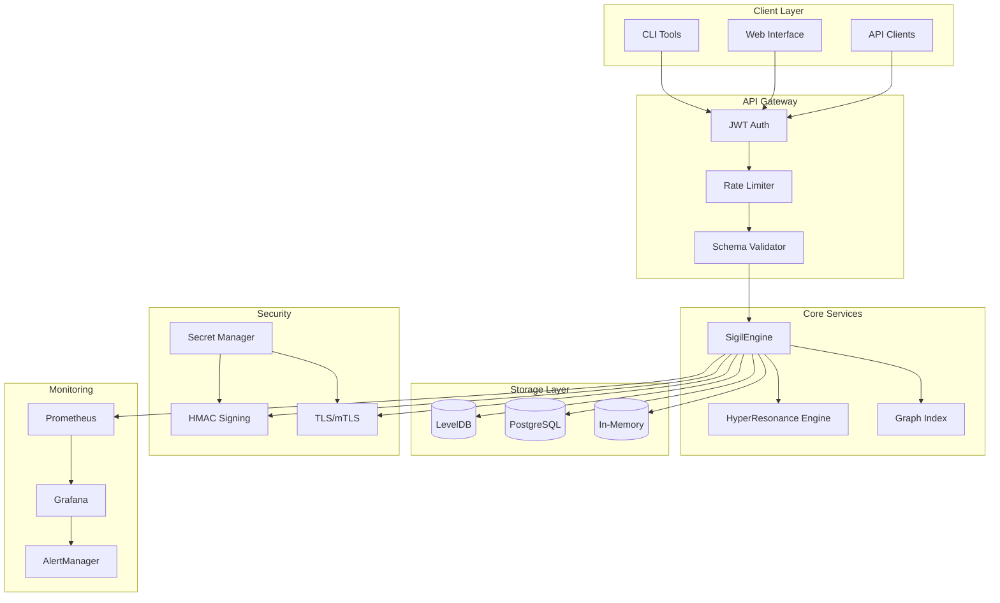

# 🏗️ Sigil-DNA System Architecture

## Key Components

### **SigilEngine** - Unified Core
- Encode/decode/verify/revoke operations
- Dependency injection for storage and crypto
- Tenant isolation and RBAC enforcement

### **Storage Abstraction**
- LevelDB for high-performance local storage
- PostgreSQL for enterprise deployments  
- In-memory for testing and development

### **Security Layers**
- JWT authentication with JWKS validation
- Per-tenant rate limiting with Redis clustering
- TLS/mTLS for all external communications
- HMAC signing with automated secret rotation

### **Advanced Features**
- HyperResonance matching for similarity queries
- Graph indexing for relationship traversal
- Comprehensive monitoring with Prometheus/Grafana
- Chaos engineering for resilience testing

## Data Flow

1. **Request** → JWT Auth → Rate Limiting → Schema Validation
2. **Processing** → SigilEngine → Storage Driver → Persistence
3. **Response** → Metrics Collection → Client
4. **Monitoring** → Prometheus → Grafana → Alerts