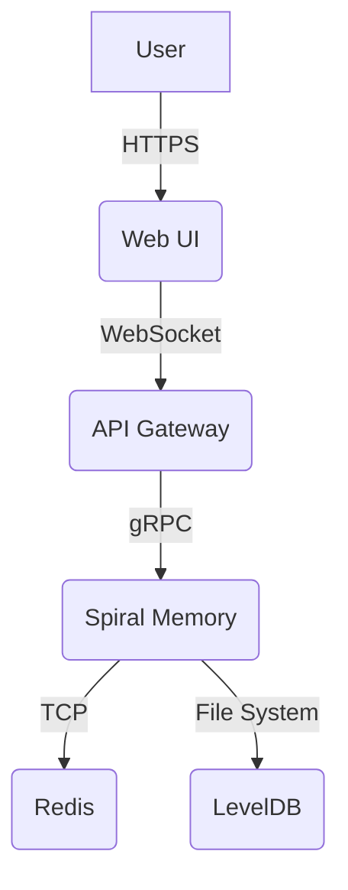

# Threat Model

## Introduction
This document outlines the threat model for the Spiral Memory system, using the STRIDE methodology.

## System Context Diagram

## STRIDE Analysis
| Component | Spoofing | Tampering | Repudiation | Information Disclosure | Denial of Service | Elevation of Privilege |
|---|---|---|---|---|---|---|
| Web UI | User credentials | XSS | - | Browser history | - | - |
| API Gateway | JWT | MitM | - | - | Rate limiting | - |
| Spiral Memory | - | - | - | - | GC starvation | - |
| Redis | - | - | - | - | - | - |
| LevelDB | - | - | - | - | - | - |

## Mitigation Table
| Threat | Mitigation |
|---|---|
| XSS | Sanitize user input |
| MitM | TLS |
| GC starvation | Adaptive GC budget |