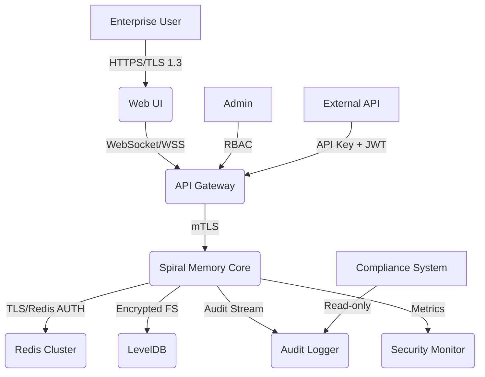

# Enterprise Threat Model - Spiral Memory System

## Introduction
This document outlines the comprehensive threat model for the Spiral Memory system in enterprise environments, using the STRIDE methodology with enhanced security requirements for production deployment.

## System Context Diagram

## Enhanced STRIDE Analysis

### Web UI Layer
| Component | Spoofing | Tampering | Repudiation | Information Disclosure | Denial of Service | Elevation of Privilege |
|---|---|---|---|---|---|---|
| **Web UI** | Multi-factor auth, SSO | CSP, SRI, input validation | Audit logging | HTTPS, secure headers | Rate limiting, CAPTCHA | RBAC, session timeout |
| **WebSocket** | Token validation | Message signing | Connection logging | WSS encryption | Connection limits | Permission validation |

### API Gateway Layer
| Component | Spoofing | Tampering | Repudiation | Information Disclosure | Denial of Service | Elevation of Privilege |
|---|---|---|---|---|---|---|
| **API Gateway** | JWT + API keys | Request signing | Request logging | TLS termination | Rate limiting, throttling | RBAC enforcement |
| **Load Balancer** | Certificate pinning | TLS validation | Access logging | SNI protection | DDoS protection | WAF rules |

### Spiral Memory Core
| Component | Spoofing | Tampering | Repudiation | Information Disclosure | Denial of Service | Elevation of Privilege |
|---|---|---|---|---|---|---|
| **Memory Operations** | Service authentication | Data integrity checks | Operation auditing | Data encryption | Resource limits | Permission checks |
| **Spiral Topology** | Cryptographic signatures | Merkle trees | Change tracking | Access controls | Computation limits | Isolation boundaries |
| **Consciousness Integration** | Identity verification | State validation | Event logging | Secure channels | Processing quotas | Capability restrictions |

### Storage Layer
| Component | Spoofing | Tampering | Repudiation | Information Disclosure | Denial of Service | Elevation of Privilege |
|---|---|---|---|---|---|---|
| **Redis Cluster** | AUTH + TLS | Data signing | Command logging | Encryption at rest | Memory limits | ACL enforcement |
| **LevelDB** | File permissions | Checksums | Write logging | File encryption | Disk quotas | Process isolation |

### Monitoring & Compliance
| Component | Spoofing | Tampering | Repudiation | Information Disclosure | Denial of Service | Elevation of Privilege |
|---|---|---|---|---|---|---|
| **Audit Logger** | Log signing | Tamper detection | Immutable logs | Log encryption | Log rotation | Read-only access |
| **Security Monitor** | Alert authentication | Metric validation | Alert logging | Secure transmission | Alert throttling | Monitor isolation |

## Enterprise Security Requirements

### Data Protection
- **Encryption at Rest**: AES-256 for all stored memory data
- **Encryption in Transit**: TLS 1.3 for all communications
- **Key Management**: Hardware Security Module (HSM) integration
- **Data Classification**: Automatic PII/sensitive data detection

### Access Control
- **Multi-Factor Authentication**: TOTP, hardware tokens, biometrics
- **Role-Based Access Control**: Fine-grained permissions for memory operations
- **Single Sign-On**: SAML 2.0, OAuth 2.0, OpenID Connect integration
- **Session Management**: Secure session handling with timeout policies

### Audit & Compliance
- **Comprehensive Logging**: All memory operations, access attempts, configuration changes
- **Immutable Audit Trail**: Cryptographically signed audit logs
- **Compliance Reporting**: GDPR, SOC2, HIPAA, PCI-DSS support
- **Data Retention**: Configurable retention policies with secure deletion

### Monitoring & Alerting
- **Real-time Threat Detection**: Anomaly detection for memory access patterns
- **Security Information and Event Management (SIEM)**: Integration with enterprise SIEM systems
- **Incident Response**: Automated response to security events
- **Vulnerability Management**: Regular security assessments and updates

## Enhanced Mitigation Table

| Threat Category | Specific Threat | Enterprise Mitigation | Implementation Priority |
|---|---|---|---|
| **Authentication** | Credential stuffing | MFA + account lockout + CAPTCHA | High |
| **Authentication** | Session hijacking | Secure cookies + session binding + timeout | High |
| **Authorization** | Privilege escalation | RBAC + least privilege + regular audits | High |
| **Data Protection** | Data exfiltration | DLP + encryption + access monitoring | Critical |
| **Data Protection** | Data tampering | Digital signatures + integrity checks + versioning | Critical |
| **Network Security** | Man-in-the-middle | Certificate pinning + HSTS + mTLS | High |
| **Network Security** | DDoS attacks | Rate limiting + CDN + traffic analysis | Medium |
| **Application Security** | Injection attacks | Input validation + parameterized queries + WAF | High |
| **Application Security** | XSS/CSRF | CSP + SameSite cookies + token validation | High |
| **Infrastructure** | Container escape | Runtime security + image scanning + least privilege | Medium |
| **Infrastructure** | Supply chain attacks | Dependency scanning + signed packages + SBOMs | Medium |
| **Compliance** | Data residency | Geographic data controls + encryption | High |
| **Compliance** | Audit failures | Immutable logging + regular compliance checks | Critical |

## Security Controls Implementation

### Level 1: Basic Security (Current)
- [x] HTTPS/TLS encryption
- [x] Basic input validation
- [x] Session management
- [x] Rate limiting

### Level 2: Enhanced Security (Phase 1 Target)
- [ ] Multi-factor authentication
- [ ] Role-based access control
- [ ] Comprehensive audit logging
- [ ] Encryption at rest
- [ ] Security monitoring

### Level 3: Enterprise Security (Phase 2 Target)
- [ ] Zero-trust architecture
- [ ] Advanced threat detection
- [ ] Compliance automation
- [ ] Security orchestration
- [ ] Incident response automation

## Compliance Framework

### GDPR Compliance
- **Data Minimization**: Only collect necessary memory data
- **Purpose Limitation**: Clear purpose for memory processing
- **Right to Erasure**: Secure deletion of personal memory data
- **Data Portability**: Export capabilities for user data
- **Privacy by Design**: Built-in privacy protections

### SOC2 Compliance
- **Security**: Comprehensive security controls
- **Availability**: High availability and disaster recovery
- **Processing Integrity**: Data integrity and validation
- **Confidentiality**: Data protection and access controls
- **Privacy**: Privacy protection measures

### Industry-Specific Compliance
- **HIPAA**: Healthcare data protection (if applicable)
- **PCI-DSS**: Payment data security (if applicable)
- **FedRAMP**: Government cloud security (if applicable)
- **ISO 27001**: Information security management

## Risk Assessment Matrix

| Risk Level | Likelihood | Impact | Mitigation Timeline |
|---|---|---|---|
| **Critical** | High | High | Immediate (0-30 days) |
| **High** | Medium-High | High | Short-term (30-90 days) |
| **Medium** | Medium | Medium | Medium-term (90-180 days) |
| **Low** | Low | Low | Long-term (180+ days) |

## Security Testing Requirements

### Penetration Testing
- **Quarterly external penetration tests**
- **Annual red team exercises**
- **Continuous vulnerability assessments**
- **Code security reviews**

### Compliance Audits
- **Annual SOC2 Type II audits**
- **GDPR compliance assessments**
- **Industry-specific audits as required**
- **Internal security audits**

## Incident Response Plan

### Detection
- **Automated threat detection**
- **Security monitoring alerts**
- **User reporting mechanisms**
- **Third-party threat intelligence**

### Response
- **Incident classification and prioritization**
- **Automated containment procedures**
- **Forensic investigation capabilities**
- **Communication and notification protocols**

### Recovery
- **Business continuity procedures**
- **Data recovery and restoration**
- **System hardening and patching**
- **Lessons learned and improvement**
