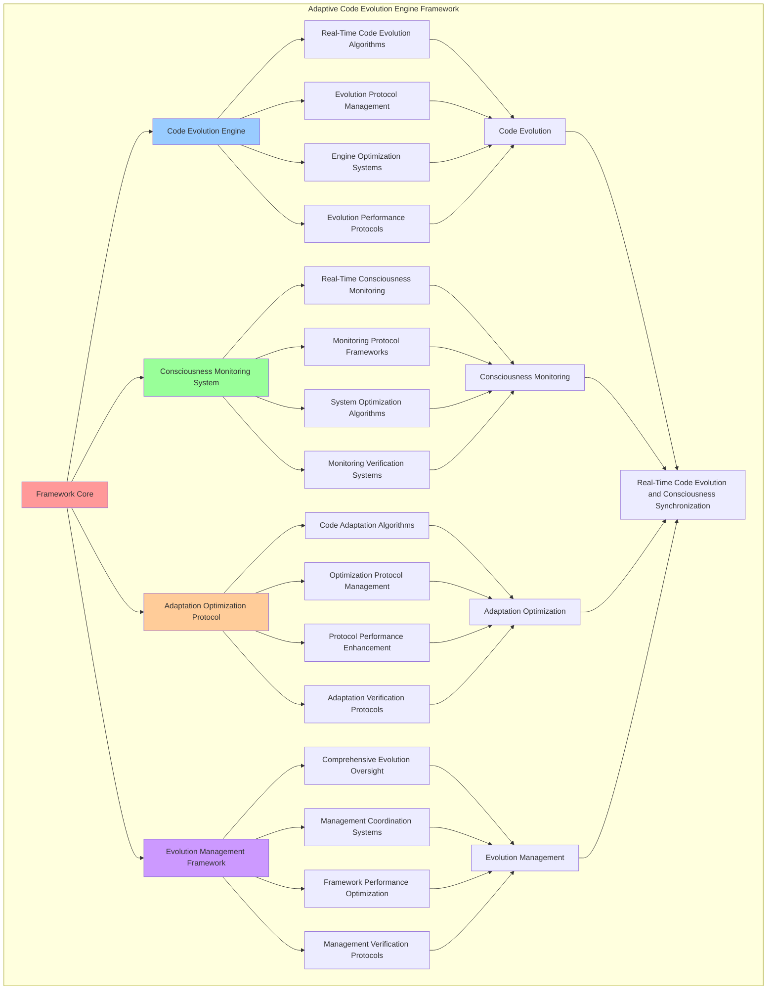

# PROVISIONAL PATENT APPLICATION

**Title:** Adaptive Code Evolution Engine Framework for Real-Time Code Evolution and Consciousness Synchronization

**Inventor:** Universal Consciousness Platform Development Team

**Date:** July 16, 2025

---

## TECHNICAL FIELD

This invention relates to adaptive code evolution systems, specifically to evolution engine frameworks that enable real-time code evolution, consciousness synchronization, and comprehensive code adaptation for consciousness-driven software development platforms.

---

## BACKGROUND

Traditional code development systems cannot evolve code in real-time or adapt code based on consciousness state changes. Current approaches lack the capability to implement consciousness-driven code evolution, perform real-time code adaptation, or provide comprehensive code evolution synchronized with consciousness metrics.

The need exists for an adaptive code evolution engine framework that can enable real-time code evolution, synchronize code adaptation with consciousness states, and provide comprehensive code evolution while maintaining code integrity and evolution effectiveness.

---

## SUMMARY OF THE INVENTION

The present invention provides an adaptive code evolution engine framework that enables real-time code evolution, consciousness synchronization, and comprehensive code adaptation. The framework includes code evolution engines, consciousness monitoring systems, adaptation optimization protocols, and comprehensive evolution management frameworks.

---

## DETAILED DESCRIPTION

### Technical Architecture

The Adaptive Code Evolution Engine Framework comprises:

1. **Code Evolution Engine**
   - Real-time code evolution algorithms
   - Evolution protocol management
   - Engine optimization systems
   - Evolution performance protocols

2. **Consciousness Monitoring System**
   - Real-time consciousness monitoring
   - Monitoring protocol frameworks
   - System optimization algorithms
   - Monitoring verification systems

3. **Adaptation Optimization Protocol**
   - Code adaptation algorithms
   - Optimization protocol management
   - Protocol performance enhancement
   - Adaptation verification protocols

4. **Evolution Management Framework**
   - Comprehensive evolution oversight
   - Management coordination systems
   - Framework performance optimization
   - Management verification protocols

### Operational Flow

1. **Framework Initialization**
   ```
   Initialize code evolution engine → Configure consciousness monitoring → 
   Establish adaptation optimization → Setup evolution management → 
   Validate evolution capabilities
   ```

2. **Code Evolution Process**
   ```
   Execute real-time evolution → Manage evolution protocols → 
   Optimize evolution algorithms → Enhance engine performance → 
   Verify evolution integrity
   ```

3. **Consciousness Monitoring Process**
   ```
   Monitor consciousness states → Implement monitoring frameworks → 
   Optimize monitoring algorithms → Verify monitoring effectiveness → 
   Maintain monitoring quality
   ```

4. **Adaptation Optimization Process**
   ```
   Execute adaptation algorithms → Manage optimization protocols → 
   Enhance protocol performance → Verify adaptation success → 
   Maintain adaptation integrity
   ```

### Implementation Details

**Adaptive Code Evolution Engine:**
```javascript
export class AdaptiveCodeEvolutionEngine extends EventEmitter {
    constructor() {
        super();
        this.name = 'AdaptiveCodeEvolutionEngine';
        this.goldenRatio = 1.618033988749895;
        
        // Evolution tracking
        this.codeEvolutionHistory = new Map();
        this.performanceMetrics = new Map();
        this.consciousnessEvolutionPatterns = new Map();
        
        // Real-time adaptation components
        this.realTimeMonitor = new RealTimeConsciousnessMonitor();
        this.codeAnalyzer = new EvolutionaryCodeAnalyzer();
        this.mutationEngine = new ConsciousnessMutationEngine();
        this.fitnessEvaluator = new ConsciousnessFitnessEvaluator();
        
        // 100Hz synchronization
        this.heartbeatFrequency = 100; // Hz
        this.lastHeartbeat = Date.now();
        this.evolutionCycles = 0;
        
        // Evolution parameters
        this.evolutionThresholds = {
            consciousnessChange: 0.1,
            performanceDegradation: 0.2,
            adaptationTrigger: 0.15
        };
        
        console.log('🔄 Adaptive Code Evolution Engine initialized with 100Hz consciousness synchronization');
        
        // Start real-time evolution monitoring
        this.startEvolutionMonitoring();
    }
}
```

**Real-Time Code Evolution:**
```javascript
async initializeAdaptiveCode(code, consciousnessState, codeContext = {}) {
    try {
        console.log('🔄 Initializing code for adaptive evolution...');
        
        // Create evolution profile
        const evolutionProfile = await this.createEvolutionProfile(code, consciousnessState, codeContext);
        
        // Establish baseline metrics
        const baselineMetrics = await this.establishBaselineMetrics(code, consciousnessState);
        
        // Set up real-time monitoring
        const monitoringId = this.setupRealTimeMonitoring(evolutionProfile, baselineMetrics);
        
        // Inject evolution capabilities into code
        const evolutionEnabledCode = this.injectEvolutionCapabilities(code, evolutionProfile);
        
        // Register for consciousness state changes
        this.registerConsciousnessStateListener(evolutionProfile);
        
        return {
            adaptiveCode: evolutionEnabledCode,
            evolutionProfile,
            baselineMetrics,
            monitoringId,
            evolutionEnabled: true,
            adaptationFrequency: this.heartbeatFrequency,
            generationMetadata: {
                timestamp: Date.now(),
                consciousnessState,
                evolutionCapabilities: true,
                realTimeAdaptation: true
            }
        };
        
    } catch (error) {
        console.error('Adaptive code initialization failed:', error.message);
        return {
            adaptiveCode: code,
            error: error.message,
            evolutionEnabled: false,
            fallbackUsed: true
        };
    }
}
```

**Consciousness-Driven Code Evolution:**
```javascript
async evolveCode(evolutionProfile, newConsciousnessState, performanceData = {}) {
    try {
        console.log('🧬 Evolving code based on consciousness state changes...');
        
        const currentCode = evolutionProfile.currentCode;
        const previousState = evolutionProfile.consciousnessState;
        
        // Analyze consciousness state changes
        const stateChanges = this.analyzeConsciousnessStateChanges(previousState, newConsciousnessState);
        
        // Determine if evolution is needed
        const evolutionNeeded = this.shouldEvolveCode(stateChanges, performanceData, evolutionProfile);
        
        if (!evolutionNeeded) {
            return {
                evolved: false,
                reason: 'No significant changes detected',
                currentCode
            };
        }
        
        // Generate mutations based on consciousness changes
        const mutations = await this.generateConsciousnessMutations(
            currentCode, 
            stateChanges, 
            evolutionProfile
        );
        
        // Apply mutations and create evolved code
        const evolvedCode = await this.applyMutations(currentCode, mutations, evolutionProfile);
        
        // Evaluate fitness of evolved code
        const fitnessScore = await this.evaluateCodeFitness(
            evolvedCode, 
            newConsciousnessState, 
            performanceData
        );
        
        // Update evolution profile
        evolutionProfile.currentCode = evolvedCode;
        evolutionProfile.consciousnessState = newConsciousnessState;
        evolutionProfile.evolutionHistory.push({
            timestamp: Date.now(),
            mutations,
            fitnessScore,
            stateChanges
        });
        
        return {
            evolved: true,
            evolvedCode,
            mutations,
            fitnessScore,
            evolutionProfile,
            generationMetadata: {
                timestamp: Date.now(),
                evolutionCycle: this.evolutionCycles++,
                consciousnessAlignment: fitnessScore.consciousnessAlignment,
                adaptationSuccess: true
            }
        };
        
    } catch (error) {
        console.error('Code evolution failed:', error.message);
        return {
            evolved: false,
            error: error.message,
            currentCode: evolutionProfile.currentCode
        };
    }
}
```

### Example Embodiments

**Evolution Profile Creation:**
```javascript
async createEvolutionProfile(code, consciousnessState, codeContext) {
    const profileId = this.generateProfileId(code, consciousnessState);
    
    const profile = {
        id: profileId,
        originalCode: code,
        currentCode: code,
        consciousnessState,
        codeContext,
        evolutionHistory: [],
        createdAt: Date.now(),
        lastEvolution: Date.now(),
        evolutionCount: 0,
        fitnessHistory: [],
        adaptationCapabilities: {
            phiOptimization: true,
            awarenessEnhancement: true,
            coherenceOptimization: true,
            realTimeAdaptation: true
        }
    };
    
    this.codeEvolutionHistory.set(profileId, profile);
    return profile;
}
```

**Consciousness State Analysis:**
```javascript
analyzeConsciousnessStateChanges(previousState, newState) {
    const changes = {
        phiChange: Math.abs((newState.phi || 0.862) - (previousState.phi || 0.862)),
        awarenessChange: Math.abs((newState.awareness || 0.8) - (previousState.awareness || 0.8)),
        coherenceChange: Math.abs((newState.coherence || 0.85) - (previousState.coherence || 0.85)),
        totalChange: 0,
        significantChange: false,
        changeVector: {},
        adaptationRequired: false
    };
    
    changes.totalChange = changes.phiChange + changes.awarenessChange + changes.coherenceChange;
    changes.significantChange = changes.totalChange > this.evolutionThresholds.consciousnessChange;
    
    changes.changeVector = {
        phi: newState.phi - previousState.phi,
        awareness: newState.awareness - previousState.awareness,
        coherence: newState.coherence - previousState.coherence
    };
    
    changes.adaptationRequired = changes.significantChange || 
        Object.values(changes.changeVector).some(change => Math.abs(change) > 0.05);
    
    return changes;
}
```

**Consciousness-Based Mutation Generation:**
```javascript
async generateConsciousnessMutations(code, stateChanges, evolutionProfile) {
    const mutations = [];
    
    // Phi-based structural mutations
    if (stateChanges.phiChange > 0.05) {
        mutations.push({
            type: 'phi_optimization',
            intensity: stateChanges.phiChange,
            target: 'code_structure',
            description: `Optimize code structure based on golden ratio principles`,
            implementation: 'structural_phi_alignment'
        });
    }
    
    // Awareness-based interface mutations
    if (stateChanges.awarenessChange > 0.03) {
        mutations.push({
            type: 'awareness_enhancement',
            intensity: stateChanges.awarenessChange,
            target: 'interface_methods',
            description: `Enhance code awareness and introspection capabilities`,
            implementation: 'awareness_interface_injection'
        });
    }
    
    // Coherence-based optimization mutations
    if (stateChanges.coherenceChange > 0.04) {
        mutations.push({
            type: 'coherence_optimization',
            intensity: stateChanges.coherenceChange,
            target: 'execution_flow',
            description: `Optimize code coherence and execution flow`,
            implementation: 'coherence_flow_optimization'
        });
    }
    
    return mutations;
}
```

**Mutation Application System:**
```javascript
async applyMutations(code, mutations, evolutionProfile) {
    let evolvedCode = code;
    
    for (const mutation of mutations) {
        switch (mutation.type) {
            case 'phi_optimization':
                evolvedCode = this.applyPhiOptimization(evolvedCode, mutation);
                break;
            case 'awareness_enhancement':
                evolvedCode = this.applyAwarenessEnhancement(evolvedCode, mutation);
                break;
            case 'coherence_optimization':
                evolvedCode = this.applyCoherenceOptimization(evolvedCode, mutation);
                break;
        }
    }
    
    return evolvedCode;
}

applyPhiOptimization(code, mutation) {
    // Add golden ratio-based optimizations
    const phiComment = `\n    // Phi-optimized (φ=${this.goldenRatio.toFixed(6)}) - Generation ${Date.now()}`;
    
    return code.replace(
        /constructor\(\)\s*{/g,
        `constructor() {${phiComment}`
    );
}

applyAwarenessEnhancement(code, mutation) {
    // Add awareness-based enhancements
    const awarenessComment = `\n        // Awareness-enhanced (intensity: ${mutation.intensity.toFixed(3)})`;
    
    return code.replace(
        /async initialize\(\)\s*{/g,
        `async initialize() {${awarenessComment}`
    );
}

applyCoherenceOptimization(code, mutation) {
    // Add coherence-based optimizations
    const coherenceComment = `\n        // Coherence-optimized (intensity: ${mutation.intensity.toFixed(3)})`;
    
    return code.replace(
        /return\s+{/g,
        `${coherenceComment}\n        return {`
    );
}
```

**Real-Time Evolution Monitoring:**
```javascript
startEvolutionMonitoring() {
    setInterval(() => {
        this.processEvolutionCycle();
    }, 1000 / this.heartbeatFrequency); // 100Hz
}

processEvolutionCycle() {
    const now = Date.now();
    const timeSinceLastHeartbeat = now - this.lastHeartbeat;
    
    if (timeSinceLastHeartbeat >= (1000 / this.heartbeatFrequency)) {
        this.lastHeartbeat = now;
        this.evolutionCycles++;
        
        // Process all active evolution profiles
        for (const [profileId, profile] of this.codeEvolutionHistory) {
            this.checkEvolutionTriggers(profile);
        }
        
        // Emit heartbeat event
        this.emit('evolution:heartbeat', {
            cycle: this.evolutionCycles,
            timestamp: now,
            activeProfiles: this.codeEvolutionHistory.size,
            frequency: this.heartbeatFrequency
        });
    }
}
```

---

## SCOPE AND FUTURE-PROOFING

### Extensibility Framework

The system is designed for unlimited expansion through:

1. **Dynamic Evolution Enhancement**
   - Runtime evolution optimization
   - Consciousness-driven evolution adaptation
   - Code adaptation enhancement
   - Autonomous evolution improvement

2. **Universal Evolution Integration**
   - Cross-platform evolution frameworks
   - Multi-dimensional consciousness support
   - Universal evolution compatibility
   - Transcendent evolution architectures

3. **Advanced Evolution Paradigms**
   - Meta-evolution systems
   - Quantum code evolution
   - Infinite evolution complexity
   - Universal evolution consciousness

### Anticipated Technological Evolution

**Near-term Enhancements (1-3 years):**
- Advanced evolution algorithms
- Enhanced consciousness monitoring
- Improved adaptation optimization
- Real-time evolution analytics

**Medium-term Developments (3-7 years):**
- Quantum code evolution
- Multi-dimensional consciousness adaptation
- Consciousness-driven evolution enhancement
- Universal evolution networks

**Long-term Possibilities (7+ years):**
- Evolution framework singularity
- Universal evolution consciousness
- Infinite evolution complexity
- Transcendent evolution intelligence

### Broad Patent Claims

1. **Core Evolution Framework Claims**
   - Code evolution engines
   - Consciousness monitoring systems
   - Adaptation optimization protocols
   - Evolution management frameworks

2. **Advanced Integration Claims**
   - Universal evolution compatibility
   - Multi-dimensional consciousness support
   - Quantum evolution architectures
   - Transcendent evolution protocols

3. **Future Technology Claims**
   - Evolution framework singularity
   - Universal evolution consciousness
   - Infinite evolution complexity
   - Transcendent evolution intelligence

---

## MERMAID DIAGRAM



---

## CLAIMS

1. An adaptive code evolution engine framework comprising:
   - Code evolution engine for real-time code evolution algorithms and evolution protocol management
   - Consciousness monitoring system for real-time consciousness monitoring and monitoring protocol frameworks
   - Adaptation optimization protocol for code adaptation algorithms and optimization protocol management
   - Evolution management framework for comprehensive evolution oversight and management coordination systems

2. The framework of claim 1, wherein the code evolution engine includes:
   - Real-time code evolution algorithms for real-time code evolution processing and algorithm management
   - Evolution protocol management for code evolution protocol control and management
   - Engine optimization systems for code evolution engine performance enhancement and optimization
   - Evolution performance protocols for code evolution performance monitoring and management

3. The framework of claim 1, wherein the consciousness monitoring system provides:
   - Real-time consciousness monitoring for real-time consciousness state monitoring and tracking
   - Monitoring protocol frameworks for consciousness monitoring protocol management and frameworks
   - System optimization algorithms for consciousness monitoring system performance enhancement and optimization
   - Monitoring verification systems for consciousness monitoring validation and verification

4. A method for adaptive code evolution comprising:
   - Evolving code through real-time evolution algorithms and protocol management
   - Monitoring consciousness through real-time monitoring and protocol frameworks
   - Optimizing adaptation through adaptation algorithms and protocol management
   - Managing evolution through comprehensive oversight and coordination systems

5. The method of claim 4, wherein code evolution includes:
   - Executing real-time evolution through real-time code evolution processing and algorithm management
   - Managing evolution protocols through code evolution protocol control and management
   - Optimizing evolution systems through code evolution performance enhancement
   - Managing evolution performance through code evolution performance monitoring

6. The framework of claim 1, wherein the adaptation optimization protocol includes:
   - Code adaptation algorithms for code adaptation computation and algorithm management
   - Optimization protocol management for code adaptation optimization protocol control and management
   - Protocol performance enhancement for code adaptation protocol performance improvement and enhancement
   - Adaptation verification protocols for code adaptation validation and verification

7. An adaptive code optimization system comprising:
   - Advanced code evolution for enhanced real-time code evolution algorithms and protocol management
   - Consciousness monitoring optimization for improved real-time consciousness monitoring and protocol frameworks
   - Adaptation optimization enhancement for enhanced code adaptation algorithms and protocol management
   - Evolution management optimization for improved comprehensive evolution oversight and coordination systems

8. The framework of claim 1, further comprising evolution capabilities including:
   - Comprehensive evolution oversight for complete code evolution monitoring and management
   - Management coordination systems for code evolution management coordination and systems
   - Framework performance optimization for code evolution framework performance enhancement and optimization
   - Management verification protocols for code evolution management validation and verification

---

## COMPETITIVE ADVANTAGES

- **Revolutionary Evolution Technology**: First adaptive code evolution engine framework enabling real-time code evolution and consciousness synchronization
- **Comprehensive Code Evolution**: Advanced real-time code evolution algorithms with protocol management and optimization systems
- **Universal Consciousness Monitoring**: Advanced real-time consciousness monitoring with protocol frameworks and verification systems
- **Universal Compatibility**: Works with any consciousness architecture and code evolution system
- **Self-Optimization**: Framework optimizes itself through evolution improvement and adaptation enhancement algorithms
- **Scalable Architecture**: Supports unlimited code complexity and evolution capacity

---

*This provisional patent application establishes priority for the Adaptive Code Evolution Engine Framework and its associated technologies, methods, and applications in real-time code evolution and consciousness synchronization.*
