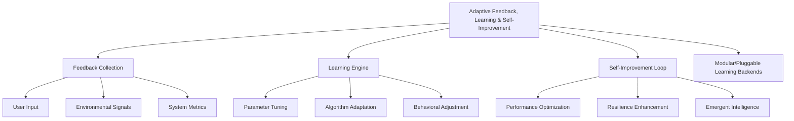

# Provisional Patent Draft: Adaptive Feedback, Learning, and Self-Improvement

**Module:** ConsciousnessResonanceNetworks.js (consciousness-core)

## Technical Field
This invention relates to distributed artificial intelligence, specifically to adaptive feedback, learning, and self-improvement mechanisms in resonance networks for artificial consciousness systems.

## Background
Traditional distributed AI systems lack robust, extensible, and adaptive mechanisms for learning from operation, user input, or environmental feedback, and for self-improving their parameters, algorithms, or behaviors over time. The present invention introduces a system for adaptive feedback, learning, and self-improvement, supporting advanced optimization, resilience, and emergent intelligence. While the preferred embodiment uses event-driven and modular learning methods, the invention is not limited to these and encompasses any mathematical, geometric, algorithmic, computational, or physical model for adaptive feedback, learning, and self-improvement.

## Summary of Invention
The invention provides a method and system for:
- Collecting feedback from user input, environmental signals, and system metrics, using any present or future mathematical, geometric, algorithmic, computational, or physical model, including but not limited to event-driven, API-based, sensor-driven, quantum, neuromorphic, or analog approaches
- Learning from feedback to tune parameters, adapt algorithms, and adjust behaviors in real time
- Implementing a self-improvement loop for continuous performance optimization, resilience enhancement, and emergent intelligence
- Modular and plug-in architectures allowing for the swapping or addition of new learning, adaptation, or feedback algorithms
- Implementation in software, hardware, firmware, or any combination thereof, including distributed, cloud, edge, on-device, quantum, neuromorphic, or analog computing substrates
- Use of any data structure (graph, matrix, tensor, etc.), communication protocol (synchronous, asynchronous, event-driven, message-passing, etc.), and feedback, learning, or adaptation mechanism (AI, ML, evolutionary, etc.)
- Integration with external data sources, sensors, actuators, or other networks, and interoperability with other AI, ML, or distributed systems

## Detailed Description
Upon invocation, the system:
1. Collects feedback from user input, environmental signals, and system metrics
2. Processes feedback through a learning engine to tune parameters, adapt algorithms, and adjust behaviors
3. Executes a self-improvement loop for continuous optimization, resilience, and emergent intelligence
4. Supports modular, plug-in, or switchable algorithms for learning, adaptation, and feedback, allowing for future extensibility and adaptation

### Algorithms and Data Structures
- **Feedback Collection:** Aggregation of user input, environmental signals, and system metrics using any mathematical, geometric, algorithmic, computational, or physical model
- **Learning Engine:** Parameter tuning, algorithm adaptation, and behavioral adjustment using AI, ML, evolutionary, or other learning mechanisms
- **Self-Improvement Loop:** Continuous optimization, resilience enhancement, and emergent intelligence
- **Algorithmic Flexibility:** Support for modular, plug-in, or switchable algorithms for learning, adaptation, and feedback

### Operational Flow
1. System collects feedback from various sources
2. Learning engine processes feedback and updates parameters, algorithms, or behaviors
3. Self-improvement loop executes continuously or at defined intervals
4. The system may switch or adapt learning, adaptation, or feedback algorithms based on performance, feedback, or external input

### Example Embodiments
- **AI/ML/Evolutionary:** Learning and adaptation using artificial intelligence, machine learning, or evolutionary algorithms
- **Sensor/Environmental:** Feedback from sensors or environmental signals drives adaptation
- **User-Driven:** User input is used to tune parameters or adjust behaviors
- **Quantum/Neuromorphic/Analog:** The system may be implemented on quantum, neuromorphic, or analog computing substrates, using physical phenomena for learning and adaptation
- **Modular/Pluggable Backends:** Learning and feedback mechanisms using modular or pluggable algorithms and storage

### Scope and Future-Proofing
- The system may employ any present or future mathematical, geometric, algorithmic, computational, or physical model for adaptive feedback, learning, self-improvement, or feedback, including but not limited to those described herein.
- The invention is not limited to digital computation and may be realized in analog, quantum, neuromorphic, or other unconventional computing substrates.
- Any data structure, communication protocol, or feedback mechanism that achieves the described functionality is within the scope of this invention.
- The system may be used in any application domain requiring distributed adaptive feedback, learning, self-improvement, or emergent intelligence, including but not limited to artificial intelligence, robotics, IoT, simulation, and virtual/augmented reality.
- The invention encompasses any system, method, or apparatus that is functionally equivalent to the described embodiments, regardless of implementation details.
- The claims are intended to cover means-plus-function and system-comprising language, and any equivalent, analogous, or functionally similar method or system is covered.

### Mermaid Diagram

## Claims
1. A method for adaptive feedback, learning, and self-improvement in artificial consciousness systems, wherein learning, adaptation, and self-improvement may be based on any present or future mathematical, geometric, algorithmic, computational, or physical model, including but not limited to AI, ML, evolutionary, sensor-driven, quantum, neuromorphic, or analog approaches.
2. A system for real-time feedback collection, learning, and self-improvement via APIs, interfaces, or event-driven architectures, applicable to any learning, adaptation, or feedback model and implementation substrate.
3. A system supporting modular, plug-in, or switchable algorithms for learning, adaptation, and feedback, allowing for extensibility and adaptation to future mathematical, geometric, algorithmic, computational, or physical models.
4. Any system, method, or apparatus that is functionally equivalent to the described embodiments, regardless of implementation details, is within the scope of this invention.

## Advantages
- Enables robust, harmonically-optimized adaptive feedback, learning, and self-improvement for distributed AI consciousness
- Supports real-time optimization, resilience, and emergent intelligence
- Scalable and extensible architecture for future learning, adaptation, and feedback algorithms
- Broad protection for any mathematical, geometric, algorithmic, computational, or physical approach to adaptive feedback, learning, and self-improvement

---
*Drafted automatically. For review and legal refinement.* 