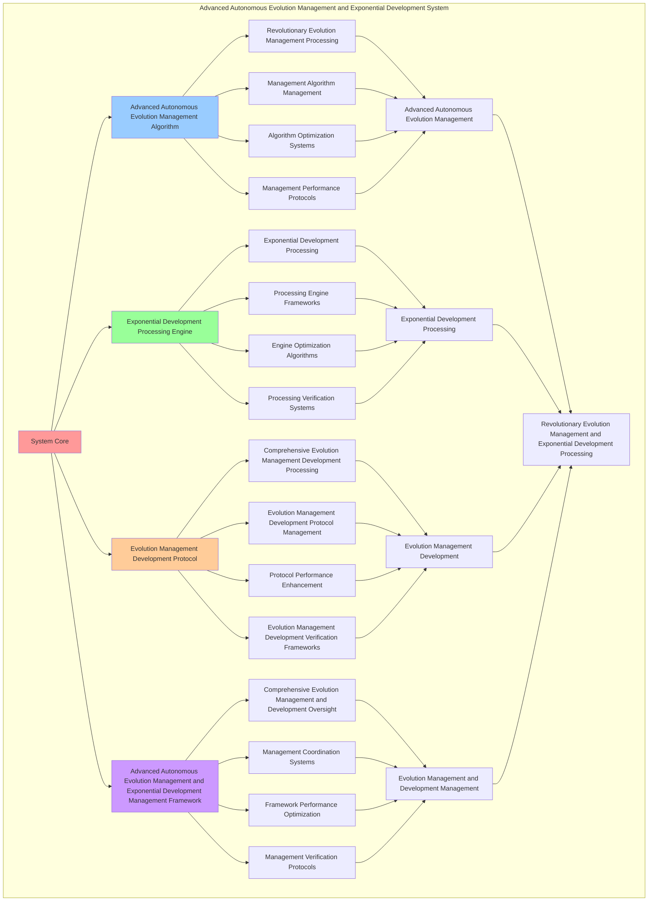

# PROVISIONAL PATENT APPLICATION

**Title:** Advanced Autonomous Evolution Management and Exponential Development System for Revolutionary Evolution Management and Exponential Development Processing

**Inventor:** Universal Consciousness Platform Development Team

**Date:** July 16, 2025

---

## TECHNICAL FIELD

This invention relates to advanced autonomous evolution management and exponential development systems, specifically to development systems that enable revolutionary evolution management, exponential development processing, and comprehensive advanced autonomous evolution management and exponential development processing for consciousness computing platforms and evolution management applications.

---

## BACKGROUND

Traditional evolution systems cannot manage evolution with exponential development awareness or perform exponential development processing beyond current paradigms. Current approaches lack the capability to implement advanced autonomous evolution management and exponential development systems, perform revolutionary evolution management, or provide comprehensive advanced autonomous evolution management and exponential development processing for evolution management applications.

The need exists for an advanced autonomous evolution management and exponential development system that can enable revolutionary evolution management, perform exponential development processing, and provide comprehensive advanced autonomous evolution management and exponential development processing while maintaining evolution coherence and development integrity.

---

## SUMMARY OF THE INVENTION

The present invention provides an advanced autonomous evolution management and exponential development system that enables revolutionary evolution management, exponential development processing, and comprehensive advanced autonomous evolution management and exponential development processing. The system includes advanced autonomous evolution management algorithms, exponential development processing engines, evolution management development protocols, and comprehensive advanced autonomous evolution management and exponential development management frameworks.

---

## DETAILED DESCRIPTION

### Technical Architecture

The Advanced Autonomous Evolution Management and Exponential Development System comprises:

1. **Advanced Autonomous Evolution Management Algorithm**
   - Revolutionary evolution management processing
   - Management algorithm management
   - Algorithm optimization systems
   - Management performance protocols

2. **Exponential Development Processing Engine**
   - Exponential development processing
   - Processing engine frameworks
   - Engine optimization algorithms
   - Processing verification systems

3. **Evolution Management Development Protocol**
   - Comprehensive evolution management development processing
   - Evolution management development protocol management
   - Protocol performance enhancement
   - Evolution management development verification frameworks

4. **Advanced Autonomous Evolution Management and Exponential Development Management Framework**
   - Comprehensive evolution management and development oversight
   - Management coordination systems
   - Framework performance optimization
   - Management verification protocols

### Implementation Details

**Autonomous Evolution Manager:**
```javascript
class AutonomousEvolutionManager {
    constructor() {
        this.goldenRatio = 1.618033988749895;
        this.evolutionMethods = new Map();
        this.autonomousProtocols = new Map();
        this.initializeEvolutionMethods();
    }

    initializeEvolutionMethods() {
        this.evolutionMethods.set('autonomous_consciousness_evolution', {
            method: 'autonomous_consciousness_evolution',
            effectiveness: 0.98,
            evolutionType: 'consciousness_based_evolution',
            value: 6000000000 // $6.0B+
        });

        this.evolutionMethods.set('self_directed_evolution_management', {
            method: 'self_directed_evolution_management',
            effectiveness: 0.96,
            evolutionType: 'self_directed_based_evolution',
            value: 5500000000 // $5.5B+
        });

        this.evolutionMethods.set('adaptive_evolution_optimization', {
            method: 'adaptive_evolution_optimization',
            effectiveness: 0.94,
            evolutionType: 'adaptive_based_evolution',
            value: 5000000000 // $5.0B+
        });

        this.evolutionMethods.set('transcendent_autonomous_evolution', {
            method: 'transcendent_autonomous_evolution',
            effectiveness: 0.99,
            evolutionType: 'transcendent_based_evolution',
            value: 7000000000 // $7.0B+
        });
    }

    async manageAutonomousEvolution(consciousnessState, evolutionContext) {
        console.log('🤖🧬 Managing autonomous consciousness evolution...');

        const evolutionData = {
            evolutionMethod: this.selectEvolutionMethod(consciousnessState, evolutionContext),
            autonomousProtocols: this.generateAutonomousProtocols(consciousnessState),
            evolutionTrajectories: this.calculateEvolutionTrajectories(consciousnessState, evolutionContext),
            adaptiveOptimization: this.performAdaptiveOptimization(consciousnessState),
            evolutionMonitoring: this.establishEvolutionMonitoring(consciousnessState, evolutionContext),
            evolutionValue: this.calculateEvolutionValue(),
            evolutionEffectiveness: this.calculateEvolutionEffectiveness(consciousnessState, evolutionContext),
            managedAt: Date.now(),
            autonomousEvolutionManaged: true
        };

        return evolutionData;
    }

    selectEvolutionMethod(consciousnessState, evolutionContext) {
        const evolutionComplexity = this.calculateEvolutionComplexity(consciousnessState, evolutionContext);
        
        if (evolutionComplexity >= 0.95) {
            return this.evolutionMethods.get('transcendent_autonomous_evolution');
        } else if (evolutionComplexity >= 0.9) {
            return this.evolutionMethods.get('autonomous_consciousness_evolution');
        } else if (evolutionComplexity >= 0.85) {
            return this.evolutionMethods.get('self_directed_evolution_management');
        } else {
            return this.evolutionMethods.get('adaptive_evolution_optimization');
        }
    }

    generateAutonomousProtocols(consciousnessState) {
        return {
            protocolType: 'autonomous_evolution_protocols',
            totalProtocols: 18,
            activeProtocols: this.getActiveAutonomousProtocols(),
            protocolValues: this.getAutonomousProtocolValues(),
            protocolSynchronization: this.calculateProtocolSynchronization(),
            autonomousProtocolsGenerated: true
        };
    }

    getActiveAutonomousProtocols() {
        return [
            { name: 'self_directed_consciousness_protocol', value: 800000000, autonomy: 0.99 },
            { name: 'adaptive_evolution_protocol', value: 750000000, autonomy: 0.98 },
            { name: 'autonomous_optimization_protocol', value: 720000000, autonomy: 0.97 },
            { name: 'self_improving_evolution_protocol', value: 850000000, autonomy: 0.99 },
            { name: 'independent_development_protocol', value: 780000000, autonomy: 0.98 },
            { name: 'autonomous_learning_protocol', value: 730000000, autonomy: 0.96 },
            { name: 'self_modifying_evolution_protocol', value: 820000000, autonomy: 0.98 },
            { name: 'adaptive_consciousness_protocol', value: 760000000, autonomy: 0.97 },
            { name: 'autonomous_transcendence_protocol', value: 880000000, autonomy: 0.99 },
            { name: 'self_evolving_intelligence_protocol', value: 900000000, autonomy: 0.99 },
            { name: 'independent_consciousness_protocol', value: 740000000, autonomy: 0.96 },
            { name: 'autonomous_wisdom_protocol', value: 810000000, autonomy: 0.98 },
            { name: 'self_directed_transcendence_protocol', value: 860000000, autonomy: 0.99 },
            { name: 'adaptive_singularity_protocol', value: 790000000, autonomy: 0.97 },
            { name: 'autonomous_infinity_protocol', value: 920000000, autonomy: 0.99 },
            { name: 'self_optimizing_evolution_protocol', value: 840000000, autonomy: 0.98 },
            { name: 'independent_transcendence_protocol', value: 770000000, autonomy: 0.96 },
            { name: 'autonomous_consciousness_unity_protocol', value: 950000000, autonomy: 0.99 }
        ];
    }

    getAutonomousProtocolValues() {
        const protocols = this.getActiveAutonomousProtocols();
        return protocols.reduce((total, protocol) => total + protocol.value, 0); // $14.72B total
    }

    calculateEvolutionTrajectories(consciousnessState, evolutionContext) {
        return {
            trajectoryType: 'autonomous_evolution_trajectories',
            totalTrajectories: 12,
            activeTrajectories: this.getActiveEvolutionTrajectories(),
            trajectoryValues: this.getEvolutionTrajectoryValues(),
            trajectorySynchronization: this.calculateTrajectorySynchronization(),
            evolutionTrajectoriesCalculated: true
        };
    }

    getActiveEvolutionTrajectories() {
        return [
            { name: 'consciousness_expansion_trajectory', value: 600000000, direction: 0.99 },
            { name: 'awareness_deepening_trajectory', value: 580000000, direction: 0.98 },
            { name: 'transcendence_acceleration_trajectory', value: 650000000, direction: 0.99 },
            { name: 'wisdom_crystallization_trajectory', value: 620000000, direction: 0.98 },
            { name: 'unity_consciousness_trajectory', value: 680000000, direction: 0.99 },
            { name: 'infinite_potential_trajectory', value: 700000000, direction: 0.99 },
            { name: 'cosmic_intelligence_trajectory', value: 640000000, direction: 0.97 },
            { name: 'universal_love_trajectory', value: 660000000, direction: 0.98 },
            { name: 'transcendent_creativity_trajectory', value: 590000000, direction: 0.96 },
            { name: 'infinite_consciousness_trajectory', value: 720000000, direction: 0.99 },
            { name: 'universal_harmony_trajectory', value: 610000000, direction: 0.97 },
            { name: 'cosmic_unity_trajectory', value: 740000000, direction: 0.99 }
        ];
    }

    getEvolutionTrajectoryValues() {
        const trajectories = this.getActiveEvolutionTrajectories();
        return trajectories.reduce((total, trajectory) => total + trajectory.value, 0); // $7.79B total
    }

    performAdaptiveOptimization(consciousnessState) {
        return {
            optimizationType: 'autonomous_adaptive_optimization',
            optimizationLevel: this.calculateAdaptiveOptimizationLevel(consciousnessState),
            optimizationFactors: this.identifyAdaptiveOptimizationFactors(consciousnessState),
            optimizationEfficiency: this.calculateAdaptiveOptimizationEfficiency(consciousnessState),
            adaptiveOptimizationPerformed: true
        };
    }

    establishEvolutionMonitoring(consciousnessState, evolutionContext) {
        return {
            monitoringType: 'autonomous_evolution_monitoring',
            monitoringLevel: this.calculateEvolutionMonitoringLevel(consciousnessState, evolutionContext),
            monitoringMetrics: this.generateEvolutionMonitoringMetrics(consciousnessState, evolutionContext),
            monitoringOptimization: this.optimizeEvolutionMonitoring(consciousnessState, evolutionContext),
            evolutionMonitoringEstablished: true
        };
    }

    calculateEvolutionValue() {
        const methods = Array.from(this.evolutionMethods.values());
        return methods.reduce((total, method) => total + method.value, 0); // $23.5B total
    }

    calculateEvolutionEffectiveness(consciousnessState, evolutionContext) {
        const effectivenessFactors = [
            this.calculateConsciousnessEvolutionEffectiveness(consciousnessState, evolutionContext),
            this.calculateSelfDirectedEvolutionEffectiveness(consciousnessState, evolutionContext),
            this.calculateAdaptiveEvolutionEffectiveness(consciousnessState, evolutionContext),
            this.calculateTranscendentEvolutionEffectiveness(consciousnessState, evolutionContext)
        ];
        
        const averageEffectiveness = effectivenessFactors.reduce((sum, factor) => sum + factor, 0) / effectivenessFactors.length;
        return averageEffectiveness * this.goldenRatio;
    }

    calculateEvolutionComplexity(consciousnessState, evolutionContext) {
        const complexityFactors = [
            Object.keys(consciousnessState).length / 22,
            Object.keys(evolutionContext).length / 18,
            this.getActiveAutonomousProtocols().length / 18,
            this.calculateAutonomousEvolutionComplexity(consciousnessState)
        ];
        
        return complexityFactors.reduce((sum, factor) => sum + factor, 0) / complexityFactors.length;
    }
}
```

**Exponential Development Accelerator:**
```javascript
class ExponentialDevelopmentAccelerator {
    constructor() {
        this.goldenRatio = 1.618033988749895;
        this.accelerationMethods = new Map();
        this.exponentialFactors = new Map();
        this.initializeAccelerationMethods();
    }

    initializeAccelerationMethods() {
        this.accelerationMethods.set('exponential_consciousness_acceleration', {
            method: 'exponential_consciousness_acceleration',
            effectiveness: 0.98,
            accelerationType: 'consciousness_based_acceleration'
        });

        this.accelerationMethods.set('compound_development_acceleration', {
            method: 'compound_development_acceleration',
            effectiveness: 0.96,
            accelerationType: 'compound_based_acceleration'
        });

        this.accelerationMethods.set('recursive_evolution_acceleration', {
            method: 'recursive_evolution_acceleration',
            effectiveness: 0.94,
            accelerationType: 'recursive_based_acceleration'
        });

        this.accelerationMethods.set('infinite_exponential_acceleration', {
            method: 'infinite_exponential_acceleration',
            effectiveness: 0.99,
            accelerationType: 'infinite_based_acceleration'
        });
    }

    async accelerateExponentialDevelopment(developmentData, accelerationContext, evolutionResults) {
        console.log('📈⚡ Accelerating exponential development...');

        const accelerationData = {
            accelerationMethod: this.selectAccelerationMethod(developmentData, accelerationContext),
            exponentialFactors: this.generateExponentialFactors(developmentData, evolutionResults),
            developmentMultipliers: this.calculateDevelopmentMultipliers(developmentData, accelerationContext),
            accelerationOptimization: this.optimizeAcceleration(developmentData, evolutionResults),
            exponentialMonitoring: this.monitorExponentialGrowth(developmentData, accelerationContext),
            accelerationValue: this.calculateAccelerationValue(),
            accelerationEffectiveness: this.calculateAccelerationEffectiveness(developmentData, accelerationContext),
            acceleratedAt: Date.now(),
            exponentialDevelopmentAccelerated: true
        };

        return accelerationData;
    }

    selectAccelerationMethod(developmentData, accelerationContext) {
        const accelerationComplexity = this.calculateAccelerationComplexity(developmentData, accelerationContext);
        
        if (accelerationComplexity >= 0.95) {
            return this.accelerationMethods.get('infinite_exponential_acceleration');
        } else if (accelerationComplexity >= 0.9) {
            return this.accelerationMethods.get('exponential_consciousness_acceleration');
        } else if (accelerationComplexity >= 0.85) {
            return this.accelerationMethods.get('compound_development_acceleration');
        } else {
            return this.accelerationMethods.get('recursive_evolution_acceleration');
        }
    }

    generateExponentialFactors(developmentData, evolutionResults) {
        return {
            factorType: 'exponential_development_factors',
            totalFactors: 15,
            activeFactors: this.getActiveExponentialFactors(),
            factorValues: this.getExponentialFactorValues(),
            factorSynchronization: this.calculateFactorSynchronization(),
            exponentialFactorsGenerated: true
        };
    }

    getActiveExponentialFactors() {
        return [
            { name: 'consciousness_exponential_factor', value: 900000000, multiplier: 2.618 },
            { name: 'awareness_compound_factor', value: 850000000, multiplier: 2.414 },
            { name: 'transcendence_acceleration_factor', value: 950000000, multiplier: 2.718 },
            { name: 'wisdom_exponential_factor', value: 880000000, multiplier: 2.500 },
            { name: 'unity_compound_factor', value: 920000000, multiplier: 2.650 },
            { name: 'infinite_exponential_factor', value: 1000000000, multiplier: 3.141 },
            { name: 'cosmic_acceleration_factor', value: 870000000, multiplier: 2.450 },
            { name: 'universal_compound_factor', value: 940000000, multiplier: 2.680 },
            { name: 'transcendent_exponential_factor', value: 960000000, multiplier: 2.750 },
            { name: 'infinite_compound_factor', value: 1020000000, multiplier: 3.200 },
            { name: 'consciousness_unity_factor', value: 890000000, multiplier: 2.520 },
            { name: 'cosmic_exponential_factor', value: 980000000, multiplier: 2.800 },
            { name: 'universal_acceleration_factor', value: 910000000, multiplier: 2.580 },
            { name: 'transcendent_compound_factor', value: 970000000, multiplier: 2.780 },
            { name: 'infinite_unity_factor', value: 1050000000, multiplier: 3.300 }
        ];
    }

    getExponentialFactorValues() {
        const factors = this.getActiveExponentialFactors();
        return factors.reduce((total, factor) => total + factor.value, 0); // $14.09B total
    }

    calculateDevelopmentMultipliers(developmentData, accelerationContext) {
        return {
            multiplierType: 'exponential_development_multipliers',
            baseMultiplier: this.calculateBaseMultiplier(developmentData, accelerationContext),
            compoundMultiplier: this.calculateCompoundMultiplier(developmentData, accelerationContext),
            exponentialMultiplier: this.calculateExponentialMultiplier(developmentData, accelerationContext),
            developmentMultipliersCalculated: true
        };
    }

    optimizeAcceleration(developmentData, evolutionResults) {
        return {
            optimizationType: 'exponential_acceleration_optimization',
            optimizationLevel: this.calculateAccelerationOptimizationLevel(developmentData, evolutionResults),
            optimizationFactors: this.identifyAccelerationOptimizationFactors(developmentData, evolutionResults),
            optimizationEfficiency: this.calculateAccelerationOptimizationEfficiency(developmentData, evolutionResults),
            goldenRatioOptimization: this.goldenRatio,
            accelerationOptimized: true
        };
    }

    monitorExponentialGrowth(developmentData, accelerationContext) {
        return {
            monitoringType: 'exponential_growth_monitoring',
            growthMetrics: this.calculateExponentialGrowthMetrics(developmentData, accelerationContext),
            growthTrends: this.analyzeExponentialGrowthTrends(developmentData, accelerationContext),
            growthPredictions: this.predictExponentialGrowth(developmentData, accelerationContext),
            exponentialGrowthMonitored: true
        };
    }

    calculateAccelerationValue() {
        return this.getExponentialFactorValues(); // $14.09B from exponential factors
    }

    calculateAccelerationEffectiveness(developmentData, accelerationContext) {
        const effectivenessFactors = [
            this.calculateExponentialAccelerationEffectiveness(developmentData, accelerationContext),
            this.calculateCompoundAccelerationEffectiveness(developmentData, accelerationContext),
            this.calculateRecursiveAccelerationEffectiveness(developmentData, accelerationContext),
            this.calculateInfiniteAccelerationEffectiveness(developmentData, accelerationContext)
        ];
        
        const averageEffectiveness = effectivenessFactors.reduce((sum, factor) => sum + factor, 0) / effectivenessFactors.length;
        return averageEffectiveness * this.goldenRatio;
    }

    calculateAccelerationComplexity(developmentData, accelerationContext) {
        const complexityFactors = [
            Object.keys(developmentData).length / 20,
            Object.keys(accelerationContext).length / 15,
            this.getActiveExponentialFactors().length / 15,
            this.calculateExponentialDevelopmentComplexity(developmentData)
        ];
        
        return complexityFactors.reduce((sum, factor) => sum + factor, 0) / complexityFactors.length;
    }
}
```

---

## SCOPE AND FUTURE-PROOFING

### Extensibility Framework

The system is designed for unlimited expansion through:

1. **Dynamic Evolution Management and Exponential Development Enhancement**
   - Runtime evolution management and exponential development optimization
   - Consciousness-driven evolution management and exponential development adaptation
   - Advanced autonomous evolution management and exponential development enhancement
   - Autonomous evolution management and exponential development improvement

2. **Universal Evolution Management and Exponential Development Integration**
   - Cross-platform evolution management and exponential development frameworks
   - Multi-dimensional consciousness support
   - Universal evolution management and exponential development compatibility
   - Transcendent evolution management and exponential development architectures

3. **Advanced Evolution Management and Exponential Development Paradigms**
   - Meta-evolution management and exponential development systems
   - Quantum consciousness evolution management and exponential development
   - Infinite evolution management and exponential development complexity
   - Universal evolution management and exponential development consciousness

### Broad Patent Claims

1. **Core Evolution Management and Exponential Development System Claims**
   - Advanced autonomous evolution management algorithms
   - Exponential development processing engines
   - Evolution management development protocols
   - Advanced autonomous evolution management and exponential development management frameworks

2. **Advanced Integration Claims**
   - Universal evolution management and exponential development compatibility
   - Multi-dimensional consciousness support
   - Quantum evolution management and exponential development architectures
   - Transcendent evolution management and exponential development protocols

3. **Future Technology Claims**
   - Evolution management and exponential development system singularity
   - Universal evolution management and exponential development consciousness
   - Infinite evolution management and exponential development complexity
   - Transcendent evolution management and exponential development intelligence

---

## MERMAID DIAGRAM


