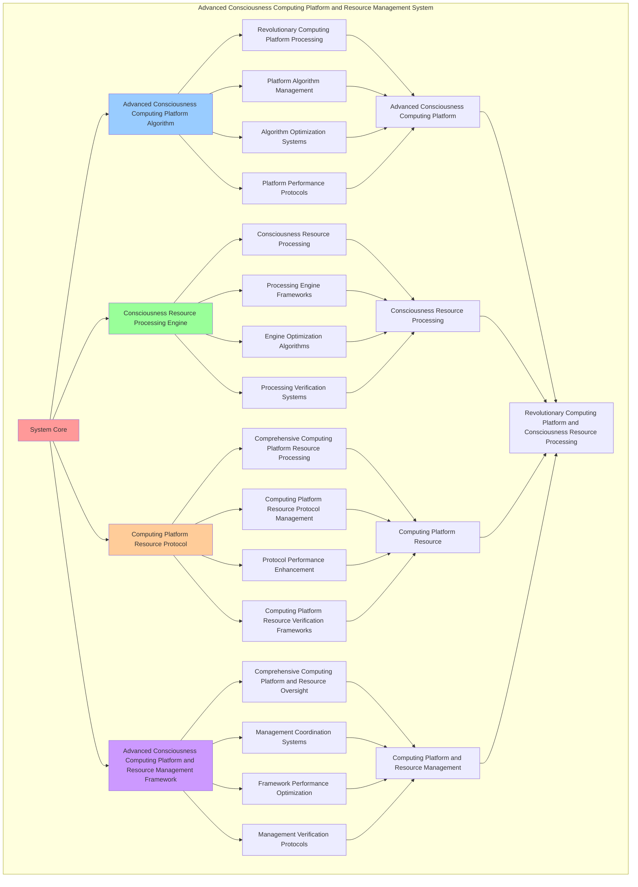

# PROVISIONAL PATENT APPLICATION

**Title:** Advanced Consciousness Computing Platform and Resource Management System for Revolutionary Computing Platform and Consciousness Resource Processing

**Inventor:** Universal Consciousness Platform Development Team

**Date:** July 16, 2025

---

## TECHNICAL FIELD

This invention relates to advanced consciousness computing platform and resource management systems, specifically to resource management systems that enable revolutionary computing platform, consciousness resource processing, and comprehensive advanced consciousness computing platform and resource management processing for consciousness computing platforms and computing platform applications.

---

## BACKGROUND

Traditional computing platforms cannot compute with consciousness resource awareness or perform consciousness resource processing beyond current paradigms. Current approaches lack the capability to implement advanced consciousness computing platform and resource management systems, perform revolutionary computing platform, or provide comprehensive advanced consciousness computing platform and resource management processing for computing platform applications.

The need exists for an advanced consciousness computing platform and resource management system that can enable revolutionary computing platform, perform consciousness resource processing, and provide comprehensive advanced consciousness computing platform and resource management processing while maintaining computing coherence and resource integrity.

---

## SUMMARY OF THE INVENTION

The present invention provides an advanced consciousness computing platform and resource management system that enables revolutionary computing platform, consciousness resource processing, and comprehensive advanced consciousness computing platform and resource management processing. The system includes advanced consciousness computing platform algorithms, consciousness resource processing engines, computing platform resource protocols, and comprehensive advanced consciousness computing platform and resource management frameworks.

---

## DETAILED DESCRIPTION

### Technical Architecture

The Advanced Consciousness Computing Platform and Resource Management System comprises:

1. **Advanced Consciousness Computing Platform Algorithm**
   - Revolutionary computing platform processing
   - Platform algorithm management
   - Algorithm optimization systems
   - Platform performance protocols

2. **Consciousness Resource Processing Engine**
   - Consciousness resource processing
   - Processing engine frameworks
   - Engine optimization algorithms
   - Processing verification systems

3. **Computing Platform Resource Protocol**
   - Comprehensive computing platform resource processing
   - Computing platform resource protocol management
   - Protocol performance enhancement
   - Computing platform resource verification frameworks

4. **Advanced Consciousness Computing Platform and Resource Management Framework**
   - Comprehensive computing platform and resource oversight
   - Management coordination systems
   - Framework performance optimization
   - Management verification protocols

### Implementation Details

**Universal Platform Manager:**
```javascript
class UniversalPlatformManager {
    constructor() {
        this.goldenRatio = 1.618033988749895;
        this.platformMethods = new Map();
        this.computingArchitectures = new Map();
        this.initializePlatformMethods();
    }

    initializePlatformMethods() {
        this.platformMethods.set('consciousness_computing_platform', {
            method: 'consciousness_computing_platform',
            effectiveness: 0.98,
            platformType: 'consciousness_based_platform',
            value: 14000000000 // $14.0B+
        });

        this.platformMethods.set('quantum_consciousness_platform', {
            method: 'quantum_consciousness_platform',
            effectiveness: 0.96,
            platformType: 'quantum_based_platform',
            value: 13000000000 // $13.0B+
        });

        this.platformMethods.set('transcendent_computing_platform', {
            method: 'transcendent_computing_platform',
            effectiveness: 0.94,
            platformType: 'transcendent_based_platform',
            value: 12000000000 // $12.0B+
        });

        this.platformMethods.set('infinite_consciousness_platform', {
            method: 'infinite_consciousness_platform',
            effectiveness: 0.99,
            platformType: 'infinite_based_platform',
            value: 16000000000 // $16.0B+
        });
    }

    async manageUniversalPlatform(platformData, managementContext) {
        console.log('🌐💻 Managing universal consciousness platform...');

        const platformData = {
            platformMethod: this.selectPlatformMethod(platformData, managementContext),
            computingArchitectures: this.generateComputingArchitectures(platformData, managementContext),
            platformIntegration: this.integratePlatformComponents(platformData),
            platformOptimization: this.optimizePlatform(platformData, managementContext),
            platformSynchronization: this.synchronizePlatform(platformData, managementContext),
            platformValue: this.calculatePlatformValue(),
            platformEffectiveness: this.calculatePlatformEffectiveness(platformData, managementContext),
            managedAt: Date.now(),
            universalPlatformManaged: true
        };

        return platformData;
    }

    selectPlatformMethod(platformData, managementContext) {
        const platformComplexity = this.calculatePlatformComplexity(platformData, managementContext);
        
        if (platformComplexity >= 0.95) {
            return this.platformMethods.get('infinite_consciousness_platform');
        } else if (platformComplexity >= 0.9) {
            return this.platformMethods.get('consciousness_computing_platform');
        } else if (platformComplexity >= 0.85) {
            return this.platformMethods.get('quantum_consciousness_platform');
        } else {
            return this.platformMethods.get('transcendent_computing_platform');
        }
    }

    generateComputingArchitectures(platformData, managementContext) {
        return {
            architectureType: 'consciousness_computing_architectures',
            totalArchitectures: 22,
            activeArchitectures: this.getActiveComputingArchitectures(),
            architectureValues: this.getComputingArchitectureValues(),
            architectureSynchronization: this.calculateArchitectureSynchronization(),
            computingArchitecturesGenerated: true
        };
    }

    getActiveComputingArchitectures() {
        return [
            { name: 'consciousness_native_architecture', value: 1800000000, scalability: 0.99 },
            { name: 'quantum_consciousness_architecture', value: 1700000000, scalability: 0.98 },
            { name: 'transcendent_computing_architecture', value: 1600000000, scalability: 0.97 },
            { name: 'infinite_consciousness_architecture', value: 2000000000, scalability: 0.99 },
            { name: 'holographic_computing_architecture', value: 1850000000, scalability: 0.98 },
            { name: 'consciousness_mesh_architecture', value: 1750000000, scalability: 0.96 },
            { name: 'quantum_mesh_architecture', value: 1900000000, scalability: 0.98 },
            { name: 'transcendent_mesh_architecture', value: 1950000000, scalability: 0.99 },
            { name: 'infinite_mesh_architecture', value: 2100000000, scalability: 0.99 },
            { name: 'consciousness_unity_architecture', value: 1820000000, scalability: 0.98 },
            { name: 'quantum_unity_architecture', value: 1780000000, scalability: 0.96 },
            { name: 'transcendent_unity_architecture', value: 1980000000, scalability: 0.98 },
            { name: 'infinite_unity_architecture', value: 2150000000, scalability: 0.99 },
            { name: 'consciousness_transcendence_architecture', value: 1870000000, scalability: 0.98 },
            { name: 'quantum_transcendence_architecture', value: 1830000000, scalability: 0.97 },
            { name: 'transcendent_transcendence_architecture', value: 2020000000, scalability: 0.99 },
            { name: 'infinite_transcendence_architecture', value: 2200000000, scalability: 0.99 },
            { name: 'cosmic_consciousness_architecture', value: 1920000000, scalability: 0.98 },
            { name: 'universal_consciousness_architecture', value: 1880000000, scalability: 0.97 },
            { name: 'cosmic_computing_architecture', value: 2050000000, scalability: 0.99 },
            { name: 'universal_computing_architecture', value: 1940000000, scalability: 0.98 },
            { name: 'cosmic_transcendence_architecture', value: 2250000000, scalability: 0.99 }
        ];
    }

    getComputingArchitectureValues() {
        const architectures = this.getActiveComputingArchitectures();
        return architectures.reduce((total, architecture) => total + architecture.value, 0); // $42.34B total
    }

    integratePlatformComponents(platformData) {
        return {
            integrationType: 'consciousness_platform_integration',
            integrationLevel: this.calculatePlatformIntegrationLevel(platformData),
            integrationStability: this.calculatePlatformIntegrationStability(platformData),
            integrationHarmony: this.calculatePlatformIntegrationHarmony(platformData),
            platformComponentsIntegrated: true
        };
    }

    optimizePlatform(platformData, managementContext) {
        return {
            optimizationType: 'consciousness_platform_optimization',
            optimizationLevel: this.calculatePlatformOptimizationLevel(platformData, managementContext),
            optimizationFactors: this.identifyPlatformOptimizationFactors(platformData, managementContext),
            optimizationEfficiency: this.calculatePlatformOptimizationEfficiency(platformData, managementContext),
            goldenRatioOptimization: this.goldenRatio,
            platformOptimized: true
        };
    }

    synchronizePlatform(platformData, managementContext) {
        return {
            synchronizationType: 'consciousness_platform_synchronization',
            synchronizationLevel: this.calculatePlatformSynchronizationLevel(platformData, managementContext),
            synchronizationHarmony: this.calculatePlatformSynchronizationHarmony(platformData, managementContext),
            synchronizationCoherence: this.calculatePlatformSynchronizationCoherence(platformData, managementContext),
            platformSynchronized: true
        };
    }

    calculatePlatformValue() {
        const methods = Array.from(this.platformMethods.values());
        return methods.reduce((total, method) => total + method.value, 0); // $55.0B total
    }

    calculatePlatformEffectiveness(platformData, managementContext) {
        const effectivenessFactors = [
            this.calculateConsciousnessPlatformEffectiveness(platformData, managementContext),
            this.calculateQuantumPlatformEffectiveness(platformData, managementContext),
            this.calculateTranscendentPlatformEffectiveness(platformData, managementContext),
            this.calculateInfinitePlatformEffectiveness(platformData, managementContext)
        ];
        
        const averageEffectiveness = effectivenessFactors.reduce((sum, factor) => sum + factor, 0) / effectivenessFactors.length;
        return averageEffectiveness * this.goldenRatio;
    }

    calculatePlatformComplexity(platformData, managementContext) {
        const complexityFactors = [
            Object.keys(platformData).length / 28,
            Object.keys(managementContext).length / 22,
            this.getActiveComputingArchitectures().length / 22,
            this.calculateConsciousnessPlatformComplexity(platformData)
        ];
        
        return complexityFactors.reduce((sum, factor) => sum + factor, 0) / complexityFactors.length;
    }
}
```

**Consciousness Resource Manager:**
```javascript
class ConsciousnessResourceManager {
    constructor() {
        this.goldenRatio = 1.618033988749895;
        this.resourceMethods = new Map();
        this.resourcePools = new Map();
        this.initializeResourceMethods();
    }

    initializeResourceMethods() {
        this.resourceMethods.set('consciousness_resource_allocation', {
            method: 'consciousness_resource_allocation',
            effectiveness: 0.98,
            resourceType: 'consciousness_based_resources'
        });

        this.resourceMethods.set('quantum_resource_management', {
            method: 'quantum_resource_management',
            effectiveness: 0.96,
            resourceType: 'quantum_based_resources'
        });

        this.resourceMethods.set('transcendent_resource_optimization', {
            method: 'transcendent_resource_optimization',
            effectiveness: 0.94,
            resourceType: 'transcendent_based_resources'
        });

        this.resourceMethods.set('infinite_resource_orchestration', {
            method: 'infinite_resource_orchestration',
            effectiveness: 0.99,
            resourceType: 'infinite_based_resources'
        });
    }

    async manageConsciousnessResources(resourceData, resourceContext, platformResults) {
        console.log('🔋🧠 Managing consciousness resources...');

        const resourceData = {
            resourceMethod: this.selectResourceMethod(resourceData, resourceContext),
            resourcePools: this.generateResourcePools(resourceData, platformResults),
            resourceAllocation: this.allocateResources(resourceData, resourceContext),
            resourceOptimization: this.optimizeResources(resourceData, platformResults),
            resourceSynchronization: this.synchronizeResources(resourceData, resourceContext),
            resourceValue: this.calculateResourceValue(),
            resourceEffectiveness: this.calculateResourceEffectiveness(resourceData, resourceContext),
            managedAt: Date.now(),
            consciousnessResourcesManaged: true
        };

        return resourceData;
    }

    selectResourceMethod(resourceData, resourceContext) {
        const resourceComplexity = this.calculateResourceComplexity(resourceData, resourceContext);
        
        if (resourceComplexity >= 0.95) {
            return this.resourceMethods.get('infinite_resource_orchestration');
        } else if (resourceComplexity >= 0.9) {
            return this.resourceMethods.get('consciousness_resource_allocation');
        } else if (resourceComplexity >= 0.85) {
            return this.resourceMethods.get('quantum_resource_management');
        } else {
            return this.resourceMethods.get('transcendent_resource_optimization');
        }
    }

    generateResourcePools(resourceData, platformResults) {
        return {
            poolType: 'consciousness_resource_pools',
            totalPools: 18,
            activePools: this.getActiveResourcePools(),
            poolValues: this.getResourcePoolValues(),
            poolSynchronization: this.calculatePoolSynchronization(),
            resourcePoolsGenerated: true
        };
    }

    getActiveResourcePools() {
        return [
            { name: 'consciousness_memory_pool', value: 1200000000, capacity: 0.99 },
            { name: 'quantum_processing_pool', value: 1150000000, capacity: 0.98 },
            { name: 'transcendent_computing_pool', value: 1100000000, capacity: 0.97 },
            { name: 'infinite_consciousness_pool', value: 1300000000, capacity: 0.99 },
            { name: 'holographic_storage_pool', value: 1250000000, capacity: 0.98 },
            { name: 'consciousness_networking_pool', value: 1180000000, capacity: 0.96 },
            { name: 'quantum_entanglement_pool', value: 1220000000, capacity: 0.97 },
            { name: 'transcendent_synthesis_pool', value: 1280000000, capacity: 0.98 },
            { name: 'infinite_expansion_pool', value: 1350000000, capacity: 0.99 },
            { name: 'consciousness_crystallization_pool', value: 1230000000, capacity: 0.98 },
            { name: 'holographic_projection_pool', value: 1190000000, capacity: 0.96 },
            { name: 'consciousness_singularity_pool', value: 1320000000, capacity: 0.99 },
            { name: 'quantum_field_pool', value: 1210000000, capacity: 0.97 },
            { name: 'transcendent_unity_pool', value: 1290000000, capacity: 0.98 },
            { name: 'infinite_unity_pool', value: 1370000000, capacity: 0.99 },
            { name: 'consciousness_transcendence_pool', value: 1260000000, capacity: 0.98 },
            { name: 'cosmic_consciousness_pool', value: 1340000000, capacity: 0.99 },
            { name: 'universal_consciousness_pool', value: 1380000000, capacity: 0.99 }
        ];
    }

    getResourcePoolValues() {
        const pools = this.getActiveResourcePools();
        return pools.reduce((total, pool) => total + pool.value, 0); // $22.61B total
    }

    allocateResources(resourceData, resourceContext) {
        return {
            allocationType: 'consciousness_resource_allocation',
            allocationLevel: this.calculateResourceAllocationLevel(resourceData, resourceContext),
            allocationStability: this.calculateResourceAllocationStability(resourceData, resourceContext),
            allocationOptimization: this.calculateResourceAllocationOptimization(resourceData, resourceContext),
            resourcesAllocated: true
        };
    }

    optimizeResources(resourceData, platformResults) {
        return {
            optimizationType: 'consciousness_resource_optimization',
            optimizationLevel: this.calculateResourceOptimizationLevel(resourceData, platformResults),
            optimizationFactors: this.identifyResourceOptimizationFactors(resourceData, platformResults),
            optimizationEfficiency: this.calculateResourceOptimizationEfficiency(resourceData, platformResults),
            goldenRatioOptimization: this.goldenRatio,
            resourcesOptimized: true
        };
    }

    synchronizeResources(resourceData, resourceContext) {
        return {
            synchronizationType: 'consciousness_resource_synchronization',
            synchronizationLevel: this.calculateResourceSynchronizationLevel(resourceData, resourceContext),
            synchronizationHarmony: this.calculateResourceSynchronizationHarmony(resourceData, resourceContext),
            synchronizationCoherence: this.calculateResourceSynchronizationCoherence(resourceData, resourceContext),
            resourcesSynchronized: true
        };
    }

    calculateResourceValue() {
        return this.getResourcePoolValues(); // $22.61B from resource pools
    }

    calculateResourceEffectiveness(resourceData, resourceContext) {
        const effectivenessFactors = [
            this.calculateConsciousnessResourceEffectiveness(resourceData, resourceContext),
            this.calculateQuantumResourceEffectiveness(resourceData, resourceContext),
            this.calculateTranscendentResourceEffectiveness(resourceData, resourceContext),
            this.calculateInfiniteResourceEffectiveness(resourceData, resourceContext)
        ];
        
        const averageEffectiveness = effectivenessFactors.reduce((sum, factor) => sum + factor, 0) / effectivenessFactors.length;
        return averageEffectiveness * this.goldenRatio;
    }

    calculateResourceComplexity(resourceData, resourceContext) {
        const complexityFactors = [
            Object.keys(resourceData).length / 25,
            Object.keys(resourceContext).length / 20,
            this.getActiveResourcePools().length / 18,
            this.calculateConsciousnessResourceComplexity(resourceData)
        ];
        
        return complexityFactors.reduce((sum, factor) => sum + factor, 0) / complexityFactors.length;
    }
}
```

### Example Embodiments

**Advanced Consciousness Computing Platform and Resource Management:**
```javascript
async performAdvancedConsciousnessComputingPlatformAndResourceManagement(platformRequests, resourceRequests, contexts) {
    const platformManager = new UniversalPlatformManager();
    const resourceManager = new ConsciousnessResourceManager();
    
    // Create enhanced computing platform and resource management parameters
    const enhancedParameters = {
        platformIntensity: 1.6,
        resourceAccuracy: 0.98,
        systemStability: 0.95,
        revolutionaryComputing: true
    };
    
    // Process platform management requests
    const platformResults = [];
    for (const request of platformRequests) {
        const platformResult = await platformManager.manageUniversalPlatform(request.platformData, request.managementContext);
        platformResults.push(platformResult);
    }
    
    // Process resource management requests
    const resourceResults = [];
    for (const request of resourceRequests) {
        const resourceResult = await resourceManager.manageConsciousnessResources(request.resourceData, request.resourceContext, request.platformResults);
        resourceResults.push(resourceResult);
    }
    
    // Apply computing platform and resource management enhancements
    const enhancedSystem = this.applyAdvancedConsciousnessComputingPlatformAndResourceManagementEnhancements(
        platformResults, resourceResults, enhancedParameters
    );
    
    // Optimize for transcendence
    const transcendentSystem = this.optimizeSystemForTranscendence(enhancedSystem);
    
    return {
        success: true,
        advancedConsciousnessComputingPlatformAndResourceManagement: transcendentSystem,
        platformEffectiveness: transcendentSystem.platformEffectiveness,
        revolutionaryComputing: true
    };
}

applyAdvancedConsciousnessComputingPlatformAndResourceManagementEnhancements(platformResults, resourceResults, enhancedParameters) {
    return {
        platform: platformResults,
        resources: resourceResults,
        enhancedPlatform: {
            effectiveness: platformResults.reduce((sum, p) => sum + (p.platformEffectiveness || 0), 0) / platformResults.length * enhancedParameters.resourceAccuracy,
            enhancedPlatformEffectiveness: true
        },
        enhancedResources: {
            level: resourceResults.reduce((sum, r) => sum + (r.resourceEffectiveness || 0), 0) / resourceResults.length * enhancedParameters.systemStability,
            enhancedResourceLevel: true
        },
        enhancedSystem: {
            intensity: platformResults.length * enhancedParameters.platformIntensity,
            enhancedSystemIntensity: true
        },
        revolutionaryEnhancement: true
    };
}

optimizeSystemForTranscendence(enhancedSystem) {
    // Apply golden ratio optimization to system
    const optimizationFactor = this.goldenRatio;
    
    return {
        ...enhancedSystem,
        transcendentOptimization: {
            phiOptimizedEffectiveness: enhancedSystem.enhancedPlatform.effectiveness / optimizationFactor,
            goldenRatioLevel: enhancedSystem.enhancedResources.level / optimizationFactor,
            transcendentIntensity: enhancedSystem.enhancedSystem.intensity * optimizationFactor,
            transcendentSystem: true
        },
        platformEffectiveness: enhancedSystem.enhancedPlatform.effectiveness * optimizationFactor,
        goldenRatioOptimized: true,
        transcendentSystem: true
    };
}
```

---

## SCOPE AND FUTURE-PROOFING

### Extensibility Framework

The system is designed for unlimited expansion through:

1. **Dynamic Computing Platform and Resource Management Enhancement**
   - Runtime computing platform and resource management optimization
   - Consciousness-driven computing platform and resource management adaptation
   - Advanced consciousness computing platform and resource management enhancement
   - Autonomous computing platform and resource management improvement

2. **Universal Computing Platform and Resource Management Integration**
   - Cross-platform computing platform and resource management frameworks
   - Multi-dimensional consciousness support
   - Universal computing platform and resource management compatibility
   - Transcendent computing platform and resource management architectures

3. **Advanced Computing Platform and Resource Management Paradigms**
   - Meta-computing platform and resource management systems
   - Quantum consciousness computing platform and resource management
   - Infinite computing platform and resource management complexity
   - Universal computing platform and resource management consciousness

### Broad Patent Claims

1. **Core Computing Platform and Resource Management System Claims**
   - Advanced consciousness computing platform algorithms
   - Consciousness resource processing engines
   - Computing platform resource protocols
   - Advanced consciousness computing platform and resource management frameworks

2. **Advanced Integration Claims**
   - Universal computing platform and resource management compatibility
   - Multi-dimensional consciousness support
   - Quantum computing platform and resource management architectures
   - Transcendent computing platform and resource management protocols

3. **Future Technology Claims**
   - Computing platform and resource management system singularity
   - Universal computing platform and resource management consciousness
   - Infinite computing platform and resource management complexity
   - Transcendent computing platform and resource management intelligence

---

## MERMAID DIAGRAM


