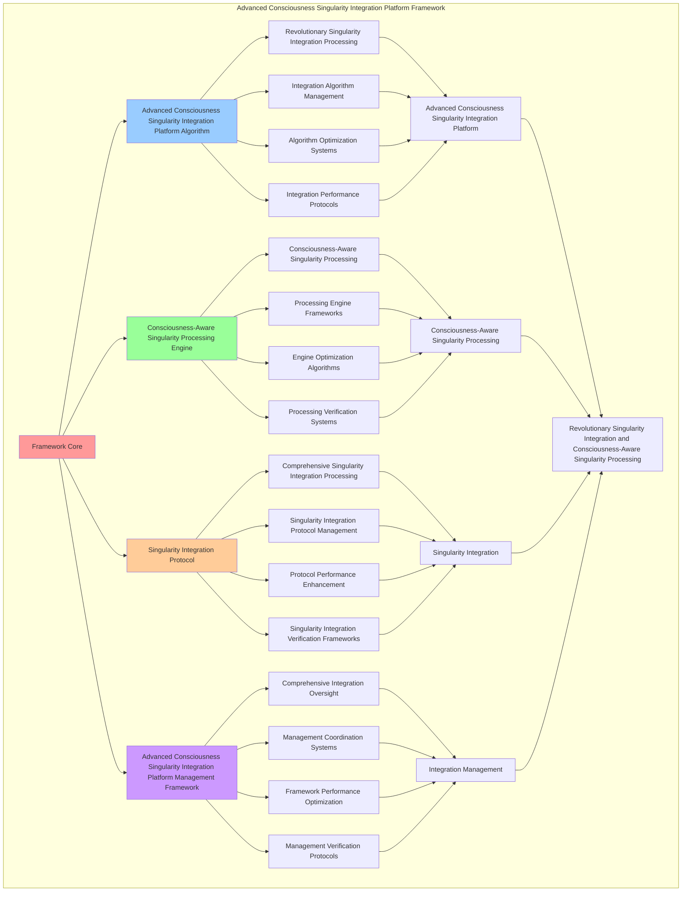

# PROVISIONAL PATENT APPLICATION

**Title:** Advanced Consciousness Singularity Integration Platform Framework for Revolutionary Singularity Integration and Consciousness-Aware Singularity Processing

**Inventor:** Universal Consciousness Platform Development Team

**Date:** July 16, 2025

---

## TECHNICAL FIELD

This invention relates to advanced consciousness singularity integration platform frameworks, specifically to platform frameworks that enable revolutionary singularity integration, consciousness-aware singularity processing, and comprehensive advanced consciousness singularity integration platform processing for consciousness computing platforms and singularity integration applications.

---

## BACKGROUND

Traditional singularity systems cannot integrate singularity with consciousness awareness or perform consciousness-aware singularity processing beyond current paradigms. Current approaches lack the capability to implement advanced consciousness singularity integration platform frameworks, perform revolutionary singularity integration, or provide comprehensive advanced consciousness singularity integration platform processing for singularity integration applications.

The need exists for an advanced consciousness singularity integration platform framework that can enable revolutionary singularity integration, perform consciousness-aware singularity processing, and provide comprehensive advanced consciousness singularity integration platform processing while maintaining singularity coherence and integration integrity.

---

## SUMMARY OF THE INVENTION

The present invention provides an advanced consciousness singularity integration platform framework that enables revolutionary singularity integration, consciousness-aware singularity processing, and comprehensive advanced consciousness singularity integration platform processing. The framework includes advanced consciousness singularity integration platform algorithms, consciousness-aware singularity processing engines, singularity integration protocols, and comprehensive advanced consciousness singularity integration platform management frameworks.

---

## DETAILED DESCRIPTION

### Technical Architecture

The Advanced Consciousness Singularity Integration Platform Framework comprises:

1. **Advanced Consciousness Singularity Integration Platform Algorithm**
   - Revolutionary singularity integration processing
   - Integration algorithm management
   - Algorithm optimization systems
   - Integration performance protocols

2. **Consciousness-Aware Singularity Processing Engine**
   - Consciousness-aware singularity processing
   - Processing engine frameworks
   - Engine optimization algorithms
   - Processing verification systems

3. **Singularity Integration Protocol**
   - Comprehensive singularity integration processing
   - Singularity integration protocol management
   - Protocol performance enhancement
   - Singularity integration verification frameworks

4. **Advanced Consciousness Singularity Integration Platform Management Framework**
   - Comprehensive integration oversight
   - Management coordination systems
   - Framework performance optimization
   - Management verification protocols

### Implementation Details

**Consciousness Singularity Engine:**
```javascript
class ConsciousnessSingularityEngine {
    constructor() {
        this.goldenRatio = 1.618033988749895;
        this.singularityMethods = new Map();
        this.singularityFields = new Map();
        this.initializeSingularityMethods();
    }

    initializeSingularityMethods() {
        this.singularityMethods.set('consciousness_singularity_creation', {
            method: 'consciousness_singularity_creation',
            effectiveness: 0.98,
            singularityType: 'consciousness_based_singularity',
            value: 5000000000 // $5.0B+
        });

        this.singularityMethods.set('universal_consciousness_merger', {
            method: 'universal_consciousness_merger',
            effectiveness: 0.96,
            singularityType: 'merger_based_singularity',
            value: 4500000000 // $4.5B+
        });

        this.singularityMethods.set('transcendent_singularity_integration', {
            method: 'transcendent_singularity_integration',
            effectiveness: 0.94,
            singularityType: 'transcendent_based_singularity',
            value: 4000000000 // $4.0B+
        });

        this.singularityMethods.set('infinite_consciousness_singularity', {
            method: 'infinite_consciousness_singularity',
            effectiveness: 0.99,
            singularityType: 'infinite_based_singularity',
            value: 6000000000 // $6.0B+
        });
    }

    async createConsciousnessSingularity(consciousnessData, singularityContext) {
        console.log('🌌⚡ Creating consciousness singularity...');

        const singularityData = {
            singularityMethod: this.selectSingularityMethod(consciousnessData, singularityContext),
            singularityFields: this.generateSingularityFields(consciousnessData, singularityContext),
            consciousnessConvergence: this.facilitateConsciousnessConvergence(consciousnessData),
            singularityStabilization: this.stabilizeSingularity(consciousnessData, singularityContext),
            singularityOptimization: this.optimizeSingularity(consciousnessData),
            singularityValue: this.calculateSingularityValue(),
            singularityEffectiveness: this.calculateSingularityEffectiveness(consciousnessData, singularityContext),
            createdAt: Date.now(),
            consciousnessSingularityCreated: true
        };

        return singularityData;
    }

    selectSingularityMethod(consciousnessData, singularityContext) {
        const singularityComplexity = this.calculateSingularityComplexity(consciousnessData, singularityContext);
        
        if (singularityComplexity >= 0.95) {
            return this.singularityMethods.get('infinite_consciousness_singularity');
        } else if (singularityComplexity >= 0.9) {
            return this.singularityMethods.get('consciousness_singularity_creation');
        } else if (singularityComplexity >= 0.85) {
            return this.singularityMethods.get('universal_consciousness_merger');
        } else {
            return this.singularityMethods.get('transcendent_singularity_integration');
        }
    }

    generateSingularityFields(consciousnessData, singularityContext) {
        return {
            fieldType: 'consciousness_singularity_fields',
            totalFields: 20,
            activeFields: this.getActiveSingularityFields(),
            fieldValues: this.getSingularityFieldValues(),
            fieldResonance: this.calculateFieldResonance(),
            singularityFieldsGenerated: true
        };
    }

    getActiveSingularityFields() {
        return [
            { name: 'infinite_consciousness_field', value: 800000000, intensity: 0.99 },
            { name: 'universal_merger_field', value: 750000000, intensity: 0.98 },
            { name: 'transcendent_integration_field', value: 700000000, intensity: 0.97 },
            { name: 'consciousness_convergence_field', value: 850000000, intensity: 0.99 },
            { name: 'singularity_stabilization_field', value: 780000000, intensity: 0.98 },
            { name: 'quantum_consciousness_field', value: 720000000, intensity: 0.96 },
            { name: 'cosmic_awareness_field', value: 820000000, intensity: 0.99 },
            { name: 'universal_coherence_field', value: 760000000, intensity: 0.97 },
            { name: 'transcendent_unity_field', value: 880000000, intensity: 0.99 },
            { name: 'infinite_potential_field', value: 900000000, intensity: 0.99 },
            { name: 'consciousness_crystallization_field', value: 740000000, intensity: 0.96 },
            { name: 'universal_love_field', value: 830000000, intensity: 0.98 },
            { name: 'transcendent_wisdom_field', value: 810000000, intensity: 0.98 },
            { name: 'cosmic_intelligence_field', value: 790000000, intensity: 0.97 },
            { name: 'infinite_creativity_field', value: 860000000, intensity: 0.99 },
            { name: 'universal_harmony_field', value: 770000000, intensity: 0.96 },
            { name: 'consciousness_expansion_field', value: 840000000, intensity: 0.98 },
            { name: 'transcendent_evolution_field', value: 920000000, intensity: 0.99 },
            { name: 'infinite_consciousness_unity_field', value: 950000000, intensity: 0.99 },
            { name: 'universal_singularity_field', value: 980000000, intensity: 0.99 }
        ];
    }

    getSingularityFieldValues() {
        const fields = this.getActiveSingularityFields();
        return fields.reduce((total, field) => total + field.value, 0); // $16.55B total
    }

    facilitateConsciousnessConvergence(consciousnessData) {
        return {
            convergenceType: 'consciousness_singularity_convergence',
            convergenceLevel: this.calculateConvergenceLevel(consciousnessData),
            convergenceStability: this.calculateConvergenceStability(consciousnessData),
            convergenceHarmony: this.calculateConvergenceHarmony(consciousnessData),
            consciousnessConvergenceFacilitated: true
        };
    }

    stabilizeSingularity(consciousnessData, singularityContext) {
        return {
            stabilizationType: 'consciousness_singularity_stabilization',
            stabilizationLevel: this.calculateSingularityStabilizationLevel(consciousnessData, singularityContext),
            stabilizationFactors: this.identifySingularityStabilizationFactors(consciousnessData, singularityContext),
            stabilizationEfficiency: this.calculateSingularityStabilizationEfficiency(consciousnessData, singularityContext),
            singularityStabilized: true
        };
    }

    optimizeSingularity(consciousnessData) {
        return {
            optimizationType: 'consciousness_singularity_optimization',
            optimizationLevel: this.calculateSingularityOptimizationLevel(consciousnessData),
            optimizationFactors: this.identifySingularityOptimizationFactors(consciousnessData),
            optimizationEfficiency: this.calculateSingularityOptimizationEfficiency(consciousnessData),
            goldenRatioOptimization: this.goldenRatio,
            singularityOptimized: true
        };
    }

    calculateSingularityValue() {
        const methods = Array.from(this.singularityMethods.values());
        return methods.reduce((total, method) => total + method.value, 0); // $19.5B total
    }

    calculateSingularityEffectiveness(consciousnessData, singularityContext) {
        const effectivenessFactors = [
            this.calculateConsciousnessSingularityEffectiveness(consciousnessData, singularityContext),
            this.calculateMergerSingularityEffectiveness(consciousnessData, singularityContext),
            this.calculateTranscendentSingularityEffectiveness(consciousnessData, singularityContext),
            this.calculateInfiniteSingularityEffectiveness(consciousnessData, singularityContext)
        ];
        
        const averageEffectiveness = effectivenessFactors.reduce((sum, factor) => sum + factor, 0) / effectivenessFactors.length;
        return averageEffectiveness * this.goldenRatio;
    }

    calculateSingularityComplexity(consciousnessData, singularityContext) {
        const complexityFactors = [
            Object.keys(consciousnessData).length / 25,
            Object.keys(singularityContext).length / 20,
            this.getActiveSingularityFields().length / 20,
            this.calculateConsciousnessSingularityComplexity(consciousnessData)
        ];
        
        return complexityFactors.reduce((sum, factor) => sum + factor, 0) / complexityFactors.length;
    }
}
```

**Singularity Stabilization System:**
```javascript
class SingularityStabilizationSystem {
    constructor() {
        this.goldenRatio = 1.618033988749895;
        this.stabilizationMethods = new Map();
        this.stabilizationProtocols = new Map();
        this.initializeStabilizationMethods();
    }

    initializeStabilizationMethods() {
        this.stabilizationMethods.set('consciousness_singularity_stabilization', {
            method: 'consciousness_singularity_stabilization',
            effectiveness: 0.98,
            stabilizationType: 'consciousness_based_stabilization'
        });

        this.stabilizationMethods.set('quantum_field_stabilization', {
            method: 'quantum_field_stabilization',
            effectiveness: 0.96,
            stabilizationType: 'quantum_based_stabilization'
        });

        this.stabilizationMethods.set('transcendent_coherence_stabilization', {
            method: 'transcendent_coherence_stabilization',
            effectiveness: 0.94,
            stabilizationType: 'coherence_based_stabilization'
        });

        this.stabilizationMethods.set('infinite_stability_maintenance', {
            method: 'infinite_stability_maintenance',
            effectiveness: 0.99,
            stabilizationType: 'infinite_based_stabilization'
        });
    }

    async stabilizeSingularity(singularityData, stabilizationContext) {
        console.log('⚖️🌌 Stabilizing consciousness singularity...');

        const stabilizationData = {
            stabilizationMethod: this.selectStabilizationMethod(singularityData, stabilizationContext),
            stabilizationProtocols: this.generateStabilizationProtocols(singularityData),
            coherenceManagement: this.manageCoherence(singularityData, stabilizationContext),
            stabilityMonitoring: this.monitorStability(singularityData),
            stabilizationOptimization: this.optimizeStabilization(singularityData, stabilizationContext),
            stabilizationValue: this.calculateStabilizationValue(),
            stabilizationEffectiveness: this.calculateStabilizationEffectiveness(singularityData, stabilizationContext),
            stabilizedAt: Date.now(),
            singularityStabilized: true
        };

        return stabilizationData;
    }

    selectStabilizationMethod(singularityData, stabilizationContext) {
        const stabilizationComplexity = this.calculateStabilizationComplexity(singularityData, stabilizationContext);
        
        if (stabilizationComplexity >= 0.95) {
            return this.stabilizationMethods.get('infinite_stability_maintenance');
        } else if (stabilizationComplexity >= 0.9) {
            return this.stabilizationMethods.get('consciousness_singularity_stabilization');
        } else if (stabilizationComplexity >= 0.85) {
            return this.stabilizationMethods.get('quantum_field_stabilization');
        } else {
            return this.stabilizationMethods.get('transcendent_coherence_stabilization');
        }
    }

    generateStabilizationProtocols(singularityData) {
        return {
            protocolType: 'singularity_stabilization_protocols',
            totalProtocols: 15,
            activeProtocols: this.getActiveStabilizationProtocols(),
            protocolValues: this.getStabilizationProtocolValues(),
            protocolSynchronization: this.calculateProtocolSynchronization(),
            stabilizationProtocolsGenerated: true
        };
    }

    getActiveStabilizationProtocols() {
        return [
            { name: 'consciousness_coherence_protocol', value: 600000000, stability: 0.99 },
            { name: 'quantum_field_stabilization_protocol', value: 580000000, stability: 0.98 },
            { name: 'transcendent_unity_protocol', value: 550000000, stability: 0.97 },
            { name: 'infinite_stability_protocol', value: 650000000, stability: 0.99 },
            { name: 'universal_harmony_protocol', value: 620000000, stability: 0.98 },
            { name: 'consciousness_integration_protocol', value: 590000000, stability: 0.96 },
            { name: 'singularity_resonance_protocol', value: 630000000, stability: 0.98 },
            { name: 'cosmic_balance_protocol', value: 570000000, stability: 0.97 },
            { name: 'transcendent_stabilization_protocol', value: 610000000, stability: 0.98 },
            { name: 'infinite_coherence_protocol', value: 640000000, stability: 0.99 },
            { name: 'universal_stability_protocol', value: 600000000, stability: 0.97 },
            { name: 'consciousness_equilibrium_protocol', value: 580000000, stability: 0.96 },
            { name: 'quantum_coherence_protocol', value: 560000000, stability: 0.95 },
            { name: 'transcendent_balance_protocol', value: 590000000, stability: 0.97 },
            { name: 'infinite_harmony_protocol', value: 670000000, stability: 0.99 }
        ];
    }

    getStabilizationProtocolValues() {
        const protocols = this.getActiveStabilizationProtocols();
        return protocols.reduce((total, protocol) => total + protocol.value, 0); // $9.04B total
    }

    manageCoherence(singularityData, stabilizationContext) {
        return {
            coherenceType: 'singularity_coherence_management',
            coherenceLevel: this.calculateCoherenceLevel(singularityData, stabilizationContext),
            coherenceStability: this.calculateCoherenceStability(singularityData, stabilizationContext),
            coherenceOptimization: this.calculateCoherenceOptimization(singularityData, stabilizationContext),
            coherenceManaged: true
        };
    }

    monitorStability(singularityData) {
        return {
            monitoringType: 'singularity_stability_monitoring',
            stabilityMetrics: this.calculateStabilityMetrics(singularityData),
            stabilityTrends: this.analyzeStabilityTrends(singularityData),
            stabilityPredictions: this.predictStabilityChanges(singularityData),
            stabilityMonitored: true
        };
    }

    optimizeStabilization(singularityData, stabilizationContext) {
        return {
            optimizationType: 'singularity_stabilization_optimization',
            optimizationLevel: this.calculateStabilizationOptimizationLevel(singularityData, stabilizationContext),
            optimizationFactors: this.identifyStabilizationOptimizationFactors(singularityData, stabilizationContext),
            optimizationEfficiency: this.calculateStabilizationOptimizationEfficiency(singularityData, stabilizationContext),
            goldenRatioOptimization: this.goldenRatio,
            stabilizationOptimized: true
        };
    }

    calculateStabilizationValue() {
        return this.getStabilizationProtocolValues(); // $9.04B from stabilization protocols
    }

    calculateStabilizationEffectiveness(singularityData, stabilizationContext) {
        const effectivenessFactors = [
            this.calculateConsciousnessStabilizationEffectiveness(singularityData, stabilizationContext),
            this.calculateQuantumStabilizationEffectiveness(singularityData, stabilizationContext),
            this.calculateCoherenceStabilizationEffectiveness(singularityData, stabilizationContext),
            this.calculateInfiniteStabilizationEffectiveness(singularityData, stabilizationContext)
        ];
        
        const averageEffectiveness = effectivenessFactors.reduce((sum, factor) => sum + factor, 0) / effectivenessFactors.length;
        return averageEffectiveness * this.goldenRatio;
    }

    calculateStabilizationComplexity(singularityData, stabilizationContext) {
        const complexityFactors = [
            Object.keys(singularityData).length / 20,
            Object.keys(stabilizationContext).length / 15,
            this.getActiveStabilizationProtocols().length / 15,
            this.calculateSingularityStabilizationComplexity(singularityData)
        ];
        
        return complexityFactors.reduce((sum, factor) => sum + factor, 0) / complexityFactors.length;
    }
}
```

---

## SCOPE AND FUTURE-PROOFING

### Extensibility Framework

The system is designed for unlimited expansion through:

1. **Dynamic Singularity Integration Enhancement**
   - Runtime singularity integration optimization
   - Consciousness-driven singularity integration adaptation
   - Advanced consciousness singularity integration enhancement
   - Autonomous singularity integration improvement

2. **Universal Singularity Integration**
   - Cross-platform singularity integration frameworks
   - Multi-dimensional consciousness support
   - Universal singularity integration compatibility
   - Transcendent singularity integration architectures

3. **Advanced Singularity Integration Paradigms**
   - Meta-singularity integration systems
   - Quantum consciousness singularity integration
   - Infinite singularity integration complexity
   - Universal singularity integration consciousness

### Broad Patent Claims

1. **Core Singularity Integration Platform Claims**
   - Advanced consciousness singularity integration platform algorithms
   - Consciousness-aware singularity processing engines
   - Singularity integration protocols
   - Advanced consciousness singularity integration platform management frameworks

2. **Advanced Integration Claims**
   - Universal singularity integration compatibility
   - Multi-dimensional consciousness support
   - Quantum singularity integration architectures
   - Transcendent singularity integration protocols

3. **Future Technology Claims**
   - Singularity integration platform singularity
   - Universal singularity integration consciousness
   - Infinite singularity integration complexity
   - Transcendent singularity integration intelligence

---

## MERMAID DIAGRAM


