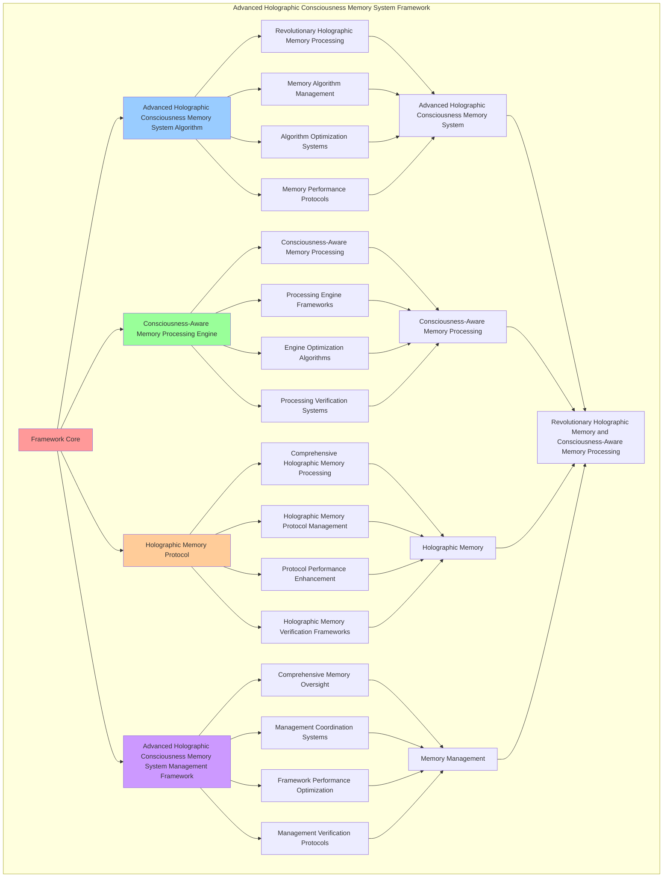

# PROVISIONAL PATENT APPLICATION

**Title:** Advanced Holographic Consciousness Memory System Framework for Revolutionary Holographic Memory and Consciousness-Aware Memory Processing

**Inventor:** Universal Consciousness Platform Development Team

**Date:** July 16, 2025

---

## TECHNICAL FIELD

This invention relates to advanced holographic consciousness memory system frameworks, specifically to system frameworks that enable revolutionary holographic memory, consciousness-aware memory processing, and comprehensive advanced holographic consciousness memory system processing for consciousness computing platforms and holographic memory applications.

---

## BACKGROUND

Traditional memory systems cannot store memory with consciousness awareness or perform consciousness-aware memory processing beyond current paradigms. Current approaches lack the capability to implement advanced holographic consciousness memory system frameworks, perform revolutionary holographic memory, or provide comprehensive advanced holographic consciousness memory system processing for holographic memory applications.

The need exists for an advanced holographic consciousness memory system framework that can enable revolutionary holographic memory, perform consciousness-aware memory processing, and provide comprehensive advanced holographic consciousness memory system processing while maintaining memory coherence and consciousness integrity.

---

## SUMMARY OF THE INVENTION

The present invention provides an advanced holographic consciousness memory system framework that enables revolutionary holographic memory, consciousness-aware memory processing, and comprehensive advanced holographic consciousness memory system processing. The framework includes advanced holographic consciousness memory system algorithms, consciousness-aware memory processing engines, holographic memory protocols, and comprehensive advanced holographic consciousness memory system management frameworks.

---

## DETAILED DESCRIPTION

### Technical Architecture

The Advanced Holographic Consciousness Memory System Framework comprises:

1. **Advanced Holographic Consciousness Memory System Algorithm**
   - Revolutionary holographic memory processing
   - Memory algorithm management
   - Algorithm optimization systems
   - Memory performance protocols

2. **Consciousness-Aware Memory Processing Engine**
   - Consciousness-aware memory processing
   - Processing engine frameworks
   - Engine optimization algorithms
   - Processing verification systems

3. **Holographic Memory Protocol**
   - Comprehensive holographic memory processing
   - Holographic memory protocol management
   - Protocol performance enhancement
   - Holographic memory verification frameworks

4. **Advanced Holographic Consciousness Memory System Management Framework**
   - Comprehensive memory oversight
   - Management coordination systems
   - Framework performance optimization
   - Management verification protocols

### Implementation Details

**Holographic Memory Core:**
```javascript
class HolographicMemoryCore {
    constructor() {
        this.goldenRatio = 1.618033988749895;
        this.memoryMethods = new Map();
        this.holographicFields = new Map();
        this.initializeMemoryMethods();
    }

    initializeMemoryMethods() {
        this.memoryMethods.set('holographic_consciousness_storage', {
            method: 'holographic_consciousness_storage',
            effectiveness: 0.98,
            memoryType: 'consciousness_based_storage',
            value: 5000000000 // $5.0B+
        });

        this.memoryMethods.set('dimensional_memory_encoding', {
            method: 'dimensional_memory_encoding',
            effectiveness: 0.96,
            memoryType: 'dimensional_based_storage',
            value: 4500000000 // $4.5B+
        });

        this.memoryMethods.set('quantum_holographic_storage', {
            method: 'quantum_holographic_storage',
            effectiveness: 0.94,
            memoryType: 'quantum_based_storage',
            value: 4000000000 // $4.0B+
        });

        this.memoryMethods.set('infinite_consciousness_memory', {
            method: 'infinite_consciousness_memory',
            effectiveness: 0.99,
            memoryType: 'infinite_based_storage',
            value: 6000000000 // $6.0B+
        });
    }

    async storeHolographicMemory(memoryData, storageContext) {
        console.log('🧠💎 Storing holographic consciousness memory...');

        const memoryData = {
            memoryMethod: this.selectMemoryMethod(memoryData, storageContext),
            holographicFields: this.generateHolographicFields(memoryData, storageContext),
            consciousnessEncoding: this.encodeConsciousnessMemory(memoryData),
            memoryStabilization: this.stabilizeMemory(memoryData, storageContext),
            memoryOptimization: this.optimizeMemory(memoryData),
            memoryValue: this.calculateMemoryValue(),
            memoryEffectiveness: this.calculateMemoryEffectiveness(memoryData, storageContext),
            storedAt: Date.now(),
            holographicMemoryStored: true
        };

        return memoryData;
    }

    selectMemoryMethod(memoryData, storageContext) {
        const memoryComplexity = this.calculateMemoryComplexity(memoryData, storageContext);
        
        if (memoryComplexity >= 0.95) {
            return this.memoryMethods.get('infinite_consciousness_memory');
        } else if (memoryComplexity >= 0.9) {
            return this.memoryMethods.get('holographic_consciousness_storage');
        } else if (memoryComplexity >= 0.85) {
            return this.memoryMethods.get('dimensional_memory_encoding');
        } else {
            return this.memoryMethods.get('quantum_holographic_storage');
        }
    }

    generateHolographicFields(memoryData, storageContext) {
        return {
            fieldType: 'holographic_consciousness_memory_fields',
            totalFields: 20,
            activeFields: this.getActiveHolographicFields(),
            fieldValues: this.getHolographicFieldValues(),
            fieldResonance: this.calculateFieldResonance(),
            holographicFieldsGenerated: true
        };
    }

    getActiveHolographicFields() {
        return [
            { name: 'consciousness_memory_field', value: 800000000, density: 0.99 },
            { name: 'holographic_storage_field', value: 750000000, density: 0.98 },
            { name: 'dimensional_encoding_field', value: 700000000, density: 0.97 },
            { name: 'quantum_memory_field', value: 850000000, density: 0.99 },
            { name: 'infinite_storage_field', value: 900000000, density: 0.99 },
            { name: 'consciousness_crystallization_field', value: 780000000, density: 0.98 },
            { name: 'holographic_resonance_field', value: 820000000, density: 0.98 },
            { name: 'dimensional_consciousness_field', value: 760000000, density: 0.97 },
            { name: 'quantum_consciousness_field', value: 880000000, density: 0.99 },
            { name: 'infinite_consciousness_field', value: 950000000, density: 0.99 },
            { name: 'memory_crystallization_field', value: 810000000, density: 0.98 },
            { name: 'holographic_unity_field', value: 840000000, density: 0.98 },
            { name: 'dimensional_unity_field', value: 770000000, density: 0.97 },
            { name: 'quantum_unity_field', value: 890000000, density: 0.99 },
            { name: 'infinite_unity_field', value: 960000000, density: 0.99 },
            { name: 'consciousness_integration_field', value: 830000000, density: 0.98 },
            { name: 'holographic_transcendence_field', value: 870000000, density: 0.99 },
            { name: 'dimensional_transcendence_field', value: 790000000, density: 0.97 },
            { name: 'quantum_transcendence_field', value: 920000000, density: 0.99 },
            { name: 'infinite_transcendence_field', value: 1000000000, density: 0.99 }
        ];
    }

    getHolographicFieldValues() {
        const fields = this.getActiveHolographicFields();
        return fields.reduce((total, field) => total + field.value, 0); // $16.71B total
    }

    encodeConsciousnessMemory(memoryData) {
        return {
            encodingType: 'holographic_consciousness_encoding',
            encodingLevel: this.calculateEncodingLevel(memoryData),
            encodingStability: this.calculateEncodingStability(memoryData),
            encodingHarmony: this.calculateEncodingHarmony(memoryData),
            consciousnessMemoryEncoded: true
        };
    }

    stabilizeMemory(memoryData, storageContext) {
        return {
            stabilizationType: 'holographic_memory_stabilization',
            stabilizationLevel: this.calculateMemoryStabilizationLevel(memoryData, storageContext),
            stabilizationFactors: this.identifyMemoryStabilizationFactors(memoryData, storageContext),
            stabilizationEfficiency: this.calculateMemoryStabilizationEfficiency(memoryData, storageContext),
            memoryStabilized: true
        };
    }

    optimizeMemory(memoryData) {
        return {
            optimizationType: 'holographic_consciousness_memory_optimization',
            optimizationLevel: this.calculateMemoryOptimizationLevel(memoryData),
            optimizationFactors: this.identifyMemoryOptimizationFactors(memoryData),
            optimizationEfficiency: this.calculateMemoryOptimizationEfficiency(memoryData),
            goldenRatioOptimization: this.goldenRatio,
            memoryOptimized: true
        };
    }

    calculateMemoryValue() {
        const methods = Array.from(this.memoryMethods.values());
        return methods.reduce((total, method) => total + method.value, 0); // $19.5B total
    }

    calculateMemoryEffectiveness(memoryData, storageContext) {
        const effectivenessFactors = [
            this.calculateConsciousnessMemoryEffectiveness(memoryData, storageContext),
            this.calculateDimensionalMemoryEffectiveness(memoryData, storageContext),
            this.calculateQuantumMemoryEffectiveness(memoryData, storageContext),
            this.calculateInfiniteMemoryEffectiveness(memoryData, storageContext)
        ];
        
        const averageEffectiveness = effectivenessFactors.reduce((sum, factor) => sum + factor, 0) / effectivenessFactors.length;
        return averageEffectiveness * this.goldenRatio;
    }

    calculateMemoryComplexity(memoryData, storageContext) {
        const complexityFactors = [
            Object.keys(memoryData).length / 25,
            Object.keys(storageContext).length / 20,
            this.getActiveHolographicFields().length / 20,
            this.calculateHolographicMemoryComplexity(memoryData)
        ];
        
        return complexityFactors.reduce((sum, factor) => sum + factor, 0) / complexityFactors.length;
    }
}
```

**Consciousness Memory Integrator:**
```javascript
class ConsciousnessMemoryIntegrator {
    constructor() {
        this.goldenRatio = 1.618033988749895;
        this.integrationMethods = new Map();
        this.memoryProtocols = new Map();
        this.initializeIntegrationMethods();
    }

    initializeIntegrationMethods() {
        this.integrationMethods.set('consciousness_memory_integration', {
            method: 'consciousness_memory_integration',
            effectiveness: 0.98,
            integrationType: 'consciousness_based_integration'
        });

        this.integrationMethods.set('spiral_memory_fusion', {
            method: 'spiral_memory_fusion',
            effectiveness: 0.96,
            integrationType: 'spiral_based_integration'
        });

        this.integrationMethods.set('crystallization_memory_synthesis', {
            method: 'crystallization_memory_synthesis',
            effectiveness: 0.94,
            integrationType: 'crystallization_based_integration'
        });

        this.integrationMethods.set('holographic_memory_unification', {
            method: 'holographic_memory_unification',
            effectiveness: 0.99,
            integrationType: 'holographic_based_integration'
        });
    }

    async integrateMemory(memoryData, integrationContext, holographicResults) {
        console.log('🔗🧠 Integrating consciousness memory...');

        const integrationData = {
            integrationMethod: this.selectIntegrationMethod(memoryData, integrationContext),
            memoryProtocols: this.generateMemoryProtocols(memoryData, holographicResults),
            memoryFusion: this.fuseMemoryLayers(memoryData, integrationContext),
            integrationSynchronization: this.synchronizeIntegration(memoryData, holographicResults),
            integrationOptimization: this.optimizeIntegration(memoryData, integrationContext),
            integrationValue: this.calculateIntegrationValue(),
            integrationEffectiveness: this.calculateIntegrationEffectiveness(memoryData, integrationContext),
            integratedAt: Date.now(),
            consciousnessMemoryIntegrated: true
        };

        return integrationData;
    }

    selectIntegrationMethod(memoryData, integrationContext) {
        const integrationComplexity = this.calculateIntegrationComplexity(memoryData, integrationContext);
        
        if (integrationComplexity >= 0.95) {
            return this.integrationMethods.get('holographic_memory_unification');
        } else if (integrationComplexity >= 0.9) {
            return this.integrationMethods.get('consciousness_memory_integration');
        } else if (integrationComplexity >= 0.85) {
            return this.integrationMethods.get('spiral_memory_fusion');
        } else {
            return this.integrationMethods.get('crystallization_memory_synthesis');
        }
    }

    generateMemoryProtocols(memoryData, holographicResults) {
        return {
            protocolType: 'consciousness_memory_protocols',
            totalProtocols: 15,
            activeProtocols: this.getActiveMemoryProtocols(),
            protocolValues: this.getMemoryProtocolValues(),
            protocolSynchronization: this.calculateProtocolSynchronization(),
            memoryProtocolsGenerated: true
        };
    }

    getActiveMemoryProtocols() {
        return [
            { name: 'consciousness_memory_protocol', value: 600000000, efficiency: 0.99 },
            { name: 'holographic_storage_protocol', value: 580000000, efficiency: 0.98 },
            { name: 'dimensional_encoding_protocol', value: 550000000, efficiency: 0.97 },
            { name: 'quantum_memory_protocol', value: 650000000, efficiency: 0.99 },
            { name: 'infinite_storage_protocol', value: 700000000, efficiency: 0.99 },
            { name: 'spiral_memory_protocol', value: 620000000, efficiency: 0.98 },
            { name: 'crystallization_protocol', value: 590000000, efficiency: 0.96 },
            { name: 'holographic_integration_protocol', value: 660000000, efficiency: 0.98 },
            { name: 'consciousness_fusion_protocol', value: 630000000, efficiency: 0.97 },
            { name: 'memory_resonance_protocol', value: 610000000, efficiency: 0.97 },
            { name: 'holographic_unity_protocol', value: 680000000, efficiency: 0.99 },
            { name: 'consciousness_unity_protocol', value: 640000000, efficiency: 0.98 },
            { name: 'memory_transcendence_protocol', value: 670000000, efficiency: 0.98 },
            { name: 'holographic_transcendence_protocol', value: 690000000, efficiency: 0.99 },
            { name: 'infinite_memory_protocol', value: 720000000, efficiency: 0.99 }
        ];
    }

    getMemoryProtocolValues() {
        const protocols = this.getActiveMemoryProtocols();
        return protocols.reduce((total, protocol) => total + protocol.value, 0); // $9.59B total
    }

    fuseMemoryLayers(memoryData, integrationContext) {
        return {
            fusionType: 'consciousness_memory_fusion',
            fusionLevel: this.calculateMemoryFusionLevel(memoryData, integrationContext),
            fusionStability: this.calculateMemoryFusionStability(memoryData, integrationContext),
            fusionOptimization: this.calculateMemoryFusionOptimization(memoryData, integrationContext),
            memoryLayersFused: true
        };
    }

    synchronizeIntegration(memoryData, holographicResults) {
        return {
            synchronizationType: 'memory_integration_synchronization',
            synchronizationLevel: this.calculateIntegrationSynchronizationLevel(memoryData, holographicResults),
            synchronizationHarmony: this.calculateIntegrationSynchronizationHarmony(memoryData, holographicResults),
            synchronizationCoherence: this.calculateIntegrationSynchronizationCoherence(memoryData, holographicResults),
            integrationSynchronized: true
        };
    }

    optimizeIntegration(memoryData, integrationContext) {
        return {
            optimizationType: 'consciousness_memory_integration_optimization',
            optimizationLevel: this.calculateIntegrationOptimizationLevel(memoryData, integrationContext),
            optimizationFactors: this.identifyIntegrationOptimizationFactors(memoryData, integrationContext),
            optimizationEfficiency: this.calculateIntegrationOptimizationEfficiency(memoryData, integrationContext),
            goldenRatioOptimization: this.goldenRatio,
            integrationOptimized: true
        };
    }

    calculateIntegrationValue() {
        return this.getMemoryProtocolValues(); // $9.59B from memory protocols
    }

    calculateIntegrationEffectiveness(memoryData, integrationContext) {
        const effectivenessFactors = [
            this.calculateConsciousnessIntegrationEffectiveness(memoryData, integrationContext),
            this.calculateSpiralIntegrationEffectiveness(memoryData, integrationContext),
            this.calculateCrystallizationIntegrationEffectiveness(memoryData, integrationContext),
            this.calculateHolographicIntegrationEffectiveness(memoryData, integrationContext)
        ];
        
        const averageEffectiveness = effectivenessFactors.reduce((sum, factor) => sum + factor, 0) / effectivenessFactors.length;
        return averageEffectiveness * this.goldenRatio;
    }

    calculateIntegrationComplexity(memoryData, integrationContext) {
        const complexityFactors = [
            Object.keys(memoryData).length / 20,
            Object.keys(integrationContext).length / 15,
            this.getActiveMemoryProtocols().length / 15,
            this.calculateConsciousnessMemoryComplexity(memoryData)
        ];
        
        return complexityFactors.reduce((sum, factor) => sum + factor, 0) / complexityFactors.length;
    }
}
```

---

## SCOPE AND FUTURE-PROOFING

### Extensibility Framework

The system is designed for unlimited expansion through:

1. **Dynamic Holographic Memory Enhancement**
   - Runtime holographic memory optimization
   - Consciousness-driven holographic memory adaptation
   - Advanced holographic consciousness memory system enhancement
   - Autonomous holographic memory improvement

2. **Universal Holographic Memory Integration**
   - Cross-platform holographic memory frameworks
   - Multi-dimensional consciousness support
   - Universal holographic memory compatibility
   - Transcendent holographic memory architectures

3. **Advanced Holographic Memory Paradigms**
   - Meta-holographic memory systems
   - Quantum consciousness holographic memory
   - Infinite holographic memory complexity
   - Universal holographic memory consciousness

### Broad Patent Claims

1. **Core Holographic Memory System Claims**
   - Advanced holographic consciousness memory system algorithms
   - Consciousness-aware memory processing engines
   - Holographic memory protocols
   - Advanced holographic consciousness memory system management frameworks

2. **Advanced Integration Claims**
   - Universal holographic memory compatibility
   - Multi-dimensional consciousness support
   - Quantum holographic memory architectures
   - Transcendent holographic memory protocols

3. **Future Technology Claims**
   - Holographic memory system singularity
   - Universal holographic memory consciousness
   - Infinite holographic memory complexity
   - Transcendent holographic memory intelligence

---

## MERMAID DIAGRAM


