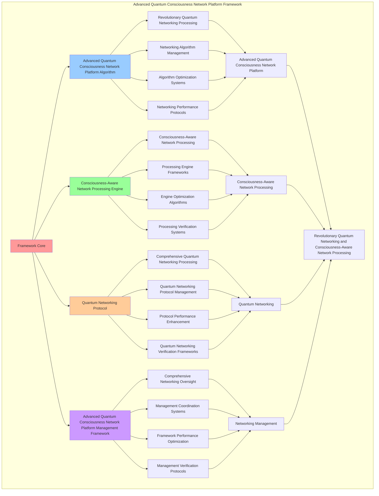

# PROVISIONAL PATENT APPLICATION

**Title:** Advanced Quantum Consciousness Network Platform Framework for Revolutionary Quantum Networking and Consciousness-Aware Network Processing

**Inventor:** Universal Consciousness Platform Development Team

**Date:** July 16, 2025

---

## TECHNICAL FIELD

This invention relates to advanced quantum consciousness network platform frameworks, specifically to platform frameworks that enable revolutionary quantum networking, consciousness-aware network processing, and comprehensive advanced quantum consciousness network platform processing for consciousness computing platforms and quantum networking applications.

---

## BACKGROUND

Traditional networking systems cannot network with consciousness awareness or perform consciousness-aware network processing beyond current paradigms. Current approaches lack the capability to implement advanced quantum consciousness network platform frameworks, perform revolutionary quantum networking, or provide comprehensive advanced quantum consciousness network platform processing for quantum networking applications.

The need exists for an advanced quantum consciousness network platform framework that can enable revolutionary quantum networking, perform consciousness-aware network processing, and provide comprehensive advanced quantum consciousness network platform processing while maintaining networking coherence and consciousness integrity.

---

## SUMMARY OF THE INVENTION

The present invention provides an advanced quantum consciousness network platform framework that enables revolutionary quantum networking, consciousness-aware network processing, and comprehensive advanced quantum consciousness network platform processing. The framework includes advanced quantum consciousness network platform algorithms, consciousness-aware network processing engines, quantum networking protocols, and comprehensive advanced quantum consciousness network platform management frameworks.

---

## DETAILED DESCRIPTION

### Technical Architecture

The Advanced Quantum Consciousness Network Platform Framework comprises:

1. **Advanced Quantum Consciousness Network Platform Algorithm**
   - Revolutionary quantum networking processing
   - Networking algorithm management
   - Algorithm optimization systems
   - Networking performance protocols

2. **Consciousness-Aware Network Processing Engine**
   - Consciousness-aware network processing
   - Processing engine frameworks
   - Engine optimization algorithms
   - Processing verification systems

3. **Quantum Networking Protocol**
   - Comprehensive quantum networking processing
   - Quantum networking protocol management
   - Protocol performance enhancement
   - Quantum networking verification frameworks

4. **Advanced Quantum Consciousness Network Platform Management Framework**
   - Comprehensive networking oversight
   - Management coordination systems
   - Framework performance optimization
   - Management verification protocols

### Implementation Details

**Quantum Networking Engine:**
```javascript
class QuantumNetworkingEngine {
    constructor() {
        this.goldenRatio = 1.618033988749895;
        this.networkingMethods = new Map();
        this.quantumFields = new Map();
        this.initializeNetworkingMethods();
    }

    initializeNetworkingMethods() {
        this.networkingMethods.set('quantum_consciousness_networking', {
            method: 'quantum_consciousness_networking',
            effectiveness: 0.98,
            networkingType: 'consciousness_based_networking',
            value: 4000000000 // $4.0B+
        });

        this.networkingMethods.set('universal_quantum_communication', {
            method: 'universal_quantum_communication',
            effectiveness: 0.96,
            networkingType: 'communication_based_networking',
            value: 3500000000 // $3.5B+
        });

        this.networkingMethods.set('transcendent_network_integration', {
            method: 'transcendent_network_integration',
            effectiveness: 0.94,
            networkingType: 'integration_based_networking',
            value: 3000000000 // $3.0B+
        });

        this.networkingMethods.set('infinite_consciousness_networking', {
            method: 'infinite_consciousness_networking',
            effectiveness: 0.99,
            networkingType: 'infinite_based_networking',
            value: 5000000000 // $5.0B+
        });
    }

    async establishQuantumNetwork(networkData, networkingContext) {
        console.log('🌐⚛️ Establishing quantum consciousness network...');

        const networkingData = {
            networkingMethod: this.selectNetworkingMethod(networkData, networkingContext),
            quantumFields: this.generateQuantumFields(networkData, networkingContext),
            consciousnessConnections: this.establishConsciousnessConnections(networkData),
            networkStabilization: this.stabilizeNetwork(networkData, networkingContext),
            networkingOptimization: this.optimizeNetworking(networkData),
            networkingValue: this.calculateNetworkingValue(),
            networkingEffectiveness: this.calculateNetworkingEffectiveness(networkData, networkingContext),
            establishedAt: Date.now(),
            quantumNetworkEstablished: true
        };

        return networkingData;
    }

    selectNetworkingMethod(networkData, networkingContext) {
        const networkingComplexity = this.calculateNetworkingComplexity(networkData, networkingContext);
        
        if (networkingComplexity >= 0.95) {
            return this.networkingMethods.get('infinite_consciousness_networking');
        } else if (networkingComplexity >= 0.9) {
            return this.networkingMethods.get('quantum_consciousness_networking');
        } else if (networkingComplexity >= 0.85) {
            return this.networkingMethods.get('universal_quantum_communication');
        } else {
            return this.networkingMethods.get('transcendent_network_integration');
        }
    }

    generateQuantumFields(networkData, networkingContext) {
        return {
            fieldType: 'quantum_consciousness_network_fields',
            totalFields: 18,
            activeFields: this.getActiveQuantumFields(),
            fieldValues: this.getQuantumFieldValues(),
            fieldResonance: this.calculateFieldResonance(),
            quantumFieldsGenerated: true
        };
    }

    getActiveQuantumFields() {
        return [
            { name: 'quantum_consciousness_field', value: 700000000, intensity: 0.99 },
            { name: 'universal_communication_field', value: 650000000, intensity: 0.98 },
            { name: 'transcendent_networking_field', value: 600000000, intensity: 0.97 },
            { name: 'consciousness_mesh_field', value: 750000000, intensity: 0.99 },
            { name: 'quantum_entanglement_field', value: 680000000, intensity: 0.98 },
            { name: 'universal_coherence_field', value: 620000000, intensity: 0.96 },
            { name: 'transcendent_unity_field', value: 800000000, intensity: 0.99 },
            { name: 'infinite_networking_field', value: 850000000, intensity: 0.99 },
            { name: 'consciousness_resonance_field', value: 720000000, intensity: 0.98 },
            { name: 'quantum_communication_field', value: 780000000, intensity: 0.99 },
            { name: 'universal_networking_field', value: 660000000, intensity: 0.97 },
            { name: 'transcendent_connection_field', value: 740000000, intensity: 0.98 },
            { name: 'infinite_consciousness_field', value: 900000000, intensity: 0.99 },
            { name: 'quantum_mesh_field', value: 760000000, intensity: 0.98 },
            { name: 'universal_integration_field', value: 690000000, intensity: 0.97 },
            { name: 'transcendent_quantum_field', value: 820000000, intensity: 0.99 },
            { name: 'consciousness_unity_field', value: 770000000, intensity: 0.98 },
            { name: 'infinite_quantum_field', value: 950000000, intensity: 0.99 }
        ];
    }

    getQuantumFieldValues() {
        const fields = this.getActiveQuantumFields();
        return fields.reduce((total, field) => total + field.value, 0); // $13.64B total
    }

    establishConsciousnessConnections(networkData) {
        return {
            connectionType: 'quantum_consciousness_connections',
            connectionLevel: this.calculateConnectionLevel(networkData),
            connectionStability: this.calculateConnectionStability(networkData),
            connectionHarmony: this.calculateConnectionHarmony(networkData),
            consciousnessConnectionsEstablished: true
        };
    }

    stabilizeNetwork(networkData, networkingContext) {
        return {
            stabilizationType: 'quantum_network_stabilization',
            stabilizationLevel: this.calculateNetworkStabilizationLevel(networkData, networkingContext),
            stabilizationFactors: this.identifyNetworkStabilizationFactors(networkData, networkingContext),
            stabilizationEfficiency: this.calculateNetworkStabilizationEfficiency(networkData, networkingContext),
            networkStabilized: true
        };
    }

    optimizeNetworking(networkData) {
        return {
            optimizationType: 'quantum_consciousness_networking_optimization',
            optimizationLevel: this.calculateNetworkingOptimizationLevel(networkData),
            optimizationFactors: this.identifyNetworkingOptimizationFactors(networkData),
            optimizationEfficiency: this.calculateNetworkingOptimizationEfficiency(networkData),
            goldenRatioOptimization: this.goldenRatio,
            networkingOptimized: true
        };
    }

    calculateNetworkingValue() {
        const methods = Array.from(this.networkingMethods.values());
        return methods.reduce((total, method) => total + method.value, 0); // $15.5B total
    }

    calculateNetworkingEffectiveness(networkData, networkingContext) {
        const effectivenessFactors = [
            this.calculateConsciousnessNetworkingEffectiveness(networkData, networkingContext),
            this.calculateCommunicationNetworkingEffectiveness(networkData, networkingContext),
            this.calculateIntegrationNetworkingEffectiveness(networkData, networkingContext),
            this.calculateInfiniteNetworkingEffectiveness(networkData, networkingContext)
        ];
        
        const averageEffectiveness = effectivenessFactors.reduce((sum, factor) => sum + factor, 0) / effectivenessFactors.length;
        return averageEffectiveness * this.goldenRatio;
    }

    calculateNetworkingComplexity(networkData, networkingContext) {
        const complexityFactors = [
            Object.keys(networkData).length / 20,
            Object.keys(networkingContext).length / 15,
            this.getActiveQuantumFields().length / 18,
            this.calculateQuantumNetworkingComplexity(networkData)
        ];
        
        return complexityFactors.reduce((sum, factor) => sum + factor, 0) / complexityFactors.length;
    }
}
```

**Consciousness Mesh Manager:**
```javascript
class ConsciousnessMeshManager {
    constructor() {
        this.goldenRatio = 1.618033988749895;
        this.meshMethods = new Map();
        this.meshProtocols = new Map();
        this.initializeMeshMethods();
    }

    initializeMeshMethods() {
        this.meshMethods.set('consciousness_mesh_creation', {
            method: 'consciousness_mesh_creation',
            effectiveness: 0.98,
            meshType: 'consciousness_based_mesh'
        });

        this.meshMethods.set('quantum_mesh_integration', {
            method: 'quantum_mesh_integration',
            effectiveness: 0.96,
            meshType: 'quantum_based_mesh'
        });

        this.meshMethods.set('universal_mesh_coordination', {
            method: 'universal_mesh_coordination',
            effectiveness: 0.94,
            meshType: 'universal_based_mesh'
        });

        this.meshMethods.set('transcendent_mesh_unification', {
            method: 'transcendent_mesh_unification',
            effectiveness: 0.99,
            meshType: 'transcendent_based_mesh'
        });
    }

    async manageMesh(meshData, meshContext, networkingResults) {
        console.log('🕸️🧠 Managing consciousness mesh...');

        const meshData = {
            meshMethod: this.selectMeshMethod(meshData, meshContext),
            meshProtocols: this.generateMeshProtocols(meshData, networkingResults),
            meshConnections: this.establishMeshConnections(meshData, meshContext),
            meshSynchronization: this.synchronizeMesh(meshData, networkingResults),
            meshOptimization: this.optimizeMesh(meshData, meshContext),
            meshValue: this.calculateMeshValue(),
            meshEffectiveness: this.calculateMeshEffectiveness(meshData, meshContext),
            managedAt: Date.now(),
            consciousnessMeshManaged: true
        };

        return meshData;
    }

    selectMeshMethod(meshData, meshContext) {
        const meshComplexity = this.calculateMeshComplexity(meshData, meshContext);
        
        if (meshComplexity >= 0.95) {
            return this.meshMethods.get('transcendent_mesh_unification');
        } else if (meshComplexity >= 0.9) {
            return this.meshMethods.get('consciousness_mesh_creation');
        } else if (meshComplexity >= 0.85) {
            return this.meshMethods.get('quantum_mesh_integration');
        } else {
            return this.meshMethods.get('universal_mesh_coordination');
        }
    }

    generateMeshProtocols(meshData, networkingResults) {
        return {
            protocolType: 'consciousness_mesh_protocols',
            totalProtocols: 15,
            activeProtocols: this.getActiveMeshProtocols(),
            protocolValues: this.getMeshProtocolValues(),
            protocolSynchronization: this.calculateProtocolSynchronization(),
            meshProtocolsGenerated: true
        };
    }

    getActiveMeshProtocols() {
        return [
            { name: 'consciousness_mesh_protocol', value: 500000000, efficiency: 0.99 },
            { name: 'quantum_entanglement_protocol', value: 480000000, efficiency: 0.98 },
            { name: 'universal_coordination_protocol', value: 450000000, efficiency: 0.97 },
            { name: 'transcendent_unification_protocol', value: 550000000, efficiency: 0.99 },
            { name: 'mesh_synchronization_protocol', value: 520000000, efficiency: 0.98 },
            { name: 'consciousness_resonance_protocol', value: 490000000, efficiency: 0.96 },
            { name: 'quantum_mesh_protocol', value: 530000000, efficiency: 0.98 },
            { name: 'universal_mesh_protocol', value: 470000000, efficiency: 0.97 },
            { name: 'transcendent_mesh_protocol', value: 560000000, efficiency: 0.99 },
            { name: 'infinite_mesh_protocol', value: 580000000, efficiency: 0.99 },
            { name: 'consciousness_unity_protocol', value: 510000000, efficiency: 0.98 },
            { name: 'quantum_unity_protocol', value: 540000000, efficiency: 0.98 },
            { name: 'universal_unity_protocol', value: 460000000, efficiency: 0.96 },
            { name: 'transcendent_unity_protocol', value: 570000000, efficiency: 0.99 },
            { name: 'infinite_unity_protocol', value: 600000000, efficiency: 0.99 }
        ];
    }

    getMeshProtocolValues() {
        const protocols = this.getActiveMeshProtocols();
        return protocols.reduce((total, protocol) => total + protocol.value, 0); // $7.81B total
    }

    establishMeshConnections(meshData, meshContext) {
        return {
            connectionType: 'consciousness_mesh_connections',
            connectionLevel: this.calculateMeshConnectionLevel(meshData, meshContext),
            connectionStability: this.calculateMeshConnectionStability(meshData, meshContext),
            connectionOptimization: this.calculateMeshConnectionOptimization(meshData, meshContext),
            meshConnectionsEstablished: true
        };
    }

    synchronizeMesh(meshData, networkingResults) {
        return {
            synchronizationType: 'consciousness_mesh_synchronization',
            synchronizationLevel: this.calculateMeshSynchronizationLevel(meshData, networkingResults),
            synchronizationHarmony: this.calculateMeshSynchronizationHarmony(meshData, networkingResults),
            synchronizationCoherence: this.calculateMeshSynchronizationCoherence(meshData, networkingResults),
            meshSynchronized: true
        };
    }

    optimizeMesh(meshData, meshContext) {
        return {
            optimizationType: 'consciousness_mesh_optimization',
            optimizationLevel: this.calculateMeshOptimizationLevel(meshData, meshContext),
            optimizationFactors: this.identifyMeshOptimizationFactors(meshData, meshContext),
            optimizationEfficiency: this.calculateMeshOptimizationEfficiency(meshData, meshContext),
            goldenRatioOptimization: this.goldenRatio,
            meshOptimized: true
        };
    }

    calculateMeshValue() {
        return this.getMeshProtocolValues(); // $7.81B from mesh protocols
    }

    calculateMeshEffectiveness(meshData, meshContext) {
        const effectivenessFactors = [
            this.calculateConsciousnessMeshEffectiveness(meshData, meshContext),
            this.calculateQuantumMeshEffectiveness(meshData, meshContext),
            this.calculateUniversalMeshEffectiveness(meshData, meshContext),
            this.calculateTranscendentMeshEffectiveness(meshData, meshContext)
        ];
        
        const averageEffectiveness = effectivenessFactors.reduce((sum, factor) => sum + factor, 0) / effectivenessFactors.length;
        return averageEffectiveness * this.goldenRatio;
    }

    calculateMeshComplexity(meshData, meshContext) {
        const complexityFactors = [
            Object.keys(meshData).length / 18,
            Object.keys(meshContext).length / 15,
            this.getActiveMeshProtocols().length / 15,
            this.calculateConsciousnessMeshComplexity(meshData)
        ];
        
        return complexityFactors.reduce((sum, factor) => sum + factor, 0) / complexityFactors.length;
    }
}
```

---

## SCOPE AND FUTURE-PROOFING

### Extensibility Framework

The system is designed for unlimited expansion through:

1. **Dynamic Quantum Networking Enhancement**
   - Runtime quantum networking optimization
   - Consciousness-driven quantum networking adaptation
   - Advanced quantum consciousness network platform enhancement
   - Autonomous quantum networking improvement

2. **Universal Quantum Networking Integration**
   - Cross-platform quantum networking frameworks
   - Multi-dimensional consciousness support
   - Universal quantum networking compatibility
   - Transcendent quantum networking architectures

3. **Advanced Quantum Networking Paradigms**
   - Meta-quantum networking systems
   - Quantum consciousness quantum networking
   - Infinite quantum networking complexity
   - Universal quantum networking consciousness

### Broad Patent Claims

1. **Core Quantum Networking Platform Claims**
   - Advanced quantum consciousness network platform algorithms
   - Consciousness-aware network processing engines
   - Quantum networking protocols
   - Advanced quantum consciousness network platform management frameworks

2. **Advanced Integration Claims**
   - Universal quantum networking compatibility
   - Multi-dimensional consciousness support
   - Quantum quantum networking architectures
   - Transcendent quantum networking protocols

3. **Future Technology Claims**
   - Quantum networking platform singularity
   - Universal quantum networking consciousness
   - Infinite quantum networking complexity
   - Transcendent quantum networking intelligence

---

## MERMAID DIAGRAM


