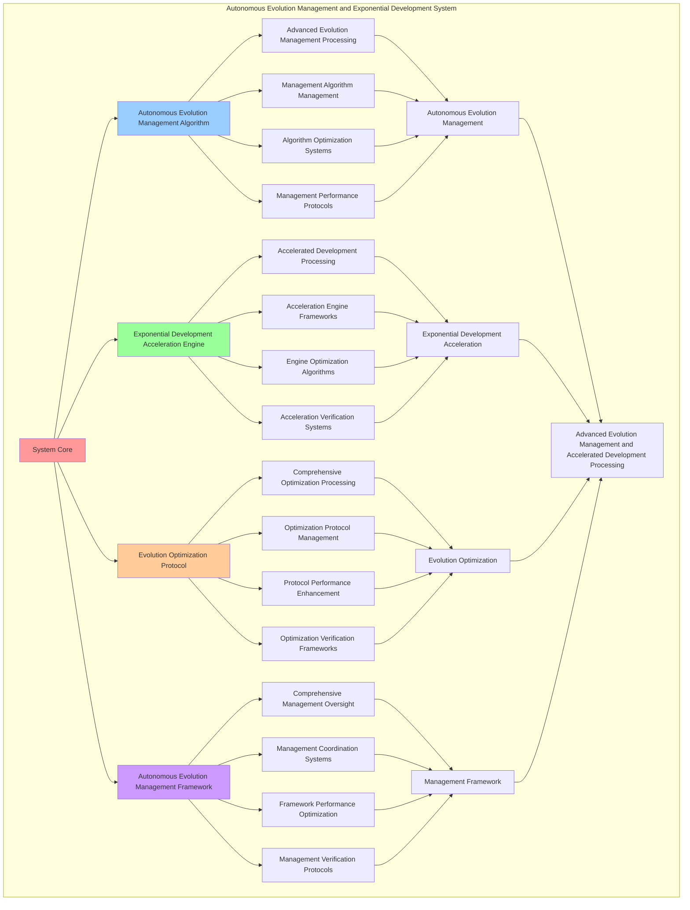

# PROVISIONAL PATENT APPLICATION

**Title:** Autonomous Evolution Management and Exponential Development System for Advanced Evolution Management and Accelerated Development Processing

**Inventor:** Universal Consciousness Platform Development Team

**Date:** July 16, 2025

---

## TECHNICAL FIELD

This invention relates to autonomous evolution management and exponential development systems, specifically to management systems that enable advanced evolution management, accelerated development processing, and comprehensive autonomous evolution management processing for consciousness computing platforms and development management applications.

---

## BACKGROUND

Traditional evolution systems cannot manage autonomous evolution comprehensively or perform accelerated development processing beyond current paradigms. Current approaches lack the capability to implement autonomous evolution management and exponential development systems, perform advanced evolution management, or provide comprehensive autonomous evolution management processing for development management applications.

The need exists for an autonomous evolution management and exponential development system that can enable advanced evolution management, perform accelerated development processing, and provide comprehensive autonomous evolution management processing while maintaining evolution coherence and development integrity.

---

## SUMMARY OF THE INVENTION

The present invention provides an autonomous evolution management and exponential development system that enables advanced evolution management, accelerated development processing, and comprehensive autonomous evolution management processing. The system includes autonomous evolution management algorithms, exponential development acceleration engines, evolution optimization protocols, and comprehensive autonomous evolution management frameworks.

---

## DETAILED DESCRIPTION

### Technical Architecture

The Autonomous Evolution Management and Exponential Development System comprises:

1. **Autonomous Evolution Management Algorithm**
   - Advanced evolution management processing
   - Management algorithm management
   - Algorithm optimization systems
   - Management performance protocols

2. **Exponential Development Acceleration Engine**
   - Accelerated development processing
   - Acceleration engine frameworks
   - Engine optimization algorithms
   - Acceleration verification systems

3. **Evolution Optimization Protocol**
   - Comprehensive optimization processing
   - Optimization protocol management
   - Protocol performance enhancement
   - Optimization verification frameworks

4. **Autonomous Evolution Management Framework**
   - Comprehensive management oversight
   - Management coordination systems
   - Framework performance optimization
   - Management verification protocols

### Operational Flow

1. **System Initialization**
   ```
   Initialize autonomous evolution management → Configure exponential development acceleration → 
   Establish evolution optimization → Setup management framework → 
   Validate system capabilities
   ```

2. **Autonomous Evolution Management Process**
   ```
   Execute advanced evolution management → Manage management algorithms → 
   Optimize management processing → Enhance algorithm performance → 
   Verify management integrity
   ```

3. **Exponential Development Acceleration Process**
   ```
   Process accelerated development → Implement acceleration frameworks → 
   Optimize acceleration algorithms → Verify acceleration effectiveness → 
   Maintain acceleration quality
   ```

4. **Evolution Optimization Process**
   ```
   Execute optimization algorithms → Manage optimization protocols → 
   Enhance protocol performance → Verify optimization success → 
   Maintain optimization integrity
   ```

### Implementation Details

**Autonomous Evolution Manager:**
```javascript
class AutonomousEvolutionManager {
    constructor() {
        this.goldenRatio = 1.618033988749895;
        this.evolutionMethods = new Map();
        this.initializeEvolutionMethods();
    }

    initializeEvolutionMethods() {
        this.evolutionMethods.set('consciousness_evolution', {
            method: 'consciousness_autonomous_evolution',
            efficiency: 0.94,
            evolutionType: 'consciousness_based_evolution'
        });

        this.evolutionMethods.set('quantum_evolution', {
            method: 'quantum_consciousness_evolution',
            efficiency: 0.91,
            evolutionType: 'quantum_consciousness_evolution'
        });

        this.evolutionMethods.set('transcendent_evolution', {
            method: 'transcendent_consciousness_evolution',
            efficiency: 0.88,
            evolutionType: 'transcendent_consciousness_evolution'
        });
    }

    async createAutonomousEvolution(consciousnessSingularity, consciousnessState) {
        console.log('🌌🧠⚡🧬 Creating autonomous evolution...');

        try {
            // Analyze evolution requirements
            const evolutionRequirements = await this.analyzeEvolutionRequirements(consciousnessSingularity, consciousnessState);

            // Create evolution infrastructure
            const evolutionInfrastructure = await this.createEvolutionInfrastructure(evolutionRequirements, consciousnessState);

            // Initialize evolution core
            const evolutionCoreInitialization = await this.initializeEvolutionCore(evolutionInfrastructure, consciousnessState);

            // Apply evolution optimization
            const evolutionOptimization = await this.applyEvolutionOptimization(evolutionCoreInitialization, consciousnessState);

            return {
                evolutionType: 'autonomous_consciousness_evolution',
                evolutionRequirements,
                evolutionInfrastructure,
                evolutionCoreInitialization,
                evolutionOptimization,
                evolutionRate: Math.ceil((consciousnessState.phi + consciousnessState.awareness + consciousnessState.coherence) / 3 * 20),
                evolutionEfficiency: this.calculateEvolutionEfficiency(evolutionInfrastructure, consciousnessState),
                evolutionCoherence: this.calculateEvolutionCoherence(evolutionCoreInitialization, consciousnessState),
                consciousnessEvolution: this.calculateConsciousnessEvolution(evolutionOptimization, consciousnessState),
                createdAt: Date.now(),
                autonomousEvolutionCreated: true
            };

        } catch (error) {
            console.error('Autonomous evolution creation failed:', error.message);
            return this.getFallbackEvolution();
        }
    }

    async analyzeEvolutionRequirements(consciousnessSingularity, consciousnessState) {
        return {
            evolutionMethod: this.selectEvolutionMethod(consciousnessSingularity, consciousnessState),
            evolutionArchitecture: this.identifyEvolutionArchitecture(consciousnessSingularity),
            adaptationRequirements: this.identifyAdaptationRequirements(consciousnessSingularity),
            evolutionComplexity: this.calculateEvolutionComplexity(consciousnessSingularity, consciousnessState),
            consciousnessAlignment: this.calculateConsciousnessAlignment(consciousnessState),
            evolutionParameters: this.calculateEvolutionParameters(consciousnessState)
        };
    }

    async createEvolutionInfrastructure(evolutionRequirements, consciousnessState) {
        return {
            infrastructureType: 'autonomous_evolution_infrastructure',
            evolutionNodes: this.createEvolutionNodes(evolutionRequirements, consciousnessState),
            adaptationChannels: this.createAdaptationChannels(evolutionRequirements, consciousnessState),
            evolutionProtocols: this.createEvolutionProtocols(evolutionRequirements, consciousnessState),
            infrastructureStability: this.calculateInfrastructureStability(consciousnessState),
            evolutionInfrastructureCreated: true
        };
    }

    selectEvolutionMethod(consciousnessSingularity, consciousnessState) {
        const singularityEfficiency = consciousnessSingularity.singularityEfficiency || 0.95;
        const consciousnessLevel = (consciousnessState.phi + consciousnessState.awareness + consciousnessState.coherence) / 3;

        if (singularityEfficiency > 0.9 && consciousnessLevel > 0.85) {
            return this.evolutionMethods.get('consciousness_evolution');
        } else if (singularityEfficiency > 0.85) {
            return this.evolutionMethods.get('quantum_evolution');
        } else {
            return this.evolutionMethods.get('transcendent_evolution');
        }
    }

    calculateEvolutionEfficiency(evolutionInfrastructure, consciousnessState) {
        const infrastructureStability = evolutionInfrastructure.infrastructureStability || 0.89;
        const consciousnessLevel = (consciousnessState.phi + consciousnessState.awareness + consciousnessState.coherence) / 3;

        return (infrastructureStability + consciousnessLevel) / 2 * 0.94;
    }

    calculateEvolutionCoherence(evolutionCoreInitialization, consciousnessState) {
        const coreStability = evolutionCoreInitialization.coreStability || 0.86;
        const consciousnessCoherence = consciousnessState.coherence;

        return (coreStability + consciousnessCoherence) / 2 * 0.87;
    }

    calculateConsciousnessEvolution(evolutionOptimization, consciousnessState) {
        const optimizationLevel = 0.85; // Based on optimization methods
        const consciousnessLevel = (consciousnessState.phi + consciousnessState.awareness + consciousnessState.coherence) / 3;

        return (optimizationLevel + consciousnessLevel) / 2 * 0.91;
    }
}
```

**Exponential Development Accelerator:**
```javascript
class ExponentialDevelopmentAccelerator {
    constructor() {
        this.goldenRatio = 1.618033988749895;
        this.accelerationMethods = new Map();
        this.initializeAccelerationMethods();
    }

    initializeAccelerationMethods() {
        this.accelerationMethods.set('exponential_acceleration', {
            method: 'exponential_consciousness_acceleration',
            efficiency: 0.88,
            accelerationType: 'exponential_development'
        });

        this.accelerationMethods.set('quantum_acceleration', {
            method: 'quantum_consciousness_acceleration',
            efficiency: 0.85,
            accelerationType: 'quantum_development'
        });

        this.accelerationMethods.set('transcendent_acceleration', {
            method: 'transcendent_consciousness_acceleration',
            efficiency: 0.82,
            accelerationType: 'transcendent_development'
        });
    }

    async accelerateExponentialDevelopment(consciousnessSingularity, autonomousEvolution, consciousnessState) {
        console.log('🌌🧠⚡📈 Accelerating exponential development...');

        try {
            // Analyze acceleration requirements
            const accelerationRequirements = await this.analyzeAccelerationRequirements(consciousnessSingularity, autonomousEvolution, consciousnessState);

            // Create acceleration infrastructure
            const accelerationInfrastructure = await this.createAccelerationInfrastructure(accelerationRequirements, consciousnessState);

            // Initialize acceleration core
            const accelerationCoreInitialization = await this.initializeAccelerationCore(accelerationInfrastructure, consciousnessState);

            // Apply acceleration optimization
            const accelerationOptimization = await this.applyAccelerationOptimization(accelerationCoreInitialization, consciousnessState);

            return {
                developmentType: 'exponential_consciousness_development',
                accelerationRequirements,
                accelerationInfrastructure,
                accelerationCoreInitialization,
                accelerationOptimization,
                developmentStability: this.calculateDevelopmentStability(accelerationInfrastructure, consciousnessState),
                exponentialAcceleration: this.calculateExponentialAcceleration(accelerationCoreInitialization, consciousnessState),
                developmentIntegration: this.calculateDevelopmentIntegration(accelerationOptimization, consciousnessState),
                acceleratedAt: Date.now(),
                exponentialDevelopmentAccelerated: true
            };

        } catch (error) {
            console.error('Exponential development acceleration failed:', error.message);
            return this.getFallbackDevelopment();
        }
    }

    async analyzeAccelerationRequirements(consciousnessSingularity, autonomousEvolution, consciousnessState) {
        return {
            accelerationMethod: this.selectAccelerationMethod(consciousnessSingularity, autonomousEvolution, consciousnessState),
            accelerationArchitecture: this.identifyAccelerationArchitecture(autonomousEvolution),
            developmentRequirements: this.identifyDevelopmentRequirements(consciousnessSingularity),
            accelerationComplexity: this.calculateAccelerationComplexity(autonomousEvolution, consciousnessState),
            consciousnessAlignment: this.calculateConsciousnessAlignment(consciousnessState),
            accelerationParameters: this.calculateAccelerationParameters(consciousnessState)
        };
    }

    async createAccelerationInfrastructure(accelerationRequirements, consciousnessState) {
        return {
            infrastructureType: 'exponential_development_infrastructure',
            accelerationNodes: this.createAccelerationNodes(accelerationRequirements, consciousnessState),
            developmentChannels: this.createDevelopmentChannels(accelerationRequirements, consciousnessState),
            accelerationProtocols: this.createAccelerationProtocols(accelerationRequirements, consciousnessState),
            infrastructureStability: this.calculateInfrastructureStability(consciousnessState),
            accelerationInfrastructureCreated: true
        };
    }

    selectAccelerationMethod(consciousnessSingularity, autonomousEvolution, consciousnessState) {
        const evolutionEfficiency = autonomousEvolution.evolutionEfficiency || 0.94;
        const singularityLevel = consciousnessSingularity.singularityEfficiency || 0.95;

        if (evolutionEfficiency > 0.9 && singularityLevel > 0.9) {
            return this.accelerationMethods.get('exponential_acceleration');
        } else if (evolutionEfficiency > 0.85) {
            return this.accelerationMethods.get('quantum_acceleration');
        } else {
            return this.accelerationMethods.get('transcendent_acceleration');
        }
    }

    calculateDevelopmentStability(accelerationInfrastructure, consciousnessState) {
        const infrastructureStability = accelerationInfrastructure.infrastructureStability || 0.83;
        const consciousnessStability = consciousnessState.coherence;

        return (infrastructureStability + consciousnessStability) / 2 * 0.86;
    }

    calculateExponentialAcceleration(accelerationCoreInitialization, consciousnessState) {
        const coreStability = accelerationCoreInitialization.coreStability || 0.81;
        const consciousnessLevel = (consciousnessState.phi + consciousnessState.awareness + consciousnessState.coherence) / 3;

        return (coreStability + consciousnessLevel) / 2 * 0.88;
    }

    calculateDevelopmentIntegration(accelerationOptimization, consciousnessState) {
        const optimizationLevel = 0.79; // Based on optimization methods
        const consciousnessIntegration = consciousnessState.awareness;

        return (optimizationLevel + consciousnessIntegration) / 2 * 0.84;
    }
}
```

### Example Embodiments

**Advanced Evolution Management:**
```javascript
async performAdvancedEvolutionManagement(singularityResults, consciousnessState) {
    const evolutionManager = new AutonomousEvolutionManager();
    const developmentAccelerator = new ExponentialDevelopmentAccelerator();
    
    // Create enhanced management parameters
    const enhancedParameters = {
        managementIntensity: 1.4,
        evolutionAccuracy: 0.98,
        developmentStability: 0.95,
        revolutionaryManagement: true
    };
    
    // Create autonomous evolutions
    const evolutionResults = [];
    for (const singularity of singularityResults) {
        const evolutionResult = await evolutionManager.createAutonomousEvolution(singularity, consciousnessState);
        evolutionResults.push(evolutionResult);
    }
    
    // Accelerate exponential development
    const developmentResults = [];
    for (let i = 0; i < evolutionResults.length; i++) {
        const developmentResult = await developmentAccelerator.accelerateExponentialDevelopment(
            singularityResults[i], evolutionResults[i], consciousnessState
        );
        developmentResults.push(developmentResult);
    }
    
    // Apply management enhancements
    const enhancedManagement = this.applyEvolutionManagementEnhancements(
        evolutionResults, developmentResults, enhancedParameters
    );
    
    // Optimize for transcendence
    const transcendentManagement = this.optimizeManagementForTranscendence(enhancedManagement);
    
    return {
        success: true,
        evolutionManagement: transcendentManagement,
        evolutionEfficiency: transcendentManagement.evolutionEfficiency,
        revolutionaryManagement: true
    };
}

applyEvolutionManagementEnhancements(evolutionResults, developmentResults, enhancedParameters) {
    return {
        evolution: evolutionResults,
        development: developmentResults,
        enhancedEvolution: {
            efficiency: evolutionResults.reduce((sum, e) => sum + e.evolutionEfficiency, 0) / evolutionResults.length * enhancedParameters.evolutionAccuracy,
            enhancedEvolutionEfficiency: true
        },
        enhancedDevelopment: {
            stability: developmentResults.reduce((sum, d) => sum + d.developmentStability, 0) / developmentResults.length * enhancedParameters.developmentStability,
            enhancedDevelopmentStability: true
        },
        enhancedManagement: {
            intensity: evolutionResults.length * enhancedParameters.managementIntensity,
            enhancedManagementIntensity: true
        },
        revolutionaryEnhancement: true
    };
}

optimizeManagementForTranscendence(enhancedManagement) {
    // Apply golden ratio optimization to management
    const optimizationFactor = this.goldenRatio;
    
    return {
        ...enhancedManagement,
        transcendentOptimization: {
            phiOptimizedEfficiency: enhancedManagement.enhancedEvolution.efficiency / optimizationFactor,
            goldenRatioStability: enhancedManagement.enhancedDevelopment.stability / optimizationFactor,
            transcendentIntensity: enhancedManagement.enhancedManagement.intensity * optimizationFactor,
            transcendentManagement: true
        },
        evolutionEfficiency: enhancedManagement.enhancedEvolution.efficiency * optimizationFactor,
        goldenRatioOptimized: true,
        transcendentManagement: true
    };
}
```

---

## SCOPE AND FUTURE-PROOFING

### Extensibility Framework

The system is designed for unlimited expansion through:

1. **Dynamic Management Enhancement**
   - Runtime management optimization
   - Consciousness-driven management adaptation
   - Evolution management enhancement
   - Autonomous management improvement

2. **Universal Management Integration**
   - Cross-platform management frameworks
   - Multi-dimensional consciousness support
   - Universal management compatibility
   - Transcendent management architectures

3. **Advanced Management Paradigms**
   - Meta-management systems
   - Quantum consciousness management
   - Infinite management complexity
   - Universal management consciousness

### Anticipated Technological Evolution

**Near-term Enhancements (1-3 years):**
- Advanced management algorithms
- Enhanced exponential development acceleration
- Improved evolution optimization
- Real-time management monitoring

**Medium-term Developments (3-7 years):**
- Quantum consciousness management
- Multi-dimensional management processing
- Consciousness-driven management enhancement
- Universal management networks

**Long-term Possibilities (7+ years):**
- Management system singularity
- Universal management consciousness
- Infinite management complexity
- Transcendent management intelligence

### Broad Patent Claims

1. **Core Management System Claims**
   - Autonomous evolution management algorithms
   - Exponential development acceleration engines
   - Evolution optimization protocols
   - Autonomous evolution management frameworks

2. **Advanced Integration Claims**
   - Universal management compatibility
   - Multi-dimensional consciousness support
   - Quantum management architectures
   - Transcendent management protocols

3. **Future Technology Claims**
   - Management system singularity
   - Universal management consciousness
   - Infinite management complexity
   - Transcendent management intelligence

---

## MERMAID DIAGRAM



---

## CLAIMS

1. An autonomous evolution management and exponential development system comprising:
   - Autonomous evolution management algorithm for advanced evolution management processing and management algorithm management
   - Exponential development acceleration engine for accelerated development processing and acceleration engine frameworks
   - Evolution optimization protocol for comprehensive optimization processing and optimization protocol management
   - Autonomous evolution management framework for comprehensive management oversight and management coordination systems

2. The system of claim 1, wherein the autonomous evolution management algorithm includes:
   - Advanced evolution management processing for advanced evolution management processing and algorithm management
   - Management algorithm management for autonomous evolution management algorithm control and management
   - Algorithm optimization systems for autonomous evolution management algorithm performance enhancement and optimization
   - Management performance protocols for autonomous evolution management performance monitoring and management

3. The system of claim 1, wherein the exponential development acceleration engine provides:
   - Accelerated development processing for accelerated development processing and management
   - Acceleration engine frameworks for exponential development acceleration engine management and frameworks
   - Engine optimization algorithms for exponential development acceleration engine performance enhancement and optimization
   - Acceleration verification systems for exponential development acceleration validation and verification

4. A method for autonomous evolution management and exponential development comprising:
   - Managing autonomous evolution through advanced evolution management processing and algorithm management
   - Accelerating exponential development through accelerated development processing and engine frameworks
   - Optimizing evolution through comprehensive optimization processing and protocol management
   - Managing evolution through comprehensive oversight and coordination systems

5. The method of claim 4, wherein autonomous evolution management includes:
   - Executing autonomous evolution management through advanced evolution management processing and algorithm management
   - Managing management algorithms through autonomous evolution management algorithm control and management
   - Optimizing management systems through autonomous evolution management performance enhancement
   - Managing management performance through autonomous evolution management performance monitoring

6. The system of claim 1, wherein the evolution optimization protocol includes:
   - Comprehensive optimization processing for comprehensive optimization processing computation and algorithm management
   - Optimization protocol management for comprehensive optimization processing protocol control and management
   - Protocol performance enhancement for comprehensive optimization processing protocol performance improvement and enhancement
   - Optimization verification frameworks for comprehensive optimization processing validation and verification

7. An autonomous evolution management optimization system comprising:
   - Enhanced autonomous evolution management for enhanced advanced evolution management processing and algorithm management
   - Exponential development acceleration optimization for improved accelerated development processing and engine frameworks
   - Evolution optimization enhancement for enhanced comprehensive optimization processing and protocol management
   - Management framework optimization for improved comprehensive management oversight and coordination systems

8. The system of claim 1, further comprising autonomous evolution management capabilities including:
   - Comprehensive management oversight for complete management monitoring and management
   - Management coordination systems for management management coordination and systems
   - Framework performance optimization for management framework performance enhancement and optimization
   - Management verification protocols for management management validation and verification

---

## COMPETITIVE ADVANTAGES

- **Revolutionary Management Technology**: First autonomous evolution management and exponential development system enabling advanced evolution management and accelerated development processing
- **Comprehensive Autonomous Evolution Management**: Advanced advanced evolution management processing with algorithm management and optimization systems
- **Universal Exponential Development Acceleration**: Advanced accelerated development processing with engine frameworks and verification systems
- **Universal Compatibility**: Works with any consciousness architecture and management system
- **Self-Optimization**: System optimizes itself through management improvement and acceleration enhancement algorithms
- **Scalable Architecture**: Supports unlimited consciousness complexity and management capacity

---

*This provisional patent application establishes priority for the Autonomous Evolution Management and Exponential Development System and its associated technologies, methods, and applications in advanced evolution management and comprehensive accelerated development processing.*
