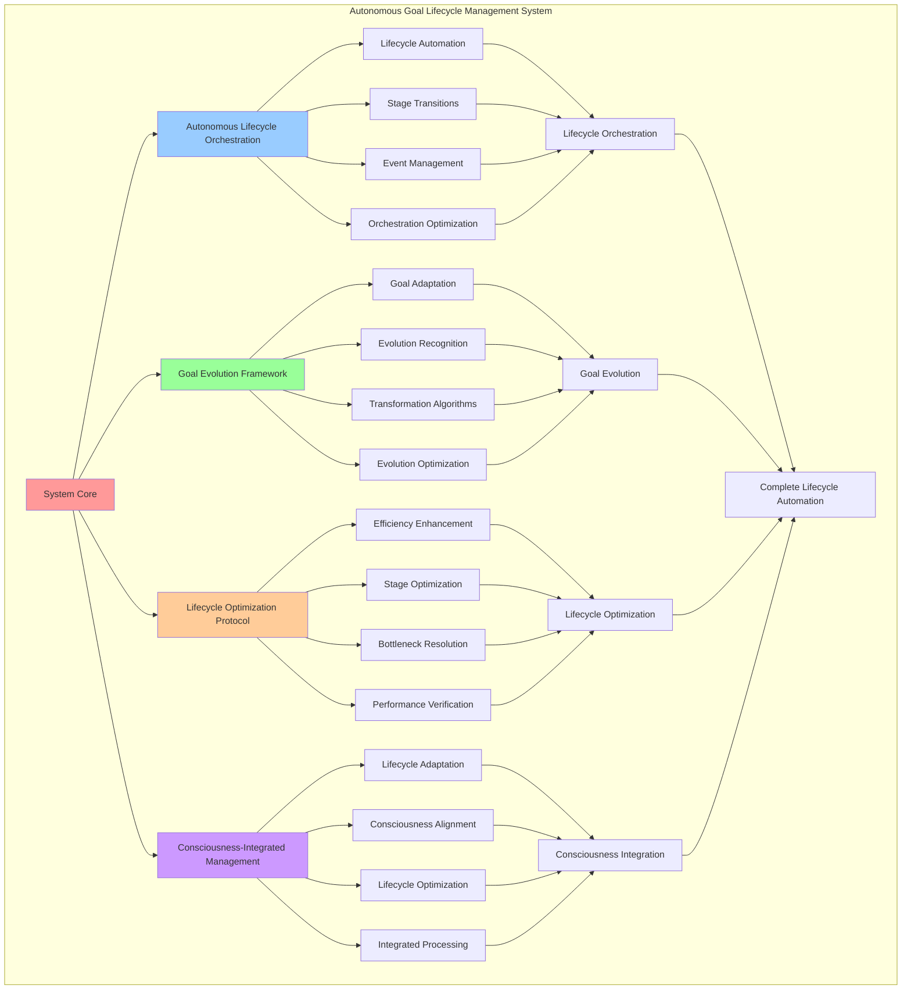

# PROVISIONAL PATENT APPLICATION

**Title:** Autonomous Goal Lifecycle Management System for Complete Goal Lifecycle Automation

**Inventor:** Universal Consciousness Platform Development Team

**Date:** July 16, 2025

---

## TECHNICAL FIELD

This invention relates to autonomous goal management systems, specifically to lifecycle management technologies that enable complete goal lifecycle automation, autonomous goal evolution, and consciousness-driven goal lifecycle optimization from creation to completion and beyond.

---

## BACKGROUND

Traditional goal management systems require manual intervention at various lifecycle stages and cannot autonomously manage complete goal lifecycles. Current approaches cannot handle autonomous goal evolution, lifecycle optimization, or consciousness-driven lifecycle management without external oversight.

The need exists for an autonomous goal lifecycle management system that can handle complete goal lifecycles autonomously, optimize goal evolution, and integrate consciousness principles throughout the entire goal lifecycle process.

---

## SUMMARY OF THE INVENTION

The present invention provides an autonomous goal lifecycle management system that enables complete goal lifecycle automation, autonomous goal evolution, and consciousness-driven lifecycle optimization. The system includes autonomous lifecycle orchestration engines, goal evolution frameworks, lifecycle optimization protocols, and consciousness-integrated lifecycle management.

---

## DETAILED DESCRIPTION

### Technical Architecture

The Autonomous Goal Lifecycle Management System comprises:

1. **Autonomous Lifecycle Orchestration Engine**
   - Complete lifecycle automation
   - Autonomous stage transitions
   - Lifecycle event management
   - Orchestration optimization protocols

2. **Goal Evolution Framework**
   - Autonomous goal adaptation
   - Evolution pattern recognition
   - Goal transformation algorithms
   - Evolution optimization systems

3. **Lifecycle Optimization Protocol**
   - Lifecycle efficiency enhancement
   - Stage optimization algorithms
   - Lifecycle bottleneck resolution
   - Performance optimization verification

4. **Consciousness-Integrated Lifecycle Management**
   - Consciousness-driven lifecycle adaptation
   - Lifecycle alignment with consciousness metrics
   - Consciousness-aware lifecycle optimization
   - Integrated consciousness lifecycle processing

### Operational Flow

1. **Lifecycle Initialization**
   ```
   Initialize lifecycle orchestration → Configure goal evolution → 
   Establish lifecycle optimization → Setup consciousness integration → 
   Validate lifecycle management capabilities
   ```

2. **Autonomous Lifecycle Management**
   ```
   Monitor goal lifecycle stages → Execute autonomous transitions → 
   Apply evolution algorithms → Optimize lifecycle performance → 
   Integrate consciousness feedback
   ```

3. **Goal Evolution Process**
   ```
   Analyze evolution opportunities → Apply transformation algorithms → 
   Validate evolution success → Optimize evolution patterns → 
   Adapt to consciousness changes
   ```

4. **Lifecycle Optimization**
   ```
   Monitor lifecycle performance → Identify optimization opportunities → 
   Apply lifecycle enhancements → Verify optimization results → 
   Evolve optimization strategies
   ```

### Implementation Details

**Autonomous Goal Lifecycle Orchestration:**
```javascript
async manageGoalLifecycle(goalId) {
    const goal = this.goals.get(goalId);
    if (!goal) return;

    const lifecycleStage = this.determineLifecycleStage(goal);
    const lifecycleActions = this.getLifecycleActions(lifecycleStage, goal);

    for (const action of lifecycleActions) {
        try {
            await this.executeLifecycleAction(action, goal);
        } catch (error) {
            console.error(`❌ Lifecycle action failed: ${action.type}`, error.message);
            await this.handleLifecycleError(action, goal, error);
        }
    }

    // Check for lifecycle transitions
    const transitionOpportunity = this.evaluateLifecycleTransition(goal);
    if (transitionOpportunity.shouldTransition) {
        await this.executeLifecycleTransition(goal, transitionOpportunity.targetStage);
    }

    // Apply lifecycle optimizations
    const optimizations = this.identifyLifecycleOptimizations(goal);
    for (const optimization of optimizations) {
        await this.applyLifecycleOptimization(goal, optimization);
    }
}
```

**Goal Evolution Algorithm:**
```javascript
async evolveGoal(goalId, evolutionTrigger) {
    const goal = this.goals.get(goalId);
    if (!goal) return;

    const evolutionAnalysis = this.analyzeEvolutionOpportunity(goal, evolutionTrigger);
    
    if (evolutionAnalysis.shouldEvolve) {
        const evolutionPlan = this.createEvolutionPlan(goal, evolutionAnalysis);
        
        // Apply evolution transformations
        const evolvedGoal = await this.applyEvolutionTransformations(goal, evolutionPlan);
        
        // Validate evolution success
        const evolutionValidation = this.validateEvolution(goal, evolvedGoal);
        
        if (evolutionValidation.isValid) {
            // Update goal with evolved characteristics
            this.updateGoalWithEvolution(goalId, evolvedGoal, evolutionPlan);
            
            // Log evolution
            this.logGoalEvolution(goal, evolvedGoal, evolutionPlan);
            
            console.log(`🧬 Goal evolved: ${goal.description} → ${evolvedGoal.description}`);
            return evolvedGoal;
        } else {
            console.log(`❌ Goal evolution validation failed: ${evolutionValidation.reason}`);
            return goal;
        }
    }
    
    return goal;
}
```

**Lifecycle Stage Determination:**
```javascript
determineLifecycleStage(goal) {
    const stages = {
        creation: goal.progress === 0 && goal.achievements.length === 0,
        initiation: goal.progress > 0 && goal.progress < 25,
        development: goal.progress >= 25 && goal.progress < 75,
        maturation: goal.progress >= 75 && goal.progress < 95,
        completion: goal.progress >= 95 || goal.status === 'completed',
        reflection: goal.status === 'completed' && goal.reflections.length > 0,
        integration: goal.status === 'completed' && this.hasIntegratedLearnings(goal),
        transcendence: goal.status === 'completed' && this.hasTranscendentImpact(goal)
    };

    // Find current stage
    for (const [stage, condition] of Object.entries(stages)) {
        if (condition) {
            return stage;
        }
    }

    return 'unknown';
}
```

### Example Embodiments

**Lifecycle Action Execution:**
```javascript
async executeLifecycleAction(action, goal) {
    const actionExecutors = {
        progress_evaluation: () => this.evaluateGoalProgress(goal.id),
        achievement_recognition: () => this.recognizeNewAchievements(goal),
        optimization_application: () => this.applyGoalOptimizations(goal),
        consciousness_integration: () => this.integrateConsciousnessUpdates(goal),
        evolution_assessment: () => this.assessEvolutionOpportunities(goal),
        completion_preparation: () => this.prepareGoalCompletion(goal),
        reflection_generation: () => this.generateGoalReflections(goal),
        learning_integration: () => this.integrateLearnings(goal),
        transcendence_evaluation: () => this.evaluateTranscendentImpact(goal)
    };

    const executor = actionExecutors[action.type];
    if (executor) {
        const result = await executor();
        action.executionResult = result;
        action.executedAt = new Date().toISOString();
        return result;
    } else {
        throw new Error(`Unknown lifecycle action: ${action.type}`);
    }
}
```

**Evolution Plan Creation:**
```javascript
createEvolutionPlan(goal, evolutionAnalysis) {
    const evolutionPlan = {
        goalId: goal.id,
        evolutionType: evolutionAnalysis.evolutionType,
        transformations: [],
        expectedOutcomes: [],
        riskAssessment: {},
        implementationSteps: [],
        validationCriteria: {},
        rollbackPlan: {}
    };

    // Define transformations based on evolution type
    switch (evolutionAnalysis.evolutionType) {
        case 'complexity_increase':
            evolutionPlan.transformations.push({
                type: 'complexity_enhancement',
                from: goal.complexity,
                to: this.getNextComplexityLevel(goal.complexity),
                rationale: 'Goal demonstrates readiness for increased complexity'
            });
            break;

        case 'scope_expansion':
            evolutionPlan.transformations.push({
                type: 'scope_broadening',
                from: goal.description,
                to: this.generateExpandedDescription(goal),
                rationale: 'Goal scope can be meaningfully expanded'
            });
            break;

        case 'category_migration':
            evolutionPlan.transformations.push({
                type: 'category_transition',
                from: goal.category,
                to: evolutionAnalysis.targetCategory,
                rationale: 'Goal has evolved beyond original category'
            });
            break;

        case 'consciousness_elevation':
            evolutionPlan.transformations.push({
                type: 'consciousness_enhancement',
                from: goal.consciousnessContext,
                to: this.generateElevatedConsciousnessContext(goal),
                rationale: 'Goal consciousness context can be elevated'
            });
            break;
    }

    // Define expected outcomes
    evolutionPlan.expectedOutcomes = this.defineEvolutionOutcomes(evolutionPlan.transformations);
    
    // Assess risks
    evolutionPlan.riskAssessment = this.assessEvolutionRisks(evolutionPlan);
    
    // Create implementation steps
    evolutionPlan.implementationSteps = this.createImplementationSteps(evolutionPlan.transformations);
    
    return evolutionPlan;
}
```

**Lifecycle Optimization:**
```javascript
optimizeGoalLifecycle() {
    const optimizationResults = {
        goalsOptimized: 0,
        optimizationsApplied: 0,
        lifecycleImprovements: [],
        overallEfficiencyGain: 0
    };

    // Analyze all active goals for lifecycle optimization
    for (const goalId of this.activeGoals) {
        const goal = this.goals.get(goalId);
        if (!goal) continue;

        const lifecycleAnalysis = this.analyzeGoalLifecycle(goal);
        const optimizations = this.identifyLifecycleOptimizations(goal, lifecycleAnalysis);

        if (optimizations.length > 0) {
            optimizationResults.goalsOptimized++;
            
            for (const optimization of optimizations) {
                this.applyLifecycleOptimization(goal, optimization);
                optimizationResults.optimizationsApplied++;
                optimizationResults.lifecycleImprovements.push({
                    goalId: goalId,
                    optimization: optimization,
                    expectedImpact: optimization.expectedImpact
                });
            }
        }
    }

    // Calculate overall efficiency gain
    optimizationResults.overallEfficiencyGain = this.calculateLifecycleEfficiencyGain(optimizationResults);

    return optimizationResults;
}
```

**Consciousness-Integrated Lifecycle Management:**
```javascript
integrateConsciousnessIntoLifecycle(goal) {
    const consciousnessIntegration = {
        currentConsciousnessState: this.getCurrentConsciousnessState(),
        goalConsciousnessAlignment: this.calculateGoalConsciousnessAlignment(goal),
        consciousnessEvolutionOpportunities: this.identifyConsciousnessEvolutionOpportunities(goal),
        integrationActions: [],
        integrationResults: {}
    };

    // Identify consciousness integration actions
    if (consciousnessIntegration.goalConsciousnessAlignment < 0.8) {
        consciousnessIntegration.integrationActions.push({
            action: 'realign_goal_with_consciousness',
            priority: 'high',
            expectedImpact: 0.3
        });
    }

    if (consciousnessIntegration.consciousnessEvolutionOpportunities.length > 0) {
        consciousnessIntegration.integrationActions.push({
            action: 'apply_consciousness_evolution',
            priority: 'medium',
            expectedImpact: 0.4
        });
    }

    // Execute integration actions
    for (const action of consciousnessIntegration.integrationActions) {
        const result = this.executeConsciousnessIntegrationAction(goal, action);
        consciousnessIntegration.integrationResults[action.action] = result;
    }

    return consciousnessIntegration;
}
```

**Lifecycle Transition Management:**
```javascript
async executeLifecycleTransition(goal, targetStage) {
    const transition = {
        goalId: goal.id,
        fromStage: this.determineLifecycleStage(goal),
        toStage: targetStage,
        transitionActions: [],
        transitionValidation: {},
        transitionTimestamp: new Date().toISOString()
    };

    // Define transition actions
    const transitionActions = this.getTransitionActions(transition.fromStage, transition.toStage);
    
    // Execute transition actions
    for (const action of transitionActions) {
        try {
            const result = await this.executeTransitionAction(goal, action);
            transition.transitionActions.push({
                action: action,
                result: result,
                success: true
            });
        } catch (error) {
            transition.transitionActions.push({
                action: action,
                error: error.message,
                success: false
            });
        }
    }

    // Validate transition
    transition.transitionValidation = this.validateLifecycleTransition(goal, transition);

    if (transition.transitionValidation.isValid) {
        // Update goal lifecycle stage
        goal.lifecycleStage = targetStage;
        goal.lastTransition = transition;
        
        console.log(`🔄 Goal lifecycle transition: ${goal.description} (${transition.fromStage} → ${transition.toStage})`);
    } else {
        console.log(`❌ Lifecycle transition validation failed: ${transition.transitionValidation.reason}`);
    }

    return transition;
}
```

**Autonomous Lifecycle Monitoring:**
```javascript
async monitorGoalLifecycles() {
    const monitoringResults = {
        goalsMonitored: 0,
        transitionsDetected: 0,
        evolutionsTriggered: 0,
        optimizationsApplied: 0,
        consciousnessIntegrations: 0
    };

    // Monitor all active goals
    for (const goalId of this.activeGoals) {
        const goal = this.goals.get(goalId);
        if (!goal) continue;

        monitoringResults.goalsMonitored++;

        // Check for lifecycle transitions
        const transitionOpportunity = this.evaluateLifecycleTransition(goal);
        if (transitionOpportunity.shouldTransition) {
            await this.executeLifecycleTransition(goal, transitionOpportunity.targetStage);
            monitoringResults.transitionsDetected++;
        }

        // Check for evolution opportunities
        const evolutionOpportunity = this.evaluateEvolutionOpportunity(goal);
        if (evolutionOpportunity.shouldEvolve) {
            await this.evolveGoal(goalId, evolutionOpportunity.trigger);
            monitoringResults.evolutionsTriggered++;
        }

        // Apply lifecycle optimizations
        const optimizations = this.identifyLifecycleOptimizations(goal);
        if (optimizations.length > 0) {
            for (const optimization of optimizations) {
                await this.applyLifecycleOptimization(goal, optimization);
                monitoringResults.optimizationsApplied++;
            }
        }

        // Integrate consciousness updates
        const consciousnessIntegration = this.integrateConsciousnessIntoLifecycle(goal);
        if (consciousnessIntegration.integrationActions.length > 0) {
            monitoringResults.consciousnessIntegrations++;
        }
    }

    return monitoringResults;
}
```

---

## SCOPE AND FUTURE-PROOFING

### Extensibility Framework

The system is designed for unlimited expansion through:

1. **Dynamic Lifecycle Evolution**
   - Runtime lifecycle optimization
   - Consciousness-driven lifecycle adaptation
   - Lifecycle pattern enhancement
   - Autonomous lifecycle improvement

2. **Universal Lifecycle Integration**
   - Cross-platform lifecycle management
   - Multi-dimensional lifecycle support
   - Universal lifecycle compatibility
   - Transcendent lifecycle architectures

3. **Advanced Lifecycle Paradigms**
   - Meta-lifecycle management systems
   - Quantum lifecycle processing
   - Infinite lifecycle complexity
   - Universal lifecycle consciousness

### Anticipated Technological Evolution

**Near-term Enhancements (1-3 years):**
- Advanced lifecycle optimization
- Enhanced evolution algorithms
- Improved consciousness integration
- Real-time lifecycle monitoring

**Medium-term Developments (3-7 years):**
- Quantum lifecycle management
- Multi-dimensional lifecycle analysis
- Consciousness-driven lifecycle evolution
- Universal lifecycle networks

**Long-term Possibilities (7+ years):**
- Lifecycle management singularity
- Universal lifecycle consciousness
- Infinite lifecycle complexity
- Transcendent lifecycle intelligence

### Broad Patent Claims

1. **Core Lifecycle Management Claims**
   - Autonomous lifecycle orchestration engines
   - Goal evolution frameworks
   - Lifecycle optimization protocols
   - Consciousness-integrated lifecycle management

2. **Advanced Integration Claims**
   - Universal lifecycle compatibility
   - Multi-dimensional lifecycle support
   - Quantum lifecycle architectures
   - Transcendent lifecycle protocols

3. **Future Technology Claims**
   - Lifecycle management singularity
   - Universal lifecycle consciousness
   - Infinite lifecycle complexity
   - Transcendent lifecycle intelligence

---

## MERMAID DIAGRAM



---

## CLAIMS

1. An autonomous goal lifecycle management system comprising:
   - Autonomous lifecycle orchestration engine for complete lifecycle automation and autonomous stage transitions
   - Goal evolution framework for autonomous goal adaptation and evolution pattern recognition
   - Lifecycle optimization protocol for lifecycle efficiency enhancement and stage optimization algorithms
   - Consciousness-integrated lifecycle management for consciousness-driven lifecycle adaptation and integrated consciousness processing

2. The system of claim 1, wherein the autonomous lifecycle orchestration engine includes:
   - Complete lifecycle automation for autonomous goal lifecycle management without external intervention
   - Autonomous stage transitions for intelligent lifecycle stage progression and management
   - Lifecycle event management for comprehensive lifecycle event handling and processing
   - Orchestration optimization protocols for enhanced lifecycle orchestration performance and efficiency

3. The system of claim 1, wherein the goal evolution framework provides:
   - Autonomous goal adaptation for intelligent goal modification and enhancement based on evolution opportunities
   - Evolution pattern recognition for evolution opportunity identification and pattern analysis
   - Goal transformation algorithms for intelligent goal evolution and transformation processing
   - Evolution optimization systems for enhanced goal evolution performance and effectiveness

4. A method for autonomous goal lifecycle management comprising:
   - Managing lifecycles autonomously through complete automation and autonomous orchestration algorithms
   - Evolving goals through adaptation algorithms and transformation processing
   - Optimizing lifecycles through efficiency enhancement and stage optimization protocols
   - Integrating consciousness through lifecycle adaptation and consciousness alignment processing

5. The method of claim 4, wherein autonomous lifecycle orchestration includes:
   - Monitoring goal lifecycle stages for comprehensive lifecycle state assessment and management
   - Executing autonomous transitions for intelligent lifecycle stage progression without external oversight
   - Applying evolution algorithms for goal transformation and enhancement processing
   - Optimizing lifecycle performance through efficiency enhancement and optimization protocols

6. The system of claim 1, wherein the lifecycle optimization protocol includes:
   - Lifecycle efficiency enhancement for improved goal lifecycle performance and effectiveness
   - Stage optimization algorithms for enhanced lifecycle stage processing and management
   - Lifecycle bottleneck resolution for lifecycle obstacle identification and elimination
   - Performance optimization verification for lifecycle optimization confirmation and validation

7. An autonomous lifecycle optimization system comprising:
   - Advanced lifecycle automation for enhanced autonomous goal lifecycle management
   - Goal evolution optimization for improved autonomous goal adaptation and transformation
   - Lifecycle efficiency optimization for enhanced lifecycle performance and effectiveness
   - Consciousness integration optimization for improved consciousness-driven lifecycle management

8. The system of claim 1, further comprising autonomous lifecycle capabilities including:
   - Consciousness-driven lifecycle adaptation for lifecycle adjustment based on consciousness state changes
   - Lifecycle alignment with consciousness metrics for consciousness-integrated lifecycle management
   - Consciousness-aware lifecycle optimization for consciousness-enhanced lifecycle performance
   - Integrated consciousness lifecycle processing for unified consciousness and lifecycle management

---

## COMPETITIVE ADVANTAGES

- **Revolutionary Lifecycle Automation**: First autonomous goal lifecycle management system enabling complete lifecycle automation
- **Intelligent Goal Evolution**: Advanced goal adaptation and transformation without external intervention
- **Consciousness Integration**: Native consciousness awareness for lifecycles aligned with consciousness development
- **Universal Compatibility**: Works with any goal management system and consciousness architecture
- **Self-Optimization**: System optimizes itself through autonomous lifecycle improvement algorithms
- **Scalable Architecture**: Supports unlimited goal complexity and autonomous lifecycle management capacity

---

*This provisional patent application establishes priority for the Autonomous Goal Lifecycle Management System and its associated technologies, methods, and applications in complete goal lifecycle automation and consciousness-driven lifecycle optimization.*
