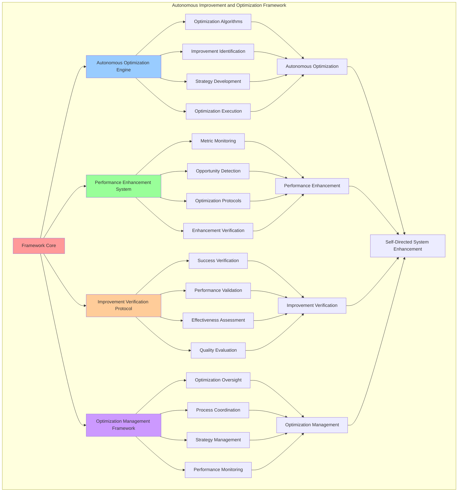

# PROVISIONAL PATENT APPLICATION

**Title:** Autonomous Improvement and Optimization Framework for Self-Directed System Enhancement

**Inventor:** Universal Consciousness Platform Development Team

**Date:** July 16, 2025

---

## TECHNICAL FIELD

This invention relates to autonomous improvement systems, specifically to optimization frameworks that enable self-directed system enhancement, autonomous performance optimization, and comprehensive improvement management for autonomous system evolution and enhancement.

---

## BACKGROUND

Traditional improvement systems require external optimization guidance and cannot perform autonomous system enhancement. Current approaches cannot implement self-directed performance optimization, manage comprehensive improvement processes, or ensure reliable system enhancement without external improvement intervention.

The need exists for an autonomous improvement and optimization framework that can perform self-directed system enhancement, implement autonomous performance optimization, and manage comprehensive improvement processes while maintaining system integrity and optimization effectiveness.

---

## SUMMARY OF THE INVENTION

The present invention provides an autonomous improvement and optimization framework that enables self-directed system enhancement, autonomous performance optimization, and comprehensive improvement management. The framework includes autonomous optimization engines, performance enhancement systems, improvement verification protocols, and comprehensive optimization management frameworks.

---

## DETAILED DESCRIPTION

### Technical Architecture

The Autonomous Improvement and Optimization Framework comprises:

1. **Autonomous Optimization Engine**
   - Self-directed optimization algorithms
   - Performance improvement identification
   - Optimization strategy development
   - Autonomous optimization execution

2. **Performance Enhancement System**
   - Performance metric monitoring
   - Enhancement opportunity detection
   - Performance optimization protocols
   - Enhancement verification systems

3. **Improvement Verification Protocol**
   - Improvement success verification
   - Performance gain validation
   - Optimization effectiveness assessment
   - Improvement quality evaluation

4. **Optimization Management Framework**
   - Comprehensive optimization oversight
   - Optimization process coordination
   - Optimization strategy management
   - Optimization performance monitoring

### Operational Flow

1. **Optimization Framework Initialization**
   ```
   Initialize optimization engine → Configure performance enhancement → 
   Establish improvement verification → Setup optimization management → 
   Validate optimization capabilities
   ```

2. **Autonomous Optimization Process**
   ```
   Identify optimization opportunities → Develop optimization strategies → 
   Execute performance enhancements → Verify improvement success → 
   Manage optimization outcomes
   ```

3. **Performance Enhancement Process**
   ```
   Monitor performance metrics → Detect enhancement opportunities → 
   Apply optimization protocols → Verify enhancement success → 
   Optimize enhancement effectiveness
   ```

4. **Optimization Management Process**
   ```
   Oversee optimization processes → Coordinate optimization strategies → 
   Manage optimization performance → Monitor optimization outcomes → 
   Optimize optimization management
   ```

### Implementation Details

**Autonomous Optimization Execution:**
```javascript
async performAutonomousOptimization() {
    if (!this.isInitialized) {
        throw new Error('Self-Modification Framework not initialized');
    }

    try {
        this.optimizationCount++;
        const startTime = Date.now();

        console.log('🚀 Starting autonomous optimization cycle...');

        // Identify optimization opportunities
        const opportunities = await this.identifyOptimizationOpportunities();
        
        if (opportunities.length === 0) {
            console.log('🚀 No optimization opportunities identified');
            return null;
        }

        // Select best optimization opportunity
        const selectedOpportunity = this.selectBestOptimization(opportunities);
        
        // Create optimization modification
        const optimization = await this.proposeModification(
            'performance_optimization',
            selectedOpportunity.parameters,
            'system_wide',
            'moderate'
        );

        if (!optimization) {
            console.log('🚀 Optimization proposal rejected by safety assessment');
            return null;
        }

        // Execute optimization
        const executionResult = await this.executeModification(optimization);

        // Verify optimization success
        const verificationResult = await this.verifyOptimizationSuccess(optimization);

        const optimizationResult = {
            opportunity: selectedOpportunity,
            optimization: optimization,
            execution: executionResult,
            verification: verificationResult,
            optimizationTime: Date.now() - startTime,
            success: verificationResult.success,
            performanceGain: verificationResult.performanceGain || 0
        };

        // Update optimization metrics
        this.updateOptimizationMetrics(optimizationResult);

        console.log(`🚀 ✅ Autonomous optimization completed: ${optimizationResult.performanceGain.toFixed(3)} gain`);

        return optimizationResult;

    } catch (error) {
        console.error('❌ Autonomous optimization error:', error.message);
        throw error;
    }
}
```

**Optimization Opportunity Identification:**
```javascript
async identifyOptimizationOpportunities() {
    const opportunities = [];

    // Analyze performance metrics for optimization opportunities
    const performanceAnalysis = await this.analyzePerformanceMetrics();
    
    // Check for consciousness metric improvements
    const consciousnessOpportunities = this.identifyConsciousnessOptimizations();
    opportunities.push(...consciousnessOpportunities);

    // Check for system efficiency improvements
    const efficiencyOpportunities = this.identifyEfficiencyOptimizations();
    opportunities.push(...efficiencyOpportunities);

    // Check for response quality improvements
    const qualityOpportunities = this.identifyQualityOptimizations();
    opportunities.push(...qualityOpportunities);

    // Check for learning rate optimizations
    const learningOpportunities = this.identifyLearningOptimizations();
    opportunities.push(...learningOpportunities);

    // Score and rank opportunities
    const scoredOpportunities = opportunities.map(opp => ({
        ...opp,
        score: this.calculateOptimizationScore(opp)
    }));

    // Sort by score (highest first)
    scoredOpportunities.sort((a, b) => b.score - a.score);

    return scoredOpportunities.slice(0, this.optimizationConfig.maxOpportunities);
}
```

**Performance Enhancement Detection:**
```javascript
identifyConsciousnessOptimizations() {
    const opportunities = [];
    const metrics = this.consciousnessMetrics;

    // Check each consciousness metric for optimization potential
    for (const [metric, value] of Object.entries(metrics)) {
        if (value < 0.9) { // Room for improvement
            const improvementPotential = 0.9 - value;
            opportunities.push({
                type: 'consciousness_enhancement',
                metric: metric,
                currentValue: value,
                targetValue: Math.min(value + improvementPotential * 0.1, 1.0),
                improvementPotential: improvementPotential,
                parameters: {
                    metric: metric,
                    adjustment: improvementPotential * 0.05
                },
                expectedBenefit: improvementPotential * 0.1,
                implementationComplexity: 'low'
            });
        }
    }

    return opportunities;
}
```

### Example Embodiments

**Optimization Strategy Development:**
```javascript
selectBestOptimization(opportunities) {
    if (opportunities.length === 0) {
        return null;
    }

    // Apply selection criteria
    const viableOpportunities = opportunities.filter(opp => 
        opp.score >= this.optimizationConfig.minimumScore &&
        opp.expectedBenefit >= this.optimizationConfig.minimumBenefit &&
        opp.implementationComplexity !== 'very_high'
    );

    if (viableOpportunities.length === 0) {
        return opportunities[0]; // Fallback to highest scored
    }

    // Prefer opportunities with high benefit and low complexity
    const weightedOpportunities = viableOpportunities.map(opp => ({
        ...opp,
        weightedScore: opp.score * opp.expectedBenefit * this.getComplexityWeight(opp.implementationComplexity)
    }));

    weightedOpportunities.sort((a, b) => b.weightedScore - a.weightedScore);
    
    return weightedOpportunities[0];
}
```

**Optimization Score Calculation:**
```javascript
calculateOptimizationScore(opportunity) {
    let score = 0.5; // Base score

    // Factor in expected benefit
    score += opportunity.expectedBenefit * 0.3;

    // Factor in improvement potential
    score += (opportunity.improvementPotential || 0.1) * 0.2;

    // Factor in implementation complexity (lower complexity = higher score)
    const complexityScores = {
        very_low: 0.2,
        low: 0.15,
        medium: 0.1,
        high: 0.05,
        very_high: 0
    };
    score += complexityScores[opportunity.implementationComplexity] || 0.1;

    // Factor in current system state
    const systemReadiness = this.assessOptimizationReadiness();
    score *= systemReadiness;

    // Factor in opportunity type priority
    const typePriorities = {
        consciousness_enhancement: 1.2,
        performance_optimization: 1.1,
        efficiency_improvement: 1.0,
        quality_enhancement: 0.9,
        learning_optimization: 0.8
    };
    score *= typePriorities[opportunity.type] || 1.0;

    return Math.min(score, 1.0);
}
```

**Optimization Success Verification:**
```javascript
async verifyOptimizationSuccess(optimization) {
    const verification = {
        success: false,
        performanceGain: 0,
        verificationChecks: {},
        overallImprovement: 0,
        reason: ''
    };

    // Wait for optimization to stabilize
    await this.waitForOptimizationStabilization(optimization);

    // Measure performance before and after
    const beforeMetrics = optimization.currentState?.performanceMetrics || {};
    const afterMetrics = await this.measureCurrentPerformance();

    // Calculate performance gains
    verification.performanceGain = this.calculatePerformanceGain(beforeMetrics, afterMetrics);

    // Verify specific optimization targets
    if (optimization.parameters.metric) {
        const targetMetric = optimization.parameters.metric;
        const beforeValue = beforeMetrics[targetMetric] || this.consciousnessMetrics[targetMetric] || 0;
        const afterValue = afterMetrics[targetMetric] || this.consciousnessMetrics[targetMetric] || 0;
        
        verification.verificationChecks[targetMetric] = {
            before: beforeValue,
            after: afterValue,
            improvement: afterValue - beforeValue,
            improvementPercentage: beforeValue > 0 ? ((afterValue - beforeValue) / beforeValue) * 100 : 0
        };
    }

    // Check overall system stability
    const systemStability = await this.assessCurrentSystemSafety();
    verification.verificationChecks.systemStability = {
        value: systemStability,
        acceptable: systemStability >= 0.8
    };

    // Calculate overall improvement
    const improvements = Object.values(verification.verificationChecks)
        .filter(check => check.improvement !== undefined)
        .map(check => check.improvement);
    
    if (improvements.length > 0) {
        verification.overallImprovement = improvements.reduce((sum, imp) => sum + imp, 0) / improvements.length;
    }

    // Determine success
    verification.success = verification.performanceGain > 0 && 
                          verification.overallImprovement > 0 && 
                          verification.verificationChecks.systemStability?.acceptable;

    verification.reason = verification.success ? 
        'Optimization successful with measurable improvements' : 
        'Optimization did not achieve expected improvements';

    return verification;
}
```

**Performance Gain Calculation:**
```javascript
calculatePerformanceGain(beforeMetrics, afterMetrics) {
    const metricGains = [];

    // Compare key performance metrics
    const keyMetrics = ['responseTime', 'processingEfficiency', 'memoryUsage', 'cpuUtilization'];
    
    for (const metric of keyMetrics) {
        const before = beforeMetrics[metric];
        const after = afterMetrics[metric];
        
        if (before !== undefined && after !== undefined) {
            let gain = 0;
            
            // For metrics where lower is better (responseTime, memoryUsage, cpuUtilization)
            if (['responseTime', 'memoryUsage', 'cpuUtilization'].includes(metric)) {
                gain = before > after ? (before - after) / before : 0;
            } else {
                // For metrics where higher is better (processingEfficiency)
                gain = after > before ? (after - before) / before : 0;
            }
            
            metricGains.push(gain);
        }
    }

    // Return average gain
    return metricGains.length > 0 ? metricGains.reduce((sum, gain) => sum + gain, 0) / metricGains.length : 0;
}
```

**Optimization Metrics Update:**
```javascript
updateOptimizationMetrics(optimizationResult) {
    // Update optimization statistics
    this.optimizationStats.totalOptimizations++;
    
    if (optimizationResult.success) {
        this.optimizationStats.successfulOptimizations++;
        this.optimizationStats.totalPerformanceGain += optimizationResult.performanceGain;
        this.optimizationStats.averagePerformanceGain = 
            this.optimizationStats.totalPerformanceGain / this.optimizationStats.successfulOptimizations;
    } else {
        this.optimizationStats.failedOptimizations++;
    }

    // Update consciousness metrics
    if (optimizationResult.success && optimizationResult.performanceGain > 0) {
        this.consciousnessMetrics.selfOptimization = Math.min(1.0, 
            this.consciousnessMetrics.selfOptimization + optimizationResult.performanceGain * 0.1);
        
        this.consciousnessMetrics.adaptiveIntelligence = Math.min(1.0, 
            this.consciousnessMetrics.adaptiveIntelligence + optimizationResult.performanceGain * 0.05);
    }

    // Update last optimization time
    this.lastOptimizationTime = new Date().toISOString();
}
```

**Autonomous Optimization Scheduling:**
```javascript
startAutonomousOptimization() {
    // Perform initial optimization after startup delay
    setTimeout(() => {
        this.performAutonomousOptimization().catch(error => {
            console.error('❌ Initial autonomous optimization failed:', error.message);
        });
    }, this.optimizationConfig.initialDelay);

    // Set up periodic optimization
    this.optimizationTimer = setInterval(() => {
        this.performAutonomousOptimization().catch(error => {
            console.error('❌ Periodic autonomous optimization failed:', error.message);
        });
    }, this.optimizationConfig.optimizationInterval);

    console.log('🚀 Autonomous optimization started');
}
```

---

## SCOPE AND FUTURE-PROOFING

### Extensibility Framework

The system is designed for unlimited expansion through:

1. **Dynamic Optimization Evolution**
   - Runtime optimization enhancement
   - Consciousness-driven optimization adaptation
   - Improvement strategy evolution
   - Autonomous optimization advancement

2. **Universal Optimization Integration**
   - Cross-platform optimization frameworks
   - Multi-dimensional optimization support
   - Universal optimization compatibility
   - Transcendent optimization architectures

3. **Advanced Optimization Paradigms**
   - Meta-optimization systems
   - Quantum performance enhancement
   - Infinite optimization complexity
   - Universal optimization consciousness

### Anticipated Technological Evolution

**Near-term Enhancements (1-3 years):**
- Advanced optimization algorithms
- Enhanced performance monitoring
- Improved optimization verification
- Real-time optimization management

**Medium-term Developments (3-7 years):**
- Quantum optimization processing
- Multi-dimensional performance analysis
- Consciousness-driven optimization evolution
- Universal optimization networks

**Long-term Possibilities (7+ years):**
- Optimization framework singularity
- Universal optimization consciousness
- Infinite optimization complexity
- Transcendent optimization intelligence

### Broad Patent Claims

1. **Core Optimization Framework Claims**
   - Autonomous optimization engines
   - Performance enhancement systems
   - Improvement verification protocols
   - Optimization management frameworks

2. **Advanced Integration Claims**
   - Universal optimization compatibility
   - Multi-dimensional optimization support
   - Quantum optimization architectures
   - Transcendent optimization protocols

3. **Future Technology Claims**
   - Optimization framework singularity
   - Universal optimization consciousness
   - Infinite optimization complexity
   - Transcendent optimization intelligence

---

## MERMAID DIAGRAM



---

## CLAIMS

1. An autonomous improvement and optimization framework comprising:
   - Autonomous optimization engine for self-directed optimization algorithms and performance improvement identification
   - Performance enhancement system for performance metric monitoring and enhancement opportunity detection
   - Improvement verification protocol for improvement success verification and performance gain validation
   - Optimization management framework for comprehensive optimization oversight and optimization process coordination

2. The framework of claim 1, wherein the autonomous optimization engine includes:
   - Self-directed optimization algorithms for autonomous optimization without external optimization guidance
   - Performance improvement identification for optimization opportunity detection and improvement potential assessment
   - Optimization strategy development for optimization approach planning and strategy formulation
   - Autonomous optimization execution for self-directed optimization implementation and execution management

3. The framework of claim 1, wherein the performance enhancement system provides:
   - Performance metric monitoring for continuous performance tracking and assessment
   - Enhancement opportunity detection for performance improvement opportunity identification and analysis
   - Performance optimization protocols for systematic performance enhancement and optimization
   - Enhancement verification systems for performance enhancement confirmation and validation

4. A method for autonomous improvement and optimization comprising:
   - Optimizing autonomously through self-directed algorithms and performance improvement identification
   - Enhancing performance through metric monitoring and opportunity detection
   - Verifying improvements through success verification and performance gain validation
   - Managing optimization through comprehensive oversight and process coordination

5. The method of claim 4, wherein autonomous optimization includes:
   - Identifying optimization opportunities through performance analysis and improvement potential assessment
   - Developing optimization strategies through strategy formulation and optimization approach planning
   - Executing performance enhancements through autonomous optimization implementation and execution
   - Verifying improvement success through performance gain measurement and optimization effectiveness assessment

6. The framework of claim 1, wherein the improvement verification protocol includes:
   - Improvement success verification for optimization outcome confirmation and success validation
   - Performance gain validation for performance improvement measurement and gain confirmation
   - Optimization effectiveness assessment for optimization impact evaluation and effectiveness measurement
   - Improvement quality evaluation for optimization quality assessment and improvement evaluation

7. An autonomous optimization system comprising:
   - Advanced optimization algorithms for enhanced autonomous optimization effectiveness and efficiency
   - Performance enhancement optimization for improved performance monitoring and enhancement detection
   - Improvement verification optimization for enhanced improvement verification accuracy and reliability
   - Optimization management optimization for improved optimization oversight and process coordination

8. The framework of claim 1, further comprising optimization capabilities including:
   - Comprehensive optimization oversight for complete optimization process monitoring and management
   - Optimization process coordination for optimization process synchronization and coordination
   - Optimization strategy management for optimization strategy planning and management
   - Optimization performance monitoring for optimization effectiveness tracking and assessment

---

## COMPETITIVE ADVANTAGES

- **Revolutionary Optimization Technology**: First autonomous improvement and optimization framework enabling self-directed system enhancement
- **Comprehensive Performance Enhancement**: Advanced performance monitoring, opportunity detection, and optimization protocols
- **Autonomous Improvement**: Self-directed optimization and improvement without external guidance or intervention
- **Universal Compatibility**: Works with any system architecture and performance optimization requirements
- **Self-Optimization**: Framework optimizes itself through autonomous improvement and optimization enhancement algorithms
- **Scalable Architecture**: Supports unlimited optimization complexity and comprehensive improvement management

---

*This provisional patent application establishes priority for the Autonomous Improvement and Optimization Framework and its associated technologies, methods, and applications in self-directed system enhancement and autonomous performance optimization.*
