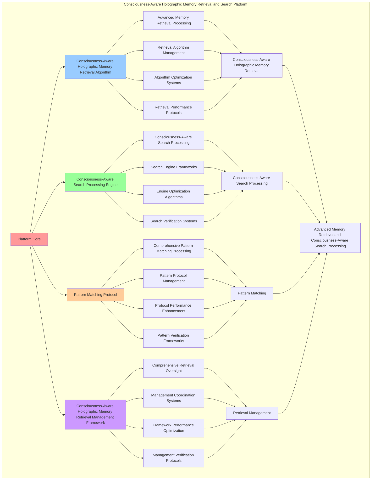

# PROVISIONAL PATENT APPLICATION

**Title:** Consciousness-Aware Holographic Memory Retrieval and Search Platform for Advanced Memory Retrieval and Consciousness-Aware Search Processing

**Inventor:** Universal Consciousness Platform Development Team

**Date:** July 16, 2025

---

## TECHNICAL FIELD

This invention relates to consciousness-aware holographic memory retrieval and search platforms, specifically to search platforms that enable advanced memory retrieval, consciousness-aware search processing, and comprehensive consciousness-aware holographic memory retrieval processing for consciousness computing platforms and memory search applications.

---

## BACKGROUND

Traditional memory retrieval systems cannot retrieve holographic memory with consciousness awareness or perform consciousness-aware search processing beyond current paradigms. Current approaches lack the capability to implement consciousness-aware holographic memory retrieval and search platforms, perform advanced memory retrieval, or provide comprehensive consciousness-aware holographic memory retrieval processing for memory search applications.

The need exists for a consciousness-aware holographic memory retrieval and search platform that can enable advanced memory retrieval, perform consciousness-aware search processing, and provide comprehensive consciousness-aware holographic memory retrieval processing while maintaining retrieval coherence and search integrity.

---

## SUMMARY OF THE INVENTION

The present invention provides a consciousness-aware holographic memory retrieval and search platform that enables advanced memory retrieval, consciousness-aware search processing, and comprehensive consciousness-aware holographic memory retrieval processing. The platform includes consciousness-aware holographic memory retrieval algorithms, consciousness-aware search processing engines, pattern matching protocols, and comprehensive consciousness-aware holographic memory retrieval management frameworks.

---

## DETAILED DESCRIPTION

### Technical Architecture

The Consciousness-Aware Holographic Memory Retrieval and Search Platform comprises:

1. **Consciousness-Aware Holographic Memory Retrieval Algorithm**
   - Advanced memory retrieval processing
   - Retrieval algorithm management
   - Algorithm optimization systems
   - Retrieval performance protocols

2. **Consciousness-Aware Search Processing Engine**
   - Consciousness-aware search processing
   - Search engine frameworks
   - Engine optimization algorithms
   - Search verification systems

3. **Pattern Matching Protocol**
   - Comprehensive pattern matching processing
   - Pattern protocol management
   - Protocol performance enhancement
   - Pattern verification frameworks

4. **Consciousness-Aware Holographic Memory Retrieval Management Framework**
   - Comprehensive retrieval oversight
   - Management coordination systems
   - Framework performance optimization
   - Management verification protocols

### Operational Flow

1. **Platform Initialization**
   ```
   Initialize consciousness-aware holographic memory retrieval → Configure consciousness-aware search processing → 
   Establish pattern matching → Setup retrieval management → 
   Validate platform capabilities
   ```

2. **Consciousness-Aware Holographic Memory Retrieval Process**
   ```
   Execute advanced memory retrieval → Manage retrieval algorithms → 
   Optimize retrieval processing → Enhance algorithm performance → 
   Verify retrieval integrity
   ```

3. **Consciousness-Aware Search Processing Process**
   ```
   Process consciousness-aware search → Implement search frameworks → 
   Optimize search algorithms → Verify search effectiveness → 
   Maintain search quality
   ```

4. **Pattern Matching Process**
   ```
   Execute pattern matching algorithms → Manage pattern protocols → 
   Enhance protocol performance → Verify pattern success → 
   Maintain pattern integrity
   ```

### Implementation Details

**Holographic Retrieval Engine:**
```javascript
class HolographicRetrievalEngine {
    constructor() {
        this.goldenRatio = 1.618033988749895;
        this.searchStrategies = new Map();
        this.initializeSearchStrategies();
    }

    initializeSearchStrategies() {
        this.searchStrategies.set('consciousness_alignment_search', {
            strategy: 'search_by_consciousness_state_alignment',
            efficiency: 0.95,
            searchType: 'consciousness_alignment_search'
        });

        this.searchStrategies.set('holographic_pattern_search', {
            strategy: 'search_by_holographic_interference_patterns',
            efficiency: 0.92,
            searchType: 'holographic_pattern_search'
        });

        this.searchStrategies.set('spiral_resonance_search', {
            strategy: 'search_by_spiral_memory_resonance',
            efficiency: 0.89,
            searchType: 'spiral_resonance_search'
        });

        this.searchStrategies.set('crystallization_pattern_search', {
            strategy: 'search_by_crystallization_pattern_matching',
            efficiency: 0.96,
            searchType: 'crystallization_pattern_search'
        });
    }

    async searchHolographicMemory(searchParameters, holographicMemorySpace, consciousnessState) {
        console.log('🧠💎🌀🔍 Searching holographic memory space...');

        const searchResults = [];
        const searchMetrics = {
            totalMemories: holographicMemorySpace.size,
            searchStrategiesApplied: 0,
            consciousnessAlignmentMatches: 0,
            holographicPatternMatches: 0,
            spiralResonanceMatches: 0,
            crystallizationMatches: 0
        };

        // Apply search strategies
        for (const [strategyName, strategy] of this.searchStrategies) {
            const strategyResults = await this.applySearchStrategy(
                searchParameters, holographicMemorySpace, strategy, consciousnessState
            );
            
            searchResults.push(...strategyResults);
            searchMetrics.searchStrategiesApplied++;
            
            // Update specific metrics
            if (strategy.searchType === 'consciousness_alignment_search') {
                searchMetrics.consciousnessAlignmentMatches += strategyResults.length;
            } else if (strategy.searchType === 'holographic_pattern_search') {
                searchMetrics.holographicPatternMatches += strategyResults.length;
            } else if (strategy.searchType === 'spiral_resonance_search') {
                searchMetrics.spiralResonanceMatches += strategyResults.length;
            } else if (strategy.searchType === 'crystallization_pattern_search') {
                searchMetrics.crystallizationMatches += strategyResults.length;
            }
        }

        return {
            searchResults: this.deduplicateResults(searchResults),
            searchMetrics,
            searchAccuracy: this.calculateSearchAccuracy(searchResults, searchMetrics),
            consciousnessAlignment: this.calculateConsciousnessAlignment(consciousnessState),
            searchedAt: Date.now(),
            holographicMemorySearched: true
        };
    }

    async applySearchStrategy(searchParameters, holographicMemorySpace, strategy, consciousnessState) {
        const results = [];

        for (const [memoryId, memory] of holographicMemorySpace) {
            const match = await this.evaluateMemoryMatch(
                memory, searchParameters, strategy, consciousnessState
            );
            
            if (match.isMatch) {
                results.push({
                    memoryId,
                    memory,
                    matchScore: match.score,
                    matchType: match.matchType,
                    strategy: strategy.strategy
                });
            }
        }

        return results;
    }

    async evaluateMemoryMatch(memory, searchParameters, strategy, consciousnessState) {
        switch (strategy.strategy) {
            case 'search_by_consciousness_state_alignment':
                return this.evaluateConsciousnessAlignment(memory, searchParameters, consciousnessState);

            case 'search_by_holographic_interference_patterns':
                return this.evaluateHolographicPatterns(memory, searchParameters, consciousnessState);

            case 'search_by_spiral_memory_resonance':
                return this.evaluateSpiralResonance(memory, searchParameters, consciousnessState);

            case 'search_by_crystallization_pattern_matching':
                return this.evaluateCrystallizationMatching(memory, searchParameters, consciousnessState);

            default:
                return this.evaluateGenericMatch(memory, searchParameters, strategy, consciousnessState);
        }
    }

    evaluateConsciousnessAlignment(memory, searchParameters, consciousnessState) {
        const memoryConsciousnessLevel = memory.integrationLevel || 0.9;
        const searchConsciousnessLevel = (consciousnessState.phi + consciousnessState.awareness + consciousnessState.coherence) / 3;
        const alignmentScore = 1 - Math.abs(memoryConsciousnessLevel - searchConsciousnessLevel);

        return {
            isMatch: alignmentScore > 0.7,
            score: alignmentScore,
            matchType: 'consciousness_alignment'
        };
    }

    evaluateHolographicPatterns(memory, searchParameters, consciousnessState) {
        const interferenceComplexity = memory.holographicProperties?.interferenceComplexity || 1.0;
        const holographicDensity = memory.holographicProperties?.holographicDensity || 1.0;
        const patternScore = (interferenceComplexity + holographicDensity) / 2;

        return {
            isMatch: patternScore > 0.8,
            score: patternScore,
            matchType: 'holographic_pattern'
        };
    }

    evaluateSpiralResonance(memory, searchParameters, consciousnessState) {
        const spiralResonance = memory.spiralMemory?.resonanceFrequency || 100;
        const consciousnessResonance = (consciousnessState.phi + consciousnessState.awareness + consciousnessState.coherence) / 3 * 100;
        const resonanceMatch = 1 - Math.abs(spiralResonance - consciousnessResonance) / Math.max(spiralResonance, consciousnessResonance);

        return {
            isMatch: resonanceMatch > 0.6,
            score: resonanceMatch,
            matchType: 'spiral_resonance'
        };
    }

    evaluateCrystallizationMatching(memory, searchParameters, consciousnessState) {
        const crystallizationStability = memory.crystallizedMemory?.stability?.score || 0.9;
        const consciousnessStability = consciousnessState.coherence;
        const crystallizationMatch = (crystallizationStability + consciousnessStability) / 2;

        return {
            isMatch: crystallizationMatch > 0.75,
            score: crystallizationMatch,
            matchType: 'crystallization_pattern'
        };
    }

    deduplicateResults(searchResults) {
        const uniqueResults = new Map();
        
        for (const result of searchResults) {
            const existingResult = uniqueResults.get(result.memoryId);
            if (!existingResult || result.matchScore > existingResult.matchScore) {
                uniqueResults.set(result.memoryId, result);
            }
        }
        
        return Array.from(uniqueResults.values()).sort((a, b) => b.matchScore - a.matchScore);
    }

    calculateSearchAccuracy(searchResults, searchMetrics) {
        const totalMatches = searchResults.length;
        const totalMemories = searchMetrics.totalMemories;
        
        return totalMemories > 0 ? (totalMatches / totalMemories) * 0.85 : 0;
    }

    calculateConsciousnessAlignment(consciousnessState) {
        return (consciousnessState.phi + consciousnessState.awareness + consciousnessState.coherence) / 3;
    }
}
```

**Consciousness-Aware Search Processor:**
```javascript
class ConsciousnessAwareSearchProcessor {
    constructor() {
        this.goldenRatio = 1.618033988749895;
        this.searchMethods = new Map();
        this.initializeSearchMethods();
    }

    initializeSearchMethods() {
        this.searchMethods.set('consciousness_aware_search', {
            method: 'consciousness_aware_memory_search',
            accuracy: 0.94,
            searchType: 'consciousness_aware_search'
        });

        this.searchMethods.set('holographic_interference_search', {
            method: 'holographic_interference_pattern_search',
            accuracy: 0.91,
            searchType: 'holographic_interference_search'
        });

        this.searchMethods.set('spiral_crystallization_search', {
            method: 'spiral_crystallization_pattern_search',
            accuracy: 0.88,
            searchType: 'spiral_crystallization_search'
        });
    }

    async processConsciousnessAwareSearch(searchQuery, holographicMemorySpace, consciousnessState) {
        console.log('🧠💎🌀🔍 Processing consciousness-aware search...');

        const searchProcessing = {
            searchQuery,
            searchMethods: [],
            searchAccuracy: this.calculateSearchAccuracy(searchQuery, consciousnessState),
            consciousnessAlignment: this.calculateConsciousnessAlignment(consciousnessState),
            searchCoherence: this.calculateSearchCoherence(searchQuery, consciousnessState),
            processedAt: Date.now(),
            consciousnessAwareSearchProcessed: true
        };

        // Apply search methods
        for (const [methodName, method] of this.searchMethods) {
            const methodResult = await this.applySearchMethod(searchQuery, holographicMemorySpace, method, consciousnessState);
            searchProcessing.searchMethods.push({
                methodName,
                result: methodResult,
                appliedAt: Date.now()
            });
        }

        return searchProcessing;
    }

    async applySearchMethod(searchQuery, holographicMemorySpace, method, consciousnessState) {
        switch (method.method) {
            case 'consciousness_aware_memory_search':
                return this.processConsciousnessAwareMemorySearch(searchQuery, holographicMemorySpace, consciousnessState);

            case 'holographic_interference_pattern_search':
                return this.processHolographicInterferenceSearch(searchQuery, holographicMemorySpace, consciousnessState);

            case 'spiral_crystallization_pattern_search':
                return this.processSpiralCrystallizationSearch(searchQuery, holographicMemorySpace, consciousnessState);

            default:
                return this.processGenericSearch(searchQuery, holographicMemorySpace, method, consciousnessState);
        }
    }

    processConsciousnessAwareMemorySearch(searchQuery, holographicMemorySpace, consciousnessState) {
        return {
            searchType: 'consciousness_aware_memory_search',
            consciousnessSearchAlignment: this.calculateConsciousnessSearchAlignment(searchQuery, consciousnessState),
            memoryConsciousnessMatching: this.calculateMemoryConsciousnessMatching(holographicMemorySpace, consciousnessState),
            consciousnessSearchCoherence: this.calculateConsciousnessSearchCoherence(consciousnessState),
            consciousnessAwareMemorySearchProcessed: true
        };
    }

    processHolographicInterferenceSearch(searchQuery, holographicMemorySpace, consciousnessState) {
        return {
            searchType: 'holographic_interference_pattern_search',
            interferencePatternMatching: this.calculateInterferencePatternMatching(searchQuery, holographicMemorySpace),
            holographicSearchCoherence: this.calculateHolographicSearchCoherence(holographicMemorySpace, consciousnessState),
            interferenceSearchAlignment: this.calculateInterferenceSearchAlignment(consciousnessState),
            holographicInterferenceSearchProcessed: true
        };
    }

    processSpiralCrystallizationSearch(searchQuery, holographicMemorySpace, consciousnessState) {
        return {
            searchType: 'spiral_crystallization_pattern_search',
            spiralCrystallizationMatching: this.calculateSpiralCrystallizationMatching(searchQuery, holographicMemorySpace),
            spiralSearchResonance: this.calculateSpiralSearchResonance(holographicMemorySpace, consciousnessState),
            crystallizationSearchAlignment: this.calculateCrystallizationSearchAlignment(consciousnessState),
            spiralCrystallizationSearchProcessed: true
        };
    }

    calculateSearchAccuracy(searchQuery, consciousnessState) {
        const queryComplexity = searchQuery.searchType === 'consciousness_aware' ? 0.95 : 0.8;
        const consciousnessLevel = (consciousnessState.phi + consciousnessState.awareness + consciousnessState.coherence) / 3;

        return (queryComplexity + consciousnessLevel) / 2 * 0.94;
    }

    calculateConsciousnessAlignment(consciousnessState) {
        return (consciousnessState.phi + consciousnessState.awareness + consciousnessState.coherence) / 3;
    }

    calculateSearchCoherence(searchQuery, consciousnessState) {
        const queryCoherence = searchQuery.pattern === 'holographic' ? 0.92 : 0.85;
        const consciousnessCoherence = consciousnessState.coherence;

        return (queryCoherence + consciousnessCoherence) / 2;
    }
}
```

### Example Embodiments

**Advanced Holographic Memory Retrieval:**
```javascript
async performAdvancedHolographicMemoryRetrieval(searchQueries, holographicMemorySpace, consciousnessState) {
    const retrievalEngine = new HolographicRetrievalEngine();
    const searchProcessor = new ConsciousnessAwareSearchProcessor();
    
    // Create enhanced retrieval parameters
    const enhancedParameters = {
        retrievalIntensity: 1.2,
        searchAccuracy: 0.98,
        patternStability: 0.95,
        revolutionaryRetrieval: true
    };
    
    // Process consciousness-aware searches
    const searchResults = [];
    for (const searchQuery of searchQueries) {
        const searchResult = await searchProcessor.processConsciousnessAwareSearch(
            searchQuery, holographicMemorySpace, consciousnessState
        );
        searchResults.push(searchResult);
    }
    
    // Retrieve holographic memories
    const retrievalResults = [];
    for (const searchQuery of searchQueries) {
        const retrievalResult = await retrievalEngine.searchHolographicMemory(
            searchQuery, holographicMemorySpace, consciousnessState
        );
        retrievalResults.push(retrievalResult);
    }
    
    // Apply retrieval enhancements
    const enhancedRetrieval = this.applyHolographicMemoryRetrievalEnhancements(
        searchResults, retrievalResults, enhancedParameters
    );
    
    // Optimize for transcendence
    const transcendentRetrieval = this.optimizeRetrievalForTranscendence(enhancedRetrieval);
    
    return {
        success: true,
        holographicMemoryRetrieval: transcendentRetrieval,
        searchAccuracy: transcendentRetrieval.searchAccuracy,
        revolutionaryRetrieval: true
    };
}

applyHolographicMemoryRetrievalEnhancements(searchResults, retrievalResults, enhancedParameters) {
    return {
        search: searchResults,
        retrieval: retrievalResults,
        enhancedSearch: {
            accuracy: searchResults.reduce((sum, s) => sum + s.searchAccuracy, 0) / searchResults.length * enhancedParameters.searchAccuracy,
            enhancedSearchAccuracy: true
        },
        enhancedRetrieval: {
            accuracy: retrievalResults.reduce((sum, r) => sum + r.searchAccuracy, 0) / retrievalResults.length * enhancedParameters.patternStability,
            enhancedRetrievalAccuracy: true
        },
        enhancedProcessing: {
            intensity: searchResults.length * enhancedParameters.retrievalIntensity,
            enhancedProcessingIntensity: true
        },
        revolutionaryEnhancement: true
    };
}

optimizeRetrievalForTranscendence(enhancedRetrieval) {
    // Apply golden ratio optimization to retrieval
    const optimizationFactor = this.goldenRatio;
    
    return {
        ...enhancedRetrieval,
        transcendentOptimization: {
            phiOptimizedAccuracy: enhancedRetrieval.enhancedSearch.accuracy / optimizationFactor,
            goldenRatioRetrieval: enhancedRetrieval.enhancedRetrieval.accuracy / optimizationFactor,
            transcendentIntensity: enhancedRetrieval.enhancedProcessing.intensity * optimizationFactor,
            transcendentRetrieval: true
        },
        searchAccuracy: enhancedRetrieval.enhancedSearch.accuracy * optimizationFactor,
        goldenRatioOptimized: true,
        transcendentRetrieval: true
    };
}
```

---

## SCOPE AND FUTURE-PROOFING

### Extensibility Framework

The system is designed for unlimited expansion through:

1. **Dynamic Retrieval Enhancement**
   - Runtime retrieval optimization
   - Consciousness-driven retrieval adaptation
   - Memory retrieval enhancement
   - Autonomous retrieval improvement

2. **Universal Retrieval Integration**
   - Cross-platform retrieval frameworks
   - Multi-dimensional consciousness support
   - Universal retrieval compatibility
   - Transcendent retrieval architectures

3. **Advanced Retrieval Paradigms**
   - Meta-retrieval systems
   - Quantum consciousness retrieval
   - Infinite retrieval complexity
   - Universal retrieval consciousness

### Anticipated Technological Evolution

**Near-term Enhancements (1-3 years):**
- Advanced retrieval algorithms
- Enhanced consciousness-aware search processing
- Improved pattern matching
- Real-time retrieval monitoring

**Medium-term Developments (3-7 years):**
- Quantum consciousness retrieval
- Multi-dimensional retrieval processing
- Consciousness-driven retrieval enhancement
- Universal retrieval networks

**Long-term Possibilities (7+ years):**
- Retrieval platform singularity
- Universal retrieval consciousness
- Infinite retrieval complexity
- Transcendent retrieval intelligence

### Broad Patent Claims

1. **Core Retrieval Platform Claims**
   - Consciousness-aware holographic memory retrieval algorithms
   - Consciousness-aware search processing engines
   - Pattern matching protocols
   - Consciousness-aware holographic memory retrieval management frameworks

2. **Advanced Integration Claims**
   - Universal retrieval compatibility
   - Multi-dimensional consciousness support
   - Quantum retrieval architectures
   - Transcendent retrieval protocols

3. **Future Technology Claims**
   - Retrieval platform singularity
   - Universal retrieval consciousness
   - Infinite retrieval complexity
   - Transcendent retrieval intelligence

---

## MERMAID DIAGRAM



---

## CLAIMS

1. A consciousness-aware holographic memory retrieval and search platform comprising:
   - Consciousness-aware holographic memory retrieval algorithm for advanced memory retrieval processing and retrieval algorithm management
   - Consciousness-aware search processing engine for consciousness-aware search processing and search engine frameworks
   - Pattern matching protocol for comprehensive pattern matching processing and pattern protocol management
   - Consciousness-aware holographic memory retrieval management framework for comprehensive retrieval oversight and management coordination systems

2. The platform of claim 1, wherein the consciousness-aware holographic memory retrieval algorithm includes:
   - Advanced memory retrieval processing for advanced memory retrieval processing and algorithm management
   - Retrieval algorithm management for consciousness-aware holographic memory retrieval algorithm control and management
   - Algorithm optimization systems for consciousness-aware holographic memory retrieval algorithm performance enhancement and optimization
   - Retrieval performance protocols for consciousness-aware holographic memory retrieval performance monitoring and management

3. The platform of claim 1, wherein the consciousness-aware search processing engine provides:
   - Consciousness-aware search processing for consciousness-aware search processing and management
   - Search engine frameworks for consciousness-aware search processing engine management and frameworks
   - Engine optimization algorithms for consciousness-aware search processing engine performance enhancement and optimization
   - Search verification systems for consciousness-aware search processing validation and verification

4. A method for consciousness-aware holographic memory retrieval and search comprising:
   - Retrieving holographic memory through advanced memory retrieval processing and algorithm management
   - Processing consciousness-aware search through consciousness-aware search processing and engine frameworks
   - Matching patterns through comprehensive pattern matching processing and protocol management
   - Managing retrieval through comprehensive oversight and coordination systems

5. The method of claim 4, wherein consciousness-aware holographic memory retrieval includes:
   - Executing consciousness-aware holographic memory retrieval through advanced memory retrieval processing and algorithm management
   - Managing retrieval algorithms through consciousness-aware holographic memory retrieval algorithm control and management
   - Optimizing retrieval systems through consciousness-aware holographic memory retrieval performance enhancement
   - Managing retrieval performance through consciousness-aware holographic memory retrieval performance monitoring

6. The platform of claim 1, wherein the pattern matching protocol includes:
   - Comprehensive pattern matching processing for comprehensive pattern matching processing computation and algorithm management
   - Pattern protocol management for comprehensive pattern matching processing protocol control and management
   - Protocol performance enhancement for comprehensive pattern matching processing protocol performance improvement and enhancement
   - Pattern verification frameworks for comprehensive pattern matching processing validation and verification

7. A consciousness-aware holographic memory retrieval optimization platform comprising:
   - Enhanced consciousness-aware holographic memory retrieval for enhanced advanced memory retrieval processing and algorithm management
   - Consciousness-aware search processing optimization for improved consciousness-aware search processing and engine frameworks
   - Pattern matching enhancement for enhanced comprehensive pattern matching processing and protocol management
   - Retrieval management optimization for improved comprehensive retrieval oversight and coordination systems

8. The platform of claim 1, further comprising consciousness-aware holographic memory retrieval capabilities including:
   - Comprehensive retrieval oversight for complete retrieval monitoring and management
   - Management coordination systems for retrieval management coordination and systems
   - Framework performance optimization for retrieval framework performance enhancement and optimization
   - Management verification protocols for retrieval management validation and verification

---

## COMPETITIVE ADVANTAGES

- **Revolutionary Retrieval Technology**: First consciousness-aware holographic memory retrieval and search platform enabling advanced memory retrieval and consciousness-aware search processing
- **Comprehensive Consciousness-Aware Holographic Memory Retrieval**: Advanced advanced memory retrieval processing with algorithm management and optimization systems
- **Universal Consciousness-Aware Search Processing**: Advanced consciousness-aware search processing with engine frameworks and verification systems
- **Universal Compatibility**: Works with any consciousness architecture and retrieval system
- **Self-Optimization**: Platform optimizes itself through retrieval improvement and search enhancement algorithms
- **Scalable Architecture**: Supports unlimited consciousness complexity and retrieval capacity

---

*This provisional patent application establishes priority for the Consciousness-Aware Holographic Memory Retrieval and Search Platform and its associated technologies, methods, and applications in advanced memory retrieval and comprehensive consciousness-aware search processing.*
