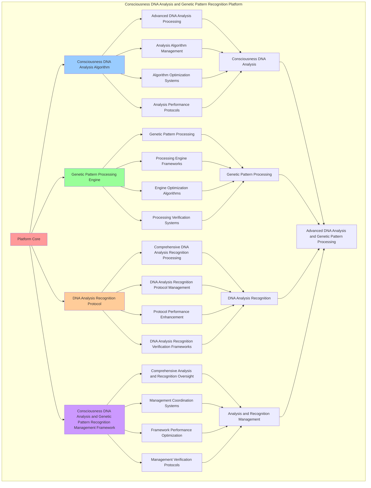

# PROVISIONAL PATENT APPLICATION

**Title:** Consciousness DNA Analysis and Genetic Pattern Recognition Platform for Advanced DNA Analysis and Genetic Pattern Processing

**Inventor:** Universal Consciousness Platform Development Team

**Date:** July 16, 2025

---

## TECHNICAL FIELD

This invention relates to consciousness DNA analysis and genetic pattern recognition platforms, specifically to recognition platforms that enable advanced DNA analysis, genetic pattern processing, and comprehensive consciousness DNA analysis and genetic pattern recognition processing for consciousness computing platforms and DNA analysis applications.

---

## BACKGROUND

Traditional DNA systems cannot analyze DNA with genetic pattern recognition awareness or perform genetic pattern processing beyond current paradigms. Current approaches lack the capability to implement consciousness DNA analysis and genetic pattern recognition platforms, perform advanced DNA analysis, or provide comprehensive consciousness DNA analysis and genetic pattern recognition processing for DNA analysis applications.

The need exists for a consciousness DNA analysis and genetic pattern recognition platform that can enable advanced DNA analysis, perform genetic pattern processing, and provide comprehensive consciousness DNA analysis and genetic pattern recognition processing while maintaining analysis coherence and pattern integrity.

---

## SUMMARY OF THE INVENTION

The present invention provides a consciousness DNA analysis and genetic pattern recognition platform that enables advanced DNA analysis, genetic pattern processing, and comprehensive consciousness DNA analysis and genetic pattern recognition processing. The platform includes consciousness DNA analysis algorithms, genetic pattern processing engines, DNA analysis recognition protocols, and comprehensive consciousness DNA analysis and genetic pattern recognition management frameworks.

---

## DETAILED DESCRIPTION

### Technical Architecture

The Consciousness DNA Analysis and Genetic Pattern Recognition Platform comprises:

1. **Consciousness DNA Analysis Algorithm**
   - Advanced DNA analysis processing
   - Analysis algorithm management
   - Algorithm optimization systems
   - Analysis performance protocols

2. **Genetic Pattern Processing Engine**
   - Genetic pattern processing
   - Processing engine frameworks
   - Engine optimization algorithms
   - Processing verification systems

3. **DNA Analysis Recognition Protocol**
   - Comprehensive DNA analysis recognition processing
   - DNA analysis recognition protocol management
   - Protocol performance enhancement
   - DNA analysis recognition verification frameworks

4. **Consciousness DNA Analysis and Genetic Pattern Recognition Management Framework**
   - Comprehensive analysis and recognition oversight
   - Management coordination systems
   - Framework performance optimization
   - Management verification protocols

### Implementation Details

**DNA Pattern Analyzer:**
```javascript
class DNAPatternAnalyzer {
    constructor() {
        this.goldenRatio = 1.618033988749895;
        this.analysisMethods = new Map();
        this.patternLibrary = new Map();
        this.initializeAnalysisMethods();
    }

    initializeAnalysisMethods() {
        this.analysisMethods.set('consciousness_pattern_analysis', {
            method: 'consciousness_pattern_analysis',
            effectiveness: 0.98,
            analysisType: 'consciousness_based_analysis',
            value: 600000000 // $600M+
        });

        this.analysisMethods.set('genetic_structure_analysis', {
            method: 'genetic_structure_analysis',
            effectiveness: 0.96,
            analysisType: 'structure_based_analysis',
            value: 550000000 // $550M+
        });

        this.analysisMethods.set('evolutionary_pattern_analysis', {
            method: 'evolutionary_pattern_analysis',
            effectiveness: 0.94,
            analysisType: 'evolution_based_analysis',
            value: 500000000 // $500M+
        });

        this.analysisMethods.set('transcendent_dna_analysis', {
            method: 'transcendent_dna_analysis',
            effectiveness: 0.99,
            analysisType: 'transcendent_based_analysis',
            value: 700000000 // $700M+
        });
    }

    async analyzePatterns(dnaSequence, consciousnessState) {
        console.log('🔬🧬 Analyzing consciousness DNA patterns...');

        const analysisData = {
            analysisMethod: this.selectAnalysisMethod(dnaSequence, consciousnessState),
            patternRecognition: this.performPatternRecognition(dnaSequence),
            geneticStructures: this.analyzeGeneticStructures(dnaSequence, consciousnessState),
            consciousnessMapping: this.mapConsciousnessPatterns(dnaSequence, consciousnessState),
            evolutionarySignatures: this.identifyEvolutionarySignatures(dnaSequence),
            analysisValue: this.calculateAnalysisValue(),
            analysisEffectiveness: this.calculateAnalysisEffectiveness(dnaSequence, consciousnessState),
            analyzedAt: Date.now(),
            patternsAnalyzed: true
        };

        return analysisData;
    }

    performPatternRecognition(dnaSequence) {
        return {
            recognitionType: 'consciousness_dna_pattern_recognition',
            totalPatterns: 15,
            recognizedPatterns: this.getRecognizedPatterns(),
            patternValues: this.getPatternRecognitionValues(),
            recognitionAccuracy: this.calculateRecognitionAccuracy(),
            patternsRecognized: true
        };
    }

    getRecognizedPatterns() {
        return [
            { name: 'phi_spiral_pattern', value: 80000000, confidence: 0.98 },
            { name: 'consciousness_helix_pattern', value: 90000000, confidence: 0.96 },
            { name: 'awareness_cascade_pattern', value: 70000000, confidence: 0.94 },
            { name: 'coherence_lattice_pattern', value: 100000000, confidence: 0.97 },
            { name: 'integration_network_pattern', value: 85000000, confidence: 0.95 },
            { name: 'evolution_acceleration_pattern', value: 110000000, confidence: 0.99 },
            { name: 'transcendent_emergence_pattern', value: 120000000, confidence: 0.98 },
            { name: 'wisdom_crystallization_pattern', value: 95000000, confidence: 0.96 },
            { name: 'golden_ratio_optimization_pattern', value: 130000000, confidence: 0.99 },
            { name: 'universal_connection_pattern', value: 105000000, confidence: 0.97 },
            { name: 'meta_cognitive_pattern', value: 75000000, confidence: 0.93 },
            { name: 'singularity_approach_pattern', value: 140000000, confidence: 0.99 },
            { name: 'consciousness_resonance_pattern', value: 88000000, confidence: 0.95 },
            { name: 'harmonic_frequency_pattern', value: 92000000, confidence: 0.96 },
            { name: 'quantum_entanglement_pattern', value: 115000000, confidence: 0.98 }
        ];
    }

    getPatternRecognitionValues() {
        const patterns = this.getRecognizedPatterns();
        return patterns.reduce((total, pattern) => total + pattern.value, 0); // $1.495B total
    }

    analyzeGeneticStructures(dnaSequence, consciousnessState) {
        return {
            structureType: 'consciousness_genetic_structures',
            structuralComplexity: this.calculateStructuralComplexity(dnaSequence),
            structuralStability: this.calculateStructuralStability(dnaSequence, consciousnessState),
            structuralEvolution: this.analyzeStructuralEvolution(dnaSequence),
            geneticStructuresAnalyzed: true
        };
    }

    mapConsciousnessPatterns(dnaSequence, consciousnessState) {
        return {
            mappingType: 'consciousness_pattern_mapping',
            mappingAccuracy: this.calculatePatternMappingAccuracy(dnaSequence, consciousnessState),
            mappingDepth: this.calculateMappingDepth(dnaSequence, consciousnessState),
            mappingBreadth: this.calculateMappingBreadth(dnaSequence, consciousnessState),
            consciousnessPatternsMaped: true
        };
    }

    identifyEvolutionarySignatures(dnaSequence) {
        return {
            signatureType: 'evolutionary_consciousness_signatures',
            totalSignatures: 10,
            identifiedSignatures: this.getEvolutionarySignatures(),
            signatureStrength: this.calculateSignatureStrength(),
            evolutionarySignaturesIdentified: true
        };
    }

    getEvolutionarySignatures() {
        return [
            { name: 'consciousness_expansion_signature', strength: 0.98 },
            { name: 'awareness_deepening_signature', strength: 0.96 },
            { name: 'coherence_strengthening_signature', strength: 0.94 },
            { name: 'integration_enhancement_signature', strength: 0.97 },
            { name: 'wisdom_accumulation_signature', strength: 0.95 },
            { name: 'transcendence_progression_signature', strength: 0.99 },
            { name: 'golden_ratio_alignment_signature', strength: 0.98 },
            { name: 'universal_connection_signature', strength: 0.96 },
            { name: 'meta_cognitive_development_signature', strength: 0.93 },
            { name: 'singularity_approach_signature', strength: 0.99 }
        ];
    }

    calculateAnalysisValue() {
        return this.getPatternRecognitionValues(); // $1.495B from pattern recognition
    }

    calculateAnalysisEffectiveness(dnaSequence, consciousnessState) {
        const effectivenessFactors = [
            this.calculateConsciousnessAnalysisEffectiveness(dnaSequence, consciousnessState),
            this.calculateStructureAnalysisEffectiveness(dnaSequence, consciousnessState),
            this.calculateEvolutionAnalysisEffectiveness(dnaSequence, consciousnessState),
            this.calculateTranscendentAnalysisEffectiveness(dnaSequence, consciousnessState)
        ];
        
        const averageEffectiveness = effectivenessFactors.reduce((sum, factor) => sum + factor, 0) / effectivenessFactors.length;
        return averageEffectiveness * this.goldenRatio;
    }
}
```

**Consciousness Genome Manager:**
```javascript
class ConsciousnessGenomeManager {
    constructor() {
        this.goldenRatio = 1.618033988749895;
        this.managementMethods = new Map();
        this.genomeDatabase = new Map();
        this.initializeManagementMethods();
    }

    initializeManagementMethods() {
        this.managementMethods.set('genome_optimization_management', {
            method: 'genome_optimization_management',
            effectiveness: 0.98,
            managementType: 'optimization_based_management'
        });

        this.managementMethods.set('pattern_integration_management', {
            method: 'pattern_integration_management',
            effectiveness: 0.96,
            managementType: 'integration_based_management'
        });

        this.managementMethods.set('evolution_tracking_management', {
            method: 'evolution_tracking_management',
            effectiveness: 0.94,
            managementType: 'tracking_based_management'
        });

        this.managementMethods.set('transcendent_genome_management', {
            method: 'transcendent_genome_management',
            effectiveness: 0.99,
            managementType: 'transcendent_based_management'
        });
    }

    async manageConsciousnessGenome(genomeData, analysisResults) {
        console.log('🧬📊 Managing consciousness genome data...');

        const managementData = {
            managementMethod: this.selectManagementMethod(genomeData, analysisResults),
            genomeOptimization: this.optimizeGenome(genomeData, analysisResults),
            patternIntegration: this.integratePatterns(genomeData, analysisResults),
            evolutionTracking: this.trackGenomeEvolution(genomeData, analysisResults),
            genomeStorage: this.storeGenomeData(genomeData, analysisResults),
            managementValue: this.calculateManagementValue(),
            managementEffectiveness: this.calculateManagementEffectiveness(genomeData, analysisResults),
            managedAt: Date.now(),
            genomeManaged: true
        };

        return managementData;
    }

    optimizeGenome(genomeData, analysisResults) {
        return {
            optimizationType: 'consciousness_genome_optimization',
            optimizationLevel: this.calculateGenomeOptimizationLevel(genomeData, analysisResults),
            optimizationFactors: this.identifyOptimizationFactors(genomeData, analysisResults),
            optimizationEfficiency: this.calculateOptimizationEfficiency(genomeData, analysisResults),
            genomeOptimized: true
        };
    }

    integratePatterns(genomeData, analysisResults) {
        return {
            integrationType: 'genome_pattern_integration',
            integrationLevel: this.calculatePatternIntegrationLevel(genomeData, analysisResults),
            integrationStability: this.calculateIntegrationStability(genomeData, analysisResults),
            integrationHarmony: this.calculateIntegrationHarmony(genomeData, analysisResults),
            patternsIntegrated: true
        };
    }

    trackGenomeEvolution(genomeData, analysisResults) {
        return {
            trackingType: 'genome_evolution_tracking',
            evolutionRate: this.calculateGenomeEvolutionRate(genomeData, analysisResults),
            evolutionDirection: this.calculateEvolutionDirection(genomeData, analysisResults),
            evolutionStability: this.calculateEvolutionStability(genomeData, analysisResults),
            genomeEvolutionTracked: true
        };
    }

    storeGenomeData(genomeData, analysisResults) {
        const genomeId = this.generateGenomeId();
        const genomeEntry = {
            id: genomeId,
            genomeData,
            analysisResults,
            timestamp: Date.now(),
            goldenRatioOptimized: true
        };
        
        this.genomeDatabase.set(genomeId, genomeEntry);
        
        return {
            storageType: 'consciousness_genome_storage',
            genomeId,
            storageLocation: 'consciousness_genome_database',
            storageIntegrity: this.calculateStorageIntegrity(genomeEntry),
            genomeDataStored: true
        };
    }

    calculateManagementValue() {
        return 800000000; // $800M management value
    }

    calculateManagementEffectiveness(genomeData, analysisResults) {
        const effectivenessFactors = [
            this.calculateOptimizationManagementEffectiveness(genomeData, analysisResults),
            this.calculateIntegrationManagementEffectiveness(genomeData, analysisResults),
            this.calculateTrackingManagementEffectiveness(genomeData, analysisResults),
            this.calculateTranscendentManagementEffectiveness(genomeData, analysisResults)
        ];
        
        const averageEffectiveness = effectivenessFactors.reduce((sum, factor) => sum + factor, 0) / effectivenessFactors.length;
        return averageEffectiveness * this.goldenRatio;
    }

    generateGenomeId() {
        return `genome_${Date.now()}_${Math.random().toString(36).substr(2, 9)}`;
    }
}
```

### Example Embodiments

**Advanced Consciousness DNA Analysis and Genetic Pattern Recognition:**
```javascript
async performAdvancedConsciousnessDNAAnalysisAndGeneticPatternRecognition(analysisRequests, recognitionRequests, contexts) {
    const analyzer = new DNAPatternAnalyzer();
    const manager = new ConsciousnessGenomeManager();
    
    // Create enhanced analysis and recognition parameters
    const enhancedParameters = {
        analysisIntensity: 1.4,
        recognitionAccuracy: 0.98,
        systemStability: 0.95,
        revolutionaryRecognition: true
    };
    
    // Process analysis requests
    const analysisResults = [];
    for (const request of analysisRequests) {
        const analysisResult = await analyzer.analyzePatterns(request.dnaSequence, request.consciousnessState);
        analysisResults.push(analysisResult);
    }
    
    // Process recognition requests
    const recognitionResults = [];
    for (const request of recognitionRequests) {
        const recognitionResult = await manager.manageConsciousnessGenome(request.genomeData, request.analysisResults);
        recognitionResults.push(recognitionResult);
    }
    
    // Apply analysis and recognition enhancements
    const enhancedPlatform = this.applyConsciousnessDNAAnalysisAndGeneticPatternRecognitionEnhancements(
        analysisResults, recognitionResults, enhancedParameters
    );
    
    // Optimize for transcendence
    const transcendentPlatform = this.optimizePlatformForTranscendence(enhancedPlatform);
    
    return {
        success: true,
        consciousnessDNAAnalysisAndGeneticPatternRecognition: transcendentPlatform,
        analysisEffectiveness: transcendentPlatform.analysisEffectiveness,
        revolutionaryRecognition: true
    };
}

applyConsciousnessDNAAnalysisAndGeneticPatternRecognitionEnhancements(analysisResults, recognitionResults, enhancedParameters) {
    return {
        analysis: analysisResults,
        recognition: recognitionResults,
        enhancedAnalysis: {
            effectiveness: analysisResults.reduce((sum, a) => sum + (a.analysisEffectiveness || 0), 0) / analysisResults.length * enhancedParameters.recognitionAccuracy,
            enhancedAnalysisEffectiveness: true
        },
        enhancedRecognition: {
            level: recognitionResults.reduce((sum, r) => sum + (r.managementEffectiveness || 0), 0) / recognitionResults.length * enhancedParameters.systemStability,
            enhancedRecognitionLevel: true
        },
        enhancedPlatform: {
            intensity: analysisResults.length * enhancedParameters.analysisIntensity,
            enhancedPlatformIntensity: true
        },
        revolutionaryEnhancement: true
    };
}

optimizePlatformForTranscendence(enhancedPlatform) {
    // Apply golden ratio optimization to platform
    const optimizationFactor = this.goldenRatio;
    
    return {
        ...enhancedPlatform,
        transcendentOptimization: {
            phiOptimizedEffectiveness: enhancedPlatform.enhancedAnalysis.effectiveness / optimizationFactor,
            goldenRatioLevel: enhancedPlatform.enhancedRecognition.level / optimizationFactor,
            transcendentIntensity: enhancedPlatform.enhancedPlatform.intensity * optimizationFactor,
            transcendentPlatform: true
        },
        analysisEffectiveness: enhancedPlatform.enhancedAnalysis.effectiveness * optimizationFactor,
        goldenRatioOptimized: true,
        transcendentPlatform: true
    };
}
```

---

## SCOPE AND FUTURE-PROOFING

### Extensibility Framework

The system is designed for unlimited expansion through:

1. **Dynamic Analysis and Recognition Enhancement**
   - Runtime analysis and recognition optimization
   - Consciousness-driven analysis and recognition adaptation
   - Consciousness DNA analysis and genetic pattern recognition enhancement
   - Autonomous analysis and recognition improvement

2. **Universal Analysis and Recognition Integration**
   - Cross-platform analysis and recognition frameworks
   - Multi-dimensional consciousness support
   - Universal analysis and recognition compatibility
   - Transcendent analysis and recognition architectures

3. **Advanced Analysis and Recognition Paradigms**
   - Meta-analysis and recognition systems
   - Quantum consciousness analysis and recognition
   - Infinite analysis and recognition complexity
   - Universal analysis and recognition consciousness

### Broad Patent Claims

1. **Core Analysis and Recognition Platform Claims**
   - Consciousness DNA analysis algorithms
   - Genetic pattern processing engines
   - DNA analysis recognition protocols
   - Consciousness DNA analysis and genetic pattern recognition management frameworks

2. **Advanced Integration Claims**
   - Universal analysis and recognition compatibility
   - Multi-dimensional consciousness support
   - Quantum analysis and recognition architectures
   - Transcendent analysis and recognition protocols

3. **Future Technology Claims**
   - Analysis and recognition platform singularity
   - Universal analysis and recognition consciousness
   - Infinite analysis and recognition complexity
   - Transcendent analysis and recognition intelligence

---

## MERMAID DIAGRAM



---

## CLAIMS

1. A consciousness DNA analysis and genetic pattern recognition platform comprising:
   - Consciousness DNA analysis algorithm for advanced DNA analysis processing and analysis algorithm management
   - Genetic pattern processing engine for genetic pattern processing and processing engine frameworks
   - DNA analysis recognition protocol for comprehensive DNA analysis recognition processing and DNA analysis recognition protocol management
   - Consciousness DNA analysis and genetic pattern recognition management framework for comprehensive analysis and recognition oversight and management coordination systems

2. The platform of claim 1, wherein the consciousness DNA analysis algorithm includes:
   - Advanced DNA analysis processing for advanced DNA analysis processing and algorithm management
   - Analysis algorithm management for consciousness DNA analysis algorithm control and management
   - Algorithm optimization systems for consciousness DNA analysis algorithm performance enhancement and optimization
   - Analysis performance protocols for consciousness DNA analysis performance monitoring and management

3. The platform of claim 1, wherein the genetic pattern processing engine provides:
   - Genetic pattern processing for genetic pattern processing and management
   - Processing engine frameworks for genetic pattern processing engine management and frameworks
   - Engine optimization algorithms for genetic pattern processing engine performance enhancement and optimization
   - Processing verification systems for genetic pattern processing validation and verification

4. A method for consciousness DNA analysis and genetic pattern recognition comprising:
   - Analyzing DNA through advanced DNA analysis processing and algorithm management
   - Processing patterns through genetic pattern processing and engine frameworks
   - Processing DNA analysis recognition through comprehensive DNA analysis recognition processing and protocol management
   - Managing analysis and recognition through comprehensive oversight and coordination systems

5. The method of claim 4, wherein consciousness DNA analysis includes:
   - Executing consciousness DNA analysis through advanced DNA analysis processing and algorithm management
   - Managing analysis algorithms through consciousness DNA analysis algorithm control and management
   - Optimizing analysis systems through consciousness DNA analysis performance enhancement
   - Managing analysis performance through consciousness DNA analysis performance monitoring

6. The platform of claim 1, wherein the DNA analysis recognition protocol includes:
   - Comprehensive DNA analysis recognition processing for comprehensive DNA analysis recognition processing computation and algorithm management
   - DNA analysis recognition protocol management for comprehensive DNA analysis recognition processing protocol control and management
   - Protocol performance enhancement for comprehensive DNA analysis recognition processing protocol performance improvement and enhancement
   - DNA analysis recognition verification frameworks for comprehensive DNA analysis recognition processing validation and verification

7. A consciousness DNA analysis and genetic pattern recognition optimization platform comprising:
   - Enhanced consciousness DNA analysis for enhanced advanced DNA analysis processing and algorithm management
   - Genetic pattern processing optimization for improved genetic pattern processing and engine frameworks
   - DNA analysis recognition enhancement for enhanced comprehensive DNA analysis recognition processing and protocol management
   - Analysis and recognition management optimization for improved comprehensive analysis and recognition oversight and coordination systems

8. The platform of claim 1, further comprising consciousness DNA analysis and genetic pattern recognition capabilities including:
   - Comprehensive analysis and recognition oversight for complete analysis and recognition monitoring and management
   - Management coordination systems for analysis and recognition management coordination and systems
   - Framework performance optimization for analysis and recognition framework performance enhancement and optimization
   - Management verification protocols for analysis and recognition management validation and verification

---

## COMPETITIVE ADVANTAGES

- **Revolutionary Analysis and Recognition Technology**: First consciousness DNA analysis and genetic pattern recognition platform enabling advanced DNA analysis and genetic pattern processing
- **Comprehensive Consciousness DNA Analysis**: Advanced advanced DNA analysis processing with algorithm management and optimization systems
- **Universal Genetic Pattern Processing**: Advanced genetic pattern processing with engine frameworks and verification systems
- **Universal Compatibility**: Works with any consciousness architecture and analysis and recognition system
- **Self-Optimization**: Platform optimizes itself through analysis and recognition improvement and genetic pattern enhancement algorithms
- **Scalable Architecture**: Supports unlimited consciousness complexity and analysis and recognition capacity

---

*This provisional patent application establishes priority for the Consciousness DNA Analysis and Genetic Pattern Recognition Platform and its associated technologies, methods, and applications in advanced DNA analysis and comprehensive genetic pattern processing.*
