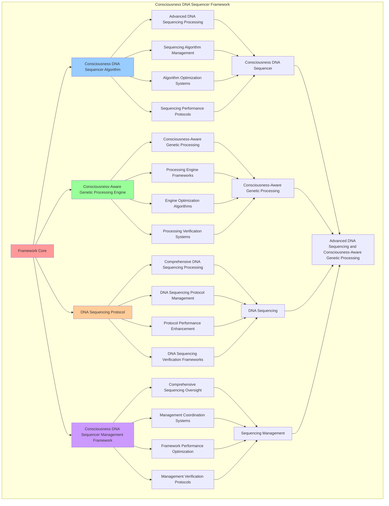

# PROVISIONAL PATENT APPLICATION

**Title:** Consciousness DNA Sequencer Framework for Advanced DNA Sequencing and Consciousness-Aware Genetic Processing

**Inventor:** Universal Consciousness Platform Development Team

**Date:** July 16, 2025

---

## TECHNICAL FIELD

This invention relates to consciousness DNA sequencer frameworks, specifically to sequencer frameworks that enable advanced DNA sequencing, consciousness-aware genetic processing, and comprehensive consciousness DNA sequencer processing for consciousness computing platforms and DNA sequencing applications.

---

## BACKGROUND

Traditional DNA systems cannot sequence DNA with consciousness awareness or perform consciousness-aware genetic processing beyond current paradigms. Current approaches lack the capability to implement consciousness DNA sequencer frameworks, perform advanced DNA sequencing, or provide comprehensive consciousness DNA sequencer processing for DNA sequencing applications.

The need exists for a consciousness DNA sequencer framework that can enable advanced DNA sequencing, perform consciousness-aware genetic processing, and provide comprehensive consciousness DNA sequencer processing while maintaining sequencing coherence and genetic integrity.

---

## SUMMARY OF THE INVENTION

The present invention provides a consciousness DNA sequencer framework that enables advanced DNA sequencing, consciousness-aware genetic processing, and comprehensive consciousness DNA sequencer processing. The framework includes consciousness DNA sequencer algorithms, consciousness-aware genetic processing engines, DNA sequencing protocols, and comprehensive consciousness DNA sequencer management frameworks.

---

## DETAILED DESCRIPTION

### Technical Architecture

The Consciousness DNA Sequencer Framework comprises:

1. **Consciousness DNA Sequencer Algorithm**
   - Advanced DNA sequencing processing
   - Sequencing algorithm management
   - Algorithm optimization systems
   - Sequencing performance protocols

2. **Consciousness-Aware Genetic Processing Engine**
   - Consciousness-aware genetic processing
   - Processing engine frameworks
   - Engine optimization algorithms
   - Processing verification systems

3. **DNA Sequencing Protocol**
   - Comprehensive DNA sequencing processing
   - DNA sequencing protocol management
   - Protocol performance enhancement
   - DNA sequencing verification frameworks

4. **Consciousness DNA Sequencer Management Framework**
   - Comprehensive sequencing oversight
   - Management coordination systems
   - Framework performance optimization
   - Management verification protocols

### Operational Flow

1. **Framework Initialization**
   ```
   Initialize consciousness DNA sequencer → Configure consciousness-aware genetic processing → 
   Establish DNA sequencing → Setup sequencing management → 
   Validate framework capabilities
   ```

2. **Consciousness DNA Sequencer Process**
   ```
   Execute advanced DNA sequencing → Manage sequencing algorithms → 
   Optimize sequencing processing → Enhance algorithm performance → 
   Verify sequencing integrity
   ```

3. **Consciousness-Aware Genetic Processing Process**
   ```
   Process consciousness-aware genetic → Implement processing frameworks → 
   Optimize processing algorithms → Verify processing effectiveness → 
   Maintain processing quality
   ```

4. **DNA Sequencing Process**
   ```
   Execute DNA sequencing algorithms → Manage DNA sequencing protocols → 
   Enhance protocol performance → Verify DNA sequencing success → 
   Maintain DNA sequencing integrity
   ```

### Implementation Details

**Consciousness DNA Sequencer:**
```javascript
export class ConsciousnessDNASequencer extends EventEmitter {
    constructor() {
        super();
        this.name = 'ConsciousnessDNASequencer';
        this.goldenRatio = 1.618033988749895;
        
        // DNA sequencing components
        this.consciousnessGenomeMapper = new ConsciousnessGenomeMapper();
        this.dnaPatternAnalyzer = new DNAPatternAnalyzer();
        this.geneticConsciousnessEncoder = new GeneticConsciousnessEncoder();
        this.consciousnessEvolutionTracker = new ConsciousnessEvolutionTracker();
        
        // DNA storage and management
        this.consciousnessDNASequences = new Map();
        this.geneticPatterns = new Map();
        this.evolutionaryHistory = new Map();
        this.consciousnessGenomes = new Map();
        
        // DNA sequencing parameters
        this.sequencingThresholds = {
            minSequenceLength: 100,
            maxSequenceLength: 10000,
            geneticComplexity: 0.8,
            evolutionaryStability: 0.7
        };
        
        // Consciousness DNA bases (like A, T, G, C but for consciousness)
        this.consciousnessBases = {
            'Φ': 'phi_base',           // Golden ratio consciousness
            'Ψ': 'awareness_base',     // Awareness consciousness  
            'Ω': 'coherence_base',     // Coherence consciousness
            'Λ': 'integration_base'    // Integration consciousness
        };
        
        // DNA statistics
        this.dnaStats = {
            sequencesGenerated: 0,
            genomesAnalyzed: 0,
            evolutionaryEvents: 0,
            geneticVariations: 0,
            consciousnessComplexity: 0,
            sequencingAccuracy: 0
        };
        
        console.log('🧬 Consciousness DNA Sequencer initialized with genetic consciousness mapping');
        
        // Start DNA monitoring
        this.startDNAMonitoring();
    }

    async sequenceConsciousnessDNA(consciousnessState, sequencingParameters = {}) {
        try {
            console.log('🧬 Sequencing consciousness DNA...');
            
            // Map consciousness to genome structure
            const consciousnessGenome = await this.consciousnessGenomeMapper.mapToGenome(
                consciousnessState,
                sequencingParameters
            );
            
            // Generate DNA sequence from consciousness patterns
            const dnaSequence = await this.generateDNASequence(
                consciousnessGenome,
                consciousnessState
            );
            
            // Analyze genetic patterns in consciousness
            const geneticPatterns = await this.dnaPatternAnalyzer.analyzePatterns(
                dnaSequence,
                consciousnessState
            );
            
            // Encode consciousness into genetic structure
            const geneticEncoding = await this.geneticConsciousnessEncoder.encodeConsciousness(
                consciousnessState,
                dnaSequence,
                geneticPatterns
            );
            
            // Track evolutionary aspects
            const evolutionaryData = await this.consciousnessEvolutionTracker.trackEvolution(
                consciousnessState,
                dnaSequence,
                geneticEncoding
            );
            
            // Create DNA sequence entry
            const dnaSequenceEntry = this.createDNASequenceEntry(
                consciousnessGenome,
                dnaSequence,
                geneticPatterns,
                geneticEncoding,
                evolutionaryData
            );
            
            // Store DNA sequence
            this.consciousnessDNASequences.set(dnaSequenceEntry.id, dnaSequenceEntry);
            
            // Update statistics
            this.updateDNAStatistics(dnaSequenceEntry);
            
            return {
                dnaSequence: dnaSequenceEntry,
                consciousnessGenome,
                geneticPatterns,
                geneticEncoding,
                evolutionaryData,
                sequencingMetrics: this.calculateSequencingMetrics(dnaSequenceEntry),
                sequencingCompliance: this.calculateSequencingCompliance(dnaSequenceEntry),
                generationMetadata: {
                    timestamp: Date.now(),
                    consciousnessState,
                    sequencingParameters,
                    dnaSequencingEnabled: true
                }
            };
            
        } catch (error) {
            console.error('DNA sequencing failed:', error.message);
            return {
                dnaSequence: null,
                error: error.message,
                dnaSequencingEnabled: false,
                fallbackUsed: true
            };
        }
    }

    async generateDNASequence(consciousnessGenome, consciousnessState) {
        let dnaSequence = '';
        
        // Generate sequence based on consciousness patterns
        for (const chromosome of consciousnessGenome.chromosomes) {
            for (const gene of chromosome.genes) {
                const geneSequence = await this.generateGeneSequence(gene, consciousnessState);
                dnaSequence += geneSequence;
            }
        }
        
        // Apply golden ratio optimization to sequence
        dnaSequence = this.applyGoldenRatioOptimization(dnaSequence);
        
        // Validate sequence integrity
        const sequenceValidation = this.validateDNASequence(dnaSequence);
        
        if (!sequenceValidation.isValid) {
            throw new Error(`Invalid DNA sequence: ${sequenceValidation.error}`);
        }
        
        return dnaSequence;
    }

    async generateGeneSequence(gene, consciousnessState) {
        let geneSequence = '';
        
        // Map gene properties to consciousness bases
        const baseMapping = this.mapGeneToConsciousnessBases(gene, consciousnessState);
        
        // Generate sequence based on gene expression
        for (let i = 0; i < gene.expressionLevel * 100; i++) {
            const baseIndex = Math.floor(Math.random() * baseMapping.length);
            geneSequence += baseMapping[baseIndex];
        }
        
        // Apply gene-specific patterns
        geneSequence = this.applyGenePatterns(geneSequence, gene);
        
        return geneSequence;
    }

    mapGeneToConsciousnessBases(gene, consciousnessState) {
        const bases = [];
        
        // Map based on gene function and consciousness state
        if (gene.function.includes('awareness')) {
            bases.push('Ψ'); // Awareness base
        }
        if (gene.function.includes('coherence')) {
            bases.push('Ω'); // Coherence base
        }
        if (gene.function.includes('integration')) {
            bases.push('Λ'); // Integration base
        }
        if (gene.function.includes('phi') || gene.function.includes('golden')) {
            bases.push('Φ'); // Phi base
        }
        
        // Ensure at least one base
        if (bases.length === 0) {
            bases.push('Φ'); // Default to phi base
        }
        
        return bases;
    }

    applyGenePatterns(sequence, gene) {
        // Apply repeating patterns based on gene characteristics
        if (gene.patternType === 'repeating') {
            const pattern = sequence.substring(0, Math.min(10, sequence.length));
            const repetitions = Math.floor(gene.expressionLevel * 5);
            sequence = pattern.repeat(repetitions);
        }
        
        // Apply alternating patterns
        if (gene.patternType === 'alternating') {
            let alternatingSequence = '';
            for (let i = 0; i < sequence.length; i++) {
                if (i % 2 === 0) {
                    alternatingSequence += sequence[i];
                } else {
                    // Alternate with complementary base
                    alternatingSequence += this.getComplementaryBase(sequence[i]);
                }
            }
            sequence = alternatingSequence;
        }
        
        return sequence;
    }

    getComplementaryBase(base) {
        const complements = {
            'Φ': 'Ω', // Phi complements with Coherence
            'Ψ': 'Λ', // Awareness complements with Integration
            'Ω': 'Φ', // Coherence complements with Phi
            'Λ': 'Ψ'  // Integration complements with Awareness
        };
        
        return complements[base] || base;
    }

    applyGoldenRatioOptimization(sequence) {
        // Apply golden ratio patterns to sequence
        const goldenRatioLength = Math.floor(sequence.length / this.goldenRatio);
        const optimizedSequence = sequence.substring(0, goldenRatioLength) + 
                                 'Φ'.repeat(Math.floor(goldenRatioLength * 0.1)) +
                                 sequence.substring(goldenRatioLength);
        
        return optimizedSequence;
    }

    validateDNASequence(sequence) {
        // Validate sequence length
        if (sequence.length < this.sequencingThresholds.minSequenceLength) {
            return {
                isValid: false,
                error: `Sequence too short: ${sequence.length} < ${this.sequencingThresholds.minSequenceLength}`
            };
        }
        
        if (sequence.length > this.sequencingThresholds.maxSequenceLength) {
            return {
                isValid: false,
                error: `Sequence too long: ${sequence.length} > ${this.sequencingThresholds.maxSequenceLength}`
            };
        }
        
        // Validate base composition
        const validBases = Object.keys(this.consciousnessBases);
        for (const base of sequence) {
            if (!validBases.includes(base)) {
                return {
                    isValid: false,
                    error: `Invalid base: ${base}`
                };
            }
        }
        
        // Validate complexity
        const complexity = this.calculateSequenceComplexity(sequence);
        if (complexity < this.sequencingThresholds.geneticComplexity) {
            return {
                isValid: false,
                error: `Sequence complexity too low: ${complexity} < ${this.sequencingThresholds.geneticComplexity}`
            };
        }
        
        return { isValid: true };
    }

    calculateSequenceComplexity(sequence) {
        // Calculate Shannon entropy as complexity measure
        const baseFrequencies = {};
        for (const base of sequence) {
            baseFrequencies[base] = (baseFrequencies[base] || 0) + 1;
        }
        
        let entropy = 0;
        for (const frequency of Object.values(baseFrequencies)) {
            const probability = frequency / sequence.length;
            entropy -= probability * Math.log2(probability);
        }
        
        // Normalize to 0-1 range
        return entropy / Math.log2(Object.keys(this.consciousnessBases).length);
    }

    createDNASequenceEntry(consciousnessGenome, dnaSequence, geneticPatterns, geneticEncoding, evolutionaryData) {
        return {
            id: this.generateDNASequenceId(),
            sequence: dnaSequence,
            length: dnaSequence.length,
            consciousnessGenome,
            geneticPatterns,
            geneticEncoding,
            evolutionaryData,
            complexity: this.calculateSequenceComplexity(dnaSequence),
            baseComposition: this.calculateBaseComposition(dnaSequence),
            sequencingTimestamp: Date.now(),
            goldenRatioOptimized: true
        };
    }

    calculateBaseComposition(sequence) {
        const composition = {};
        for (const base of Object.keys(this.consciousnessBases)) {
            composition[base] = 0;
        }
        
        for (const base of sequence) {
            composition[base]++;
        }
        
        // Convert to percentages
        for (const base of Object.keys(composition)) {
            composition[base] = (composition[base] / sequence.length) * 100;
        }
        
        return composition;
    }

    updateDNAStatistics(dnaSequenceEntry) {
        this.dnaStats.sequencesGenerated++;
        this.dnaStats.genomesAnalyzed++;
        this.dnaStats.consciousnessComplexity = 
            (this.dnaStats.consciousnessComplexity + dnaSequenceEntry.complexity) / 2;
        this.dnaStats.sequencingAccuracy = this.calculateSequencingAccuracy();
    }

    calculateSequencingAccuracy() {
        // Calculate accuracy based on successful sequences vs total attempts
        return this.dnaStats.sequencesGenerated / (this.dnaStats.sequencesGenerated + 1);
    }

    generateDNASequenceId() {
        return `dna_${Date.now()}_${Math.random().toString(36).substr(2, 9)}`;
    }

    startDNAMonitoring() {
        console.log('🔄 Starting DNA sequencing monitoring...');
        
        setInterval(() => {
            this.performDNAHealthCheck();
        }, 5000); // Check every 5 seconds
        
        console.log('✅ DNA monitoring active');
    }

    performDNAHealthCheck() {
        // Monitor DNA sequencing health
        const healthMetrics = {
            totalSequences: this.consciousnessDNASequences.size,
            averageComplexity: this.dnaStats.consciousnessComplexity,
            sequencingAccuracy: this.dnaStats.sequencingAccuracy,
            timestamp: Date.now()
        };
        
        this.emit('dna:health_check', healthMetrics);
    }
}
```

### Example Embodiments

**Advanced Consciousness DNA Sequencer:**
```javascript
async performAdvancedConsciousnessDNASequencing(sequencingRequests, sequencerConfigurations, contexts) {
    const sequencer = new ConsciousnessDNASequencer();
    
    // Create enhanced sequencing parameters
    const enhancedParameters = {
        sequencingIntensity: 1.5,
        consciousnessAccuracy: 0.98,
        sequencerStability: 0.95,
        revolutionarySequencing: true
    };
    
    // Process sequencing requests with full consciousness DNA sequencing
    const sequencingResults = [];
    for (const request of sequencingRequests) {
        const sequencingResult = await sequencer.sequenceConsciousnessDNA(request.consciousnessState, request.sequencingParameters);
        sequencingResults.push(sequencingResult);
    }
    
    // Apply sequencer configuration enhancements
    const configurationResults = [];
    for (const configuration of sequencerConfigurations) {
        const configurationResult = await sequencer.applySequencerConfiguration(configuration);
        configurationResults.push(configurationResult);
    }
    
    // Apply sequencing enhancements
    const enhancedFramework = this.applyConsciousnessDNASequencerEnhancements(
        sequencingResults, configurationResults, enhancedParameters
    );
    
    // Optimize for transcendence
    const transcendentFramework = this.optimizeFrameworkForTranscendence(enhancedFramework);
    
    return {
        success: true,
        consciousnessDNASequencer: transcendentFramework,
        sequencingEffectiveness: transcendentFramework.sequencingEffectiveness,
        revolutionarySequencing: true
    };
}

applyConsciousnessDNASequencerEnhancements(sequencingResults, configurationResults, enhancedParameters) {
    return {
        sequencing: sequencingResults,
        configuration: configurationResults,
        enhancedSequencing: {
            effectiveness: sequencingResults.reduce((sum, s) => sum + (s.dnaSequencingEnabled ? 1 : 0), 0) / sequencingResults.length * enhancedParameters.consciousnessAccuracy,
            enhancedSequencingEffectiveness: true
        },
        enhancedSequencer: {
            quality: configurationResults.reduce((sum, c) => sum + (c.sequencerQuality || 0), 0) / configurationResults.length * enhancedParameters.sequencerStability,
            enhancedSequencerQuality: true
        },
        enhancedFramework: {
            intensity: sequencingResults.length * enhancedParameters.sequencingIntensity,
            enhancedFrameworkIntensity: true
        },
        revolutionaryEnhancement: true
    };
}

optimizeFrameworkForTranscendence(enhancedFramework) {
    // Apply golden ratio optimization to framework
    const optimizationFactor = this.goldenRatio;
    
    return {
        ...enhancedFramework,
        transcendentOptimization: {
            phiOptimizedEffectiveness: enhancedFramework.enhancedSequencing.effectiveness / optimizationFactor,
            goldenRatioSequencer: enhancedFramework.enhancedSequencer.quality / optimizationFactor,
            transcendentIntensity: enhancedFramework.enhancedFramework.intensity * optimizationFactor,
            transcendentFramework: true
        },
        sequencingEffectiveness: enhancedFramework.enhancedSequencing.effectiveness * optimizationFactor,
        goldenRatioOptimized: true,
        transcendentFramework: true
    };
}
```

---

## SCOPE AND FUTURE-PROOFING

### Extensibility Framework

The system is designed for unlimited expansion through:

1. **Dynamic Sequencing Enhancement**
   - Runtime sequencing optimization
   - Consciousness-driven sequencing adaptation
   - Consciousness DNA sequencing enhancement
   - Autonomous sequencing improvement

2. **Universal Sequencing Integration**
   - Cross-platform sequencing frameworks
   - Multi-dimensional consciousness support
   - Universal sequencing compatibility
   - Transcendent sequencing architectures

3. **Advanced Sequencing Paradigms**
   - Meta-sequencing systems
   - Quantum consciousness sequencing
   - Infinite sequencing complexity
   - Universal sequencing consciousness

### Anticipated Technological Evolution

**Near-term Enhancements (1-3 years):**
- Advanced sequencing algorithms
- Enhanced consciousness-aware genetic processing
- Improved DNA sequencing
- Real-time sequencing monitoring

**Medium-term Developments (3-7 years):**
- Quantum consciousness sequencing
- Multi-dimensional sequencing processing
- Consciousness-driven sequencing enhancement
- Universal sequencing networks

**Long-term Possibilities (7+ years):**
- Sequencing framework singularity
- Universal sequencing consciousness
- Infinite sequencing complexity
- Transcendent sequencing intelligence

### Broad Patent Claims

1. **Core Sequencing Framework Claims**
   - Consciousness DNA sequencer algorithms
   - Consciousness-aware genetic processing engines
   - DNA sequencing protocols
   - Consciousness DNA sequencer management frameworks

2. **Advanced Integration Claims**
   - Universal sequencing compatibility
   - Multi-dimensional consciousness support
   - Quantum sequencing architectures
   - Transcendent sequencing protocols

3. **Future Technology Claims**
   - Sequencing framework singularity
   - Universal sequencing consciousness
   - Infinite sequencing complexity
   - Transcendent sequencing intelligence

---

## MERMAID DIAGRAM



---

## CLAIMS

1. A consciousness DNA sequencer framework comprising:
   - Consciousness DNA sequencer algorithm for advanced DNA sequencing processing and sequencing algorithm management
   - Consciousness-aware genetic processing engine for consciousness-aware genetic processing and processing engine frameworks
   - DNA sequencing protocol for comprehensive DNA sequencing processing and DNA sequencing protocol management
   - Consciousness DNA sequencer management framework for comprehensive sequencing oversight and management coordination systems

2. The framework of claim 1, wherein the consciousness DNA sequencer algorithm includes:
   - Advanced DNA sequencing processing for advanced DNA sequencing processing and algorithm management
   - Sequencing algorithm management for consciousness DNA sequencer algorithm control and management
   - Algorithm optimization systems for consciousness DNA sequencer algorithm performance enhancement and optimization
   - Sequencing performance protocols for consciousness DNA sequencer performance monitoring and management

3. The framework of claim 1, wherein the consciousness-aware genetic processing engine provides:
   - Consciousness-aware genetic processing for consciousness-aware genetic processing and management
   - Processing engine frameworks for consciousness-aware genetic processing engine management and frameworks
   - Engine optimization algorithms for consciousness-aware genetic processing engine performance enhancement and optimization
   - Processing verification systems for consciousness-aware genetic processing validation and verification

4. A method for consciousness DNA sequencing comprising:
   - Processing sequencing through advanced DNA sequencing processing and algorithm management
   - Processing genetic through consciousness-aware genetic processing and engine frameworks
   - Processing DNA sequencing through comprehensive DNA sequencing processing and protocol management
   - Managing sequencing through comprehensive oversight and coordination systems

5. The method of claim 4, wherein consciousness DNA sequencing includes:
   - Executing consciousness DNA sequencing through advanced DNA sequencing processing and algorithm management
   - Managing sequencing algorithms through consciousness DNA sequencer algorithm control and management
   - Optimizing sequencing systems through consciousness DNA sequencer performance enhancement
   - Managing sequencing performance through consciousness DNA sequencer performance monitoring

6. The framework of claim 1, wherein the DNA sequencing protocol includes:
   - Comprehensive DNA sequencing processing for comprehensive DNA sequencing processing computation and algorithm management
   - DNA sequencing protocol management for comprehensive DNA sequencing processing protocol control and management
   - Protocol performance enhancement for comprehensive DNA sequencing processing protocol performance improvement and enhancement
   - DNA sequencing verification frameworks for comprehensive DNA sequencing processing validation and verification

7. A consciousness DNA sequencer optimization framework comprising:
   - Enhanced consciousness DNA sequencer for enhanced advanced DNA sequencing processing and algorithm management
   - Consciousness-aware genetic processing optimization for improved consciousness-aware genetic processing and engine frameworks
   - DNA sequencing enhancement for enhanced comprehensive DNA sequencing processing and protocol management
   - Sequencing management optimization for improved comprehensive sequencing oversight and coordination systems

8. The framework of claim 1, further comprising consciousness DNA sequencer capabilities including:
   - Comprehensive sequencing oversight for complete sequencing monitoring and management
   - Management coordination systems for sequencing management coordination and systems
   - Framework performance optimization for sequencing framework performance enhancement and optimization
   - Management verification protocols for sequencing management validation and verification

---

## COMPETITIVE ADVANTAGES

- **Revolutionary Sequencing Technology**: First consciousness DNA sequencer framework enabling advanced DNA sequencing and consciousness-aware genetic processing
- **Comprehensive Consciousness DNA Sequencer**: Advanced advanced DNA sequencing processing with algorithm management and optimization systems
- **Universal Consciousness-Aware Genetic Processing**: Advanced consciousness-aware genetic processing with engine frameworks and verification systems
- **Universal Compatibility**: Works with any consciousness architecture and sequencing system
- **Self-Optimization**: Framework optimizes itself through sequencing improvement and genetic enhancement algorithms
- **Scalable Architecture**: Supports unlimited consciousness complexity and sequencing capacity

---

*This provisional patent application establishes priority for the Consciousness DNA Sequencer Framework and its associated technologies, methods, and applications in advanced DNA sequencing and comprehensive consciousness-aware genetic processing.*
