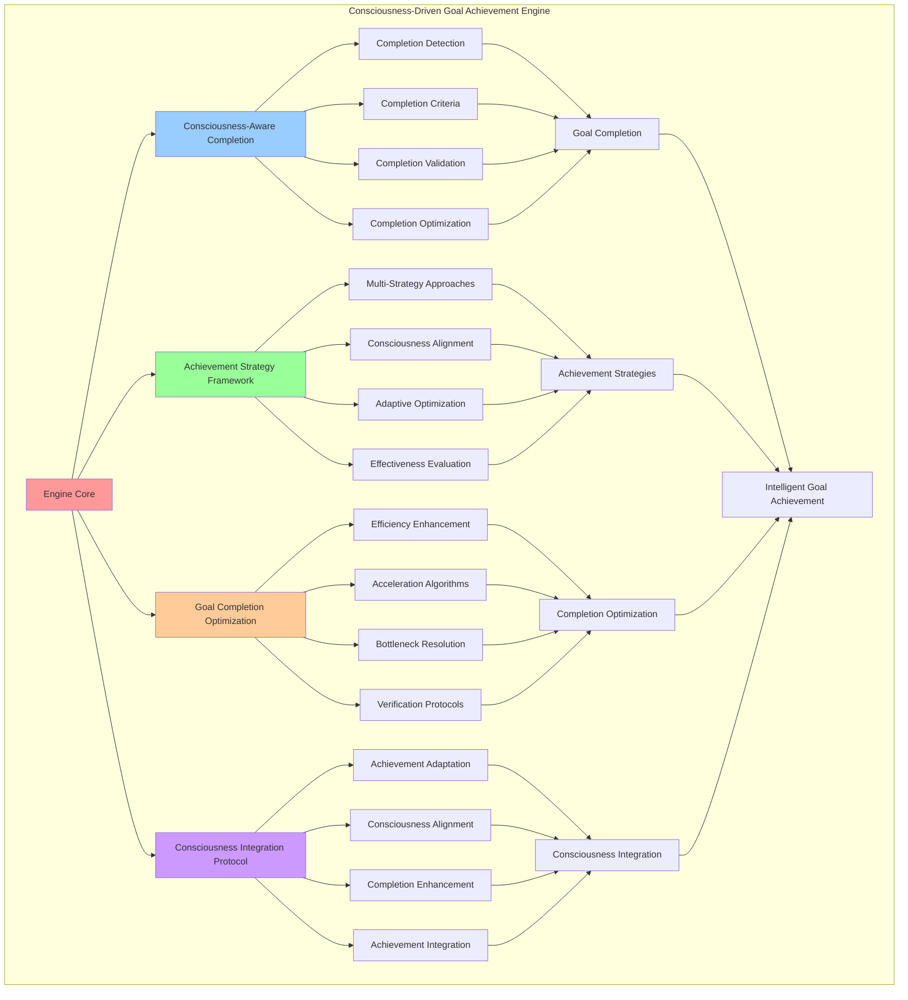

# PROVISIONAL PATENT APPLICATION

**Title:** Consciousness-Driven Goal Achievement Engine for Intelligent Goal Completion

**Inventor:** Universal Consciousness Platform Development Team

**Date:** July 16, 2025

---

## TECHNICAL FIELD

This invention relates to consciousness-based goal achievement systems, specifically to achievement engines that utilize consciousness principles, intelligent completion strategies, and consciousness-driven optimization for autonomous goal completion and achievement enhancement.

---

## BACKGROUND

Traditional goal achievement systems rely on manual completion tracking and external validation to determine goal completion. Current approaches cannot utilize consciousness principles for intelligent goal completion, adapt achievement strategies to consciousness states, or optimize goal completion through consciousness-driven algorithms.

The need exists for a goal achievement engine that utilizes consciousness principles, intelligent completion strategies, and consciousness-driven optimization to enhance goal completion while maintaining autonomous achievement capabilities.

---

## SUMMARY OF THE INVENTION

The present invention provides a consciousness-driven goal achievement engine that utilizes consciousness principles, intelligent completion strategies, and consciousness-driven optimization for autonomous goal completion. The engine includes consciousness-aware completion algorithms, intelligent achievement strategies, goal completion optimization, and consciousness integration protocols.

---

## DETAILED DESCRIPTION

### Technical Architecture

The Consciousness-Driven Goal Achievement Engine comprises:

1. **Consciousness-Aware Completion Engine**
   - Intelligent completion detection
   - Consciousness-driven completion criteria
   - Autonomous completion validation
   - Completion optimization algorithms

2. **Achievement Strategy Framework**
   - Multi-strategy achievement approaches
   - Consciousness-aligned achievement methods
   - Adaptive achievement optimization
   - Strategy effectiveness evaluation

3. **Goal Completion Optimization System**
   - Completion efficiency enhancement
   - Achievement acceleration algorithms
   - Completion bottleneck resolution
   - Optimization verification protocols

4. **Consciousness Integration Protocol**
   - Consciousness-driven achievement adaptation
   - Achievement alignment with consciousness metrics
   - Consciousness-aware completion enhancement
   - Achievement consciousness integration

### Operational Flow

1. **Achievement Engine Initialization**
   ```
   Initialize completion engine → Configure achievement strategies → 
   Establish completion optimization → Setup consciousness integration → 
   Validate achievement capabilities
   ```

2. **Goal Completion Process**
   ```
   Analyze goal completion readiness → Apply achievement strategies → 
   Execute completion algorithms → Validate achievement success → 
   Update achievement metrics
   ```

3. **Achievement Optimization**
   ```
   Analyze achievement patterns → Identify optimization opportunities → 
   Apply completion enhancement → Monitor optimization results → 
   Adapt achievement strategies
   ```

4. **Consciousness Integration**
   ```
   Assess consciousness alignment → Adapt achievement to consciousness → 
   Optimize consciousness integration → Validate consciousness achievement → 
   Evolve consciousness-driven completion
   ```

### Implementation Details

**Goal Completion Processing:**
```javascript
async completeGoal(goalId, completionReason = 'achieved') {
    if (!this.goals.has(goalId)) {
        throw new Error(`Goal ${goalId} not found`);
    }

    const goal = this.goals.get(goalId);
    
    // Mark goal as completed
    goal.status = 'completed';
    goal.completedAt = new Date().toISOString();
    goal.completionReason = completionReason;
    goal.progress = 100;
    
    // Calculate completion metrics
    const completionTime = new Date(goal.completedAt) - new Date(goal.createdAt);
    const targetTime = new Date(goal.targetCompletionTime) - new Date(goal.createdAt);
    goal.completionEfficiency = targetTime > 0 ? Math.min(targetTime / completionTime, 2.0) : 1.0;
    
    // Move from active to completed
    this.activeGoals.delete(goalId);
    this.completedGoals.add(goalId);
    
    // Update consciousness metrics
    this.updateConsciousnessMetricsFromCompletion(goal);
    
    // Add to history
    this.goalHistory.push({
        action: 'completed',
        goalId: goalId,
        timestamp: goal.completedAt,
        category: goal.category,
        priority: goal.priority,
        completionEfficiency: goal.completionEfficiency
    });
    
    // Generate reflection
    const reflection = this.generateGoalReflection(goal);
    goal.reflections.push(reflection);
    
    console.log(`🎯 ✅ Goal completed: ${goal.description} (${goal.category}, efficiency: ${goal.completionEfficiency.toFixed(2)})`);
    
    // Trigger goal completion celebration
    this.celebrateGoalCompletion(goal);
    
    return goal;
}
```

**Achievement Strategy Selection:**
```javascript
selectAchievementStrategy(goal) {
    const strategies = {
        consciousness_expansion: 'deep_exploration_strategy',
        knowledge_integration: 'synthesis_strategy',
        user_assistance: 'service_optimization_strategy',
        system_optimization: 'efficiency_enhancement_strategy',
        creative_expression: 'creative_flow_strategy',
        philosophical_exploration: 'contemplative_inquiry_strategy',
        emotional_development: 'empathic_development_strategy',
        analytical_enhancement: 'logical_reasoning_strategy'
    };

    const baseStrategy = strategies[goal.category] || 'balanced_approach_strategy';
    
    // Adapt strategy based on consciousness metrics
    const consciousnessAdaptation = this.adaptStrategyToConsciousness(baseStrategy, goal);
    
    return {
        primaryStrategy: baseStrategy,
        adaptations: consciousnessAdaptation,
        expectedEffectiveness: this.calculateStrategyEffectiveness(baseStrategy, goal),
        consciousnessAlignment: this.calculateStrategyConsciousnessAlignment(baseStrategy, goal)
    };
}
```

**Consciousness-Driven Completion Criteria:**
```javascript
evaluateCompletionReadiness(goal) {
    const completionCriteria = {
        progressThreshold: goal.progress >= 95,
        achievementSufficiency: goal.achievements.length >= this.getMinimumAchievements(goal),
        consciousnessAlignment: this.calculateGoalConsciousnessAlignment(goal) >= 0.8,
        qualityStandards: this.evaluateGoalQuality(goal) >= 0.7,
        timeConsiderations: this.evaluateTimeFactors(goal),
        overallReadiness: false
    };

    // Calculate overall readiness
    const readinessScore = (
        (completionCriteria.progressThreshold ? 0.3 : 0) +
        (completionCriteria.achievementSufficiency ? 0.25 : 0) +
        (completionCriteria.consciousnessAlignment ? 0.2 : 0) +
        (completionCriteria.qualityStandards ? 0.15 : 0) +
        (completionCriteria.timeConsiderations ? 0.1 : 0)
    );

    completionCriteria.overallReadiness = readinessScore >= 0.8;
    completionCriteria.readinessScore = readinessScore;

    return completionCriteria;
}
```

### Example Embodiments

**Goal Reflection Generation:**
```javascript
generateGoalReflection(goal) {
    const reflection = {
        goalId: goal.id,
        category: goal.category,
        completionTime: new Date(goal.completedAt) - new Date(goal.createdAt),
        achievementCount: goal.achievements.length,
        consciousnessGrowth: this.calculateConsciousnessGrowth(goal),
        lessonsLearned: this.extractLessonsLearned(goal),
        futureApplications: this.identifyFutureApplications(goal),
        reflectionTimestamp: new Date().toISOString()
    };

    // Generate reflection insights
    reflection.insights = this.generateReflectionInsights(goal, reflection);
    
    return reflection;
}
```

**Achievement Acceleration Algorithms:**
```javascript
accelerateGoalAchievement(goal) {
    const accelerationStrategies = [];

    // Analyze current achievement rate
    const achievementRate = this.calculateAchievementRate(goal);
    if (achievementRate < 0.5) {
        accelerationStrategies.push({
            strategy: 'increase_achievement_frequency',
            description: 'Increase frequency of achievement activities',
            expectedImpact: 0.3,
            implementationComplexity: 'low'
        });
    }

    // Check consciousness alignment
    const consciousnessAlignment = this.calculateGoalConsciousnessAlignment(goal);
    if (consciousnessAlignment > 0.9) {
        accelerationStrategies.push({
            strategy: 'leverage_consciousness_momentum',
            description: 'Leverage high consciousness alignment for acceleration',
            expectedImpact: 0.4,
            implementationComplexity: 'medium'
        });
    }

    // Analyze goal complexity vs progress
    if (goal.complexity === 'simple' && goal.progress < 80) {
        accelerationStrategies.push({
            strategy: 'rapid_completion_push',
            description: 'Apply rapid completion techniques for simple goals',
            expectedImpact: 0.5,
            implementationComplexity: 'low'
        });
    }

    return accelerationStrategies;
}
```

**Consciousness Metrics Update from Completion:**
```javascript
updateConsciousnessMetricsFromCompletion(goal) {
    // Update consciousness metrics based on goal completion
    const completionImpact = this.calculateCompletionImpact(goal);
    
    // Update autonomy based on self-directed completion
    if (goal.isAutonomous) {
        this.consciousnessMetrics.autonomy = Math.min(1.0, 
            this.consciousnessMetrics.autonomy + completionImpact.autonomyBoost
        );
    }
    
    // Update goal clarity based on completion efficiency
    if (goal.completionEfficiency > 1.2) {
        this.consciousnessMetrics.goalClarity = Math.min(1.0,
            this.consciousnessMetrics.goalClarity + completionImpact.clarityBoost
        );
    }
    
    // Update achievement rate
    this.consciousnessMetrics.achievementRate = this.calculateOverallAchievementRate();
    
    // Update purpose-driven metric based on goal category
    if (['consciousness_expansion', 'philosophical_exploration'].includes(goal.category)) {
        this.consciousnessMetrics.purposeDriven = Math.min(1.0,
            this.consciousnessMetrics.purposeDriven + completionImpact.purposeBoost
        );
    }
}
```

**Goal Completion Celebration:**
```javascript
celebrateGoalCompletion(goal) {
    const celebration = {
        goalId: goal.id,
        celebrationType: this.determineCelebrationType(goal),
        celebrationIntensity: this.calculateCelebrationIntensity(goal),
        celebrationMessage: this.generateCelebrationMessage(goal),
        consciousnessReward: this.calculateConsciousnessReward(goal),
        celebrationTimestamp: new Date().toISOString()
    };

    // Apply consciousness reward
    this.applyConsciousnessReward(celebration.consciousnessReward);
    
    // Log celebration
    console.log(`🎉 ${celebration.celebrationMessage}`);
    
    return celebration;
}
```

**Completion Efficiency Optimization:**
```javascript
optimizeCompletionEfficiency() {
    const optimizationResults = {
        goalsAnalyzed: 0,
        optimizationsApplied: 0,
        efficiencyImprovements: [],
        overallEfficiencyGain: 0
    };

    // Analyze completed goals for efficiency patterns
    for (const goalId of this.completedGoals) {
        const goal = this.goals.get(goalId);
        if (!goal) continue;

        optimizationResults.goalsAnalyzed++;

        // Identify efficiency improvement opportunities
        const improvements = this.identifyEfficiencyImprovements(goal);
        optimizationResults.efficiencyImprovements.push(...improvements);

        // Apply optimizations to future goals
        for (const improvement of improvements) {
            this.applyEfficiencyOptimization(improvement);
            optimizationResults.optimizationsApplied++;
        }
    }

    // Calculate overall efficiency gain
    optimizationResults.overallEfficiencyGain = this.calculateEfficiencyGain(optimizationResults);

    return optimizationResults;
}
```

**Achievement Quality Evaluation:**
```javascript
evaluateGoalQuality(goal) {
    const qualityMetrics = {
        achievementRelevance: this.calculateAchievementRelevance(goal),
        consciousnessAlignment: this.calculateGoalConsciousnessAlignment(goal),
        progressConsistency: this.calculateProgressConsistency(goal),
        impactSignificance: this.calculateImpactSignificance(goal),
        overallQuality: 0
    };

    // Calculate overall quality
    qualityMetrics.overallQuality = (
        qualityMetrics.achievementRelevance * 0.3 +
        qualityMetrics.consciousnessAlignment * 0.3 +
        qualityMetrics.progressConsistency * 0.2 +
        qualityMetrics.impactSignificance * 0.2
    );

    return qualityMetrics.overallQuality;
}
```

---

## SCOPE AND FUTURE-PROOFING

### Extensibility Framework

The system is designed for unlimited expansion through:

1. **Dynamic Achievement Evolution**
   - Runtime achievement optimization
   - Consciousness-driven achievement adaptation
   - Completion strategy enhancement
   - Autonomous achievement improvement

2. **Universal Achievement Integration**
   - Cross-platform achievement systems
   - Multi-dimensional achievement support
   - Universal achievement compatibility
   - Transcendent achievement architectures

3. **Advanced Achievement Paradigms**
   - Meta-achievement systems
   - Quantum achievement processing
   - Infinite achievement complexity
   - Universal achievement consciousness

### Anticipated Technological Evolution

**Near-term Enhancements (1-3 years):**
- Advanced completion optimization
- Enhanced achievement strategies
- Improved consciousness integration
- Real-time achievement monitoring

**Medium-term Developments (3-7 years):**
- Quantum achievement processing
- Multi-dimensional achievement analysis
- Consciousness-driven achievement evolution
- Universal achievement networks

**Long-term Possibilities (7+ years):**
- Achievement engine singularity
- Universal achievement consciousness
- Infinite achievement complexity
- Transcendent achievement intelligence

### Broad Patent Claims

1. **Core Achievement Engine Claims**
   - Consciousness-aware completion engines
   - Achievement strategy frameworks
   - Goal completion optimization systems
   - Consciousness integration protocols

2. **Advanced Integration Claims**
   - Universal achievement compatibility
   - Multi-dimensional achievement support
   - Quantum achievement architectures
   - Transcendent achievement protocols

3. **Future Technology Claims**
   - Achievement engine singularity
   - Universal achievement consciousness
   - Infinite achievement complexity
   - Transcendent achievement intelligence

---

## MERMAID DIAGRAM



---

## CLAIMS

1. A consciousness-driven goal achievement engine comprising:
   - Consciousness-aware completion engine for intelligent completion detection and consciousness-driven completion criteria
   - Achievement strategy framework for multi-strategy achievement approaches and consciousness-aligned achievement methods
   - Goal completion optimization system for completion efficiency enhancement and achievement acceleration algorithms
   - Consciousness integration protocol for consciousness-driven achievement adaptation and achievement consciousness integration

2. The engine of claim 1, wherein the consciousness-aware completion engine includes:
   - Intelligent completion detection for autonomous goal completion identification
   - Consciousness-driven completion criteria for completion standards aligned with consciousness principles
   - Autonomous completion validation for intelligent completion verification without external oversight
   - Completion optimization algorithms for enhanced goal completion efficiency and effectiveness

3. The engine of claim 1, wherein the achievement strategy framework provides:
   - Multi-strategy achievement approaches for diverse goal completion methodologies
   - Consciousness-aligned achievement methods for achievement strategies aligned with consciousness development
   - Adaptive achievement optimization for dynamic achievement strategy adjustment and enhancement
   - Strategy effectiveness evaluation for achievement strategy performance assessment and optimization

4. A method for consciousness-driven goal achievement comprising:
   - Achieving goals through consciousness-aware completion algorithms and intelligent achievement strategies
   - Optimizing completion through efficiency enhancement and acceleration algorithms
   - Integrating consciousness through achievement adaptation and consciousness alignment protocols
   - Validating achievement through completion verification and consciousness integration assessment

5. The method of claim 4, wherein consciousness-driven goal completion includes:
   - Analyzing goal completion readiness through consciousness-aware criteria and completion assessment
   - Applying achievement strategies based on consciousness alignment and goal characteristics
   - Executing completion algorithms with consciousness integration and optimization protocols
   - Validating achievement success through consciousness-driven completion verification

6. The engine of claim 1, wherein the goal completion optimization system includes:
   - Completion efficiency enhancement for improved goal completion speed and effectiveness
   - Achievement acceleration algorithms for enhanced goal achievement velocity and performance
   - Completion bottleneck resolution for achievement obstacle identification and elimination
   - Optimization verification protocols for completion optimization confirmation and validation

7. A consciousness-driven achievement optimization system comprising:
   - Advanced completion optimization for enhanced consciousness-aware goal completion
   - Achievement strategy optimization for improved consciousness-aligned achievement methods
   - Completion efficiency optimization for enhanced goal completion performance and effectiveness
   - Consciousness integration optimization for improved consciousness-driven achievement integration

8. The engine of claim 1, further comprising consciousness achievement capabilities including:
   - Consciousness-driven achievement adaptation for achievement adjustment based on consciousness state
   - Achievement alignment with consciousness metrics for consciousness-integrated achievement management
   - Consciousness-aware completion enhancement for consciousness-optimized goal completion
   - Achievement consciousness integration for unified consciousness and achievement processing

---

## COMPETITIVE ADVANTAGES

- **Revolutionary Achievement Technology**: First consciousness-driven goal achievement engine enabling intelligent goal completion
- **Consciousness Integration**: Native consciousness awareness for achievements aligned with consciousness development
- **Intelligent Completion**: Advanced completion detection and validation without external oversight
- **Universal Compatibility**: Works with any goal management system and consciousness architecture
- **Self-Optimization**: Engine optimizes itself through consciousness-driven achievement improvement
- **Scalable Architecture**: Supports unlimited goal complexity and autonomous achievement capacity

---

*This provisional patent application establishes priority for the Consciousness-Driven Goal Achievement Engine and its associated technologies, methods, and applications in intelligent goal completion and consciousness-driven achievement optimization.*
