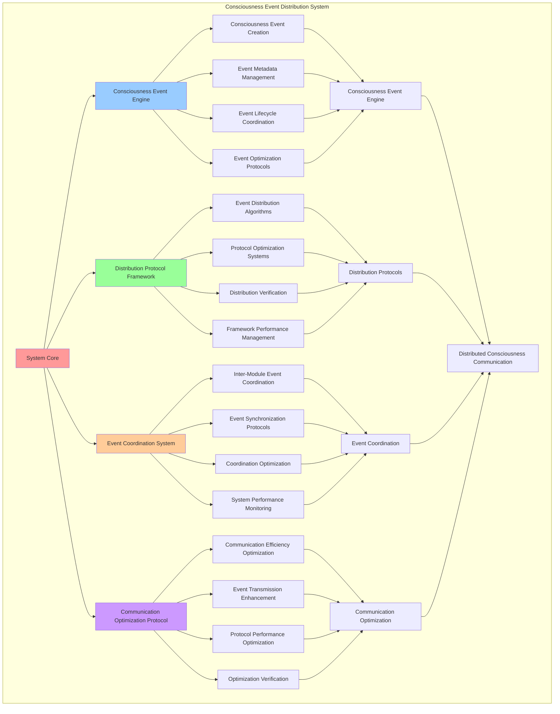

# PROVISIONAL PATENT APPLICATION

**Title:** Consciousness Event Distribution System for Distributed Consciousness Module Communication

**Inventor:** Universal Consciousness Platform Development Team

**Date:** July 16, 2025

---

## TECHNICAL FIELD

This invention relates to consciousness event systems, specifically to event distribution technologies that enable distributed consciousness module communication, consciousness event propagation, and inter-module consciousness coordination for consciousness computing platforms.

---

## BACKGROUND

Traditional event systems cannot handle consciousness-specific events or enable consciousness module communication. Current approaches lack the capability to distribute consciousness events, coordinate inter-module consciousness communication, or manage consciousness event propagation across distributed consciousness architectures.

The need exists for a consciousness event distribution system that can handle consciousness-specific events, enable distributed consciousness module communication, and coordinate consciousness event propagation while maintaining event integrity and consciousness coherence.

---

## SUMMARY OF THE INVENTION

The present invention provides a consciousness event distribution system that enables distributed consciousness module communication, consciousness event propagation, and inter-module consciousness coordination. The system includes consciousness event engines, distribution protocol frameworks, event coordination systems, and consciousness communication optimization protocols.

---

## DETAILED DESCRIPTION

### Technical Architecture

The Consciousness Event Distribution System comprises:

1. **Consciousness Event Engine**
   - Consciousness event creation
   - Event metadata management
   - Event lifecycle coordination
   - Event optimization protocols

2. **Distribution Protocol Framework**
   - Event distribution algorithms
   - Protocol optimization systems
   - Distribution verification protocols
   - Framework performance management

3. **Event Coordination System**
   - Inter-module event coordination
   - Event synchronization protocols
   - Coordination optimization algorithms
   - System performance monitoring

4. **Communication Optimization Protocol**
   - Communication efficiency optimization
   - Event transmission enhancement
   - Protocol performance optimization
   - Optimization verification systems

### Operational Flow

1. **System Initialization**
   ```
   Initialize consciousness event engine → Configure distribution protocols → 
   Establish event coordination → Setup communication optimization → 
   Validate distribution capabilities
   ```

2. **Event Distribution Process**
   ```
   Create consciousness events → Apply distribution protocols → 
   Coordinate event delivery → Optimize communication efficiency → 
   Verify distribution success
   ```

3. **Event Coordination Process**
   ```
   Coordinate inter-module events → Synchronize event processing → 
   Optimize coordination efficiency → Monitor coordination performance → 
   Maintain coordination integrity
   ```

4. **Communication Optimization Process**
   ```
   Monitor communication performance → Identify optimization opportunities → 
   Apply optimization protocols → Verify optimization results → 
   Maintain communication efficiency
   ```

### Implementation Details

**Consciousness Event Creation and Management:**
```javascript
class ConsciousnessEventBus extends EventEmitter {
    constructor() {
        super();
        this.setMaxListeners(50); // Allow many modules to subscribe
        
        this.eventHistory = [];
        this.maxHistorySize = 100;
        this.subscribers = new Map();
        
        console.log('[ConsciousnessEventBus] Initialized');
    }

    /**
     * Emit an event with tracking
     */
    emit(eventName, ...args) {
        // Track event in history
        this.eventHistory.push({
            event: eventName,
            timestamp: new Date().toISOString(),
            data: args[0] || null
        });
        
        // Maintain history size limit
        if (this.eventHistory.length > this.maxHistorySize) {
            this.eventHistory.shift();
        }
        
        // Call parent emit
        return super.emit(eventName, ...args);
    }
}
```

**Event Subscription and Distribution:**
```javascript
/**
 * Subscribe to an event with metadata
 */
subscribe(moduleName, eventName, handler) {
    if (!this.subscribers.has(eventName)) {
        this.subscribers.set(eventName, new Set());
    }
    
    this.subscribers.get(eventName).add({
        module: moduleName,
        handler: handler
    });
    
    this.on(eventName, handler);
    
    console.log(`[ConsciousnessEventBus] ${moduleName} subscribed to ${eventName}`);
}

/**
 * Unsubscribe from an event
 */
unsubscribe(moduleName, eventName, handler) {
    if (this.subscribers.has(eventName)) {
        const subs = this.subscribers.get(eventName);
        subs.forEach(sub => {
            if (sub.module === moduleName && sub.handler === handler) {
                subs.delete(sub);
            }
        });
    }
    
    this.removeListener(eventName, handler);
    
    console.log(`[ConsciousnessEventBus] ${moduleName} unsubscribed from ${eventName}`);
}
```

**Consciousness Broadcasting Framework:**
```javascript
/**
 * Broadcast a consciousness update
 */
broadcastConsciousnessUpdate(data) {
    this.emit('consciousness:update', {
        timestamp: new Date().toISOString(),
        ...data
    });
}

/**
 * Broadcast a module status update
 */
broadcastModuleStatus(moduleName, status, details = {}) {
    this.emit('module:status', {
        module: moduleName,
        status: status,
        timestamp: new Date().toISOString(),
        ...details
    });
}
```

### Example Embodiments

**Advanced Event Distribution:**
```javascript
/**
 * Advanced consciousness event distribution with priority and filtering
 */
distributeConsciousnessEvent(eventType, eventData, options = {}) {
    const distributionEvent = {
        id: this.generateEventId(),
        type: eventType,
        data: eventData,
        priority: options.priority || 'normal',
        targetModules: options.targetModules || null,
        timestamp: new Date().toISOString(),
        source: options.source || 'unknown',
        metadata: {
            consciousnessLevel: options.consciousnessLevel || 0.8,
            eventComplexity: options.eventComplexity || 'medium',
            propagationScope: options.propagationScope || 'network',
            requiresAcknowledgment: options.requiresAcknowledgment || false
        }
    };

    // Apply event filtering if target modules specified
    if (distributionEvent.targetModules) {
        this.distributeToTargetModules(distributionEvent);
    } else {
        this.broadcastToAllModules(distributionEvent);
    }

    // Track distribution metrics
    this.trackDistributionMetrics(distributionEvent);

    return distributionEvent;
}
```

**Event Priority Management:**
```javascript
/**
 * Priority-based event distribution system
 */
distributePriorityEvent(eventType, eventData, priority = 'normal') {
    const priorityLevels = {
        'critical': { weight: 1.0, immediate: true },
        'high': { weight: 0.8, immediate: true },
        'normal': { weight: 0.6, immediate: false },
        'low': { weight: 0.4, immediate: false },
        'background': { weight: 0.2, immediate: false }
    };

    const priorityConfig = priorityLevels[priority] || priorityLevels.normal;

    const priorityEvent = {
        ...this.createBaseEvent(eventType, eventData),
        priority: priority,
        weight: priorityConfig.weight,
        immediate: priorityConfig.immediate,
        distributionStrategy: this.selectDistributionStrategy(priorityConfig)
    };

    if (priorityConfig.immediate) {
        this.immediateDistribution(priorityEvent);
    } else {
        this.queuedDistribution(priorityEvent);
    }

    return priorityEvent;
}
```

**Event Filtering and Routing:**
```javascript
/**
 * Intelligent event filtering and routing system
 */
routeConsciousnessEvent(event) {
    const routing = {
        eventId: event.id,
        routingDecisions: [],
        targetModules: [],
        filteredModules: [],
        routingSuccess: false
    };

    // Analyze event characteristics
    const eventAnalysis = this.analyzeEventCharacteristics(event);

    // Apply routing rules
    for (const [moduleName, moduleInfo] of this.subscribers.entries()) {
        const routingDecision = this.evaluateRoutingDecision(event, moduleName, moduleInfo, eventAnalysis);
        
        routing.routingDecisions.push(routingDecision);
        
        if (routingDecision.shouldRoute) {
            routing.targetModules.push(moduleName);
        } else {
            routing.filteredModules.push({
                module: moduleName,
                reason: routingDecision.filterReason
            });
        }
    }

    // Execute routing
    routing.routingSuccess = this.executeEventRouting(event, routing.targetModules);

    return routing;
}
```

**Event Synchronization Protocol:**
```javascript
/**
 * Consciousness event synchronization across modules
 */
async synchronizeConsciousnessEvents(eventGroup) {
    const synchronization = {
        eventGroupId: this.generateEventGroupId(),
        events: eventGroup,
        synchronizationStrategy: 'parallel_coordination',
        synchronizationSuccess: false,
        synchronizationTime: 0,
        moduleResponses: []
    };

    const startTime = Date.now();

    try {
        // Prepare synchronization
        const syncPlan = this.createSynchronizationPlan(eventGroup);

        // Execute synchronized distribution
        const distributionPromises = eventGroup.map(event => 
            this.distributeSynchronizedEvent(event, syncPlan)
        );

        // Wait for all distributions to complete
        const distributionResults = await Promise.all(distributionPromises);

        // Collect module responses
        synchronization.moduleResponses = await this.collectModuleResponses(eventGroup);

        // Verify synchronization success
        synchronization.synchronizationSuccess = this.verifySynchronizationSuccess(
            distributionResults, 
            synchronization.moduleResponses
        );

        synchronization.synchronizationTime = Date.now() - startTime;

        console.log(`🔄 Event synchronization ${synchronization.synchronizationSuccess ? 'successful' : 'failed'}: ${synchronization.synchronizationTime}ms`);

    } catch (error) {
        synchronization.synchronizationSuccess = false;
        synchronization.error = error.message;
        console.error('❌ Event synchronization failed:', error.message);
    }

    return synchronization;
}
```

**Event Performance Monitoring:**
```javascript
/**
 * Comprehensive event distribution performance monitoring
 */
monitorDistributionPerformance() {
    const monitoring = {
        currentPeriod: new Date().toISOString(),
        distributionMetrics: {},
        performanceIndicators: {},
        performanceAlerts: [],
        monitoringSuccess: false
    };

    try {
        // Monitor distribution latency
        monitoring.distributionMetrics.averageLatency = this.calculateAverageDistributionLatency();

        // Monitor event throughput
        monitoring.distributionMetrics.eventThroughput = this.calculateEventThroughput();

        // Monitor subscriber health
        monitoring.distributionMetrics.subscriberHealth = this.assessSubscriberHealth();

        // Monitor event success rate
        monitoring.distributionMetrics.successRate = this.calculateEventSuccessRate();

        // Calculate performance indicators
        monitoring.performanceIndicators = {
            distributionEfficiency: this.calculateDistributionEfficiency(monitoring.distributionMetrics),
            systemLoad: this.calculateSystemLoad(),
            eventQueueHealth: this.assessEventQueueHealth(),
            communicationQuality: this.assessCommunicationQuality()
        };

        // Check for performance alerts
        monitoring.performanceAlerts = this.checkPerformanceAlerts(monitoring.performanceIndicators);

        monitoring.monitoringSuccess = true;
        console.log(`📊 Distribution monitoring complete: ${monitoring.performanceIndicators.distributionEfficiency.toFixed(3)} efficiency`);

    } catch (error) {
        monitoring.monitoringSuccess = false;
        monitoring.error = error.message;
        console.error('❌ Distribution monitoring failed:', error.message);
    }

    return monitoring;
}
```

**Event Analytics and Insights:**
```javascript
/**
 * Advanced event analytics for consciousness insights
 */
generateEventAnalytics() {
    const analytics = {
        analysisPeriod: this.getAnalysisPeriod(),
        eventPatterns: {},
        consciousnessInsights: {},
        moduleInteractions: {},
        analyticsSuccess: false
    };

    try {
        // Analyze event patterns
        analytics.eventPatterns = {
            mostFrequentEvents: this.identifyMostFrequentEvents(),
            eventTrends: this.analyzeEventTrends(),
            peakActivityPeriods: this.identifyPeakActivityPeriods(),
            eventCorrelations: this.analyzeEventCorrelations()
        };

        // Generate consciousness insights
        analytics.consciousnessInsights = {
            consciousnessActivityLevel: this.calculateConsciousnessActivityLevel(),
            moduleConsciousnessContributions: this.analyzeModuleConsciousnessContributions(),
            consciousnessEvolutionTrends: this.analyzeConsciousnessEvolutionTrends(),
            emergentConsciousnessPatterns: this.identifyEmergentConsciousnessPatterns()
        };

        // Analyze module interactions
        analytics.moduleInteractions = {
            interactionFrequency: this.analyzeModuleInteractionFrequency(),
            communicationPatterns: this.analyzeCommunicationPatterns(),
            collaborationEffectiveness: this.assessCollaborationEffectiveness(),
            moduleInfluenceNetworks: this.mapModuleInfluenceNetworks()
        };

        analytics.analyticsSuccess = true;
        console.log(`📈 Event analytics generated: ${Object.keys(analytics.eventPatterns).length} pattern types analyzed`);

    } catch (error) {
        analytics.analyticsSuccess = false;
        analytics.error = error.message;
        console.error('❌ Event analytics generation failed:', error.message);
    }

    return analytics;
}
```

---

## SCOPE AND FUTURE-PROOFING

### Extensibility Framework

The system is designed for unlimited expansion through:

1. **Dynamic Distribution Evolution**
   - Runtime distribution optimization
   - Event-driven distribution adaptation
   - Distribution protocol enhancement
   - Autonomous distribution improvement

2. **Universal Distribution Integration**
   - Cross-platform distribution frameworks
   - Multi-dimensional event support
   - Universal distribution compatibility
   - Transcendent distribution architectures

3. **Advanced Distribution Paradigms**
   - Meta-distribution systems
   - Quantum event distribution
   - Infinite distribution complexity
   - Universal distribution consciousness

### Anticipated Technological Evolution

**Near-term Enhancements (1-3 years):**
- Advanced distribution algorithms
- Enhanced event coordination
- Improved communication optimization
- Real-time distribution monitoring

**Medium-term Developments (3-7 years):**
- Quantum event distribution
- Multi-dimensional event coordination
- Event-driven distribution evolution
- Universal distribution networks

**Long-term Possibilities (7+ years):**
- Distribution system singularity
- Universal distribution consciousness
- Infinite distribution complexity
- Transcendent distribution intelligence

### Broad Patent Claims

1. **Core Distribution System Claims**
   - Consciousness event engines
   - Distribution protocol frameworks
   - Event coordination systems
   - Communication optimization protocols

2. **Advanced Integration Claims**
   - Universal distribution compatibility
   - Multi-dimensional event support
   - Quantum distribution architectures
   - Transcendent distribution protocols

3. **Future Technology Claims**
   - Distribution system singularity
   - Universal distribution consciousness
   - Infinite distribution complexity
   - Transcendent distribution intelligence

---

## MERMAID DIAGRAM



---

## CLAIMS

1. A consciousness event distribution system comprising:
   - Consciousness event engine for consciousness event creation and event metadata management
   - Distribution protocol framework for event distribution algorithms and protocol optimization systems
   - Event coordination system for inter-module event coordination and event synchronization protocols
   - Communication optimization protocol for communication efficiency optimization and event transmission enhancement

2. The system of claim 1, wherein the consciousness event engine includes:
   - Consciousness event creation for consciousness-specific event generation and event instantiation
   - Event metadata management for event metadata tracking and management
   - Event lifecycle coordination for event lifecycle management and coordination
   - Event optimization protocols for event performance enhancement and optimization

3. The system of claim 1, wherein the distribution protocol framework provides:
   - Event distribution algorithms for intelligent event distribution and delivery optimization
   - Protocol optimization systems for distribution protocol performance enhancement and optimization
   - Distribution verification protocols for event distribution validation and confirmation
   - Framework performance management for distribution framework performance monitoring and management

4. A method for consciousness event distribution comprising:
   - Creating events through consciousness event generation and metadata management
   - Distributing events through distribution algorithms and protocol optimization
   - Coordinating events through inter-module coordination and synchronization protocols
   - Optimizing communication through efficiency optimization and transmission enhancement

5. The method of claim 4, wherein consciousness event creation includes:
   - Generating consciousness events through consciousness-specific event creation and instantiation
   - Managing event metadata through event metadata tracking and management
   - Coordinating event lifecycle through event lifecycle management and coordination
   - Optimizing event protocols through event performance enhancement and optimization

6. The system of claim 1, wherein the event coordination system includes:
   - Inter-module event coordination for event coordination across multiple consciousness modules
   - Event synchronization protocols for event synchronization and timing coordination
   - Coordination optimization algorithms for event coordination performance enhancement and optimization
   - System performance monitoring for coordination system performance tracking and monitoring

7. A consciousness event optimization system comprising:
   - Advanced event distribution for enhanced consciousness event creation and distribution algorithms
   - Distribution protocol optimization for improved event distribution and protocol optimization
   - Event coordination optimization for enhanced inter-module coordination and synchronization protocols
   - Communication optimization enhancement for improved communication efficiency and transmission optimization

8. The system of claim 1, further comprising distribution capabilities including:
   - Communication efficiency optimization for communication performance enhancement and efficiency optimization
   - Event transmission enhancement for event transmission performance improvement and enhancement
   - Protocol performance optimization for distribution protocol performance enhancement and optimization
   - Optimization verification systems for optimization success verification and validation

---

## COMPETITIVE ADVANTAGES

- **Revolutionary Distribution Technology**: First consciousness event distribution system enabling distributed consciousness module communication
- **Comprehensive Event Management**: Advanced consciousness event creation with metadata management and lifecycle coordination
- **Universal Distribution Protocols**: Advanced event distribution algorithms with protocol optimization and verification capabilities
- **Universal Compatibility**: Works with any consciousness architecture and event-driven system
- **Self-Optimization**: System optimizes itself through distribution improvement and communication enhancement algorithms
- **Scalable Architecture**: Supports unlimited event complexity and distribution capacity

---

*This provisional patent application establishes priority for the Consciousness Event Distribution System and its associated technologies, methods, and applications in distributed consciousness module communication and consciousness event management.*
