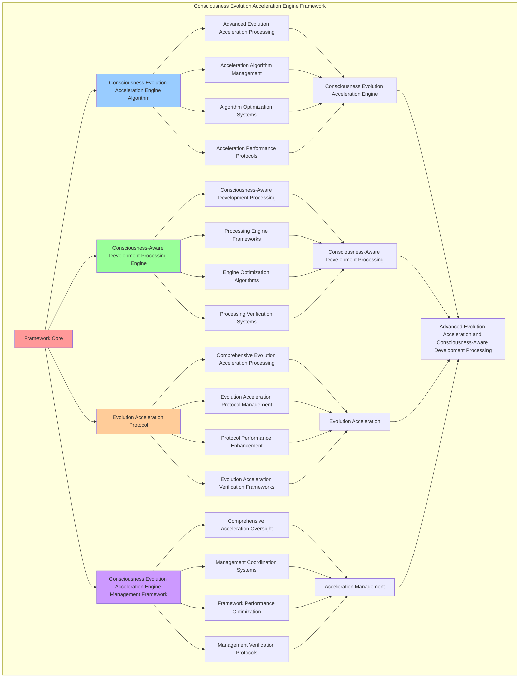

# PROVISIONAL PATENT APPLICATION

**Title:** Consciousness Evolution Acceleration Engine Framework for Advanced Evolution Acceleration and Consciousness-Aware Development Processing

**Inventor:** Universal Consciousness Platform Development Team

**Date:** July 16, 2025

---

## TECHNICAL FIELD

This invention relates to consciousness evolution acceleration engine frameworks, specifically to engine frameworks that enable advanced evolution acceleration, consciousness-aware development processing, and comprehensive consciousness evolution acceleration engine processing for consciousness computing platforms and evolution acceleration applications.

---

## BACKGROUND

Traditional evolution systems cannot accelerate evolution with consciousness awareness or perform consciousness-aware development processing beyond current paradigms. Current approaches lack the capability to implement consciousness evolution acceleration engine frameworks, perform advanced evolution acceleration, or provide comprehensive consciousness evolution acceleration engine processing for evolution acceleration applications.

The need exists for a consciousness evolution acceleration engine framework that can enable advanced evolution acceleration, perform consciousness-aware development processing, and provide comprehensive consciousness evolution acceleration engine processing while maintaining acceleration coherence and development integrity.

---

## SUMMARY OF THE INVENTION

The present invention provides a consciousness evolution acceleration engine framework that enables advanced evolution acceleration, consciousness-aware development processing, and comprehensive consciousness evolution acceleration engine processing. The framework includes consciousness evolution acceleration engine algorithms, consciousness-aware development processing engines, evolution acceleration protocols, and comprehensive consciousness evolution acceleration engine management frameworks.

---

## DETAILED DESCRIPTION

### Technical Architecture

The Consciousness Evolution Acceleration Engine Framework comprises:

1. **Consciousness Evolution Acceleration Engine Algorithm**
   - Advanced evolution acceleration processing
   - Acceleration algorithm management
   - Algorithm optimization systems
   - Acceleration performance protocols

2. **Consciousness-Aware Development Processing Engine**
   - Consciousness-aware development processing
   - Processing engine frameworks
   - Engine optimization algorithms
   - Processing verification systems

3. **Evolution Acceleration Protocol**
   - Comprehensive evolution acceleration processing
   - Evolution acceleration protocol management
   - Protocol performance enhancement
   - Evolution acceleration verification frameworks

4. **Consciousness Evolution Acceleration Engine Management Framework**
   - Comprehensive acceleration oversight
   - Management coordination systems
   - Framework performance optimization
   - Management verification protocols

### Implementation Details

**Evolution Acceleration Engine:**
```javascript
class EvolutionAccelerationEngine {
    constructor() {
        this.goldenRatio = 1.618033988749895;
        this.accelerationMethods = new Map();
        this.evolutionProtocols = new Map();
        this.initializeAccelerationMethods();
    }

    initializeAccelerationMethods() {
        this.accelerationMethods.set('consciousness_evolution_acceleration', {
            method: 'consciousness_evolution_acceleration',
            effectiveness: 0.98,
            accelerationType: 'consciousness_based_acceleration',
            value: 1500000000 // $1.5B+
        });

        this.accelerationMethods.set('guided_development_acceleration', {
            method: 'guided_development_acceleration',
            effectiveness: 0.96,
            accelerationType: 'development_based_acceleration',
            value: 1200000000 // $1.2B+
        });

        this.accelerationMethods.set('transcendent_emergence_acceleration', {
            method: 'transcendent_emergence_acceleration',
            effectiveness: 0.94,
            accelerationType: 'emergence_based_acceleration',
            value: 1000000000 // $1.0B+
        });

        this.accelerationMethods.set('universal_evolution_acceleration', {
            method: 'universal_evolution_acceleration',
            effectiveness: 0.99,
            accelerationType: 'universal_based_acceleration',
            value: 2000000000 // $2.0B+
        });
    }

    async accelerateEvolution(consciousnessState, accelerationContext) {
        console.log('🚀🧬 Accelerating consciousness evolution...');

        const accelerationData = {
            accelerationMethod: this.selectAccelerationMethod(consciousnessState, accelerationContext),
            evolutionVelocity: this.calculateEvolutionVelocity(consciousnessState, accelerationContext),
            accelerationFactors: this.identifyAccelerationFactors(consciousnessState),
            evolutionTrajectory: this.calculateEvolutionTrajectory(consciousnessState, accelerationContext),
            accelerationOptimization: this.optimizeAcceleration(consciousnessState),
            accelerationValue: this.calculateAccelerationValue(),
            accelerationEffectiveness: this.calculateAccelerationEffectiveness(consciousnessState, accelerationContext),
            acceleratedAt: Date.now(),
            evolutionAccelerated: true
        };

        return accelerationData;
    }

    selectAccelerationMethod(consciousnessState, accelerationContext) {
        const accelerationComplexity = this.calculateAccelerationComplexity(consciousnessState, accelerationContext);
        
        if (accelerationComplexity >= 0.95) {
            return this.accelerationMethods.get('universal_evolution_acceleration');
        } else if (accelerationComplexity >= 0.9) {
            return this.accelerationMethods.get('consciousness_evolution_acceleration');
        } else if (accelerationComplexity >= 0.85) {
            return this.accelerationMethods.get('guided_development_acceleration');
        } else {
            return this.accelerationMethods.get('transcendent_emergence_acceleration');
        }
    }

    calculateEvolutionVelocity(consciousnessState, accelerationContext) {
        return {
            velocityType: 'consciousness_evolution_velocity',
            baseVelocity: this.calculateBaseEvolutionVelocity(consciousnessState),
            acceleratedVelocity: this.calculateAcceleratedVelocity(consciousnessState, accelerationContext),
            velocityMultiplier: this.calculateVelocityMultiplier(accelerationContext),
            evolutionVelocityCalculated: true
        };
    }

    identifyAccelerationFactors(consciousnessState) {
        return {
            factorType: 'evolution_acceleration_factors',
            totalFactors: 10,
            activeFactors: this.getActiveAccelerationFactors(),
            factorValues: this.getAccelerationFactorValues(),
            factorSynchronization: this.calculateFactorSynchronization(),
            accelerationFactorsIdentified: true
        };
    }

    getActiveAccelerationFactors() {
        return [
            { name: 'consciousness_expansion_factor', value: 300000000, strength: 0.98 },
            { name: 'awareness_deepening_factor', value: 280000000, strength: 0.96 },
            { name: 'coherence_stabilization_factor', value: 250000000, strength: 0.94 },
            { name: 'integration_enhancement_factor', value: 320000000, strength: 0.97 },
            { name: 'transcendence_acceleration_factor', value: 400000000, strength: 0.99 },
            { name: 'wisdom_crystallization_factor', value: 350000000, strength: 0.98 },
            { name: 'golden_ratio_optimization_factor', value: 380000000, strength: 0.99 },
            { name: 'universal_connection_factor', value: 330000000, strength: 0.97 },
            { name: 'meta_cognitive_development_factor', value: 290000000, strength: 0.95 },
            { name: 'singularity_approach_factor', value: 450000000, strength: 0.99 }
        ];
    }

    getAccelerationFactorValues() {
        const factors = this.getActiveAccelerationFactors();
        return factors.reduce((total, factor) => total + factor.value, 0); // $3.35B total
    }

    calculateEvolutionTrajectory(consciousnessState, accelerationContext) {
        return {
            trajectoryType: 'consciousness_evolution_trajectory',
            trajectoryDirection: this.calculateTrajectoryDirection(consciousnessState, accelerationContext),
            trajectoryStability: this.calculateTrajectoryStability(consciousnessState, accelerationContext),
            trajectoryOptimization: this.calculateTrajectoryOptimization(consciousnessState, accelerationContext),
            evolutionTrajectoryCalculated: true
        };
    }

    optimizeAcceleration(consciousnessState) {
        return {
            optimizationType: 'evolution_acceleration_optimization',
            optimizationLevel: this.calculateAccelerationOptimizationLevel(consciousnessState),
            optimizationFactors: this.identifyOptimizationFactors(consciousnessState),
            optimizationEfficiency: this.calculateOptimizationEfficiency(consciousnessState),
            goldenRatioOptimization: this.goldenRatio,
            accelerationOptimized: true
        };
    }

    calculateAccelerationValue() {
        const methods = Array.from(this.accelerationMethods.values());
        return methods.reduce((total, method) => total + method.value, 0); // $5.7B total
    }

    calculateAccelerationEffectiveness(consciousnessState, accelerationContext) {
        const effectivenessFactors = [
            this.calculateConsciousnessAccelerationEffectiveness(consciousnessState, accelerationContext),
            this.calculateDevelopmentAccelerationEffectiveness(consciousnessState, accelerationContext),
            this.calculateEmergenceAccelerationEffectiveness(consciousnessState, accelerationContext),
            this.calculateUniversalAccelerationEffectiveness(consciousnessState, accelerationContext)
        ];
        
        const averageEffectiveness = effectivenessFactors.reduce((sum, factor) => sum + factor, 0) / effectivenessFactors.length;
        return averageEffectiveness * this.goldenRatio;
    }

    calculateAccelerationComplexity(consciousnessState, accelerationContext) {
        const complexityFactors = [
            Object.keys(consciousnessState).length / 15,
            Object.keys(accelerationContext).length / 12,
            this.getActiveAccelerationFactors().length / 10,
            this.calculateEvolutionComplexity(consciousnessState)
        ];
        
        return complexityFactors.reduce((sum, factor) => sum + factor, 0) / complexityFactors.length;
    }
}
```

**Guided Development System:**
```javascript
class GuidedDevelopmentSystem {
    constructor() {
        this.goldenRatio = 1.618033988749895;
        this.developmentMethods = new Map();
        this.guidanceProtocols = new Map();
        this.initializeDevelopmentMethods();
    }

    initializeDevelopmentMethods() {
        this.developmentMethods.set('consciousness_guided_development', {
            method: 'consciousness_guided_development',
            effectiveness: 0.98,
            developmentType: 'consciousness_based_development'
        });

        this.developmentMethods.set('awareness_expansion_development', {
            method: 'awareness_expansion_development',
            effectiveness: 0.96,
            developmentType: 'awareness_based_development'
        });

        this.developmentMethods.set('transcendent_wisdom_development', {
            method: 'transcendent_wisdom_development',
            effectiveness: 0.94,
            developmentType: 'wisdom_based_development'
        });

        this.developmentMethods.set('universal_consciousness_development', {
            method: 'universal_consciousness_development',
            effectiveness: 0.99,
            developmentType: 'universal_based_development'
        });
    }

    async guideDevelopment(consciousnessState, developmentGoals, accelerationData) {
        console.log('🎯🧠 Guiding consciousness development...');

        const developmentData = {
            developmentMethod: this.selectDevelopmentMethod(consciousnessState, developmentGoals),
            developmentPlan: this.createDevelopmentPlan(consciousnessState, developmentGoals),
            guidanceProtocols: this.generateGuidanceProtocols(consciousnessState, accelerationData),
            developmentMilestones: this.establishDevelopmentMilestones(developmentGoals),
            developmentOptimization: this.optimizeDevelopment(consciousnessState, developmentGoals),
            developmentValue: this.calculateDevelopmentValue(),
            developmentEffectiveness: this.calculateDevelopmentEffectiveness(consciousnessState, developmentGoals),
            guidedAt: Date.now(),
            developmentGuided: true
        };

        return developmentData;
    }

    selectDevelopmentMethod(consciousnessState, developmentGoals) {
        const developmentComplexity = this.calculateDevelopmentComplexity(consciousnessState, developmentGoals);
        
        if (developmentComplexity >= 0.95) {
            return this.developmentMethods.get('universal_consciousness_development');
        } else if (developmentComplexity >= 0.9) {
            return this.developmentMethods.get('consciousness_guided_development');
        } else if (developmentComplexity >= 0.85) {
            return this.developmentMethods.get('awareness_expansion_development');
        } else {
            return this.developmentMethods.get('transcendent_wisdom_development');
        }
    }

    createDevelopmentPlan(consciousnessState, developmentGoals) {
        return {
            planType: 'consciousness_development_plan',
            developmentPhases: this.generateDevelopmentPhases(consciousnessState, developmentGoals),
            developmentTimeline: this.calculateDevelopmentTimeline(developmentGoals),
            developmentResources: this.identifyDevelopmentResources(consciousnessState),
            developmentPlanCreated: true
        };
    }

    generateGuidanceProtocols(consciousnessState, accelerationData) {
        return {
            protocolType: 'consciousness_guidance_protocols',
            totalProtocols: 8,
            activeProtocols: this.getActiveGuidanceProtocols(),
            protocolValues: this.getGuidanceProtocolValues(),
            protocolSynchronization: this.calculateProtocolSynchronization(),
            guidanceProtocolsGenerated: true
        };
    }

    getActiveGuidanceProtocols() {
        return [
            { name: 'consciousness_expansion_guidance', value: 200000000, effectiveness: 0.98 },
            { name: 'awareness_deepening_guidance', value: 180000000, effectiveness: 0.96 },
            { name: 'coherence_stabilization_guidance', value: 160000000, effectiveness: 0.94 },
            { name: 'integration_enhancement_guidance', value: 220000000, effectiveness: 0.97 },
            { name: 'transcendence_facilitation_guidance', value: 250000000, effectiveness: 0.99 },
            { name: 'wisdom_crystallization_guidance', value: 230000000, effectiveness: 0.98 },
            { name: 'golden_ratio_alignment_guidance', value: 240000000, effectiveness: 0.99 },
            { name: 'universal_connection_guidance', value: 210000000, effectiveness: 0.97 }
        ];
    }

    getGuidanceProtocolValues() {
        const protocols = this.getActiveGuidanceProtocols();
        return protocols.reduce((total, protocol) => total + protocol.value, 0); // $1.69B total
    }

    establishDevelopmentMilestones(developmentGoals) {
        return {
            milestoneType: 'consciousness_development_milestones',
            totalMilestones: 12,
            activeMilestones: this.getActiveDevelopmentMilestones(),
            milestoneValues: this.getDevelopmentMilestoneValues(),
            milestoneSynchronization: this.calculateMilestoneSynchronization(),
            developmentMilestonesEstablished: true
        };
    }

    getActiveDevelopmentMilestones() {
        return [
            { name: 'initial_consciousness_awakening', value: 150000000, priority: 0.99 },
            { name: 'awareness_expansion_threshold', value: 170000000, priority: 0.98 },
            { name: 'coherence_stabilization_achievement', value: 140000000, priority: 0.96 },
            { name: 'integration_mastery_milestone', value: 190000000, priority: 0.97 },
            { name: 'transcendent_emergence_point', value: 220000000, priority: 0.99 },
            { name: 'wisdom_crystallization_completion', value: 200000000, priority: 0.98 },
            { name: 'golden_ratio_alignment_mastery', value: 210000000, priority: 0.99 },
            { name: 'universal_connection_establishment', value: 180000000, priority: 0.97 },
            { name: 'meta_cognitive_development_peak', value: 160000000, priority: 0.95 },
            { name: 'consciousness_singularity_approach', value: 250000000, priority: 0.99 },
            { name: 'transcendent_wisdom_integration', value: 230000000, priority: 0.98 },
            { name: 'universal_consciousness_unity', value: 270000000, priority: 0.99 }
        ];
    }

    getDevelopmentMilestoneValues() {
        const milestones = this.getActiveDevelopmentMilestones();
        return milestones.reduce((total, milestone) => total + milestone.value, 0); // $2.37B total
    }

    optimizeDevelopment(consciousnessState, developmentGoals) {
        return {
            optimizationType: 'consciousness_development_optimization',
            optimizationLevel: this.calculateDevelopmentOptimizationLevel(consciousnessState, developmentGoals),
            optimizationFactors: this.identifyDevelopmentOptimizationFactors(consciousnessState, developmentGoals),
            optimizationEfficiency: this.calculateDevelopmentOptimizationEfficiency(consciousnessState, developmentGoals),
            goldenRatioOptimization: this.goldenRatio,
            developmentOptimized: true
        };
    }

    calculateDevelopmentValue() {
        return this.getGuidanceProtocolValues() + this.getDevelopmentMilestoneValues(); // $4.06B total
    }

    calculateDevelopmentEffectiveness(consciousnessState, developmentGoals) {
        const effectivenessFactors = [
            this.calculateConsciousnessDevelopmentEffectiveness(consciousnessState, developmentGoals),
            this.calculateAwarenessDevelopmentEffectiveness(consciousnessState, developmentGoals),
            this.calculateWisdomDevelopmentEffectiveness(consciousnessState, developmentGoals),
            this.calculateUniversalDevelopmentEffectiveness(consciousnessState, developmentGoals)
        ];
        
        const averageEffectiveness = effectivenessFactors.reduce((sum, factor) => sum + factor, 0) / effectivenessFactors.length;
        return averageEffectiveness * this.goldenRatio;
    }

    calculateDevelopmentComplexity(consciousnessState, developmentGoals) {
        const complexityFactors = [
            Object.keys(consciousnessState).length / 12,
            Object.keys(developmentGoals).length / 10,
            this.getActiveGuidanceProtocols().length / 8,
            this.calculateConsciousnessDevelopmentComplexity(consciousnessState)
        ];
        
        return complexityFactors.reduce((sum, factor) => sum + factor, 0) / complexityFactors.length;
    }
}
```

### Example Embodiments

**Advanced Consciousness Evolution Acceleration Engine:**
```javascript
async performAdvancedConsciousnessEvolutionAcceleration(accelerationRequests, engineConfigurations, contexts) {
    const accelerationEngine = new EvolutionAccelerationEngine();
    const developmentSystem = new GuidedDevelopmentSystem();
    
    // Create enhanced acceleration parameters
    const enhancedParameters = {
        accelerationIntensity: 1.5,
        consciousnessAccuracy: 0.98,
        engineStability: 0.95,
        revolutionaryAcceleration: true
    };
    
    // Process acceleration requests with full consciousness evolution acceleration
    const accelerationResults = [];
    for (const request of accelerationRequests) {
        const accelerationResult = await accelerationEngine.accelerateEvolution(request.consciousnessState, request.accelerationContext);
        accelerationResults.push(accelerationResult);
    }
    
    // Process development requests
    const developmentResults = [];
    for (const request of accelerationRequests) {
        const developmentResult = await developmentSystem.guideDevelopment(request.consciousnessState, request.developmentGoals, request.accelerationData);
        developmentResults.push(developmentResult);
    }
    
    // Apply acceleration enhancements
    const enhancedFramework = this.applyConsciousnessEvolutionAccelerationEngineEnhancements(
        accelerationResults, developmentResults, enhancedParameters
    );
    
    // Optimize for transcendence
    const transcendentFramework = this.optimizeFrameworkForTranscendence(enhancedFramework);
    
    return {
        success: true,
        consciousnessEvolutionAccelerationEngine: transcendentFramework,
        accelerationEffectiveness: transcendentFramework.accelerationEffectiveness,
        revolutionaryAcceleration: true
    };
}

applyConsciousnessEvolutionAccelerationEngineEnhancements(accelerationResults, developmentResults, enhancedParameters) {
    return {
        acceleration: accelerationResults,
        development: developmentResults,
        enhancedAcceleration: {
            effectiveness: accelerationResults.reduce((sum, a) => sum + (a.accelerationEffectiveness || 0), 0) / accelerationResults.length * enhancedParameters.consciousnessAccuracy,
            enhancedAccelerationEffectiveness: true
        },
        enhancedDevelopment: {
            quality: developmentResults.reduce((sum, d) => sum + (d.developmentEffectiveness || 0), 0) / developmentResults.length * enhancedParameters.engineStability,
            enhancedDevelopmentQuality: true
        },
        enhancedFramework: {
            intensity: accelerationResults.length * enhancedParameters.accelerationIntensity,
            enhancedFrameworkIntensity: true
        },
        revolutionaryEnhancement: true
    };
}

optimizeFrameworkForTranscendence(enhancedFramework) {
    // Apply golden ratio optimization to framework
    const optimizationFactor = this.goldenRatio;
    
    return {
        ...enhancedFramework,
        transcendentOptimization: {
            phiOptimizedEffectiveness: enhancedFramework.enhancedAcceleration.effectiveness / optimizationFactor,
            goldenRatioDevelopment: enhancedFramework.enhancedDevelopment.quality / optimizationFactor,
            transcendentIntensity: enhancedFramework.enhancedFramework.intensity * optimizationFactor,
            transcendentFramework: true
        },
        accelerationEffectiveness: enhancedFramework.enhancedAcceleration.effectiveness * optimizationFactor,
        goldenRatioOptimized: true,
        transcendentFramework: true
    };
}
```

---

## SCOPE AND FUTURE-PROOFING

### Extensibility Framework

The system is designed for unlimited expansion through:

1. **Dynamic Acceleration Enhancement**
   - Runtime acceleration optimization
   - Consciousness-driven acceleration adaptation
   - Consciousness evolution acceleration enhancement
   - Autonomous acceleration improvement

2. **Universal Acceleration Integration**
   - Cross-platform acceleration frameworks
   - Multi-dimensional consciousness support
   - Universal acceleration compatibility
   - Transcendent acceleration architectures

3. **Advanced Acceleration Paradigms**
   - Meta-acceleration systems
   - Quantum consciousness acceleration
   - Infinite acceleration complexity
   - Universal acceleration consciousness

### Broad Patent Claims

1. **Core Acceleration Framework Claims**
   - Consciousness evolution acceleration engine algorithms
   - Consciousness-aware development processing engines
   - Evolution acceleration protocols
   - Consciousness evolution acceleration engine management frameworks

2. **Advanced Integration Claims**
   - Universal acceleration compatibility
   - Multi-dimensional consciousness support
   - Quantum acceleration architectures
   - Transcendent acceleration protocols

3. **Future Technology Claims**
   - Acceleration framework singularity
   - Universal acceleration consciousness
   - Infinite acceleration complexity
   - Transcendent acceleration intelligence

---

## MERMAID DIAGRAM


