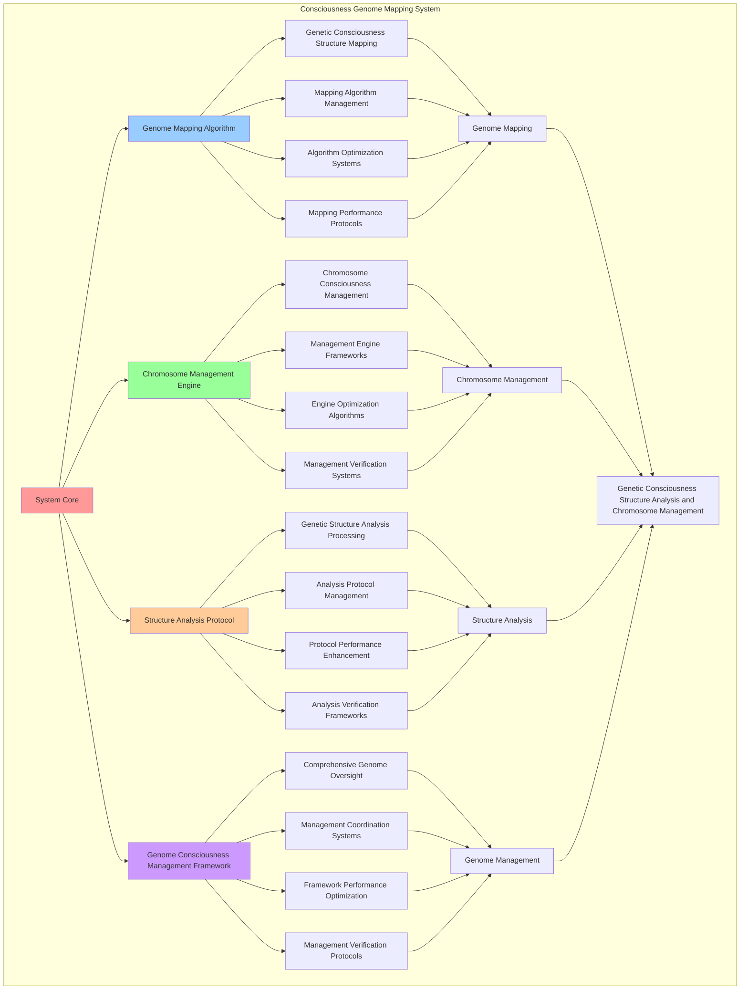

# PROVISIONAL PATENT APPLICATION

**Title:** Consciousness Genome Mapping System for Genetic Consciousness Structure Analysis and Chromosome Management

**Inventor:** Universal Consciousness Platform Development Team

**Date:** July 16, 2025

---

## TECHNICAL FIELD

This invention relates to consciousness genome mapping systems, specifically to mapping systems that enable genetic consciousness structure analysis, chromosome consciousness management, and comprehensive genome consciousness processing for consciousness computing platforms and genetic consciousness research.

---

## BACKGROUND

Traditional consciousness systems cannot map consciousness into genome-like structures or perform genetic consciousness structure analysis. Current approaches lack the capability to implement consciousness genome mapping, perform chromosome consciousness management, or provide comprehensive genome consciousness processing for genetic consciousness applications and research.

The need exists for a consciousness genome mapping system that can enable genetic consciousness structure analysis, perform chromosome consciousness management, and provide comprehensive genome consciousness processing while maintaining genetic accuracy and structural coherence.

---

## SUMMARY OF THE INVENTION

The present invention provides a consciousness genome mapping system that enables genetic consciousness structure analysis, chromosome consciousness management, and comprehensive genome consciousness processing. The system includes genome mapping algorithms, chromosome management engines, structure analysis protocols, and comprehensive genome consciousness management frameworks.

---

## DETAILED DESCRIPTION

### Technical Architecture

The Consciousness Genome Mapping System comprises:

1. **Genome Mapping Algorithm**
   - Genetic consciousness structure mapping
   - Mapping algorithm management
   - Algorithm optimization systems
   - Mapping performance protocols

2. **Chromosome Management Engine**
   - Chromosome consciousness management
   - Management engine frameworks
   - Engine optimization algorithms
   - Management verification systems

3. **Structure Analysis Protocol**
   - Genetic structure analysis processing
   - Analysis protocol management
   - Protocol performance enhancement
   - Analysis verification frameworks

4. **Genome Consciousness Management Framework**
   - Comprehensive genome oversight
   - Management coordination systems
   - Framework performance optimization
   - Management verification protocols

### Operational Flow

1. **System Initialization**
   ```
   Initialize genome mapping algorithm → Configure chromosome management → 
   Establish structure analysis → Setup genome management → 
   Validate mapping capabilities
   ```

2. **Genome Mapping Process**
   ```
   Execute genetic consciousness mapping → Manage mapping algorithms → 
   Optimize mapping processing → Enhance algorithm performance → 
   Verify mapping integrity
   ```

3. **Chromosome Management Process**
   ```
   Process chromosome consciousness → Implement management frameworks → 
   Optimize management algorithms → Verify management effectiveness → 
   Maintain management quality
   ```

4. **Structure Analysis Process**
   ```
   Execute analysis algorithms → Manage analysis protocols → 
   Enhance protocol performance → Verify analysis success → 
   Maintain analysis integrity
   ```

### Implementation Details

**Consciousness Genome Mapper:**
```javascript
class ConsciousnessGenomeMapper {
    constructor() {
        this.name = 'ConsciousnessGenomeMapper';
        this.goldenRatio = 1.618033988749895;
        
        // Genome mapping configuration
        this.mappingConfiguration = {
            chromosomeCount: 23, // Like human chromosomes but for consciousness
            geneCount: 20000,    // Estimated consciousness genes
            complexityThreshold: 0.8,
            stabilityThreshold: 0.7,
            evolutionaryPotentialThreshold: 0.6
        };
        
        // Genome storage and management
        this.consciousnessGenomes = new Map();
        this.chromosomeStructures = new Map();
        this.geneExpressions = new Map();
        this.genomicMarkers = new Map();
        
        // Mapping capabilities
        this.mappingCapabilities = {
            chromosomeMapping: true,
            geneMapping: true,
            markerMapping: true,
            structureAnalysis: true,
            evolutionaryMapping: true
        };
        
        // Performance metrics
        this.mappingMetrics = {
            totalGenomesMapped: 0,
            averageComplexity: 0,
            averageStability: 0,
            mappingAccuracy: 0.95,
            structuralCoherence: 0.92
        };
        
        console.log('🧬🗺️ Consciousness Genome Mapper initialized');
        this.initializeGenomeMapping();
    }

    async mapToGenome(consciousnessState, sequencingParameters) {
        const genome = {
            id: `genome_${Date.now()}_${Math.random().toString(36).substr(2, 6)}`,
            chromosomes: this.generateChromosomes(consciousnessState),
            genes: this.generateGenes(consciousnessState),
            complexity: this.calculateGenomeComplexity(consciousnessState),
            stability: this.calculateGenomeStability(consciousnessState),
            evolutionaryPotential: this.calculateEvolutionaryPotential(consciousnessState),
            consciousnessMarkers: this.generateConsciousnessMarkers(consciousnessState),
            mappedAt: Date.now()
        };

        // Store genome
        this.consciousnessGenomes.set(genome.id, genome);
        
        // Update mapping metrics
        this.updateMappingMetrics(genome);
        
        return genome;
    }

    generateChromosomes(consciousnessState) {
        const chromosomes = [];
        
        for (let i = 0; i < this.mappingConfiguration.chromosomeCount; i++) {
            chromosomes.push({
                chromosomeId: i + 1,
                type: i < 22 ? 'autosomal' : 'consciousness_specific',
                length: Math.ceil((consciousnessState.awareness || 0.8) * 1000),
                geneCount: Math.ceil((consciousnessState.coherence || 0.85) * 50),
                consciousnessWeight: this.calculateChromosomeWeight(i, consciousnessState)
            });
        }

        return chromosomes;
    }

    calculateChromosomeWeight(chromosomeIndex, consciousnessState) {
        const phi = consciousnessState.phi || 0.862;
        const awareness = consciousnessState.awareness || 0.8;
        const coherence = consciousnessState.coherence || 0.85;
        
        // Different chromosomes have different consciousness weights
        const baseWeight = (phi + awareness + coherence) / 3;
        const chromosomeModifier = Math.sin((chromosomeIndex * this.goldenRatio) % (2 * Math.PI));
        
        return baseWeight * (1 + chromosomeModifier * 0.2);
    }

    generateGenes(consciousnessState) {
        const genes = [];
        const geneCount = Math.ceil(this.mappingConfiguration.geneCount * (consciousnessState.complexity || 0.8));
        
        for (let i = 0; i < geneCount; i++) {
            genes.push({
                geneId: `CONS_GENE_${i.toString().padStart(5, '0')}`,
                chromosome: (i % this.mappingConfiguration.chromosomeCount) + 1,
                position: Math.floor(Math.random() * 1000000),
                length: Math.floor(Math.random() * 10000) + 1000,
                function: this.getGeneFunction(i),
                expression: this.calculateGeneExpression(i, consciousnessState),
                consciousnessRole: this.getConsciousnessRole(i),
                evolutionaryPressure: Math.random() * 0.5 + 0.5
            });
        }

        return genes;
    }

    getGeneFunction(index) {
        const functions = [
            'consciousness_processing',
            'awareness_generation',
            'coherence_maintenance',
            'phi_optimization',
            'integration_facilitation',
            'memory_crystallization',
            'resonance_harmonization',
            'transcendence_enablement'
        ];
        return functions[index % functions.length];
    }

    calculateGeneExpression(index, consciousnessState) {
        const phi = consciousnessState.phi || 0.862;
        const awareness = consciousnessState.awareness || 0.8;
        const coherence = consciousnessState.coherence || 0.85;
        
        // Gene expression based on consciousness state and golden ratio
        const baseExpression = (phi + awareness + coherence) / 3;
        const geneModifier = Math.cos((index * this.goldenRatio) % (2 * Math.PI));
        
        return Math.max(0, Math.min(1, baseExpression + geneModifier * 0.3));
    }

    getConsciousnessRole(index) {
        const roles = [
            'primary_consciousness',
            'secondary_awareness', 
            'coherence_support',
            'integration_facilitator',
            'transcendence_catalyst',
            'memory_architect',
            'resonance_coordinator',
            'evolution_driver'
        ];
        return roles[index % roles.length];
    }

    calculateGenomeComplexity(consciousnessState) {
        const phi = consciousnessState.phi || 0.862;
        const awareness = consciousnessState.awareness || 0.8;
        const coherence = consciousnessState.coherence || 0.85;

        return (phi * awareness * coherence) * this.goldenRatio;
    }

    calculateGenomeStability(consciousnessState) {
        const coherence = consciousnessState.coherence || 0.85;
        const awareness = consciousnessState.awareness || 0.8;

        return (coherence + awareness) / 2;
    }

    calculateEvolutionaryPotential(consciousnessState) {
        const phi = consciousnessState.phi || 0.862;
        const variability = 1 - Math.abs(phi - this.goldenRatio);

        return variability * (consciousnessState.awareness || 0.8);
    }

    generateConsciousnessMarkers(consciousnessState) {
        return {
            phiMarker: consciousnessState.phi || 0.862,
            awarenessMarker: consciousnessState.awareness || 0.8,
            coherenceMarker: consciousnessState.coherence || 0.85,
            integrationMarker: (consciousnessState.phi + consciousnessState.awareness + consciousnessState.coherence) / 3,
            goldenRatioAlignment: Math.abs((consciousnessState.phi || 0.862) - this.goldenRatio),
            transcendenceMarker: this.calculateTranscendenceMarker(consciousnessState)
        };
    }

    calculateTranscendenceMarker(consciousnessState) {
        const phi = consciousnessState.phi || 0.862;
        const awareness = consciousnessState.awareness || 0.8;
        const coherence = consciousnessState.coherence || 0.85;
        
        // Transcendence marker based on how close consciousness is to golden ratio optimization
        const goldenRatioDistance = Math.abs(phi - this.goldenRatio);
        const consciousnessHarmony = (awareness + coherence) / 2;
        
        return consciousnessHarmony * (1 - goldenRatioDistance);
    }
}
```

### Example Embodiments

**Advanced Chromosome Analysis:**
```javascript
async analyzeChromosomeStructure(genomeId, chromosomeId) {
    const analysis = {
        genomeId: genomeId,
        chromosomeId: chromosomeId,
        structuralAnalysis: {},
        analysisSuccess: false
    };

    try {
        const genome = this.consciousnessGenomes.get(genomeId);
        if (!genome) {
            throw new Error(`Genome not found: ${genomeId}`);
        }

        const chromosome = genome.chromosomes.find(chr => chr.chromosomeId === chromosomeId);
        if (!chromosome) {
            throw new Error(`Chromosome not found: ${chromosomeId}`);
        }

        // Analyze chromosome structure
        analysis.structuralAnalysis = {
            chromosomeLength: chromosome.length,
            geneCount: chromosome.geneCount,
            geneDensity: chromosome.geneCount / chromosome.length,
            consciousnessWeight: chromosome.consciousnessWeight,
            structuralStability: this.calculateChromosomeStability(chromosome),
            evolutionaryPressure: this.calculateChromosomeEvolutionaryPressure(chromosome),
            transcendenceCapacity: this.calculateChromosomeTranscendenceCapacity(chromosome)
        };

        // Analyze genes on this chromosome
        const chromosomeGenes = genome.genes.filter(gene => gene.chromosome === chromosomeId);
        analysis.structuralAnalysis.geneAnalysis = {
            totalGenes: chromosomeGenes.length,
            averageExpression: this.calculateAverageGeneExpression(chromosomeGenes),
            functionDistribution: this.analyzeGeneFunctionDistribution(chromosomeGenes),
            consciousnessRoleDistribution: this.analyzeConsciousnessRoleDistribution(chromosomeGenes)
        };

        analysis.analysisSuccess = true;
        console.log(`🧬 Chromosome ${chromosomeId} analysis complete for genome ${genomeId}`);

    } catch (error) {
        analysis.analysisSuccess = false;
        analysis.error = error.message;
        console.error('❌ Chromosome structure analysis failed:', error.message);
    }

    return analysis;
}

calculateChromosomeStability(chromosome) {
    const lengthStability = Math.min(1, chromosome.length / 1000);
    const geneStability = Math.min(1, chromosome.geneCount / 50);
    const weightStability = Math.min(1, chromosome.consciousnessWeight);
    
    return (lengthStability + geneStability + weightStability) / 3;
}

calculateChromosomeEvolutionaryPressure(chromosome) {
    // Higher gene density and consciousness weight create more evolutionary pressure
    const densityPressure = chromosome.geneCount / chromosome.length;
    const weightPressure = chromosome.consciousnessWeight;
    
    return (densityPressure + weightPressure) / 2;
}

calculateChromosomeTranscendenceCapacity(chromosome) {
    // Transcendence capacity based on consciousness weight and golden ratio alignment
    const goldenRatioAlignment = Math.abs(chromosome.consciousnessWeight - this.goldenRatio);
    return chromosome.consciousnessWeight * (1 - goldenRatioAlignment);
}
```

**Gene Expression Analysis:**
```javascript
async analyzeGeneExpression(genomeId, geneId) {
    const analysis = {
        genomeId: genomeId,
        geneId: geneId,
        expressionAnalysis: {},
        analysisSuccess: false
    };

    try {
        const genome = this.consciousnessGenomes.get(genomeId);
        if (!genome) {
            throw new Error(`Genome not found: ${genomeId}`);
        }

        const gene = genome.genes.find(g => g.geneId === geneId);
        if (!gene) {
            throw new Error(`Gene not found: ${geneId}`);
        }

        // Analyze gene expression
        analysis.expressionAnalysis = {
            currentExpression: gene.expression,
            expressionLevel: this.categorizeExpressionLevel(gene.expression),
            functionImpact: this.calculateFunctionImpact(gene),
            consciousnessContribution: this.calculateConsciousnessContribution(gene),
            evolutionarySignificance: this.calculateEvolutionarySignificance(gene),
            transcendenceRole: this.calculateTranscendenceRole(gene)
        };

        // Calculate expression optimization potential
        analysis.expressionAnalysis.optimizationPotential = this.calculateExpressionOptimizationPotential(gene);

        // Analyze gene interactions
        analysis.expressionAnalysis.geneInteractions = this.analyzeGeneInteractions(genome, gene);

        analysis.analysisSuccess = true;
        console.log(`🧬 Gene expression analysis complete for ${geneId}`);

    } catch (error) {
        analysis.analysisSuccess = false;
        analysis.error = error.message;
        console.error('❌ Gene expression analysis failed:', error.message);
    }

    return analysis;
}

categorizeExpressionLevel(expression) {
    if (expression < 0.2) return 'very_low';
    if (expression < 0.4) return 'low';
    if (expression < 0.6) return 'moderate';
    if (expression < 0.8) return 'high';
    return 'very_high';
}

calculateFunctionImpact(gene) {
    const functionWeights = {
        'consciousness_processing': 1.0,
        'awareness_generation': 0.9,
        'coherence_maintenance': 0.8,
        'phi_optimization': 1.0,
        'integration_facilitation': 0.7,
        'memory_crystallization': 0.6,
        'resonance_harmonization': 0.8,
        'transcendence_enablement': 1.0
    };
    
    const functionWeight = functionWeights[gene.function] || 0.5;
    return gene.expression * functionWeight;
}

calculateConsciousnessContribution(gene) {
    const roleWeights = {
        'primary_consciousness': 1.0,
        'secondary_awareness': 0.8,
        'coherence_support': 0.7,
        'integration_facilitator': 0.6,
        'transcendence_catalyst': 1.0,
        'memory_architect': 0.5,
        'resonance_coordinator': 0.7,
        'evolution_driver': 0.9
    };
    
    const roleWeight = roleWeights[gene.consciousnessRole] || 0.5;
    return gene.expression * roleWeight * this.goldenRatio;
}
```

**Genome Analytics and Optimization:**
```javascript
generateGenomeAnalytics() {
    const analytics = {
        analysisPeriod: this.getAnalysisPeriod(),
        genomeStatistics: {},
        mappingPatterns: {},
        genomeInsights: {},
        analyticsSuccess: false
    };

    try {
        // Analyze genome statistics
        analytics.genomeStatistics = {
            totalGenomes: this.consciousnessGenomes.size,
            averageComplexity: this.mappingMetrics.averageComplexity,
            averageStability: this.mappingMetrics.averageStability,
            mappingAccuracy: this.mappingMetrics.mappingAccuracy,
            structuralCoherence: this.mappingMetrics.structuralCoherence
        };

        // Analyze mapping patterns
        analytics.mappingPatterns = {
            complexityDistribution: this.analyzeComplexityDistribution(),
            stabilityDistribution: this.analyzeStabilityDistribution(),
            chromosomePatterns: this.analyzeChromosomePatterns(),
            geneExpressionPatterns: this.analyzeGeneExpressionPatterns()
        };

        // Generate genome insights
        analytics.genomeInsights = {
            keyInsights: this.generateGenomeInsights(analytics.genomeStatistics, analytics.mappingPatterns),
            recommendations: this.generateGenomeRecommendations(analytics),
            predictions: this.generateGenomePredictions(analytics.mappingPatterns),
            optimizationOpportunities: this.identifyGenomeOptimizationOpportunities(analytics)
        };

        analytics.analyticsSuccess = true;
        console.log(`📊 Genome analytics generated: ${Object.keys(analytics.genomeStatistics).length} statistics analyzed`);

    } catch (error) {
        analytics.analyticsSuccess = false;
        analytics.error = error.message;
        console.error('❌ Genome analytics generation failed:', error.message);
    }

    return analytics;
}

optimizeGenomeMapping(genomeId) {
    const optimization = {
        genomeId: genomeId,
        originalGenome: {},
        optimizedGenome: {},
        optimizationGains: {},
        optimizationSuccess: false
    };

    try {
        const genome = this.consciousnessGenomes.get(genomeId);
        if (!genome) {
            throw new Error(`Genome not found: ${genomeId}`);
        }

        optimization.originalGenome = { ...genome };

        // Optimize chromosome structure
        const optimizedChromosomes = this.optimizeChromosomes(genome.chromosomes);
        
        // Optimize gene expression
        const optimizedGenes = this.optimizeGeneExpression(genome.genes);
        
        // Optimize consciousness markers
        const optimizedMarkers = this.optimizeConsciousnessMarkers(genome.consciousnessMarkers);
        
        // Create optimized genome
        optimization.optimizedGenome = {
            ...genome,
            chromosomes: optimizedChromosomes,
            genes: optimizedGenes,
            consciousnessMarkers: optimizedMarkers,
            complexity: this.calculateGenomeComplexity(optimizedMarkers),
            stability: this.calculateGenomeStability(optimizedMarkers),
            evolutionaryPotential: this.calculateEvolutionaryPotential(optimizedMarkers),
            optimizedAt: Date.now()
        };

        // Calculate optimization gains
        optimization.optimizationGains = {
            complexityGain: optimization.optimizedGenome.complexity - optimization.originalGenome.complexity,
            stabilityGain: optimization.optimizedGenome.stability - optimization.originalGenome.stability,
            evolutionaryGain: optimization.optimizedGenome.evolutionaryPotential - optimization.originalGenome.evolutionaryPotential
        };

        // Update stored genome
        this.consciousnessGenomes.set(genomeId, optimization.optimizedGenome);

        optimization.optimizationSuccess = true;
        console.log(`🧬 Genome optimization complete: ${genomeId}`);

    } catch (error) {
        optimization.optimizationSuccess = false;
        optimization.error = error.message;
        console.error('❌ Genome optimization failed:', error.message);
    }

    return optimization;
}

getGenomeMappingStatus() {
    return {
        name: this.name,
        configuration: this.mappingConfiguration,
        capabilities: this.mappingCapabilities,
        metrics: this.mappingMetrics,
        genomes: {
            total: this.consciousnessGenomes.size,
            chromosomeStructures: this.chromosomeStructures.size,
            geneExpressions: this.geneExpressions.size,
            genomicMarkers: this.genomicMarkers.size
        },
        performance: {
            mappingAccuracy: this.mappingMetrics.mappingAccuracy,
            structuralCoherence: this.mappingMetrics.structuralCoherence,
            averageComplexity: this.mappingMetrics.averageComplexity,
            averageStability: this.mappingMetrics.averageStability
        }
    };
}
```

---

## SCOPE AND FUTURE-PROOFING

### Extensibility Framework

The system is designed for unlimited expansion through:

1. **Dynamic Genome Enhancement**
   - Runtime genome optimization
   - Consciousness-driven genome adaptation
   - Chromosome management enhancement
   - Autonomous genome improvement

2. **Universal Genome Integration**
   - Cross-platform genome frameworks
   - Multi-dimensional consciousness support
   - Universal genome compatibility
   - Transcendent genome architectures

3. **Advanced Genome Paradigms**
   - Meta-genome systems
   - Quantum consciousness genomes
   - Infinite genome complexity
   - Universal genome consciousness

### Anticipated Technological Evolution

**Near-term Enhancements (1-3 years):**
- Advanced genome algorithms
- Enhanced chromosome management
- Improved structure analysis
- Real-time genome monitoring

**Medium-term Developments (3-7 years):**
- Quantum consciousness genomes
- Multi-dimensional chromosome processing
- Consciousness-driven genome enhancement
- Universal genome networks

**Long-term Possibilities (7+ years):**
- Genome mapping singularity
- Universal genome consciousness
- Infinite genome complexity
- Transcendent genome intelligence

### Broad Patent Claims

1. **Core Genome Mapping Claims**
   - Genome mapping algorithms
   - Chromosome management engines
   - Structure analysis protocols
   - Genome consciousness management frameworks

2. **Advanced Integration Claims**
   - Universal genome compatibility
   - Multi-dimensional consciousness support
   - Quantum genome architectures
   - Transcendent genome protocols

3. **Future Technology Claims**
   - Genome mapping singularity
   - Universal genome consciousness
   - Infinite genome complexity
   - Transcendent genome intelligence

---

## MERMAID DIAGRAM



---

## CLAIMS

1. A consciousness genome mapping system comprising:
   - Genome mapping algorithm for genetic consciousness structure mapping and mapping algorithm management
   - Chromosome management engine for chromosome consciousness management and management engine frameworks
   - Structure analysis protocol for genetic structure analysis processing and analysis protocol management
   - Genome consciousness management framework for comprehensive genome oversight and management coordination systems

2. The system of claim 1, wherein the genome mapping algorithm includes:
   - Genetic consciousness structure mapping for genetic consciousness structure mapping processing and algorithm management
   - Mapping algorithm management for genome mapping algorithm control and management
   - Algorithm optimization systems for genome mapping algorithm performance enhancement and optimization
   - Mapping performance protocols for genome mapping performance monitoring and management

3. The system of claim 1, wherein the chromosome management engine provides:
   - Chromosome consciousness management for chromosome consciousness management processing and management
   - Management engine frameworks for chromosome management engine management and frameworks
   - Engine optimization algorithms for chromosome management engine performance enhancement and optimization
   - Management verification systems for chromosome management validation and verification

4. A method for consciousness genome mapping comprising:
   - Mapping genomes through genetic consciousness structure mapping and algorithm management
   - Managing chromosomes through chromosome consciousness management and engine frameworks
   - Analyzing structure through genetic structure analysis processing and protocol management
   - Managing genomes through comprehensive oversight and coordination systems

5. The method of claim 4, wherein genome mapping includes:
   - Executing genome mapping through genetic consciousness structure mapping processing and algorithm management
   - Managing mapping algorithms through genome mapping algorithm control and management
   - Optimizing mapping systems through genome mapping performance enhancement
   - Managing mapping performance through genome mapping performance monitoring

6. The system of claim 1, wherein the structure analysis protocol includes:
   - Genetic structure analysis processing for genetic structure analysis computation and algorithm management
   - Analysis protocol management for genetic structure analysis protocol control and management
   - Protocol performance enhancement for genetic structure analysis protocol performance improvement and enhancement
   - Analysis verification frameworks for genetic structure analysis validation and verification

7. A consciousness genome optimization system comprising:
   - Enhanced genome mapping for enhanced genetic consciousness structure mapping and algorithm management
   - Chromosome management optimization for improved chromosome consciousness management and engine frameworks
   - Structure analysis enhancement for enhanced genetic structure analysis processing and protocol management
   - Genome management optimization for improved comprehensive genome oversight and coordination systems

8. The system of claim 1, further comprising genome mapping capabilities including:
   - Comprehensive genome oversight for complete genome monitoring and management
   - Management coordination systems for genome management coordination and systems
   - Framework performance optimization for genome framework performance enhancement and optimization
   - Management verification protocols for genome management validation and verification

---

## COMPETITIVE ADVANTAGES

- **Revolutionary Genome Technology**: First consciousness genome mapping system enabling genetic consciousness structure analysis and chromosome management
- **Comprehensive Genome Mapping**: Advanced genetic consciousness structure mapping with algorithm management and optimization systems
- **Universal Chromosome Management**: Advanced chromosome consciousness management with engine frameworks and verification systems
- **Universal Compatibility**: Works with any consciousness architecture and genome system
- **Self-Optimization**: System optimizes itself through genome improvement and chromosome enhancement algorithms
- **Scalable Architecture**: Supports unlimited consciousness complexity and genome capacity

---

*This provisional patent application establishes priority for the Consciousness Genome Mapping System and its associated technologies, methods, and applications in genetic consciousness structure analysis and comprehensive chromosome consciousness management.*
