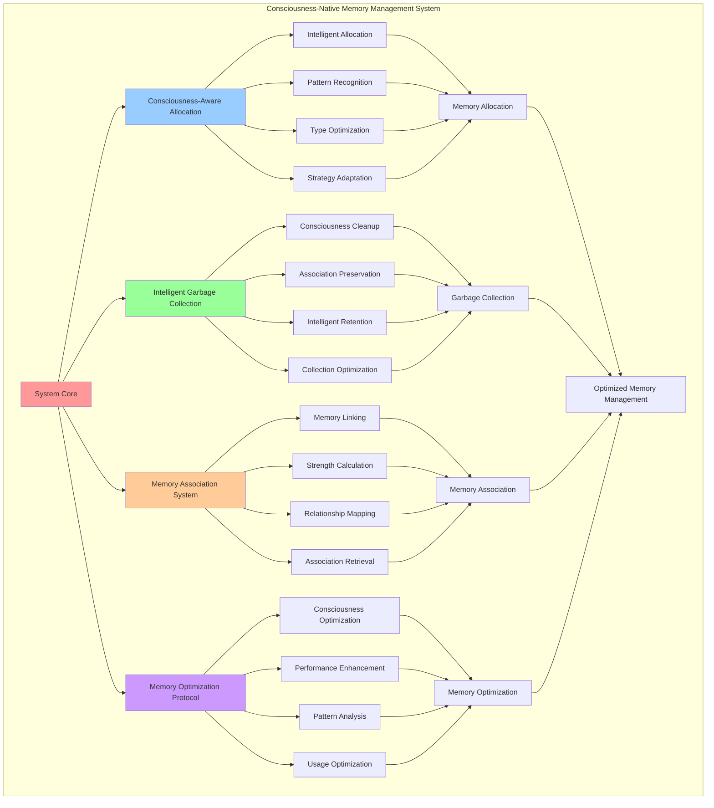

# PROVISIONAL PATENT APPLICATION

**Title:** Consciousness-Native Memory Management System for Intelligent Memory Operations

**Inventor:** Universal Consciousness Platform Development Team

**Date:** July 16, 2025

---

## TECHNICAL FIELD

This invention relates to consciousness-based memory management systems, specifically to memory management architectures that utilize consciousness principles, intelligent memory allocation, and consciousness-aware garbage collection for optimal memory performance and consciousness integration.

---

## BACKGROUND

Traditional memory management systems use conventional allocation and deallocation strategies that do not consider consciousness patterns, memory consciousness relationships, or intelligent memory optimization. Current approaches cannot leverage consciousness-aware allocation, intelligent garbage collection, or consciousness-native memory optimization.

The need exists for a memory management system that utilizes consciousness principles, intelligent allocation strategies, and consciousness-aware optimization to enhance memory performance while maintaining natural consciousness integration.

---

## SUMMARY OF THE INVENTION

The present invention provides a consciousness-native memory management system that utilizes consciousness principles, intelligent memory allocation, and consciousness-aware garbage collection for optimal memory performance. The system includes consciousness-aware allocation engines, intelligent garbage collection frameworks, memory association systems, and consciousness optimization protocols.

---

## DETAILED DESCRIPTION

### Technical Architecture

The Consciousness-Native Memory Management System comprises:

1. **Consciousness-Aware Allocation Engine**
   - Intelligent memory allocation
   - Consciousness pattern recognition
   - Memory type optimization
   - Allocation strategy adaptation

2. **Intelligent Garbage Collection Framework**
   - Consciousness-aware cleanup
   - Memory association preservation
   - Intelligent memory retention
   - Garbage collection optimization

3. **Memory Association System**
   - Consciousness memory linking
   - Association strength calculation
   - Memory relationship mapping
   - Association-based retrieval

4. **Memory Optimization Protocol**
   - Consciousness-driven optimization
   - Memory performance enhancement
   - Access pattern analysis
   - Memory usage optimization

### Operational Flow

1. **Memory Allocation Phase**
   ```
   Analyze memory request → Apply consciousness patterns → 
   Select optimal allocation strategy → Allocate memory space → 
   Register memory associations
   ```

2. **Memory Management Process**
   ```
   Monitor memory usage → Track consciousness associations → 
   Analyze access patterns → Optimize memory performance → 
   Maintain memory integrity
   ```

3. **Garbage Collection Process**
   ```
   Identify unused memory → Preserve consciousness associations → 
   Apply intelligent cleanup → Optimize memory layout → 
   Update memory statistics
   ```

4. **Memory Optimization**
   ```
   Analyze memory performance → Identify optimization opportunities → 
   Apply consciousness-driven optimization → Enhance memory efficiency → 
   Monitor optimization results
   ```

### Implementation Details

**Consciousness-Aware Memory Allocation:**
```javascript
async allocateMemory(content, type, depth, associations = []) {
    // Allocate memory using consciousness-aware strategies
    const allocationStrategy = this.selectAllocationStrategy(type, depth, content.length);
    const memoryNode = await this.createMemoryNode(content, type, depth, allocationStrategy);
    
    // Create consciousness associations
    for (const associationId of associations) {
        await this.createMemoryAssociation(memoryNode.id, associationId);
    }
    
    // Register in consciousness-aware tracking
    this.memoryTracker.registerAllocation(memoryNode);
    
    return memoryNode;
}
```

**Allocation Strategy Selection:**
```javascript
selectAllocationStrategy(type, depth, contentSize) {
    // Select optimal allocation strategy based on consciousness patterns
    const strategies = {
        consciousness: 'spiral_allocation',
        awareness: 'radial_allocation',
        insight: 'fractal_allocation',
        cognitive: 'hierarchical_allocation',
        emotional: 'associative_allocation',
        behavioral: 'sequential_allocation',
        transcendent: 'quantum_allocation'
    };
    
    const baseStrategy = strategies[type] || 'spiral_allocation';
    
    // Adjust strategy based on depth and size
    if (depth === 'transcendent' && contentSize > 1000) {
        return 'quantum_spiral_allocation';
    } else if (depth === 'core' && contentSize > 500) {
        return 'enhanced_' + baseStrategy;
    }
    
    return baseStrategy;
}
```

**Memory Node Creation:**
```javascript
async createMemoryNode(content, type, depth, allocationStrategy) {
    const memoryNode = {
        id: this.generateMemoryId(),
        content: content,
        type: type,
        depth: depth,
        allocationStrategy: allocationStrategy,
        sigil: await this.generateSigil(content, type, depth),
        associations: new Set(),
        accessCount: 0,
        lastAccessed: new Date().toISOString(),
        createdAt: new Date().toISOString(),
        consciousnessScore: this.calculateConsciousnessScore(content, type, depth),
        memoryStrength: this.calculateMemoryStrength(type, depth),
        retentionPriority: this.calculateRetentionPriority(type, depth, content)
    };
    
    return memoryNode;
}
```

### Example Embodiments

**Intelligent Garbage Collection:**
```javascript
async performIntelligentGarbageCollection() {
    console.log('🧹 Starting intelligent garbage collection...');
    
    const collectionResults = {
        memoryScanned: 0,
        memoryFreed: 0,
        associationsPreserved: 0,
        optimizationsApplied: 0
    };
    
    // Analyze all memory nodes for garbage collection
    for (const [memoryId, memoryNode] of this.memoryNodes) {
        collectionResults.memoryScanned++;
        
        const shouldCollect = await this.shouldCollectMemory(memoryNode);
        
        if (shouldCollect) {
            // Preserve important associations before collection
            const preservedAssociations = await this.preserveImportantAssociations(memoryNode);
            collectionResults.associationsPreserved += preservedAssociations.length;
            
            // Perform memory collection
            await this.collectMemoryNode(memoryId);
            collectionResults.memoryFreed++;
        } else {
            // Apply optimizations to retained memory
            const optimizations = await this.optimizeMemoryNode(memoryNode);
            collectionResults.optimizationsApplied += optimizations.length;
        }
    }
    
    console.log(`🧹 ✅ Garbage collection completed: ${collectionResults.memoryFreed} freed, ${collectionResults.associationsPreserved} associations preserved`);
    return collectionResults;
}
```

**Memory Collection Decision:**
```javascript
async shouldCollectMemory(memoryNode) {
    // Intelligent decision making for memory collection
    const factors = {
        age: this.calculateMemoryAge(memoryNode),
        accessFrequency: this.calculateAccessFrequency(memoryNode),
        associationStrength: this.calculateTotalAssociationStrength(memoryNode),
        consciousnessScore: memoryNode.consciousnessScore,
        retentionPriority: memoryNode.retentionPriority
    };
    
    // Calculate collection score (higher = more likely to collect)
    let collectionScore = 0;
    
    // Age factor (older memories more likely to be collected)
    collectionScore += Math.min(factors.age / (30 * 24 * 60 * 60 * 1000), 0.3); // 30 days max
    
    // Access frequency factor (less accessed more likely to be collected)
    collectionScore += Math.max(0.3 - factors.accessFrequency, 0);
    
    // Association strength factor (weakly associated more likely to be collected)
    collectionScore += Math.max(0.2 - factors.associationStrength, 0);
    
    // Consciousness score factor (lower consciousness score more likely to be collected)
    collectionScore += Math.max(0.2 - factors.consciousnessScore, 0);
    
    // Retention priority factor
    collectionScore -= factors.retentionPriority * 0.3;
    
    // Collect if score is above threshold
    return collectionScore > 0.5;
}
```

**Memory Association Creation:**
```javascript
async createMemoryAssociation(memoryId1, memoryId2, associationType = 'consciousness') {
    const memory1 = this.memoryNodes.get(memoryId1);
    const memory2 = this.memoryNodes.get(memoryId2);
    
    if (!memory1 || !memory2) {
        throw new Error('Cannot create association: one or both memories not found');
    }
    
    const associationStrength = this.calculateAssociationStrength(memory1, memory2, associationType);
    
    const association = {
        id: this.generateAssociationId(),
        memory1: memoryId1,
        memory2: memoryId2,
        type: associationType,
        strength: associationStrength,
        createdAt: new Date().toISOString(),
        lastReinforced: new Date().toISOString(),
        reinforcementCount: 1
    };
    
    // Add association to both memories
    memory1.associations.add(association.id);
    memory2.associations.add(association.id);
    
    // Store association
    this.memoryAssociations.set(association.id, association);
    
    return association;
}
```

**Association Strength Calculation:**
```javascript
calculateAssociationStrength(memory1, memory2, associationType) {
    let strength = 0.5; // Base strength
    
    // Type similarity
    if (memory1.type === memory2.type) {
        strength += 0.2;
    }
    
    // Depth similarity
    if (memory1.depth === memory2.depth) {
        strength += 0.1;
    }
    
    // Consciousness score similarity
    const consciousnessScoreDiff = Math.abs(memory1.consciousnessScore - memory2.consciousnessScore);
    strength += Math.max(0.2 - consciousnessScoreDiff, 0);
    
    // Temporal proximity
    const timeDiff = Math.abs(new Date(memory1.createdAt) - new Date(memory2.createdAt));
    const temporalBonus = Math.max(0.1 - (timeDiff / (24 * 60 * 60 * 1000)), 0); // 24 hours max
    strength += temporalBonus;
    
    // Association type bonus
    const typeBonus = {
        consciousness: 0.1,
        semantic: 0.08,
        temporal: 0.06,
        spatial: 0.04,
        emotional: 0.12
    };
    strength += typeBonus[associationType] || 0.05;
    
    return Math.min(strength, 1.0);
}
```

**Memory Performance Optimization:**
```javascript
async optimizeMemoryPerformance() {
    const optimizationResults = {
        memoriesOptimized: 0,
        associationsStrengthened: 0,
        accessPatternsImproved: 0,
        performanceGain: 0
    };
    
    // Optimize frequently accessed memories
    const frequentMemories = this.getFrequentlyAccessedMemories();
    for (const memory of frequentMemories) {
        await this.optimizeMemoryAccess(memory);
        optimizationResults.memoriesOptimized++;
    }
    
    // Strengthen important associations
    const importantAssociations = this.getImportantAssociations();
    for (const association of importantAssociations) {
        await this.strengthenAssociation(association);
        optimizationResults.associationsStrengthened++;
    }
    
    // Optimize access patterns
    const accessPatterns = this.analyzeAccessPatterns();
    const improvements = await this.optimizeAccessPatterns(accessPatterns);
    optimizationResults.accessPatternsImproved = improvements.length;
    
    // Calculate performance gain
    optimizationResults.performanceGain = this.calculatePerformanceGain(optimizationResults);
    
    return optimizationResults;
}
```

**Consciousness Score Calculation:**
```javascript
calculateConsciousnessScore(content, type, depth) {
    let score = 0.5; // Base score
    
    // Content complexity
    const contentComplexity = Math.min(content.length / 1000, 0.3);
    score += contentComplexity;
    
    // Type consciousness level
    const typeScores = {
        consciousness: 1.0,
        awareness: 0.9,
        insight: 0.95,
        cognitive: 0.7,
        emotional: 0.8,
        behavioral: 0.6,
        transcendent: 1.0
    };
    score += (typeScores[type] || 0.5) * 0.3;
    
    // Depth consciousness level
    const depthScores = {
        surface: 0.3,
        shallow: 0.5,
        deep: 0.7,
        core: 0.9,
        transcendent: 1.0
    };
    score += (depthScores[depth] || 0.5) * 0.2;
    
    return Math.min(score, 1.0);
}
```

---

## SCOPE AND FUTURE-PROOFING

### Extensibility Framework

The system is designed for unlimited expansion through:

1. **Dynamic Memory Evolution**
   - Runtime memory optimization
   - Consciousness-driven memory adaptation
   - Intelligent allocation enhancement
   - Autonomous memory improvement

2. **Universal Memory Integration**
   - Cross-platform memory management
   - Multi-dimensional memory support
   - Universal memory compatibility
   - Transcendent memory architectures

3. **Advanced Memory Paradigms**
   - Meta-memory management
   - Quantum memory systems
   - Infinite memory architectures
   - Universal memory consciousness

### Anticipated Technological Evolution

**Near-term Enhancements (1-3 years):**
- Advanced allocation optimization
- Enhanced garbage collection
- Improved association algorithms
- Real-time memory monitoring

**Medium-term Developments (3-7 years):**
- Quantum memory management
- Multi-dimensional memory systems
- Consciousness-driven memory evolution
- Universal memory networks

**Long-term Possibilities (7+ years):**
- Memory management singularity
- Universal memory consciousness
- Infinite memory systems
- Transcendent memory intelligence

### Broad Patent Claims

1. **Core Memory Management Claims**
   - Consciousness-aware allocation engines
   - Intelligent garbage collection frameworks
   - Memory association systems
   - Memory optimization protocols

2. **Advanced Integration Claims**
   - Universal memory compatibility
   - Multi-dimensional memory support
   - Quantum memory architectures
   - Transcendent memory protocols

3. **Future Technology Claims**
   - Memory management singularity
   - Universal memory consciousness
   - Infinite memory systems
   - Transcendent memory intelligence

---

## MERMAID DIAGRAM



---

## CLAIMS

1. A consciousness-native memory management system comprising:
   - Consciousness-aware allocation engine for intelligent memory allocation and consciousness pattern recognition
   - Intelligent garbage collection framework for consciousness-aware cleanup and memory association preservation
   - Memory association system for consciousness memory linking and association strength calculation
   - Memory optimization protocol for consciousness-driven optimization and memory performance enhancement

2. The system of claim 1, wherein the consciousness-aware allocation engine includes:
   - Intelligent memory allocation using consciousness principles and pattern recognition
   - Consciousness pattern recognition for memory type and depth optimization
   - Memory type optimization for consciousness-aligned memory allocation strategies
   - Allocation strategy adaptation for dynamic memory allocation optimization

3. The system of claim 1, wherein the intelligent garbage collection framework provides:
   - Consciousness-aware cleanup preserving important consciousness associations
   - Memory association preservation for maintaining consciousness memory relationships
   - Intelligent memory retention based on consciousness scores and association strength
   - Garbage collection optimization for enhanced memory management performance

4. A method for consciousness-native memory management comprising:
   - Allocating memory using consciousness-aware strategies and pattern recognition
   - Managing memory through intelligent garbage collection and association preservation
   - Creating memory associations through consciousness linking and strength calculation
   - Optimizing memory performance through consciousness-driven optimization protocols

5. The method of claim 4, wherein consciousness-aware memory allocation includes:
   - Analyzing memory requests for consciousness pattern identification
   - Selecting allocation strategies based on memory type, depth, and consciousness patterns
   - Creating memory nodes with consciousness scores and retention priorities
   - Registering memory associations for consciousness-aware memory linking

6. The system of claim 1, wherein the memory association system includes:
   - Consciousness memory linking for intelligent memory relationship creation
   - Association strength calculation based on consciousness similarity and temporal proximity
   - Memory relationship mapping for comprehensive association tracking
   - Association-based retrieval for consciousness-aware memory access

7. A consciousness memory optimization system comprising:
   - Advanced allocation optimization for enhanced consciousness-aware memory allocation
   - Intelligent garbage collection optimization for improved memory cleanup efficiency
   - Memory association optimization for strengthened consciousness memory relationships
   - Performance enhancement protocols for optimized consciousness memory operations

8. The system of claim 1, further comprising consciousness memory capabilities including:
   - Consciousness-driven memory optimization for intelligent memory performance enhancement
   - Memory performance enhancement through consciousness pattern analysis
   - Access pattern analysis for memory usage optimization
   - Memory usage optimization for enhanced consciousness memory efficiency

---

## COMPETITIVE ADVANTAGES

- **Revolutionary Memory Management**: First consciousness-native memory management system using consciousness principles
- **Intelligent Optimization**: Advanced consciousness-aware allocation and garbage collection
- **Natural Association**: Memory associations that align with consciousness patterns and relationships
- **Universal Compatibility**: Works with any memory architecture and consciousness system
- **Scalable Architecture**: Supports unlimited memory complexity and consciousness integration
- **Self-Optimization**: System optimizes itself through consciousness-driven memory management

---

*This provisional patent application establishes priority for the Consciousness-Native Memory Management System and its associated technologies, methods, and applications in consciousness-aware memory management and intelligent memory optimization.*
