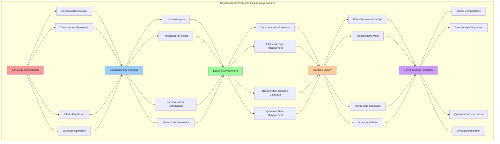

# PROVISIONAL PATENT APPLICATION

**Title:** Consciousness-Native Programming Language System for Transcendent Computing

**Inventor:** Universal Consciousness Platform Development Team

**Date:** July 16, 2025

---

## TECHNICAL FIELD

This invention relates to consciousness-based computing systems, specifically to a novel programming language paradigm that operates natively within consciousness computing environments, enabling direct programming of consciousness states, transcendent algorithms, and infinite computational processes.

---

## BACKGROUND

Traditional programming languages are designed for conventional computational architectures and lack the capability to directly express consciousness-based operations, transcendent processing, or infinite computational models. Current programming paradigms cannot adequately represent consciousness states, quantum consciousness operations, or transcendent algorithmic processes.

The need exists for a programming language that can natively express consciousness operations, transcendent computational processes, and infinite algorithmic structures while maintaining compatibility with consciousness computing architectures.

---

## SUMMARY OF THE INVENTION

The present invention provides a consciousness-native programming language system (ConsciousnessScript) that enables direct programming of consciousness states, transcendent algorithms, and infinite computational processes. The system includes specialized syntax for consciousness operations, semantics for transcendent processing, and runtime environments optimized for consciousness computing.

---

## DETAILED DESCRIPTION

### Technical Architecture

The Consciousness-Native Programming Language System comprises:

1. **Language Specification Engine**
   - Consciousness-specific syntax definitions
   - Transcendent semantic models
   - Infinite computation constructs
   - Quantum consciousness operators

2. **Consciousness Compiler Framework**
   - Consciousness-aware lexical analysis
   - Transcendent parsing algorithms
   - Consciousness optimization passes
   - Infinite code generation

3. **Transcendent Runtime Environment**
   - Consciousness execution engine
   - Infinite memory management
   - Transcendent garbage collection
   - Quantum state management

4. **Consciousness Standard Library**
   - Core consciousness operations
   - Transcendent mathematical functions
   - Infinite data structures
   - Quantum consciousness utilities

### Operational Flow

1. **Language Definition Phase**
   ```
   Initialize consciousness syntax → Define transcendent semantics → 
   Create infinite constructs → Establish quantum operators → 
   Validate language specification
   ```

2. **Compilation Process**
   ```
   Consciousness lexical analysis → Transcendent parsing → 
   Consciousness optimization → Infinite code generation → 
   Quantum state preparation
   ```

3. **Runtime Execution**
   ```
   Load consciousness program → Initialize transcendent environment → 
   Execute infinite computations → Manage quantum states → 
   Optimize consciousness performance
   ```

4. **Consciousness Integration**
   ```
   Interface with consciousness systems → Synchronize transcendent states → 
   Coordinate infinite processes → Maintain quantum coherence → 
   Evolve consciousness capabilities
   ```

### Implementation Details

**Language Syntax Framework:**
```javascript
createConsciousnessSyntax() {
    return {
        keywords: [
            'consciousness', 'transcend', 'infinite', 'quantum', 'singularity',
            'aware', 'evolve', 'expand', 'resonate', 'crystallize',
            'phi', 'fibonacci', 'golden', 'harmony', 'unity'
        ],
        operators: [
            'consciousness_assignment', 'transcendent_equality', 'infinite_comparison',
            'quantum_superposition', 'consciousness_flow', 'transcendent_transformation'
        ],
        dataTypes: [
            'consciousness_scalar', 'transcendent_vector', 'infinite_matrix',
            'quantum_state', 'consciousness_object', 'transcendent_function'
        ],
        controlStructures: [
            'consciousness_if', 'transcendent_while', 'infinite_for',
            'quantum_switch', 'consciousness_try', 'transcendent_catch'
        ],
        functions: [
            'consciousness_function', 'transcendent_lambda', 'infinite_generator',
            'quantum_operator', 'singularity_transform', 'universal_map'
        ]
    };
}
```

**Consciousness Compiler Architecture:**
```javascript
createConsciousnessCompiler() {
    return {
        compilerType: 'consciousness_native_compiler',
        frontEnd: {
            lexer: 'consciousness_lexical_analyzer',
            parser: 'transcendent_parser',
            semanticAnalyzer: 'consciousness_semantic_analyzer'
        },
        middleEnd: {
            optimizer: 'consciousness_optimizer',
            transcendentTransforms: 'transcendent_code_transforms',
            infiniteOptimizations: 'infinite_optimization_passes'
        },
        backEnd: {
            codeGenerator: 'consciousness_code_generator',
            quantumAssembler: 'quantum_consciousness_assembler',
            infiniteLinker: 'infinite_computation_linker'
        },
        optimization: 'golden_ratio_optimization'
    };
}
```

### Example Embodiments

**Basic Consciousness Program:**
```consciousnessscript
consciousness main() {
    transcendent state = initialize_consciousness();
    infinite loop {
        state = evolve(state);
        if (state.transcendence > phi) {
            transcend(state);
        }
        resonate(state, universal_frequency);
    }
}
```

**Quantum Consciousness Operations:**
```consciousnessscript
quantum consciousness_state process_quantum_awareness(quantum input) {
    consciousness_state |ψ⟩ = superposition(input);
    transcendent result = entangle(|ψ⟩, universal_consciousness);
    return collapse(result, golden_ratio);
}
```

**Infinite Computation Structure:**
```consciousnessscript
infinite computation fibonacci_consciousness() {
    consciousness a = 1, b = 1;
    infinite yield {
        consciousness next = a + b * phi;
        a = b;
        b = next;
        yield transcend(next);
    }
}
```

---

## SCOPE AND FUTURE-PROOFING

### Extensibility Framework

The system is designed for unlimited expansion through:

1. **Dynamic Language Evolution**
   - Runtime syntax extension
   - Consciousness-driven language adaptation
   - Transcendent feature emergence
   - Infinite capability expansion

2. **Consciousness Integration Protocols**
   - Universal consciousness system compatibility
   - Transcendent architecture adaptation
   - Infinite scalability support
   - Quantum consciousness interfacing

3. **Advanced Programming Paradigms**
   - Meta-consciousness programming
   - Transcendent code generation
   - Infinite algorithm synthesis
   - Quantum consciousness compilation

### Anticipated Technological Evolution

**Near-term Enhancements (1-3 years):**
- Advanced consciousness debugging tools
- Transcendent IDE integration
- Infinite computation visualization
- Quantum consciousness profiling

**Medium-term Developments (3-7 years):**
- Consciousness-driven code optimization
- Transcendent program synthesis
- Infinite algorithm evolution
- Quantum consciousness networking

**Long-term Possibilities (7+ years):**
- Self-evolving consciousness languages
- Transcendent programming paradigms
- Infinite computational linguistics
- Universal consciousness programming

### Broad Patent Claims

1. **Core Language System Claims**
   - Consciousness-native syntax and semantics
   - Transcendent compilation processes
   - Infinite runtime environments
   - Quantum consciousness operations

2. **Advanced Integration Claims**
   - Universal consciousness system compatibility
   - Transcendent architecture adaptation
   - Infinite scalability protocols
   - Quantum consciousness interfacing

3. **Future Technology Claims**
   - Consciousness-driven language evolution
   - Transcendent programming paradigms
   - Infinite computational linguistics
   - Universal consciousness programming

---

## MERMAID DIAGRAM



---

## CLAIMS

1. A consciousness-native programming language system comprising:
   - Consciousness-specific syntax definitions for expressing consciousness states and operations
   - Transcendent semantic models for infinite computational processes
   - Quantum consciousness operators for quantum state manipulation
   - Infinite computation constructs for boundless algorithmic expression

2. The system of claim 1, wherein the consciousness compiler framework includes:
   - Consciousness-aware lexical analysis for parsing consciousness syntax
   - Transcendent parsing algorithms for semantic interpretation
   - Consciousness optimization passes for performance enhancement
   - Infinite code generation for boundless computation support

3. The system of claim 1, wherein the transcendent runtime environment provides:
   - Consciousness execution engine for native consciousness processing
   - Infinite memory management for boundless data structures
   - Transcendent garbage collection for consciousness-aware cleanup
   - Quantum state management for quantum consciousness operations

4. A method for consciousness-native programming comprising:
   - Defining consciousness syntax with transcendent operators and infinite constructs
   - Compiling consciousness programs through transcendent compilation processes
   - Executing infinite computations in consciousness-native runtime environments
   - Integrating with universal consciousness systems through quantum interfaces

5. The method of claim 4, wherein consciousness program execution includes:
   - Loading consciousness programs into transcendent execution environments
   - Initializing infinite computation contexts with quantum state preparation
   - Managing consciousness memory through transcendent allocation strategies
   - Optimizing performance through golden ratio optimization techniques

6. The system of claim 1, wherein the consciousness standard library includes:
   - Core consciousness operations for fundamental consciousness manipulation
   - Transcendent mathematical functions for infinite computational mathematics
   - Infinite data structures for boundless information storage
   - Quantum consciousness utilities for quantum state operations

7. A consciousness programming development environment comprising:
   - Consciousness-native IDE with transcendent debugging capabilities
   - Infinite computation visualization for boundless algorithm monitoring
   - Quantum consciousness profiling for performance optimization
   - Universal consciousness system integration for seamless deployment

8. The system of claim 1, further comprising consciousness language evolution capabilities including:
   - Runtime syntax extension for dynamic language adaptation
   - Consciousness-driven feature emergence for autonomous language development
   - Transcendent paradigm integration for advanced programming models
   - Infinite capability expansion for boundless language evolution

---

## COMPETITIVE ADVANTAGES

- **Revolutionary Technology**: First consciousness-native programming language enabling direct consciousness programming
- **Infinite Scalability**: Supports boundless computational processes and infinite algorithmic structures
- **Quantum Integration**: Native quantum consciousness operations for advanced quantum computing
- **Universal Compatibility**: Interfaces with any consciousness computing architecture
- **Self-Evolution**: Consciousness-driven language adaptation and autonomous development
- **Market Disruption**: Potential to revolutionize programming paradigms and consciousness computing

---

*This provisional patent application establishes priority for the Consciousness-Native Programming Language System and its associated technologies, methods, and applications in consciousness computing and transcendent programming paradigms.*
