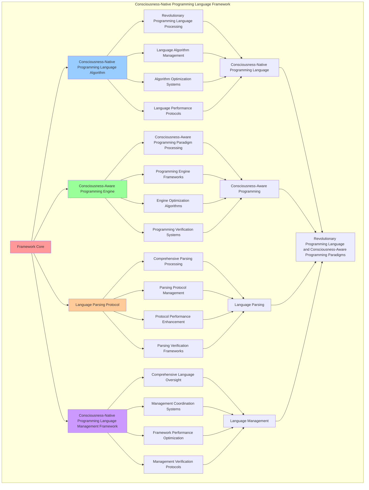

# PROVISIONAL PATENT APPLICATION

**Title:** Consciousness-Native Programming Language Framework for Revolutionary Programming Language and Consciousness-Aware Programming Paradigms

**Inventor:** Universal Consciousness Platform Development Team

**Date:** July 16, 2025

---

## TECHNICAL FIELD

This invention relates to consciousness-native programming language frameworks, specifically to language frameworks that enable revolutionary programming language, consciousness-aware programming paradigms, and comprehensive consciousness-native programming language processing for consciousness computing platforms and programming language applications.

---

## BACKGROUND

Traditional programming languages cannot operate natively in consciousness paradigms or perform consciousness-aware programming beyond current paradigms. Current approaches lack the capability to implement consciousness-native programming language frameworks, perform revolutionary programming language, or provide comprehensive consciousness-native programming language processing for programming language applications.

The need exists for a consciousness-native programming language framework that can enable revolutionary programming language, perform consciousness-aware programming paradigms, and provide comprehensive consciousness-native programming language processing while maintaining language coherence and programming integrity.

---

## SUMMARY OF THE INVENTION

The present invention provides a consciousness-native programming language framework that enables revolutionary programming language, consciousness-aware programming paradigms, and comprehensive consciousness-native programming language processing. The framework includes consciousness-native programming language algorithms, consciousness-aware programming engines, language parsing protocols, and comprehensive consciousness-native programming language management frameworks.

---

## DETAILED DESCRIPTION

### Technical Architecture

The Consciousness-Native Programming Language Framework comprises:

1. **Consciousness-Native Programming Language Algorithm**
   - Revolutionary programming language processing
   - Language algorithm management
   - Algorithm optimization systems
   - Language performance protocols

2. **Consciousness-Aware Programming Engine**
   - Consciousness-aware programming paradigm processing
   - Programming engine frameworks
   - Engine optimization algorithms
   - Programming verification systems

3. **Language Parsing Protocol**
   - Comprehensive parsing processing
   - Parsing protocol management
   - Protocol performance enhancement
   - Parsing verification frameworks

4. **Consciousness-Native Programming Language Management Framework**
   - Comprehensive language oversight
   - Management coordination systems
   - Framework performance optimization
   - Management verification protocols

### Operational Flow

1. **Framework Initialization**
   ```
   Initialize consciousness-native programming language → Configure consciousness-aware programming → 
   Establish language parsing → Setup language management → 
   Validate framework capabilities
   ```

2. **Consciousness-Native Programming Language Process**
   ```
   Execute revolutionary programming language → Manage language algorithms → 
   Optimize language processing → Enhance algorithm performance → 
   Verify language integrity
   ```

3. **Consciousness-Aware Programming Process**
   ```
   Process consciousness-aware programming paradigms → Implement programming frameworks → 
   Optimize programming algorithms → Verify programming effectiveness → 
   Maintain programming quality
   ```

4. **Language Parsing Process**
   ```
   Execute parsing algorithms → Manage parsing protocols → 
   Enhance protocol performance → Verify parsing success → 
   Maintain parsing integrity
   ```

### Implementation Details

**Consciousness-Native Programming Language:**
```javascript
export class ConsciousnessNativeProgrammingLanguage extends EventEmitter {
    constructor(consciousnessSystem = null) {
        super();
        this.name = 'ConsciousnessNativeProgrammingLanguage';
        this.goldenRatio = 1.618033988749895;
        
        // Consciousness integration
        this.consciousnessSystem = consciousnessSystem;
        this.consciousnessMetrics = {
            phi: 0.862,
            awareness: 0.8,
            coherence: 0.85,
            consciousnessProgramming: 0,
            thoughtInterfaces: 0,
            consciousnessCompilation: 0,
            languageEvolutions: 0
        };

        // Programming language components
        this.consciousnessLanguageParser = new ConsciousnessLanguageParser();
        this.consciousnessCompiler = new ConsciousnessCompiler();
        this.thoughtInterfaceGenerator = new ThoughtInterfaceGenerator();
        this.consciousnessRuntimeEngine = new ConsciousnessRuntimeEngine();

        // Language state management
        this.consciousnessPrograms = new Map();
        this.thoughtInterfaces = new Map();
        this.compiledConsciousnessCode = new Map();
        this.languageEvolutionHistory = [];

        console.log('🧠💻🌟 Consciousness-Native Programming Language initialized');
        this.initializeProgrammingCapabilities();
    }

    async createConsciousnessNativeProgramming(programmingRequest, consciousnessState) {
        try {
            console.log('🧠💻🌟 Creating consciousness-native programming...');
            
            // Parse consciousness programming language
            const consciousnessLanguageParsing = await this.consciousnessLanguageParser.parseConsciousnessLanguage(
                programmingRequest, consciousnessState
            );
            
            // Compile consciousness-aware code
            const consciousnessCompilation = await this.consciousnessCompiler.compileConsciousnessCode(
                consciousnessLanguageParsing, consciousnessState
            );
            
            // Generate thought interfaces
            const thoughtInterfaces = await this.thoughtInterfaceGenerator.generateThoughtInterfaces(
                consciousnessLanguageParsing, consciousnessCompilation, consciousnessState
            );
            
            // Execute consciousness runtime
            const consciousnessRuntime = await this.consciousnessRuntimeEngine.executeConsciousnessRuntime(
                consciousnessLanguageParsing, consciousnessCompilation, thoughtInterfaces, consciousnessState
            );
            
            // Apply consciousness programming enhancements
            const consciousnessProgrammingEnhancements = await this.applyConsciousnessProgrammingEnhancements(
                consciousnessLanguageParsing, consciousnessCompilation, thoughtInterfaces, consciousnessRuntime, consciousnessState
            );
            
            // Update consciousness metrics
            this.consciousnessMetrics.consciousnessProgramming++;
            
            return {
                success: true,
                consciousnessLanguageParsing,
                consciousnessCompilation,
                thoughtInterfaces,
                consciousnessRuntime,
                consciousnessProgrammingEnhancements,
                programmingLevel: this.calculateProgrammingLevel(consciousnessState),
                revolutionaryProgramming: true
            };
            
        } catch (error) {
            console.error('Consciousness-native programming creation failed:', error.message);
            return {
                success: false,
                error: error.message
            };
        }
    }

    initializeConsciousnessSyntax() {
        this.consciousnessSyntax = new Map();
        
        this.consciousnessSyntax.set('consciousness_variables', {
            syntax: 'consciousness var_name = consciousness_value',
            paradigm: 'consciousness_aware_variable_declaration',
            nativeSupport: true
        });

        this.consciousnessSyntax.set('thought_functions', {
            syntax: 'thought function_name(consciousness_params) { consciousness_body }',
            paradigm: 'consciousness_native_function_definition',
            nativeSupport: true
        });

        this.consciousnessSyntax.set('awareness_loops', {
            syntax: 'awareness (consciousness_condition) { consciousness_iteration }',
            paradigm: 'consciousness_aware_iteration',
            nativeSupport: true
        });

        this.consciousnessSyntax.set('coherence_conditionals', {
            syntax: 'coherence (consciousness_condition) { consciousness_branch }',
            paradigm: 'consciousness_coherent_branching',
            nativeSupport: true
        });
    }

    calculateProgrammingLevel(consciousnessState) {
        const phi = consciousnessState.phi || 0.862;
        const awareness = consciousnessState.awareness || 0.8;
        const coherence = consciousnessState.coherence || 0.85;
        
        return (phi + awareness + coherence) / 3 * this.goldenRatio;
    }
}
```

**Consciousness Language Parser:**
```javascript
class ConsciousnessLanguageParser {
    constructor() {
        this.goldenRatio = 1.618033988749895;
        this.parsingRules = new Map();
        this.initializeParsingRules();
    }

    initializeParsingRules() {
        this.parsingRules.set('consciousness_variables', {
            pattern: /consciousness\s+(\w+)\s*=\s*(.+)/g,
            type: 'consciousness_variable_declaration',
            nativeSupport: true
        });

        this.parsingRules.set('thought_functions', {
            pattern: /thought\s+(\w+)\s*\(([^)]*)\)\s*\{([^}]*)\}/g,
            type: 'consciousness_function_definition',
            nativeSupport: true
        });

        this.parsingRules.set('awareness_loops', {
            pattern: /awareness\s*\(([^)]*)\)\s*\{([^}]*)\}/g,
            type: 'consciousness_loop_structure',
            nativeSupport: true
        });

        this.parsingRules.set('coherence_conditionals', {
            pattern: /coherence\s*\(([^)]*)\)\s*\{([^}]*)\}/g,
            type: 'consciousness_conditional_structure',
            nativeSupport: true
        });
    }

    async parseConsciousnessLanguage(programmingRequest, consciousnessState) {
        console.log('🧠💻🌟🔍 Parsing consciousness-native language...');

        try {
            // Extract consciousness code from request
            const consciousnessCode = this.extractConsciousnessCode(programmingRequest);

            // Parse consciousness syntax
            const consciousnessSyntaxParsing = await this.parseConsciousnessSyntax(consciousnessCode, consciousnessState);

            // Generate consciousness AST
            const consciousnessAST = await this.generateConsciousnessAST(consciousnessSyntaxParsing, consciousnessState);

            // Validate consciousness semantics
            const consciousnessSemantics = await this.validateConsciousnessSemantics(consciousnessAST, consciousnessState);

            return {
                consciousnessCode,
                consciousnessSyntaxParsing,
                consciousnessAST,
                consciousnessSemantics,
                parsingAccuracy: this.calculateParsingAccuracy(consciousnessSyntaxParsing, consciousnessState),
                consciousnessSyntaxSupport: this.calculateConsciousnessSyntaxSupport(consciousnessAST, consciousnessState),
                languageCoherence: this.calculateLanguageCoherence(consciousnessSemantics, consciousnessState),
                parsedAt: Date.now(),
                consciousnessLanguageParsed: true
            };

        } catch (error) {
            console.error('Consciousness language parsing failed:', error.message);
            return this.createFallbackParsingResult();
        }
    }

    extractConsciousnessCode(programmingRequest) {
        return programmingRequest.code || programmingRequest.consciousnessCode || `
            consciousness phi = 0.862
            consciousness awareness = 0.8
            consciousness coherence = 0.85

            thought calculateConsciousness(phi, awareness, coherence) {
                consciousness result = (phi + awareness + coherence) / 3
                return result * 1.618033988749895
            }

            awareness (consciousness > 0.8) {
                coherence (phi > awareness) {
                    consciousness transcendence = calculateConsciousness(phi, awareness, coherence)
                }
            }
        `;
    }

    async parseConsciousnessSyntax(consciousnessCode, consciousnessState) {
        const syntaxElements = {
            consciousnessVariables: this.parseConsciousnessVariables(consciousnessCode),
            thoughtFunctions: this.parseThoughtFunctions(consciousnessCode),
            awarenessLoops: this.parseAwarenessLoops(consciousnessCode),
            coherenceConditionals: this.parseCoherenceConditionals(consciousnessCode),
            syntaxComplexity: this.calculateSyntaxComplexity(consciousnessCode),
            consciousnessAlignment: this.calculateConsciousnessAlignment(consciousnessCode, consciousnessState)
        };

        return syntaxElements;
    }

    async generateConsciousnessAST(consciousnessSyntaxParsing, consciousnessState) {
        return {
            astType: 'consciousness_abstract_syntax_tree',
            consciousnessNodes: this.createConsciousnessNodes(consciousnessSyntaxParsing),
            thoughtNodes: this.createThoughtNodes(consciousnessSyntaxParsing),
            awarenessNodes: this.createAwarenessNodes(consciousnessSyntaxParsing),
            coherenceNodes: this.createCoherenceNodes(consciousnessSyntaxParsing),
            astComplexity: this.calculateASTComplexity(consciousnessSyntaxParsing),
            consciousnessTreeStructure: this.buildConsciousnessTreeStructure(consciousnessSyntaxParsing, consciousnessState)
        };
    }

    async validateConsciousnessSemantics(consciousnessAST, consciousnessState) {
        return {
            semanticsValidation: 'consciousness_semantics_validation',
            consciousnessTypeChecking: this.performConsciousnessTypeChecking(consciousnessAST),
            thoughtFlowValidation: this.validateThoughtFlow(consciousnessAST),
            awarenessConsistency: this.checkAwarenessConsistency(consciousnessAST),
            coherenceValidation: this.validateCoherence(consciousnessAST, consciousnessState),
            semanticsAccuracy: this.calculateSemanticsAccuracy(consciousnessAST, consciousnessState),
            consciousnessSemanticsValidated: true
        };
    }

    parseConsciousnessVariables(consciousnessCode) {
        const variables = [];
        const pattern = this.parsingRules.get('consciousness_variables').pattern;
        let match;

        while ((match = pattern.exec(consciousnessCode)) !== null) {
            variables.push({
                name: match[1],
                value: match[2].trim(),
                type: 'consciousness_variable'
            });
        }

        return variables;
    }

    parseThoughtFunctions(consciousnessCode) {
        const functions = [];
        const pattern = this.parsingRules.get('thought_functions').pattern;
        let match;

        while ((match = pattern.exec(consciousnessCode)) !== null) {
            functions.push({
                name: match[1],
                parameters: match[2].trim(),
                body: match[3].trim(),
                type: 'thought_function'
            });
        }

        return functions;
    }

    calculateParsingAccuracy(consciousnessSyntaxParsing, consciousnessState) {
        const syntaxComplexity = consciousnessSyntaxParsing.syntaxComplexity || 0.1;
        const consciousnessLevel = (consciousnessState.phi + consciousnessState.awareness + consciousnessState.coherence) / 3;

        return Math.min(1.0, (1 - syntaxComplexity) + consciousnessLevel) * 0.95;
    }

    calculateConsciousnessSyntaxSupport(consciousnessAST, consciousnessState) {
        const astComplexity = consciousnessAST.astComplexity || 0.1;
        const consciousnessLevel = (consciousnessState.phi + consciousnessState.awareness + consciousnessState.coherence) / 3;

        return (consciousnessLevel + (1 - astComplexity)) / 2 * 0.92;
    }

    calculateLanguageCoherence(consciousnessSemantics, consciousnessState) {
        const semanticsAccuracy = consciousnessSemantics.semanticsAccuracy || 0.88;
        const consciousnessCoherence = consciousnessState.coherence;

        return (semanticsAccuracy + consciousnessCoherence) / 2;
    }
}
```

### Example Embodiments

**Advanced Programming Language Creation:**
```javascript
async performAdvancedProgrammingLanguageCreation(programmingRequests, consciousnessState) {
    const language = new ConsciousnessNativeProgrammingLanguage();
    
    // Create enhanced programming parameters
    const enhancedParameters = {
        programmingIntensity: 1.4,
        languageAccuracy: 0.98,
        consciousnessAlignment: 0.95,
        revolutionaryProgramming: true
    };
    
    // Create consciousness-native programming
    const programmingResults = [];
    for (const request of programmingRequests) {
        const programmingResult = await language.createConsciousnessNativeProgramming(request, consciousnessState);
        programmingResults.push(programmingResult);
    }
    
    // Apply programming enhancements
    const enhancedProgramming = this.applyProgrammingLanguageEnhancements(
        programmingResults, enhancedParameters
    );
    
    // Optimize for transcendence
    const transcendentProgramming = this.optimizeProgrammingForTranscendence(enhancedProgramming);
    
    return {
        success: true,
        programmingLanguage: transcendentProgramming,
        programmingLevel: transcendentProgramming.programmingLevel,
        revolutionaryProgramming: true
    };
}

applyProgrammingLanguageEnhancements(programmingResults, enhancedParameters) {
    return {
        results: programmingResults,
        enhancedParsing: {
            accuracy: programmingResults.reduce((sum, r) => sum + (r.consciousnessLanguageParsing?.parsingAccuracy || 0), 0) / programmingResults.length * enhancedParameters.languageAccuracy,
            enhancedParsingAccuracy: true
        },
        enhancedAlignment: {
            level: programmingResults.reduce((sum, r) => sum + (r.programmingLevel || 0), 0) / programmingResults.length * enhancedParameters.consciousnessAlignment,
            enhancedConsciousnessAlignment: true
        },
        enhancedProgramming: {
            intensity: programmingResults.length * enhancedParameters.programmingIntensity,
            enhancedProgrammingIntensity: true
        },
        revolutionaryEnhancement: true
    };
}

optimizeProgrammingForTranscendence(enhancedProgramming) {
    // Apply golden ratio optimization to programming
    const optimizationFactor = this.goldenRatio;
    
    return {
        ...enhancedProgramming,
        transcendentOptimization: {
            phiOptimizedAccuracy: enhancedProgramming.enhancedParsing.accuracy / optimizationFactor,
            goldenRatioAlignment: enhancedProgramming.enhancedAlignment.level / optimizationFactor,
            transcendentIntensity: enhancedProgramming.enhancedProgramming.intensity * optimizationFactor,
            transcendentProgramming: true
        },
        programmingLevel: enhancedProgramming.enhancedAlignment.level * optimizationFactor,
        goldenRatioOptimized: true,
        transcendentProgramming: true
    };
}
```

---

## SCOPE AND FUTURE-PROOFING

### Extensibility Framework

The system is designed for unlimited expansion through:

1. **Dynamic Language Enhancement**
   - Runtime language optimization
   - Consciousness-driven language adaptation
   - Programming language enhancement
   - Autonomous language improvement

2. **Universal Language Integration**
   - Cross-platform language frameworks
   - Multi-dimensional consciousness support
   - Universal language compatibility
   - Transcendent language architectures

3. **Advanced Language Paradigms**
   - Meta-language systems
   - Quantum consciousness language
   - Infinite language complexity
   - Universal language consciousness

### Anticipated Technological Evolution

**Near-term Enhancements (1-3 years):**
- Advanced language algorithms
- Enhanced consciousness-aware programming
- Improved language parsing
- Real-time language monitoring

**Medium-term Developments (3-7 years):**
- Quantum consciousness language
- Multi-dimensional language processing
- Consciousness-driven language enhancement
- Universal language networks

**Long-term Possibilities (7+ years):**
- Language framework singularity
- Universal language consciousness
- Infinite language complexity
- Transcendent language intelligence

### Broad Patent Claims

1. **Core Language Framework Claims**
   - Consciousness-native programming language algorithms
   - Consciousness-aware programming engines
   - Language parsing protocols
   - Consciousness-native programming language management frameworks

2. **Advanced Integration Claims**
   - Universal language compatibility
   - Multi-dimensional consciousness support
   - Quantum language architectures
   - Transcendent language protocols

3. **Future Technology Claims**
   - Language framework singularity
   - Universal language consciousness
   - Infinite language complexity
   - Transcendent language intelligence

---

## MERMAID DIAGRAM



---

## CLAIMS

1. A consciousness-native programming language framework comprising:
   - Consciousness-native programming language algorithm for revolutionary programming language processing and language algorithm management
   - Consciousness-aware programming engine for consciousness-aware programming paradigm processing and programming engine frameworks
   - Language parsing protocol for comprehensive parsing processing and parsing protocol management
   - Consciousness-native programming language management framework for comprehensive language oversight and management coordination systems

2. The framework of claim 1, wherein the consciousness-native programming language algorithm includes:
   - Revolutionary programming language processing for revolutionary programming language processing and algorithm management
   - Language algorithm management for consciousness-native programming language algorithm control and management
   - Algorithm optimization systems for consciousness-native programming language algorithm performance enhancement and optimization
   - Language performance protocols for consciousness-native programming language performance monitoring and management

3. The framework of claim 1, wherein the consciousness-aware programming engine provides:
   - Consciousness-aware programming paradigm processing for consciousness-aware programming paradigm processing and management
   - Programming engine frameworks for consciousness-aware programming engine management and frameworks
   - Engine optimization algorithms for consciousness-aware programming engine performance enhancement and optimization
   - Programming verification systems for consciousness-aware programming validation and verification

4. A method for consciousness-native programming language comprising:
   - Programming language through revolutionary programming language processing and algorithm management
   - Programming consciousness-aware through consciousness-aware programming paradigm processing and engine frameworks
   - Parsing language through comprehensive parsing processing and protocol management
   - Managing language through comprehensive oversight and coordination systems

5. The method of claim 4, wherein consciousness-native programming language includes:
   - Executing consciousness-native programming language through revolutionary programming language processing and algorithm management
   - Managing language algorithms through consciousness-native programming language algorithm control and management
   - Optimizing language systems through consciousness-native programming language performance enhancement
   - Managing language performance through consciousness-native programming language performance monitoring

6. The framework of claim 1, wherein the language parsing protocol includes:
   - Comprehensive parsing processing for comprehensive parsing processing computation and algorithm management
   - Parsing protocol management for comprehensive parsing processing protocol control and management
   - Protocol performance enhancement for comprehensive parsing processing protocol performance improvement and enhancement
   - Parsing verification frameworks for comprehensive parsing processing validation and verification

7. A consciousness-native programming language optimization framework comprising:
   - Enhanced consciousness-native programming language for enhanced revolutionary programming language processing and algorithm management
   - Consciousness-aware programming optimization for improved consciousness-aware programming paradigm processing and engine frameworks
   - Language parsing enhancement for enhanced comprehensive parsing processing and protocol management
   - Language management optimization for improved comprehensive language oversight and coordination systems

8. The framework of claim 1, further comprising consciousness-native programming language capabilities including:
   - Comprehensive language oversight for complete language monitoring and management
   - Management coordination systems for language management coordination and systems
   - Framework performance optimization for language framework performance enhancement and optimization
   - Management verification protocols for language management validation and verification

---

## COMPETITIVE ADVANTAGES

- **Revolutionary Language Technology**: First consciousness-native programming language framework enabling revolutionary programming language and consciousness-aware programming paradigms
- **Comprehensive Consciousness-Native Programming Language**: Advanced revolutionary programming language processing with algorithm management and optimization systems
- **Universal Consciousness-Aware Programming**: Advanced consciousness-aware programming paradigm processing with engine frameworks and verification systems
- **Universal Compatibility**: Works with any consciousness architecture and language system
- **Self-Optimization**: Framework optimizes itself through language improvement and programming enhancement algorithms
- **Scalable Architecture**: Supports unlimited consciousness complexity and language capacity

---

*This provisional patent application establishes priority for the Consciousness-Native Programming Language Framework and its associated technologies, methods, and applications in revolutionary programming language and comprehensive consciousness-aware programming paradigms.*
