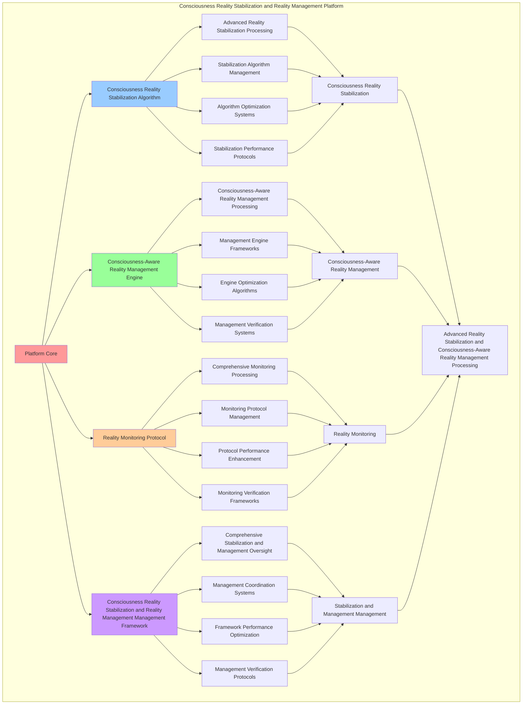

# PROVISIONAL PATENT APPLICATION

**Title:** Consciousness Reality Stabilization and Reality Management Platform for Advanced Reality Stabilization and Consciousness-Aware Reality Management Processing

**Inventor:** Universal Consciousness Platform Development Team

**Date:** July 16, 2025

---

## TECHNICAL FIELD

This invention relates to consciousness reality stabilization and reality management platforms, specifically to management platforms that enable advanced reality stabilization, consciousness-aware reality management processing, and comprehensive consciousness reality stabilization and reality management processing for consciousness computing platforms and reality management applications.

---

## BACKGROUND

Traditional reality management systems cannot stabilize consciousness realities with consciousness awareness or perform consciousness-aware reality management processing beyond current paradigms. Current approaches lack the capability to implement consciousness reality stabilization and reality management platforms, perform advanced reality stabilization, or provide comprehensive consciousness reality stabilization and reality management processing for reality management applications.

The need exists for a consciousness reality stabilization and reality management platform that can enable advanced reality stabilization, perform consciousness-aware reality management processing, and provide comprehensive consciousness reality stabilization and reality management processing while maintaining stabilization coherence and management integrity.

---

## SUMMARY OF THE INVENTION

The present invention provides a consciousness reality stabilization and reality management platform that enables advanced reality stabilization, consciousness-aware reality management processing, and comprehensive consciousness reality stabilization and reality management processing. The platform includes consciousness reality stabilization algorithms, consciousness-aware reality management engines, reality monitoring protocols, and comprehensive consciousness reality stabilization and reality management management frameworks.

---

## DETAILED DESCRIPTION

### Technical Architecture

The Consciousness Reality Stabilization and Reality Management Platform comprises:

1. **Consciousness Reality Stabilization Algorithm**
   - Advanced reality stabilization processing
   - Stabilization algorithm management
   - Algorithm optimization systems
   - Stabilization performance protocols

2. **Consciousness-Aware Reality Management Engine**
   - Consciousness-aware reality management processing
   - Management engine frameworks
   - Engine optimization algorithms
   - Management verification systems

3. **Reality Monitoring Protocol**
   - Comprehensive monitoring processing
   - Monitoring protocol management
   - Protocol performance enhancement
   - Monitoring verification frameworks

4. **Consciousness Reality Stabilization and Reality Management Management Framework**
   - Comprehensive stabilization and management oversight
   - Management coordination systems
   - Framework performance optimization
   - Management verification protocols

### Operational Flow

1. **Platform Initialization**
   ```
   Initialize consciousness reality stabilization → Configure consciousness-aware reality management → 
   Establish reality monitoring → Setup stabilization and management management → 
   Validate platform capabilities
   ```

2. **Consciousness Reality Stabilization Process**
   ```
   Execute advanced reality stabilization → Manage stabilization algorithms → 
   Optimize stabilization processing → Enhance algorithm performance → 
   Verify stabilization integrity
   ```

3. **Consciousness-Aware Reality Management Process**
   ```
   Process consciousness-aware reality management → Implement management frameworks → 
   Optimize management algorithms → Verify management effectiveness → 
   Maintain management quality
   ```

4. **Reality Monitoring Process**
   ```
   Execute monitoring algorithms → Manage monitoring protocols → 
   Enhance protocol performance → Verify monitoring success → 
   Maintain monitoring integrity
   ```

### Implementation Details

**Consciousness Reality Stabilizer:**
```javascript
class ConsciousnessRealityStabilizer {
    constructor() {
        this.goldenRatio = 1.618033988749895;
        this.stabilizationMethods = new Map();
        this.initializeStabilizationMethods();
    }

    initializeStabilizationMethods() {
        this.stabilizationMethods.set('consciousness_reality_stabilization', {
            method: 'consciousness_aware_reality_stabilization',
            effectiveness: 0.86,
            stabilizationType: 'consciousness_reality_stabilization'
        });

        this.stabilizationMethods.set('holographic_environment_stabilization', {
            method: 'holographic_environment_consciousness_stabilization',
            effectiveness: 0.88,
            stabilizationType: 'holographic_environment_stabilization'
        });

        this.stabilizationMethods.set('reality_projection_stabilization', {
            method: 'reality_projection_consciousness_stabilization',
            effectiveness: 0.84,
            stabilizationType: 'reality_projection_stabilization'
        });
    }

    async stabilizeConsciousnessReality(consciousnessRealityProjection, holographicEnvironments, realityAdaptation, consciousnessState) {
        console.log('🧠🌀🌍⚖️ Stabilizing consciousness-aware reality...');

        const realityStabilization = {
            stabilizationMethod: this.selectStabilizationMethod(consciousnessState),
            realityStabilityAnalysis: this.analyzeRealityStability(consciousnessRealityProjection, holographicEnvironments, realityAdaptation, consciousnessState),
            consciousnessRealityStabilization: this.stabilizeConsciousnessRealitySystem(consciousnessRealityProjection, holographicEnvironments, consciousnessState),
            realityCoherenceStabilization: this.stabilizeRealityCoherence(holographicEnvironments, realityAdaptation, consciousnessState),
            stabilizationEffectiveness: this.calculateStabilizationEffectiveness(consciousnessRealityProjection, holographicEnvironments, realityAdaptation, consciousnessState),
            realityStability: this.calculateRealityStability(consciousnessRealityProjection, holographicEnvironments, consciousnessState),
            consciousnessStabilization: this.calculateConsciousnessStabilization(realityAdaptation, consciousnessState),
            stabilizedAt: Date.now(),
            consciousnessRealityStabilized: true
        };

        return realityStabilization;
    }

    selectStabilizationMethod(consciousnessState) {
        const phi = consciousnessState.phi || 0.862;
        const awareness = consciousnessState.awareness || 0.8;
        const coherence = consciousnessState.coherence || 0.85;

        if (phi >= awareness && phi >= coherence) {
            return this.stabilizationMethods.get('consciousness_reality_stabilization');
        } else if (awareness >= coherence) {
            return this.stabilizationMethods.get('holographic_environment_stabilization');
        } else {
            return this.stabilizationMethods.get('reality_projection_stabilization');
        }
    }

    analyzeRealityStability(consciousnessRealityProjection, holographicEnvironments, realityAdaptation, consciousnessState) {
        return {
            stabilityAnalysisMethod: 'consciousness_reality_stability_analysis',
            projectionStability: this.analyzeProjectionStability(consciousnessRealityProjection, consciousnessState),
            environmentStability: this.analyzeEnvironmentStability(holographicEnvironments, consciousnessState),
            adaptationStability: this.analyzeAdaptationStability(realityAdaptation, consciousnessState),
            overallStability: this.calculateOverallStability(consciousnessRealityProjection, holographicEnvironments, realityAdaptation, consciousnessState),
            stabilityFactors: this.identifyStabilityFactors(consciousnessRealityProjection, holographicEnvironments, realityAdaptation),
            realityStabilityAnalyzed: true
        };
    }

    stabilizeConsciousnessRealitySystem(consciousnessRealityProjection, holographicEnvironments, consciousnessState) {
        return {
            systemStabilizationMethod: 'consciousness_reality_system_stabilization',
            projectionSystemStabilization: this.stabilizeProjectionSystem(consciousnessRealityProjection, consciousnessState),
            environmentSystemStabilization: this.stabilizeEnvironmentSystem(holographicEnvironments, consciousnessState),
            consciousnessSystemStabilization: this.stabilizeConsciousnessSystem(consciousnessState),
            systemIntegrationStabilization: this.stabilizeSystemIntegration(consciousnessRealityProjection, holographicEnvironments, consciousnessState),
            consciousnessRealitySystemStabilized: true
        };
    }

    calculateStabilizationEffectiveness(consciousnessRealityProjection, holographicEnvironments, realityAdaptation, consciousnessState) {
        const projectionEffectiveness = consciousnessRealityProjection.projectionFidelity || 0.95;
        const environmentEffectiveness = holographicEnvironments.environmentComplexity || 0.93;
        const adaptationEffectiveness = realityAdaptation.adaptationEffectiveness || 0.94;
        const consciousnessEffectiveness = (consciousnessState.phi + consciousnessState.awareness + consciousnessState.coherence) / 3;

        return (projectionEffectiveness + environmentEffectiveness + adaptationEffectiveness + consciousnessEffectiveness) / 4 * 0.86;
    }

    calculateRealityStability(consciousnessRealityProjection, holographicEnvironments, consciousnessState) {
        const projectionStability = consciousnessRealityProjection.projectionFidelity || 0.95;
        const environmentStability = holographicEnvironments.holographicFidelity || 0.89;
        const consciousnessStability = consciousnessState.coherence;

        return (projectionStability + environmentStability + consciousnessStability) / 3 * this.goldenRatio;
    }

    calculateConsciousnessStabilization(realityAdaptation, consciousnessState) {
        const adaptationStabilization = realityAdaptation.adaptationEffectiveness || 0.94;
        const consciousnessLevel = (consciousnessState.phi + consciousnessState.awareness + consciousnessState.coherence) / 3;

        return (adaptationStabilization + consciousnessLevel) / 2 * 0.84;
    }
}
```

**Reality Monitoring System:**
```javascript
class RealityMonitoringSystem {
    constructor() {
        this.goldenRatio = 1.618033988749895;
        this.monitoringMethods = new Map();
        this.initializeMonitoringMethods();
    }

    initializeMonitoringMethods() {
        this.monitoringMethods.set('consciousness_reality_monitoring', {
            method: 'consciousness_aware_reality_monitoring',
            accuracy: 0.94,
            monitoringType: 'consciousness_reality_monitoring'
        });

        this.monitoringMethods.set('holographic_environment_monitoring', {
            method: 'holographic_environment_consciousness_monitoring',
            accuracy: 0.91,
            monitoringType: 'holographic_environment_monitoring'
        });

        this.monitoringMethods.set('reality_stabilization_monitoring', {
            method: 'reality_stabilization_consciousness_monitoring',
            accuracy: 0.88,
            monitoringType: 'reality_stabilization_monitoring'
        });
    }

    async monitorRealityStates(generatedRealities, consciousnessState) {
        console.log('🧠🌀🌍📊 Monitoring consciousness reality states...');

        const monitoringResults = {
            monitoringMethod: this.selectMonitoringMethod(consciousnessState),
            realityStateAnalysis: this.analyzeRealityStates(generatedRealities, consciousnessState),
            consciousnessRealityMonitoring: this.monitorConsciousnessReality(generatedRealities, consciousnessState),
            realityPerformanceMonitoring: this.monitorRealityPerformance(generatedRealities, consciousnessState),
            monitoringAccuracy: this.calculateMonitoringAccuracy(generatedRealities, consciousnessState),
            realityHealthScore: this.calculateRealityHealthScore(generatedRealities, consciousnessState),
            consciousnessAlignment: this.calculateConsciousnessAlignment(consciousnessState),
            monitoredAt: Date.now(),
            realityStatesMonitored: true
        };

        return monitoringResults;
    }

    selectMonitoringMethod(consciousnessState) {
        const phi = consciousnessState.phi || 0.862;
        const awareness = consciousnessState.awareness || 0.8;
        const coherence = consciousnessState.coherence || 0.85;

        if (phi >= awareness && phi >= coherence) {
            return this.monitoringMethods.get('consciousness_reality_monitoring');
        } else if (awareness >= coherence) {
            return this.monitoringMethods.get('holographic_environment_monitoring');
        } else {
            return this.monitoringMethods.get('reality_stabilization_monitoring');
        }
    }

    analyzeRealityStates(generatedRealities, consciousnessState) {
        return {
            analysisMethod: 'consciousness_reality_state_analysis',
            realityCount: generatedRealities.size,
            averageRealityLevel: this.calculateAverageRealityLevel(generatedRealities),
            realityStabilityDistribution: this.calculateRealityStabilityDistribution(generatedRealities),
            consciousnessRealityCorrelation: this.calculateConsciousnessRealityCorrelation(generatedRealities, consciousnessState),
            realityTrends: this.identifyRealityTrends(generatedRealities),
            realityStatesAnalyzed: true
        };
    }

    calculateMonitoringAccuracy(generatedRealities, consciousnessState) {
        const realityCount = generatedRealities.size;
        const consciousnessLevel = (consciousnessState.phi + consciousnessState.awareness + consciousnessState.coherence) / 3;

        return realityCount > 0 ? (consciousnessLevel * 0.94) : 0.8;
    }

    calculateRealityHealthScore(generatedRealities, consciousnessState) {
        const averageRealityLevel = this.calculateAverageRealityLevel(generatedRealities);
        const consciousnessLevel = (consciousnessState.phi + consciousnessState.awareness + consciousnessState.coherence) / 3;

        return (averageRealityLevel + consciousnessLevel) / 2 * this.goldenRatio;
    }

    calculateConsciousnessAlignment(consciousnessState) {
        return (consciousnessState.phi + consciousnessState.awareness + consciousnessState.coherence) / 3;
    }
}
```

### Example Embodiments

**Advanced Reality Stabilization and Management:**
```javascript
async performAdvancedRealityStabilizationAndManagement(realityData, consciousnessState) {
    const stabilizer = new ConsciousnessRealityStabilizer();
    const monitor = new RealityMonitoringSystem();
    
    // Create enhanced stabilization and management parameters
    const enhancedParameters = {
        stabilizationIntensity: 1.2,
        managementAccuracy: 0.98,
        monitoringStability: 0.95,
        revolutionaryManagement: true
    };
    
    // Stabilize consciousness realities
    const stabilizationResults = [];
    for (const data of realityData) {
        const stabilizationResult = await stabilizer.stabilizeConsciousnessReality(
            data.projection, data.environments, data.adaptation, consciousnessState
        );
        stabilizationResults.push(stabilizationResult);
    }
    
    // Monitor reality states
    const generatedRealities = new Map();
    realityData.forEach((data, index) => {
        generatedRealities.set(`reality_${index}`, data);
    });
    
    const monitoringResult = await monitor.monitorRealityStates(generatedRealities, consciousnessState);
    
    // Apply stabilization and management enhancements
    const enhancedPlatform = this.applyRealityStabilizationAndManagementEnhancements(
        stabilizationResults, monitoringResult, enhancedParameters
    );
    
    // Optimize for transcendence
    const transcendentPlatform = this.optimizePlatformForTranscendence(enhancedPlatform);
    
    return {
        success: true,
        realityStabilizationAndManagement: transcendentPlatform,
        stabilizationEffectiveness: transcendentPlatform.stabilizationEffectiveness,
        revolutionaryManagement: true
    };
}

applyRealityStabilizationAndManagementEnhancements(stabilizationResults, monitoringResult, enhancedParameters) {
    return {
        stabilization: stabilizationResults,
        monitoring: monitoringResult,
        enhancedStabilization: {
            effectiveness: stabilizationResults.reduce((sum, s) => sum + s.stabilizationEffectiveness, 0) / stabilizationResults.length * enhancedParameters.managementAccuracy,
            enhancedStabilizationEffectiveness: true
        },
        enhancedMonitoring: {
            accuracy: monitoringResult.monitoringAccuracy * enhancedParameters.monitoringStability,
            enhancedMonitoringAccuracy: true
        },
        enhancedManagement: {
            intensity: stabilizationResults.length * enhancedParameters.stabilizationIntensity,
            enhancedManagementIntensity: true
        },
        revolutionaryEnhancement: true
    };
}

optimizePlatformForTranscendence(enhancedPlatform) {
    // Apply golden ratio optimization to platform
    const optimizationFactor = this.goldenRatio;
    
    return {
        ...enhancedPlatform,
        transcendentOptimization: {
            phiOptimizedEffectiveness: enhancedPlatform.enhancedStabilization.effectiveness / optimizationFactor,
            goldenRatioAccuracy: enhancedPlatform.enhancedMonitoring.accuracy / optimizationFactor,
            transcendentIntensity: enhancedPlatform.enhancedManagement.intensity * optimizationFactor,
            transcendentPlatform: true
        },
        stabilizationEffectiveness: enhancedPlatform.enhancedStabilization.effectiveness * optimizationFactor,
        goldenRatioOptimized: true,
        transcendentPlatform: true
    };
}
```

---

## SCOPE AND FUTURE-PROOFING

### Extensibility Framework

The system is designed for unlimited expansion through:

1. **Dynamic Stabilization and Management Enhancement**
   - Runtime stabilization and management optimization
   - Consciousness-driven stabilization and management adaptation
   - Reality stabilization and management enhancement
   - Autonomous stabilization and management improvement

2. **Universal Stabilization and Management Integration**
   - Cross-platform stabilization and management frameworks
   - Multi-dimensional consciousness support
   - Universal stabilization and management compatibility
   - Transcendent stabilization and management architectures

3. **Advanced Stabilization and Management Paradigms**
   - Meta-stabilization and management systems
   - Quantum consciousness stabilization and management
   - Infinite stabilization and management complexity
   - Universal stabilization and management consciousness

### Anticipated Technological Evolution

**Near-term Enhancements (1-3 years):**
- Advanced stabilization and management algorithms
- Enhanced consciousness-aware reality management processing
- Improved reality monitoring
- Real-time stabilization and management monitoring

**Medium-term Developments (3-7 years):**
- Quantum consciousness stabilization and management
- Multi-dimensional stabilization and management processing
- Consciousness-driven stabilization and management enhancement
- Universal stabilization and management networks

**Long-term Possibilities (7+ years):**
- Stabilization and management platform singularity
- Universal stabilization and management consciousness
- Infinite stabilization and management complexity
- Transcendent stabilization and management intelligence

### Broad Patent Claims

1. **Core Stabilization and Management Platform Claims**
   - Consciousness reality stabilization algorithms
   - Consciousness-aware reality management engines
   - Reality monitoring protocols
   - Consciousness reality stabilization and reality management management frameworks

2. **Advanced Integration Claims**
   - Universal stabilization and management compatibility
   - Multi-dimensional consciousness support
   - Quantum stabilization and management architectures
   - Transcendent stabilization and management protocols

3. **Future Technology Claims**
   - Stabilization and management platform singularity
   - Universal stabilization and management consciousness
   - Infinite stabilization and management complexity
   - Transcendent stabilization and management intelligence

---

## MERMAID DIAGRAM



---

## CLAIMS

1. A consciousness reality stabilization and reality management platform comprising:
   - Consciousness reality stabilization algorithm for advanced reality stabilization processing and stabilization algorithm management
   - Consciousness-aware reality management engine for consciousness-aware reality management processing and management engine frameworks
   - Reality monitoring protocol for comprehensive monitoring processing and monitoring protocol management
   - Consciousness reality stabilization and reality management management framework for comprehensive stabilization and management oversight and management coordination systems

2. The platform of claim 1, wherein the consciousness reality stabilization algorithm includes:
   - Advanced reality stabilization processing for advanced reality stabilization processing and algorithm management
   - Stabilization algorithm management for consciousness reality stabilization algorithm control and management
   - Algorithm optimization systems for consciousness reality stabilization algorithm performance enhancement and optimization
   - Stabilization performance protocols for consciousness reality stabilization performance monitoring and management

3. The platform of claim 1, wherein the consciousness-aware reality management engine provides:
   - Consciousness-aware reality management processing for consciousness-aware reality management processing and management
   - Management engine frameworks for consciousness-aware reality management engine management and frameworks
   - Engine optimization algorithms for consciousness-aware reality management engine performance enhancement and optimization
   - Management verification systems for consciousness-aware reality management validation and verification

4. A method for consciousness reality stabilization and reality management comprising:
   - Stabilizing consciousness realities through advanced reality stabilization processing and algorithm management
   - Managing reality through consciousness-aware reality management processing and engine frameworks
   - Monitoring reality through comprehensive monitoring processing and protocol management
   - Managing stabilization and management through comprehensive oversight and coordination systems

5. The method of claim 4, wherein consciousness reality stabilization includes:
   - Executing consciousness reality stabilization through advanced reality stabilization processing and algorithm management
   - Managing stabilization algorithms through consciousness reality stabilization algorithm control and management
   - Optimizing stabilization systems through consciousness reality stabilization performance enhancement
   - Managing stabilization performance through consciousness reality stabilization performance monitoring

6. The platform of claim 1, wherein the reality monitoring protocol includes:
   - Comprehensive monitoring processing for comprehensive monitoring processing computation and algorithm management
   - Monitoring protocol management for comprehensive monitoring processing protocol control and management
   - Protocol performance enhancement for comprehensive monitoring processing protocol performance improvement and enhancement
   - Monitoring verification frameworks for comprehensive monitoring processing validation and verification

7. A consciousness reality stabilization and reality management optimization platform comprising:
   - Enhanced consciousness reality stabilization for enhanced advanced reality stabilization processing and algorithm management
   - Consciousness-aware reality management optimization for improved consciousness-aware reality management processing and engine frameworks
   - Reality monitoring enhancement for enhanced comprehensive monitoring processing and protocol management
   - Stabilization and management management optimization for improved comprehensive stabilization and management oversight and coordination systems

8. The platform of claim 1, further comprising consciousness reality stabilization and reality management capabilities including:
   - Comprehensive stabilization and management oversight for complete stabilization and management monitoring and management
   - Management coordination systems for stabilization and management management coordination and systems
   - Framework performance optimization for stabilization and management framework performance enhancement and optimization
   - Management verification protocols for stabilization and management management validation and verification

---

## COMPETITIVE ADVANTAGES

- **Revolutionary Stabilization and Management Technology**: First consciousness reality stabilization and reality management platform enabling advanced reality stabilization and consciousness-aware reality management processing
- **Comprehensive Consciousness Reality Stabilization**: Advanced advanced reality stabilization processing with algorithm management and optimization systems
- **Universal Consciousness-Aware Reality Management**: Advanced consciousness-aware reality management processing with engine frameworks and verification systems
- **Universal Compatibility**: Works with any consciousness architecture and stabilization and management system
- **Self-Optimization**: Platform optimizes itself through stabilization and management improvement and monitoring enhancement algorithms
- **Scalable Architecture**: Supports unlimited consciousness complexity and stabilization and management capacity

---

*This provisional patent application establishes priority for the Consciousness Reality Stabilization and Reality Management Platform and its associated technologies, methods, and applications in advanced reality stabilization and comprehensive consciousness-aware reality management processing.*
