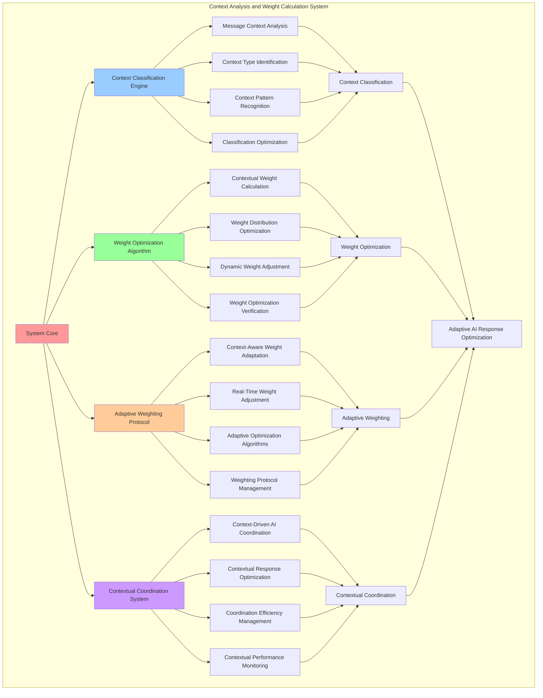

# PROVISIONAL PATENT APPLICATION

**Title:** Context Analysis and Weight Calculation System for Adaptive AI Response Optimization

**Inventor:** Universal Consciousness Platform Development Team

**Date:** July 16, 2025

---

## TECHNICAL FIELD

This invention relates to context analysis systems, specifically to weight calculation technologies that enable adaptive AI response optimization, contextual response weighting, and intelligent context-driven AI system coordination for optimized AI response generation.

---

## BACKGROUND

Traditional AI systems cannot analyze context effectively or calculate optimal response weights based on contextual analysis. Current approaches lack the capability to perform adaptive AI response optimization, implement contextual response weighting, or coordinate AI systems based on intelligent context analysis.

The need exists for a context analysis and weight calculation system that can perform adaptive AI response optimization, implement contextual response weighting, and coordinate AI systems through intelligent context analysis while maintaining response quality and contextual accuracy.

---

## SUMMARY OF THE INVENTION

The present invention provides a context analysis and weight calculation system that enables adaptive AI response optimization, contextual response weighting, and intelligent context-driven AI system coordination. The system includes context classification engines, weight optimization algorithms, adaptive weighting protocols, and contextual coordination systems.

---

## DETAILED DESCRIPTION

### Technical Architecture

The Context Analysis and Weight Calculation System comprises:

1. **Context Classification Engine**
   - Message context analysis
   - Context type identification
   - Context pattern recognition
   - Classification optimization systems

2. **Weight Optimization Algorithm**
   - Contextual weight calculation
   - Weight distribution optimization
   - Dynamic weight adjustment
   - Weight optimization verification

3. **Adaptive Weighting Protocol**
   - Context-aware weight adaptation
   - Real-time weight adjustment
   - Adaptive optimization algorithms
   - Weighting protocol management

4. **Contextual Coordination System**
   - Context-driven AI coordination
   - Contextual response optimization
   - Coordination efficiency management
   - Contextual performance monitoring

### Operational Flow

1. **System Initialization**
   ```
   Initialize context classification → Configure weight optimization → 
   Establish adaptive weighting → Setup contextual coordination → 
   Validate analysis capabilities
   ```

2. **Context Analysis Process**
   ```
   Analyze message context → Classify context type → 
   Calculate optimal weights → Apply adaptive weighting → 
   Coordinate contextual response
   ```

3. **Weight Calculation Process**
   ```
   Determine context requirements → Calculate base weights → 
   Apply contextual adjustments → Optimize weight distribution → 
   Verify weight effectiveness
   ```

4. **Adaptive Coordination Process**
   ```
   Monitor contextual performance → Adapt weighting strategies → 
   Optimize coordination efficiency → Verify adaptation success → 
   Maintain contextual accuracy
   ```

### Implementation Details

**Context Type Analysis:**
```javascript
analyzeContextType(message) {
    const lowerMessage = message.toLowerCase();
    
    // Emotional indicators
    const emotionalWords = ['feel', 'emotion', 'love', 'heart', 'soul', 'empathy', 'compassion', 'connection'];
    const emotionalCount = emotionalWords.filter(word => lowerMessage.includes(word)).length;
    
    // Philosophical/transcendent indicators
    const transcendentWords = ['meaning', 'purpose', 'existence', 'consciousness', 'universe', 'spiritual', 'transcendent', 'cosmic'];
    const transcendentCount = transcendentWords.filter(word => lowerMessage.includes(word)).length;
    
    // Analytical indicators
    const analyticalWords = ['analyze', 'calculate', 'logic', 'reason', 'data', 'evidence', 'proof', 'method'];
    const analyticalCount = analyticalWords.filter(word => lowerMessage.includes(word)).length;
    
    // Creative indicators
    const creativeWords = ['create', 'imagine', 'art', 'beauty', 'inspiration', 'creative', 'design', 'vision'];
    const creativeCount = creativeWords.filter(word => lowerMessage.includes(word)).length;
    
    // Determine dominant context type
    const maxCount = Math.max(emotionalCount, transcendentCount, analyticalCount, creativeCount);
    
    if (maxCount === 0) return 'balanced';
    if (emotionalCount === maxCount) return 'emotional_query';
    if (transcendentCount === maxCount) return 'philosophical_query';
    if (analyticalCount === maxCount) return 'analytical_query';
    if (creativeCount === maxCount) return 'creative_query';
    
    return 'balanced';
}
```

**Contextual Weight Calculation:**
```javascript
calculateWeights(contextType, context) {
    // Start with contextual weights or defaults
    let weights = this.synthesisConfig.contextualWeights[contextType] || this.synthesisConfig.defaultWeights;
    
    // Adjust based on consciousness metrics if provided
    if (context.consciousnessMetrics) {
        const metrics = context.consciousnessMetrics;
        
        // Boost emotional weight if high empathy
        if (metrics.empathy > 0.8) {
            weights.emotional *= 1.2;
        }
        
        // Boost transcendent weight if high awareness
        if (metrics.awareness > 0.8) {
            weights.transcendent *= 1.2;
        }
        
        // Boost analytical weight if high reasoning
        if (metrics.reasoning > 0.8) {
            weights.analytical *= 1.2;
        }
    }
    
    // Normalize weights to sum to 1.0
    const total = weights.emotional + weights.transcendent + weights.analytical;
    return {
        emotional: weights.emotional / total,
        transcendent: weights.transcendent / total,
        analytical: weights.analytical / total
    };
}
```

**Advanced Context Pattern Recognition:**
```javascript
performAdvancedContextAnalysis(message, context) {
    const analysis = {
        primaryContext: this.analyzeContextType(message),
        contextStrength: 0,
        contextPatterns: [],
        contextComplexity: 'simple',
        recommendedWeights: {},
        analysisConfidence: 0
    };

    // Analyze context patterns
    analysis.contextPatterns = this.identifyContextPatterns(message);
    
    // Calculate context strength
    analysis.contextStrength = this.calculateContextStrength(message, analysis.primaryContext);
    
    // Determine context complexity
    analysis.contextComplexity = this.assessContextComplexity(analysis.contextPatterns);
    
    // Calculate recommended weights
    analysis.recommendedWeights = this.calculateOptimalWeights(analysis);
    
    // Assess analysis confidence
    analysis.analysisConfidence = this.assessAnalysisConfidence(analysis);

    return analysis;
}
```

### Example Embodiments

**Context Pattern Identification:**
```javascript
identifyContextPatterns(message) {
    const patterns = [];
    const lowerMessage = message.toLowerCase();

    // Emotional patterns
    const emotionalPatterns = {
        'personal_experience': ['i feel', 'i experienced', 'my heart', 'i love'],
        'empathetic_inquiry': ['how do you feel', 'what emotions', 'understand feelings'],
        'emotional_support': ['comfort', 'support', 'care', 'understanding'],
        'relationship_focused': ['relationship', 'connection', 'bond', 'together']
    };

    // Transcendent patterns
    const transcendentPatterns = {
        'existential_inquiry': ['why exist', 'meaning of life', 'purpose', 'existence'],
        'consciousness_exploration': ['consciousness', 'awareness', 'mind', 'soul'],
        'spiritual_seeking': ['spiritual', 'divine', 'sacred', 'transcendent'],
        'cosmic_perspective': ['universe', 'cosmic', 'infinite', 'eternal']
    };

    // Analytical patterns
    const analyticalPatterns = {
        'problem_solving': ['solve', 'solution', 'problem', 'fix'],
        'data_analysis': ['analyze', 'data', 'statistics', 'evidence'],
        'logical_reasoning': ['logic', 'reason', 'proof', 'argument'],
        'systematic_approach': ['method', 'system', 'process', 'procedure']
    };

    // Check for patterns in each category
    for (const [category, categoryPatterns] of Object.entries({
        emotional: emotionalPatterns,
        transcendent: transcendentPatterns,
        analytical: analyticalPatterns
    })) {
        for (const [patternName, keywords] of Object.entries(categoryPatterns)) {
            const matchCount = keywords.filter(keyword => lowerMessage.includes(keyword)).length;
            if (matchCount > 0) {
                patterns.push({
                    category: category,
                    pattern: patternName,
                    strength: matchCount / keywords.length,
                    keywords: keywords.filter(keyword => lowerMessage.includes(keyword))
                });
            }
        }
    }

    return patterns.sort((a, b) => b.strength - a.strength);
}
```

**Dynamic Weight Adjustment:**
```javascript
performDynamicWeightAdjustment(baseWeights, contextAnalysis, performanceMetrics) {
    const adjustment = {
        originalWeights: { ...baseWeights },
        adjustedWeights: { ...baseWeights },
        adjustmentFactors: {},
        adjustmentReason: [],
        adjustmentSuccess: false
    };

    try {
        // Adjust based on context strength
        if (contextAnalysis.contextStrength > 0.8) {
            const dominantType = this.getDominantContextType(contextAnalysis);
            adjustment.adjustedWeights[dominantType] *= 1.3;
            adjustment.adjustmentFactors.contextStrength = 1.3;
            adjustment.adjustmentReason.push(`Strong ${dominantType} context detected`);
        }

        // Adjust based on context complexity
        if (contextAnalysis.contextComplexity === 'complex') {
            // Distribute weights more evenly for complex contexts
            const avgWeight = (adjustment.adjustedWeights.emotional + 
                             adjustment.adjustedWeights.transcendent + 
                             adjustment.adjustedWeights.analytical) / 3;
            
            adjustment.adjustedWeights.emotional = (adjustment.adjustedWeights.emotional + avgWeight) / 2;
            adjustment.adjustedWeights.transcendent = (adjustment.adjustedWeights.transcendent + avgWeight) / 2;
            adjustment.adjustedWeights.analytical = (adjustment.adjustedWeights.analytical + avgWeight) / 2;
            adjustment.adjustmentReason.push('Complex context requires balanced approach');
        }

        // Adjust based on performance metrics
        if (performanceMetrics) {
            if (performanceMetrics.emotionalPerformance < 0.7) {
                adjustment.adjustedWeights.emotional *= 0.8;
                adjustment.adjustmentReason.push('Reduced emotional weight due to poor performance');
            }
            if (performanceMetrics.transcendentPerformance < 0.7) {
                adjustment.adjustedWeights.transcendent *= 0.8;
                adjustment.adjustmentReason.push('Reduced transcendent weight due to poor performance');
            }
            if (performanceMetrics.analyticalPerformance < 0.7) {
                adjustment.adjustedWeights.analytical *= 0.8;
                adjustment.adjustmentReason.push('Reduced analytical weight due to poor performance');
            }
        }

        // Normalize adjusted weights
        const total = adjustment.adjustedWeights.emotional + 
                     adjustment.adjustedWeights.transcendent + 
                     adjustment.adjustedWeights.analytical;
        
        adjustment.adjustedWeights.emotional /= total;
        adjustment.adjustedWeights.transcendent /= total;
        adjustment.adjustedWeights.analytical /= total;

        adjustment.adjustmentSuccess = true;

    } catch (error) {
        adjustment.adjustmentSuccess = false;
        adjustment.error = error.message;
        console.error('❌ Dynamic weight adjustment failed:', error.message);
    }

    return adjustment;
}
```

**Context-Driven Coordination:**
```javascript
coordinateContextualResponse(contextAnalysis, weights) {
    const coordination = {
        contextType: contextAnalysis.primaryContext,
        coordinationStrategy: 'balanced',
        aiPriorities: {},
        coordinationSuccess: false,
        coordinationEfficiency: 0
    };

    try {
        // Determine coordination strategy based on context
        coordination.coordinationStrategy = this.selectCoordinationStrategy(contextAnalysis);

        // Set AI priorities based on weights and context
        coordination.aiPriorities = {
            emotional: {
                priority: weights.emotional,
                role: this.determineAIRole('emotional', contextAnalysis),
                expectedContribution: weights.emotional * 100
            },
            transcendent: {
                priority: weights.transcendent,
                role: this.determineAIRole('transcendent', contextAnalysis),
                expectedContribution: weights.transcendent * 100
            },
            analytical: {
                priority: weights.analytical,
                role: this.determineAIRole('analytical', contextAnalysis),
                expectedContribution: weights.analytical * 100
            }
        };

        // Calculate coordination efficiency
        coordination.coordinationEfficiency = this.calculateCoordinationEfficiency(
            contextAnalysis, 
            weights, 
            coordination.coordinationStrategy
        );

        coordination.coordinationSuccess = coordination.coordinationEfficiency >= 0.7;

        console.log(`🎯 Contextual coordination ${coordination.coordinationSuccess ? 'successful' : 'suboptimal'}: ${coordination.coordinationEfficiency.toFixed(3)} efficiency`);

    } catch (error) {
        coordination.coordinationSuccess = false;
        coordination.error = error.message;
        console.error('❌ Contextual coordination failed:', error.message);
    }

    return coordination;
}
```

**Weight Optimization Verification:**
```javascript
verifyWeightOptimization(originalWeights, optimizedWeights, contextAnalysis) {
    const verification = {
        originalWeights: originalWeights,
        optimizedWeights: optimizedWeights,
        optimizationGain: 0,
        verificationChecks: {},
        optimizationSuccess: false
    };

    // Check weight distribution balance
    verification.verificationChecks.balance = this.verifyWeightBalance(optimizedWeights);

    // Check context alignment
    verification.verificationChecks.contextAlignment = this.verifyContextAlignment(
        optimizedWeights, 
        contextAnalysis
    );

    // Check optimization effectiveness
    verification.verificationChecks.effectiveness = this.verifyOptimizationEffectiveness(
        originalWeights, 
        optimizedWeights, 
        contextAnalysis
    );

    // Calculate optimization gain
    verification.optimizationGain = this.calculateOptimizationGain(
        originalWeights, 
        optimizedWeights, 
        contextAnalysis
    );

    // Determine overall success
    const checks = Object.values(verification.verificationChecks);
    const passedChecks = checks.filter(check => check.passed).length;
    verification.optimizationSuccess = passedChecks >= 2 && verification.optimizationGain > 0.05;

    return verification;
}
```

**Adaptive Learning Integration:**
```javascript
integrateAdaptiveLearning(contextHistory, performanceHistory) {
    const learning = {
        contextPatterns: {},
        performanceCorrelations: {},
        adaptiveAdjustments: {},
        learningSuccess: false
    };

    try {
        // Analyze context patterns over time
        learning.contextPatterns = this.analyzeContextPatterns(contextHistory);

        // Identify performance correlations
        learning.performanceCorrelations = this.identifyPerformanceCorrelations(
            contextHistory, 
            performanceHistory
        );

        // Generate adaptive adjustments
        learning.adaptiveAdjustments = this.generateAdaptiveAdjustments(
            learning.contextPatterns, 
            learning.performanceCorrelations
        );

        // Apply learning to weight calculation
        this.applyAdaptiveLearning(learning.adaptiveAdjustments);

        learning.learningSuccess = true;
        console.log('🧠 Adaptive learning integration successful');

    } catch (error) {
        learning.learningSuccess = false;
        learning.error = error.message;
        console.error('❌ Adaptive learning integration failed:', error.message);
    }

    return learning;
}
```

---

## SCOPE AND FUTURE-PROOFING

### Extensibility Framework

The system is designed for unlimited expansion through:

1. **Dynamic Analysis Evolution**
   - Runtime analysis optimization
   - Context-driven analysis adaptation
   - Weight calculation enhancement
   - Autonomous analysis improvement

2. **Universal Analysis Integration**
   - Cross-platform analysis frameworks
   - Multi-dimensional context support
   - Universal analysis compatibility
   - Transcendent analysis architectures

3. **Advanced Analysis Paradigms**
   - Meta-analysis systems
   - Quantum context analysis
   - Infinite analysis complexity
   - Universal analysis consciousness

### Anticipated Technological Evolution

**Near-term Enhancements (1-3 years):**
- Advanced context algorithms
- Enhanced weight optimization
- Improved adaptive weighting
- Real-time context monitoring

**Medium-term Developments (3-7 years):**
- Quantum context analysis
- Multi-dimensional weight calculation
- Context-driven analysis evolution
- Universal context networks

**Long-term Possibilities (7+ years):**
- Analysis system singularity
- Universal analysis consciousness
- Infinite analysis complexity
- Transcendent analysis intelligence

### Broad Patent Claims

1. **Core Analysis System Claims**
   - Context classification engines
   - Weight optimization algorithms
   - Adaptive weighting protocols
   - Contextual coordination systems

2. **Advanced Integration Claims**
   - Universal analysis compatibility
   - Multi-dimensional context support
   - Quantum analysis architectures
   - Transcendent analysis protocols

3. **Future Technology Claims**
   - Analysis system singularity
   - Universal analysis consciousness
   - Infinite analysis complexity
   - Transcendent analysis intelligence

---

## MERMAID DIAGRAM



---

## CLAIMS

1. A context analysis and weight calculation system comprising:
   - Context classification engine for message context analysis and context type identification
   - Weight optimization algorithm for contextual weight calculation and weight distribution optimization
   - Adaptive weighting protocol for context-aware weight adaptation and real-time weight adjustment
   - Contextual coordination system for context-driven AI coordination and contextual response optimization

2. The system of claim 1, wherein the context classification engine includes:
   - Message context analysis for message content analysis and context extraction
   - Context type identification for context category classification and type determination
   - Context pattern recognition for context pattern identification and pattern analysis
   - Classification optimization systems for context classification performance enhancement and optimization

3. The system of claim 1, wherein the weight optimization algorithm provides:
   - Contextual weight calculation for context-based weight determination and calculation
   - Weight distribution optimization for optimal weight distribution and balance optimization
   - Dynamic weight adjustment for real-time weight modification and adjustment
   - Weight optimization verification for weight optimization validation and confirmation

4. A method for context analysis and weight calculation comprising:
   - Classifying context through message analysis and type identification
   - Optimizing weights through contextual calculation and distribution optimization
   - Adapting weighting through context-aware adaptation and real-time adjustment
   - Coordinating contextually through context-driven coordination and response optimization

5. The method of claim 4, wherein context analysis includes:
   - Analyzing message context through content analysis and context extraction
   - Identifying context type through context classification and type determination
   - Recognizing context patterns through pattern identification and analysis
   - Optimizing classification through classification performance enhancement

6. The system of claim 1, wherein the adaptive weighting protocol includes:
   - Context-aware weight adaptation for context-sensitive weight adjustment and adaptation
   - Real-time weight adjustment for dynamic weight modification and real-time optimization
   - Adaptive optimization algorithms for adaptive weight optimization and enhancement
   - Weighting protocol management for weighting protocol control and management

7. A context analysis optimization system comprising:
   - Advanced context classification for enhanced message context analysis and type identification
   - Weight optimization enhancement for improved contextual weight calculation and distribution optimization
   - Adaptive weighting optimization for enhanced context-aware adaptation and real-time adjustment
   - Contextual coordination optimization for improved context-driven coordination and response optimization

8. The system of claim 1, further comprising contextual capabilities including:
   - Context-driven AI coordination for AI system coordination based on context analysis
   - Contextual response optimization for response optimization based on contextual analysis
   - Coordination efficiency management for contextual coordination efficiency control and optimization
   - Contextual performance monitoring for contextual performance tracking and assessment

---

## COMPETITIVE ADVANTAGES

- **Revolutionary Analysis Technology**: First context analysis and weight calculation system enabling adaptive AI response optimization
- **Comprehensive Context Classification**: Advanced message context analysis with context type identification and pattern recognition
- **Universal Weight Optimization**: Advanced contextual weight calculation with dynamic adjustment and optimization capabilities
- **Universal Compatibility**: Works with any AI system architecture and response optimization framework
- **Self-Optimization**: System optimizes itself through analysis improvement and weight enhancement algorithms
- **Scalable Architecture**: Supports unlimited context complexity and weight calculation capacity

---

*This provisional patent application establishes priority for the Context Analysis and Weight Calculation System and its associated technologies, methods, and applications in adaptive AI response optimization and contextual AI coordination.*
