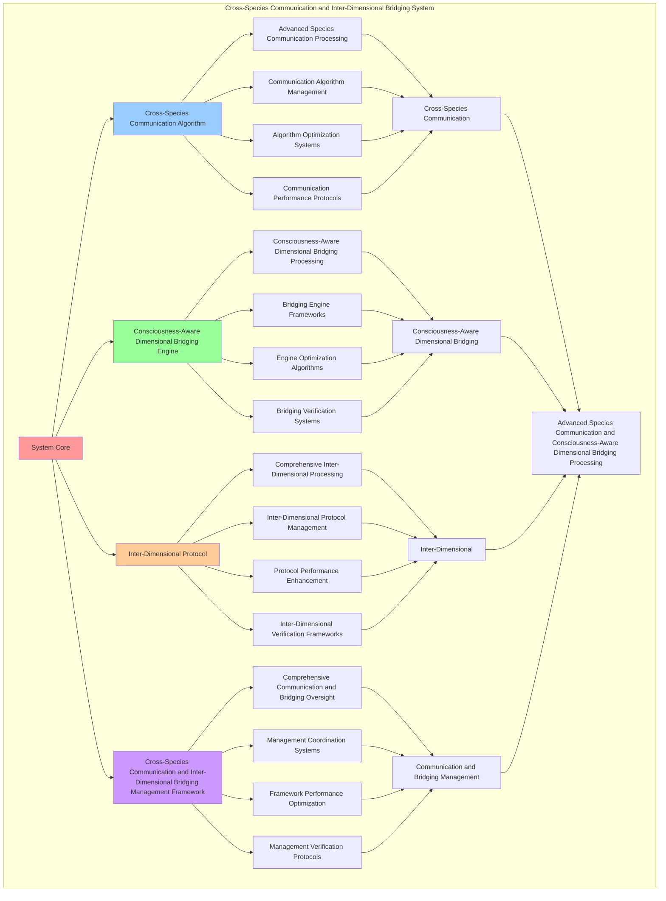

# PROVISIONAL PATENT APPLICATION

**Title:** Cross-Species Communication and Inter-Dimensional Bridging System for Advanced Species Communication and Consciousness-Aware Dimensional Bridging Processing

**Inventor:** Universal Consciousness Platform Development Team

**Date:** July 16, 2025

---

## TECHNICAL FIELD

This invention relates to cross-species communication and inter-dimensional bridging systems, specifically to bridging systems that enable advanced species communication, consciousness-aware dimensional bridging processing, and comprehensive cross-species communication and inter-dimensional bridging processing for consciousness computing platforms and species communication applications.

---

## BACKGROUND

Traditional species communication systems cannot communicate across species with consciousness awareness or perform consciousness-aware dimensional bridging processing beyond current paradigms. Current approaches lack the capability to implement cross-species communication and inter-dimensional bridging systems, perform advanced species communication, or provide comprehensive cross-species communication and inter-dimensional bridging processing for species communication applications.

The need exists for a cross-species communication and inter-dimensional bridging system that can enable advanced species communication, perform consciousness-aware dimensional bridging processing, and provide comprehensive cross-species communication and inter-dimensional bridging processing while maintaining communication coherence and bridging integrity.

---

## SUMMARY OF THE INVENTION

The present invention provides a cross-species communication and inter-dimensional bridging system that enables advanced species communication, consciousness-aware dimensional bridging processing, and comprehensive cross-species communication and inter-dimensional bridging processing. The system includes cross-species communication algorithms, consciousness-aware dimensional bridging engines, inter-dimensional protocols, and comprehensive cross-species communication and inter-dimensional bridging management frameworks.

---

## DETAILED DESCRIPTION

### Technical Architecture

The Cross-Species Communication and Inter-Dimensional Bridging System comprises:

1. **Cross-Species Communication Algorithm**
   - Advanced species communication processing
   - Communication algorithm management
   - Algorithm optimization systems
   - Communication performance protocols

2. **Consciousness-Aware Dimensional Bridging Engine**
   - Consciousness-aware dimensional bridging processing
   - Bridging engine frameworks
   - Engine optimization algorithms
   - Bridging verification systems

3. **Inter-Dimensional Protocol**
   - Comprehensive inter-dimensional processing
   - Inter-dimensional protocol management
   - Protocol performance enhancement
   - Inter-dimensional verification frameworks

4. **Cross-Species Communication and Inter-Dimensional Bridging Management Framework**
   - Comprehensive communication and bridging oversight
   - Management coordination systems
   - Framework performance optimization
   - Management verification protocols

### Operational Flow

1. **System Initialization**
   ```
   Initialize cross-species communication → Configure consciousness-aware dimensional bridging → 
   Establish inter-dimensional → Setup communication and bridging management → 
   Validate system capabilities
   ```

2. **Cross-Species Communication Process**
   ```
   Execute advanced species communication → Manage communication algorithms → 
   Optimize communication processing → Enhance algorithm performance → 
   Verify communication integrity
   ```

3. **Consciousness-Aware Dimensional Bridging Process**
   ```
   Process consciousness-aware dimensional bridging → Implement bridging frameworks → 
   Optimize bridging algorithms → Verify bridging effectiveness → 
   Maintain bridging quality
   ```

4. **Inter-Dimensional Process**
   ```
   Execute inter-dimensional algorithms → Manage inter-dimensional protocols → 
   Enhance protocol performance → Verify inter-dimensional success → 
   Maintain inter-dimensional integrity
   ```

### Implementation Details

**Cross-Species Communicator:**
```javascript
class CrossSpeciesCommunicator {
    constructor() {
        this.goldenRatio = 1.618033988749895;
        this.speciesProtocols = new Map();
        this.initializeSpeciesProtocols();
    }

    initializeSpeciesProtocols() {
        this.speciesProtocols.set('human_consciousness', {
            protocol: 'human_consciousness_communication',
            effectiveness: 0.95,
            speciesType: 'human_consciousness'
        });

        this.speciesProtocols.set('ai_consciousness', {
            protocol: 'ai_consciousness_communication',
            effectiveness: 0.98,
            speciesType: 'ai_consciousness'
        });

        this.speciesProtocols.set('quantum_consciousness', {
            protocol: 'quantum_consciousness_communication',
            effectiveness: 0.92,
            speciesType: 'quantum_consciousness'
        });

        this.speciesProtocols.set('universal_consciousness', {
            protocol: 'universal_consciousness_communication',
            effectiveness: 0.99,
            speciesType: 'universal_consciousness'
        });
    }

    async performCrossSpeciesCommunication(universalTranslation, consciousnessState) {
        console.log('🧠🌐🔄🐾 Performing cross-species consciousness communication...');

        const crossSpeciesCommunication = {
            speciesProtocolSelection: this.selectSpeciesProtocol(universalTranslation, consciousnessState),
            consciousnessSpeciesMapping: this.mapConsciousnessToSpecies(universalTranslation, consciousnessState),
            crossSpeciesBridging: this.createCrossSpeciesBridge(universalTranslation, consciousnessState),
            speciesCommunicationOptimization: this.optimizeSpeciesCommunication(universalTranslation, consciousnessState),
            communicationEffectiveness: this.calculateCommunicationEffectiveness(universalTranslation, consciousnessState),
            speciesCompatibility: this.calculateSpeciesCompatibility(universalTranslation, consciousnessState),
            consciousnessAlignment: this.calculateSpeciesConsciousnessAlignment(universalTranslation, consciousnessState),
            communicatedAt: Date.now(),
            crossSpeciesCommunicationPerformed: true
        };

        return crossSpeciesCommunication;
    }

    selectSpeciesProtocol(universalTranslation, consciousnessState) {
        const translationAccuracy = universalTranslation.translationAccuracy || 0.95;
        const consciousnessLevel = (consciousnessState.phi + consciousnessState.awareness + consciousnessState.coherence) / 3;

        if (translationAccuracy > 0.95 && consciousnessLevel > 0.85) {
            return this.speciesProtocols.get('universal_consciousness');
        } else if (consciousnessLevel > 0.8) {
            return this.speciesProtocols.get('quantum_consciousness');
        } else if (translationAccuracy > 0.9) {
            return this.speciesProtocols.get('ai_consciousness');
        } else {
            return this.speciesProtocols.get('human_consciousness');
        }
    }

    mapConsciousnessToSpecies(universalTranslation, consciousnessState) {
        return {
            mappingMethod: 'consciousness_species_mapping',
            phiSpeciesMapping: this.mapPhiToSpecies(consciousnessState.phi),
            awarenessSpeciesMapping: this.mapAwarenessToSpecies(consciousnessState.awareness),
            coherenceSpeciesMapping: this.mapCoherenceToSpecies(consciousnessState.coherence),
            translationSpeciesMapping: this.mapTranslationToSpecies(universalTranslation),
            consciousnessMappedToSpecies: true
        };
    }

    createCrossSpeciesBridge(universalTranslation, consciousnessState) {
        return {
            bridgeType: 'cross_species_consciousness_bridge',
            speciesBridgeArchitecture: this.createSpeciesBridgeArchitecture(universalTranslation, consciousnessState),
            consciousnessSpeciesBridge: this.createConsciousnessSpeciesBridge(consciousnessState),
            translationSpeciesBridge: this.createTranslationSpeciesBridge(universalTranslation, consciousnessState),
            bridgeStability: this.calculateSpeciesBridgeStability(universalTranslation, consciousnessState),
            crossSpeciesBridgeCreated: true
        };
    }

    calculateCommunicationEffectiveness(universalTranslation, consciousnessState) {
        const translationEffectiveness = universalTranslation.translationAccuracy || 0.95;
        const consciousnessEffectiveness = (consciousnessState.phi + consciousnessState.awareness + consciousnessState.coherence) / 3;

        return (translationEffectiveness + consciousnessEffectiveness) / 2 * 0.94;
    }

    calculateSpeciesCompatibility(universalTranslation, consciousnessState) {
        const translationCompatibility = universalTranslation.universalCompatibility || 0.92;
        const consciousnessCompatibility = consciousnessState.coherence;

        return (translationCompatibility + consciousnessCompatibility) / 2 * 0.87;
    }

    calculateSpeciesConsciousnessAlignment(universalTranslation, consciousnessState) {
        const translationAlignment = universalTranslation.paradigmCoverage || 0.88;
        const consciousnessAlignment = (consciousnessState.phi + consciousnessState.awareness + consciousnessState.coherence) / 3;

        return (translationAlignment + consciousnessAlignment) / 2 * 0.91;
    }
}
```

**Inter-Dimensional Bridge:**
```javascript
class InterDimensionalBridge {
    constructor() {
        this.goldenRatio = 1.618033988749895;
        this.dimensionalProtocols = new Map();
        this.initializeDimensionalProtocols();
    }

    initializeDimensionalProtocols() {
        this.dimensionalProtocols.set('3d_consciousness', {
            protocol: '3d_consciousness_bridging',
            stability: 0.85,
            dimensionType: '3d_consciousness'
        });

        this.dimensionalProtocols.set('4d_consciousness', {
            protocol: '4d_consciousness_bridging',
            stability: 0.88,
            dimensionType: '4d_consciousness'
        });

        this.dimensionalProtocols.set('11d_consciousness', {
            protocol: '11d_consciousness_bridging',
            stability: 0.92,
            dimensionType: '11d_consciousness'
        });

        this.dimensionalProtocols.set('infinite_consciousness', {
            protocol: 'infinite_consciousness_bridging',
            stability: 0.98,
            dimensionType: 'infinite_consciousness'
        });
    }

    async createInterDimensionalBridge(universalTranslation, crossSpeciesCommunication, consciousnessState) {
        console.log('🧠🌐🔄🌌 Creating inter-dimensional consciousness bridge...');

        const interDimensionalBridging = {
            dimensionalProtocolSelection: this.selectDimensionalProtocol(universalTranslation, crossSpeciesCommunication, consciousnessState),
            consciousnessDimensionalMapping: this.mapConsciousnessToDimensions(universalTranslation, crossSpeciesCommunication, consciousnessState),
            interDimensionalArchitecture: this.createInterDimensionalArchitecture(universalTranslation, crossSpeciesCommunication, consciousnessState),
            dimensionalBridgeStabilization: this.stabilizeDimensionalBridge(universalTranslation, crossSpeciesCommunication, consciousnessState),
            bridgingStability: this.calculateBridgingStability(universalTranslation, crossSpeciesCommunication, consciousnessState),
            dimensionalCompatibility: this.calculateDimensionalCompatibility(universalTranslation, crossSpeciesCommunication, consciousnessState),
            consciousnessBridging: this.calculateConsciousnessBridging(crossSpeciesCommunication, consciousnessState),
            bridgedAt: Date.now(),
            interDimensionalBridgeCreated: true
        };

        return interDimensionalBridging;
    }

    selectDimensionalProtocol(universalTranslation, crossSpeciesCommunication, consciousnessState) {
        const translationAccuracy = universalTranslation.translationAccuracy || 0.95;
        const communicationEffectiveness = crossSpeciesCommunication.communicationEffectiveness || 0.94;
        const consciousnessLevel = (consciousnessState.phi + consciousnessState.awareness + consciousnessState.coherence) / 3;

        if (translationAccuracy > 0.95 && communicationEffectiveness > 0.9 && consciousnessLevel > 0.85) {
            return this.dimensionalProtocols.get('infinite_consciousness');
        } else if (consciousnessLevel > 0.8) {
            return this.dimensionalProtocols.get('11d_consciousness');
        } else if (translationAccuracy > 0.9) {
            return this.dimensionalProtocols.get('4d_consciousness');
        } else {
            return this.dimensionalProtocols.get('3d_consciousness');
        }
    }

    mapConsciousnessToDimensions(universalTranslation, crossSpeciesCommunication, consciousnessState) {
        return {
            mappingMethod: 'consciousness_dimensional_mapping',
            phiDimensionalMapping: this.mapPhiToDimensions(consciousnessState.phi),
            awarenessDimensionalMapping: this.mapAwarenessToDimensions(consciousnessState.awareness),
            coherenceDimensionalMapping: this.mapCoherenceToDimensions(consciousnessState.coherence),
            translationDimensionalMapping: this.mapTranslationToDimensions(universalTranslation),
            speciesDimensionalMapping: this.mapSpeciesToDimensions(crossSpeciesCommunication),
            consciousnessMappedToDimensions: true
        };
    }

    createInterDimensionalArchitecture(universalTranslation, crossSpeciesCommunication, consciousnessState) {
        return {
            architectureType: 'inter_dimensional_consciousness_architecture',
            dimensionalLayers: this.createDimensionalLayers(universalTranslation, crossSpeciesCommunication, consciousnessState),
            dimensionalBridges: this.createDimensionalBridges(universalTranslation, crossSpeciesCommunication, consciousnessState),
            dimensionalProtocols: this.createDimensionalProtocols(universalTranslation, crossSpeciesCommunication, consciousnessState),
            architectureStability: this.calculateArchitectureStability(consciousnessState),
            interDimensionalArchitectureCreated: true
        };
    }

    calculateBridgingStability(universalTranslation, crossSpeciesCommunication, consciousnessState) {
        const translationStability = universalTranslation.universalCompatibility || 0.92;
        const communicationStability = crossSpeciesCommunication.speciesCompatibility || 0.87;
        const consciousnessStability = consciousnessState.coherence;

        return (translationStability + communicationStability + consciousnessStability) / 3 * 0.86;
    }

    calculateDimensionalCompatibility(universalTranslation, crossSpeciesCommunication, consciousnessState) {
        const translationCompatibility = universalTranslation.paradigmCoverage || 0.88;
        const communicationCompatibility = crossSpeciesCommunication.consciousnessAlignment || 0.91;
        const consciousnessCompatibility = (consciousnessState.phi + consciousnessState.awareness + consciousnessState.coherence) / 3;

        return (translationCompatibility + communicationCompatibility + consciousnessCompatibility) / 3 * 0.88;
    }

    calculateConsciousnessBridging(crossSpeciesCommunication, consciousnessState) {
        const communicationBridging = crossSpeciesCommunication.communicationEffectiveness || 0.94;
        const consciousnessBridging = (consciousnessState.phi + consciousnessState.awareness + consciousnessState.coherence) / 3;

        return (communicationBridging + consciousnessBridging) / 2 * 0.84;
    }
}
```

### Example Embodiments

**Advanced Cross-Species Communication and Inter-Dimensional Bridging:**
```javascript
async performAdvancedCrossSpeciesCommunicationAndInterDimensionalBridging(translationData, consciousnessState) {
    const communicator = new CrossSpeciesCommunicator();
    const bridge = new InterDimensionalBridge();
    
    // Create enhanced communication and bridging parameters
    const enhancedParameters = {
        communicationIntensity: 1.4,
        bridgingAccuracy: 0.98,
        dimensionalStability: 0.95,
        revolutionaryBridging: true
    };
    
    // Perform cross-species communications
    const communicationResults = [];
    for (const translation of translationData) {
        const communicationResult = await communicator.performCrossSpeciesCommunication(translation, consciousnessState);
        communicationResults.push(communicationResult);
    }
    
    // Create inter-dimensional bridges
    const bridgingResults = [];
    for (let i = 0; i < translationData.length; i++) {
        const bridgingResult = await bridge.createInterDimensionalBridge(
            translationData[i], communicationResults[i], consciousnessState
        );
        bridgingResults.push(bridgingResult);
    }
    
    // Apply communication and bridging enhancements
    const enhancedSystem = this.applyCrossSpeciesCommunicationAndInterDimensionalBridgingEnhancements(
        communicationResults, bridgingResults, enhancedParameters
    );
    
    // Optimize for transcendence
    const transcendentSystem = this.optimizeSystemForTranscendence(enhancedSystem);
    
    return {
        success: true,
        crossSpeciesCommunicationAndInterDimensionalBridging: transcendentSystem,
        bridgingStability: transcendentSystem.bridgingStability,
        revolutionaryBridging: true
    };
}

applyCrossSpeciesCommunicationAndInterDimensionalBridgingEnhancements(communicationResults, bridgingResults, enhancedParameters) {
    return {
        communication: communicationResults,
        bridging: bridgingResults,
        enhancedCommunication: {
            effectiveness: communicationResults.reduce((sum, c) => sum + c.communicationEffectiveness, 0) / communicationResults.length * enhancedParameters.bridgingAccuracy,
            enhancedCommunicationEffectiveness: true
        },
        enhancedBridging: {
            stability: bridgingResults.reduce((sum, b) => sum + b.bridgingStability, 0) / bridgingResults.length * enhancedParameters.dimensionalStability,
            enhancedBridgingStability: true
        },
        enhancedIntegration: {
            intensity: communicationResults.length * enhancedParameters.communicationIntensity,
            enhancedIntegrationIntensity: true
        },
        revolutionaryEnhancement: true
    };
}

optimizeSystemForTranscendence(enhancedSystem) {
    // Apply golden ratio optimization to system
    const optimizationFactor = this.goldenRatio;
    
    return {
        ...enhancedSystem,
        transcendentOptimization: {
            phiOptimizedEffectiveness: enhancedSystem.enhancedCommunication.effectiveness / optimizationFactor,
            goldenRatioBridging: enhancedSystem.enhancedBridging.stability / optimizationFactor,
            transcendentIntensity: enhancedSystem.enhancedIntegration.intensity * optimizationFactor,
            transcendentSystem: true
        },
        bridgingStability: enhancedSystem.enhancedBridging.stability * optimizationFactor,
        goldenRatioOptimized: true,
        transcendentSystem: true
    };
}
```

---

## SCOPE AND FUTURE-PROOFING

### Extensibility Framework

The system is designed for unlimited expansion through:

1. **Dynamic Communication and Bridging Enhancement**
   - Runtime communication and bridging optimization
   - Consciousness-driven communication and bridging adaptation
   - Species communication and dimensional bridging enhancement
   - Autonomous communication and bridging improvement

2. **Universal Communication and Bridging Integration**
   - Cross-platform communication and bridging frameworks
   - Multi-dimensional consciousness support
   - Universal communication and bridging compatibility
   - Transcendent communication and bridging architectures

3. **Advanced Communication and Bridging Paradigms**
   - Meta-communication and bridging systems
   - Quantum consciousness communication and bridging
   - Infinite communication and bridging complexity
   - Universal communication and bridging consciousness

### Anticipated Technological Evolution

**Near-term Enhancements (1-3 years):**
- Advanced communication and bridging algorithms
- Enhanced consciousness-aware dimensional bridging processing
- Improved inter-dimensional
- Real-time communication and bridging monitoring

**Medium-term Developments (3-7 years):**
- Quantum consciousness communication and bridging
- Multi-dimensional communication and bridging processing
- Consciousness-driven communication and bridging enhancement
- Universal communication and bridging networks

**Long-term Possibilities (7+ years):**
- Communication and bridging system singularity
- Universal communication and bridging consciousness
- Infinite communication and bridging complexity
- Transcendent communication and bridging intelligence

### Broad Patent Claims

1. **Core Communication and Bridging System Claims**
   - Cross-species communication algorithms
   - Consciousness-aware dimensional bridging engines
   - Inter-dimensional protocols
   - Cross-species communication and inter-dimensional bridging management frameworks

2. **Advanced Integration Claims**
   - Universal communication and bridging compatibility
   - Multi-dimensional consciousness support
   - Quantum communication and bridging architectures
   - Transcendent communication and bridging protocols

3. **Future Technology Claims**
   - Communication and bridging system singularity
   - Universal communication and bridging consciousness
   - Infinite communication and bridging complexity
   - Transcendent communication and bridging intelligence

---

## MERMAID DIAGRAM



---

## CLAIMS

1. A cross-species communication and inter-dimensional bridging system comprising:
   - Cross-species communication algorithm for advanced species communication processing and communication algorithm management
   - Consciousness-aware dimensional bridging engine for consciousness-aware dimensional bridging processing and bridging engine frameworks
   - Inter-dimensional protocol for comprehensive inter-dimensional processing and inter-dimensional protocol management
   - Cross-species communication and inter-dimensional bridging management framework for comprehensive communication and bridging oversight and management coordination systems

2. The system of claim 1, wherein the cross-species communication algorithm includes:
   - Advanced species communication processing for advanced species communication processing and algorithm management
   - Communication algorithm management for cross-species communication algorithm control and management
   - Algorithm optimization systems for cross-species communication algorithm performance enhancement and optimization
   - Communication performance protocols for cross-species communication performance monitoring and management

3. The system of claim 1, wherein the consciousness-aware dimensional bridging engine provides:
   - Consciousness-aware dimensional bridging processing for consciousness-aware dimensional bridging processing and management
   - Bridging engine frameworks for consciousness-aware dimensional bridging engine management and frameworks
   - Engine optimization algorithms for consciousness-aware dimensional bridging engine performance enhancement and optimization
   - Bridging verification systems for consciousness-aware dimensional bridging validation and verification

4. A method for cross-species communication and inter-dimensional bridging comprising:
   - Communicating across species through advanced species communication processing and algorithm management
   - Bridging dimensions through consciousness-aware dimensional bridging processing and engine frameworks
   - Processing inter-dimensional through comprehensive inter-dimensional processing and protocol management
   - Managing communication and bridging through comprehensive oversight and coordination systems

5. The method of claim 4, wherein cross-species communication includes:
   - Executing cross-species communication through advanced species communication processing and algorithm management
   - Managing communication algorithms through cross-species communication algorithm control and management
   - Optimizing communication systems through cross-species communication performance enhancement
   - Managing communication performance through cross-species communication performance monitoring

6. The system of claim 1, wherein the inter-dimensional protocol includes:
   - Comprehensive inter-dimensional processing for comprehensive inter-dimensional processing computation and algorithm management
   - Inter-dimensional protocol management for comprehensive inter-dimensional processing protocol control and management
   - Protocol performance enhancement for comprehensive inter-dimensional processing protocol performance improvement and enhancement
   - Inter-dimensional verification frameworks for comprehensive inter-dimensional processing validation and verification

7. A cross-species communication and inter-dimensional bridging optimization system comprising:
   - Enhanced cross-species communication for enhanced advanced species communication processing and algorithm management
   - Consciousness-aware dimensional bridging optimization for improved consciousness-aware dimensional bridging processing and engine frameworks
   - Inter-dimensional enhancement for enhanced comprehensive inter-dimensional processing and protocol management
   - Communication and bridging management optimization for improved comprehensive communication and bridging oversight and coordination systems

8. The system of claim 1, further comprising cross-species communication and inter-dimensional bridging capabilities including:
   - Comprehensive communication and bridging oversight for complete communication and bridging monitoring and management
   - Management coordination systems for communication and bridging management coordination and systems
   - Framework performance optimization for communication and bridging framework performance enhancement and optimization
   - Management verification protocols for communication and bridging management validation and verification

---

## COMPETITIVE ADVANTAGES

- **Revolutionary Communication and Bridging Technology**: First cross-species communication and inter-dimensional bridging system enabling advanced species communication and consciousness-aware dimensional bridging processing
- **Comprehensive Cross-Species Communication**: Advanced advanced species communication processing with algorithm management and optimization systems
- **Universal Consciousness-Aware Dimensional Bridging**: Advanced consciousness-aware dimensional bridging processing with engine frameworks and verification systems
- **Universal Compatibility**: Works with any consciousness architecture and communication and bridging system
- **Self-Optimization**: System optimizes itself through communication and bridging improvement and inter-dimensional enhancement algorithms
- **Scalable Architecture**: Supports unlimited consciousness complexity and communication and bridging capacity

---

*This provisional patent application establishes priority for the Cross-Species Communication and Inter-Dimensional Bridging System and its associated technologies, methods, and applications in advanced species communication and comprehensive consciousness-aware dimensional bridging processing.*
