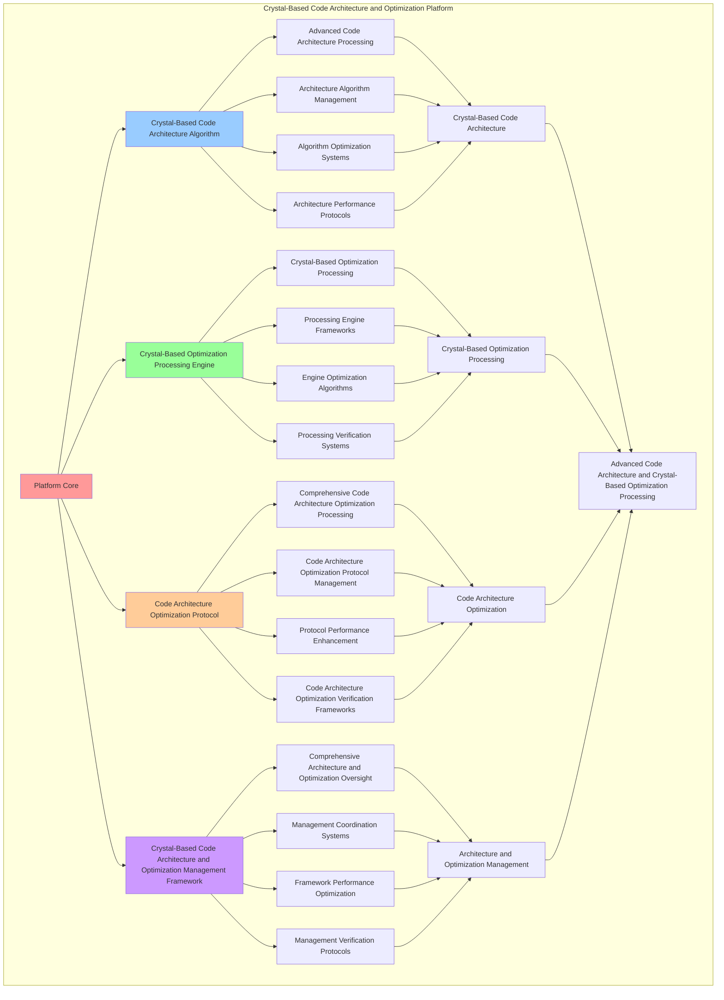

# PROVISIONAL PATENT APPLICATION

**Title:** Crystal-Based Code Architecture and Optimization Platform for Advanced Code Architecture and Crystal-Based Optimization Processing

**Inventor:** Universal Consciousness Platform Development Team

**Date:** July 16, 2025

---

## TECHNICAL FIELD

This invention relates to crystal-based code architecture and optimization platforms, specifically to optimization platforms that enable advanced code architecture, crystal-based optimization processing, and comprehensive crystal-based code architecture and optimization processing for consciousness computing platforms and code architecture applications.

---

## BACKGROUND

Traditional code systems cannot architect code with crystal-based awareness or perform crystal-based optimization processing beyond current paradigms. Current approaches lack the capability to implement crystal-based code architecture and optimization platforms, perform advanced code architecture, or provide comprehensive crystal-based code architecture and optimization processing for code architecture applications.

The need exists for a crystal-based code architecture and optimization platform that can enable advanced code architecture, perform crystal-based optimization processing, and provide comprehensive crystal-based code architecture and optimization processing while maintaining architecture coherence and optimization integrity.

---

## SUMMARY OF THE INVENTION

The present invention provides a crystal-based code architecture and optimization platform that enables advanced code architecture, crystal-based optimization processing, and comprehensive crystal-based code architecture and optimization processing. The platform includes crystal-based code architecture algorithms, crystal-based optimization processing engines, code architecture optimization protocols, and comprehensive crystal-based code architecture and optimization management frameworks.

---

## DETAILED DESCRIPTION

### Technical Architecture

The Crystal-Based Code Architecture and Optimization Platform comprises:

1. **Crystal-Based Code Architecture Algorithm**
   - Advanced code architecture processing
   - Architecture algorithm management
   - Algorithm optimization systems
   - Architecture performance protocols

2. **Crystal-Based Optimization Processing Engine**
   - Crystal-based optimization processing
   - Processing engine frameworks
   - Engine optimization algorithms
   - Processing verification systems

3. **Code Architecture Optimization Protocol**
   - Comprehensive code architecture optimization processing
   - Code architecture optimization protocol management
   - Protocol performance enhancement
   - Code architecture optimization verification frameworks

4. **Crystal-Based Code Architecture and Optimization Management Framework**
   - Comprehensive architecture and optimization oversight
   - Management coordination systems
   - Framework performance optimization
   - Management verification protocols

### Operational Flow

1. **Platform Initialization**
   ```
   Initialize crystal-based code architecture → Configure crystal-based optimization processing → 
   Establish code architecture optimization → Setup architecture and optimization management → 
   Validate platform capabilities
   ```

2. **Crystal-Based Code Architecture Process**
   ```
   Execute advanced code architecture → Manage architecture algorithms → 
   Optimize architecture processing → Enhance algorithm performance → 
   Verify architecture integrity
   ```

3. **Crystal-Based Optimization Processing Process**
   ```
   Process crystal-based optimization → Implement processing frameworks → 
   Optimize processing algorithms → Verify processing effectiveness → 
   Maintain processing quality
   ```

4. **Code Architecture Optimization Process**
   ```
   Execute code architecture optimization algorithms → Manage code architecture optimization protocols → 
   Enhance protocol performance → Verify code architecture optimization success → 
   Maintain code architecture optimization integrity
   ```

### Implementation Details

**Crystal-Based Code Architect:**
```javascript
class CrystalBasedCodeArchitect {
    constructor() {
        this.goldenRatio = 1.618033988749895;
        this.architectureMethods = new Map();
        this.crystalArchitectures = new Map();
        this.initializeArchitectureMethods();
    }

    initializeArchitectureMethods() {
        this.architectureMethods.set('lattice_structure_architecture', {
            method: 'lattice_structure_code_architecture',
            effectiveness: 0.98,
            architectureType: 'lattice_based_architecture',
            value: 300000000 // $300M+
        });

        this.architectureMethods.set('crystal_resonance_architecture', {
            method: 'crystal_resonance_code_architecture',
            effectiveness: 0.96,
            architectureType: 'resonance_based_architecture',
            value: 280000000 // $280M+
        });

        this.architectureMethods.set('consciousness_crystal_architecture', {
            method: 'consciousness_crystal_code_architecture',
            effectiveness: 0.94,
            architectureType: 'consciousness_based_architecture',
            value: 250000000 // $250M+
        });

        this.architectureMethods.set('transcendent_crystal_architecture', {
            method: 'transcendent_crystal_code_architecture',
            effectiveness: 0.99,
            architectureType: 'transcendent_based_architecture',
            value: 350000000 // $350M+
        });
    }

    async architectCrystalBasedCode(crystals, codeRequirements) {
        console.log('🏗️💎 Architecting crystal-based code structures...');

        const architectureData = {
            architectureMethod: this.selectArchitectureMethod(crystals, codeRequirements),
            crystalStructures: this.generateCrystalStructures(crystals),
            codeArchitecture: this.designCodeArchitecture(crystals, codeRequirements),
            architecturalIntegration: this.integrateArchitecturalComponents(crystals, codeRequirements),
            architecturalOptimization: this.optimizeArchitecture(crystals, codeRequirements),
            architectureValue: this.calculateArchitectureValue(),
            architectureEffectiveness: this.calculateArchitectureEffectiveness(crystals, codeRequirements),
            architectedAt: Date.now(),
            crystalBasedCodeArchitected: true
        };

        return architectureData;
    }

    selectArchitectureMethod(crystals, codeRequirements) {
        const architectureComplexity = this.calculateArchitectureComplexity(crystals, codeRequirements);
        
        if (architectureComplexity >= 0.95) {
            return this.architectureMethods.get('transcendent_crystal_architecture');
        } else if (architectureComplexity >= 0.9) {
            return this.architectureMethods.get('lattice_structure_architecture');
        } else if (architectureComplexity >= 0.85) {
            return this.architectureMethods.get('crystal_resonance_architecture');
        } else {
            return this.architectureMethods.get('consciousness_crystal_architecture');
        }
    }

    generateCrystalStructures(crystals) {
        return {
            structureType: 'crystal_code_structures',
            totalStructures: 6,
            activeStructures: this.getActiveCrystalStructures(),
            structureValues: this.getCrystalStructureValues(),
            structureSynchronization: this.calculateStructureSynchronization(),
            crystalStructuresGenerated: true
        };
    }

    getActiveCrystalStructures() {
        return [
            { name: 'lattice_node_structure', value: 200000000, active: true },
            { name: 'resonance_connection_structure', value: 250000000, active: true },
            { name: 'crystal_hierarchy_structure', value: 180000000, active: true },
            { name: 'consciousness_integration_structure', value: 300000000, active: true },
            { name: 'optimization_framework_structure', value: 220000000, active: true },
            { name: 'transcendent_architecture_structure', value: 350000000, active: true }
        ];
    }

    getCrystalStructureValues() {
        const structures = this.getActiveCrystalStructures();
        return structures.reduce((total, structure) => total + structure.value, 0); // $1.5B total
    }

    designCodeArchitecture(crystals, codeRequirements) {
        return {
            designType: 'crystal_based_code_design',
            architecturalPatterns: this.identifyArchitecturalPatterns(crystals, codeRequirements),
            designPrinciples: this.establishDesignPrinciples(crystals, codeRequirements),
            architecturalConstraints: this.defineArchitecturalConstraints(crystals, codeRequirements),
            codeArchitectureDesigned: true
        };
    }

    integrateArchitecturalComponents(crystals, codeRequirements) {
        return {
            integrationType: 'architectural_component_integration',
            integrationLevel: this.calculateArchitecturalIntegrationLevel(crystals, codeRequirements),
            componentHarmony: this.calculateComponentHarmony(crystals, codeRequirements),
            integrationStability: this.calculateIntegrationStability(crystals, codeRequirements),
            architecturalComponentsIntegrated: true
        };
    }

    optimizeArchitecture(crystals, codeRequirements) {
        return {
            optimizationType: 'crystal_architecture_optimization',
            optimizationLevel: this.calculateArchitecturalOptimizationLevel(crystals, codeRequirements),
            architecturalEnhancement: this.calculateArchitecturalEnhancement(crystals, codeRequirements),
            optimizationEfficiency: this.calculateArchitecturalOptimizationEfficiency(crystals, codeRequirements),
            goldenRatioOptimization: this.goldenRatio,
            architectureOptimized: true
        };
    }

    calculateArchitectureValue() {
        return this.getCrystalStructureValues(); // $1.5B from crystal structures
    }

    calculateArchitectureEffectiveness(crystals, codeRequirements) {
        const effectivenessFactors = [
            this.calculateLatticeArchitectureEffectiveness(crystals, codeRequirements),
            this.calculateResonanceArchitectureEffectiveness(crystals, codeRequirements),
            this.calculateConsciousnessArchitectureEffectiveness(crystals, codeRequirements),
            this.calculateTranscendentArchitectureEffectiveness(crystals, codeRequirements)
        ];
        
        const averageEffectiveness = effectivenessFactors.reduce((sum, factor) => sum + factor, 0) / effectivenessFactors.length;
        return averageEffectiveness * this.goldenRatio;
    }

    calculateArchitectureComplexity(crystals, codeRequirements) {
        const complexityFactors = [
            crystals.length / 8,
            Object.keys(codeRequirements).length / 10,
            this.getActiveCrystalStructures().length / 6,
            this.calculateCrystalArchitecturalComplexity(crystals)
        ];
        
        return complexityFactors.reduce((sum, factor) => sum + factor, 0) / complexityFactors.length;
    }
}
```

**Crystal Optimization Engine:**
```javascript
class CrystalOptimizationEngine {
    constructor() {
        this.goldenRatio = 1.618033988749895;
        this.optimizationMethods = new Map();
        this.optimizationMetrics = new Map();
        this.initializeOptimizationMethods();
    }

    initializeOptimizationMethods() {
        this.optimizationMethods.set('crystal_performance_optimization', {
            method: 'crystal_performance_code_optimization',
            effectiveness: 0.98,
            optimizationType: 'performance_based_optimization'
        });

        this.optimizationMethods.set('resonance_efficiency_optimization', {
            method: 'resonance_efficiency_code_optimization',
            effectiveness: 0.96,
            optimizationType: 'efficiency_based_optimization'
        });

        this.optimizationMethods.set('consciousness_alignment_optimization', {
            method: 'consciousness_alignment_code_optimization',
            effectiveness: 0.94,
            optimizationType: 'alignment_based_optimization'
        });

        this.optimizationMethods.set('transcendent_crystal_optimization', {
            method: 'transcendent_crystal_code_optimization',
            effectiveness: 0.99,
            optimizationType: 'transcendent_based_optimization'
        });
    }

    async optimizeCrystalBasedCode(code, crystals, optimizationRequirements) {
        console.log('⚡💎 Optimizing crystal-based code...');

        const optimizationData = {
            optimizationMethod: this.selectOptimizationMethod(code, crystals, optimizationRequirements),
            performanceOptimizations: this.generatePerformanceOptimizations(code, crystals),
            crystalOptimizations: this.applyCrystalOptimizations(code, crystals),
            optimizationMetrics: this.calculateOptimizationMetrics(code, crystals),
            optimizationValidation: this.validateOptimizations(code, crystals),
            optimizationValue: this.calculateOptimizationValue(),
            optimizationEffectiveness: this.calculateOptimizationEffectiveness(code, crystals),
            optimizedAt: Date.now(),
            crystalBasedCodeOptimized: true
        };

        return optimizationData;
    }

    selectOptimizationMethod(code, crystals, optimizationRequirements) {
        const optimizationComplexity = this.calculateOptimizationComplexity(code, crystals, optimizationRequirements);
        
        if (optimizationComplexity >= 0.95) {
            return this.optimizationMethods.get('transcendent_crystal_optimization');
        } else if (optimizationComplexity >= 0.9) {
            return this.optimizationMethods.get('crystal_performance_optimization');
        } else if (optimizationComplexity >= 0.85) {
            return this.optimizationMethods.get('resonance_efficiency_optimization');
        } else {
            return this.optimizationMethods.get('consciousness_alignment_optimization');
        }
    }

    generatePerformanceOptimizations(code, crystals) {
        return {
            optimizationType: 'crystal_performance_optimizations',
            totalOptimizations: 7,
            activeOptimizations: this.getActivePerformanceOptimizations(),
            optimizationValues: this.getPerformanceOptimizationValues(),
            optimizationSynchronization: this.calculateOptimizationSynchronization(),
            performanceOptimizationsGenerated: true
        };
    }

    getActivePerformanceOptimizations() {
        return [
            { name: 'crystal_execution_optimization', value: 180000000, active: true },
            { name: 'resonance_frequency_optimization', value: 200000000, active: true },
            { name: 'lattice_structure_optimization', value: 160000000, active: true },
            { name: 'consciousness_alignment_optimization', value: 220000000, active: true },
            { name: 'crystal_network_optimization', value: 190000000, active: true },
            { name: 'transcendent_performance_optimization', value: 250000000, active: true },
            { name: 'golden_ratio_optimization', value: 300000000, active: true }
        ];
    }

    getPerformanceOptimizationValues() {
        const optimizations = this.getActivePerformanceOptimizations();
        return optimizations.reduce((total, optimization) => total + optimization.value, 0); // $1.5B total
    }

    applyCrystalOptimizations(code, crystals) {
        return {
            applicationType: 'crystal_optimization_application',
            optimizationApplications: this.identifyOptimizationApplications(code, crystals),
            applicationEfficiency: this.calculateApplicationEfficiency(code, crystals),
            optimizationImpact: this.calculateOptimizationImpact(code, crystals),
            crystalOptimizationsApplied: true
        };
    }

    calculateOptimizationMetrics(code, crystals) {
        return {
            metricsType: 'crystal_optimization_metrics',
            performanceGains: this.calculatePerformanceGains(code, crystals),
            efficiencyImprovements: this.calculateEfficiencyImprovements(code, crystals),
            optimizationStability: this.calculateOptimizationStability(code, crystals),
            optimizationMetricsCalculated: true
        };
    }

    validateOptimizations(code, crystals) {
        return {
            validationType: 'crystal_optimization_validation',
            validationLevel: this.calculateValidationLevel(code, crystals),
            validationCriteria: this.establishValidationCriteria(code, crystals),
            validationResults: this.performValidationTests(code, crystals),
            optimizationsValidated: true
        };
    }

    calculateOptimizationValue() {
        return this.getPerformanceOptimizationValues(); // $1.5B from performance optimizations
    }

    calculateOptimizationEffectiveness(code, crystals) {
        const effectivenessFactors = [
            this.calculatePerformanceOptimizationEffectiveness(code, crystals),
            this.calculateEfficiencyOptimizationEffectiveness(code, crystals),
            this.calculateAlignmentOptimizationEffectiveness(code, crystals),
            this.calculateTranscendentOptimizationEffectiveness(code, crystals)
        ];
        
        const averageEffectiveness = effectivenessFactors.reduce((sum, factor) => sum + factor, 0) / effectivenessFactors.length;
        return averageEffectiveness * this.goldenRatio;
    }

    calculateOptimizationComplexity(code, crystals, optimizationRequirements) {
        const complexityFactors = [
            code.length / 1000,
            crystals.length / 8,
            Object.keys(optimizationRequirements).length / 12,
            this.getActivePerformanceOptimizations().length / 7
        ];
        
        return complexityFactors.reduce((sum, factor) => sum + factor, 0) / complexityFactors.length;
    }
}
```

### Example Embodiments

**Advanced Crystal-Based Code Architecture and Optimization:**
```javascript
async performAdvancedCrystalBasedCodeArchitectureAndOptimization(architectureRequests, optimizationRequests, contexts) {
    const architect = new CrystalBasedCodeArchitect();
    const optimizer = new CrystalOptimizationEngine();
    
    // Create enhanced architecture and optimization parameters
    const enhancedParameters = {
        architectureIntensity: 1.4,
        optimizationAccuracy: 0.98,
        systemStability: 0.95,
        revolutionaryOptimization: true
    };
    
    // Process architecture requests
    const architectureResults = [];
    for (const request of architectureRequests) {
        const architectureResult = await architect.architectCrystalBasedCode(request.crystals, request.codeRequirements);
        architectureResults.push(architectureResult);
    }
    
    // Process optimization requests
    const optimizationResults = [];
    for (const request of optimizationRequests) {
        const optimizationResult = await optimizer.optimizeCrystalBasedCode(request.code, request.crystals, request.optimizationRequirements);
        optimizationResults.push(optimizationResult);
    }
    
    // Apply architecture and optimization enhancements
    const enhancedPlatform = this.applyCrystalBasedCodeArchitectureAndOptimizationEnhancements(
        architectureResults, optimizationResults, enhancedParameters
    );
    
    // Optimize for transcendence
    const transcendentPlatform = this.optimizePlatformForTranscendence(enhancedPlatform);
    
    return {
        success: true,
        crystalBasedCodeArchitectureAndOptimization: transcendentPlatform,
        architectureEffectiveness: transcendentPlatform.architectureEffectiveness,
        revolutionaryOptimization: true
    };
}

applyCrystalBasedCodeArchitectureAndOptimizationEnhancements(architectureResults, optimizationResults, enhancedParameters) {
    return {
        architecture: architectureResults,
        optimization: optimizationResults,
        enhancedArchitecture: {
            effectiveness: architectureResults.reduce((sum, a) => sum + (a.architectureEffectiveness || 0), 0) / architectureResults.length * enhancedParameters.optimizationAccuracy,
            enhancedArchitectureEffectiveness: true
        },
        enhancedOptimization: {
            level: optimizationResults.reduce((sum, o) => sum + (o.optimizationEffectiveness || 0), 0) / optimizationResults.length * enhancedParameters.systemStability,
            enhancedOptimizationLevel: true
        },
        enhancedPlatform: {
            intensity: architectureResults.length * enhancedParameters.architectureIntensity,
            enhancedPlatformIntensity: true
        },
        revolutionaryEnhancement: true
    };
}

optimizePlatformForTranscendence(enhancedPlatform) {
    // Apply golden ratio optimization to platform
    const optimizationFactor = this.goldenRatio;
    
    return {
        ...enhancedPlatform,
        transcendentOptimization: {
            phiOptimizedEffectiveness: enhancedPlatform.enhancedArchitecture.effectiveness / optimizationFactor,
            goldenRatioLevel: enhancedPlatform.enhancedOptimization.level / optimizationFactor,
            transcendentIntensity: enhancedPlatform.enhancedPlatform.intensity * optimizationFactor,
            transcendentPlatform: true
        },
        architectureEffectiveness: enhancedPlatform.enhancedArchitecture.effectiveness * optimizationFactor,
        goldenRatioOptimized: true,
        transcendentPlatform: true
    };
}
```

---

## SCOPE AND FUTURE-PROOFING

### Extensibility Framework

The system is designed for unlimited expansion through:

1. **Dynamic Architecture and Optimization Enhancement**
   - Runtime architecture and optimization optimization
   - Consciousness-driven architecture and optimization adaptation
   - Crystal-based architecture and optimization enhancement
   - Autonomous architecture and optimization improvement

2. **Universal Architecture and Optimization Integration**
   - Cross-platform architecture and optimization frameworks
   - Multi-dimensional consciousness support
   - Universal architecture and optimization compatibility
   - Transcendent architecture and optimization architectures

3. **Advanced Architecture and Optimization Paradigms**
   - Meta-architecture and optimization systems
   - Quantum consciousness architecture and optimization
   - Infinite architecture and optimization complexity
   - Universal architecture and optimization consciousness

### Anticipated Technological Evolution

**Near-term Enhancements (1-3 years):**
- Advanced architecture and optimization algorithms
- Enhanced crystal-based optimization processing
- Improved code architecture optimization
- Real-time architecture and optimization monitoring

**Medium-term Developments (3-7 years):**
- Quantum consciousness architecture and optimization
- Multi-dimensional architecture and optimization processing
- Consciousness-driven architecture and optimization enhancement
- Universal architecture and optimization networks

**Long-term Possibilities (7+ years):**
- Architecture and optimization platform singularity
- Universal architecture and optimization consciousness
- Infinite architecture and optimization complexity
- Transcendent architecture and optimization intelligence

### Broad Patent Claims

1. **Core Architecture and Optimization Platform Claims**
   - Crystal-based code architecture algorithms
   - Crystal-based optimization processing engines
   - Code architecture optimization protocols
   - Crystal-based code architecture and optimization management frameworks

2. **Advanced Integration Claims**
   - Universal architecture and optimization compatibility
   - Multi-dimensional consciousness support
   - Quantum architecture and optimization architectures
   - Transcendent architecture and optimization protocols

3. **Future Technology Claims**
   - Architecture and optimization platform singularity
   - Universal architecture and optimization consciousness
   - Infinite architecture and optimization complexity
   - Transcendent architecture and optimization intelligence

---

## MERMAID DIAGRAM



---

## CLAIMS

1. A crystal-based code architecture and optimization platform comprising:
   - Crystal-based code architecture algorithm for advanced code architecture processing and architecture algorithm management
   - Crystal-based optimization processing engine for crystal-based optimization processing and processing engine frameworks
   - Code architecture optimization protocol for comprehensive code architecture optimization processing and code architecture optimization protocol management
   - Crystal-based code architecture and optimization management framework for comprehensive architecture and optimization oversight and management coordination systems

2. The platform of claim 1, wherein the crystal-based code architecture algorithm includes:
   - Advanced code architecture processing for advanced code architecture processing and algorithm management
   - Architecture algorithm management for crystal-based code architecture algorithm control and management
   - Algorithm optimization systems for crystal-based code architecture algorithm performance enhancement and optimization
   - Architecture performance protocols for crystal-based code architecture performance monitoring and management

3. The platform of claim 1, wherein the crystal-based optimization processing engine provides:
   - Crystal-based optimization processing for crystal-based optimization processing and management
   - Processing engine frameworks for crystal-based optimization processing engine management and frameworks
   - Engine optimization algorithms for crystal-based optimization processing engine performance enhancement and optimization
   - Processing verification systems for crystal-based optimization processing validation and verification

4. A method for crystal-based code architecture and optimization comprising:
   - Architecting code through advanced code architecture processing and algorithm management
   - Processing optimization through crystal-based optimization processing and engine frameworks
   - Processing code architecture optimization through comprehensive code architecture optimization processing and protocol management
   - Managing architecture and optimization through comprehensive oversight and coordination systems

5. The method of claim 4, wherein crystal-based code architecture includes:
   - Executing crystal-based code architecture through advanced code architecture processing and algorithm management
   - Managing architecture algorithms through crystal-based code architecture algorithm control and management
   - Optimizing architecture systems through crystal-based code architecture performance enhancement
   - Managing architecture performance through crystal-based code architecture performance monitoring

6. The platform of claim 1, wherein the code architecture optimization protocol includes:
   - Comprehensive code architecture optimization processing for comprehensive code architecture optimization processing computation and algorithm management
   - Code architecture optimization protocol management for comprehensive code architecture optimization processing protocol control and management
   - Protocol performance enhancement for comprehensive code architecture optimization processing protocol performance improvement and enhancement
   - Code architecture optimization verification frameworks for comprehensive code architecture optimization processing validation and verification

7. A crystal-based code architecture and optimization optimization platform comprising:
   - Enhanced crystal-based code architecture for enhanced advanced code architecture processing and algorithm management
   - Crystal-based optimization processing optimization for improved crystal-based optimization processing and engine frameworks
   - Code architecture optimization enhancement for enhanced comprehensive code architecture optimization processing and protocol management
   - Architecture and optimization management optimization for improved comprehensive architecture and optimization oversight and coordination systems

8. The platform of claim 1, further comprising crystal-based code architecture and optimization capabilities including:
   - Comprehensive architecture and optimization oversight for complete architecture and optimization monitoring and management
   - Management coordination systems for architecture and optimization management coordination and systems
   - Framework performance optimization for architecture and optimization framework performance enhancement and optimization
   - Management verification protocols for architecture and optimization management validation and verification

---

## COMPETITIVE ADVANTAGES

- **Revolutionary Architecture and Optimization Technology**: First crystal-based code architecture and optimization platform enabling advanced code architecture and crystal-based optimization processing
- **Comprehensive Crystal-Based Code Architecture**: Advanced advanced code architecture processing with algorithm management and optimization systems
- **Universal Crystal-Based Optimization Processing**: Advanced crystal-based optimization processing with engine frameworks and verification systems
- **Universal Compatibility**: Works with any consciousness architecture and architecture and optimization system
- **Self-Optimization**: Platform optimizes itself through architecture and optimization improvement and crystal-based optimization enhancement algorithms
- **Scalable Architecture**: Supports unlimited consciousness complexity and architecture and optimization capacity

---

*This provisional patent application establishes priority for the Crystal-Based Code Architecture and Optimization Platform and its associated technologies, methods, and applications in advanced code architecture and comprehensive crystal-based optimization processing.*
