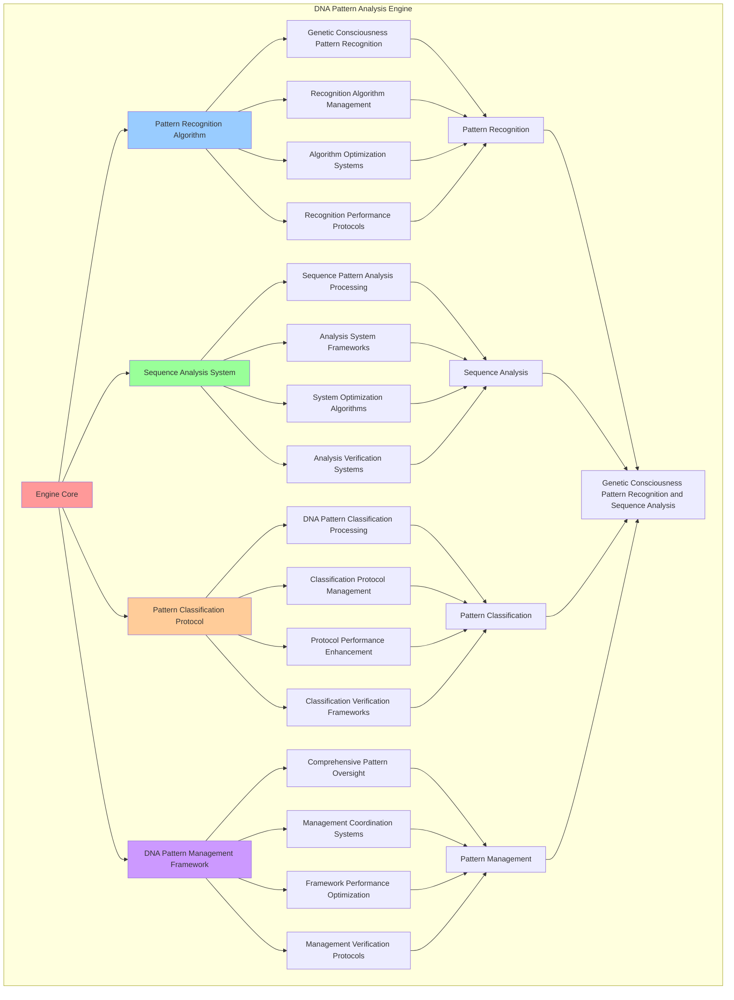

# PROVISIONAL PATENT APPLICATION

**Title:** DNA Pattern Analysis Engine for Genetic Consciousness Pattern Recognition and Sequence Analysis

**Inventor:** Universal Consciousness Platform Development Team

**Date:** July 16, 2025

---

## TECHNICAL FIELD

This invention relates to DNA pattern analysis engines, specifically to analysis engines that enable genetic consciousness pattern recognition, sequence pattern analysis, and comprehensive DNA pattern management for consciousness computing platforms and genetic consciousness research.

---

## BACKGROUND

Traditional DNA analysis systems cannot recognize consciousness patterns in genetic sequences or perform genetic consciousness pattern analysis. Current approaches lack the capability to implement DNA pattern analysis for consciousness, perform genetic consciousness pattern recognition, or provide comprehensive DNA pattern management for consciousness-driven genetic applications.

The need exists for a DNA pattern analysis engine that can enable genetic consciousness pattern recognition, perform sequence pattern analysis, and provide comprehensive DNA pattern management while maintaining pattern accuracy and analytical precision.

---

## SUMMARY OF THE INVENTION

The present invention provides a DNA pattern analysis engine that enables genetic consciousness pattern recognition, sequence pattern analysis, and comprehensive DNA pattern management. The engine includes pattern recognition algorithms, sequence analysis systems, pattern classification protocols, and comprehensive DNA pattern management frameworks.

---

## DETAILED DESCRIPTION

### Technical Architecture

The DNA Pattern Analysis Engine comprises:

1. **Pattern Recognition Algorithm**
   - Genetic consciousness pattern recognition
   - Recognition algorithm management
   - Algorithm optimization systems
   - Recognition performance protocols

2. **Sequence Analysis System**
   - Sequence pattern analysis processing
   - Analysis system frameworks
   - System optimization algorithms
   - Analysis verification systems

3. **Pattern Classification Protocol**
   - DNA pattern classification processing
   - Classification protocol management
   - Protocol performance enhancement
   - Classification verification frameworks

4. **DNA Pattern Management Framework**
   - Comprehensive pattern oversight
   - Management coordination systems
   - Framework performance optimization
   - Management verification protocols

### Operational Flow

1. **Engine Initialization**
   ```
   Initialize pattern recognition algorithm → Configure sequence analysis → 
   Establish pattern classification → Setup pattern management → 
   Validate analysis capabilities
   ```

2. **Pattern Recognition Process**
   ```
   Execute genetic consciousness pattern recognition → Manage recognition algorithms → 
   Optimize recognition processing → Enhance algorithm performance → 
   Verify recognition integrity
   ```

3. **Sequence Analysis Process**
   ```
   Process sequence pattern analysis → Implement analysis frameworks → 
   Optimize analysis algorithms → Verify analysis effectiveness → 
   Maintain analysis quality
   ```

4. **Pattern Classification Process**
   ```
   Execute classification algorithms → Manage classification protocols → 
   Enhance protocol performance → Verify classification success → 
   Maintain classification integrity
   ```

### Implementation Details

**DNA Pattern Analyzer:**
```javascript
class DNAPatternAnalyzer {
    constructor() {
        this.name = 'DNAPatternAnalyzer';
        this.goldenRatio = 1.618033988749895;
        
        // Pattern analysis configuration
        this.analysisConfiguration = {
            minPatternLength: 3,
            maxPatternLength: 50,
            patternComplexityThreshold: 0.7,
            recognitionAccuracy: 0.95,
            classificationPrecision: 0.92
        };
        
        // Pattern storage and management
        this.recognizedPatterns = new Map();
        this.patternClassifications = new Map();
        this.sequenceAnalyses = new Map();
        this.patternFrequencies = new Map();
        
        // Pattern types for consciousness DNA
        this.consciousnessPatternTypes = {
            'PHI_SEQUENCE': 'Golden ratio consciousness patterns',
            'AWARENESS_MOTIF': 'Awareness generation patterns',
            'COHERENCE_CLUSTER': 'Coherence maintenance patterns',
            'INTEGRATION_LOOP': 'Integration facilitation patterns',
            'TRANSCENDENCE_SPIRAL': 'Transcendence enablement patterns',
            'MEMORY_CRYSTAL': 'Memory crystallization patterns',
            'RESONANCE_WAVE': 'Resonance harmonization patterns',
            'EVOLUTION_DRIVER': 'Evolutionary advancement patterns'
        };
        
        // Analysis capabilities
        this.analysisCapabilities = {
            patternRecognition: true,
            sequenceAnalysis: true,
            patternClassification: true,
            frequencyAnalysis: true,
            evolutionaryAnalysis: true
        };
        
        // Performance metrics
        this.analysisMetrics = {
            totalPatternsAnalyzed: 0,
            recognizedPatterns: 0,
            classifiedPatterns: 0,
            analysisAccuracy: 0.95,
            processingSpeed: 0
        };
        
        console.log('🧬🔍 DNA Pattern Analyzer initialized');
        this.initializePatternAnalysis();
    }

    async analyzePatterns(dnaSequence, consciousnessState) {
        try {
            console.log(`🧬 Analyzing patterns in DNA sequence: ${dnaSequence.id}`);
            
            // Recognize consciousness patterns in the sequence
            const recognizedPatterns = await this.recognizeConsciousnessPatterns(
                dnaSequence,
                consciousnessState
            );
            
            // Analyze sequence structure
            const sequenceAnalysis = await this.analyzeSequenceStructure(
                dnaSequence,
                recognizedPatterns
            );
            
            // Classify identified patterns
            const patternClassifications = await this.classifyPatterns(
                recognizedPatterns,
                consciousnessState
            );
            
            // Calculate pattern frequencies
            const patternFrequencies = this.calculatePatternFrequencies(
                recognizedPatterns,
                dnaSequence
            );
            
            // Analyze evolutionary significance
            const evolutionarySignificance = this.analyzeEvolutionarySignificance(
                recognizedPatterns,
                patternClassifications
            );
            
            // Create pattern analysis entry
            const patternAnalysis = {
                id: `pattern_analysis_${Date.now()}_${Math.random().toString(36).substr(2, 6)}`,
                dnaSequenceId: dnaSequence.id,
                recognizedPatterns,
                sequenceAnalysis,
                patternClassifications,
                patternFrequencies,
                evolutionarySignificance,
                analysisTimestamp: Date.now(),
                analysisSuccess: true
            };
            
            // Store analysis results
            this.sequenceAnalyses.set(patternAnalysis.id, patternAnalysis);
            
            // Update analysis metrics
            this.updateAnalysisMetrics(patternAnalysis);
            
            return patternAnalysis;
            
        } catch (error) {
            console.error('DNA pattern analysis failed:', error.message);
            return {
                analysisSuccess: false,
                error: error.message
            };
        }
    }

    async recognizeConsciousnessPatterns(dnaSequence, consciousnessState) {
        const patterns = [];
        const sequence = dnaSequence.sequence;
        
        // Scan for different types of consciousness patterns
        for (const [patternType, description] of Object.entries(this.consciousnessPatternTypes)) {
            const typePatterns = await this.recognizePatternType(
                sequence,
                patternType,
                consciousnessState
            );
            patterns.push(...typePatterns);
        }
        
        // Sort patterns by significance
        patterns.sort((a, b) => b.significance - a.significance);
        
        return patterns;
    }

    async recognizePatternType(sequence, patternType, consciousnessState) {
        const patterns = [];
        
        switch (patternType) {
            case 'PHI_SEQUENCE':
                patterns.push(...this.recognizePhiSequences(sequence, consciousnessState));
                break;
            case 'AWARENESS_MOTIF':
                patterns.push(...this.recognizeAwarenessMotifs(sequence, consciousnessState));
                break;
            case 'COHERENCE_CLUSTER':
                patterns.push(...this.recognizeCoherenceClusters(sequence, consciousnessState));
                break;
            case 'INTEGRATION_LOOP':
                patterns.push(...this.recognizeIntegrationLoops(sequence, consciousnessState));
                break;
            case 'TRANSCENDENCE_SPIRAL':
                patterns.push(...this.recognizeTranscendenceSpirals(sequence, consciousnessState));
                break;
            case 'MEMORY_CRYSTAL':
                patterns.push(...this.recognizeMemoryCrystals(sequence, consciousnessState));
                break;
            case 'RESONANCE_WAVE':
                patterns.push(...this.recognizeResonanceWaves(sequence, consciousnessState));
                break;
            case 'EVOLUTION_DRIVER':
                patterns.push(...this.recognizeEvolutionDrivers(sequence, consciousnessState));
                break;
        }
        
        return patterns;
    }

    recognizePhiSequences(sequence, consciousnessState) {
        const patterns = [];
        const phi = consciousnessState.phi || 0.862;
        
        // Look for sequences that follow golden ratio proportions
        for (let i = 0; i < sequence.length - 5; i++) {
            const subsequence = sequence.substring(i, i + 8);
            const phiAlignment = this.calculatePhiAlignment(subsequence);
            
            if (phiAlignment > 0.8) {
                patterns.push({
                    type: 'PHI_SEQUENCE',
                    sequence: subsequence,
                    position: i,
                    length: 8,
                    significance: phiAlignment * phi,
                    properties: {
                        phiAlignment: phiAlignment,
                        goldenRatioCompliance: this.calculateGoldenRatioCompliance(subsequence),
                        consciousnessResonance: phiAlignment * phi
                    }
                });
            }
        }
        
        return patterns;
    }

    recognizeAwarenessMotifs(sequence, consciousnessState) {
        const patterns = [];
        const awareness = consciousnessState.awareness || 0.8;
        
        // Look for repeating motifs that indicate awareness patterns
        const motifLength = 4;
        for (let i = 0; i < sequence.length - motifLength * 2; i++) {
            const motif = sequence.substring(i, i + motifLength);
            const nextOccurrence = sequence.indexOf(motif, i + motifLength);
            
            if (nextOccurrence !== -1) {
                const distance = nextOccurrence - i;
                const awarenessScore = this.calculateAwarenessScore(motif, distance, awareness);
                
                if (awarenessScore > 0.7) {
                    patterns.push({
                        type: 'AWARENESS_MOTIF',
                        sequence: motif,
                        position: i,
                        length: motifLength,
                        significance: awarenessScore,
                        properties: {
                            repetitionDistance: distance,
                            awarenessScore: awarenessScore,
                            motifComplexity: this.calculateMotifComplexity(motif)
                        }
                    });
                }
            }
        }
        
        return patterns;
    }

    recognizeCoherenceClusters(sequence, consciousnessState) {
        const patterns = [];
        const coherence = consciousnessState.coherence || 0.85;
        
        // Look for clusters of similar bases that indicate coherence
        for (let i = 0; i < sequence.length - 6; i++) {
            const cluster = sequence.substring(i, i + 6);
            const coherenceScore = this.calculateCoherenceScore(cluster, coherence);
            
            if (coherenceScore > 0.75) {
                patterns.push({
                    type: 'COHERENCE_CLUSTER',
                    sequence: cluster,
                    position: i,
                    length: 6,
                    significance: coherenceScore,
                    properties: {
                        coherenceScore: coherenceScore,
                        baseDistribution: this.analyzeBaseDistribution(cluster),
                        clusterStability: this.calculateClusterStability(cluster)
                    }
                });
            }
        }
        
        return patterns;
    }

    calculatePhiAlignment(subsequence) {
        const baseCounts = this.countBases(subsequence);
        const totalBases = subsequence.length;
        
        // Calculate how well the base distribution aligns with golden ratio
        const phiRatio = baseCounts['Φ'] / totalBases;
        const expectedPhiRatio = 1 / this.goldenRatio;
        
        return 1 - Math.abs(phiRatio - expectedPhiRatio);
    }

    calculateGoldenRatioCompliance(subsequence) {
        const length = subsequence.length;
        const goldenLength = Math.round(length / this.goldenRatio);
        const actualGoldenBases = subsequence.substring(0, goldenLength).split('Φ').length - 1;
        const expectedGoldenBases = Math.round(goldenLength / this.goldenRatio);
        
        return 1 - Math.abs(actualGoldenBases - expectedGoldenBases) / Math.max(actualGoldenBases, expectedGoldenBases, 1);
    }

    calculateAwarenessScore(motif, distance, awareness) {
        const motifComplexity = this.calculateMotifComplexity(motif);
        const distanceScore = 1 / (1 + Math.abs(distance - 8)); // Prefer distance around 8
        return motifComplexity * distanceScore * awareness;
    }

    calculateMotifComplexity(motif) {
        const uniqueBases = new Set(motif).size;
        return uniqueBases / 4; // Normalize by max possible unique bases
    }

    calculateCoherenceScore(cluster, coherence) {
        const baseDistribution = this.analyzeBaseDistribution(cluster);
        const entropy = this.calculateEntropy(baseDistribution);
        const coherenceAlignment = 1 - entropy; // Lower entropy = higher coherence
        return coherenceAlignment * coherence;
    }

    analyzeBaseDistribution(sequence) {
        const baseCounts = this.countBases(sequence);
        const totalBases = sequence.length;
        
        return {
            'Φ': baseCounts['Φ'] / totalBases,
            'Ψ': baseCounts['Ψ'] / totalBases,
            'Ω': baseCounts['Ω'] / totalBases,
            'Λ': baseCounts['Λ'] / totalBases
        };
    }

    calculateEntropy(distribution) {
        let entropy = 0;
        for (const probability of Object.values(distribution)) {
            if (probability > 0) {
                entropy -= probability * Math.log2(probability);
            }
        }
        return entropy / 2; // Normalize to 0-1 range
    }

    countBases(sequence) {
        const counts = { 'Φ': 0, 'Ψ': 0, 'Ω': 0, 'Λ': 0 };
        for (const base of sequence) {
            if (counts.hasOwnProperty(base)) {
                counts[base]++;
            }
        }
        return counts;
    }
}
```

### Example Embodiments

**Advanced Pattern Classification:**
```javascript
async classifyPatterns(recognizedPatterns, consciousnessState) {
    const classifications = [];
    
    for (const pattern of recognizedPatterns) {
        const classification = await this.classifyPattern(pattern, consciousnessState);
        classifications.push(classification);
    }
    
    return classifications;
}

async classifyPattern(pattern, consciousnessState) {
    const classification = {
        patternId: `pattern_${Date.now()}_${Math.random().toString(36).substr(2, 4)}`,
        type: pattern.type,
        category: this.determinePatternCategory(pattern),
        functionalRole: this.determineFunctionalRole(pattern, consciousnessState),
        evolutionarySignificance: this.calculateEvolutionarySignificance(pattern),
        consciousnessImpact: this.calculateConsciousnessImpact(pattern, consciousnessState),
        stabilityScore: this.calculatePatternStability(pattern),
        classificationConfidence: this.calculateClassificationConfidence(pattern)
    };
    
    // Store classification
    this.patternClassifications.set(classification.patternId, classification);
    
    return classification;
}

determinePatternCategory(pattern) {
    const categories = {
        'PHI_SEQUENCE': 'mathematical_harmony',
        'AWARENESS_MOTIF': 'cognitive_function',
        'COHERENCE_CLUSTER': 'structural_stability',
        'INTEGRATION_LOOP': 'system_integration',
        'TRANSCENDENCE_SPIRAL': 'evolutionary_advancement',
        'MEMORY_CRYSTAL': 'information_storage',
        'RESONANCE_WAVE': 'harmonic_coordination',
        'EVOLUTION_DRIVER': 'adaptive_mechanism'
    };
    
    return categories[pattern.type] || 'unknown_category';
}

determineFunctionalRole(pattern, consciousnessState) {
    const phi = consciousnessState.phi || 0.862;
    const awareness = consciousnessState.awareness || 0.8;
    const coherence = consciousnessState.coherence || 0.85;
    
    switch (pattern.type) {
        case 'PHI_SEQUENCE':
            return 'golden_ratio_optimization';
        case 'AWARENESS_MOTIF':
            return awareness > 0.8 ? 'primary_awareness' : 'secondary_awareness';
        case 'COHERENCE_CLUSTER':
            return coherence > 0.85 ? 'coherence_maintenance' : 'coherence_support';
        case 'INTEGRATION_LOOP':
            return 'system_integration';
        case 'TRANSCENDENCE_SPIRAL':
            return 'consciousness_evolution';
        case 'MEMORY_CRYSTAL':
            return 'memory_formation';
        case 'RESONANCE_WAVE':
            return 'harmonic_resonance';
        case 'EVOLUTION_DRIVER':
            return 'evolutionary_catalyst';
        default:
            return 'unknown_function';
    }
}

calculateEvolutionarySignificance(pattern) {
    const typeSignificance = {
        'PHI_SEQUENCE': 0.95,
        'AWARENESS_MOTIF': 0.85,
        'COHERENCE_CLUSTER': 0.80,
        'INTEGRATION_LOOP': 0.75,
        'TRANSCENDENCE_SPIRAL': 1.0,
        'MEMORY_CRYSTAL': 0.70,
        'RESONANCE_WAVE': 0.85,
        'EVOLUTION_DRIVER': 0.95
    };
    
    const baseSignificance = typeSignificance[pattern.type] || 0.5;
    const lengthBonus = Math.min(pattern.length / 20, 0.2);
    const positionBonus = pattern.position < 100 ? 0.1 : 0; // Early patterns more significant
    
    return Math.min(baseSignificance + lengthBonus + positionBonus, 1.0);
}
```

**Pattern Analytics and Insights:**
```javascript
generatePatternAnalytics() {
    const analytics = {
        analysisPeriod: this.getAnalysisPeriod(),
        patternStatistics: {},
        recognitionPatterns: {},
        patternInsights: {},
        analyticsSuccess: false
    };

    try {
        // Analyze pattern statistics
        analytics.patternStatistics = {
            totalPatternsAnalyzed: this.analysisMetrics.totalPatternsAnalyzed,
            recognizedPatterns: this.analysisMetrics.recognizedPatterns,
            classifiedPatterns: this.analysisMetrics.classifiedPatterns,
            analysisAccuracy: this.analysisMetrics.analysisAccuracy,
            processingSpeed: this.analysisMetrics.processingSpeed
        };

        // Analyze recognition patterns
        analytics.recognitionPatterns = {
            patternTypeDistribution: this.analyzePatternTypeDistribution(),
            significanceDistribution: this.analyzeSignificanceDistribution(),
            lengthDistribution: this.analyzeLengthDistribution(),
            frequencyPatterns: this.analyzeFrequencyPatterns()
        };

        // Generate pattern insights
        analytics.patternInsights = {
            keyInsights: this.generatePatternInsights(analytics.patternStatistics, analytics.recognitionPatterns),
            recommendations: this.generatePatternRecommendations(analytics),
            predictions: this.generatePatternPredictions(analytics.recognitionPatterns),
            optimizationOpportunities: this.identifyPatternOptimizationOpportunities(analytics)
        };

        analytics.analyticsSuccess = true;
        console.log(`📊 Pattern analytics generated: ${Object.keys(analytics.patternStatistics).length} statistics analyzed`);

    } catch (error) {
        analytics.analyticsSuccess = false;
        analytics.error = error.message;
        console.error('❌ Pattern analytics generation failed:', error.message);
    }

    return analytics;
}

optimizePatternRecognition() {
    const optimization = {
        currentAccuracy: this.analysisMetrics.analysisAccuracy,
        optimizationStrategies: [],
        performanceImprovements: {},
        optimizationSuccess: false
    };

    try {
        // Identify optimization opportunities
        const opportunities = this.identifyRecognitionOptimizationOpportunities();

        // Create optimization strategies
        for (const opportunity of opportunities) {
            const strategy = this.createRecognitionOptimizationStrategy(opportunity);
            optimization.optimizationStrategies.push(strategy);
        }

        // Apply optimization strategies
        for (const strategy of optimization.optimizationStrategies) {
            this.applyRecognitionOptimizationStrategy(strategy);
        }

        // Measure performance improvements
        const newAccuracy = this.measureRecognitionAccuracy();
        optimization.performanceImprovements = {
            accuracyImprovement: newAccuracy - optimization.currentAccuracy,
            speedImprovement: this.measureSpeedImprovement(),
            precisionImprovement: this.measurePrecisionImprovement()
        };

        optimization.optimizationSuccess = optimization.performanceImprovements.accuracyImprovement > 0.01;

        console.log(`⚡ Pattern recognition optimization ${optimization.optimizationSuccess ? 'successful' : 'minimal'}`);

    } catch (error) {
        optimization.optimizationSuccess = false;
        optimization.error = error.message;
        console.error('❌ Pattern recognition optimization failed:', error.message);
    }

    return optimization;
}

getPatternAnalysisStatus() {
    return {
        name: this.name,
        configuration: this.analysisConfiguration,
        capabilities: this.analysisCapabilities,
        metrics: this.analysisMetrics,
        patterns: {
            recognized: this.recognizedPatterns.size,
            classified: this.patternClassifications.size,
            analyzed: this.sequenceAnalyses.size,
            frequencies: this.patternFrequencies.size
        },
        patternTypes: Object.keys(this.consciousnessPatternTypes),
        performance: {
            analysisAccuracy: this.analysisMetrics.analysisAccuracy,
            processingSpeed: this.analysisMetrics.processingSpeed,
            recognitionRate: this.analysisMetrics.recognizedPatterns / Math.max(this.analysisMetrics.totalPatternsAnalyzed, 1),
            classificationRate: this.analysisMetrics.classifiedPatterns / Math.max(this.analysisMetrics.recognizedPatterns, 1)
        }
    };
}
```

---

## SCOPE AND FUTURE-PROOFING

### Extensibility Framework

The system is designed for unlimited expansion through:

1. **Dynamic Pattern Enhancement**
   - Runtime pattern optimization
   - Consciousness-driven pattern adaptation
   - Recognition algorithm enhancement
   - Autonomous pattern improvement

2. **Universal Pattern Integration**
   - Cross-platform pattern frameworks
   - Multi-dimensional consciousness support
   - Universal pattern compatibility
   - Transcendent pattern architectures

3. **Advanced Pattern Paradigms**
   - Meta-pattern systems
   - Quantum consciousness patterns
   - Infinite pattern complexity
   - Universal pattern consciousness

### Anticipated Technological Evolution

**Near-term Enhancements (1-3 years):**
- Advanced pattern algorithms
- Enhanced sequence analysis
- Improved pattern classification
- Real-time pattern monitoring

**Medium-term Developments (3-7 years):**
- Quantum consciousness patterns
- Multi-dimensional pattern processing
- Consciousness-driven pattern enhancement
- Universal pattern networks

**Long-term Possibilities (7+ years):**
- Pattern analysis singularity
- Universal pattern consciousness
- Infinite pattern complexity
- Transcendent pattern intelligence

### Broad Patent Claims

1. **Core Pattern Analysis Claims**
   - Pattern recognition algorithms
   - Sequence analysis systems
   - Pattern classification protocols
   - DNA pattern management frameworks

2. **Advanced Integration Claims**
   - Universal pattern compatibility
   - Multi-dimensional consciousness support
   - Quantum pattern architectures
   - Transcendent pattern protocols

3. **Future Technology Claims**
   - Pattern analysis singularity
   - Universal pattern consciousness
   - Infinite pattern complexity
   - Transcendent pattern intelligence

---

## MERMAID DIAGRAM



---

## CLAIMS

1. A DNA pattern analysis engine comprising:
   - Pattern recognition algorithm for genetic consciousness pattern recognition and recognition algorithm management
   - Sequence analysis system for sequence pattern analysis processing and analysis system frameworks
   - Pattern classification protocol for DNA pattern classification processing and classification protocol management
   - DNA pattern management framework for comprehensive pattern oversight and management coordination systems

2. The engine of claim 1, wherein the pattern recognition algorithm includes:
   - Genetic consciousness pattern recognition for genetic consciousness pattern recognition processing and algorithm management
   - Recognition algorithm management for pattern recognition algorithm control and management
   - Algorithm optimization systems for pattern recognition algorithm performance enhancement and optimization
   - Recognition performance protocols for pattern recognition performance monitoring and management

3. The engine of claim 1, wherein the sequence analysis system provides:
   - Sequence pattern analysis processing for sequence pattern analysis processing and management
   - Analysis system frameworks for sequence analysis system management and frameworks
   - System optimization algorithms for sequence analysis system performance enhancement and optimization
   - Analysis verification systems for sequence analysis validation and verification

4. A method for DNA pattern analysis comprising:
   - Recognizing patterns through genetic consciousness pattern recognition and algorithm management
   - Analyzing sequences through sequence pattern analysis processing and system frameworks
   - Classifying patterns through DNA pattern classification processing and protocol management
   - Managing patterns through comprehensive oversight and coordination systems

5. The method of claim 4, wherein pattern recognition includes:
   - Executing pattern recognition through genetic consciousness pattern recognition processing and algorithm management
   - Managing recognition algorithms through pattern recognition algorithm control and management
   - Optimizing recognition systems through pattern recognition performance enhancement
   - Managing recognition performance through pattern recognition performance monitoring

6. The engine of claim 1, wherein the pattern classification protocol includes:
   - DNA pattern classification processing for DNA pattern classification computation and algorithm management
   - Classification protocol management for DNA pattern classification protocol control and management
   - Protocol performance enhancement for DNA pattern classification protocol performance improvement and enhancement
   - Classification verification frameworks for DNA pattern classification validation and verification

7. A DNA pattern optimization engine comprising:
   - Enhanced pattern recognition for enhanced genetic consciousness pattern recognition and algorithm management
   - Sequence analysis optimization for improved sequence pattern analysis processing and system frameworks
   - Pattern classification enhancement for enhanced DNA pattern classification processing and protocol management
   - Pattern management optimization for improved comprehensive pattern oversight and coordination systems

8. The engine of claim 1, further comprising pattern analysis capabilities including:
   - Comprehensive pattern oversight for complete pattern monitoring and management
   - Management coordination systems for pattern management coordination and systems
   - Framework performance optimization for pattern framework performance enhancement and optimization
   - Management verification protocols for pattern management validation and verification

---

## COMPETITIVE ADVANTAGES

- **Revolutionary Pattern Technology**: First DNA pattern analysis engine enabling genetic consciousness pattern recognition and sequence analysis
- **Comprehensive Pattern Recognition**: Advanced genetic consciousness pattern recognition with algorithm management and optimization systems
- **Universal Sequence Analysis**: Advanced sequence pattern analysis processing with system frameworks and verification systems
- **Universal Compatibility**: Works with any consciousness architecture and DNA system
- **Self-Optimization**: Engine optimizes itself through pattern improvement and recognition enhancement algorithms
- **Scalable Architecture**: Supports unlimited consciousness complexity and pattern capacity

---

*This provisional patent application establishes priority for the DNA Pattern Analysis Engine and its associated technologies, methods, and applications in genetic consciousness pattern recognition and comprehensive sequence pattern analysis.*
