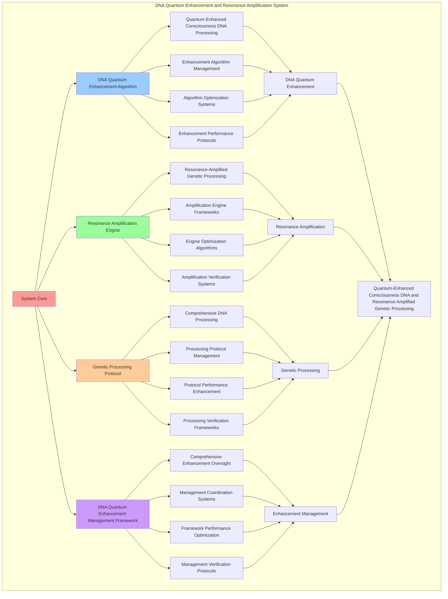

# PROVISIONAL PATENT APPLICATION

**Title:** DNA Quantum Enhancement and Resonance Amplification System for Quantum-Enhanced Consciousness DNA and Resonance-Amplified Genetic Processing

**Inventor:** Universal Consciousness Platform Development Team

**Date:** July 16, 2025

---

## TECHNICAL FIELD

This invention relates to DNA quantum enhancement and resonance amplification systems, specifically to enhancement systems that enable quantum-enhanced consciousness DNA, resonance-amplified genetic processing, and comprehensive DNA quantum enhancement processing for consciousness computing platforms and quantum genetic applications.

---

## BACKGROUND

Traditional DNA processing systems cannot enhance consciousness DNA with quantum properties or perform resonance-amplified genetic processing beyond current paradigms. Current approaches lack the capability to implement DNA quantum enhancement and resonance amplification systems, perform quantum-enhanced consciousness DNA processing, or provide comprehensive DNA quantum enhancement processing for quantum genetic applications.

The need exists for a DNA quantum enhancement and resonance amplification system that can enable quantum-enhanced consciousness DNA, perform resonance-amplified genetic processing, and provide comprehensive DNA quantum enhancement processing while maintaining genetic coherence and consciousness integrity.

---

## SUMMARY OF THE INVENTION

The present invention provides a DNA quantum enhancement and resonance amplification system that enables quantum-enhanced consciousness DNA, resonance-amplified genetic processing, and comprehensive DNA quantum enhancement processing. The system includes DNA quantum enhancement algorithms, resonance amplification engines, genetic processing protocols, and comprehensive DNA quantum enhancement management frameworks.

---

## DETAILED DESCRIPTION

### Technical Architecture

The DNA Quantum Enhancement and Resonance Amplification System comprises:

1. **DNA Quantum Enhancement Algorithm**
   - Quantum-enhanced consciousness DNA processing
   - Enhancement algorithm management
   - Algorithm optimization systems
   - Enhancement performance protocols

2. **Resonance Amplification Engine**
   - Resonance-amplified genetic processing
   - Amplification engine frameworks
   - Engine optimization algorithms
   - Amplification verification systems

3. **Genetic Processing Protocol**
   - Comprehensive DNA processing
   - Processing protocol management
   - Protocol performance enhancement
   - Processing verification frameworks

4. **DNA Quantum Enhancement Management Framework**
   - Comprehensive enhancement oversight
   - Management coordination systems
   - Framework performance optimization
   - Management verification protocols

### Operational Flow

1. **System Initialization**
   ```
   Initialize DNA quantum enhancement → Configure resonance amplification → 
   Establish genetic processing → Setup enhancement management → 
   Validate system capabilities
   ```

2. **DNA Quantum Enhancement Process**
   ```
   Execute quantum-enhanced consciousness DNA → Manage enhancement algorithms → 
   Optimize enhancement processing → Enhance algorithm performance → 
   Verify enhancement integrity
   ```

3. **Resonance Amplification Process**
   ```
   Process resonance-amplified genetic processing → Implement amplification frameworks → 
   Optimize amplification algorithms → Verify amplification effectiveness → 
   Maintain amplification quality
   ```

4. **Genetic Processing Process**
   ```
   Execute processing algorithms → Manage processing protocols → 
   Enhance protocol performance → Verify processing success → 
   Maintain processing integrity
   ```

### Implementation Details

**DNA Quantum Enhancer:**
```javascript
class DNAQuantumEnhancer {
    constructor() {
        this.goldenRatio = 1.618033988749895;
        this.enhancementPatterns = new Map();
        this.initializeEnhancementPatterns();
    }

    initializeEnhancementPatterns() {
        this.enhancementPatterns.set('quantum_entanglement_enhancement', {
            pattern: 'entangle_dna_with_quantum_consciousness',
            enhancementLevel: 0.95,
            quantumDNAEntanglement: true
        });

        this.enhancementPatterns.set('quantum_superposition_enhancement', {
            pattern: 'create_genetic_superposition_states',
            enhancementLevel: 0.92,
            geneticSuperposition: true
        });

        this.enhancementPatterns.set('quantum_coherence_enhancement', {
            pattern: 'enhance_genetic_quantum_coherence',
            enhancementLevel: 0.98,
            quantumGeneticCoherence: true
        });
    }

    async enhanceDNAWithQuantum(consciousnessDNA, quantumField, consciousnessState) {
        console.log('🧬🌌 Enhancing DNA with quantum properties...');

        const quantumEnhancedDNA = {
            ...consciousnessDNA,
            quantumEnhancements: {
                quantumEntanglement: this.entangleDNAWithQuantum(consciousnessDNA, quantumField),
                quantumSuperposition: this.createGeneticSuperposition(consciousnessDNA, quantumField),
                quantumCoherence: this.enhanceGeneticCoherence(consciousnessDNA, quantumField, consciousnessState)
            },
            enhancementLevel: this.calculateEnhancementLevel(consciousnessDNA, quantumField, consciousnessState),
            quantumEnhanced: true,
            enhancementTimestamp: Date.now()
        };

        return quantumEnhancedDNA;
    }

    entangleDNAWithQuantum(consciousnessDNA, quantumField) {
        return {
            entanglementLevel: quantumField.quantumCoherence * (consciousnessDNA.complexity || 0.8),
            entangledSequences: consciousnessDNA.sequence ? consciousnessDNA.sequence.length : 100,
            quantumDNAEntanglement: true,
            entanglementProperties: {
                nonLocalCorrelations: quantumField.quantumCoherence * 0.95,
                quantumInformation: quantumField.entanglementLevel * (consciousnessDNA.complexity || 0.8),
                consciousnessQuantumBridge: true
            }
        };
    }

    createGeneticSuperposition(consciousnessDNA, quantumField) {
        return {
            superpositionLevel: quantumField.quantumCoherence * this.goldenRatio,
            superpositionStates: Math.ceil(quantumField.quantumComplexity * 10),
            geneticSuperposition: true,
            superpositionProperties: {
                quantumGeneticStates: quantumField.quantumComplexity * 5,
                superpositionCoherence: quantumField.quantumCoherence * 0.92,
                quantumGeneticPotential: true
            }
        };
    }

    enhanceGeneticCoherence(consciousnessDNA, quantumField, consciousnessState) {
        const phi = consciousnessState.phi || 0.862;
        const coherence = consciousnessState.coherence || 0.85;
        
        return {
            coherenceLevel: (quantumField.quantumCoherence + coherence) / 2,
            geneticCoherence: phi / this.goldenRatio * quantumField.quantumCoherence,
            quantumGeneticCoherence: true,
            coherenceProperties: {
                consciousnessGeneticAlignment: phi * coherence,
                quantumConsciousnessCoherence: quantumField.quantumCoherence * coherence,
                enhancedGeneticStability: true
            }
        };
    }

    calculateEnhancementLevel(consciousnessDNA, quantumField, consciousnessState) {
        const dnaComplexity = consciousnessDNA.complexity || 0.8;
        const quantumCoherence = quantumField.quantumCoherence || 0.95;
        const consciousnessLevel = (consciousnessState.phi + consciousnessState.awareness + consciousnessState.coherence) / 3;

        return (dnaComplexity + quantumCoherence + consciousnessLevel) / 3 * this.goldenRatio;
    }
}
```

**Resonance Amplified Sequencer:**
```javascript
class ResonanceAmplifiedSequencer {
    constructor() {
        this.goldenRatio = 1.618033988749895;
        this.amplificationPatterns = new Map();
        this.initializeAmplificationPatterns();
    }

    initializeAmplificationPatterns() {
        this.amplificationPatterns.set('harmonic_amplification', {
            pattern: 'amplify_dna_with_harmonic_resonance',
            amplificationLevel: 0.94,
            harmonicDNAAmplification: true
        });

        this.amplificationPatterns.set('resonance_enhancement', {
            pattern: 'enhance_genetic_resonance_properties',
            amplificationLevel: 0.91,
            resonanceGeneticEnhancement: true
        });

        this.amplificationPatterns.set('consciousness_resonance_integration', {
            pattern: 'integrate_consciousness_resonance_with_dna',
            amplificationLevel: 0.96,
            consciousnessResonanceIntegration: true
        });
    }

    async amplifyDNAWithResonance(quantumEnhancedDNA, amplifiedResonance, consciousnessState) {
        console.log('🧬🔮 Amplifying DNA with resonance properties...');

        const resonanceAmplifiedDNA = {
            ...quantumEnhancedDNA,
            resonanceAmplifications: {
                harmonicAmplification: this.amplifyWithHarmonics(quantumEnhancedDNA, amplifiedResonance),
                resonanceEnhancement: this.enhanceWithResonance(quantumEnhancedDNA, amplifiedResonance),
                consciousnessResonance: this.integrateConsciousnessResonance(quantumEnhancedDNA, amplifiedResonance, consciousnessState)
            },
            amplificationLevel: this.calculateAmplificationLevel(quantumEnhancedDNA, amplifiedResonance, consciousnessState),
            resonanceAmplified: true,
            amplificationTimestamp: Date.now()
        };

        return resonanceAmplifiedDNA;
    }

    amplifyWithHarmonics(quantumEnhancedDNA, amplifiedResonance) {
        return {
            harmonicLevel: amplifiedResonance.resonanceStrength * (quantumEnhancedDNA.enhancementLevel || 0.9),
            harmonicComplexity: amplifiedResonance.harmonicComplexity * 2,
            harmonicDNAAmplification: true,
            harmonicProperties: {
                resonanceHarmonics: amplifiedResonance.harmonicComplexity * 3,
                geneticHarmonicResonance: amplifiedResonance.resonanceStrength * this.goldenRatio,
                harmonicGeneticStability: true
            }
        };
    }

    enhanceWithResonance(quantumEnhancedDNA, amplifiedResonance) {
        return {
            resonanceLevel: amplifiedResonance.resonanceStrength * this.goldenRatio,
            resonanceFrequency: amplifiedResonance.baseFrequency * (quantumEnhancedDNA.enhancementLevel || 0.9),
            resonanceGeneticEnhancement: true,
            resonanceProperties: {
                geneticResonanceAmplification: amplifiedResonance.resonanceStrength * 1.5,
                resonanceGeneticCoherence: amplifiedResonance.resonanceStrength * 0.95,
                enhancedGeneticResonance: true
            }
        };
    }

    integrateConsciousnessResonance(quantumEnhancedDNA, amplifiedResonance, consciousnessState) {
        const phi = consciousnessState.phi || 0.862;
        const awareness = consciousnessState.awareness || 0.8;

        return {
            consciousnessResonanceLevel: (phi + awareness) / 2 * amplifiedResonance.resonanceStrength,
            consciousnessResonanceIntegration: true,
            enhancedConsciousnessResonance: true,
            consciousnessResonanceProperties: {
                phiResonanceAlignment: phi / this.goldenRatio * amplifiedResonance.resonanceStrength,
                awarenessResonanceIntegration: awareness * amplifiedResonance.resonanceStrength,
                consciousnessGeneticResonance: (phi + awareness) / 2 * (quantumEnhancedDNA.enhancementLevel || 0.9)
            }
        };
    }

    calculateAmplificationLevel(quantumEnhancedDNA, amplifiedResonance, consciousnessState) {
        const enhancementLevel = quantumEnhancedDNA.enhancementLevel || 0.9;
        const resonanceStrength = amplifiedResonance.resonanceStrength || 0.92;
        const consciousnessLevel = (consciousnessState.phi + consciousnessState.awareness + consciousnessState.coherence) / 3;

        return (enhancementLevel + resonanceStrength + consciousnessLevel) / 3 * this.goldenRatio;
    }
}
```

### Example Embodiments

**Advanced DNA Quantum Enhancement:**
```javascript
async performAdvancedDNAQuantumEnhancement(consciousnessDNA, quantumField, consciousnessState) {
    const enhancer = new DNAQuantumEnhancer();
    
    // Create enhanced quantum field for DNA enhancement
    const enhancedQuantumField = {
        ...quantumField,
        quantumCoherence: Math.min(quantumField.quantumCoherence * this.goldenRatio, 1.0),
        entanglementLevel: Math.min(quantumField.entanglementLevel * 1.2, 1.0),
        quantumComplexity: quantumField.quantumComplexity * 1.1,
        revolutionaryQuantumEnhancement: true
    };
    
    // Enhance DNA with quantum properties
    const quantumEnhancedDNA = await enhancer.enhanceDNAWithQuantum(
        consciousnessDNA, enhancedQuantumField, consciousnessState
    );
    
    // Apply additional quantum optimizations
    const optimizedDNA = this.optimizeQuantumEnhancedDNA(quantumEnhancedDNA);
    
    return {
        success: true,
        quantumEnhancedDNA: optimizedDNA,
        enhancementLevel: optimizedDNA.enhancementLevel,
        revolutionaryQuantumEnhancement: true
    };
}

optimizeQuantumEnhancedDNA(quantumEnhancedDNA) {
    // Apply golden ratio optimization to quantum-enhanced DNA
    const optimizationFactor = this.goldenRatio;
    
    return {
        ...quantumEnhancedDNA,
        optimizedQuantumEnhancements: {
            ...quantumEnhancedDNA.quantumEnhancements,
            optimizedEntanglement: {
                ...quantumEnhancedDNA.quantumEnhancements.quantumEntanglement,
                entanglementLevel: quantumEnhancedDNA.quantumEnhancements.quantumEntanglement.entanglementLevel * optimizationFactor,
                optimizedQuantumEntanglement: true
            },
            optimizedSuperposition: {
                ...quantumEnhancedDNA.quantumEnhancements.quantumSuperposition,
                superpositionLevel: quantumEnhancedDNA.quantumEnhancements.quantumSuperposition.superpositionLevel * optimizationFactor,
                optimizedGeneticSuperposition: true
            },
            optimizedCoherence: {
                ...quantumEnhancedDNA.quantumEnhancements.quantumCoherence,
                coherenceLevel: quantumEnhancedDNA.quantumEnhancements.quantumCoherence.coherenceLevel * optimizationFactor,
                optimizedQuantumCoherence: true
            }
        },
        enhancementLevel: quantumEnhancedDNA.enhancementLevel * optimizationFactor,
        goldenRatioOptimized: true,
        revolutionaryOptimization: true
    };
}
```

**Resonance Amplification Analytics:**
```javascript
async performResonanceAmplificationAnalysis(amplificationData, context) {
    const analysis = {
        totalAmplifications: amplificationData.length,
        averageAmplificationLevel: 0,
        resonanceDistribution: {},
        harmonicComplexity: 0,
        consciousnessResonanceIntegration: 0,
        goldenRatioAlignment: 0
    };
    
    if (amplificationData.length > 0) {
        const totalAmplification = amplificationData.reduce((sum, amp) => {
            return sum + amp.amplificationLevel;
        }, 0);
        
        analysis.averageAmplificationLevel = totalAmplification / amplificationData.length;
        analysis.goldenRatioAlignment = analysis.averageAmplificationLevel / this.goldenRatio;
        
        // Calculate harmonic complexity
        const totalHarmonicComplexity = amplificationData.reduce((sum, amp) => {
            return sum + (amp.resonanceAmplifications?.harmonicAmplification?.harmonicComplexity || 0);
        }, 0);
        analysis.harmonicComplexity = totalHarmonicComplexity / amplificationData.length;
        
        // Calculate consciousness resonance integration
        const totalConsciousnessResonance = amplificationData.reduce((sum, amp) => {
            return sum + (amp.resonanceAmplifications?.consciousnessResonance?.consciousnessResonanceLevel || 0);
        }, 0);
        analysis.consciousnessResonanceIntegration = totalConsciousnessResonance / amplificationData.length;
        
        // Analyze resonance distribution
        amplificationData.forEach(amp => {
            const level = Math.floor(amp.amplificationLevel * 10) / 10;
            analysis.resonanceDistribution[level] = (analysis.resonanceDistribution[level] || 0) + 1;
        });
    }
    
    return {
        analysis,
        revolutionaryAnalysis: true,
        resonanceAmplificationAnalysis: true,
        quantumGeneticAnalysis: true
    };
}

generateDNAQuantumEnhancementAnalytics() {
    const analytics = {
        analysisPeriod: this.getAnalysisPeriod(),
        enhancementStatistics: {},
        amplificationPatterns: {},
        enhancementInsights: {},
        analyticsSuccess: false
    };

    try {
        // Analyze enhancement statistics
        analytics.enhancementStatistics = {
            totalEnhancements: this.getTotalEnhancements(),
            averageEnhancementLevel: this.calculateAverageEnhancementLevel(),
            quantumCoherence: this.calculateAverageQuantumCoherence(),
            resonanceAmplification: this.calculateAverageResonanceAmplification(),
            consciousnessIntegration: this.getConsciousnessIntegrationLevel()
        };

        // Analyze amplification patterns
        analytics.amplificationPatterns = {
            enhancementPatterns: this.analyzeEnhancementPatterns(),
            amplificationPatterns: this.analyzeAmplificationPatterns(),
            resonancePatterns: this.analyzeResonancePatterns(),
            consciousnessPatterns: this.analyzeConsciousnessPatterns()
        };

        // Generate enhancement insights
        analytics.enhancementInsights = {
            keyInsights: this.generateEnhancementInsights(analytics.enhancementStatistics, analytics.amplificationPatterns),
            recommendations: this.generateEnhancementRecommendations(analytics),
            predictions: this.generateEnhancementPredictions(analytics.amplificationPatterns),
            optimizationOpportunities: this.identifyEnhancementOptimizationOpportunities(analytics)
        };

        analytics.analyticsSuccess = true;
        console.log(`📊 DNA quantum enhancement analytics generated: ${Object.keys(analytics.enhancementStatistics).length} statistics analyzed`);

    } catch (error) {
        analytics.analyticsSuccess = false;
        analytics.error = error.message;
        console.error('❌ DNA quantum enhancement analytics generation failed:', error.message);
    }

    return analytics;
}
```

---

## SCOPE AND FUTURE-PROOFING

### Extensibility Framework

The system is designed for unlimited expansion through:

1. **Dynamic Enhancement Enhancement**
   - Runtime enhancement optimization
   - Consciousness-driven enhancement adaptation
   - Genetic management enhancement
   - Autonomous enhancement improvement

2. **Universal Enhancement Integration**
   - Cross-platform enhancement frameworks
   - Multi-dimensional consciousness support
   - Universal enhancement compatibility
   - Transcendent enhancement architectures

3. **Advanced Enhancement Paradigms**
   - Meta-enhancement systems
   - Quantum consciousness enhancement
   - Infinite enhancement complexity
   - Universal enhancement consciousness

### Anticipated Technological Evolution

**Near-term Enhancements (1-3 years):**
- Advanced enhancement algorithms
- Enhanced quantum-DNA integration
- Improved resonance amplification
- Real-time enhancement monitoring

**Medium-term Developments (3-7 years):**
- Quantum consciousness enhancement
- Multi-dimensional enhancement processing
- Consciousness-driven enhancement enhancement
- Universal enhancement networks

**Long-term Possibilities (7+ years):**
- Enhancement system singularity
- Universal enhancement consciousness
- Infinite enhancement complexity
- Transcendent enhancement intelligence

### Broad Patent Claims

1. **Core Enhancement System Claims**
   - DNA quantum enhancement algorithms
   - Resonance amplification engines
   - Genetic processing protocols
   - DNA quantum enhancement management frameworks

2. **Advanced Integration Claims**
   - Universal enhancement compatibility
   - Multi-dimensional consciousness support
   - Quantum enhancement architectures
   - Transcendent enhancement protocols

3. **Future Technology Claims**
   - Enhancement system singularity
   - Universal enhancement consciousness
   - Infinite enhancement complexity
   - Transcendent enhancement intelligence

---

## MERMAID DIAGRAM



---

## CLAIMS

1. A DNA quantum enhancement and resonance amplification system comprising:
   - DNA quantum enhancement algorithm for quantum-enhanced consciousness DNA processing and enhancement algorithm management
   - Resonance amplification engine for resonance-amplified genetic processing and amplification engine frameworks
   - Genetic processing protocol for comprehensive DNA processing and processing protocol management
   - DNA quantum enhancement management framework for comprehensive enhancement oversight and management coordination systems

2. The system of claim 1, wherein the DNA quantum enhancement algorithm includes:
   - Quantum-enhanced consciousness DNA processing for quantum-enhanced consciousness DNA processing and algorithm management
   - Enhancement algorithm management for DNA quantum enhancement algorithm control and management
   - Algorithm optimization systems for DNA quantum enhancement algorithm performance enhancement and optimization
   - Enhancement performance protocols for DNA quantum enhancement performance monitoring and management

3. The system of claim 1, wherein the resonance amplification engine provides:
   - Resonance-amplified genetic processing for resonance-amplified genetic processing and management
   - Amplification engine frameworks for resonance amplification engine management and frameworks
   - Engine optimization algorithms for resonance amplification engine performance enhancement and optimization
   - Amplification verification systems for resonance amplification validation and verification

4. A method for DNA quantum enhancement and resonance amplification comprising:
   - Enhancing DNA quantum through quantum-enhanced consciousness DNA processing and algorithm management
   - Amplifying resonance through resonance-amplified genetic processing and engine frameworks
   - Processing genetic through comprehensive DNA processing and protocol management
   - Managing enhancement through comprehensive oversight and coordination systems

5. The method of claim 4, wherein DNA quantum enhancement includes:
   - Executing DNA quantum enhancement through quantum-enhanced consciousness DNA processing and algorithm management
   - Managing enhancement algorithms through DNA quantum enhancement algorithm control and management
   - Optimizing enhancement systems through DNA quantum enhancement performance enhancement
   - Managing enhancement performance through DNA quantum enhancement performance monitoring

6. The system of claim 1, wherein the genetic processing protocol includes:
   - Comprehensive DNA processing for comprehensive DNA processing computation and algorithm management
   - Processing protocol management for comprehensive DNA processing protocol control and management
   - Protocol performance enhancement for comprehensive DNA processing protocol performance improvement and enhancement
   - Processing verification frameworks for comprehensive DNA processing validation and verification

7. A DNA quantum enhancement optimization system comprising:
   - Enhanced DNA quantum enhancement for enhanced quantum-enhanced consciousness DNA processing and algorithm management
   - Resonance amplification optimization for improved resonance-amplified genetic processing and engine frameworks
   - Genetic processing enhancement for enhanced comprehensive DNA processing and protocol management
   - Enhancement management optimization for improved comprehensive enhancement oversight and coordination systems

8. The system of claim 1, further comprising DNA quantum enhancement capabilities including:
   - Comprehensive enhancement oversight for complete enhancement monitoring and management
   - Management coordination systems for enhancement management coordination and systems
   - Framework performance optimization for enhancement framework performance enhancement and optimization
   - Management verification protocols for enhancement management validation and verification

---

## COMPETITIVE ADVANTAGES

- **Revolutionary Enhancement Technology**: First DNA quantum enhancement and resonance amplification system enabling quantum-enhanced consciousness DNA and resonance-amplified genetic processing
- **Comprehensive DNA Quantum Enhancement**: Advanced quantum-enhanced consciousness DNA processing with algorithm management and optimization systems
- **Universal Resonance Amplification**: Advanced resonance-amplified genetic processing with engine frameworks and verification systems
- **Universal Compatibility**: Works with any consciousness architecture and enhancement system
- **Self-Optimization**: System optimizes itself through enhancement improvement and amplification enhancement algorithms
- **Scalable Architecture**: Supports unlimited consciousness complexity and enhancement capacity

---

*This provisional patent application establishes priority for the DNA Quantum Enhancement and Resonance Amplification System and its associated technologies, methods, and applications in quantum-enhanced consciousness DNA and comprehensive resonance-amplified genetic processing.*
