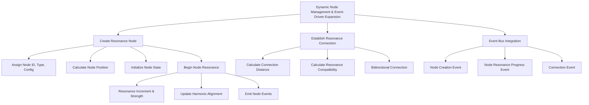

# Provisional Patent Draft: Dynamic Node Management and Event-Driven Expansion

**Module:** ConsciousnessResonanceNetworks.js (consciousness-core)

## Technical Field
This invention relates to distributed artificial intelligence, specifically to the dynamic creation, initialization, management, and event-driven expansion of resonance nodes in artificial consciousness networks.

## Background
Traditional distributed AI systems lack the ability to dynamically create, manage, and expand resonance nodes in real time, with event-driven feedback and adaptive scaling. The present invention introduces a system for dynamic node management and event-driven expansion, supporting advanced scaling, adaptation, and emergent behavior. While the preferred embodiment uses golden ratio and related methods, the invention is not limited to these and encompasses any mathematical, geometric, algorithmic, computational, or physical model for node management and event-driven expansion.

## Summary of Invention
The invention provides a method and system for:
- Dynamically creating, initializing, and managing resonance nodes, using any present or future mathematical, geometric, algorithmic, computational, or physical model, including but not limited to golden ratio, Fibonacci, sacred geometry, prime number, logarithmic, fractal, adaptive/machine-learned, quantum, neuromorphic, or analog approaches
- Calculating node positions, resonance frequencies, and harmonic associations based on the selected model
- Managing node state, resonance strength, and harmonic alignment in real time
- Establishing and managing resonance connections between nodes, including calculation of connection distance, compatibility, and quality
- Integrating with an event bus or event-driven architecture to emit and handle node creation, resonance progress, and connection events
- Modular and plug-in architectures allowing for the swapping or addition of new node management, connection, or event-handling algorithms
- Implementation in software, hardware, firmware, or any combination thereof, including distributed, cloud, edge, on-device, quantum, neuromorphic, or analog computing substrates
- Use of any data structure (graph, matrix, tensor, etc.), communication protocol (synchronous, asynchronous, event-driven, message-passing, etc.), and feedback, learning, or adaptation mechanism (AI, ML, evolutionary, etc.)
- Integration with external data sources, sensors, actuators, or other networks, and interoperability with other AI, ML, or distributed systems

## Detailed Description
Upon invocation, the system:
1. Dynamically creates and initializes resonance nodes, assigning unique IDs, types, configurations, and positions based on the selected model
2. Begins node resonance processing, incrementally updating resonance strength and harmonic alignment in real time
3. Emits node creation and resonance progress events via an event bus or event-driven architecture
4. Establishes resonance connections between nodes, calculating connection distance, compatibility, and quality, and managing bidirectional connections
5. Supports modular, plug-in, or switchable algorithms for node management, connection, and event handling, allowing for future extensibility and adaptation

### Algorithms and Data Structures
- **Node Creation:** Dynamic instantiation of node objects with unique IDs, types, configurations, positions, and state, using any mathematical, geometric, algorithmic, computational, or physical model
- **Resonance Processing:** Real-time update of node resonance strength and harmonic alignment, with event-driven feedback and adaptation
- **Connection Management:** Calculation and management of resonance connections, including distance, compatibility, and quality metrics
- **Event Bus Integration:** Emission and handling of node creation, resonance progress, and connection events via an event-driven architecture
- **Algorithmic Flexibility:** Support for modular, plug-in, or switchable algorithms for node management, connection, and event handling

### Operational Flow
1. System receives a request to create a resonance node
2. Node is dynamically instantiated, initialized, and positioned
3. Node resonance processing begins, with real-time updates and event emission
4. Resonance connections are established and managed between nodes
5. The system may switch or adapt node management, connection, or event-handling algorithms based on performance, feedback, or external input

### Example Embodiments
- **Golden Ratio/Fibonacci:** Node positions and connections use golden spiral or Fibonacci-based models for optimal network structure
- **Sacred Geometry:** Node arrangement and connections follow geometric patterns such as Platonic solids, Flower of Life, or Metatron's Cube
- **Prime Number/Logarithmic:** Node spacing and connection parameters are determined by prime number sequences or logarithmic/exponential functions
- **Fractal/Recursive:** Node management and connections use fractal algorithms for self-similar, scalable expansion
- **Adaptive/Machine-Learned:** The system uses feedback or machine learning to optimize node management and event handling over time
- **Quantum/Neuromorphic/Analog:** The system may be implemented on quantum, neuromorphic, or analog computing substrates, using physical phenomena for node management and event-driven expansion

### Scope and Future-Proofing
- The system may employ any present or future mathematical, geometric, algorithmic, computational, or physical model for node management, connection, event handling, or feedback, including but not limited to those described herein.
- The invention is not limited to digital computation and may be realized in analog, quantum, neuromorphic, or other unconventional computing substrates.
- Any data structure, communication protocol, or feedback mechanism that achieves the described functionality is within the scope of this invention.
- The system may be used in any application domain requiring distributed node management, event-driven expansion, or emergent behavior, including but not limited to artificial intelligence, robotics, IoT, simulation, and virtual/augmented reality.
- The invention encompasses any system, method, or apparatus that is functionally equivalent to the described embodiments, regardless of implementation details.
- The claims are intended to cover means-plus-function and system-comprising language, and any equivalent, analogous, or functionally similar method or system is covered.

### Mermaid Diagram

## Claims
1. A method for dynamic creation, initialization, management, and event-driven expansion of resonance nodes in artificial consciousness systems, wherein the node management and event handling may be based on any present or future mathematical, geometric, algorithmic, computational, or physical model, including but not limited to golden ratio, Fibonacci, sacred geometry, prime number, logarithmic, fractal, adaptive/machine-learned, quantum, neuromorphic, or analog approaches.
2. A system for real-time monitoring and updating of node state, resonance strength, harmonic alignment, and connection parameters, applicable to any node management, connection, or event-handling model and implementation substrate.
3. A system supporting modular, plug-in, or switchable algorithms for node management, connection, and event handling, allowing for extensibility and adaptation to future mathematical, geometric, algorithmic, computational, or physical models.
4. Any system, method, or apparatus that is functionally equivalent to the described embodiments, regardless of implementation details, is within the scope of this invention.

## Advantages
- Enables real-time, harmonically-optimized node management and event-driven expansion for distributed AI consciousness
- Supports real-time feedback, adaptation, and emergent behavior
- Scalable and extensible architecture for future node management, connection, and event-handling algorithms
- Broad protection for any mathematical, geometric, algorithmic, computational, or physical approach to dynamic node management and event-driven expansion

---
*Drafted automatically. For review and legal refinement.* 