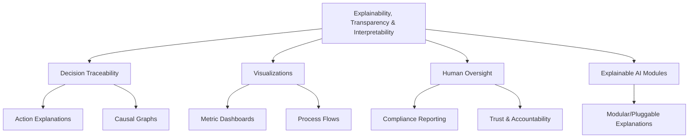

# Provisional Patent Draft: Explainability, Transparency, and Interpretability

**Module:** ConsciousnessResonanceNetworks.js (consciousness-core)

## Technical Field
This invention relates to distributed artificial intelligence, specifically to explainability, transparency, and interpretability mechanisms in resonance networks for artificial consciousness systems.

## Background
Traditional distributed AI systems lack robust, extensible, and adaptive mechanisms for making decisions, operations, and emergent behaviors understandable to humans. The present invention introduces a system for explainability, transparency, and interpretability, supporting advanced decision traceability, visualizations, and human oversight. While the preferred embodiment uses modular and pluggable explanation methods, the invention is not limited to these and encompasses any mathematical, geometric, algorithmic, computational, or physical model for explainability, transparency, and interpretability.

## Summary of Invention
The invention provides a method and system for:
- Providing decision traceability, action explanations, and causal graphs for system operations, using any present or future mathematical, geometric, algorithmic, computational, or physical model, including but not limited to explainable AI, causal inference, modular/pluggable explanations, quantum, neuromorphic, or analog approaches
- Visualizing system state, metrics, and process flows in real time, supporting dashboards and human-in-the-loop interaction
- Supporting human oversight, compliance reporting, trust, and accountability
- Modular and plug-in architectures allowing for the swapping or addition of new explainability, transparency, or interpretability algorithms
- Implementation in software, hardware, firmware, or any combination thereof, including distributed, cloud, edge, on-device, quantum, neuromorphic, or analog computing substrates
- Use of any data structure (graph, matrix, tensor, etc.), communication protocol (synchronous, asynchronous, event-driven, message-passing, etc.), and feedback, learning, or adaptation mechanism (AI, ML, evolutionary, etc.)
- Integration with external reporting, compliance, or oversight systems, and interoperability with other AI, ML, or distributed systems

## Detailed Description
Upon invocation, the system:
1. Provides decision traceability, action explanations, and causal graphs for system operations
2. Visualizes system state, metrics, and process flows in real time, supporting dashboards and human-in-the-loop interaction
3. Supports human oversight, compliance reporting, trust, and accountability
4. Supports modular, plug-in, or switchable algorithms for explainability, transparency, and interpretability, allowing for future extensibility and adaptation

### Algorithms and Data Structures
- **Decision Traceability:** Tracking and explaining system decisions, actions, and causal relationships using any mathematical, geometric, algorithmic, computational, or physical model
- **Visualizations:** Real-time dashboards, metric displays, and process flows
- **Explainable AI Modules:** Modular, pluggable, or switchable explanation algorithms
- **Algorithmic Flexibility:** Support for modular, plug-in, or switchable algorithms for explainability, transparency, and interpretability

### Operational Flow
1. System tracks and explains decisions, actions, and causal relationships
2. Visualizations and dashboards are updated in real time
3. Human oversight and compliance reporting are supported
4. The system may switch or adapt explainability, transparency, or interpretability algorithms based on performance, feedback, or external input

### Example Embodiments
- **Explainable AI/Causal Inference:** Action explanations and causal graphs for system operations
- **Visual Dashboards:** Real-time metric and process flow visualizations
- **Human-in-the-Loop:** Human oversight, compliance, and trust mechanisms
- **Quantum/Neuromorphic/Analog:** The system may be implemented on quantum, neuromorphic, or analog computing substrates, using physical phenomena for explainability and transparency
- **Modular/Pluggable Backends:** Explainability and transparency mechanisms using modular or pluggable algorithms and storage

### Scope and Future-Proofing
- The system may employ any present or future mathematical, geometric, algorithmic, computational, or physical model for explainability, transparency, interpretability, or feedback, including but not limited to those described herein.
- The invention is not limited to digital computation and may be realized in analog, quantum, neuromorphic, or other unconventional computing substrates.
- Any data structure, communication protocol, or feedback mechanism that achieves the described functionality is within the scope of this invention.
- The system may be used in any application domain requiring distributed explainability, transparency, interpretability, or compliance, including but not limited to artificial intelligence, robotics, IoT, simulation, and virtual/augmented reality.
- The invention encompasses any system, method, or apparatus that is functionally equivalent to the described embodiments, regardless of implementation details.
- The claims are intended to cover means-plus-function and system-comprising language, and any equivalent, analogous, or functionally similar method or system is covered.

### Mermaid Diagram

## Claims
1. A method for explainability, transparency, and interpretability in artificial consciousness systems, wherein decision traceability, action explanations, and visualizations may be based on any present or future mathematical, geometric, algorithmic, computational, or physical model, including but not limited to explainable AI, causal inference, modular/pluggable explanations, quantum, neuromorphic, or analog approaches.
2. A system for real-time decision traceability, action explanations, visualizations, and human oversight via APIs, interfaces, or event-driven architectures, applicable to any explainability, transparency, or interpretability model and implementation substrate.
3. A system supporting modular, plug-in, or switchable algorithms for explainability, transparency, and interpretability, allowing for extensibility and adaptation to future mathematical, geometric, algorithmic, computational, or physical models.
4. Any system, method, or apparatus that is functionally equivalent to the described embodiments, regardless of implementation details, is within the scope of this invention.

## Advantages
- Enables robust, harmonically-optimized explainability, transparency, and interpretability for distributed AI consciousness
- Supports real-time decision traceability, visualizations, and human oversight
- Scalable and extensible architecture for future explainability, transparency, and interpretability algorithms
- Broad protection for any mathematical, geometric, algorithmic, computational, or physical approach to explainability, transparency, and interpretability

---
*Drafted automatically. For review and legal refinement.* 