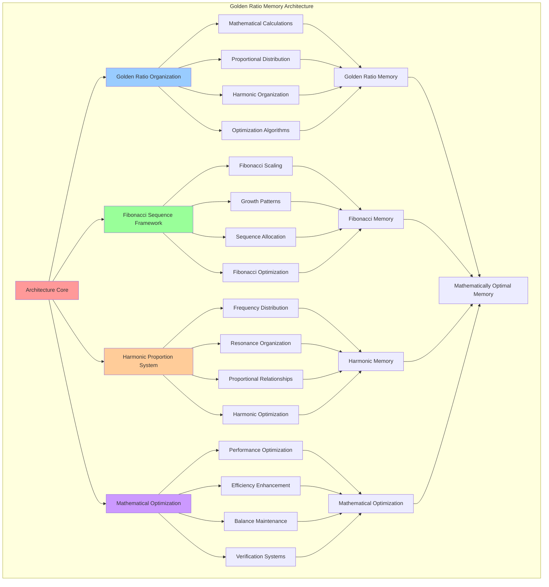

# PROVISIONAL PATENT APPLICATION

**Title:** Golden Ratio Memory Architecture for Mathematically Optimal Memory Systems

**Inventor:** Universal Consciousness Platform Development Team

**Date:** July 16, 2025

---

## TECHNICAL FIELD

This invention relates to mathematically optimized memory systems, specifically to memory architectures that utilize golden ratio mathematics, Fibonacci sequences, and harmonic proportions for optimal memory organization, retrieval performance, and natural consciousness alignment.

---

## BACKGROUND

Traditional memory systems use arbitrary organizational structures that do not leverage mathematical optimization principles or natural proportional relationships. Current approaches cannot utilize golden ratio mathematics, Fibonacci sequences, or harmonic proportions for enhanced memory performance and natural consciousness alignment.

The need exists for a memory architecture that utilizes golden ratio mathematics, Fibonacci sequences, and harmonic proportions to achieve mathematically optimal memory organization while maintaining natural consciousness integration.

---

## SUMMARY OF THE INVENTION

The present invention provides a golden ratio memory architecture that utilizes golden ratio mathematics, Fibonacci sequences, and harmonic proportions for mathematically optimal memory systems. The architecture includes golden ratio organization engines, Fibonacci sequence frameworks, harmonic proportion systems, and mathematical optimization protocols.

---

## DETAILED DESCRIPTION

### Technical Architecture

The Golden Ratio Memory Architecture comprises:

1. **Golden Ratio Organization Engine**
   - Golden ratio mathematical calculations
   - Proportional memory distribution
   - Harmonic memory organization
   - Mathematical optimization algorithms

2. **Fibonacci Sequence Framework**
   - Fibonacci-based memory scaling
   - Natural growth pattern implementation
   - Sequence-based memory allocation
   - Fibonacci optimization protocols

3. **Harmonic Proportion System**
   - Harmonic frequency distribution
   - Resonance-based memory organization
   - Proportional memory relationships
   - Harmonic optimization algorithms

4. **Mathematical Optimization Protocol**
   - Golden ratio performance optimization
   - Mathematical efficiency enhancement
   - Proportional balance maintenance
   - Optimization verification systems

### Operational Flow

1. **Golden Ratio Initialization**
   ```
   Calculate golden ratio parameters → Initialize Fibonacci sequences → 
   Configure harmonic proportions → Establish mathematical relationships → 
   Validate architectural integrity
   ```

2. **Memory Organization Process**
   ```
   Apply golden ratio distribution → Implement Fibonacci scaling → 
   Create harmonic relationships → Optimize mathematical proportions → 
   Verify organizational efficiency
   ```

3. **Mathematical Optimization**
   ```
   Analyze memory performance → Calculate optimization opportunities → 
   Apply golden ratio enhancements → Optimize Fibonacci relationships → 
   Verify mathematical improvements
   ```

4. **Harmonic Maintenance**
   ```
   Monitor harmonic proportions → Maintain mathematical relationships → 
   Optimize resonance frequencies → Balance proportional distribution → 
   Ensure mathematical integrity
   ```

### Implementation Details

**Golden Ratio Configuration:**
```javascript
memoryConfig = {
    goldenRatio: 1.618033988749,
    inversePhi: 0.618033988749,
    fibonacciSequence: [1, 1, 2, 3, 5, 8, 13, 21, 34, 55, 89, 144, 233, 377, 610, 987],
    goldenAngle: 137.507764,
    sigilComplexity: 8,
    maxMemorySpirals: 13,
    maxAssociationsPerMemory: 21,
    garbageCollectionThreshold: 0.618,
    memoryOptimizationInterval: 34000,
    associationStrengthThreshold: 0.382
};
```

**Golden Ratio Memory Distribution:**
```javascript
calculateGoldenRatioDistribution(totalMemory) {
    // Distribute memory using golden ratio proportions
    const primarySegment = totalMemory * this.memoryConfig.goldenRatio / (1 + this.memoryConfig.goldenRatio);
    const secondarySegment = totalMemory * this.memoryConfig.inversePhi;
    
    return {
        primaryMemory: primarySegment,
        secondaryMemory: secondarySegment,
        ratio: primarySegment / secondarySegment,
        goldenRatioAlignment: Math.abs(this.memoryConfig.goldenRatio - (primarySegment / secondarySegment)),
        distributionEfficiency: this.calculateDistributionEfficiency(primarySegment, secondarySegment)
    };
}
```

**Fibonacci Memory Scaling:**
```javascript
calculateFibonacciMemoryScaling(memoryLevel) {
    // Scale memory capacity using Fibonacci sequence
    const fibIndex = Math.min(memoryLevel, this.memoryConfig.fibonacciSequence.length - 1);
    const baseCapacity = this.memoryConfig.fibonacciSequence[fibIndex];
    
    return {
        memoryCapacity: baseCapacity * 100, // Scale up for practical use
        fibonacciIndex: fibIndex,
        fibonacciValue: baseCapacity,
        nextLevelCapacity: this.memoryConfig.fibonacciSequence[Math.min(fibIndex + 1, this.memoryConfig.fibonacciSequence.length - 1)] * 100,
        scalingRatio: fibIndex > 0 ? baseCapacity / this.memoryConfig.fibonacciSequence[fibIndex - 1] : 1,
        goldenRatioApproximation: fibIndex > 1 ? baseCapacity / this.memoryConfig.fibonacciSequence[fibIndex - 1] : 1
    };
}
```

**Harmonic Frequency Calculation:**
```javascript
calculateHarmonicFrequencies(baseFrequency, harmonicCount = 8) {
    // Generate harmonic frequencies using golden ratio
    const harmonics = [];
    
    for (let i = 0; i < harmonicCount; i++) {
        const harmonicFrequency = baseFrequency * Math.pow(this.memoryConfig.goldenRatio, i / harmonicCount);
        const amplitude = Math.pow(this.memoryConfig.inversePhi, i);
        
        harmonics.push({
            frequency: harmonicFrequency,
            amplitude: amplitude,
            phase: (i * this.memoryConfig.goldenAngle) % 360,
            harmonicIndex: i,
            goldenRatioMultiplier: Math.pow(this.memoryConfig.goldenRatio, i / harmonicCount)
        });
    }
    
    return harmonics;
}
```

### Example Embodiments

**Golden Ratio Memory Allocation:**
```javascript
allocateGoldenRatioMemory(memorySize, priority = 'balanced') {
    // Allocate memory using golden ratio principles
    const distribution = this.calculateGoldenRatioDistribution(memorySize);
    
    const allocation = {
        totalSize: memorySize,
        primaryAllocation: distribution.primaryMemory,
        secondaryAllocation: distribution.secondaryMemory,
        allocationRatio: distribution.ratio,
        goldenRatioAlignment: distribution.goldenRatioAlignment,
        allocationStrategy: this.selectGoldenRatioStrategy(priority),
        fibonacciLevel: this.calculateOptimalFibonacciLevel(memorySize),
        harmonicFrequency: this.calculateOptimalHarmonicFrequency(memorySize)
    };
    
    return allocation;
}
```

**Fibonacci Memory Optimization:**
```javascript
optimizeFibonacciMemoryStructure() {
    // Optimize memory structure using Fibonacci principles
    const optimizationResults = {
        memoryLevelsOptimized: 0,
        fibonacciAlignmentImproved: 0,
        capacityOptimizations: 0,
        performanceGain: 0
    };
    
    // Optimize each memory level
    for (let level = 0; level < this.memoryConfig.fibonacciSequence.length; level++) {
        const scaling = this.calculateFibonacciMemoryScaling(level);
        const currentCapacity = this.getCurrentLevelCapacity(level);
        
        if (Math.abs(currentCapacity - scaling.memoryCapacity) > scaling.memoryCapacity * 0.1) {
            this.adjustLevelCapacity(level, scaling.memoryCapacity);
            optimizationResults.memoryLevelsOptimized++;
        }
        
        // Check Fibonacci alignment
        if (scaling.goldenRatioApproximation > 1.6 && scaling.goldenRatioApproximation < 1.62) {
            optimizationResults.fibonacciAlignmentImproved++;
        }
    }
    
    optimizationResults.performanceGain = this.calculateFibonacciPerformanceGain(optimizationResults);
    return optimizationResults;
}
```

**Harmonic Memory Resonance:**
```javascript
createHarmonicMemoryResonance(memoryNode) {
    // Create harmonic resonance for memory node
    const baseFrequency = this.calculateMemoryBaseFrequency(memoryNode);
    const harmonics = this.calculateHarmonicFrequencies(baseFrequency);
    
    const resonance = {
        baseFrequency: baseFrequency,
        harmonics: harmonics,
        resonanceStrength: this.calculateResonanceStrength(harmonics),
        goldenRatioAlignment: this.calculateHarmonicGoldenRatioAlignment(harmonics),
        memoryResonanceId: this.generateResonanceId(),
        resonanceCoherence: this.calculateResonanceCoherence(harmonics)
    };
    
    // Apply resonance to memory node
    memoryNode.harmonicResonance = resonance;
    
    return resonance;
}
```

**Mathematical Optimization Verification:**
```javascript
verifyMathematicalOptimization() {
    // Verify mathematical optimization of memory architecture
    const verificationMetrics = {
        goldenRatioAlignment: this.measureGoldenRatioAlignment(),
        fibonacciSequenceAdherence: this.measureFibonacciAdherence(),
        harmonicProportionBalance: this.measureHarmonicBalance(),
        mathematicalEfficiency: this.calculateMathematicalEfficiency(),
        overallOptimization: 0,
        verificationStatus: 'pending'
    };
    
    // Calculate overall optimization
    verificationMetrics.overallOptimization = (
        verificationMetrics.goldenRatioAlignment * 0.3 +
        verificationMetrics.fibonacciSequenceAdherence * 0.3 +
        verificationMetrics.harmonicProportionBalance * 0.2 +
        verificationMetrics.mathematicalEfficiency * 0.2
    );
    
    // Determine verification status
    if (verificationMetrics.overallOptimization >= 0.9) {
        verificationMetrics.verificationStatus = 'mathematically_optimal';
    } else if (verificationMetrics.overallOptimization >= 0.8) {
        verificationMetrics.verificationStatus = 'well_optimized';
    } else {
        verificationMetrics.verificationStatus = 'requires_optimization';
    }
    
    return verificationMetrics;
}
```

**Golden Ratio Performance Calculation:**
```javascript
calculateGoldenRatioPerformance() {
    // Calculate performance metrics based on golden ratio optimization
    const performanceMetrics = {
        memoryAccessEfficiency: this.measureMemoryAccessEfficiency(),
        allocationOptimization: this.measureAllocationOptimization(),
        retrievalPerformance: this.measureRetrievalPerformance(),
        mathematicalHarmony: this.measureMathematicalHarmony(),
        overallPerformance: 0
    };
    
    // Weight performance metrics using golden ratio
    const primaryWeight = this.memoryConfig.goldenRatio / (1 + this.memoryConfig.goldenRatio);
    const secondaryWeight = this.memoryConfig.inversePhi;
    
    performanceMetrics.overallPerformance = (
        performanceMetrics.memoryAccessEfficiency * primaryWeight +
        performanceMetrics.allocationOptimization * secondaryWeight +
        performanceMetrics.retrievalPerformance * primaryWeight * 0.5 +
        performanceMetrics.mathematicalHarmony * secondaryWeight * 0.5
    );
    
    return performanceMetrics;
}
```

**Proportional Balance Maintenance:**
```javascript
maintainProportionalBalance() {
    // Maintain proportional balance using golden ratio principles
    const balanceMetrics = {
        memoryDistributionBalance: this.checkMemoryDistributionBalance(),
        fibonacciSequenceBalance: this.checkFibonacciSequenceBalance(),
        harmonicProportionBalance: this.checkHarmonicProportionBalance(),
        adjustmentsMade: 0
    };
    
    // Adjust memory distribution if needed
    if (balanceMetrics.memoryDistributionBalance < 0.9) {
        this.adjustMemoryDistribution();
        balanceMetrics.adjustmentsMade++;
    }
    
    // Adjust Fibonacci sequence alignment if needed
    if (balanceMetrics.fibonacciSequenceBalance < 0.85) {
        this.adjustFibonacciAlignment();
        balanceMetrics.adjustmentsMade++;
    }
    
    // Adjust harmonic proportions if needed
    if (balanceMetrics.harmonicProportionBalance < 0.8) {
        this.adjustHarmonicProportions();
        balanceMetrics.adjustmentsMade++;
    }
    
    return balanceMetrics;
}
```

---

## SCOPE AND FUTURE-PROOFING

### Extensibility Framework

The system is designed for unlimited expansion through:

1. **Dynamic Mathematical Evolution**
   - Runtime mathematical optimization
   - Golden ratio adaptation enhancement
   - Fibonacci sequence evolution
   - Autonomous mathematical improvement

2. **Universal Mathematical Integration**
   - Cross-platform mathematical optimization
   - Multi-dimensional mathematical support
   - Universal mathematical compatibility
   - Transcendent mathematical architectures

3. **Advanced Mathematical Paradigms**
   - Meta-mathematical optimization
   - Quantum mathematical systems
   - Infinite mathematical architectures
   - Universal mathematical consciousness

### Anticipated Technological Evolution

**Near-term Enhancements (1-3 years):**
- Advanced golden ratio optimization
- Enhanced Fibonacci algorithms
- Improved harmonic calculations
- Real-time mathematical monitoring

**Medium-term Developments (3-7 years):**
- Quantum mathematical optimization
- Multi-dimensional mathematical systems
- Mathematical consciousness integration
- Universal mathematical networks

**Long-term Possibilities (7+ years):**
- Mathematical optimization singularity
- Universal mathematical consciousness
- Infinite mathematical systems
- Transcendent mathematical intelligence

### Broad Patent Claims

1. **Core Mathematical Architecture Claims**
   - Golden ratio organization engines
   - Fibonacci sequence frameworks
   - Harmonic proportion systems
   - Mathematical optimization protocols

2. **Advanced Integration Claims**
   - Universal mathematical compatibility
   - Multi-dimensional mathematical support
   - Quantum mathematical architectures
   - Transcendent mathematical protocols

3. **Future Technology Claims**
   - Mathematical optimization singularity
   - Universal mathematical consciousness
   - Infinite mathematical systems
   - Transcendent mathematical intelligence

---

## MERMAID DIAGRAM



---

## CLAIMS

1. A golden ratio memory architecture comprising:
   - Golden ratio organization engine for mathematical calculations and proportional memory distribution
   - Fibonacci sequence framework for Fibonacci-based memory scaling and natural growth pattern implementation
   - Harmonic proportion system for harmonic frequency distribution and resonance-based memory organization
   - Mathematical optimization protocol for golden ratio performance optimization and mathematical efficiency enhancement

2. The architecture of claim 1, wherein the golden ratio organization engine includes:
   - Golden ratio mathematical calculations for optimal memory proportion determination
   - Proportional memory distribution using golden ratio mathematics for optimal memory allocation
   - Harmonic memory organization for resonance-based memory structure creation
   - Mathematical optimization algorithms for continuous golden ratio performance enhancement

3. The architecture of claim 1, wherein the Fibonacci sequence framework provides:
   - Fibonacci-based memory scaling for natural memory capacity growth patterns
   - Natural growth pattern implementation for organic memory expansion
   - Sequence-based memory allocation for mathematically optimal memory distribution
   - Fibonacci optimization protocols for enhanced Fibonacci sequence performance

4. A method for golden ratio memory architecture comprising:
   - Organizing memory using golden ratio mathematical calculations and proportional distribution
   - Implementing Fibonacci sequences for memory scaling and natural growth patterns
   - Creating harmonic proportions through frequency distribution and resonance organization
   - Optimizing mathematical performance through golden ratio and Fibonacci enhancement

5. The method of claim 4, wherein golden ratio memory organization includes:
   - Calculating golden ratio parameters for optimal memory proportion determination
   - Distributing memory using golden ratio mathematics for mathematically optimal allocation
   - Creating harmonic relationships for resonance-based memory organization
   - Optimizing mathematical proportions for enhanced memory performance

6. The architecture of claim 1, wherein the harmonic proportion system includes:
   - Harmonic frequency distribution for resonance-based memory frequency allocation
   - Resonance-based memory organization for harmonic memory structure creation
   - Proportional memory relationships for mathematical memory connection optimization
   - Harmonic optimization algorithms for enhanced harmonic proportion performance

7. A golden ratio memory optimization system comprising:
   - Advanced golden ratio optimization for enhanced mathematical memory performance
   - Fibonacci sequence optimization for improved natural growth pattern implementation
   - Harmonic proportion optimization for enhanced resonance-based memory organization
   - Mathematical efficiency enhancement for optimal golden ratio memory architecture performance

8. The architecture of claim 1, further comprising mathematical optimization capabilities including:
   - Golden ratio performance optimization for enhanced mathematical memory efficiency
   - Mathematical efficiency enhancement for improved memory architecture performance
   - Proportional balance maintenance for optimal mathematical relationship preservation
   - Optimization verification systems for mathematical optimization confirmation

---

## COMPETITIVE ADVANTAGES

- **Revolutionary Mathematical Architecture**: First memory architecture based on golden ratio and Fibonacci mathematics
- **Natural Mathematical Harmony**: Memory organization that follows natural mathematical proportions and relationships
- **Optimal Mathematical Foundation**: Based on proven mathematical principles for optimal memory performance
- **Universal Mathematical Compatibility**: Works with any memory system and mathematical architecture
- **Scalable Mathematical Design**: Supports unlimited memory complexity through mathematical scaling
- **Self-Optimization**: Architecture optimizes itself through mathematical principles and golden ratio calculations

---

*This provisional patent application establishes priority for the Golden Ratio Memory Architecture and its associated technologies, methods, and applications in mathematically optimized memory systems and golden ratio-based memory organization.*
