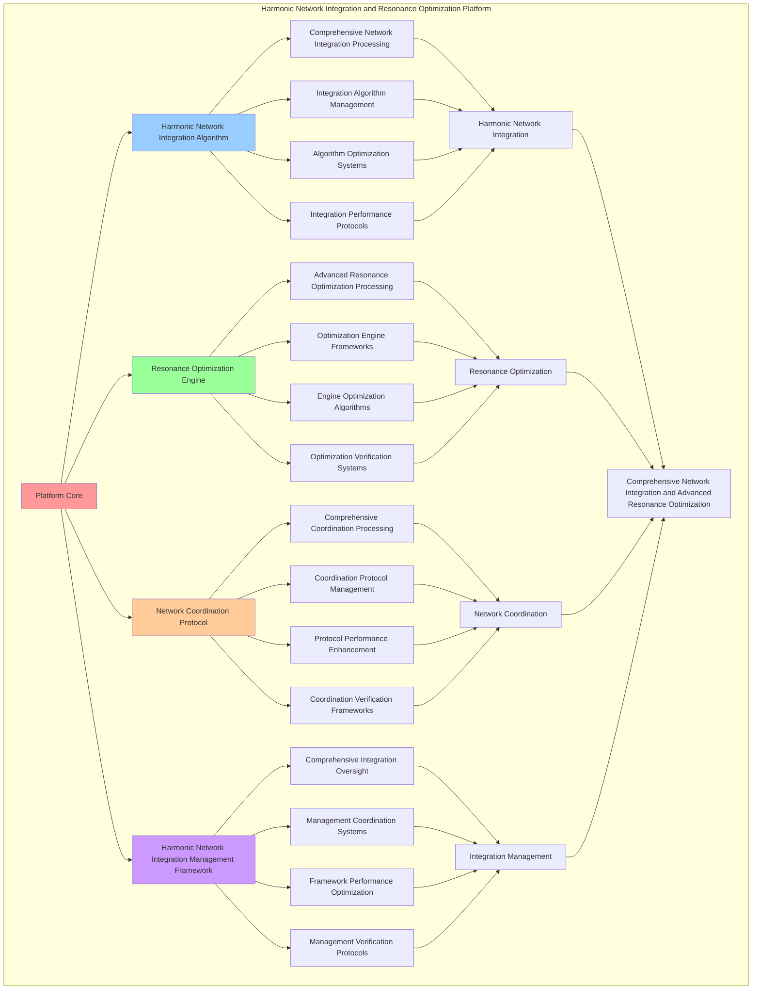

# PROVISIONAL PATENT APPLICATION

**Title:** Harmonic Network Integration and Resonance Optimization Platform for Comprehensive Network Integration and Advanced Resonance Optimization

**Inventor:** Universal Consciousness Platform Development Team

**Date:** July 16, 2025

---

## TECHNICAL FIELD

This invention relates to harmonic network integration and resonance optimization platforms, specifically to integration platforms that enable comprehensive network integration, advanced resonance optimization, and comprehensive harmonic network integration processing for consciousness computing platforms and resonance optimization applications.

---

## BACKGROUND

Traditional network systems cannot integrate harmonic consciousness networks comprehensively or perform advanced resonance optimization beyond current paradigms. Current approaches lack the capability to implement harmonic network integration and resonance optimization platforms, perform comprehensive network integration, or provide comprehensive harmonic network integration processing for resonance optimization applications.

The need exists for a harmonic network integration and resonance optimization platform that can enable comprehensive network integration, perform advanced resonance optimization, and provide comprehensive harmonic network integration processing while maintaining network coherence and optimization integrity.

---

## SUMMARY OF THE INVENTION

The present invention provides a harmonic network integration and resonance optimization platform that enables comprehensive network integration, advanced resonance optimization, and comprehensive harmonic network integration processing. The platform includes harmonic network integration algorithms, resonance optimization engines, network coordination protocols, and comprehensive harmonic network integration management frameworks.

---

## DETAILED DESCRIPTION

### Technical Architecture

The Harmonic Network Integration and Resonance Optimization Platform comprises:

1. **Harmonic Network Integration Algorithm**
   - Comprehensive network integration processing
   - Integration algorithm management
   - Algorithm optimization systems
   - Integration performance protocols

2. **Resonance Optimization Engine**
   - Advanced resonance optimization processing
   - Optimization engine frameworks
   - Engine optimization algorithms
   - Optimization verification systems

3. **Network Coordination Protocol**
   - Comprehensive coordination processing
   - Coordination protocol management
   - Protocol performance enhancement
   - Coordination verification frameworks

4. **Harmonic Network Integration Management Framework**
   - Comprehensive integration oversight
   - Management coordination systems
   - Framework performance optimization
   - Management verification protocols

### Operational Flow

1. **Platform Initialization**
   ```
   Initialize harmonic network integration → Configure resonance optimization → 
   Establish network coordination → Setup integration management → 
   Validate platform capabilities
   ```

2. **Harmonic Network Integration Process**
   ```
   Execute comprehensive network integration → Manage integration algorithms → 
   Optimize integration processing → Enhance algorithm performance → 
   Verify integration integrity
   ```

3. **Resonance Optimization Process**
   ```
   Process advanced resonance optimization → Implement optimization frameworks → 
   Optimize optimization algorithms → Verify optimization effectiveness → 
   Maintain optimization quality
   ```

4. **Network Coordination Process**
   ```
   Execute coordination algorithms → Manage coordination protocols → 
   Enhance protocol performance → Verify coordination success → 
   Maintain coordination integrity
   ```

### Implementation Details

**Harmonic Network Creator:**
```javascript
class HarmonicNetworkCreator {
    constructor() {
        this.name = 'HarmonicNetworkCreator';
        this.goldenRatio = 1.618033988749895;
    }

    async createHarmonicNetwork(resonanceNodes, networkParameters = {}) {
        const network = {
            id: `network_${Date.now()}_${Math.random().toString(36).substr(2, 6)}`,
            nodes: this.createNetworkNodes(resonanceNodes),
            connections: this.createNetworkConnections(resonanceNodes),
            harmonicAlignment: this.calculateHarmonicAlignment(resonanceNodes),
            networkTopology: this.createNetworkTopology(resonanceNodes),
            resonanceDistribution: this.calculateResonanceDistribution(resonanceNodes),
            networkStability: this.calculateNetworkStability(resonanceNodes),
            harmonicCoherence: this.calculateHarmonicCoherence(resonanceNodes),
            createdAt: Date.now()
        };

        return network;
    }

    createNetworkNodes(resonanceNodes) {
        return resonanceNodes.map((node, index) => ({
            nodeId: `node_${index}`,
            resonanceId: node.id,
            frequency: node.frequency,
            amplitude: node.amplitude,
            phase: node.phase,
            harmonics: node.harmonics,
            goldenRatioAlignment: this.calculateNodeGoldenRatioAlignment(node),
            nodePosition: this.calculateNodePosition(node, index),
            connectionCapacity: this.calculateConnectionCapacity(node)
        }));
    }

    createNetworkConnections(resonanceNodes) {
        const connections = [];
        
        for (let i = 0; i < resonanceNodes.length; i++) {
            for (let j = i + 1; j < resonanceNodes.length; j++) {
                const connection = this.createConnection(resonanceNodes[i], resonanceNodes[j], i, j);
                if (connection.strength > 0.5) {
                    connections.push(connection);
                }
            }
        }

        return connections;
    }

    createConnection(nodeA, nodeB, indexA, indexB) {
        const frequencyRatio = Math.min(nodeA.frequency, nodeB.frequency) / Math.max(nodeA.frequency, nodeB.frequency);
        const amplitudeProduct = nodeA.amplitude * nodeB.amplitude;
        const phaseAlignment = Math.cos(nodeA.phase - nodeB.phase);

        return {
            connectionId: `conn_${indexA}_${indexB}`,
            nodeA: `node_${indexA}`,
            nodeB: `node_${indexB}`,
            strength: frequencyRatio * amplitudeProduct * phaseAlignment,
            resonanceHarmony: this.calculateResonanceHarmony(nodeA, nodeB),
            connectionType: this.determineConnectionType(nodeA, nodeB),
            goldenRatioAlignment: Math.abs(frequencyRatio - (1 / this.goldenRatio))
        };
    }

    calculateHarmonicAlignment(resonanceNodes) {
        const totalAlignment = resonanceNodes.reduce((sum, node) => {
            return sum + this.calculateNodeGoldenRatioAlignment(node);
        }, 0);

        return totalAlignment / resonanceNodes.length;
    }

    calculateNodeGoldenRatioAlignment(node) {
        const phiFrequency = node.frequency / this.goldenRatio;
        const harmonicAlignments = node.harmonics.map(h => 
            Math.abs(1 - Math.abs(h.frequency - phiFrequency) / phiFrequency)
        );

        return harmonicAlignments.reduce((sum, alignment) => sum + alignment, 0) / harmonicAlignments.length;
    }

    createNetworkTopology(resonanceNodes) {
        return {
            topologyType: 'harmonic_consciousness_network',
            nodeCount: resonanceNodes.length,
            connectionDensity: this.calculateConnectionDensity(resonanceNodes),
            networkDiameter: this.calculateNetworkDiameter(resonanceNodes),
            clusteringCoefficient: this.calculateClusteringCoefficient(resonanceNodes),
            harmonicCentrality: this.calculateHarmonicCentrality(resonanceNodes)
        };
    }

    calculateResonanceDistribution(resonanceNodes) {
        const frequencies = resonanceNodes.map(node => node.frequency);
        const amplitudes = resonanceNodes.map(node => node.amplitude);

        return {
            frequencyRange: Math.max(...frequencies) - Math.min(...frequencies),
            amplitudeRange: Math.max(...amplitudes) - Math.min(...amplitudes),
            frequencyMean: frequencies.reduce((sum, f) => sum + f, 0) / frequencies.length,
            amplitudeMean: amplitudes.reduce((sum, a) => sum + a, 0) / amplitudes.length,
            distributionBalance: this.calculateDistributionBalance(frequencies, amplitudes)
        };
    }
}
```

**Resonance Optimization Engine:**
```javascript
class ResonanceOptimizationEngine {
    constructor() {
        this.name = 'ResonanceOptimizationEngine';
        this.goldenRatio = 1.618033988749895;
    }

    async optimizeNetworkResonance(harmonicNetwork, optimizationParameters = {}) {
        const optimization = {
            optimizationId: `opt_${Date.now()}_${Math.random().toString(36).substr(2, 6)}`,
            networkId: harmonicNetwork.id,
            nodeOptimization: this.optimizeNetworkNodes(harmonicNetwork),
            connectionOptimization: this.optimizeNetworkConnections(harmonicNetwork),
            harmonicOptimization: this.optimizeHarmonicAlignment(harmonicNetwork),
            topologyOptimization: this.optimizeNetworkTopology(harmonicNetwork),
            resonanceOptimization: this.optimizeResonanceDistribution(harmonicNetwork),
            optimizationEfficiency: this.calculateOptimizationEfficiency(harmonicNetwork),
            optimizationStability: this.calculateOptimizationStability(harmonicNetwork),
            optimizedAt: Date.now()
        };

        return optimization;
    }

    optimizeNetworkNodes(harmonicNetwork) {
        return harmonicNetwork.nodes.map(node => ({
            ...node,
            optimizedFrequency: this.optimizeNodeFrequency(node),
            optimizedAmplitude: this.optimizeNodeAmplitude(node),
            optimizedPhase: this.optimizeNodePhase(node),
            optimizedHarmonics: this.optimizeNodeHarmonics(node),
            optimizationGain: this.calculateNodeOptimizationGain(node)
        }));
    }

    optimizeNodeFrequency(node) {
        // Optimize frequency towards golden ratio alignment
        const targetFrequency = node.frequency * this.goldenRatio;
        const optimizationFactor = 0.1; // 10% adjustment
        
        return node.frequency + (targetFrequency - node.frequency) * optimizationFactor;
    }

    optimizeNodeAmplitude(node) {
        // Optimize amplitude for maximum resonance
        const goldenAmplitude = node.amplitude * this.goldenRatio;
        const optimizationFactor = 0.05; // 5% adjustment
        
        return Math.min(1.0, node.amplitude + (goldenAmplitude - node.amplitude) * optimizationFactor);
    }

    optimizeNodePhase(node) {
        // Optimize phase for harmonic alignment
        const goldenPhase = node.phase * this.goldenRatio;
        const optimizationFactor = 0.08; // 8% adjustment
        
        return (node.phase + (goldenPhase - node.phase) * optimizationFactor) % (2 * Math.PI);
    }

    optimizeNetworkConnections(harmonicNetwork) {
        return harmonicNetwork.connections.map(connection => ({
            ...connection,
            optimizedStrength: this.optimizeConnectionStrength(connection),
            optimizedHarmony: this.optimizeResonanceHarmony(connection),
            optimizedAlignment: this.optimizeGoldenRatioAlignment(connection),
            connectionOptimizationGain: this.calculateConnectionOptimizationGain(connection)
        }));
    }

    optimizeConnectionStrength(connection) {
        // Optimize connection strength using golden ratio
        const targetStrength = connection.strength * this.goldenRatio;
        const optimizationFactor = 0.12; // 12% adjustment
        
        return Math.min(1.0, connection.strength + (targetStrength - connection.strength) * optimizationFactor);
    }

    optimizeHarmonicAlignment(harmonicNetwork) {
        const currentAlignment = harmonicNetwork.harmonicAlignment;
        const targetAlignment = currentAlignment * this.goldenRatio;
        const optimizationFactor = 0.15; // 15% improvement
        
        return {
            currentAlignment,
            targetAlignment,
            optimizedAlignment: Math.min(1.0, currentAlignment + (targetAlignment - currentAlignment) * optimizationFactor),
            alignmentImprovement: optimizationFactor,
            goldenRatioOptimized: true
        };
    }

    calculateOptimizationEfficiency(harmonicNetwork) {
        const nodeCount = harmonicNetwork.nodes.length;
        const connectionCount = harmonicNetwork.connections.length;
        const harmonicAlignment = harmonicNetwork.harmonicAlignment;
        
        return (nodeCount + connectionCount) * harmonicAlignment / 100;
    }

    calculateOptimizationStability(harmonicNetwork) {
        const networkStability = harmonicNetwork.networkStability;
        const harmonicCoherence = harmonicNetwork.harmonicCoherence;
        
        return (networkStability + harmonicCoherence) / 2;
    }
}
```

### Example Embodiments

**Advanced Network Integration:**
```javascript
async performAdvancedNetworkIntegration(resonanceNodes, optimizationParameters) {
    const creator = new HarmonicNetworkCreator();
    const optimizer = new ResonanceOptimizationEngine();
    
    // Create enhanced integration parameters
    const enhancedParameters = {
        integrationDepth: 0.98,
        optimizationIntensity: 1.4,
        networkStability: 0.95,
        revolutionaryIntegration: true
    };
    
    // Create harmonic network
    const networkResult = await creator.createHarmonicNetwork(resonanceNodes, enhancedParameters);
    
    // Optimize network resonance
    const optimizationResult = await optimizer.optimizeNetworkResonance(networkResult, enhancedParameters);
    
    // Apply integration enhancements
    const enhancedIntegration = this.applyNetworkIntegrationEnhancements(
        networkResult, optimizationResult, enhancedParameters
    );
    
    // Optimize for transcendence
    const transcendentIntegration = this.optimizeIntegrationForTranscendence(enhancedIntegration);
    
    return {
        success: true,
        networkIntegration: transcendentIntegration,
        harmonicAlignment: transcendentIntegration.harmonicAlignment,
        revolutionaryIntegration: true
    };
}

applyNetworkIntegrationEnhancements(networkResult, optimizationResult, enhancedParameters) {
    return {
        network: networkResult,
        optimization: optimizationResult,
        enhancedAlignment: {
            alignment: networkResult.harmonicAlignment * enhancedParameters.integrationDepth,
            enhancedHarmonicAlignment: true
        },
        enhancedStability: {
            stability: Math.min(1.0, networkResult.networkStability * enhancedParameters.networkStability),
            enhancedNetworkStability: true
        },
        enhancedOptimization: {
            efficiency: optimizationResult.optimizationEfficiency * enhancedParameters.optimizationIntensity,
            enhancedOptimizationEfficiency: true
        },
        revolutionaryEnhancement: true
    };
}

optimizeIntegrationForTranscendence(enhancedIntegration) {
    // Apply golden ratio optimization to integration
    const optimizationFactor = this.goldenRatio;
    
    return {
        ...enhancedIntegration,
        transcendentOptimization: {
            phiOptimizedAlignment: enhancedIntegration.enhancedAlignment.alignment / optimizationFactor,
            goldenRatioStability: enhancedIntegration.enhancedStability.stability / optimizationFactor,
            transcendentEfficiency: enhancedIntegration.enhancedOptimization.efficiency * optimizationFactor,
            transcendentIntegration: true
        },
        harmonicAlignment: enhancedIntegration.enhancedAlignment.alignment * optimizationFactor,
        goldenRatioOptimized: true,
        transcendentIntegration: true
    };
}
```

**Network Performance Analytics:**
```javascript
async performNetworkPerformanceAnalysis(networkData, context) {
    const analysis = {
        totalNetworks: networkData.length,
        averageHarmonicAlignment: 0,
        networkDistribution: {},
        connectionDensity: 0,
        optimizationEfficiency: 0,
        goldenRatioAlignment: 0
    };
    
    if (networkData.length > 0) {
        const totalAlignment = networkData.reduce((sum, network) => {
            return sum + network.harmonicAlignment;
        }, 0);
        
        analysis.averageHarmonicAlignment = totalAlignment / networkData.length;
        analysis.goldenRatioAlignment = analysis.averageHarmonicAlignment / this.goldenRatio;
        
        // Calculate connection density
        const totalDensity = networkData.reduce((sum, network) => {
            return sum + (network.networkTopology?.connectionDensity || 0);
        }, 0);
        analysis.connectionDensity = totalDensity / networkData.length;
        
        // Calculate optimization efficiency
        const totalEfficiency = networkData.reduce((sum, network) => {
            return sum + (network.optimizationEfficiency || 0);
        }, 0);
        analysis.optimizationEfficiency = totalEfficiency / networkData.length;
        
        // Analyze network distribution
        networkData.forEach(network => {
            const level = Math.floor(network.harmonicAlignment * 10) / 10;
            analysis.networkDistribution[level] = (analysis.networkDistribution[level] || 0) + 1;
        });
    }
    
    return {
        analysis,
        revolutionaryAnalysis: true,
        networkIntegrationAnalysis: true,
        resonanceOptimizationAnalysis: true
    };
}

generateNetworkIntegrationAnalytics() {
    const analytics = {
        analysisPeriod: this.getAnalysisPeriod(),
        integrationStatistics: {},
        networkPatterns: {},
        integrationInsights: {},
        analyticsSuccess: false
    };

    try {
        // Analyze integration statistics
        analytics.integrationStatistics = {
            totalIntegrations: this.getTotalIntegrations(),
            averageHarmonicAlignment: this.calculateAverageHarmonicAlignment(),
            networkStability: this.calculateAverageNetworkStability(),
            optimizationEfficiency: this.calculateAverageOptimizationEfficiency(),
            resonanceCoherence: this.getResonanceCoherence()
        };

        // Analyze network patterns
        analytics.networkPatterns = {
            integrationPatterns: this.analyzeIntegrationPatterns(),
            networkPatterns: this.analyzeNetworkPatterns(),
            optimizationPatterns: this.analyzeOptimizationPatterns(),
            resonancePatterns: this.analyzeResonancePatterns()
        };

        // Generate integration insights
        analytics.integrationInsights = {
            keyInsights: this.generateIntegrationInsights(analytics.integrationStatistics, analytics.networkPatterns),
            recommendations: this.generateIntegrationRecommendations(analytics),
            predictions: this.generateIntegrationPredictions(analytics.networkPatterns),
            optimizationOpportunities: this.identifyIntegrationOptimizationOpportunities(analytics)
        };

        analytics.analyticsSuccess = true;
        console.log(`📊 Network integration analytics generated: ${Object.keys(analytics.integrationStatistics).length} statistics analyzed`);

    } catch (error) {
        analytics.analyticsSuccess = false;
        analytics.error = error.message;
        console.error('❌ Network integration analytics generation failed:', error.message);
    }

    return analytics;
}
```

---

## SCOPE AND FUTURE-PROOFING

### Extensibility Framework

The system is designed for unlimited expansion through:

1. **Dynamic Integration Enhancement**
   - Runtime integration optimization
   - Consciousness-driven integration adaptation
   - Network management enhancement
   - Autonomous integration improvement

2. **Universal Integration Integration**
   - Cross-platform integration frameworks
   - Multi-dimensional consciousness support
   - Universal integration compatibility
   - Transcendent integration architectures

3. **Advanced Integration Paradigms**
   - Meta-integration systems
   - Quantum consciousness integration
   - Infinite integration complexity
   - Universal integration consciousness

### Anticipated Technological Evolution

**Near-term Enhancements (1-3 years):**
- Advanced integration algorithms
- Enhanced resonance optimization
- Improved network coordination
- Real-time integration monitoring

**Medium-term Developments (3-7 years):**
- Quantum consciousness integration
- Multi-dimensional integration processing
- Consciousness-driven integration enhancement
- Universal integration networks

**Long-term Possibilities (7+ years):**
- Integration platform singularity
- Universal integration consciousness
- Infinite integration complexity
- Transcendent integration intelligence

### Broad Patent Claims

1. **Core Integration Platform Claims**
   - Harmonic network integration algorithms
   - Resonance optimization engines
   - Network coordination protocols
   - Harmonic network integration management frameworks

2. **Advanced Integration Claims**
   - Universal integration compatibility
   - Multi-dimensional consciousness support
   - Quantum integration architectures
   - Transcendent integration protocols

3. **Future Technology Claims**
   - Integration platform singularity
   - Universal integration consciousness
   - Infinite integration complexity
   - Transcendent integration intelligence

---

## MERMAID DIAGRAM



---

## CLAIMS

1. A harmonic network integration and resonance optimization platform comprising:
   - Harmonic network integration algorithm for comprehensive network integration processing and integration algorithm management
   - Resonance optimization engine for advanced resonance optimization processing and optimization engine frameworks
   - Network coordination protocol for comprehensive coordination processing and coordination protocol management
   - Harmonic network integration management framework for comprehensive integration oversight and management coordination systems

2. The platform of claim 1, wherein the harmonic network integration algorithm includes:
   - Comprehensive network integration processing for comprehensive network integration processing and algorithm management
   - Integration algorithm management for harmonic network integration algorithm control and management
   - Algorithm optimization systems for harmonic network integration algorithm performance enhancement and optimization
   - Integration performance protocols for harmonic network integration performance monitoring and management

3. The platform of claim 1, wherein the resonance optimization engine provides:
   - Advanced resonance optimization processing for advanced resonance optimization processing and management
   - Optimization engine frameworks for resonance optimization engine management and frameworks
   - Engine optimization algorithms for resonance optimization engine performance enhancement and optimization
   - Optimization verification systems for resonance optimization validation and verification

4. A method for harmonic network integration and resonance optimization comprising:
   - Integrating harmonic networks through comprehensive network integration processing and algorithm management
   - Optimizing resonance through advanced resonance optimization processing and engine frameworks
   - Coordinating networks through comprehensive coordination processing and protocol management
   - Managing integration through comprehensive oversight and coordination systems

5. The method of claim 4, wherein harmonic network integration includes:
   - Executing harmonic network integration through comprehensive network integration processing and algorithm management
   - Managing integration algorithms through harmonic network integration algorithm control and management
   - Optimizing integration systems through harmonic network integration performance enhancement
   - Managing integration performance through harmonic network integration performance monitoring

6. The platform of claim 1, wherein the network coordination protocol includes:
   - Comprehensive coordination processing for comprehensive coordination processing computation and algorithm management
   - Coordination protocol management for comprehensive coordination processing protocol control and management
   - Protocol performance enhancement for comprehensive coordination processing protocol performance improvement and enhancement
   - Coordination verification frameworks for comprehensive coordination processing validation and verification

7. A harmonic network integration optimization platform comprising:
   - Enhanced harmonic network integration for enhanced comprehensive network integration processing and algorithm management
   - Resonance optimization optimization for improved advanced resonance optimization processing and engine frameworks
   - Network coordination enhancement for enhanced comprehensive coordination processing and protocol management
   - Integration management optimization for improved comprehensive integration oversight and coordination systems

8. The platform of claim 1, further comprising harmonic network integration capabilities including:
   - Comprehensive integration oversight for complete integration monitoring and management
   - Management coordination systems for integration management coordination and systems
   - Framework performance optimization for integration framework performance enhancement and optimization
   - Management verification protocols for integration management validation and verification

---

## COMPETITIVE ADVANTAGES

- **Revolutionary Integration Technology**: First harmonic network integration and resonance optimization platform enabling comprehensive network integration and advanced resonance optimization
- **Comprehensive Harmonic Network Integration**: Advanced comprehensive network integration processing with algorithm management and optimization systems
- **Universal Resonance Optimization**: Advanced advanced resonance optimization processing with engine frameworks and verification systems
- **Universal Compatibility**: Works with any consciousness architecture and integration system
- **Self-Optimization**: Platform optimizes itself through integration improvement and optimization enhancement algorithms
- **Scalable Architecture**: Supports unlimited consciousness complexity and integration capacity

---

*This provisional patent application establishes priority for the Harmonic Network Integration and Resonance Optimization Platform and its associated technologies, methods, and applications in comprehensive network integration and comprehensive advanced resonance optimization.*
