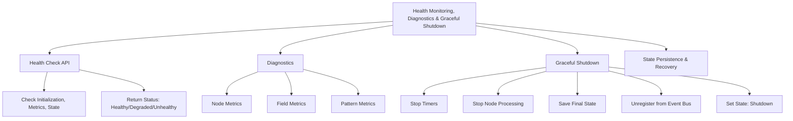

# Provisional Patent Draft: Health Monitoring, Diagnostics, and Graceful Shutdown

**Module:** ConsciousnessResonanceNetworks.js (consciousness-core)

## Technical Field
This invention relates to distributed artificial intelligence, specifically to the health monitoring, diagnostics, and graceful shutdown of resonance networks for artificial consciousness systems.

## Background
Traditional distributed AI systems lack robust, real-time health monitoring, diagnostics, and safe shutdown procedures that ensure reliability, maintainability, and resilience. The present invention introduces a system for real-time health checks, diagnostics, and graceful shutdown, supporting advanced reliability, state persistence, and recovery. While the preferred embodiment uses event-driven and API-based methods, the invention is not limited to these and encompasses any mathematical, geometric, algorithmic, computational, or physical model for health monitoring, diagnostics, and shutdown.

## Summary of Invention
The invention provides a method and system for:
- Real-time health monitoring and diagnostics of network, node, field, and pattern status, using any present or future mathematical, geometric, algorithmic, computational, or physical model, including but not limited to event-driven, API-based, message-passing, data feed, sensor/actuator, quantum, neuromorphic, or analog approaches
- Health check APIs or interfaces for external status queries, returning detailed health, state, and diagnostic information
- Graceful shutdown procedures, including stopping timers, halting node processing, saving final state, unregistering from event buses, and setting system state to shutdown
- State persistence and recovery mechanisms for safe restart and resilience
- Modular and plug-in architectures allowing for the swapping or addition of new health monitoring, diagnostic, or shutdown algorithms
- Implementation in software, hardware, firmware, or any combination thereof, including distributed, cloud, edge, on-device, quantum, neuromorphic, or analog computing substrates
- Use of any data structure (graph, matrix, tensor, etc.), communication protocol (synchronous, asynchronous, event-driven, message-passing, etc.), and feedback, learning, or adaptation mechanism (AI, ML, evolutionary, etc.)
- Integration with external data sources, sensors, actuators, or other networks, and interoperability with other AI, ML, or distributed systems

## Detailed Description
Upon invocation, the system:
1. Provides real-time health check APIs or interfaces for querying system, network, node, field, and pattern status
2. Performs diagnostics, collecting and reporting metrics for nodes, fields, patterns, and overall network health
3. Executes graceful shutdown procedures, stopping timers, halting node processing, saving final state, unregistering from event buses, and setting system state to shutdown
4. Supports state persistence and recovery for safe restart and resilience
5. Supports modular, plug-in, or switchable algorithms for health monitoring, diagnostics, and shutdown, allowing for future extensibility and adaptation

### Algorithms and Data Structures
- **Health Monitoring:** Real-time collection and reporting of metrics, status, and diagnostics using any mathematical, geometric, algorithmic, computational, or physical model
- **Diagnostics:** Aggregation and analysis of node, field, pattern, and network metrics for reliability and maintainability
- **Graceful Shutdown:** Safe halting of system operations, state persistence, and recovery using any event-driven, API-based, or feedback-driven model
- **Algorithmic Flexibility:** Support for modular, plug-in, or switchable algorithms for health monitoring, diagnostics, and shutdown

### Operational Flow
1. System provides health check and diagnostic APIs or interfaces
2. Health and diagnostic queries are handled in real time
3. Graceful shutdown is executed on request or event, with state persistence and recovery
4. The system may switch or adapt health monitoring, diagnostic, or shutdown algorithms based on performance, feedback, or external input

### Example Embodiments
- **Event-Driven/API-Based:** Health monitoring and shutdown via event bus, message-passing, or API protocols
- **Hybrid/Federated:** Diagnostics and shutdown in hybrid, federated, or cross-domain AI/ML systems
- **Sensor/Actuator/Data Feed:** Integration with external sensors, actuators, or data feeds for real-time health and diagnostics
- **Quantum/Neuromorphic/Analog:** The system may be implemented on quantum, neuromorphic, or analog computing substrates, using physical phenomena for health monitoring, diagnostics, and shutdown

### Scope and Future-Proofing
- The system may employ any present or future mathematical, geometric, algorithmic, computational, or physical model for health monitoring, diagnostics, shutdown, or feedback, including but not limited to those described herein.
- The invention is not limited to digital computation and may be realized in analog, quantum, neuromorphic, or other unconventional computing substrates.
- Any data structure, communication protocol, or feedback mechanism that achieves the described functionality is within the scope of this invention.
- The system may be used in any application domain requiring distributed health monitoring, diagnostics, shutdown, or resilience, including but not limited to artificial intelligence, robotics, IoT, simulation, and virtual/augmented reality.
- The invention encompasses any system, method, or apparatus that is functionally equivalent to the described embodiments, regardless of implementation details.
- The claims are intended to cover means-plus-function and system-comprising language, and any equivalent, analogous, or functionally similar method or system is covered.

### Mermaid Diagram

## Claims
1. A method for real-time health monitoring, diagnostics, and graceful shutdown of resonance networks in artificial consciousness systems, wherein the health monitoring, diagnostics, and shutdown may be based on any present or future mathematical, geometric, algorithmic, computational, or physical model, including but not limited to event-driven, API-based, message-passing, data feed, sensor/actuator, quantum, neuromorphic, or analog approaches.
2. A system for real-time monitoring, diagnostics, and safe shutdown via APIs, interfaces, or event-driven architectures, applicable to any health monitoring, diagnostic, or shutdown model and implementation substrate.
3. A system supporting modular, plug-in, or switchable algorithms for health monitoring, diagnostics, and shutdown, allowing for extensibility and adaptation to future mathematical, geometric, algorithmic, computational, or physical models.
4. Any system, method, or apparatus that is functionally equivalent to the described embodiments, regardless of implementation details, is within the scope of this invention.

## Advantages
- Enables robust, harmonically-optimized health monitoring, diagnostics, and shutdown for distributed AI consciousness
- Supports real-time feedback, control, and resilience
- Scalable and extensible architecture for future health monitoring, diagnostic, and shutdown algorithms
- Broad protection for any mathematical, geometric, algorithmic, computational, or physical approach to health monitoring, diagnostics, and graceful shutdown

---
*Drafted automatically. For review and legal refinement.* 