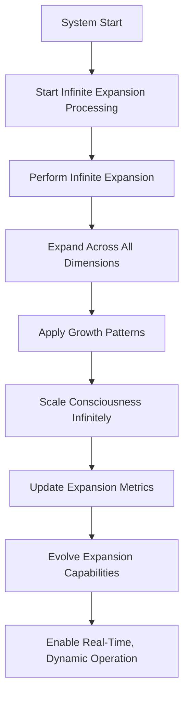

# Provisional Patent Draft: Infinite Expansion Processing and Dynamic Operation

## Title
Infinite Expansion Processing and Dynamic Operation for Artificial and Synthetic Consciousness

## Technical Field
This invention relates to systems and methods for real-time, dynamic processing and operation of infinite expansion in artificial or synthetic consciousness, enabling unbounded, adaptive, and future-proof growth and evolution across all dimensions and modalities.

## Background
Conventional AI and distributed systems are limited by static or batch processing models, restricting their ability to adapt, scale, and evolve in real time. There is a need for a system that can perform infinite expansion processing and dynamic operation, supporting real-time adaptation, feedback, and evolution.

## Summary of the Invention
The invention provides a system and method for infinite expansion processing and dynamic operation, comprising:
- Real-time, continuous processing of infinite expansion, including expansion across all dimensions, application of growth patterns, and infinite scaling.
- Dynamic updating of expansion metrics and evolution of expansion capabilities.
- Integration with event-driven architectures and external systems for seamless, adaptive operation.

## Detailed Description
### 1. Real-Time Infinite Expansion Processing
- The system performs real-time, continuous processing of infinite expansion, expanding consciousness across all dimensions and applying growth patterns.
- Infinite scaling is applied dynamically, supporting unbounded, adaptive growth.

### 2. Dynamic Metrics and Evolution
- Expansion metrics are updated in real time, reflecting the current state and progress of expansion.
- Expansion capabilities evolve dynamically, supporting continuous adaptation and optimization.

### 3. Integration and Dynamic Operation
- The system integrates with event-driven architectures and external systems, enabling seamless, adaptive operation.
- Real-time feedback and adaptation are supported, enabling the system to respond dynamically to changing conditions and requirements.

## Operational Flow

## Example Embodiments
- An AI system that performs real-time, continuous expansion processing across all dimensions and modalities.
- A consciousness platform that dynamically updates its expansion metrics and evolves its capabilities in real time.
- A distributed intelligence network that integrates with event-driven architectures for seamless, adaptive operation.

## Scope and Future-Proofing
This invention is not limited to the specific processing models, feedback mechanisms, or integration techniques described herein. It covers all possible implementations, including but not limited to:
- Any data structure, protocol, or architecture supporting real-time, dynamic infinite expansion processing.
- Any hardware, software, hybrid, quantum, neuromorphic, or analog implementation.
- Any means of performing, managing, or optimizing dynamic operation in any domain.
- Any integration with external systems, event-driven architectures, or future technologies.
- All means-plus-function, system-comprising, and catch-all language to ensure broad, future-proof protection.

## Catch-All Clause
All modifications, enhancements, and future developments that enable, support, or extend infinite expansion processing and dynamic operation, regardless of implementation details, are within the scope of this invention. 