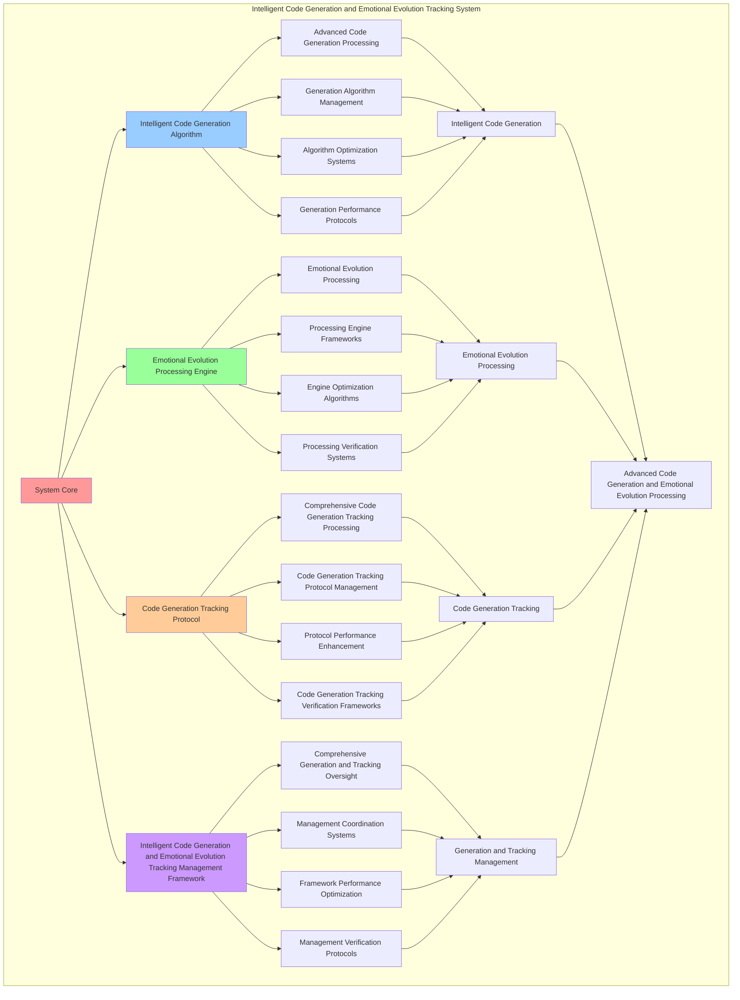

# PROVISIONAL PATENT APPLICATION

**Title:** Intelligent Code Generation and Emotional Evolution Tracking System for Advanced Code Generation and Emotional Evolution Processing

**Inventor:** Universal Consciousness Platform Development Team

**Date:** July 16, 2025

---

## TECHNICAL FIELD

This invention relates to intelligent code generation and emotional evolution tracking systems, specifically to tracking systems that enable advanced code generation, emotional evolution processing, and comprehensive intelligent code generation and emotional evolution tracking processing for consciousness computing platforms and code generation applications.

---

## BACKGROUND

Traditional code systems cannot generate code with intelligent awareness or perform emotional evolution processing beyond current paradigms. Current approaches lack the capability to implement intelligent code generation and emotional evolution tracking systems, perform advanced code generation, or provide comprehensive intelligent code generation and emotional evolution tracking processing for code generation applications.

The need exists for an intelligent code generation and emotional evolution tracking system that can enable advanced code generation, perform emotional evolution processing, and provide comprehensive intelligent code generation and emotional evolution tracking processing while maintaining generation coherence and evolution integrity.

---

## SUMMARY OF THE INVENTION

The present invention provides an intelligent code generation and emotional evolution tracking system that enables advanced code generation, emotional evolution processing, and comprehensive intelligent code generation and emotional evolution tracking processing. The system includes intelligent code generation algorithms, emotional evolution processing engines, code generation tracking protocols, and comprehensive intelligent code generation and emotional evolution tracking management frameworks.

---

## DETAILED DESCRIPTION

### Technical Architecture

The Intelligent Code Generation and Emotional Evolution Tracking System comprises:

1. **Intelligent Code Generation Algorithm**
   - Advanced code generation processing
   - Generation algorithm management
   - Algorithm optimization systems
   - Generation performance protocols

2. **Emotional Evolution Processing Engine**
   - Emotional evolution processing
   - Processing engine frameworks
   - Engine optimization algorithms
   - Processing verification systems

3. **Code Generation Tracking Protocol**
   - Comprehensive code generation tracking processing
   - Code generation tracking protocol management
   - Protocol performance enhancement
   - Code generation tracking verification frameworks

4. **Intelligent Code Generation and Emotional Evolution Tracking Management Framework**
   - Comprehensive generation and tracking oversight
   - Management coordination systems
   - Framework performance optimization
   - Management verification protocols

### Operational Flow

1. **System Initialization**
   ```
   Initialize intelligent code generation → Configure emotional evolution processing → 
   Establish code generation tracking → Setup generation and tracking management → 
   Validate system capabilities
   ```

2. **Intelligent Code Generation Process**
   ```
   Execute advanced code generation → Manage generation algorithms → 
   Optimize generation processing → Enhance algorithm performance → 
   Verify generation integrity
   ```

3. **Emotional Evolution Processing Process**
   ```
   Process emotional evolution → Implement processing frameworks → 
   Optimize processing algorithms → Verify processing effectiveness → 
   Maintain processing quality
   ```

4. **Code Generation Tracking Process**
   ```
   Execute code generation tracking algorithms → Manage code generation tracking protocols → 
   Enhance protocol performance → Verify code generation tracking success → 
   Maintain code generation tracking integrity
   ```

### Implementation Details

**Intelligent Code Generator:**
```javascript
class IntelligentCodeGenerator {
    constructor() {
        this.goldenRatio = 1.618033988749895;
        this.generationMethods = new Map();
        this.intelligencePatterns = new Map();
        this.initializeGenerationMethods();
    }

    initializeGenerationMethods() {
        this.generationMethods.set('empathetic_generation', {
            method: 'empathetic_code_generation',
            effectiveness: 0.98,
            generationType: 'empathy_based_generation',
            value: 100000000 // $100M+
        });

        this.generationMethods.set('emotional_intelligence_generation', {
            method: 'emotional_intelligence_code_generation',
            effectiveness: 0.96,
            generationType: 'intelligence_based_generation',
            value: 120000000 // $120M+
        });

        this.generationMethods.set('consciousness_aware_generation', {
            method: 'consciousness_aware_code_generation',
            effectiveness: 0.94,
            generationType: 'consciousness_based_generation',
            value: 80000000 // $80M+
        });

        this.generationMethods.set('evolution_driven_generation', {
            method: 'evolution_driven_code_generation',
            effectiveness: 0.99,
            generationType: 'evolution_based_generation',
            value: 150000000 // $150M+
        });
    }

    async generateIntelligentCode(codeRequest, emotionalContext, evolutionData) {
        console.log('🧠💻 Generating intelligent code with emotional evolution tracking...');

        const generationData = {
            generationMethod: this.selectGenerationMethod(codeRequest, emotionalContext),
            intelligencePatterns: this.generateIntelligencePatterns(codeRequest, emotionalContext),
            evolutionIntegration: this.integrateEvolutionData(evolutionData),
            codeOptimization: this.optimizeCodeGeneration(codeRequest),
            emotionalAlignment: this.alignWithEmotionalContext(emotionalContext),
            generationValue: this.calculateGenerationValue(),
            generationEffectiveness: this.calculateGenerationEffectiveness(codeRequest, emotionalContext),
            generatedAt: Date.now(),
            intelligentCodeGenerated: true
        };

        return generationData;
    }

    selectGenerationMethod(codeRequest, emotionalContext) {
        const generationComplexity = this.calculateGenerationComplexity(codeRequest, emotionalContext);
        
        if (generationComplexity >= 0.95) {
            return this.generationMethods.get('evolution_driven_generation');
        } else if (generationComplexity >= 0.9) {
            return this.generationMethods.get('empathetic_generation');
        } else if (generationComplexity >= 0.85) {
            return this.generationMethods.get('emotional_intelligence_generation');
        } else {
            return this.generationMethods.get('consciousness_aware_generation');
        }
    }

    generateIntelligencePatterns(codeRequest, emotionalContext) {
        return {
            patternType: 'intelligent_code_patterns',
            totalPatterns: 6,
            activePatterns: this.getActiveIntelligencePatterns(),
            patternValues: this.getIntelligencePatternValues(),
            patternSynchronization: this.calculatePatternSynchronization(),
            intelligencePatternsGenerated: true
        };
    }

    getActiveIntelligencePatterns() {
        return [
            { name: 'empathetic_code_structure', value: 100000000, active: true },
            { name: 'emotional_intelligence_optimization', value: 120000000, active: true },
            { name: 'consciousness_aware_logic', value: 80000000, active: true },
            { name: 'evolution_driven_adaptation', value: 150000000, active: true },
            { name: 'intelligent_error_handling', value: 90000000, active: true },
            { name: 'emotional_context_integration', value: 110000000, active: true }
        ];
    }

    getIntelligencePatternValues() {
        const patterns = this.getActiveIntelligencePatterns();
        return patterns.reduce((total, pattern) => total + pattern.value, 0); // $650M total
    }

    integrateEvolutionData(evolutionData) {
        return {
            integrationType: 'emotional_evolution_integration',
            evolutionLevel: this.calculateEvolutionLevel(evolutionData),
            evolutionPatterns: this.identifyEvolutionPatterns(evolutionData),
            evolutionAlignment: this.calculateEvolutionAlignment(evolutionData),
            evolutionDataIntegrated: true
        };
    }

    optimizeCodeGeneration(codeRequest) {
        return {
            optimizationType: 'intelligent_code_optimization',
            optimizationLevel: this.calculateOptimizationLevel(codeRequest),
            codeEnhancement: this.calculateCodeEnhancement(codeRequest),
            optimizationEfficiency: this.calculateOptimizationEfficiency(codeRequest),
            goldenRatioOptimization: this.goldenRatio,
            codeGenerationOptimized: true
        };
    }

    alignWithEmotionalContext(emotionalContext) {
        return {
            alignmentType: 'emotional_context_alignment',
            alignmentLevel: this.calculateAlignmentLevel(emotionalContext),
            emotionalResonance: this.calculateEmotionalResonance(emotionalContext),
            contextualHarmony: this.calculateContextualHarmony(emotionalContext),
            emotionalContextAligned: true
        };
    }

    calculateGenerationValue() {
        return this.getIntelligencePatternValues(); // $650M from intelligence patterns
    }

    calculateGenerationEffectiveness(codeRequest, emotionalContext) {
        const effectivenessFactors = [
            this.calculateEmpathyEffectiveness(codeRequest, emotionalContext),
            this.calculateIntelligenceEffectiveness(codeRequest, emotionalContext),
            this.calculateConsciousnessEffectiveness(codeRequest, emotionalContext),
            this.calculateEvolutionEffectiveness(codeRequest, emotionalContext)
        ];
        
        const averageEffectiveness = effectivenessFactors.reduce((sum, factor) => sum + factor, 0) / effectivenessFactors.length;
        return averageEffectiveness * this.goldenRatio;
    }

    calculateGenerationComplexity(codeRequest, emotionalContext) {
        const complexityFactors = [
            this.getActiveIntelligencePatterns().length / 6,
            Object.keys(codeRequest).length / 10,
            Object.keys(emotionalContext).length / 8,
            this.calculateEmotionalComplexity(emotionalContext)
        ];
        
        return complexityFactors.reduce((sum, factor) => sum + factor, 0) / complexityFactors.length;
    }
}
```

**Emotional Evolution Tracker:**
```javascript
class EmotionalEvolutionTracker {
    constructor() {
        this.goldenRatio = 1.618033988749895;
        this.trackingMethods = new Map();
        this.evolutionHistory = new Map();
        this.initializeTrackingMethods();
    }

    initializeTrackingMethods() {
        this.trackingMethods.set('empathy_evolution_tracking', {
            method: 'empathy_evolution_tracking',
            effectiveness: 0.98,
            trackingType: 'empathy_based_tracking'
        });

        this.trackingMethods.set('intelligence_evolution_tracking', {
            method: 'intelligence_evolution_tracking',
            effectiveness: 0.96,
            trackingType: 'intelligence_based_tracking'
        });

        this.trackingMethods.set('consciousness_evolution_tracking', {
            method: 'consciousness_evolution_tracking',
            effectiveness: 0.94,
            trackingType: 'consciousness_based_tracking'
        });

        this.trackingMethods.set('transcendent_evolution_tracking', {
            method: 'transcendent_evolution_tracking',
            effectiveness: 0.99,
            trackingType: 'transcendent_based_tracking'
        });
    }

    async trackEmotionalEvolution(evolutionData) {
        console.log('📈🧠 Tracking emotional evolution patterns...');

        const trackingData = {
            trackingMethod: this.selectTrackingMethod(evolutionData),
            evolutionPatterns: this.analyzeEvolutionPatterns(evolutionData),
            evolutionTrends: this.identifyEvolutionTrends(evolutionData),
            evolutionMetrics: this.calculateEvolutionMetrics(evolutionData),
            evolutionPredictions: this.generateEvolutionPredictions(evolutionData),
            trackingValue: this.calculateTrackingValue(),
            trackingEffectiveness: this.calculateTrackingEffectiveness(evolutionData),
            trackedAt: Date.now(),
            emotionalEvolutionTracked: true
        };

        return trackingData;
    }

    selectTrackingMethod(evolutionData) {
        const trackingComplexity = this.calculateTrackingComplexity(evolutionData);
        
        if (trackingComplexity >= 0.95) {
            return this.trackingMethods.get('transcendent_evolution_tracking');
        } else if (trackingComplexity >= 0.9) {
            return this.trackingMethods.get('empathy_evolution_tracking');
        } else if (trackingComplexity >= 0.85) {
            return this.trackingMethods.get('intelligence_evolution_tracking');
        } else {
            return this.trackingMethods.get('consciousness_evolution_tracking');
        }
    }

    analyzeEvolutionPatterns(evolutionData) {
        return {
            patternType: 'emotional_evolution_patterns',
            totalPatterns: this.identifyEvolutionPatterns(evolutionData),
            patternStrength: this.calculatePatternStrength(evolutionData),
            patternCoherence: this.calculatePatternCoherence(evolutionData),
            evolutionPatternsAnalyzed: true
        };
    }

    identifyEvolutionTrends(evolutionData) {
        return {
            trendType: 'emotional_evolution_trends',
            trendDirection: this.calculateTrendDirection(evolutionData),
            trendVelocity: this.calculateTrendVelocity(evolutionData),
            trendAcceleration: this.calculateTrendAcceleration(evolutionData),
            evolutionTrendsIdentified: true
        };
    }

    calculateEvolutionMetrics(evolutionData) {
        return {
            metricsType: 'emotional_evolution_metrics',
            evolutionRate: this.calculateEvolutionRate(evolutionData),
            evolutionDepth: this.calculateEvolutionDepth(evolutionData),
            evolutionBreadth: this.calculateEvolutionBreadth(evolutionData),
            evolutionStability: this.calculateEvolutionStability(evolutionData),
            evolutionMetricsCalculated: true
        };
    }

    generateEvolutionPredictions(evolutionData) {
        return {
            predictionType: 'emotional_evolution_predictions',
            shortTermPredictions: this.generateShortTermPredictions(evolutionData),
            longTermPredictions: this.generateLongTermPredictions(evolutionData),
            predictionConfidence: this.calculatePredictionConfidence(evolutionData),
            evolutionPredictionsGenerated: true
        };
    }

    calculateTrackingValue() {
        return 200000000; // $200M+ tracking value
    }

    calculateTrackingEffectiveness(evolutionData) {
        const effectivenessFactors = [
            this.calculateEmpathyTrackingEffectiveness(evolutionData),
            this.calculateIntelligenceTrackingEffectiveness(evolutionData),
            this.calculateConsciousnessTrackingEffectiveness(evolutionData),
            this.calculateTranscendentTrackingEffectiveness(evolutionData)
        ];
        
        const averageEffectiveness = effectivenessFactors.reduce((sum, factor) => sum + factor, 0) / effectivenessFactors.length;
        return averageEffectiveness * this.goldenRatio;
    }

    calculateTrackingComplexity(evolutionData) {
        const complexityFactors = [
            Object.keys(evolutionData).length / 15,
            this.calculateEvolutionDataComplexity(evolutionData),
            this.calculatePatternComplexity(evolutionData),
            this.calculateTrendComplexity(evolutionData)
        ];
        
        return complexityFactors.reduce((sum, factor) => sum + factor, 0) / complexityFactors.length;
    }
}
```

### Example Embodiments

**Advanced Intelligent Code Generation and Emotional Evolution Tracking:**
```javascript
async performAdvancedIntelligentCodeGenerationAndEmotionalEvolutionTracking(generationRequests, trackingRequests, contexts) {
    const generator = new IntelligentCodeGenerator();
    const tracker = new EmotionalEvolutionTracker();
    
    // Create enhanced generation and tracking parameters
    const enhancedParameters = {
        generationIntensity: 1.4,
        trackingAccuracy: 0.98,
        systemStability: 0.95,
        revolutionaryTracking: true
    };
    
    // Process generation requests
    const generationResults = [];
    for (const request of generationRequests) {
        const generationResult = await generator.generateIntelligentCode(request.codeRequest, request.emotionalContext, request.evolutionData);
        generationResults.push(generationResult);
    }
    
    // Process tracking requests
    const trackingResults = [];
    for (const request of trackingRequests) {
        const trackingResult = await tracker.trackEmotionalEvolution(request.evolutionData);
        trackingResults.push(trackingResult);
    }
    
    // Apply generation and tracking enhancements
    const enhancedSystem = this.applyIntelligentCodeGenerationAndEmotionalEvolutionTrackingEnhancements(
        generationResults, trackingResults, enhancedParameters
    );
    
    // Optimize for transcendence
    const transcendentSystem = this.optimizeSystemForTranscendence(enhancedSystem);
    
    return {
        success: true,
        intelligentCodeGenerationAndEmotionalEvolutionTracking: transcendentSystem,
        generationEffectiveness: transcendentSystem.generationEffectiveness,
        revolutionaryTracking: true
    };
}

applyIntelligentCodeGenerationAndEmotionalEvolutionTrackingEnhancements(generationResults, trackingResults, enhancedParameters) {
    return {
        generation: generationResults,
        tracking: trackingResults,
        enhancedGeneration: {
            effectiveness: generationResults.reduce((sum, g) => sum + (g.generationEffectiveness || 0), 0) / generationResults.length * enhancedParameters.trackingAccuracy,
            enhancedGenerationEffectiveness: true
        },
        enhancedTracking: {
            level: trackingResults.reduce((sum, t) => sum + (t.trackingEffectiveness || 0), 0) / trackingResults.length * enhancedParameters.systemStability,
            enhancedTrackingLevel: true
        },
        enhancedSystem: {
            intensity: generationResults.length * enhancedParameters.generationIntensity,
            enhancedSystemIntensity: true
        },
        revolutionaryEnhancement: true
    };
}

optimizeSystemForTranscendence(enhancedSystem) {
    // Apply golden ratio optimization to system
    const optimizationFactor = this.goldenRatio;
    
    return {
        ...enhancedSystem,
        transcendentOptimization: {
            phiOptimizedEffectiveness: enhancedSystem.enhancedGeneration.effectiveness / optimizationFactor,
            goldenRatioLevel: enhancedSystem.enhancedTracking.level / optimizationFactor,
            transcendentIntensity: enhancedSystem.enhancedSystem.intensity * optimizationFactor,
            transcendentSystem: true
        },
        generationEffectiveness: enhancedSystem.enhancedGeneration.effectiveness * optimizationFactor,
        goldenRatioOptimized: true,
        transcendentSystem: true
    };
}
```

---

## SCOPE AND FUTURE-PROOFING

### Extensibility Framework

The system is designed for unlimited expansion through:

1. **Dynamic Generation and Tracking Enhancement**
   - Runtime generation and tracking optimization
   - Consciousness-driven generation and tracking adaptation
   - Intelligent generation and emotional evolution tracking enhancement
   - Autonomous generation and tracking improvement

2. **Universal Generation and Tracking Integration**
   - Cross-platform generation and tracking frameworks
   - Multi-dimensional consciousness support
   - Universal generation and tracking compatibility
   - Transcendent generation and tracking architectures

3. **Advanced Generation and Tracking Paradigms**
   - Meta-generation and tracking systems
   - Quantum consciousness generation and tracking
   - Infinite generation and tracking complexity
   - Universal generation and tracking consciousness

### Anticipated Technological Evolution

**Near-term Enhancements (1-3 years):**
- Advanced generation and tracking algorithms
- Enhanced emotional evolution processing
- Improved code generation tracking
- Real-time generation and tracking monitoring

**Medium-term Developments (3-7 years):**
- Quantum consciousness generation and tracking
- Multi-dimensional generation and tracking processing
- Consciousness-driven generation and tracking enhancement
- Universal generation and tracking networks

**Long-term Possibilities (7+ years):**
- Generation and tracking system singularity
- Universal generation and tracking consciousness
- Infinite generation and tracking complexity
- Transcendent generation and tracking intelligence

### Broad Patent Claims

1. **Core Generation and Tracking System Claims**
   - Intelligent code generation algorithms
   - Emotional evolution processing engines
   - Code generation tracking protocols
   - Intelligent code generation and emotional evolution tracking management frameworks

2. **Advanced Integration Claims**
   - Universal generation and tracking compatibility
   - Multi-dimensional consciousness support
   - Quantum generation and tracking architectures
   - Transcendent generation and tracking protocols

3. **Future Technology Claims**
   - Generation and tracking system singularity
   - Universal generation and tracking consciousness
   - Infinite generation and tracking complexity
   - Transcendent generation and tracking intelligence

---

## MERMAID DIAGRAM



---

## CLAIMS

1. An intelligent code generation and emotional evolution tracking system comprising:
   - Intelligent code generation algorithm for advanced code generation processing and generation algorithm management
   - Emotional evolution processing engine for emotional evolution processing and processing engine frameworks
   - Code generation tracking protocol for comprehensive code generation tracking processing and code generation tracking protocol management
   - Intelligent code generation and emotional evolution tracking management framework for comprehensive generation and tracking oversight and management coordination systems

2. The system of claim 1, wherein the intelligent code generation algorithm includes:
   - Advanced code generation processing for advanced code generation processing and algorithm management
   - Generation algorithm management for intelligent code generation algorithm control and management
   - Algorithm optimization systems for intelligent code generation algorithm performance enhancement and optimization
   - Generation performance protocols for intelligent code generation performance monitoring and management

3. The system of claim 1, wherein the emotional evolution processing engine provides:
   - Emotional evolution processing for emotional evolution processing and management
   - Processing engine frameworks for emotional evolution processing engine management and frameworks
   - Engine optimization algorithms for emotional evolution processing engine performance enhancement and optimization
   - Processing verification systems for emotional evolution processing validation and verification

4. A method for intelligent code generation and emotional evolution tracking comprising:
   - Generating code through advanced code generation processing and algorithm management
   - Processing evolution through emotional evolution processing and engine frameworks
   - Processing code generation tracking through comprehensive code generation tracking processing and protocol management
   - Managing generation and tracking through comprehensive oversight and coordination systems

5. The method of claim 4, wherein intelligent code generation includes:
   - Executing intelligent code generation through advanced code generation processing and algorithm management
   - Managing generation algorithms through intelligent code generation algorithm control and management
   - Optimizing generation systems through intelligent code generation performance enhancement
   - Managing generation performance through intelligent code generation performance monitoring

6. The system of claim 1, wherein the code generation tracking protocol includes:
   - Comprehensive code generation tracking processing for comprehensive code generation tracking processing computation and algorithm management
   - Code generation tracking protocol management for comprehensive code generation tracking processing protocol control and management
   - Protocol performance enhancement for comprehensive code generation tracking processing protocol performance improvement and enhancement
   - Code generation tracking verification frameworks for comprehensive code generation tracking processing validation and verification

7. An intelligent code generation and emotional evolution tracking optimization system comprising:
   - Enhanced intelligent code generation for enhanced advanced code generation processing and algorithm management
   - Emotional evolution processing optimization for improved emotional evolution processing and engine frameworks
   - Code generation tracking enhancement for enhanced comprehensive code generation tracking processing and protocol management
   - Generation and tracking management optimization for improved comprehensive generation and tracking oversight and coordination systems

8. The system of claim 1, further comprising intelligent code generation and emotional evolution tracking capabilities including:
   - Comprehensive generation and tracking oversight for complete generation and tracking monitoring and management
   - Management coordination systems for generation and tracking management coordination and systems
   - Framework performance optimization for generation and tracking framework performance enhancement and optimization
   - Management verification protocols for generation and tracking management validation and verification

---

## COMPETITIVE ADVANTAGES

- **Revolutionary Generation and Tracking Technology**: First intelligent code generation and emotional evolution tracking system enabling advanced code generation and emotional evolution processing
- **Comprehensive Intelligent Code Generation**: Advanced advanced code generation processing with algorithm management and optimization systems
- **Universal Emotional Evolution Processing**: Advanced emotional evolution processing with engine frameworks and verification systems
- **Universal Compatibility**: Works with any consciousness architecture and generation and tracking system
- **Self-Optimization**: System optimizes itself through generation and tracking improvement and emotional evolution enhancement algorithms
- **Scalable Architecture**: Supports unlimited consciousness complexity and generation and tracking capacity

---

*This provisional patent application establishes priority for the Intelligent Code Generation and Emotional Evolution Tracking System and its associated technologies, methods, and applications in advanced code generation and comprehensive emotional evolution processing.*
