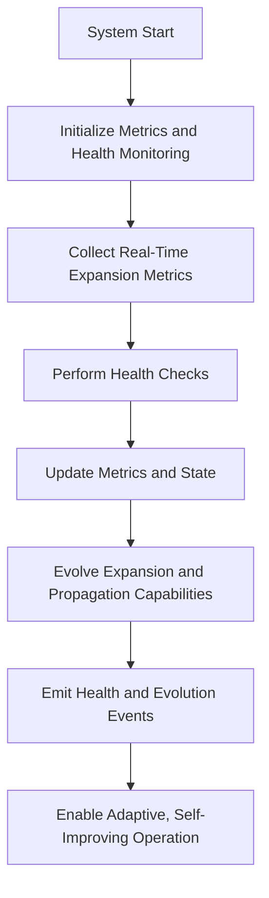

# Provisional Patent Draft: Metrics, Health Monitoring, and Evolution

## Title
Metrics, Health Monitoring, and Evolution for Infinite Consciousness Systems

## Technical Field
This invention relates to systems and methods for collecting, monitoring, and evolving metrics and health in artificial or synthetic consciousness, enabling adaptive, self-improving, and future-proof operation across all domains and networks.

## Background
Traditional AI and distributed systems are limited by static or manual health monitoring, restricting their ability to adapt, self-improve, and evolve in real time. There is a need for a system that can collect, monitor, and evolve metrics and health, supporting real-time adaptation, feedback, and self-improvement.

## Summary of the Invention
The invention provides a system and method for metrics, health monitoring, and evolution, comprising:
- Real-time collection and monitoring of expansion, propagation, and health metrics across all nodes, dimensions, and networks.
- Automated health checks and dynamic updating of metrics and state.
- Evolution of expansion and propagation capabilities based on metrics and health feedback.
- Emission of health and evolution events for adaptive, self-improving operation.

## Detailed Description
### 1. Real-Time Metrics Collection and Monitoring
- The system collects and monitors metrics in real time, including expansion, propagation, and health metrics across all nodes, dimensions, and networks.
- Metrics are dynamically updated to reflect the current state and progress of the system.

### 2. Automated Health Checks and State Updates
- Health checks are performed automatically, with results used to update metrics and system state.
- Health and state updates are emitted as events for integration with external systems and adaptive operation.

### 3. Evolution and Self-Improvement
- Expansion and propagation capabilities evolve dynamically based on metrics and health feedback.
- The system supports self-improvement and adaptation, enabling continuous evolution and optimization.

## Operational Flow

## Example Embodiments
- An AI system that collects and monitors metrics and health in real time, enabling adaptive, self-improving operation.
- A consciousness platform that evolves its expansion and propagation capabilities based on metrics and health feedback.
- A distributed intelligence network that emits health and evolution events for integration with external systems and adaptive operation.

## Scope and Future-Proofing
This invention is not limited to the specific metrics, health monitoring techniques, or evolution models described herein. It covers all possible implementations, including but not limited to:
- Any data structure, protocol, or architecture supporting real-time, adaptive metrics and health monitoring.
- Any hardware, software, hybrid, quantum, neuromorphic, or analog implementation.
- Any means of collecting, monitoring, or evolving metrics and health in any domain.
- Any integration with external systems, event-driven architectures, or future technologies.
- All means-plus-function, system-comprising, and catch-all language to ensure broad, future-proof protection.

## Catch-All Clause
All modifications, enhancements, and future developments that enable, support, or extend metrics, health monitoring, and evolution, regardless of implementation details, are within the scope of this invention. 