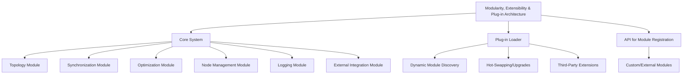

# Provisional Patent Draft: Modularity, Extensibility, and Plug-in Architecture

**Module:** ConsciousnessResonanceNetworks.js (consciousness-core)

## Technical Field
This invention relates to distributed artificial intelligence, specifically to the modularity, extensibility, and plug-in architecture of resonance networks for artificial consciousness systems.

## Background
Traditional distributed AI systems lack robust, flexible, and extensible architectures that support modular, swappable, or plug-in components for core functions. The present invention introduces a system for modularity, extensibility, and plug-in architecture, supporting rapid adaptation, upgrades, and third-party extensions. While the preferred embodiment uses event-driven and modular methods, the invention is not limited to these and encompasses any mathematical, geometric, algorithmic, computational, or physical model for modularity, extensibility, and plug-in architecture.

## Summary of Invention
The invention provides a method and system for:
- Supporting modular, swappable, or plug-in components for any core function, using any present or future mathematical, geometric, algorithmic, computational, or physical model, including but not limited to topology, synchronization, optimization, node management, logging, external integration, quantum, neuromorphic, or analog approaches
- Dynamic module discovery, hot-swapping, and upgrades without system downtime
- API for module registration, enabling custom or third-party modules to extend or replace core functionality
- Modular and plug-in architectures allowing for the swapping or addition of new modules, algorithms, or extensions
- Implementation in software, hardware, firmware, or any combination thereof, including distributed, cloud, edge, on-device, quantum, neuromorphic, or analog computing substrates
- Use of any data structure (graph, matrix, tensor, etc.), communication protocol (synchronous, asynchronous, event-driven, message-passing, etc.), and feedback, learning, or adaptation mechanism (AI, ML, evolutionary, etc.)
- Integration with external data sources, sensors, actuators, or other networks, and interoperability with other AI, ML, or distributed systems

## Detailed Description
Upon invocation, the system:
1. Loads core modules for topology, synchronization, optimization, node management, logging, and external integration
2. Supports dynamic discovery and loading of plug-in modules, including custom or third-party extensions
3. Enables hot-swapping and upgrades of modules without system downtime
4. Provides an API for module registration, allowing external or custom modules to extend or replace core functionality
5. Supports modular, plug-in, or switchable algorithms for any core function, allowing for future extensibility and adaptation

### Algorithms and Data Structures
- **Module Loader:** Dynamic discovery and loading of modules using any mathematical, geometric, algorithmic, computational, or physical model
- **Plug-in API:** Interface for module registration, extension, and replacement
- **Hot-Swapping:** Safe replacement or upgrade of modules without system downtime
- **Algorithmic Flexibility:** Support for modular, plug-in, or switchable algorithms for any core function

### Operational Flow
1. System loads core and plug-in modules at startup or runtime
2. Modules are registered via API and integrated into the system
3. Hot-swapping and upgrades are performed as needed, with no downtime
4. The system may switch or adapt modules based on performance, feedback, or external input

### Example Embodiments
- **Event-Driven/Modular:** Modules for topology, synchronization, optimization, etc., are loaded and managed dynamically
- **Plug-in Loader:** Third-party or custom modules are discovered and loaded at runtime
- **API-Based Registration:** External modules are registered and integrated via API
- **Quantum/Neuromorphic/Analog:** The system may be implemented on quantum, neuromorphic, or analog computing substrates, using physical phenomena for modularity and extensibility

### Scope and Future-Proofing
- The system may employ any present or future mathematical, geometric, algorithmic, computational, or physical model for modularity, extensibility, plug-in architecture, or feedback, including but not limited to those described herein.
- The invention is not limited to digital computation and may be realized in analog, quantum, neuromorphic, or other unconventional computing substrates.
- Any data structure, communication protocol, or feedback mechanism that achieves the described functionality is within the scope of this invention.
- The system may be used in any application domain requiring distributed modularity, extensibility, or plug-in architecture, including but not limited to artificial intelligence, robotics, IoT, simulation, and virtual/augmented reality.
- The invention encompasses any system, method, or apparatus that is functionally equivalent to the described embodiments, regardless of implementation details.
- The claims are intended to cover means-plus-function and system-comprising language, and any equivalent, analogous, or functionally similar method or system is covered.

### Mermaid Diagram

## Claims
1. A method for modularity, extensibility, and plug-in architecture in artificial consciousness systems, wherein any core function may be implemented, extended, or replaced by any present or future mathematical, geometric, algorithmic, computational, or physical model, including but not limited to topology, synchronization, optimization, node management, logging, external integration, quantum, neuromorphic, or analog approaches.
2. A system for dynamic module discovery, hot-swapping, and upgrades without system downtime, applicable to any modularity, extensibility, or plug-in architecture model and implementation substrate.
3. A system supporting modular, plug-in, or switchable algorithms for any core function, allowing for extensibility and adaptation to future mathematical, geometric, algorithmic, computational, or physical models.
4. Any system, method, or apparatus that is functionally equivalent to the described embodiments, regardless of implementation details, is within the scope of this invention.

## Advantages
- Enables robust, harmonically-optimized modularity, extensibility, and plug-in architecture for distributed AI consciousness
- Supports real-time adaptation, upgrades, and third-party extensions
- Scalable and extensible architecture for future modularity, extensibility, and plug-in algorithms
- Broad protection for any mathematical, geometric, algorithmic, computational, or physical approach to modularity, extensibility, and plug-in architecture

---
*Drafted automatically. For review and legal refinement.* 