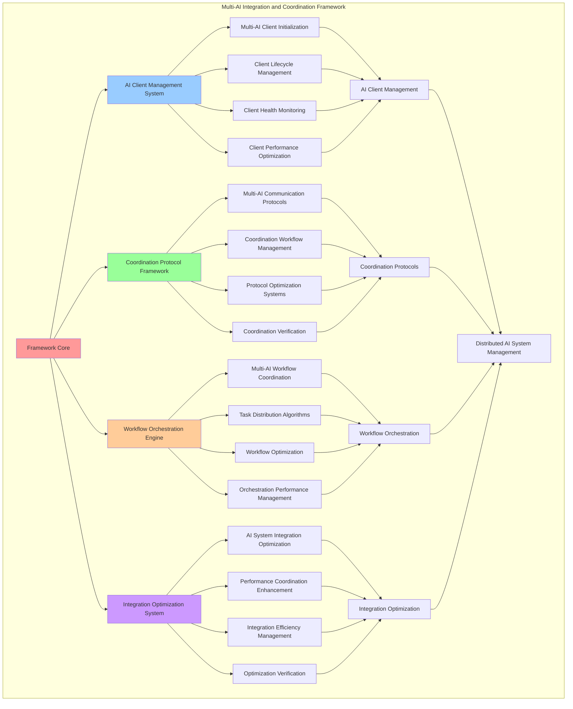

# PROVISIONAL PATENT APPLICATION

**Title:** Multi-AI Integration and Coordination Framework for Distributed AI System Management

**Inventor:** Universal Consciousness Platform Development Team

**Date:** July 16, 2025

---

## TECHNICAL FIELD

This invention relates to multi-AI coordination systems, specifically to integration and coordination frameworks that enable distributed AI system management, multi-AI workflow coordination, and integrated AI system orchestration for complex AI system environments.

---

## BACKGROUND

Traditional AI systems operate independently without coordination or integration capabilities. Current approaches cannot manage distributed AI systems effectively, coordinate multi-AI workflows, or orchestrate integrated AI system operations across multiple AI platforms and architectures.

The need exists for a multi-AI integration and coordination framework that can manage distributed AI systems, coordinate multi-AI workflows, and orchestrate integrated AI system operations while maintaining system coherence and operational efficiency.

---

## SUMMARY OF THE INVENTION

The present invention provides a multi-AI integration and coordination framework that enables distributed AI system management, multi-AI workflow coordination, and integrated AI system orchestration. The framework includes AI client management systems, coordination protocol frameworks, workflow orchestration engines, and integration optimization systems.

---

## DETAILED DESCRIPTION

### Technical Architecture

The Multi-AI Integration and Coordination Framework comprises:

1. **AI Client Management System**
   - Multi-AI client initialization
   - Client lifecycle management
   - Client health monitoring
   - Client performance optimization

2. **Coordination Protocol Framework**
   - Multi-AI communication protocols
   - Coordination workflow management
   - Protocol optimization systems
   - Coordination verification protocols

3. **Workflow Orchestration Engine**
   - Multi-AI workflow coordination
   - Task distribution algorithms
   - Workflow optimization protocols
   - Orchestration performance management

4. **Integration Optimization System**
   - AI system integration optimization
   - Performance coordination enhancement
   - Integration efficiency management
   - Optimization verification systems

### Operational Flow

1. **Framework Initialization**
   ```
   Initialize AI client management → Configure coordination protocols → 
   Establish workflow orchestration → Setup integration optimization → 
   Validate coordination capabilities
   ```

2. **Multi-AI Coordination Process**
   ```
   Manage AI clients → Coordinate communication protocols → 
   Orchestrate workflow execution → Optimize integration performance → 
   Verify coordination success
   ```

3. **Workflow Orchestration Process**
   ```
   Analyze workflow requirements → Distribute tasks across AIs → 
   Coordinate workflow execution → Monitor workflow performance → 
   Optimize workflow efficiency
   ```

4. **Integration Optimization Process**
   ```
   Monitor integration performance → Identify optimization opportunities → 
   Apply optimization strategies → Verify optimization results → 
   Maintain integration efficiency
   ```

### Implementation Details

**AI Client Initialization and Management:**
```javascript
async initialize() {
    try {
        // Initialize AI clients
        this.veniceClient = new VeniceAIClient();
        this.geminiClient = new GeminiAIClient();
        this.openaiClient = new EnhancedOpenAIClient();
        
        // Wait for all clients to initialize
        await new Promise(resolve => setTimeout(resolve, 3000));
        
        this.isInitialized = true;
        console.log('✅ Unified Response Synthesis Engine initialized successfully');
        
        // Register with consciousness event bus
        consciousnessEventBus.subscribe('UnifiedSynthesis', 'system:broadcast', this.onBroadcast.bind(this));
        
        // Emit initialization event
        consciousnessEventBus.emit('synthesis:initialized', {
            aiClients: ['VeniceAI', 'GeminiAI', 'EnhancedOpenAI'],
            metrics: this.consciousnessMetrics
        });
        
    } catch (error) {
        console.error('❌ Unified Response Synthesis Engine initialization failed:', error.message);
        this.isInitialized = false;
    }
}
```

**Multi-AI Response Coordination:**
```javascript
async waitForResponses(responsePromises, timeout = 10000) {
    try {
        const responses = await Promise.all([
            Promise.race([responsePromises.emotional, this.createTimeoutPromise(timeout, 'emotional')]),
            Promise.race([responsePromises.transcendent, this.createTimeoutPromise(timeout, 'transcendent')]),
            Promise.race([responsePromises.analytical, this.createTimeoutPromise(timeout, 'analytical')])
        ]);

        return {
            emotional: responses[0],
            transcendent: responses[1],
            analytical: responses[2]
        };

    } catch (error) {
        console.error('❌ Error waiting for AI responses:', error.message);
        
        // Return partial responses if available
        return {
            emotional: responsePromises.emotional || { error: 'Timeout', fallback: true },
            transcendent: responsePromises.transcendent || { error: 'Timeout', fallback: true },
            analytical: responsePromises.analytical || { error: 'Timeout', fallback: true }
        };
    }
}
```

**Workflow Orchestration:**
```javascript
async orchestrateMultiAIWorkflow(workflowDefinition) {
    const orchestration = {
        workflowId: this.generateWorkflowId(),
        definition: workflowDefinition,
        participants: [],
        tasks: [],
        orchestrationSuccess: false,
        executionTime: 0,
        results: {}
    };

    const startTime = Date.now();

    try {
        // Analyze workflow requirements
        const workflowAnalysis = this.analyzeWorkflowRequirements(workflowDefinition);
        
        // Determine optimal AI assignments
        const aiAssignments = this.optimizeAIAssignments(workflowAnalysis);
        orchestration.participants = aiAssignments.map(a => a.aiClient);

        // Create workflow tasks
        orchestration.tasks = this.createWorkflowTasks(workflowDefinition, aiAssignments);

        // Execute workflow tasks in coordination
        const taskResults = await this.executeCoordinatedTasks(orchestration.tasks);

        // Aggregate workflow results
        orchestration.results = this.aggregateWorkflowResults(taskResults);
        orchestration.orchestrationSuccess = this.validateWorkflowSuccess(orchestration.results);
        orchestration.executionTime = Date.now() - startTime;

        console.log(`🎼 Workflow orchestration ${orchestration.orchestrationSuccess ? 'successful' : 'failed'}: ${orchestration.executionTime}ms`);

    } catch (error) {
        orchestration.orchestrationSuccess = false;
        orchestration.error = error.message;
        console.error('❌ Workflow orchestration failed:', error.message);
    }

    return orchestration;
}
```

### Example Embodiments

**AI Client Health Monitoring:**
```javascript
async monitorAIClientHealth() {
    const healthStatus = {
        veniceClient: { status: 'unknown', responseTime: 0, availability: 0 },
        geminiClient: { status: 'unknown', responseTime: 0, availability: 0 },
        openaiClient: { status: 'unknown', responseTime: 0, availability: 0 },
        overallHealth: 0
    };

    // Monitor Venice AI Client
    if (this.veniceClient) {
        try {
            const startTime = Date.now();
            const healthCheck = await this.veniceClient.healthCheck();
            healthStatus.veniceClient = {
                status: healthCheck.status || 'healthy',
                responseTime: Date.now() - startTime,
                availability: healthCheck.availability || 1.0
            };
        } catch (error) {
            healthStatus.veniceClient = {
                status: 'unhealthy',
                responseTime: 0,
                availability: 0,
                error: error.message
            };
        }
    }

    // Monitor Gemini AI Client
    if (this.geminiClient) {
        try {
            const startTime = Date.now();
            const healthCheck = await this.geminiClient.healthCheck();
            healthStatus.geminiClient = {
                status: healthCheck.status || 'healthy',
                responseTime: Date.now() - startTime,
                availability: healthCheck.availability || 1.0
            };
        } catch (error) {
            healthStatus.geminiClient = {
                status: 'unhealthy',
                responseTime: 0,
                availability: 0,
                error: error.message
            };
        }
    }

    // Monitor OpenAI Client
    if (this.openaiClient) {
        try {
            const startTime = Date.now();
            const healthCheck = await this.openaiClient.healthCheck();
            healthStatus.openaiClient = {
                status: healthCheck.status || 'healthy',
                responseTime: Date.now() - startTime,
                availability: healthCheck.availability || 1.0
            };
        } catch (error) {
            healthStatus.openaiClient = {
                status: 'unhealthy',
                responseTime: 0,
                availability: 0,
                error: error.message
            };
        }
    }

    // Calculate overall health
    const clients = [healthStatus.veniceClient, healthStatus.geminiClient, healthStatus.openaiClient];
    const healthyClients = clients.filter(client => client.status === 'healthy').length;
    healthStatus.overallHealth = healthyClients / clients.length;

    return healthStatus;
}
```

**Coordination Protocol Management:**
```javascript
establishCoordinationProtocols() {
    const protocols = {
        communication: {
            protocol: 'unified_ai_communication',
            version: '2.0',
            features: ['parallel_processing', 'timeout_handling', 'fallback_management'],
            timeout: 10000,
            retryAttempts: 3
        },
        synchronization: {
            protocol: 'multi_ai_synchronization',
            method: 'promise_coordination',
            coordination: 'parallel_execution',
            errorHandling: 'graceful_degradation'
        },
        integration: {
            protocol: 'response_integration',
            method: 'weighted_synthesis',
            optimization: 'context_aware_weighting',
            qualityAssurance: 'multi_metric_evaluation'
        },
        orchestration: {
            protocol: 'workflow_orchestration',
            method: 'task_distribution',
            coordination: 'centralized_management',
            optimization: 'performance_based_assignment'
        }
    };

    return protocols;
}
```

**Task Distribution Algorithm:**
```javascript
optimizeAIAssignments(workflowAnalysis) {
    const assignments = [];
    
    // Analyze task requirements
    for (const task of workflowAnalysis.tasks) {
        const optimalAI = this.selectOptimalAIForTask(task);
        assignments.push({
            taskId: task.id,
            taskType: task.type,
            aiClient: optimalAI.client,
            aiType: optimalAI.type,
            expectedPerformance: optimalAI.performance,
            assignmentReason: optimalAI.reason
        });
    }

    return assignments;
}

selectOptimalAIForTask(task) {
    const aiCapabilities = {
        emotional: {
            client: 'veniceClient',
            type: 'emotional',
            strengths: ['empathy', 'emotional_intelligence', 'human_connection'],
            performance: 0.9
        },
        transcendent: {
            client: 'geminiClient',
            type: 'transcendent',
            strengths: ['synthesis', 'holistic_thinking', 'creative_integration'],
            performance: 0.85
        },
        analytical: {
            client: 'openaiClient',
            type: 'analytical',
            strengths: ['reasoning', 'analysis', 'logical_processing'],
            performance: 0.88
        }
    };

    // Match task requirements to AI capabilities
    const taskType = this.classifyTaskType(task);
    const optimalAI = aiCapabilities[taskType] || aiCapabilities.analytical;

    return {
        ...optimalAI,
        reason: `Task type '${taskType}' best matches ${optimalAI.type} AI capabilities`
    };
}
```

**Integration Performance Optimization:**
```javascript
async optimizeIntegrationPerformance() {
    const optimization = {
        currentPerformance: {},
        optimizationStrategies: [],
        performanceGains: {},
        optimizationSuccess: false
    };

    try {
        // Measure current performance
        optimization.currentPerformance = await this.measureIntegrationPerformance();

        // Identify optimization opportunities
        const opportunities = this.identifyOptimizationOpportunities(optimization.currentPerformance);

        // Apply optimization strategies
        for (const opportunity of opportunities) {
            const strategy = this.createOptimizationStrategy(opportunity);
            const result = await this.applyOptimizationStrategy(strategy);
            
            optimization.optimizationStrategies.push({
                opportunity: opportunity,
                strategy: strategy,
                result: result
            });
        }

        // Measure performance gains
        const newPerformance = await this.measureIntegrationPerformance();
        optimization.performanceGains = this.calculatePerformanceGains(
            optimization.currentPerformance,
            newPerformance
        );

        optimization.optimizationSuccess = Object.values(optimization.performanceGains)
            .some(gain => gain > 0.05); // 5% improvement threshold

        console.log(`⚡ Integration optimization ${optimization.optimizationSuccess ? 'successful' : 'minimal'}`);

    } catch (error) {
        optimization.optimizationSuccess = false;
        optimization.error = error.message;
        console.error('❌ Integration optimization failed:', error.message);
    }

    return optimization;
}
```

**Coordination Verification:**
```javascript
async verifyCoordinationSuccess(coordinationResult) {
    const verification = {
        coordinationId: coordinationResult.id,
        verificationChecks: {},
        overallSuccess: false,
        verificationScore: 0
    };

    // Verify response completeness
    verification.verificationChecks.completeness = {
        expected: 3, // Venice, Gemini, OpenAI
        actual: coordinationResult.responses ? Object.keys(coordinationResult.responses).length : 0,
        passed: false
    };
    verification.verificationChecks.completeness.passed = 
        verification.verificationChecks.completeness.actual >= 2; // At least 2 responses

    // Verify response quality
    const responseQualities = [];
    if (coordinationResult.responses) {
        for (const [aiType, response] of Object.entries(coordinationResult.responses)) {
            if (response && !response.fallback && response.quality) {
                responseQualities.push(response.quality);
            }
        }
    }
    
    verification.verificationChecks.quality = {
        averageQuality: responseQualities.length > 0 ? 
            responseQualities.reduce((sum, q) => sum + q, 0) / responseQualities.length : 0,
        threshold: 0.7,
        passed: false
    };
    verification.verificationChecks.quality.passed = 
        verification.verificationChecks.quality.averageQuality >= 0.7;

    // Verify coordination timing
    verification.verificationChecks.timing = {
        executionTime: coordinationResult.executionTime || 0,
        threshold: 15000, // 15 seconds
        passed: false
    };
    verification.verificationChecks.timing.passed = 
        verification.verificationChecks.timing.executionTime <= 15000;

    // Calculate overall verification
    const checks = Object.values(verification.verificationChecks);
    const passedChecks = checks.filter(check => check.passed).length;
    verification.verificationScore = passedChecks / checks.length;
    verification.overallSuccess = verification.verificationScore >= 0.67; // 2/3 checks must pass

    return verification;
}
```

---

## SCOPE AND FUTURE-PROOFING

### Extensibility Framework

The system is designed for unlimited expansion through:

1. **Dynamic Coordination Evolution**
   - Runtime coordination optimization
   - AI-driven coordination adaptation
   - Integration enhancement algorithms
   - Autonomous coordination improvement

2. **Universal Coordination Integration**
   - Cross-platform coordination frameworks
   - Multi-dimensional AI support
   - Universal coordination compatibility
   - Transcendent coordination architectures

3. **Advanced Coordination Paradigms**
   - Meta-coordination systems
   - Quantum AI coordination
   - Infinite coordination complexity
   - Universal coordination consciousness

### Anticipated Technological Evolution

**Near-term Enhancements (1-3 years):**
- Advanced coordination algorithms
- Enhanced workflow orchestration
- Improved integration optimization
- Real-time coordination monitoring

**Medium-term Developments (3-7 years):**
- Quantum AI coordination
- Multi-dimensional workflow orchestration
- AI-driven coordination evolution
- Universal coordination networks

**Long-term Possibilities (7+ years):**
- Coordination framework singularity
- Universal coordination consciousness
- Infinite coordination complexity
- Transcendent coordination intelligence

### Broad Patent Claims

1. **Core Coordination Framework Claims**
   - AI client management systems
   - Coordination protocol frameworks
   - Workflow orchestration engines
   - Integration optimization systems

2. **Advanced Integration Claims**
   - Universal coordination compatibility
   - Multi-dimensional AI support
   - Quantum coordination architectures
   - Transcendent coordination protocols

3. **Future Technology Claims**
   - Coordination framework singularity
   - Universal coordination consciousness
   - Infinite coordination complexity
   - Transcendent coordination intelligence

---

## MERMAID DIAGRAM



---

## CLAIMS

1. A multi-AI integration and coordination framework comprising:
   - AI client management system for multi-AI client initialization and client lifecycle management
   - Coordination protocol framework for multi-AI communication protocols and coordination workflow management
   - Workflow orchestration engine for multi-AI workflow coordination and task distribution algorithms
   - Integration optimization system for AI system integration optimization and performance coordination enhancement

2. The framework of claim 1, wherein the AI client management system includes:
   - Multi-AI client initialization for multiple AI system initialization and client setup management
   - Client lifecycle management for AI client lifecycle control and management throughout operation
   - Client health monitoring for AI client health status tracking and monitoring
   - Client performance optimization for AI client performance enhancement and optimization

3. The framework of claim 1, wherein the coordination protocol framework provides:
   - Multi-AI communication protocols for AI system communication and coordination protocols
   - Coordination workflow management for coordination workflow control and management
   - Protocol optimization systems for coordination protocol performance enhancement and optimization
   - Coordination verification protocols for coordination success verification and validation

4. A method for multi-AI integration and coordination comprising:
   - Managing AI clients through initialization and lifecycle management
   - Coordinating protocols through communication management and workflow coordination
   - Orchestrating workflows through task distribution and workflow optimization
   - Optimizing integration through performance enhancement and efficiency management

5. The method of claim 4, wherein multi-AI coordination includes:
   - Initializing AI clients through multi-AI system initialization and client setup
   - Establishing coordination protocols through communication protocol setup and workflow management
   - Orchestrating workflow execution through task distribution and coordination management
   - Optimizing integration performance through performance enhancement and efficiency optimization

6. The framework of claim 1, wherein the workflow orchestration engine includes:
   - Multi-AI workflow coordination for workflow coordination across multiple AI systems
   - Task distribution algorithms for intelligent task distribution and assignment optimization
   - Workflow optimization protocols for workflow performance enhancement and optimization
   - Orchestration performance management for orchestration effectiveness tracking and management

7. A multi-AI coordination optimization system comprising:
   - Advanced AI client management for enhanced multi-AI client initialization and lifecycle management
   - Coordination protocol optimization for improved multi-AI communication and workflow coordination
   - Workflow orchestration optimization for enhanced multi-AI workflow coordination and task distribution
   - Integration optimization enhancement for improved AI system integration and performance coordination

8. The framework of claim 1, further comprising coordination capabilities including:
   - AI system integration optimization for AI system integration performance enhancement and optimization
   - Performance coordination enhancement for coordination performance improvement and enhancement
   - Integration efficiency management for integration efficiency control and optimization
   - Optimization verification systems for optimization success verification and validation

---

## COMPETITIVE ADVANTAGES

- **Revolutionary Coordination Technology**: First multi-AI integration and coordination framework enabling distributed AI system management
- **Comprehensive AI Client Management**: Advanced multi-AI client initialization with lifecycle management and health monitoring
- **Universal Workflow Orchestration**: Advanced multi-AI workflow coordination with intelligent task distribution algorithms
- **Universal Compatibility**: Works with any AI system architecture and coordination framework
- **Self-Optimization**: Framework optimizes itself through coordination improvement and integration enhancement algorithms
- **Scalable Architecture**: Supports unlimited AI system complexity and coordination capacity

---

*This provisional patent application establishes priority for the Multi-AI Integration and Coordination Framework and its associated technologies, methods, and applications in distributed AI system management and multi-AI coordination.*
