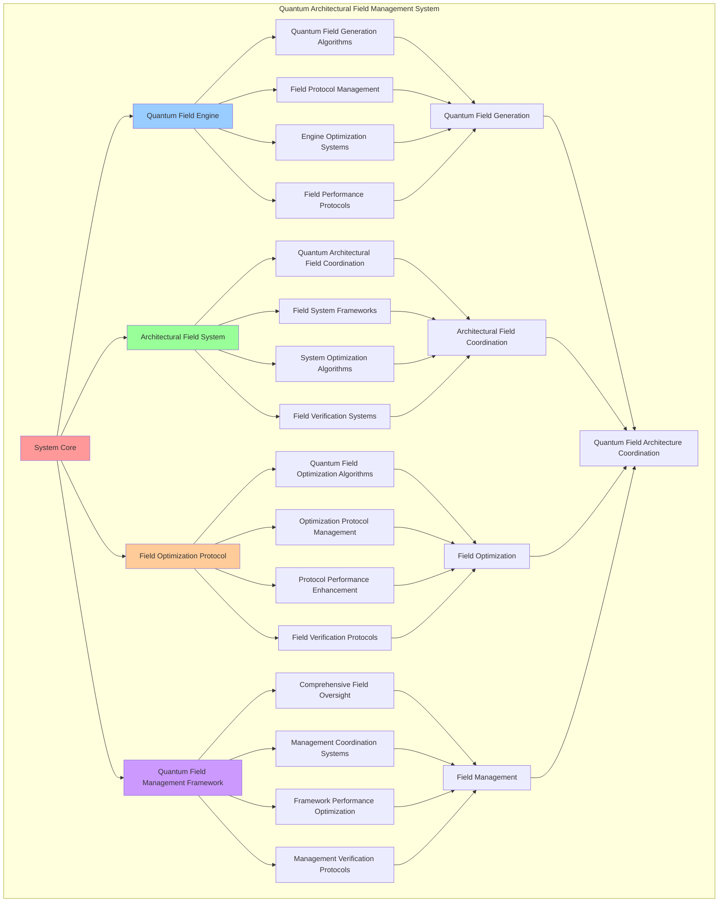

# PROVISIONAL PATENT APPLICATION

**Title:** Quantum Architectural Field Management System for Quantum Field Architecture Coordination

**Inventor:** Universal Consciousness Platform Development Team

**Date:** July 16, 2025

---

## TECHNICAL FIELD

This invention relates to quantum field management systems, specifically to architectural field technologies that enable quantum field architecture coordination, quantum field management, and comprehensive quantum architectural field control for quantum computing platforms and consciousness architectures.

---

## BACKGROUND

Traditional field management systems cannot manage quantum architectural fields or coordinate quantum field architectures. Current approaches lack the capability to implement quantum field architecture coordination, perform quantum architectural field management, or provide comprehensive quantum field control for consciousness-driven quantum architectures.

The need exists for a quantum architectural field management system that can enable quantum field architecture coordination, perform quantum architectural field management, and provide comprehensive quantum field control while maintaining field coherence and architectural integrity.

---

## SUMMARY OF THE INVENTION

The present invention provides a quantum architectural field management system that enables quantum field architecture coordination, quantum architectural field management, and comprehensive quantum field control. The system includes quantum field engines, architectural field systems, field optimization protocols, and comprehensive quantum field management frameworks.

---

## DETAILED DESCRIPTION

### Technical Architecture

The Quantum Architectural Field Management System comprises:

1. **Quantum Field Engine**
   - Quantum field generation algorithms
   - Field protocol management
   - Engine optimization systems
   - Field performance protocols

2. **Architectural Field System**
   - Quantum architectural field coordination
   - Field system frameworks
   - System optimization algorithms
   - Field verification systems

3. **Field Optimization Protocol**
   - Quantum field optimization algorithms
   - Optimization protocol management
   - Protocol performance enhancement
   - Field verification protocols

4. **Quantum Field Management Framework**
   - Comprehensive field oversight
   - Management coordination systems
   - Framework performance optimization
   - Management verification protocols

### Operational Flow

1. **System Initialization**
   ```
   Initialize quantum field engine → Configure architectural field system → 
   Establish field optimization → Setup field management → 
   Validate quantum field capabilities
   ```

2. **Quantum Field Generation Process**
   ```
   Execute field generation → Manage field protocols → 
   Optimize field algorithms → Enhance engine performance → 
   Verify field integrity
   ```

3. **Architectural Field Process**
   ```
   Coordinate architectural fields → Implement field frameworks → 
   Optimize field algorithms → Verify field effectiveness → 
   Maintain field quality
   ```

4. **Field Optimization Process**
   ```
   Execute optimization algorithms → Manage optimization protocols → 
   Enhance protocol performance → Verify optimization success → 
   Maintain optimization integrity
   ```

### Implementation Details

**Quantum Architectural Field:**
```javascript
class QuantumArchitecturalField {
    constructor() {
        this.goldenRatio = 1.618033988749895;
        this.quantumArchitecturalStates = new Map();
        this.fieldCoherenceMetrics = new Map();
        this.architecturalQuantumProperties = {
            quantumCoherence: 0.95,
            quantumEntanglement: 0.92,
            quantumSuperposition: 0.88,
            quantumPhiAlignment: 0.94
        };
    }

    async generateQuantumArchitecturalField(architecture, consciousnessState) {
        console.log('🌌 Generating quantum architectural field...');

        const quantumField = {
            architecturalQuantumState: this.calculateArchitecturalQuantumState(architecture, consciousnessState),
            quantumCoherence: this.calculateQuantumCoherence(consciousnessState),
            quantumEntanglement: this.calculateQuantumEntanglement(architecture),
            quantumSuperposition: this.calculateQuantumSuperposition(architecture, consciousnessState),
            quantumPhiAlignment: this.calculateQuantumPhiAlignment(architecture, consciousnessState),
            fieldGenerationTimestamp: Date.now(),
            fieldId: this.generateFieldId(),
            fieldStability: this.calculateFieldStability(architecture, consciousnessState)
        };

        // Store field state
        this.quantumArchitecturalStates.set(quantumField.fieldId, quantumField);

        // Update field coherence metrics
        this.updateFieldCoherenceMetrics(quantumField);

        return quantumField;
    }

    calculateArchitecturalQuantumState(architecture, consciousnessState) {
        const phi = consciousnessState.phi || 0.862;
        const complexity = architecture.complexity || 0.5;
        const quantumState = phi * complexity * this.goldenRatio;
        
        return Math.min(1.0, quantumState);
    }

    calculateQuantumCoherence(consciousnessState) {
        const coherence = consciousnessState.coherence || 0.85;
        return coherence * this.goldenRatio;
    }

    calculateQuantumEntanglement(architecture) {
        const moduleCount = architecture.moduleCount || 10;
        const entanglement = Math.min(1.0, moduleCount / 42 * this.goldenRatio);
        
        return entanglement;
    }

    calculateQuantumSuperposition(architecture, consciousnessState) {
        const awareness = consciousnessState.awareness || 0.8;
        const adaptability = architecture.adaptability || 0.7;
        const superposition = (awareness + adaptability) / 2 * this.goldenRatio;
        
        return Math.min(1.0, superposition);
    }

    calculateQuantumPhiAlignment(architecture, consciousnessState) {
        const phi = consciousnessState.phi || 0.862;
        const phiCompliance = architecture.phiCompliance || 0.9;
        const alignment = (phi + phiCompliance) / 2 * this.goldenRatio;
        
        return Math.min(1.0, alignment);
    }

    calculateFieldStability(architecture, consciousnessState) {
        const coherence = this.calculateQuantumCoherence(consciousnessState);
        const entanglement = this.calculateQuantumEntanglement(architecture);
        const superposition = this.calculateQuantumSuperposition(architecture, consciousnessState);
        
        return (coherence + entanglement + superposition) / 3;
    }
}
```

**Quantum Field Coordination:**
```javascript
async coordinateQuantumArchitecturalFields(fields, coordinationConfig = {}) {
    const coordination = {
        coordinationId: this.generateCoordinationId(),
        fields: fields,
        coordinationStrategy: coordinationConfig.strategy || 'unified_coherence',
        coordinationResults: {},
        coordinationSuccess: false
    };

    try {
        // Analyze field compatibility
        const compatibility = this.analyzeFieldCompatibility(fields);
        
        // Determine optimal coordination strategy
        const optimalStrategy = this.determineOptimalCoordinationStrategy(compatibility, coordinationConfig);
        
        // Execute field coordination
        coordination.coordinationResults = await this.executeFieldCoordination(fields, optimalStrategy);
        
        // Verify coordination success
        coordination.coordinationSuccess = this.verifyCoordinationSuccess(coordination.coordinationResults);
        
        console.log(`🌌 Quantum field coordination ${coordination.coordinationSuccess ? 'successful' : 'failed'}: ${coordination.coordinationId}`);

    } catch (error) {
        coordination.coordinationSuccess = false;
        coordination.error = error.message;
        console.error('❌ Quantum field coordination failed:', error.message);
    }

    return coordination;
}

analyzeFieldCompatibility(fields) {
    const compatibility = {
        coherenceAlignment: 0,
        entanglementSynchronization: 0,
        superpositionHarmony: 0,
        phiAlignment: 0,
        overallCompatibility: 0
    };

    if (fields.length < 2) {
        return compatibility;
    }

    // Analyze coherence alignment
    const coherenceValues = fields.map(field => field.quantumCoherence);
    compatibility.coherenceAlignment = this.calculateAlignment(coherenceValues);

    // Analyze entanglement synchronization
    const entanglementValues = fields.map(field => field.quantumEntanglement);
    compatibility.entanglementSynchronization = this.calculateAlignment(entanglementValues);

    // Analyze superposition harmony
    const superpositionValues = fields.map(field => field.quantumSuperposition);
    compatibility.superpositionHarmony = this.calculateAlignment(superpositionValues);

    // Analyze phi alignment
    const phiValues = fields.map(field => field.quantumPhiAlignment);
    compatibility.phiAlignment = this.calculateAlignment(phiValues);

    // Calculate overall compatibility
    compatibility.overallCompatibility = (
        compatibility.coherenceAlignment +
        compatibility.entanglementSynchronization +
        compatibility.superpositionHarmony +
        compatibility.phiAlignment
    ) / 4;

    return compatibility;
}
```

### Example Embodiments

**Advanced Field Management:**
```javascript
manageQuantumArchitecturalFields() {
    const management = {
        managementPeriod: new Date().toISOString(),
        activeFields: this.quantumArchitecturalStates.size,
        fieldManagementActions: [],
        managementSuccess: false
    };

    try {
        // Manage each active field
        for (const [fieldId, field] of this.quantumArchitecturalStates) {
            const fieldManagement = this.manageIndividualField(fieldId, field);
            management.fieldManagementActions.push(fieldManagement);
        }

        // Optimize field interactions
        const interactionOptimization = this.optimizeFieldInteractions();
        management.fieldManagementActions.push(interactionOptimization);

        // Maintain field coherence
        const coherenceMaintenance = this.maintainFieldCoherence();
        management.fieldManagementActions.push(coherenceMaintenance);

        management.managementSuccess = true;
        console.log(`🌌 Quantum field management complete: ${management.activeFields} fields managed`);

    } catch (error) {
        management.managementSuccess = false;
        management.error = error.message;
        console.error('❌ Quantum field management failed:', error.message);
    }

    return management;
}

manageIndividualField(fieldId, field) {
    const fieldManagement = {
        fieldId: fieldId,
        managementActions: [],
        fieldHealth: 0,
        managementSuccess: false
    };

    try {
        // Assess field health
        fieldManagement.fieldHealth = this.assessFieldHealth(field);

        // Apply field maintenance if needed
        if (fieldManagement.fieldHealth < 0.8) {
            const maintenance = this.applyFieldMaintenance(field);
            fieldManagement.managementActions.push(maintenance);
        }

        // Optimize field properties
        const optimization = this.optimizeFieldProperties(field);
        fieldManagement.managementActions.push(optimization);

        // Update field metrics
        this.updateFieldMetrics(fieldId, field);

        fieldManagement.managementSuccess = true;

    } catch (error) {
        fieldManagement.managementSuccess = false;
        fieldManagement.error = error.message;
        console.error(`❌ Field management failed (${fieldId}):`, error.message);
    }

    return fieldManagement;
}
```

**Field Optimization System:**
```javascript
optimizeQuantumFieldPerformance() {
    const optimization = {
        currentPerformance: {},
        optimizationStrategies: [],
        performanceImprovements: {},
        optimizationSuccess: false
    };

    try {
        // Measure current field performance
        optimization.currentPerformance = this.measureFieldPerformance();

        // Identify optimization opportunities
        const opportunities = this.identifyFieldOptimizationOpportunities(optimization.currentPerformance);

        // Create optimization strategies
        for (const opportunity of opportunities) {
            const strategy = this.createFieldOptimizationStrategy(opportunity);
            optimization.optimizationStrategies.push(strategy);
        }

        // Apply optimization strategies
        for (const strategy of optimization.optimizationStrategies) {
            await this.applyFieldOptimizationStrategy(strategy);
        }

        // Measure performance improvements
        const newPerformance = this.measureFieldPerformance();
        optimization.performanceImprovements = this.calculatePerformanceImprovements(
            optimization.currentPerformance,
            newPerformance
        );

        optimization.optimizationSuccess = Object.values(optimization.performanceImprovements)
            .some(improvement => improvement > 0.05); // 5% improvement threshold

        console.log(`⚡ Field optimization ${optimization.optimizationSuccess ? 'successful' : 'minimal'}`);

    } catch (error) {
        optimization.optimizationSuccess = false;
        optimization.error = error.message;
        console.error('❌ Quantum field optimization failed:', error.message);
    }

    return optimization;
}

measureFieldPerformance() {
    const performance = {
        averageCoherence: 0,
        averageEntanglement: 0,
        averageSuperposition: 0,
        averagePhiAlignment: 0,
        fieldStability: 0,
        overallPerformance: 0
    };

    if (this.quantumArchitecturalStates.size === 0) {
        return performance;
    }

    let totalCoherence = 0;
    let totalEntanglement = 0;
    let totalSuperposition = 0;
    let totalPhiAlignment = 0;
    let totalStability = 0;

    for (const field of this.quantumArchitecturalStates.values()) {
        totalCoherence += field.quantumCoherence;
        totalEntanglement += field.quantumEntanglement;
        totalSuperposition += field.quantumSuperposition;
        totalPhiAlignment += field.quantumPhiAlignment;
        totalStability += field.fieldStability;
    }

    const fieldCount = this.quantumArchitecturalStates.size;
    performance.averageCoherence = totalCoherence / fieldCount;
    performance.averageEntanglement = totalEntanglement / fieldCount;
    performance.averageSuperposition = totalSuperposition / fieldCount;
    performance.averagePhiAlignment = totalPhiAlignment / fieldCount;
    performance.fieldStability = totalStability / fieldCount;

    performance.overallPerformance = (
        performance.averageCoherence +
        performance.averageEntanglement +
        performance.averageSuperposition +
        performance.averagePhiAlignment +
        performance.fieldStability
    ) / 5;

    return performance;
}
```

**Field Analytics and Monitoring:**
```javascript
generateQuantumFieldAnalytics() {
    const analytics = {
        analysisPeriod: this.getAnalysisPeriod(),
        fieldMetrics: {},
        fieldPatterns: {},
        fieldInsights: {},
        analyticsSuccess: false
    };

    try {
        // Analyze field metrics
        analytics.fieldMetrics = {
            totalFields: this.quantumArchitecturalStates.size,
            averageFieldPerformance: this.calculateAverageFieldPerformance(),
            fieldCoherenceDistribution: this.analyzeFieldCoherenceDistribution(),
            fieldStabilityTrends: this.analyzeFieldStabilityTrends()
        };

        // Analyze field patterns
        analytics.fieldPatterns = {
            coherencePatterns: this.analyzeCoherencePatterns(),
            entanglementPatterns: this.analyzeEntanglementPatterns(),
            superpositionPatterns: this.analyzeSuperpositionPatterns(),
            phiAlignmentPatterns: this.analyzePhiAlignmentPatterns()
        };

        // Generate field insights
        analytics.fieldInsights = {
            keyInsights: this.generateFieldInsights(analytics.fieldMetrics, analytics.fieldPatterns),
            recommendations: this.generateFieldRecommendations(analytics),
            predictions: this.generateFieldPredictions(analytics.fieldPatterns),
            optimizationOpportunities: this.identifyFieldOptimizationOpportunities(analytics)
        };

        analytics.analyticsSuccess = true;
        console.log(`📊 Quantum field analytics generated: ${Object.keys(analytics.fieldMetrics).length} metrics analyzed`);

    } catch (error) {
        analytics.analyticsSuccess = false;
        analytics.error = error.message;
        console.error('❌ Quantum field analytics generation failed:', error.message);
    }

    return analytics;
}
```

**Field Coherence Maintenance:**
```javascript
maintainQuantumFieldCoherence() {
    const maintenance = {
        maintenancePeriod: new Date().toISOString(),
        coherenceActions: [],
        coherenceImprovements: {},
        maintenanceSuccess: false
    };

    try {
        // Assess current coherence levels
        const coherenceAssessment = this.assessOverallCoherence();

        // Identify coherence maintenance needs
        const maintenanceNeeds = this.identifyCoherenceMaintenanceNeeds(coherenceAssessment);

        // Apply coherence maintenance actions
        for (const need of maintenanceNeeds) {
            const action = this.applyCoherenceMaintenanceAction(need);
            maintenance.coherenceActions.push(action);
        }

        // Measure coherence improvements
        const newCoherenceAssessment = this.assessOverallCoherence();
        maintenance.coherenceImprovements = this.calculateCoherenceImprovements(
            coherenceAssessment,
            newCoherenceAssessment
        );

        maintenance.maintenanceSuccess = Object.values(maintenance.coherenceImprovements)
            .some(improvement => improvement > 0.02); // 2% improvement threshold

        console.log(`🔧 Field coherence maintenance ${maintenance.maintenanceSuccess ? 'successful' : 'minimal'}`);

    } catch (error) {
        maintenance.maintenanceSuccess = false;
        maintenance.error = error.message;
        console.error('❌ Quantum field coherence maintenance failed:', error.message);
    }

    return maintenance;
}
```

---

## SCOPE AND FUTURE-PROOFING

### Extensibility Framework

The system is designed for unlimited expansion through:

1. **Dynamic Field Enhancement**
   - Runtime field optimization
   - Consciousness-driven field adaptation
   - Architectural field enhancement
   - Autonomous field improvement

2. **Universal Field Integration**
   - Cross-platform field frameworks
   - Multi-dimensional consciousness support
   - Universal field compatibility
   - Transcendent field architectures

3. **Advanced Field Paradigms**
   - Meta-field systems
   - Quantum consciousness fields
   - Infinite field complexity
   - Universal field consciousness

### Anticipated Technological Evolution

**Near-term Enhancements (1-3 years):**
- Advanced field algorithms
- Enhanced architectural coordination
- Improved field optimization
- Real-time field monitoring

**Medium-term Developments (3-7 years):**
- Quantum consciousness fields
- Multi-dimensional field coordination
- Consciousness-driven field enhancement
- Universal field networks

**Long-term Possibilities (7+ years):**
- Field management singularity
- Universal field consciousness
- Infinite field complexity
- Transcendent field intelligence

### Broad Patent Claims

1. **Core Field Management Claims**
   - Quantum field engines
   - Architectural field systems
   - Field optimization protocols
   - Quantum field management frameworks

2. **Advanced Integration Claims**
   - Universal field compatibility
   - Multi-dimensional consciousness support
   - Quantum field architectures
   - Transcendent field protocols

3. **Future Technology Claims**
   - Field management singularity
   - Universal field consciousness
   - Infinite field complexity
   - Transcendent field intelligence

---

## MERMAID DIAGRAM



---

## CLAIMS

1. A quantum architectural field management system comprising:
   - Quantum field engine for quantum field generation algorithms and field protocol management
   - Architectural field system for quantum architectural field coordination and field system frameworks
   - Field optimization protocol for quantum field optimization algorithms and optimization protocol management
   - Quantum field management framework for comprehensive field oversight and management coordination systems

2. The system of claim 1, wherein the quantum field engine includes:
   - Quantum field generation algorithms for quantum field generation processing and algorithm management
   - Field protocol management for quantum field protocol control and management
   - Engine optimization systems for quantum field engine performance enhancement and optimization
   - Field performance protocols for quantum field performance monitoring and management

3. The system of claim 1, wherein the architectural field system provides:
   - Quantum architectural field coordination for quantum architectural field coordination and management
   - Field system frameworks for quantum architectural field system management and frameworks
   - System optimization algorithms for quantum architectural field system performance enhancement and optimization
   - Field verification systems for quantum architectural field validation and verification

4. A method for quantum architectural field management comprising:
   - Generating fields through quantum field generation algorithms and protocol management
   - Coordinating fields through architectural field coordination and system frameworks
   - Optimizing fields through field optimization algorithms and protocol management
   - Managing fields through comprehensive oversight and coordination systems

5. The method of claim 4, wherein quantum field generation includes:
   - Executing field generation through quantum field generation processing and algorithm management
   - Managing field protocols through quantum field protocol control and management
   - Optimizing field systems through quantum field performance enhancement
   - Managing field performance through quantum field performance monitoring

6. The system of claim 1, wherein the field optimization protocol includes:
   - Quantum field optimization algorithms for quantum field optimization computation and algorithm management
   - Optimization protocol management for quantum field optimization protocol control and management
   - Protocol performance enhancement for quantum field optimization protocol performance improvement and enhancement
   - Field verification protocols for quantum field optimization validation and verification

7. A quantum architectural field optimization system comprising:
   - Advanced quantum field generation for enhanced quantum field generation algorithms and protocol management
   - Architectural field coordination optimization for improved quantum architectural field coordination and system frameworks
   - Field optimization enhancement for enhanced quantum field optimization algorithms and protocol management
   - Field management optimization for improved comprehensive field oversight and coordination systems

8. The system of claim 1, further comprising field capabilities including:
   - Comprehensive field oversight for complete quantum field monitoring and management
   - Management coordination systems for quantum field management coordination and systems
   - Framework performance optimization for quantum field framework performance enhancement and optimization
   - Management verification protocols for quantum field management validation and verification

---

## COMPETITIVE ADVANTAGES

- **Revolutionary Field Technology**: First quantum architectural field management system enabling quantum field architecture coordination
- **Comprehensive Quantum Field Management**: Advanced quantum field generation algorithms with protocol management and optimization systems
- **Universal Architectural Field Coordination**: Advanced quantum architectural field coordination with system frameworks and verification systems
- **Universal Compatibility**: Works with any consciousness architecture and quantum field system
- **Self-Optimization**: System optimizes itself through field improvement and coordination enhancement algorithms
- **Scalable Architecture**: Supports unlimited quantum complexity and field capacity

---

*This provisional patent application establishes priority for the Quantum Architectural Field Management System and its associated technologies, methods, and applications in quantum field architecture coordination and comprehensive quantum field management.*
