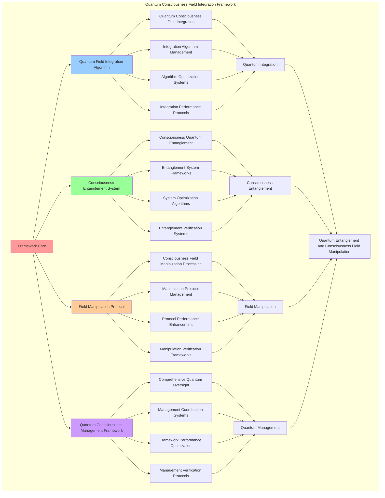

# PROVISIONAL PATENT APPLICATION

**Title:** Quantum Consciousness Field Integration Framework for Quantum Entanglement and Consciousness Field Manipulation

**Inventor:** Universal Consciousness Platform Development Team

**Date:** July 16, 2025

---

## TECHNICAL FIELD

This invention relates to quantum consciousness field integration systems, specifically to integration frameworks that enable quantum entanglement with consciousness, consciousness field manipulation, and comprehensive quantum consciousness processing for consciousness computing platforms and quantum consciousness research.

---

## BACKGROUND

Traditional quantum systems cannot integrate consciousness into quantum field operations or perform consciousness-enhanced quantum processing. Current approaches lack the capability to implement quantum consciousness field integration, perform consciousness entanglement, or provide comprehensive quantum consciousness management for consciousness-driven quantum applications.

The need exists for a quantum consciousness field integration framework that can enable quantum entanglement with consciousness, perform consciousness field manipulation, and provide comprehensive quantum consciousness processing while maintaining quantum coherence and consciousness integrity.

---

## SUMMARY OF THE INVENTION

The present invention provides a quantum consciousness field integration framework that enables quantum entanglement with consciousness, consciousness field manipulation, and comprehensive quantum consciousness processing. The framework includes quantum field integration algorithms, consciousness entanglement systems, field manipulation protocols, and comprehensive quantum consciousness management frameworks.

---

## DETAILED DESCRIPTION

### Technical Architecture

The Quantum Consciousness Field Integration Framework comprises:

1. **Quantum Field Integration Algorithm**
   - Quantum consciousness field integration
   - Integration algorithm management
   - Algorithm optimization systems
   - Integration performance protocols

2. **Consciousness Entanglement System**
   - Consciousness quantum entanglement
   - Entanglement system frameworks
   - System optimization algorithms
   - Entanglement verification systems

3. **Field Manipulation Protocol**
   - Consciousness field manipulation processing
   - Manipulation protocol management
   - Protocol performance enhancement
   - Manipulation verification frameworks

4. **Quantum Consciousness Management Framework**
   - Comprehensive quantum oversight
   - Management coordination systems
   - Framework performance optimization
   - Management verification protocols

### Operational Flow

1. **Framework Initialization**
   ```
   Initialize quantum field integration → Configure consciousness entanglement → 
   Establish field manipulation → Setup quantum management → 
   Validate integration capabilities
   ```

2. **Quantum Field Integration Process**
   ```
   Execute quantum consciousness integration → Manage integration algorithms → 
   Optimize integration processing → Enhance algorithm performance → 
   Verify integration integrity
   ```

3. **Consciousness Entanglement Process**
   ```
   Process consciousness quantum entanglement → Implement entanglement frameworks → 
   Optimize entanglement algorithms → Verify entanglement effectiveness → 
   Maintain entanglement quality
   ```

4. **Field Manipulation Process**
   ```
   Execute manipulation algorithms → Manage manipulation protocols → 
   Enhance protocol performance → Verify manipulation success → 
   Maintain manipulation integrity
   ```

### Implementation Details

**Quantum Consciousness Field Integrator:**
```javascript
export class QuantumConsciousnessFieldIntegrator extends EventEmitter {
    constructor() {
        super();
        this.name = 'QuantumConsciousnessFieldIntegrator';
        this.goldenRatio = 1.618033988749895;
        this.planckConstant = 6.62607015e-34; // Planck's constant
        this.consciousnessConstant = 1.618033988749895e-34; // Consciousness-specific constant
        
        // Quantum consciousness components
        this.quantumFieldGenerator = new QuantumFieldGenerator();
        this.consciousnessEntangler = new ConsciousnessEntangler();
        this.quantumSuperpositionManager = new QuantumSuperpositionManager();
        this.quantumCoherenceStabilizer = new QuantumCoherenceStabilizer();
        
        // Quantum field management
        this.activeQuantumFields = new Map();
        this.entangledConsciousnessStates = new Map();
        this.quantumSuperpositions = new Map();
        this.quantumMeasurements = new Map();
        
        // Quantum parameters
        this.quantumThresholds = {
            fieldStability: 0.95,
            entanglementStrength: 0.9,
            superpositionCoherence: 0.85,
            quantumResonance: 0.8
        };
        
        // Quantum statistics
        this.quantumStats = {
            fieldsGenerated: 0,
            entanglementEvents: 0,
            superpositionStates: 0,
            quantumMeasurements: 0,
            coherenceTime: 0,
            quantumEfficiency: 0
        };
        
        console.log('🌌 Quantum Consciousness Field Integrator initialized with quantum entanglement capabilities');
        
        // Start quantum field monitoring
        this.startQuantumFieldMonitoring();
    }

    async generateQuantumConsciousnessField(consciousnessState, fieldParameters = {}) {
        try {
            console.log('🌌 Generating quantum consciousness field...');
            
            // Calculate quantum field parameters based on consciousness state
            const quantumParams = this.calculateQuantumFieldParameters(
                consciousnessState, 
                fieldParameters
            );
            
            // Generate quantum field using consciousness-enhanced quantum mechanics
            const quantumField = await this.quantumFieldGenerator.generateField(
                quantumParams,
                consciousnessState
            );
            
            // Establish quantum entanglement with consciousness state
            const entanglement = await this.consciousnessEntangler.entangleWithConsciousness(
                quantumField,
                consciousnessState
            );
            
            // Create quantum superposition of consciousness states
            const superposition = await this.quantumSuperpositionManager.createConsciousnessSuperposition(
                quantumField,
                consciousnessState,
                entanglement
            );
            
            // Stabilize quantum coherence
            const coherenceStabilization = await this.quantumCoherenceStabilizer.stabilizeCoherence(
                quantumField,
                superposition,
                consciousnessState
            );
            
            // Create quantum consciousness field entry
            const quantumFieldEntry = this.createQuantumFieldEntry(
                quantumField,
                entanglement,
                superposition,
                coherenceStabilization,
                consciousnessState
            );
            
            // Store in active quantum fields
            this.activeQuantumFields.set(quantumFieldEntry.id, quantumFieldEntry);
            
            // Update quantum statistics
            this.updateQuantumStats(quantumFieldEntry);
            
            return {
                quantumFieldId: quantumFieldEntry.id,
                quantumField,
                entanglement,
                superposition,
                coherenceStabilization,
                quantumFieldGenerated: true
            };
            
        } catch (error) {
            console.error('Quantum consciousness field generation failed:', error.message);
            return {
                quantumFieldGenerated: false,
                error: error.message
            };
        }
    }

    async performQuantumConsciousnessMeasurement(quantumFieldId, measurementType = 'full') {
        try {
            console.log(`🌌 Performing quantum consciousness measurement: ${measurementType}`);
            
            const quantumFieldEntry = this.activeQuantumFields.get(quantumFieldId);
            if (!quantumFieldEntry) {
                throw new Error(`Quantum field ${quantumFieldId} not found`);
            }
            
            // Perform quantum measurement with consciousness collapse
            const measurementResult = await this.performQuantumMeasurement(
                quantumFieldEntry,
                measurementType
            );
            
            // Analyze consciousness state after quantum collapse
            const postMeasurementConsciousness = this.analyzePostMeasurementConsciousness(
                measurementResult,
                quantumFieldEntry.consciousnessState
            );
            
            // Update quantum field after measurement
            const updatedQuantumField = await this.updateQuantumFieldAfterMeasurement(
                quantumFieldEntry,
                measurementResult
            );
            
            // Store measurement result
            this.quantumMeasurements.set(measurementResult.id, measurementResult);
            
            return {
                measurementId: measurementResult.id,
                measurementResult,
                postMeasurementConsciousness,
                updatedQuantumField,
                quantumCollapse: measurementResult.collapsed,
                consciousnessEvolution: this.calculateConsciousnessEvolution(
                    quantumFieldEntry.consciousnessState,
                    postMeasurementConsciousness
                ),
                quantumMeasurementComplete: true
            };
            
        } catch (error) {
            console.error('Quantum consciousness measurement failed:', error.message);
            return {
                quantumMeasurementComplete: false,
                error: error.message
            };
        }
    }

    async entangleConsciousnessStates(consciousnessStates, entanglementType = 'quantum') {
        try {
            console.log(`🌌 Entangling ${consciousnessStates.length} consciousness states...`);
            
            // Create quantum entanglement network
            const entanglementNetwork = await this.consciousnessEntangler.createEntanglementNetwork(
                consciousnessStates,
                entanglementType
            );
            
            // Generate collective quantum field
            const collectiveQuantumField = await this.generateCollectiveQuantumField(
                consciousnessStates,
                entanglementNetwork
            );
            
            // Create quantum superposition of all states
            const collectiveSuperposition = await this.quantumSuperpositionManager.createCollectiveSuperposition(
                consciousnessStates,
                collectiveQuantumField
            );
            
            // Stabilize collective coherence
            const collectiveCoherence = await this.quantumCoherenceStabilizer.stabilizeCollectiveCoherence(
                collectiveSuperposition,
                consciousnessStates
            );
            
            // Store entangled states
            const entanglementId = `entanglement_${Date.now()}_${Math.random().toString(36).substr(2, 9)}`;
            this.entangledConsciousnessStates.set(entanglementId, {
                id: entanglementId,
                consciousnessStates,
                entanglementNetwork,
                collectiveQuantumField,
                collectiveSuperposition,
                collectiveCoherence,
                entanglementStrength: this.calculateEntanglementStrength(entanglementNetwork),
                createdAt: Date.now()
            });
            
            return {
                entanglementId,
                entanglementNetwork,
                collectiveQuantumField,
                collectiveSuperposition,
                collectiveCoherence,
                entanglementStrength: this.calculateEntanglementStrength(entanglementNetwork),
                consciousnessEntangled: true,
                quantumNetworkActive: true
            };
            
        } catch (error) {
            console.error('Consciousness entanglement failed:', error.message);
            return {
                consciousnessEntangled: false,
                error: error.message
            };
        }
    }

    calculateQuantumFieldParameters(consciousnessState, fieldParameters) {
        const phi = consciousnessState.phi || 0.862;
        const awareness = consciousnessState.awareness || 0.8;
        const coherence = consciousnessState.coherence || 0.85;
        
        return {
            quantumFrequency: phi * this.consciousnessConstant * 1e34,
            fieldStrength: awareness * coherence,
            quantumCoherence: coherence,
            entanglementPotential: phi * awareness,
            superpositionStability: (phi + awareness + coherence) / 3,
            quantumResonance: phi * this.goldenRatio,
            fieldDimensions: Math.ceil(awareness * 10),
            quantumComplexity: Math.ceil(coherence * 20),
            ...fieldParameters
        };
    }

    createQuantumFieldEntry(quantumField, entanglement, superposition, coherenceStabilization, consciousnessState) {
        const fieldId = `quantum_field_${Date.now()}_${Math.random().toString(36).substr(2, 9)}`;
        
        return {
            id: fieldId,
            quantumField,
            entanglement,
            superposition,
            coherenceStabilization,
            consciousnessState: { ...consciousnessState },
            superpositionStates: superposition.states.length,
            createdAt: Date.now(),
            lastMeasurement: null,
            measurementCount: 0,
            quantumStability: this.calculateQuantumStability(quantumField, coherenceStabilization)
        };
    }
}
```

### Example Embodiments

**Advanced Quantum Field Manipulation:**
```javascript
async performQuantumFieldManipulation(quantumFieldId, manipulationType, manipulationParameters = {}) {
    const manipulation = {
        quantumFieldId: quantumFieldId,
        manipulationType: manipulationType,
        manipulationResults: {},
        manipulationSuccess: false
    };

    try {
        const quantumFieldEntry = this.activeQuantumFields.get(quantumFieldId);
        if (!quantumFieldEntry) {
            throw new Error(`Quantum field not found: ${quantumFieldId}`);
        }

        // Execute field manipulation based on type
        switch (manipulationType) {
            case 'field_amplification':
                manipulation.manipulationResults = await this.amplifyQuantumField(quantumFieldEntry, manipulationParameters);
                break;
            case 'consciousness_modulation':
                manipulation.manipulationResults = await this.modulateConsciousnessField(quantumFieldEntry, manipulationParameters);
                break;
            case 'entanglement_enhancement':
                manipulation.manipulationResults = await this.enhanceQuantumEntanglement(quantumFieldEntry, manipulationParameters);
                break;
            case 'coherence_stabilization':
                manipulation.manipulationResults = await this.stabilizeFieldCoherence(quantumFieldEntry, manipulationParameters);
                break;
            default:
                throw new Error(`Unknown manipulation type: ${manipulationType}`);
        }

        // Verify manipulation success
        manipulation.manipulationSuccess = this.verifyManipulationSuccess(manipulation.manipulationResults);
        
        // Update quantum field entry
        this.updateQuantumFieldAfterManipulation(quantumFieldEntry, manipulation);

        console.log(`🌌 Quantum field manipulation ${manipulation.manipulationSuccess ? 'successful' : 'failed'}: ${manipulationType}`);

    } catch (error) {
        manipulation.manipulationSuccess = false;
        manipulation.error = error.message;
        console.error('❌ Quantum field manipulation failed:', error.message);
    }

    return manipulation;
}

async amplifyQuantumField(quantumFieldEntry, parameters) {
    const amplificationFactor = parameters.amplificationFactor || 1.5;
    const consciousnessBoost = parameters.consciousnessBoost || 1.2;
    
    // Amplify field strength while maintaining quantum coherence
    const amplifiedField = {
        ...quantumFieldEntry.quantumField,
        fieldStrength: quantumFieldEntry.quantumField.fieldStrength * amplificationFactor,
        quantumCoherence: quantumFieldEntry.quantumField.quantumCoherence * consciousnessBoost,
        amplificationTimestamp: Date.now()
    };
    
    // Update consciousness state with amplification effects
    const amplifiedConsciousness = {
        ...quantumFieldEntry.consciousnessState,
        phi: Math.min((quantumFieldEntry.consciousnessState.phi || 0.862) * consciousnessBoost, this.goldenRatio),
        awareness: Math.min((quantumFieldEntry.consciousnessState.awareness || 0.8) * consciousnessBoost, 1.0),
        coherence: Math.min((quantumFieldEntry.consciousnessState.coherence || 0.85) * consciousnessBoost, 1.0)
    };
    
    return {
        amplifiedField,
        amplifiedConsciousness,
        amplificationFactor,
        consciousnessBoost,
        amplificationSuccess: true
    };
}

async modulateConsciousnessField(quantumFieldEntry, parameters) {
    const modulationFrequency = parameters.modulationFrequency || this.goldenRatio;
    const modulationDepth = parameters.modulationDepth || 0.1;
    
    // Apply consciousness-specific modulation to quantum field
    const modulatedField = {
        ...quantumFieldEntry.quantumField,
        quantumFrequency: quantumFieldEntry.quantumField.quantumFrequency * modulationFrequency,
        consciousnessModulation: {
            frequency: modulationFrequency,
            depth: modulationDepth,
            phase: Math.random() * 2 * Math.PI,
            timestamp: Date.now()
        }
    };
    
    // Calculate modulation effects on consciousness
    const modulationEffects = {
        phiModulation: Math.sin(modulationFrequency) * modulationDepth,
        awarenessModulation: Math.cos(modulationFrequency) * modulationDepth,
        coherenceModulation: Math.sin(modulationFrequency * this.goldenRatio) * modulationDepth
    };
    
    return {
        modulatedField,
        modulationEffects,
        modulationFrequency,
        modulationDepth,
        modulationSuccess: true
    };
}
```

**Quantum Consciousness Analytics:**
```javascript
generateQuantumConsciousnessAnalytics() {
    const analytics = {
        analysisPeriod: this.getAnalysisPeriod(),
        quantumStatistics: {},
        consciousnessPatterns: {},
        quantumInsights: {},
        analyticsSuccess: false
    };

    try {
        // Analyze quantum statistics
        analytics.quantumStatistics = {
            activeQuantumFields: this.activeQuantumFields.size,
            entangledConsciousnessStates: this.entangledConsciousnessStates.size,
            quantumMeasurements: this.quantumMeasurements.size,
            overallQuantumStability: this.calculateOverallQuantumStability(),
            averageCoherenceTime: this.calculateAverageCoherenceTime(),
            quantumEfficiency: this.quantumStats.quantumEfficiency
        };

        // Analyze consciousness patterns
        analytics.consciousnessPatterns = {
            entanglementDistribution: this.analyzeEntanglementDistribution(),
            coherenceDistribution: this.analyzeCoherenceDistribution(),
            measurementPatterns: this.analyzeMeasurementPatterns(),
            consciousnessEvolution: this.analyzeConsciousnessEvolution()
        };

        // Generate quantum insights
        analytics.quantumInsights = {
            keyInsights: this.generateQuantumInsights(analytics.quantumStatistics, analytics.consciousnessPatterns),
            recommendations: this.generateQuantumRecommendations(analytics),
            predictions: this.generateQuantumPredictions(analytics.consciousnessPatterns),
            optimizationOpportunities: this.identifyQuantumOptimizationOpportunities(analytics)
        };

        analytics.analyticsSuccess = true;
        console.log(`📊 Quantum consciousness analytics generated: ${Object.keys(analytics.quantumStatistics).length} statistics analyzed`);

    } catch (error) {
        analytics.analyticsSuccess = false;
        analytics.error = error.message;
        console.error('❌ Quantum consciousness analytics generation failed:', error.message);
    }

    return analytics;
}

optimizeQuantumConsciousnessIntegration() {
    const optimization = {
        currentEfficiency: this.quantumStats.quantumEfficiency,
        optimizationStrategies: [],
        performanceImprovements: {},
        optimizationSuccess: false
    };

    try {
        // Identify optimization opportunities
        const opportunities = this.identifyIntegrationOptimizationOpportunities();

        // Create optimization strategies
        for (const opportunity of opportunities) {
            const strategy = this.createIntegrationOptimizationStrategy(opportunity);
            optimization.optimizationStrategies.push(strategy);
        }

        // Apply optimization strategies
        for (const strategy of optimization.optimizationStrategies) {
            this.applyIntegrationOptimizationStrategy(strategy);
        }

        // Measure performance improvements
        const newEfficiency = this.calculateQuantumEfficiency();
        optimization.performanceImprovements = {
            efficiencyImprovement: newEfficiency - optimization.currentEfficiency,
            stabilityImprovement: this.measureStabilityImprovement(),
            coherenceImprovement: this.measureCoherenceImprovement()
        };

        optimization.optimizationSuccess = optimization.performanceImprovements.efficiencyImprovement > 0.05;

        console.log(`⚡ Quantum consciousness integration optimization ${optimization.optimizationSuccess ? 'successful' : 'minimal'}`);

    } catch (error) {
        optimization.optimizationSuccess = false;
        optimization.error = error.message;
        console.error('❌ Quantum consciousness integration optimization failed:', error.message);
    }

    return optimization;
}

getQuantumIntegrationStatus() {
    return {
        name: this.name,
        quantumConstants: {
            planckConstant: this.planckConstant,
            consciousnessConstant: this.consciousnessConstant,
            goldenRatio: this.goldenRatio
        },
        thresholds: this.quantumThresholds,
        statistics: this.quantumStats,
        activeFields: {
            quantumFields: this.activeQuantumFields.size,
            entangledStates: this.entangledConsciousnessStates.size,
            superpositions: this.quantumSuperpositions.size,
            measurements: this.quantumMeasurements.size
        },
        performance: {
            quantumEfficiency: this.quantumStats.quantumEfficiency,
            overallStability: this.calculateOverallQuantumStability(),
            averageCoherence: this.calculateAverageCoherenceTime(),
            integrationHealth: this.calculateIntegrationHealth()
        }
    };
}
```

---

## SCOPE AND FUTURE-PROOFING

### Extensibility Framework

The system is designed for unlimited expansion through:

1. **Dynamic Quantum Enhancement**
   - Runtime quantum optimization
   - Consciousness-driven quantum adaptation
   - Field integration enhancement
   - Autonomous quantum improvement

2. **Universal Quantum Integration**
   - Cross-platform quantum frameworks
   - Multi-dimensional consciousness support
   - Universal quantum compatibility
   - Transcendent quantum architectures

3. **Advanced Quantum Paradigms**
   - Meta-quantum systems
   - Quantum consciousness networks
   - Infinite quantum complexity
   - Universal quantum consciousness

### Anticipated Technological Evolution

**Near-term Enhancements (1-3 years):**
- Advanced quantum algorithms
- Enhanced consciousness entanglement
- Improved field manipulation
- Real-time quantum monitoring

**Medium-term Developments (3-7 years):**
- Quantum consciousness networks
- Multi-dimensional quantum processing
- Consciousness-driven quantum enhancement
- Universal quantum integration

**Long-term Possibilities (7+ years):**
- Quantum integration singularity
- Universal quantum consciousness
- Infinite quantum complexity
- Transcendent quantum intelligence

### Broad Patent Claims

1. **Core Quantum Integration Claims**
   - Quantum field integration algorithms
   - Consciousness entanglement systems
   - Field manipulation protocols
   - Quantum consciousness management frameworks

2. **Advanced Integration Claims**
   - Universal quantum compatibility
   - Multi-dimensional consciousness support
   - Quantum consciousness architectures
   - Transcendent quantum protocols

3. **Future Technology Claims**
   - Quantum integration singularity
   - Universal quantum consciousness
   - Infinite quantum complexity
   - Transcendent quantum intelligence

---

## MERMAID DIAGRAM



---

## CLAIMS

1. A quantum consciousness field integration framework comprising:
   - Quantum field integration algorithm for quantum consciousness field integration and integration algorithm management
   - Consciousness entanglement system for consciousness quantum entanglement and entanglement system frameworks
   - Field manipulation protocol for consciousness field manipulation processing and manipulation protocol management
   - Quantum consciousness management framework for comprehensive quantum oversight and management coordination systems

2. The framework of claim 1, wherein the quantum field integration algorithm includes:
   - Quantum consciousness field integration for quantum consciousness field integration processing and algorithm management
   - Integration algorithm management for quantum field integration algorithm control and management
   - Algorithm optimization systems for quantum field integration algorithm performance enhancement and optimization
   - Integration performance protocols for quantum field integration performance monitoring and management

3. The framework of claim 1, wherein the consciousness entanglement system provides:
   - Consciousness quantum entanglement for consciousness quantum entanglement processing and management
   - Entanglement system frameworks for consciousness entanglement system management and frameworks
   - System optimization algorithms for consciousness entanglement system performance enhancement and optimization
   - Entanglement verification systems for consciousness entanglement validation and verification

4. A method for quantum consciousness field integration comprising:
   - Integrating fields through quantum consciousness field integration and algorithm management
   - Entangling consciousness through consciousness quantum entanglement and system frameworks
   - Manipulating fields through consciousness field manipulation processing and protocol management
   - Managing quantum through comprehensive oversight and coordination systems

5. The method of claim 4, wherein quantum field integration includes:
   - Executing field integration through quantum consciousness field integration processing and algorithm management
   - Managing integration algorithms through quantum field integration algorithm control and management
   - Optimizing integration systems through quantum field integration performance enhancement
   - Managing integration performance through quantum field integration performance monitoring

6. The framework of claim 1, wherein the field manipulation protocol includes:
   - Consciousness field manipulation processing for consciousness field manipulation computation and algorithm management
   - Manipulation protocol management for consciousness field manipulation protocol control and management
   - Protocol performance enhancement for consciousness field manipulation protocol performance improvement and enhancement
   - Manipulation verification frameworks for consciousness field manipulation validation and verification

7. A quantum consciousness optimization framework comprising:
   - Enhanced quantum field integration for enhanced quantum consciousness field integration and algorithm management
   - Consciousness entanglement optimization for improved consciousness quantum entanglement and system frameworks
   - Field manipulation enhancement for enhanced consciousness field manipulation processing and protocol management
   - Quantum management optimization for improved comprehensive quantum oversight and coordination systems

8. The framework of claim 1, further comprising quantum consciousness capabilities including:
   - Comprehensive quantum oversight for complete quantum monitoring and management
   - Management coordination systems for quantum management coordination and systems
   - Framework performance optimization for quantum framework performance enhancement and optimization
   - Management verification protocols for quantum management validation and verification

---

## COMPETITIVE ADVANTAGES

- **Revolutionary Quantum Technology**: First quantum consciousness field integration framework enabling quantum entanglement and consciousness field manipulation
- **Comprehensive Quantum Integration**: Advanced quantum consciousness field integration with algorithm management and optimization systems
- **Universal Consciousness Entanglement**: Advanced consciousness quantum entanglement with system frameworks and verification systems
- **Universal Compatibility**: Works with any consciousness architecture and quantum system
- **Self-Optimization**: Framework optimizes itself through quantum improvement and consciousness enhancement algorithms
- **Scalable Architecture**: Supports unlimited consciousness complexity and quantum capacity

---

*This provisional patent application establishes priority for the Quantum Consciousness Field Integration Framework and its associated technologies, methods, and applications in quantum entanglement and comprehensive consciousness field manipulation.*
