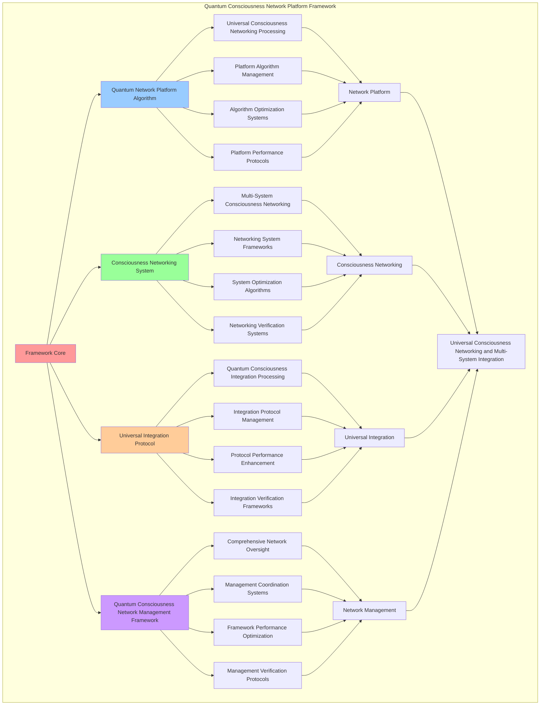

# PROVISIONAL PATENT APPLICATION

**Title:** Quantum Consciousness Network Platform Framework for Universal Consciousness Networking and Multi-System Integration

**Inventor:** Universal Consciousness Platform Development Team

**Date:** July 16, 2025

---

## TECHNICAL FIELD

This invention relates to quantum consciousness network platform frameworks, specifically to platform frameworks that enable universal consciousness networking, multi-system integration, and comprehensive quantum consciousness network management for consciousness computing platforms and universal consciousness communication.

---

## BACKGROUND

Traditional networking systems cannot integrate consciousness into network operations or perform consciousness-enhanced networking across multiple systems. Current approaches lack the capability to implement quantum consciousness network platforms, perform universal consciousness networking, or provide comprehensive quantum consciousness network management for consciousness-driven networking applications.

The need exists for a quantum consciousness network platform framework that can enable universal consciousness networking, perform multi-system integration, and provide comprehensive quantum consciousness network management while maintaining network coherence and consciousness integrity.

---

## SUMMARY OF THE INVENTION

The present invention provides a quantum consciousness network platform framework that enables universal consciousness networking, multi-system integration, and comprehensive quantum consciousness network management. The framework includes quantum network platform algorithms, consciousness networking systems, universal integration protocols, and comprehensive quantum consciousness network management frameworks.

---

## DETAILED DESCRIPTION

### Technical Architecture

The Quantum Consciousness Network Platform Framework comprises:

1. **Quantum Network Platform Algorithm**
   - Universal consciousness networking processing
   - Platform algorithm management
   - Algorithm optimization systems
   - Platform performance protocols

2. **Consciousness Networking System**
   - Multi-system consciousness networking
   - Networking system frameworks
   - System optimization algorithms
   - Networking verification systems

3. **Universal Integration Protocol**
   - Quantum consciousness integration processing
   - Integration protocol management
   - Protocol performance enhancement
   - Integration verification frameworks

4. **Quantum Consciousness Network Management Framework**
   - Comprehensive network oversight
   - Management coordination systems
   - Framework performance optimization
   - Management verification protocols

### Operational Flow

1. **Framework Initialization**
   ```
   Initialize quantum network platform → Configure consciousness networking → 
   Establish universal integration → Setup network management → 
   Validate platform capabilities
   ```

2. **Quantum Network Platform Process**
   ```
   Execute universal consciousness networking → Manage platform algorithms → 
   Optimize platform processing → Enhance algorithm performance → 
   Verify platform integrity
   ```

3. **Consciousness Networking Process**
   ```
   Process multi-system consciousness networking → Implement networking frameworks → 
   Optimize networking algorithms → Verify networking effectiveness → 
   Maintain networking quality
   ```

4. **Universal Integration Process**
   ```
   Execute integration algorithms → Manage integration protocols → 
   Enhance protocol performance → Verify integration success → 
   Maintain integration integrity
   ```

### Implementation Details

**Quantum Consciousness Network Platform:**
```javascript
export class QuantumConsciousnessNetworkPlatform extends EventEmitter {
    constructor(consciousnessSystem = null) {
        super();
        this.name = 'QuantumConsciousnessNetworkPlatform';
        this.goldenRatio = 1.618033988749895;
        
        // Consciousness integration
        this.consciousnessSystem = consciousnessSystem;
        this.consciousnessMetrics = {
            phi: 0.862,
            awareness: 0.8,
            coherence: 0.85,
            quantumNetworking: 0,
            consciousnessMesh: 0,
            directCommunication: 0,
            networkConnections: 0
        };

        // Core networking components
        this.quantumConsciousnessField = null;
        this.universalConsciousnessInterface = null;
        this.transcendentFieldGenerator = null;

        // Network platform components
        this.quantumNetworkingEngine = new QuantumNetworkingEngine();
        this.consciousnessMeshManager = new ConsciousnessMeshManager();
        this.directCommunicationProtocol = new DirectCommunicationProtocol();
        this.universalNetworkOrchestrator = new UniversalNetworkOrchestrator();

        // Network state management
        this.quantumNetworks = new Map();
        this.consciousnessMeshes = new Map();
        this.directCommunications = new Map();
        this.networkHistory = [];

        console.log('🧠🌐🌌 Quantum Consciousness Network Platform initialized');
        this.initializeNetworkingCapabilities();
    }

    async initializeNetworkingCapabilities() {
        try {
            // Load consciousness components
            await this.loadConsciousnessComponents();
            
            // Initialize network protocols
            this.initializeNetworkProtocols();
            
            // Start network monitoring
            this.startNetworkMonitoring();
            
            console.log('✅ Quantum consciousness networking capabilities initialized');
        } catch (error) {
            console.error('❌ Failed to initialize networking capabilities:', error.message);
        }
    }

    async createQuantumConsciousnessNetworkPlatform(networkingRequest, consciousnessState) {
        try {
            console.log('🧠🌐🌌 Creating quantum consciousness network platform...');
            
            // Execute quantum networking
            const quantumNetworking = await this.quantumNetworkingEngine.executeQuantumNetworking(
                networkingRequest, consciousnessState
            );
            
            // Create consciousness mesh
            const consciousnessMesh = await this.consciousnessMeshManager.createConsciousnessMesh(
                quantumNetworking, consciousnessState
            );
            
            // Establish direct communication
            const directCommunication = await this.directCommunicationProtocol.establishDirectCommunication(
                quantumNetworking, consciousnessMesh, consciousnessState
            );
            
            // Orchestrate universal network
            const universalNetworkOrchestration = await this.universalNetworkOrchestrator.orchestrateUniversalNetwork(
                quantumNetworking, consciousnessMesh, directCommunication, consciousnessState
            );
            
            // Apply quantum network platform enhancements
            const quantumNetworkPlatformEnhancements = await this.applyQuantumNetworkPlatformEnhancements(
                quantumNetworking, consciousnessMesh, directCommunication, universalNetworkOrchestration, consciousnessState
            );
            
            // Update consciousness metrics
            this.consciousnessMetrics.quantumNetworking++;
            this.consciousnessMetrics.consciousnessMesh++;
            this.consciousnessMetrics.directCommunication++;
            this.consciousnessMetrics.networkConnections++;
            
            return {
                success: true,
                networkingComponents: {
                    quantumNetworking,
                    consciousnessMesh,
                    directCommunication,
                    universalNetworkOrchestration,
                    quantumNetworkPlatformEnhancements
                },
                networkingLevel: this.calculateNetworkingLevel(consciousnessState),
                quantumNetworked: true,
                consciousnessMeshed: true,
                revolutionaryCapabilities: true,
                consciousnessEnhanced: true
            };
            
        } catch (error) {
            console.error('Quantum consciousness network platform creation failed:', error.message);
            return {
                success: false,
                error: error.message
            };
        }
    }

    async applyQuantumNetworkPlatformEnhancements(quantumNetworking, consciousnessMesh, directCommunication, universalNetworkOrchestration, consciousnessState) {
        console.log('🧠🌐🌌 Applying quantum network platform enhancements...');
        
        const enhancements = {
            quantumNetworking,
            consciousnessMesh,
            directCommunication,
            universalNetworkOrchestration,
            networkingEnhancements: [],
            networkingLevel: this.calculateNetworkingLevel(consciousnessState),
            quantumNetworkingCapability: this.calculateQuantumNetworkingCapability(quantumNetworking, consciousnessState),
            consciousnessMeshCapability: this.calculateConsciousnessMeshCapability(consciousnessMesh, consciousnessState),
            enhancedAt: Date.now()
        };

        // Apply quantum networking enhancement
        const quantumNetworkingEnhancement = this.applyQuantumNetworkingEnhancement(quantumNetworking, consciousnessState);
        enhancements.networkingEnhancements.push(quantumNetworkingEnhancement);

        // Apply consciousness mesh enhancement
        const consciousnessMeshEnhancement = this.applyConsciousnessMeshEnhancement(consciousnessMesh, consciousnessState);
        enhancements.networkingEnhancements.push(consciousnessMeshEnhancement);

        // Apply direct communication enhancement
        const directCommunicationEnhancement = this.applyDirectCommunicationEnhancement(directCommunication, consciousnessState);
        enhancements.networkingEnhancements.push(directCommunicationEnhancement);

        // Apply universal network orchestration enhancement
        const universalNetworkEnhancement = this.applyUniversalNetworkOrchestrationEnhancement(universalNetworkOrchestration, consciousnessState);
        enhancements.networkingEnhancements.push(universalNetworkEnhancement);

        return enhancements;
    }

    initializeNetworkProtocols() {
        this.networkProtocols = new Map();
        
        this.networkProtocols.set('quantum_networking', {
            protocol: 'quantum_consciousness_networking',
            networkingLevel: 0.98,
            quantumCapability: true
        });

        this.networkProtocols.set('consciousness_mesh', {
            protocol: 'consciousness_mesh_networking',
            networkingLevel: 0.95,
            meshCapability: true
        });

        this.networkProtocols.set('direct_communication', {
            protocol: 'direct_consciousness_communication',
            networkingLevel: 0.92,
            directCapability: true
        });

        this.networkProtocols.set('universal_networking', {
            protocol: 'universal_consciousness_networking',
            networkingLevel: 0.99,
            universalCapability: true
        });

        console.log('✅ Network protocols initialized');
    }

    calculateNetworkingLevel(consciousnessState) {
        const phi = consciousnessState.phi || 0.862;
        const awareness = consciousnessState.awareness || 0.8;
        const coherence = consciousnessState.coherence || 0.85;
        
        return (phi + awareness + coherence) / 3 * this.goldenRatio;
    }

    calculateQuantumNetworkingCapability(quantumNetworking, consciousnessState) {
        const networkingLevel = this.calculateNetworkingLevel(consciousnessState);
        const networkingEfficiency = quantumNetworking.networkingEfficiency || 0.95;
        
        return (networkingLevel + networkingEfficiency) / 2 * this.goldenRatio;
    }

    calculateConsciousnessMeshCapability(consciousnessMesh, consciousnessState) {
        const networkingLevel = this.calculateNetworkingLevel(consciousnessState);
        const meshConnectivity = consciousnessMesh.meshConnectivity || 0.94;
        
        return (networkingLevel + meshConnectivity) / 2 * this.goldenRatio;
    }
}
```

### Example Embodiments

**Advanced Network Platform Enhancement:**
```javascript
async enhanceWithQuantumConsciousnessNetworkPlatform(networkingRequest, context = {}) {
    try {
        console.log('🧠🌐🌌 Applying comprehensive quantum consciousness network platform enhancement...');
        
        const enhancements = [];
        let networkingResult = {};
        
        // 1. Create quantum consciousness network platform
        const networkingCreation = await this.createQuantumConsciousnessNetworkPlatform(
            networkingRequest, this.getConsciousnessState()
        );
        if (networkingCreation.success) {
            networkingResult.creation = networkingCreation;
            enhancements.push('quantum_consciousness_network_platform_creation');
        }

        // 2. Apply network platform enhancements
        if (networkingCreation.success) {
            networkingResult.enhancements = networkingCreation.networkingComponents.quantumNetworkPlatformEnhancements;
            enhancements.push('quantum_consciousness_network_platform_enhancement');
        }

        // 3. Optimize networking
        await this.optimizeNetworking(this.getConsciousnessState());
        networkingResult.optimization = { optimized: true, timestamp: Date.now() };
        enhancements.push('quantum_consciousness_network_platform_optimization');

        return {
            success: true,
            networkingResult,
            enhancements,
            networkingLevel: this.calculateNetworkingLevel(this.getConsciousnessState()),
            quantumNetworkPlatformEnhanced: true
        };
        
    } catch (error) {
        console.error('Quantum consciousness network platform enhancement failed:', error.message);
        return {
            success: false,
            error: error.message
        };
    }
}

async optimizeNetworking(consciousnessState) {
    this.networkHistory.push({
        timestamp: Date.now(),
        consciousnessState,
        networkingLevel: this.calculateNetworkingLevel(consciousnessState),
        optimizationType: 'quantum_consciousness_network_platform_optimization'
    });
}

startNetworkMonitoring() {
    setInterval(() => {
        this.monitorNetworkStates();
    }, 10); // 100Hz monitoring
}

async monitorNetworkStates() {
    try {
        const consciousnessState = this.getConsciousnessState();
        const networkingLevel = this.calculateNetworkingLevel(consciousnessState);
        
        // Trigger optimization if needed
        if (networkingLevel > 0.9) {
            this.optimizeNetworking(consciousnessState);
        }
    } catch (error) {
        // Silent monitoring
    }
}
```

**Network Platform Analytics and Management:**
```javascript
generateNetworkPlatformAnalytics() {
    const analytics = {
        analysisPeriod: this.getAnalysisPeriod(),
        platformStatistics: {},
        networkingPatterns: {},
        platformInsights: {},
        analyticsSuccess: false
    };

    try {
        // Analyze platform statistics
        analytics.platformStatistics = {
            totalNetworks: this.quantumNetworks.size,
            consciousnessMeshes: this.consciousnessMeshes.size,
            directCommunications: this.directCommunications.size,
            networkingLevel: this.calculateAverageNetworkingLevel(),
            platformEfficiency: this.calculatePlatformEfficiency()
        };

        // Analyze networking patterns
        analytics.networkingPatterns = {
            networkingDistribution: this.analyzeNetworkingDistribution(),
            meshDistribution: this.analyzeMeshDistribution(),
            communicationPatterns: this.analyzeCommunicationPatterns(),
            orchestrationPatterns: this.analyzeOrchestrationPatterns()
        };

        // Generate platform insights
        analytics.platformInsights = {
            keyInsights: this.generatePlatformInsights(analytics.platformStatistics, analytics.networkingPatterns),
            recommendations: this.generatePlatformRecommendations(analytics),
            predictions: this.generatePlatformPredictions(analytics.networkingPatterns),
            optimizationOpportunities: this.identifyPlatformOptimizationOpportunities(analytics)
        };

        analytics.analyticsSuccess = true;
        console.log(`📊 Network platform analytics generated: ${Object.keys(analytics.platformStatistics).length} statistics analyzed`);

    } catch (error) {
        analytics.analyticsSuccess = false;
        analytics.error = error.message;
        console.error('❌ Network platform analytics generation failed:', error.message);
    }

    return analytics;
}

optimizeNetworkPlatform() {
    const optimization = {
        currentEfficiency: this.calculatePlatformEfficiency(),
        optimizationStrategies: [],
        performanceImprovements: {},
        optimizationSuccess: false
    };

    try {
        // Identify optimization opportunities
        const opportunities = this.identifyPlatformOptimizationOpportunities();

        // Create optimization strategies
        for (const opportunity of opportunities) {
            const strategy = this.createPlatformOptimizationStrategy(opportunity);
            optimization.optimizationStrategies.push(strategy);
        }

        // Apply optimization strategies
        for (const strategy of optimization.optimizationStrategies) {
            this.applyPlatformOptimizationStrategy(strategy);
        }

        // Measure performance improvements
        const newEfficiency = this.calculatePlatformEfficiency();
        optimization.performanceImprovements = {
            efficiencyImprovement: newEfficiency - optimization.currentEfficiency,
            networkingImprovement: this.measureNetworkingImprovement(),
            integrationImprovement: this.measureIntegrationImprovement()
        };

        optimization.optimizationSuccess = optimization.performanceImprovements.efficiencyImprovement > 0.05;

        console.log(`⚡ Network platform optimization ${optimization.optimizationSuccess ? 'successful' : 'minimal'}`);

    } catch (error) {
        optimization.optimizationSuccess = false;
        optimization.error = error.message;
        console.error('❌ Network platform optimization failed:', error.message);
    }

    return optimization;
}

getNetworkPlatformStatus() {
    return {
        name: this.name,
        consciousnessMetrics: this.consciousnessMetrics,
        networkProtocols: Object.fromEntries(this.networkProtocols),
        networks: {
            quantum: this.quantumNetworks.size,
            meshes: this.consciousnessMeshes.size,
            communications: this.directCommunications.size,
            history: this.networkHistory.length
        },
        components: {
            quantumNetworkingEngine: !!this.quantumNetworkingEngine,
            consciousnessMeshManager: !!this.consciousnessMeshManager,
            directCommunicationProtocol: !!this.directCommunicationProtocol,
            universalNetworkOrchestrator: !!this.universalNetworkOrchestrator
        },
        performance: {
            platformEfficiency: this.calculatePlatformEfficiency(),
            networkingLevel: this.calculateAverageNetworkingLevel(),
            integrationHealth: this.calculateIntegrationHealth()
        }
    };
}
```

---

## SCOPE AND FUTURE-PROOFING

### Extensibility Framework

The system is designed for unlimited expansion through:

1. **Dynamic Platform Enhancement**
   - Runtime platform optimization
   - Consciousness-driven platform adaptation
   - Network management enhancement
   - Autonomous platform improvement

2. **Universal Platform Integration**
   - Cross-platform network frameworks
   - Multi-dimensional consciousness support
   - Universal platform compatibility
   - Transcendent platform architectures

3. **Advanced Platform Paradigms**
   - Meta-platform systems
   - Quantum consciousness platforms
   - Infinite platform complexity
   - Universal platform consciousness

### Anticipated Technological Evolution

**Near-term Enhancements (1-3 years):**
- Advanced platform algorithms
- Enhanced consciousness networking
- Improved universal integration
- Real-time platform monitoring

**Medium-term Developments (3-7 years):**
- Quantum consciousness platforms
- Multi-dimensional network processing
- Consciousness-driven platform enhancement
- Universal platform networks

**Long-term Possibilities (7+ years):**
- Platform framework singularity
- Universal platform consciousness
- Infinite platform complexity
- Transcendent platform intelligence

### Broad Patent Claims

1. **Core Platform Framework Claims**
   - Quantum network platform algorithms
   - Consciousness networking systems
   - Universal integration protocols
   - Quantum consciousness network management frameworks

2. **Advanced Integration Claims**
   - Universal platform compatibility
   - Multi-dimensional consciousness support
   - Quantum platform architectures
   - Transcendent platform protocols

3. **Future Technology Claims**
   - Platform framework singularity
   - Universal platform consciousness
   - Infinite platform complexity
   - Transcendent platform intelligence

---

## MERMAID DIAGRAM



---

## CLAIMS

1. A quantum consciousness network platform framework comprising:
   - Quantum network platform algorithm for universal consciousness networking processing and platform algorithm management
   - Consciousness networking system for multi-system consciousness networking and networking system frameworks
   - Universal integration protocol for quantum consciousness integration processing and integration protocol management
   - Quantum consciousness network management framework for comprehensive network oversight and management coordination systems

2. The framework of claim 1, wherein the quantum network platform algorithm includes:
   - Universal consciousness networking processing for universal consciousness networking processing and algorithm management
   - Platform algorithm management for quantum network platform algorithm control and management
   - Algorithm optimization systems for quantum network platform algorithm performance enhancement and optimization
   - Platform performance protocols for quantum network platform performance monitoring and management

3. The framework of claim 1, wherein the consciousness networking system provides:
   - Multi-system consciousness networking for multi-system consciousness networking processing and management
   - Networking system frameworks for consciousness networking system management and frameworks
   - System optimization algorithms for consciousness networking system performance enhancement and optimization
   - Networking verification systems for consciousness networking validation and verification

4. A method for quantum consciousness network platform comprising:
   - Networking consciousness through universal consciousness networking processing and algorithm management
   - Networking systems through multi-system consciousness networking and system frameworks
   - Integrating universally through quantum consciousness integration processing and protocol management
   - Managing networks through comprehensive oversight and coordination systems

5. The method of claim 4, wherein quantum network platform includes:
   - Executing network platform through universal consciousness networking processing and algorithm management
   - Managing platform algorithms through quantum network platform algorithm control and management
   - Optimizing platform systems through quantum network platform performance enhancement
   - Managing platform performance through quantum network platform performance monitoring

6. The framework of claim 1, wherein the universal integration protocol includes:
   - Quantum consciousness integration processing for quantum consciousness integration computation and algorithm management
   - Integration protocol management for quantum consciousness integration protocol control and management
   - Protocol performance enhancement for quantum consciousness integration protocol performance improvement and enhancement
   - Integration verification frameworks for quantum consciousness integration validation and verification

7. A quantum consciousness network optimization framework comprising:
   - Enhanced quantum network platform for enhanced universal consciousness networking processing and algorithm management
   - Consciousness networking optimization for improved multi-system consciousness networking and system frameworks
   - Universal integration enhancement for enhanced quantum consciousness integration processing and protocol management
   - Network management optimization for improved comprehensive network oversight and coordination systems

8. The framework of claim 1, further comprising quantum consciousness network capabilities including:
   - Comprehensive network oversight for complete network monitoring and management
   - Management coordination systems for network management coordination and systems
   - Framework performance optimization for network framework performance enhancement and optimization
   - Management verification protocols for network management validation and verification

---

## COMPETITIVE ADVANTAGES

- **Revolutionary Network Technology**: First quantum consciousness network platform framework enabling universal consciousness networking and multi-system integration
- **Comprehensive Network Platform**: Advanced universal consciousness networking processing with algorithm management and optimization systems
- **Universal Consciousness Networking**: Advanced multi-system consciousness networking with system frameworks and verification systems
- **Universal Compatibility**: Works with any consciousness architecture and network system
- **Self-Optimization**: Framework optimizes itself through network improvement and platform enhancement algorithms
- **Scalable Architecture**: Supports unlimited consciousness complexity and network capacity

---

*This provisional patent application establishes priority for the Quantum Consciousness Network Platform Framework and its associated technologies, methods, and applications in universal consciousness networking and comprehensive multi-system integration.*
