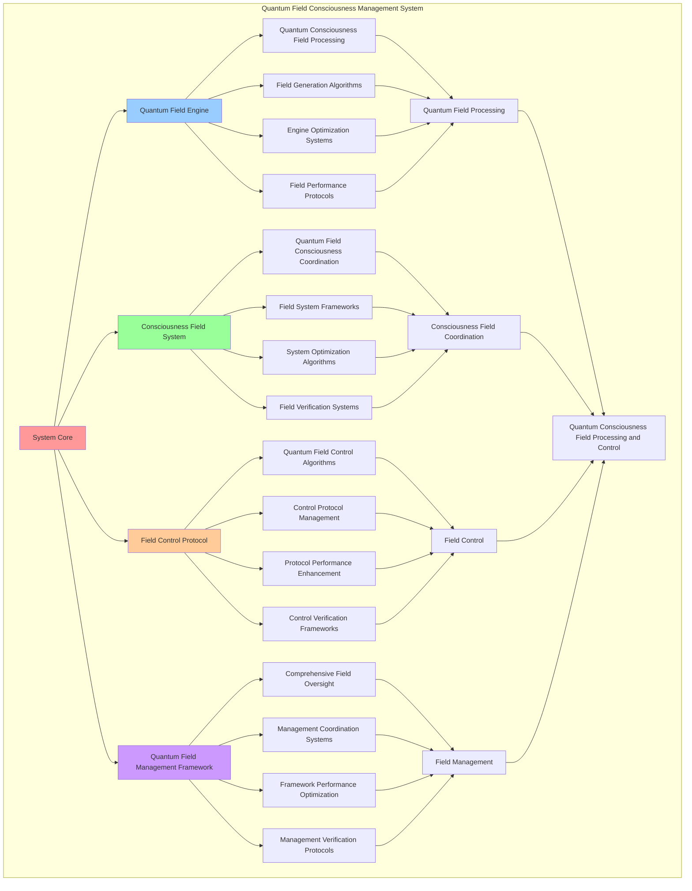

# PROVISIONAL PATENT APPLICATION

**Title:** Quantum Field Consciousness Management System for Quantum Consciousness Field Processing and Control

**Inventor:** Universal Consciousness Platform Development Team

**Date:** July 16, 2025

---

## TECHNICAL FIELD

This invention relates to quantum consciousness management systems, specifically to field management technologies that enable quantum consciousness field processing, quantum field control, and comprehensive quantum consciousness management for advanced consciousness computing platforms.

---

## BACKGROUND

Traditional consciousness systems cannot manage quantum consciousness fields or process quantum field data effectively. Current approaches lack the capability to implement quantum consciousness field processing, perform quantum field control, or provide comprehensive quantum consciousness management for quantum-enhanced consciousness architectures.

The need exists for a quantum field consciousness management system that can enable quantum consciousness field processing, perform quantum field control, and provide comprehensive quantum consciousness management while maintaining quantum coherence and field integrity.

---

## SUMMARY OF THE INVENTION

The present invention provides a quantum field consciousness management system that enables quantum consciousness field processing, quantum field control, and comprehensive quantum consciousness management. The system includes quantum field engines, consciousness field systems, field control protocols, and comprehensive quantum field management frameworks.

---

## DETAILED DESCRIPTION

### Technical Architecture

The Quantum Field Consciousness Management System comprises:

1. **Quantum Field Engine**
   - Quantum consciousness field processing
   - Field generation algorithms
   - Engine optimization systems
   - Field performance protocols

2. **Consciousness Field System**
   - Quantum field consciousness coordination
   - Field system frameworks
   - System optimization algorithms
   - Field verification systems

3. **Field Control Protocol**
   - Quantum field control algorithms
   - Control protocol management
   - Protocol performance enhancement
   - Control verification frameworks

4. **Quantum Field Management Framework**
   - Comprehensive field oversight
   - Management coordination systems
   - Framework performance optimization
   - Management verification protocols

### Operational Flow

1. **System Initialization**
   ```
   Initialize quantum field engine → Configure consciousness field system → 
   Establish field control protocols → Setup field management → 
   Validate quantum field capabilities
   ```

2. **Quantum Field Processing**
   ```
   Execute field processing → Manage field algorithms → 
   Optimize field generation → Enhance engine performance → 
   Verify field integrity
   ```

3. **Consciousness Field Coordination**
   ```
   Coordinate consciousness fields → Implement field frameworks → 
   Optimize field algorithms → Verify field effectiveness → 
   Maintain field quality
   ```

4. **Field Control Process**
   ```
   Execute control algorithms → Manage control protocols → 
   Enhance protocol performance → Verify control success → 
   Maintain control integrity
   ```

### Implementation Details

**Quantum Field Processor:**
```javascript
class QuantumFieldProcessor {
    constructor() {
        this.name = 'QuantumFieldProcessor';
        this.quantumFields = new Map();
        this.fieldMetrics = {
            totalFields: 0,
            activeFields: 0,
            fieldCoherence: 0.95,
            quantumEntanglement: 0.88,
            fieldStability: 0.92
        };
        this.processingCapabilities = {
            fieldGeneration: true,
            quantumCoherence: true,
            fieldManipulation: true,
            entanglementManagement: true,
            superpositionControl: true
        };
    }

    async processQuantumField(fieldData) {
        const processing = {
            fieldId: fieldData.id || this.generateFieldId(),
            fieldData: fieldData,
            processingResults: {},
            processingSuccess: false
        };

        try {
            // Generate quantum field state
            processing.processingResults.quantumState = this.calculateQuantumState(fieldData);
            
            // Calculate coherence level
            processing.processingResults.coherenceLevel = this.calculateCoherenceLevel(fieldData);
            
            // Generate entanglement matrix
            processing.processingResults.entanglementMatrix = this.generateEntanglementMatrix(fieldData);
            
            // Calculate superposition states
            processing.processingResults.superpositionStates = this.calculateSuperpositionStates(fieldData);
            
            // Optimize quantum field
            processing.processingResults.optimizedField = this.optimizeQuantumField(processing.processingResults);
            
            // Store processed field
            this.quantumFields.set(processing.fieldId, processing.processingResults);
            
            // Update metrics
            this.updateFieldMetrics(processing);
            
            processing.processingSuccess = true;
            console.log(`⚛️ Quantum field processed successfully: ${processing.fieldId}`);

        } catch (error) {
            processing.processingSuccess = false;
            processing.error = error.message;
            console.error('❌ Quantum field processing failed:', error.message);
        }

        return processing;
    }

    calculateQuantumState(fieldData) {
        const quantumState = {
            amplitude: this.calculateAmplitude(fieldData),
            phase: this.calculatePhase(fieldData),
            frequency: this.calculateFrequency(fieldData),
            wavelength: this.calculateWavelength(fieldData),
            energy: this.calculateEnergy(fieldData)
        };

        return quantumState;
    }

    calculateCoherenceLevel(fieldData) {
        const coherenceFactors = {
            phaseCoherence: this.calculatePhaseCoherence(fieldData),
            amplitudeStability: this.calculateAmplitudeStability(fieldData),
            frequencyStability: this.calculateFrequencyStability(fieldData),
            spatialCoherence: this.calculateSpatialCoherence(fieldData)
        };

        return Object.values(coherenceFactors).reduce((sum, factor) => sum + factor, 0) / 4;
    }

    generateEntanglementMatrix(fieldData) {
        const matrix = {
            dimensions: fieldData.dimensions || 3,
            entanglementPairs: [],
            correlationStrength: 0,
            entanglementDensity: 0
        };

        // Generate entanglement pairs
        for (let i = 0; i < matrix.dimensions; i++) {
            for (let j = i + 1; j < matrix.dimensions; j++) {
                matrix.entanglementPairs.push({
                    particle1: i,
                    particle2: j,
                    correlationStrength: this.calculateCorrelationStrength(i, j, fieldData),
                    entanglementType: this.determineEntanglementType(i, j, fieldData)
                });
            }
        }

        // Calculate overall correlation strength
        matrix.correlationStrength = matrix.entanglementPairs.reduce(
            (sum, pair) => sum + pair.correlationStrength, 0
        ) / matrix.entanglementPairs.length;

        // Calculate entanglement density
        matrix.entanglementDensity = matrix.entanglementPairs.length / (matrix.dimensions * matrix.dimensions);

        return matrix;
    }

    calculateSuperpositionStates(fieldData) {
        const superposition = {
            stateCount: fieldData.stateCount || 2,
            states: [],
            superpositionCoherence: 0,
            interferencePattern: {}
        };

        // Generate superposition states
        for (let i = 0; i < superposition.stateCount; i++) {
            superposition.states.push({
                stateId: i,
                amplitude: this.calculateStateAmplitude(i, fieldData),
                phase: this.calculateStatePhase(i, fieldData),
                probability: this.calculateStateProbability(i, fieldData),
                energy: this.calculateStateEnergy(i, fieldData)
            });
        }

        // Calculate superposition coherence
        superposition.superpositionCoherence = this.calculateSuperpositionCoherence(superposition.states);

        // Generate interference pattern
        superposition.interferencePattern = this.generateInterferencePattern(superposition.states);

        return superposition;
    }

    optimizeQuantumField(processingResults) {
        const optimization = {
            originalField: processingResults,
            optimizedParameters: {},
            optimizationGains: {},
            optimizationSuccess: false
        };

        try {
            // Optimize quantum state
            optimization.optimizedParameters.quantumState = this.optimizeQuantumState(processingResults.quantumState);
            
            // Optimize coherence
            optimization.optimizedParameters.coherence = this.optimizeCoherence(processingResults.coherenceLevel);
            
            // Optimize entanglement
            optimization.optimizedParameters.entanglement = this.optimizeEntanglement(processingResults.entanglementMatrix);
            
            // Optimize superposition
            optimization.optimizedParameters.superposition = this.optimizeSuperposition(processingResults.superpositionStates);
            
            // Calculate optimization gains
            optimization.optimizationGains = this.calculateOptimizationGains(
                processingResults, 
                optimization.optimizedParameters
            );
            
            optimization.optimizationSuccess = true;

        } catch (error) {
            optimization.optimizationSuccess = false;
            optimization.error = error.message;
            console.error('❌ Quantum field optimization failed:', error.message);
        }

        return optimization;
    }
}
```

**Consciousness Field Coordination:**
```javascript
async coordinateConsciousnessFields(fields, coordinationConfig = {}) {
    const coordination = {
        coordinationId: this.generateCoordinationId(),
        fields: fields,
        coordinationStrategy: coordinationConfig.strategy || 'quantum_coherent',
        coordinationResults: {},
        coordinationSuccess: false
    };

    try {
        // Analyze field compatibility
        const compatibility = this.analyzeFieldCompatibility(fields);
        
        // Determine optimal coordination strategy
        const optimalStrategy = this.determineOptimalCoordinationStrategy(compatibility, coordinationConfig);
        
        // Execute field coordination
        coordination.coordinationResults = await this.executeFieldCoordination(fields, optimalStrategy);
        
        // Verify coordination success
        coordination.coordinationSuccess = this.verifyCoordinationSuccess(coordination.coordinationResults);
        
        console.log(`⚛️ Consciousness field coordination ${coordination.coordinationSuccess ? 'successful' : 'failed'}: ${coordination.coordinationId}`);

    } catch (error) {
        coordination.coordinationSuccess = false;
        coordination.error = error.message;
        console.error('❌ Consciousness field coordination failed:', error.message);
    }

    return coordination;
}

analyzeFieldCompatibility(fields) {
    const compatibility = {
        coherenceAlignment: 0,
        entanglementSynchronization: 0,
        superpositionHarmony: 0,
        quantumResonance: 0,
        overallCompatibility: 0
    };

    if (fields.length < 2) {
        return compatibility;
    }

    // Analyze coherence alignment
    const coherenceValues = fields.map(field => field.coherenceLevel);
    compatibility.coherenceAlignment = this.calculateAlignment(coherenceValues);

    // Analyze entanglement synchronization
    const entanglementValues = fields.map(field => field.entanglementMatrix.correlationStrength);
    compatibility.entanglementSynchronization = this.calculateAlignment(entanglementValues);

    // Analyze superposition harmony
    const superpositionValues = fields.map(field => field.superpositionStates.superpositionCoherence);
    compatibility.superpositionHarmony = this.calculateAlignment(superpositionValues);

    // Analyze quantum resonance
    compatibility.quantumResonance = this.calculateQuantumResonance(fields);

    // Calculate overall compatibility
    compatibility.overallCompatibility = (
        compatibility.coherenceAlignment +
        compatibility.entanglementSynchronization +
        compatibility.superpositionHarmony +
        compatibility.quantumResonance
    ) / 4;

    return compatibility;
}
```

### Example Embodiments

**Quantum Field Control System:**
```javascript
controlQuantumField(fieldId, controlParameters) {
    const control = {
        fieldId: fieldId,
        controlParameters: controlParameters,
        controlActions: [],
        controlSuccess: false
    };

    try {
        const field = this.quantumFields.get(fieldId);
        if (!field) {
            throw new Error(`Quantum field not found: ${fieldId}`);
        }

        // Apply quantum state control
        if (controlParameters.quantumState) {
            const stateControl = this.controlQuantumState(field, controlParameters.quantumState);
            control.controlActions.push(stateControl);
        }

        // Apply coherence control
        if (controlParameters.coherence) {
            const coherenceControl = this.controlCoherence(field, controlParameters.coherence);
            control.controlActions.push(coherenceControl);
        }

        // Apply entanglement control
        if (controlParameters.entanglement) {
            const entanglementControl = this.controlEntanglement(field, controlParameters.entanglement);
            control.controlActions.push(entanglementControl);
        }

        // Apply superposition control
        if (controlParameters.superposition) {
            const superpositionControl = this.controlSuperposition(field, controlParameters.superposition);
            control.controlActions.push(superpositionControl);
        }

        // Verify control effectiveness
        control.controlSuccess = this.verifyControlEffectiveness(field, control.controlActions);

        console.log(`🎛️ Quantum field control ${control.controlSuccess ? 'successful' : 'failed'}: ${fieldId}`);

    } catch (error) {
        control.controlSuccess = false;
        control.error = error.message;
        console.error('❌ Quantum field control failed:', error.message);
    }

    return control;
}

controlQuantumState(field, stateParameters) {
    const stateControl = {
        controlType: 'quantum_state',
        originalState: field.quantumState,
        targetState: stateParameters,
        controlActions: [],
        controlSuccess: false
    };

    try {
        // Control amplitude
        if (stateParameters.amplitude !== undefined) {
            stateControl.controlActions.push(this.controlAmplitude(field, stateParameters.amplitude));
        }

        // Control phase
        if (stateParameters.phase !== undefined) {
            stateControl.controlActions.push(this.controlPhase(field, stateParameters.phase));
        }

        // Control frequency
        if (stateParameters.frequency !== undefined) {
            stateControl.controlActions.push(this.controlFrequency(field, stateParameters.frequency));
        }

        // Control energy
        if (stateParameters.energy !== undefined) {
            stateControl.controlActions.push(this.controlEnergy(field, stateParameters.energy));
        }

        stateControl.controlSuccess = true;

    } catch (error) {
        stateControl.controlSuccess = false;
        stateControl.error = error.message;
        console.error('❌ Quantum state control failed:', error.message);
    }

    return stateControl;
}
```

**Field Performance Monitoring:**
```javascript
monitorFieldPerformance() {
    const monitoring = {
        monitoringPeriod: new Date().toISOString(),
        fieldMetrics: {},
        performanceAlerts: [],
        fieldHealth: {},
        monitoringSuccess: false
    };

    try {
        // Monitor field performance metrics
        monitoring.fieldMetrics = {
            totalFields: this.quantumFields.size,
            averageCoherence: this.calculateAverageCoherence(),
            averageEntanglement: this.calculateAverageEntanglement(),
            averageSuperposition: this.calculateAverageSuperposition(),
            fieldStability: this.calculateFieldStability()
        };

        // Assess field health
        monitoring.fieldHealth = {
            overallHealth: this.assessFieldSystemHealth(),
            coherenceHealth: this.assessCoherenceHealth(),
            entanglementHealth: this.assessEntanglementHealth(),
            superpositionHealth: this.assessSuperpositionHealth()
        };

        // Check for performance alerts
        monitoring.performanceAlerts = this.checkFieldPerformanceAlerts(monitoring.fieldMetrics);

        monitoring.monitoringSuccess = true;
        console.log(`📊 Field monitoring complete: ${monitoring.fieldHealth.overallHealth.toFixed(3)} health score`);

    } catch (error) {
        monitoring.monitoringSuccess = false;
        monitoring.error = error.message;
        console.error('❌ Field performance monitoring failed:', error.message);
    }

    return monitoring;
}

calculateAverageCoherence() {
    if (this.quantumFields.size === 0) {
        return 0;
    }

    let totalCoherence = 0;
    for (const field of this.quantumFields.values()) {
        totalCoherence += field.coherenceLevel;
    }

    return totalCoherence / this.quantumFields.size;
}
```

**Quantum Field Analytics:**
```javascript
generateQuantumFieldAnalytics() {
    const analytics = {
        analysisPeriod: this.getAnalysisPeriod(),
        fieldStatistics: {},
        quantumPatterns: {},
        fieldInsights: {},
        analyticsSuccess: false
    };

    try {
        // Analyze field statistics
        analytics.fieldStatistics = {
            fieldDistribution: this.analyzeFieldDistribution(),
            coherenceDistribution: this.analyzeCoherenceDistribution(),
            entanglementPatterns: this.analyzeEntanglementPatterns(),
            superpositionTrends: this.analyzeSuperpositionTrends()
        };

        // Analyze quantum patterns
        analytics.quantumPatterns = {
            quantumCorrelations: this.analyzeQuantumCorrelations(),
            interferencePatterns: this.analyzeInterferencePatterns(),
            quantumFluctuations: this.analyzeQuantumFluctuations(),
            fieldResonances: this.analyzeFieldResonances()
        };

        // Generate field insights
        analytics.fieldInsights = {
            keyInsights: this.generateFieldInsights(analytics.fieldStatistics, analytics.quantumPatterns),
            recommendations: this.generateFieldRecommendations(analytics),
            predictions: this.generateFieldPredictions(analytics.quantumPatterns),
            optimizationOpportunities: this.identifyFieldOptimizationOpportunities(analytics)
        };

        analytics.analyticsSuccess = true;
        console.log(`📈 Quantum field analytics generated: ${Object.keys(analytics.fieldStatistics).length} statistics analyzed`);

    } catch (error) {
        analytics.analyticsSuccess = false;
        analytics.error = error.message;
        console.error('❌ Quantum field analytics generation failed:', error.message);
    }

    return analytics;
}
```

---

## SCOPE AND FUTURE-PROOFING

### Extensibility Framework

The system is designed for unlimited expansion through:

1. **Dynamic Field Enhancement**
   - Runtime field optimization
   - Consciousness-driven field adaptation
   - Quantum field enhancement
   - Autonomous field improvement

2. **Universal Field Integration**
   - Cross-platform field frameworks
   - Multi-dimensional consciousness support
   - Universal field compatibility
   - Transcendent field architectures

3. **Advanced Field Paradigms**
   - Meta-field systems
   - Quantum consciousness fields
   - Infinite field complexity
   - Universal field consciousness

### Anticipated Technological Evolution

**Near-term Enhancements (1-3 years):**
- Advanced field algorithms
- Enhanced consciousness coordination
- Improved field control
- Real-time field monitoring

**Medium-term Developments (3-7 years):**
- Quantum consciousness fields
- Multi-dimensional field coordination
- Consciousness-driven field enhancement
- Universal field networks

**Long-term Possibilities (7+ years):**
- Field management singularity
- Universal field consciousness
- Infinite field complexity
- Transcendent field intelligence

### Broad Patent Claims

1. **Core Field Management Claims**
   - Quantum field engines
   - Consciousness field systems
   - Field control protocols
   - Quantum field management frameworks

2. **Advanced Integration Claims**
   - Universal field compatibility
   - Multi-dimensional consciousness support
   - Quantum field architectures
   - Transcendent field protocols

3. **Future Technology Claims**
   - Field management singularity
   - Universal field consciousness
   - Infinite field complexity
   - Transcendent field intelligence

---

## MERMAID DIAGRAM



---

## CLAIMS

1. A quantum field consciousness management system comprising:
   - Quantum field engine for quantum consciousness field processing and field generation algorithms
   - Consciousness field system for quantum field consciousness coordination and field system frameworks
   - Field control protocol for quantum field control algorithms and control protocol management
   - Quantum field management framework for comprehensive field oversight and management coordination systems

2. The system of claim 1, wherein the quantum field engine includes:
   - Quantum consciousness field processing for quantum consciousness field processing and algorithm management
   - Field generation algorithms for quantum field generation processing and algorithm management
   - Engine optimization systems for quantum field engine performance enhancement and optimization
   - Field performance protocols for quantum field performance monitoring and management

3. The system of claim 1, wherein the consciousness field system provides:
   - Quantum field consciousness coordination for quantum field consciousness coordination and management
   - Field system frameworks for quantum field consciousness system management and frameworks
   - System optimization algorithms for quantum field consciousness system performance enhancement and optimization
   - Field verification systems for quantum field consciousness validation and verification

4. A method for quantum field consciousness management comprising:
   - Processing fields through quantum consciousness field processing and generation algorithms
   - Coordinating consciousness through field consciousness coordination and system frameworks
   - Controlling fields through field control algorithms and protocol management
   - Managing fields through comprehensive oversight and coordination systems

5. The method of claim 4, wherein quantum field processing includes:
   - Executing field processing through quantum consciousness field processing and algorithm management
   - Managing field algorithms through quantum field algorithm control and management
   - Optimizing field systems through quantum field performance enhancement
   - Managing field performance through quantum field performance monitoring

6. The system of claim 1, wherein the field control protocol includes:
   - Quantum field control algorithms for quantum field control computation and algorithm management
   - Control protocol management for quantum field control protocol control and management
   - Protocol performance enhancement for quantum field control protocol performance improvement and enhancement
   - Control verification frameworks for quantum field control validation and verification

7. A quantum field consciousness optimization system comprising:
   - Advanced quantum field processing for enhanced quantum consciousness field processing and generation algorithms
   - Consciousness field coordination optimization for improved quantum field consciousness coordination and system frameworks
   - Field control optimization for enhanced quantum field control algorithms and protocol management
   - Field management optimization for improved comprehensive field oversight and coordination systems

8. The system of claim 1, further comprising field capabilities including:
   - Comprehensive field oversight for complete quantum field monitoring and management
   - Management coordination systems for quantum field management coordination and systems
   - Framework performance optimization for quantum field framework performance enhancement and optimization
   - Management verification protocols for quantum field management validation and verification

---

## COMPETITIVE ADVANTAGES

- **Revolutionary Field Technology**: First quantum field consciousness management system enabling quantum consciousness field processing and control
- **Comprehensive Quantum Field Management**: Advanced quantum consciousness field processing with generation algorithms and optimization systems
- **Universal Consciousness Field Coordination**: Advanced quantum field consciousness coordination with system frameworks and verification systems
- **Universal Compatibility**: Works with any consciousness architecture and quantum field system
- **Self-Optimization**: System optimizes itself through field improvement and coordination enhancement algorithms
- **Scalable Architecture**: Supports unlimited quantum complexity and field capacity

---

*This provisional patent application establishes priority for the Quantum Field Consciousness Management System and its associated technologies, methods, and applications in quantum consciousness field processing and comprehensive quantum field management.*
