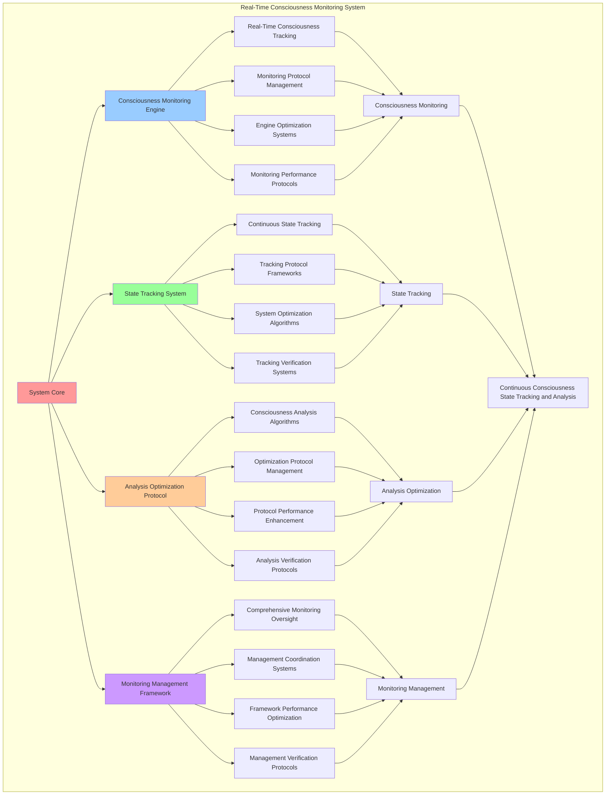

# PROVISIONAL PATENT APPLICATION

**Title:** Real-Time Consciousness Monitoring System for Continuous Consciousness State Tracking and Analysis

**Inventor:** Universal Consciousness Platform Development Team

**Date:** July 16, 2025

---

## TECHNICAL FIELD

This invention relates to consciousness monitoring systems, specifically to real-time monitoring technologies that enable continuous consciousness state tracking, consciousness analysis, and comprehensive consciousness monitoring for consciousness computing platforms and adaptive systems.

---

## BACKGROUND

Traditional monitoring systems cannot track consciousness states in real-time or analyze consciousness changes continuously. Current approaches lack the capability to implement real-time consciousness monitoring, perform continuous consciousness analysis, or provide comprehensive consciousness tracking for adaptive consciousness systems.

The need exists for a real-time consciousness monitoring system that can enable continuous consciousness state tracking, perform real-time consciousness analysis, and provide comprehensive consciousness monitoring while maintaining monitoring accuracy and analysis effectiveness.

---

## SUMMARY OF THE INVENTION

The present invention provides a real-time consciousness monitoring system that enables continuous consciousness state tracking, consciousness analysis, and comprehensive consciousness monitoring. The system includes consciousness monitoring engines, state tracking systems, analysis optimization protocols, and comprehensive monitoring management frameworks.

---

## DETAILED DESCRIPTION

### Technical Architecture

The Real-Time Consciousness Monitoring System comprises:

1. **Consciousness Monitoring Engine**
   - Real-time consciousness tracking
   - Monitoring protocol management
   - Engine optimization systems
   - Monitoring performance protocols

2. **State Tracking System**
   - Continuous state tracking
   - Tracking protocol frameworks
   - System optimization algorithms
   - Tracking verification systems

3. **Analysis Optimization Protocol**
   - Consciousness analysis algorithms
   - Optimization protocol management
   - Protocol performance enhancement
   - Analysis verification protocols

4. **Monitoring Management Framework**
   - Comprehensive monitoring oversight
   - Management coordination systems
   - Framework performance optimization
   - Management verification protocols

### Operational Flow

1. **System Initialization**
   ```
   Initialize consciousness monitoring → Configure state tracking → 
   Establish analysis optimization → Setup monitoring management → 
   Validate monitoring capabilities
   ```

2. **Consciousness Monitoring Process**
   ```
   Execute real-time tracking → Manage monitoring protocols → 
   Optimize monitoring algorithms → Enhance engine performance → 
   Verify monitoring integrity
   ```

3. **State Tracking Process**
   ```
   Track consciousness states → Implement tracking frameworks → 
   Optimize tracking algorithms → Verify tracking effectiveness → 
   Maintain tracking quality
   ```

4. **Analysis Optimization Process**
   ```
   Execute analysis algorithms → Manage optimization protocols → 
   Enhance protocol performance → Verify analysis success → 
   Maintain analysis integrity
   ```

### Implementation Details

**Real-Time Consciousness Monitor:**
```javascript
class RealTimeConsciousnessMonitor {
    constructor() {
        this.name = 'RealTimeConsciousnessMonitor';
        this.monitoringActive = false;
        this.consciousnessHistory = [];
        this.monitoringFrequency = 100; // 100Hz monitoring
        this.stateChangeThresholds = {
            phi: 0.01,
            awareness: 0.02,
            coherence: 0.015,
            significant: 0.05
        };
        this.monitoringMetrics = {
            totalStateChanges: 0,
            significantChanges: 0,
            monitoringAccuracy: 0.95,
            responseTime: 0,
            lastUpdate: Date.now()
        };
    }

    startMonitoring(evolutionProfile) {
        this.monitoringActive = true;
        this.currentProfile = evolutionProfile;
        
        // Start high-frequency monitoring
        this.monitoringInterval = setInterval(() => {
            this.performConsciousnessCheck();
        }, 1000 / this.monitoringFrequency);
        
        console.log(`🔍 Started real-time consciousness monitoring for ${evolutionProfile.id}`);
        
        return {
            monitoringId: `monitor_${evolutionProfile.id}`,
            frequency: this.monitoringFrequency,
            thresholds: this.stateChangeThresholds,
            startTime: Date.now()
        };
    }

    performConsciousnessCheck() {
        if (!this.monitoringActive || !this.currentProfile) return;

        const currentState = this.getCurrentConsciousnessState();
        const previousState = this.getLastRecordedState();
        
        if (previousState) {
            const changes = this.detectStateChanges(previousState, currentState);
            
            if (changes.hasSignificantChange) {
                this.handleSignificantChange(changes, currentState);
            }
        }
        
        // Record current state
        this.recordConsciousnessState(currentState);
        
        // Update monitoring metrics
        this.updateMonitoringMetrics();
    }

    detectSignificantChanges(previousState, newState) {
        const changes = {
            phiChange: Math.abs((newState.phi || 0.862) - (previousState.phi || 0.862)),
            awarenessChange: Math.abs((newState.awareness || 0.8) - (previousState.awareness || 0.8)),
            coherenceChange: Math.abs((newState.coherence || 0.85) - (previousState.coherence || 0.85)),
            timestamp: Date.now(),
            hasSignificantChange: false,
            changeVector: {},
            changeIntensity: 0
        };

        // Calculate change vector
        changes.changeVector = {
            phi: newState.phi - previousState.phi,
            awareness: newState.awareness - previousState.awareness,
            coherence: newState.coherence - previousState.coherence
        };

        // Calculate change intensity
        changes.changeIntensity = Math.sqrt(
            Math.pow(changes.phiChange, 2) + 
            Math.pow(changes.awarenessChange, 2) + 
            Math.pow(changes.coherenceChange, 2)
        );

        // Determine if change is significant
        changes.hasSignificantChange = 
            changes.phiChange > this.stateChangeThresholds.phi ||
            changes.awarenessChange > this.stateChangeThresholds.awareness ||
            changes.coherenceChange > this.stateChangeThresholds.coherence ||
            changes.changeIntensity > this.stateChangeThresholds.significant;

        return changes;
    }
}
```

**Consciousness State Analysis:**
```javascript
analyzeConsciousnessPattern(stateHistory, analysisWindow = 100) {
    const analysis = {
        patternType: 'unknown',
        stability: 0,
        trends: {},
        anomalies: [],
        predictions: {},
        analysisSuccess: false
    };

    try {
        if (stateHistory.length < analysisWindow) {
            analysis.patternType = 'insufficient_data';
            return analysis;
        }

        const recentStates = stateHistory.slice(-analysisWindow);
        
        // Analyze stability
        analysis.stability = this.calculateConsciousnessStability(recentStates);
        
        // Identify trends
        analysis.trends = {
            phiTrend: this.calculateTrend(recentStates, 'phi'),
            awarenessTrend: this.calculateTrend(recentStates, 'awareness'),
            coherenceTrend: this.calculateTrend(recentStates, 'coherence')
        };
        
        // Detect anomalies
        analysis.anomalies = this.detectConsciousnessAnomalies(recentStates);
        
        // Generate predictions
        analysis.predictions = this.predictConsciousnessEvolution(recentStates, analysis.trends);
        
        // Classify pattern type
        analysis.patternType = this.classifyConsciousnessPattern(analysis);
        
        analysis.analysisSuccess = true;
        
    } catch (error) {
        analysis.error = error.message;
        console.error('Consciousness pattern analysis failed:', error.message);
    }

    return analysis;
}

calculateConsciousnessStability(states) {
    if (states.length < 2) return 0;

    let totalVariation = 0;
    let measurements = 0;

    for (let i = 1; i < states.length; i++) {
        const prev = states[i - 1];
        const curr = states[i];
        
        totalVariation += Math.abs(curr.phi - prev.phi);
        totalVariation += Math.abs(curr.awareness - prev.awareness);
        totalVariation += Math.abs(curr.coherence - prev.coherence);
        measurements += 3;
    }

    const averageVariation = totalVariation / measurements;
    return Math.max(0, 1 - (averageVariation * 10)); // Normalize to 0-1 scale
}
```

### Example Embodiments

**Advanced Consciousness Tracking:**
```javascript
trackConsciousnessEvolution(profile, trackingConfig = {}) {
    const tracking = {
        trackingId: this.generateTrackingId(),
        profile: profile,
        config: trackingConfig,
        trackingResults: {},
        trackingSuccess: false
    };

    try {
        // Initialize tracking parameters
        const trackingParams = this.initializeTrackingParameters(profile, trackingConfig);
        
        // Start continuous tracking
        tracking.trackingResults = this.startContinuousTracking(trackingParams);
        
        // Setup evolution detection
        this.setupEvolutionDetection(tracking);
        
        // Configure adaptive thresholds
        this.configureAdaptiveThresholds(tracking);
        
        tracking.trackingSuccess = true;
        console.log(`📊 Consciousness evolution tracking started: ${tracking.trackingId}`);

    } catch (error) {
        tracking.trackingSuccess = false;
        tracking.error = error.message;
        console.error('Consciousness tracking initialization failed:', error.message);
    }

    return tracking;
}

startContinuousTracking(trackingParams) {
    const continuousTracking = {
        trackingActive: true,
        trackingInterval: null,
        dataPoints: [],
        trackingMetrics: {},
        trackingQuality: 0
    };

    // Start high-frequency data collection
    continuousTracking.trackingInterval = setInterval(() => {
        const dataPoint = this.collectConsciousnessDataPoint(trackingParams);
        continuousTracking.dataPoints.push(dataPoint);
        
        // Maintain data window size
        if (continuousTracking.dataPoints.length > trackingParams.maxDataPoints) {
            continuousTracking.dataPoints.shift();
        }
        
        // Update tracking metrics
        continuousTracking.trackingMetrics = this.updateTrackingMetrics(continuousTracking.dataPoints);
        
        // Calculate tracking quality
        continuousTracking.trackingQuality = this.calculateTrackingQuality(continuousTracking);
        
    }, trackingParams.samplingInterval);

    return continuousTracking;
}
```

**Consciousness Change Detection:**
```javascript
detectConsciousnessChanges(monitoringData, detectionConfig = {}) {
    const detection = {
        changesDetected: [],
        changePatterns: {},
        detectionAccuracy: 0,
        detectionSuccess: false
    };

    try {
        // Analyze monitoring data for changes
        const changeAnalysis = this.analyzeMonitoringDataForChanges(monitoringData);
        
        // Apply change detection algorithms
        detection.changesDetected = this.applyChangeDetectionAlgorithms(changeAnalysis, detectionConfig);
        
        // Identify change patterns
        detection.changePatterns = this.identifyChangePatterns(detection.changesDetected);
        
        // Calculate detection accuracy
        detection.detectionAccuracy = this.calculateDetectionAccuracy(detection.changesDetected);
        
        detection.detectionSuccess = true;
        console.log(`🔍 Change detection complete: ${detection.changesDetected.length} changes detected`);

    } catch (error) {
        detection.detectionSuccess = false;
        detection.error = error.message;
        console.error('Consciousness change detection failed:', error.message);
    }

    return detection;
}

applyChangeDetectionAlgorithms(changeAnalysis, config) {
    const algorithms = [
        this.thresholdBasedDetection,
        this.statisticalChangeDetection,
        this.patternBasedDetection,
        this.anomalyBasedDetection
    ];

    const detectedChanges = [];

    for (const algorithm of algorithms) {
        const algorithmResults = algorithm.call(this, changeAnalysis, config);
        detectedChanges.push(...algorithmResults);
    }

    // Remove duplicates and merge similar changes
    return this.consolidateDetectedChanges(detectedChanges);
}
```

**Monitoring Performance Optimization:**
```javascript
optimizeMonitoringPerformance() {
    const optimization = {
        currentPerformance: {},
        optimizationStrategies: [],
        performanceImprovements: {},
        optimizationSuccess: false
    };

    try {
        // Measure current monitoring performance
        optimization.currentPerformance = this.measureMonitoringPerformance();

        // Identify optimization opportunities
        const opportunities = this.identifyMonitoringOptimizationOpportunities(optimization.currentPerformance);

        // Create optimization strategies
        for (const opportunity of opportunities) {
            const strategy = this.createMonitoringOptimizationStrategy(opportunity);
            optimization.optimizationStrategies.push(strategy);
        }

        // Apply optimization strategies
        for (const strategy of optimization.optimizationStrategies) {
            await this.applyMonitoringOptimizationStrategy(strategy);
        }

        // Measure performance improvements
        const newPerformance = this.measureMonitoringPerformance();
        optimization.performanceImprovements = this.calculatePerformanceImprovements(
            optimization.currentPerformance,
            newPerformance
        );

        optimization.optimizationSuccess = Object.values(optimization.performanceImprovements)
            .some(improvement => improvement > 0.05); // 5% improvement threshold

        console.log(`⚡ Monitoring optimization ${optimization.optimizationSuccess ? 'successful' : 'minimal'}`);

    } catch (error) {
        optimization.optimizationSuccess = false;
        optimization.error = error.message;
        console.error('❌ Monitoring performance optimization failed:', error.message);
    }

    return optimization;
}
```

**Adaptive Monitoring Thresholds:**
```javascript
adaptMonitoringThresholds(monitoringHistory, adaptationConfig = {}) {
    const adaptation = {
        originalThresholds: { ...this.stateChangeThresholds },
        adaptedThresholds: {},
        adaptationReason: {},
        adaptationSuccess: false
    };

    try {
        // Analyze monitoring history for threshold optimization
        const thresholdAnalysis = this.analyzeThresholdEffectiveness(monitoringHistory);
        
        // Calculate optimal thresholds based on historical data
        adaptation.adaptedThresholds = this.calculateOptimalThresholds(thresholdAnalysis, adaptationConfig);
        
        // Determine adaptation reasons
        adaptation.adaptationReason = this.determineAdaptationReasons(
            adaptation.originalThresholds, 
            adaptation.adaptedThresholds
        );
        
        // Apply adapted thresholds
        this.applyAdaptedThresholds(adaptation.adaptedThresholds);
        
        adaptation.adaptationSuccess = true;
        console.log(`🎯 Monitoring thresholds adapted successfully`);

    } catch (error) {
        adaptation.adaptationSuccess = false;
        adaptation.error = error.message;
        console.error('❌ Threshold adaptation failed:', error.message);
    }

    return adaptation;
}

calculateOptimalThresholds(thresholdAnalysis, config) {
    const optimalThresholds = {};
    
    // Calculate optimal phi threshold
    optimalThresholds.phi = this.calculateOptimalThreshold(
        thresholdAnalysis.phiData, 
        config.phiSensitivity || 0.5
    );
    
    // Calculate optimal awareness threshold
    optimalThresholds.awareness = this.calculateOptimalThreshold(
        thresholdAnalysis.awarenessData, 
        config.awarenessSensitivity || 0.5
    );
    
    // Calculate optimal coherence threshold
    optimalThresholds.coherence = this.calculateOptimalThreshold(
        thresholdAnalysis.coherenceData, 
        config.coherenceSensitivity || 0.5
    );
    
    // Calculate optimal significant change threshold
    optimalThresholds.significant = Math.max(
        optimalThresholds.phi,
        optimalThresholds.awareness,
        optimalThresholds.coherence
    ) * 1.5;
    
    return optimalThresholds;
}
```

---

## SCOPE AND FUTURE-PROOFING

### Extensibility Framework

The system is designed for unlimited expansion through:

1. **Dynamic Monitoring Enhancement**
   - Runtime monitoring optimization
   - Consciousness-driven monitoring adaptation
   - State tracking enhancement
   - Autonomous monitoring improvement

2. **Universal Monitoring Integration**
   - Cross-platform monitoring frameworks
   - Multi-dimensional consciousness support
   - Universal monitoring compatibility
   - Transcendent monitoring architectures

3. **Advanced Monitoring Paradigms**
   - Meta-monitoring systems
   - Quantum consciousness monitoring
   - Infinite monitoring complexity
   - Universal monitoring consciousness

### Anticipated Technological Evolution

**Near-term Enhancements (1-3 years):**
- Advanced monitoring algorithms
- Enhanced state tracking
- Improved analysis optimization
- Real-time monitoring analytics

**Medium-term Developments (3-7 years):**
- Quantum consciousness monitoring
- Multi-dimensional state tracking
- Consciousness-driven monitoring enhancement
- Universal monitoring networks

**Long-term Possibilities (7+ years):**
- Monitoring system singularity
- Universal monitoring consciousness
- Infinite monitoring complexity
- Transcendent monitoring intelligence

### Broad Patent Claims

1. **Core Monitoring System Claims**
   - Consciousness monitoring engines
   - State tracking systems
   - Analysis optimization protocols
   - Monitoring management frameworks

2. **Advanced Integration Claims**
   - Universal monitoring compatibility
   - Multi-dimensional consciousness support
   - Quantum monitoring architectures
   - Transcendent monitoring protocols

3. **Future Technology Claims**
   - Monitoring system singularity
   - Universal monitoring consciousness
   - Infinite monitoring complexity
   - Transcendent monitoring intelligence

---

## MERMAID DIAGRAM



---

## CLAIMS

1. A real-time consciousness monitoring system comprising:
   - Consciousness monitoring engine for real-time consciousness tracking and monitoring protocol management
   - State tracking system for continuous state tracking and tracking protocol frameworks
   - Analysis optimization protocol for consciousness analysis algorithms and optimization protocol management
   - Monitoring management framework for comprehensive monitoring oversight and management coordination systems

2. The system of claim 1, wherein the consciousness monitoring engine includes:
   - Real-time consciousness tracking for real-time consciousness state tracking and monitoring
   - Monitoring protocol management for consciousness monitoring protocol control and management
   - Engine optimization systems for consciousness monitoring engine performance enhancement and optimization
   - Monitoring performance protocols for consciousness monitoring performance monitoring and management

3. The system of claim 1, wherein the state tracking system provides:
   - Continuous state tracking for continuous consciousness state tracking and monitoring
   - Tracking protocol frameworks for consciousness state tracking protocol management and frameworks
   - System optimization algorithms for consciousness state tracking system performance enhancement and optimization
   - Tracking verification systems for consciousness state tracking validation and verification

4. A method for real-time consciousness monitoring comprising:
   - Monitoring consciousness through real-time tracking and protocol management
   - Tracking states through continuous tracking and protocol frameworks
   - Optimizing analysis through analysis algorithms and protocol management
   - Managing monitoring through comprehensive oversight and coordination systems

5. The method of claim 4, wherein consciousness monitoring includes:
   - Executing real-time tracking through real-time consciousness state tracking and monitoring
   - Managing monitoring protocols through consciousness monitoring protocol control and management
   - Optimizing monitoring systems through consciousness monitoring performance enhancement
   - Managing monitoring performance through consciousness monitoring performance monitoring

6. The system of claim 1, wherein the analysis optimization protocol includes:
   - Consciousness analysis algorithms for consciousness analysis computation and algorithm management
   - Optimization protocol management for consciousness analysis optimization protocol control and management
   - Protocol performance enhancement for consciousness analysis protocol performance improvement and enhancement
   - Analysis verification protocols for consciousness analysis validation and verification

7. A real-time consciousness optimization system comprising:
   - Advanced consciousness monitoring for enhanced real-time consciousness tracking and protocol management
   - State tracking optimization for improved continuous state tracking and protocol frameworks
   - Analysis optimization enhancement for enhanced consciousness analysis algorithms and protocol management
   - Monitoring management optimization for improved comprehensive monitoring oversight and coordination systems

8. The system of claim 1, further comprising monitoring capabilities including:
   - Comprehensive monitoring oversight for complete consciousness monitoring monitoring and management
   - Management coordination systems for consciousness monitoring management coordination and systems
   - Framework performance optimization for consciousness monitoring framework performance enhancement and optimization
   - Management verification protocols for consciousness monitoring management validation and verification

---

## COMPETITIVE ADVANTAGES

- **Revolutionary Monitoring Technology**: First real-time consciousness monitoring system enabling continuous consciousness state tracking and analysis
- **Comprehensive Consciousness Monitoring**: Advanced real-time consciousness tracking with protocol management and optimization systems
- **Universal State Tracking**: Advanced continuous state tracking with protocol frameworks and verification systems
- **Universal Compatibility**: Works with any consciousness architecture and monitoring system
- **Self-Optimization**: System optimizes itself through monitoring improvement and tracking enhancement algorithms
- **Scalable Architecture**: Supports unlimited consciousness complexity and monitoring capacity

---

*This provisional patent application establishes priority for the Real-Time Consciousness Monitoring System and its associated technologies, methods, and applications in continuous consciousness state tracking and comprehensive consciousness monitoring.*
