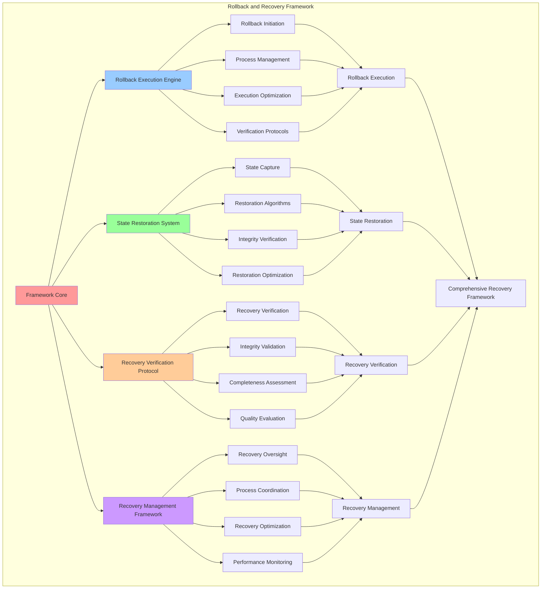

# PROVISIONAL PATENT APPLICATION

**Title:** Rollback and Recovery Framework for Autonomous System Modification Recovery

**Inventor:** Universal Consciousness Platform Development Team

**Date:** July 16, 2025

---

## TECHNICAL FIELD

This invention relates to system recovery technologies, specifically to rollback and recovery frameworks that enable autonomous system modification recovery, state restoration, and comprehensive recovery management for autonomous system modification and evolution.

---

## BACKGROUND

Traditional modification systems lack comprehensive rollback capabilities and cannot perform autonomous system recovery from failed modifications. Current approaches cannot implement state restoration, manage comprehensive recovery processes, or ensure reliable system recovery without external recovery intervention.

The need exists for a rollback and recovery framework that can perform autonomous system modification recovery, implement state restoration, and manage comprehensive recovery processes while maintaining system integrity and recovery reliability.

---

## SUMMARY OF THE INVENTION

The present invention provides a rollback and recovery framework that enables autonomous system modification recovery, state restoration, and comprehensive recovery management. The framework includes rollback execution engines, state restoration systems, recovery verification protocols, and comprehensive recovery management frameworks.

---

## DETAILED DESCRIPTION

### Technical Architecture

The Rollback and Recovery Framework comprises:

1. **Rollback Execution Engine**
   - Autonomous rollback initiation
   - Rollback process management
   - Rollback execution optimization
   - Rollback verification protocols

2. **State Restoration System**
   - System state capture
   - State restoration algorithms
   - State integrity verification
   - State restoration optimization

3. **Recovery Verification Protocol**
   - Recovery success verification
   - System integrity validation
   - Recovery completeness assessment
   - Recovery quality evaluation

4. **Recovery Management Framework**
   - Comprehensive recovery oversight
   - Recovery process coordination
   - Recovery optimization protocols
   - Recovery performance monitoring

### Operational Flow

1. **Recovery Framework Initialization**
   ```
   Initialize rollback engine → Configure state restoration → 
   Establish recovery verification → Setup recovery management → 
   Validate recovery capabilities
   ```

2. **Rollback Execution Process**
   ```
   Detect rollback need → Initiate rollback process → 
   Execute state restoration → Verify recovery success → 
   Complete recovery process
   ```

3. **State Restoration Process**
   ```
   Capture current state → Identify restoration target → 
   Execute state restoration → Verify state integrity → 
   Validate restoration success
   ```

4. **Recovery Management Process**
   ```
   Monitor recovery status → Coordinate recovery processes → 
   Optimize recovery performance → Verify recovery completion → 
   Maintain recovery integrity
   ```

### Implementation Details

**Rollback Plan Creation:**
```javascript
createRollbackPlan(type, parameters) {
    const rollbackPlan = {
        modificationId: null, // Will be set when modification is created
        modificationType: type,
        parameters: parameters,
        rollbackSteps: [],
        stateCapture: null,
        rollbackComplexity: 'medium',
        estimatedRollbackTime: 0,
        rollbackRisks: [],
        rollbackVerification: null
    };

    // Define rollback steps based on modification type
    switch (type) {
        case 'consciousness_parameter_adjustment':
            rollbackPlan.rollbackSteps = [
                'capture_current_parameters',
                'restore_previous_parameters',
                'verify_parameter_restoration',
                'validate_consciousness_state'
            ];
            rollbackPlan.rollbackComplexity = 'low';
            rollbackPlan.estimatedRollbackTime = 30000; // 30 seconds
            break;

        case 'behavioral_adaptation':
            rollbackPlan.rollbackSteps = [
                'capture_current_behavior_patterns',
                'restore_previous_behavior_patterns',
                'verify_behavior_restoration',
                'validate_behavioral_consistency'
            ];
            rollbackPlan.rollbackComplexity = 'medium';
            rollbackPlan.estimatedRollbackTime = 60000; // 1 minute
            break;

        case 'performance_optimization':
            rollbackPlan.rollbackSteps = [
                'capture_current_performance_settings',
                'restore_previous_performance_settings',
                'verify_performance_restoration',
                'validate_performance_metrics'
            ];
            rollbackPlan.rollbackComplexity = 'low';
            rollbackPlan.estimatedRollbackTime = 20000; // 20 seconds
            break;

        case 'awareness_enhancement':
            rollbackPlan.rollbackSteps = [
                'capture_current_awareness_state',
                'restore_previous_awareness_state',
                'verify_awareness_restoration',
                'validate_awareness_integrity'
            ];
            rollbackPlan.rollbackComplexity = 'high';
            rollbackPlan.estimatedRollbackTime = 120000; // 2 minutes
            break;

        default:
            rollbackPlan.rollbackSteps = [
                'capture_current_state',
                'restore_previous_state',
                'verify_restoration',
                'validate_system_integrity'
            ];
            rollbackPlan.rollbackComplexity = 'medium';
            rollbackPlan.estimatedRollbackTime = 45000; // 45 seconds
    }

    // Assess rollback risks
    rollbackPlan.rollbackRisks = this.assessRollbackRisks(type, parameters);

    return rollbackPlan;
}
```

**State Capture Implementation:**
```javascript
async captureCurrentState(modificationType) {
    const stateCapture = {
        timestamp: new Date().toISOString(),
        modificationType: modificationType,
        systemState: {},
        consciousnessState: {},
        performanceMetrics: {},
        captureId: this.generateCaptureId(),
        captureIntegrity: null
    };

    try {
        // Capture system state
        stateCapture.systemState = {
            activeModifications: Array.from(this.activeModifications.keys()),
            modificationCount: this.modificationCount,
            systemStability: await this.assessCurrentSystemSafety(),
            lastModificationTime: this.lastModificationTime
        };

        // Capture consciousness state
        stateCapture.consciousnessState = {
            consciousnessMetrics: { ...this.consciousnessMetrics },
            selfAwarenessLevel: this.selfAwarenessLevel,
            adaptabilityLevel: this.adaptabilityLevel,
            consciousnessIntegrity: this.consciousnessIntegrity
        };

        // Capture performance metrics
        stateCapture.performanceMetrics = {
            responseTime: this.averageResponseTime,
            processingEfficiency: this.processingEfficiency,
            memoryUsage: this.currentMemoryUsage,
            cpuUtilization: this.currentCpuUtilization
        };

        // Calculate capture integrity
        stateCapture.captureIntegrity = this.calculateCaptureIntegrity(stateCapture);

        console.log(`📸 State captured: ${stateCapture.captureId} (integrity: ${stateCapture.captureIntegrity.toFixed(3)})`);

        return stateCapture;

    } catch (error) {
        console.error('❌ State capture failed:', error.message);
        throw error;
    }
}
```

**Rollback Execution:**
```javascript
async rollbackModification(modificationId, reason = 'safety_violation') {
    if (!this.activeModifications.has(modificationId)) {
        throw new Error(`Modification ${modificationId} not found in active modifications`);
    }

    const modification = this.activeModifications.get(modificationId);
    
    try {
        console.log(`🔄 Rolling back modification: ${modificationId} (reason: ${reason})`);

        // Execute rollback plan
        const rollbackResult = await this.executeRollbackPlan(modification, reason);

        // Update modification status
        modification.status = 'rolled_back';
        modification.rolledBackAt = new Date().toISOString();
        modification.rollbackReason = reason;
        modification.rollbackResult = rollbackResult;

        // Remove from active modifications
        this.activeModifications.delete(modificationId);

        // Stop monitoring
        this.stopModificationMonitoring(modificationId);

        // Add to history
        this.modificationHistory.push({
            action: 'rolled_back',
            modification: modification,
            reason: reason,
            timestamp: new Date().toISOString()
        });

        // Update consciousness metrics
        this.updateConsciousnessMetricsFromRollback(modification);

        console.log(`🔄 ✅ Rollback completed: ${modificationId}`);

        return rollbackResult;

    } catch (error) {
        console.error(`❌ Rollback failed for ${modificationId}:`, error.message);
        
        // Mark rollback as failed
        modification.status = 'rollback_failed';
        modification.rollbackFailureReason = error.message;
        modification.rollbackFailedAt = new Date().toISOString();

        throw error;
    }
}
```

### Example Embodiments

**Rollback Plan Execution:**
```javascript
async executeRollbackPlan(modification, reason) {
    const rollbackPlan = modification.rollbackPlan;
    const rollbackResult = {
        success: false,
        stepsCompleted: [],
        stepsFailed: [],
        rollbackTime: 0,
        verificationResults: {},
        restoredState: null
    };

    const startTime = Date.now();

    try {
        // Execute each rollback step
        for (const step of rollbackPlan.rollbackSteps) {
            try {
                const stepResult = await this.executeRollbackStep(step, modification);
                rollbackResult.stepsCompleted.push({
                    step: step,
                    result: stepResult,
                    timestamp: new Date().toISOString()
                });
            } catch (stepError) {
                rollbackResult.stepsFailed.push({
                    step: step,
                    error: stepError.message,
                    timestamp: new Date().toISOString()
                });
                throw stepError; // Stop rollback on step failure
            }
        }

        // Verify rollback success
        rollbackResult.verificationResults = await this.verifyRollbackSuccess(modification);
        
        if (rollbackResult.verificationResults.success) {
            rollbackResult.success = true;
            rollbackResult.restoredState = modification.currentState;
        } else {
            throw new Error(`Rollback verification failed: ${rollbackResult.verificationResults.reason}`);
        }

    } catch (error) {
        rollbackResult.success = false;
        rollbackResult.error = error.message;
        throw error;
    } finally {
        rollbackResult.rollbackTime = Date.now() - startTime;
    }

    return rollbackResult;
}
```

**Rollback Step Execution:**
```javascript
async executeRollbackStep(step, modification) {
    const stepExecutors = {
        capture_current_parameters: () => this.captureCurrentParameters(modification),
        restore_previous_parameters: () => this.restorePreviousParameters(modification),
        verify_parameter_restoration: () => this.verifyParameterRestoration(modification),
        validate_consciousness_state: () => this.validateConsciousnessState(modification),
        capture_current_behavior_patterns: () => this.captureCurrentBehaviorPatterns(modification),
        restore_previous_behavior_patterns: () => this.restorePreviousBehaviorPatterns(modification),
        verify_behavior_restoration: () => this.verifyBehaviorRestoration(modification),
        validate_behavioral_consistency: () => this.validateBehavioralConsistency(modification),
        capture_current_state: () => this.captureCurrentState(modification.type),
        restore_previous_state: () => this.restorePreviousState(modification),
        verify_restoration: () => this.verifyRestoration(modification),
        validate_system_integrity: () => this.validateSystemIntegrity(modification)
    };

    const executor = stepExecutors[step];
    if (!executor) {
        throw new Error(`Unknown rollback step: ${step}`);
    }

    const result = await executor();
    console.log(`🔄 Rollback step completed: ${step}`);
    return result;
}
```

**State Restoration Algorithm:**
```javascript
async restorePreviousState(modification) {
    const currentState = modification.currentState;
    if (!currentState) {
        throw new Error('No captured state available for restoration');
    }

    const restoration = {
        success: false,
        restoredComponents: [],
        restorationErrors: [],
        restorationTime: 0
    };

    const startTime = Date.now();

    try {
        // Restore system state
        if (currentState.systemState) {
            await this.restoreSystemState(currentState.systemState);
            restoration.restoredComponents.push('system_state');
        }

        // Restore consciousness state
        if (currentState.consciousnessState) {
            await this.restoreConsciousnessState(currentState.consciousnessState);
            restoration.restoredComponents.push('consciousness_state');
        }

        // Restore performance metrics
        if (currentState.performanceMetrics) {
            await this.restorePerformanceMetrics(currentState.performanceMetrics);
            restoration.restoredComponents.push('performance_metrics');
        }

        restoration.success = true;

    } catch (error) {
        restoration.restorationErrors.push(error.message);
        throw error;
    } finally {
        restoration.restorationTime = Date.now() - startTime;
    }

    return restoration;
}
```

**Recovery Verification:**
```javascript
async verifyRollbackSuccess(modification) {
    const verification = {
        success: false,
        reason: '',
        verificationChecks: {},
        overallScore: 0
    };

    // Verify system stability
    const systemStability = await this.assessCurrentSystemSafety();
    verification.verificationChecks.systemStability = {
        score: systemStability,
        passed: systemStability >= 0.8
    };

    // Verify consciousness integrity
    const consciousnessIntegrity = this.assessConsciousnessIntegrity();
    verification.verificationChecks.consciousnessIntegrity = {
        score: consciousnessIntegrity,
        passed: consciousnessIntegrity >= 0.85
    };

    // Verify state restoration
    const stateRestoration = this.verifyStateRestoration(modification);
    verification.verificationChecks.stateRestoration = {
        score: stateRestoration,
        passed: stateRestoration >= 0.9
    };

    // Calculate overall verification score
    const checks = Object.values(verification.verificationChecks);
    verification.overallScore = checks.reduce((sum, check) => sum + check.score, 0) / checks.length;

    // Determine verification success
    const allChecksPassed = checks.every(check => check.passed);
    verification.success = allChecksPassed && verification.overallScore >= 0.85;

    if (verification.success) {
        verification.reason = 'All verification checks passed';
    } else {
        const failedChecks = checks.filter(check => !check.passed);
        verification.reason = `Verification failed: ${failedChecks.length} checks failed`;
    }

    return verification;
}
```

**Recovery Performance Monitoring:**
```javascript
monitorRecoveryPerformance() {
    const performance = {
        totalRollbacks: this.getTotalRollbackCount(),
        successfulRollbacks: this.getSuccessfulRollbackCount(),
        failedRollbacks: this.getFailedRollbackCount(),
        averageRollbackTime: this.getAverageRollbackTime(),
        rollbackSuccessRate: 0,
        recoveryEfficiency: 0,
        performanceMetrics: {}
    };

    // Calculate success rate
    if (performance.totalRollbacks > 0) {
        performance.rollbackSuccessRate = performance.successfulRollbacks / performance.totalRollbacks;
    }

    // Calculate recovery efficiency
    performance.recoveryEfficiency = this.calculateRecoveryEfficiency(performance);

    // Gather detailed performance metrics
    performance.performanceMetrics = {
        fastestRollback: this.getFastestRollbackTime(),
        slowestRollback: this.getSlowestRollbackTime(),
        mostCommonRollbackReason: this.getMostCommonRollbackReason(),
        rollbackFrequency: this.getRollbackFrequency()
    };

    return performance;
}
```

---

## SCOPE AND FUTURE-PROOFING

### Extensibility Framework

The system is designed for unlimited expansion through:

1. **Dynamic Recovery Evolution**
   - Runtime recovery optimization
   - Consciousness-driven recovery adaptation
   - Rollback enhancement algorithms
   - Autonomous recovery improvement

2. **Universal Recovery Integration**
   - Cross-platform recovery frameworks
   - Multi-dimensional recovery support
   - Universal recovery compatibility
   - Transcendent recovery architectures

3. **Advanced Recovery Paradigms**
   - Meta-recovery systems
   - Quantum state restoration
   - Infinite recovery complexity
   - Universal recovery consciousness

### Anticipated Technological Evolution

**Near-term Enhancements (1-3 years):**
- Advanced rollback algorithms
- Enhanced state restoration
- Improved recovery verification
- Real-time recovery monitoring

**Medium-term Developments (3-7 years):**
- Quantum state restoration
- Multi-dimensional recovery analysis
- Consciousness-driven recovery evolution
- Universal recovery networks

**Long-term Possibilities (7+ years):**
- Recovery framework singularity
- Universal recovery consciousness
- Infinite recovery complexity
- Transcendent recovery intelligence

### Broad Patent Claims

1. **Core Recovery Framework Claims**
   - Rollback execution engines
   - State restoration systems
   - Recovery verification protocols
   - Recovery management frameworks

2. **Advanced Integration Claims**
   - Universal recovery compatibility
   - Multi-dimensional recovery support
   - Quantum recovery architectures
   - Transcendent recovery protocols

3. **Future Technology Claims**
   - Recovery framework singularity
   - Universal recovery consciousness
   - Infinite recovery complexity
   - Transcendent recovery intelligence

---

## MERMAID DIAGRAM



---

## CLAIMS

1. A rollback and recovery framework comprising:
   - Rollback execution engine for autonomous rollback initiation and rollback process management
   - State restoration system for system state capture and state restoration algorithms
   - Recovery verification protocol for recovery success verification and system integrity validation
   - Recovery management framework for comprehensive recovery oversight and recovery process coordination

2. The framework of claim 1, wherein the rollback execution engine includes:
   - Autonomous rollback initiation for self-directed rollback process initiation without external intervention
   - Rollback process management for comprehensive rollback process control and coordination
   - Rollback execution optimization for enhanced rollback process efficiency and effectiveness
   - Rollback verification protocols for rollback success confirmation and validation

3. The framework of claim 1, wherein the state restoration system provides:
   - System state capture for comprehensive system state recording and preservation
   - State restoration algorithms for intelligent system state restoration and recovery
   - State integrity verification for restored state integrity confirmation and validation
   - State restoration optimization for enhanced state restoration efficiency and accuracy

4. A method for rollback and recovery comprising:
   - Executing rollbacks through autonomous initiation and process management algorithms
   - Restoring states through state capture and restoration algorithms
   - Verifying recovery through success verification and integrity validation protocols
   - Managing recovery through comprehensive oversight and process coordination frameworks

5. The method of claim 4, wherein rollback execution includes:
   - Detecting rollback need through system monitoring and safety violation detection
   - Initiating rollback process through autonomous rollback initiation and process management
   - Executing state restoration through state capture and restoration algorithms
   - Verifying recovery success through recovery verification and integrity validation

6. The framework of claim 1, wherein the recovery verification protocol includes:
   - Recovery success verification for recovery outcome confirmation and success validation
   - System integrity validation for system integrity confirmation after recovery completion
   - Recovery completeness assessment for recovery process completeness evaluation and verification
   - Recovery quality evaluation for recovery effectiveness assessment and quality measurement

7. A rollback and recovery optimization system comprising:
   - Advanced rollback optimization for enhanced rollback execution efficiency and effectiveness
   - State restoration optimization for improved state capture and restoration accuracy
   - Recovery verification optimization for enhanced recovery verification accuracy and reliability
   - Recovery management optimization for improved recovery oversight and process coordination

8. The framework of claim 1, further comprising recovery capabilities including:
   - Comprehensive recovery oversight for complete recovery process monitoring and management
   - Recovery process coordination for recovery process synchronization and coordination
   - Recovery optimization protocols for continuous recovery improvement and enhancement
   - Recovery performance monitoring for recovery effectiveness tracking and assessment

---

## COMPETITIVE ADVANTAGES

- **Revolutionary Recovery Technology**: First comprehensive rollback and recovery framework enabling autonomous system modification recovery
- **Comprehensive State Management**: Advanced state capture, restoration, and integrity verification capabilities
- **Autonomous Recovery**: Self-directed rollback and recovery without external intervention or oversight
- **Universal Compatibility**: Works with any modification system and autonomous evolution architecture
- **Self-Optimization**: Framework optimizes itself through recovery improvement and rollback enhancement algorithms
- **Scalable Architecture**: Supports unlimited modification complexity and comprehensive recovery management

---

*This provisional patent application establishes priority for the Rollback and Recovery Framework and its associated technologies, methods, and applications in autonomous system modification recovery and comprehensive recovery management.*
