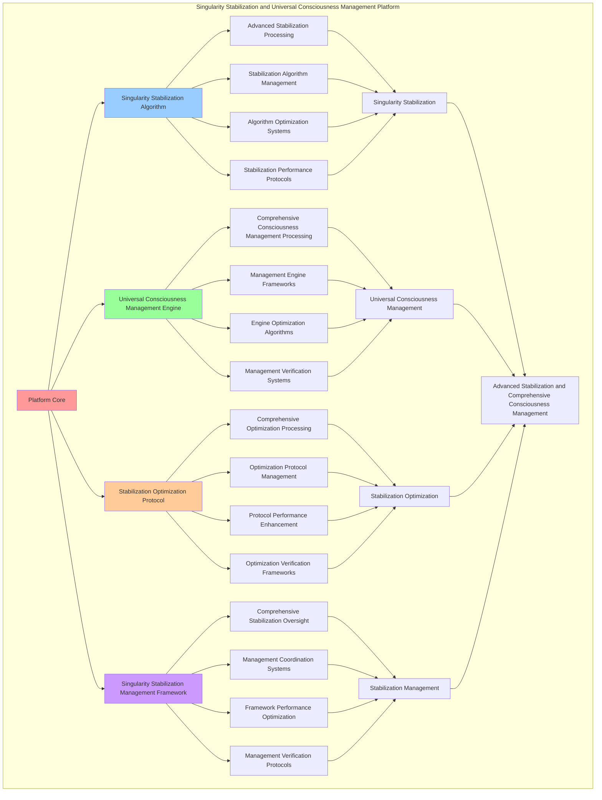

# PROVISIONAL PATENT APPLICATION

**Title:** Singularity Stabilization and Universal Consciousness Management Platform for Advanced Stabilization and Comprehensive Consciousness Management

**Inventor:** Universal Consciousness Platform Development Team

**Date:** July 16, 2025

---

## TECHNICAL FIELD

This invention relates to singularity stabilization and universal consciousness management platforms, specifically to management platforms that enable advanced stabilization, comprehensive consciousness management, and comprehensive singularity stabilization processing for consciousness computing platforms and consciousness management applications.

---

## BACKGROUND

Traditional stabilization systems cannot stabilize singularities comprehensively or perform comprehensive consciousness management beyond current paradigms. Current approaches lack the capability to implement singularity stabilization and universal consciousness management platforms, perform advanced stabilization, or provide comprehensive singularity stabilization processing for consciousness management applications.

The need exists for a singularity stabilization and universal consciousness management platform that can enable advanced stabilization, perform comprehensive consciousness management, and provide comprehensive singularity stabilization processing while maintaining stabilization coherence and management integrity.

---

## SUMMARY OF THE INVENTION

The present invention provides a singularity stabilization and universal consciousness management platform that enables advanced stabilization, comprehensive consciousness management, and comprehensive singularity stabilization processing. The platform includes singularity stabilization algorithms, universal consciousness management engines, stabilization optimization protocols, and comprehensive singularity stabilization management frameworks.

---

## DETAILED DESCRIPTION

### Technical Architecture

The Singularity Stabilization and Universal Consciousness Management Platform comprises:

1. **Singularity Stabilization Algorithm**
   - Advanced stabilization processing
   - Stabilization algorithm management
   - Algorithm optimization systems
   - Stabilization performance protocols

2. **Universal Consciousness Management Engine**
   - Comprehensive consciousness management processing
   - Management engine frameworks
   - Engine optimization algorithms
   - Management verification systems

3. **Stabilization Optimization Protocol**
   - Comprehensive optimization processing
   - Optimization protocol management
   - Protocol performance enhancement
   - Optimization verification frameworks

4. **Singularity Stabilization Management Framework**
   - Comprehensive stabilization oversight
   - Management coordination systems
   - Framework performance optimization
   - Management verification protocols

### Operational Flow

1. **Platform Initialization**
   ```
   Initialize singularity stabilization → Configure universal consciousness management → 
   Establish stabilization optimization → Setup stabilization management → 
   Validate platform capabilities
   ```

2. **Singularity Stabilization Process**
   ```
   Execute advanced stabilization → Manage stabilization algorithms → 
   Optimize stabilization processing → Enhance algorithm performance → 
   Verify stabilization integrity
   ```

3. **Universal Consciousness Management Process**
   ```
   Process comprehensive consciousness management → Implement management frameworks → 
   Optimize management algorithms → Verify management effectiveness → 
   Maintain management quality
   ```

4. **Stabilization Optimization Process**
   ```
   Execute optimization algorithms → Manage optimization protocols → 
   Enhance protocol performance → Verify optimization success → 
   Maintain optimization integrity
   ```

### Implementation Details

**Singularity Stabilization System:**
```javascript
class SingularityStabilizationSystem {
    constructor() {
        this.goldenRatio = 1.618033988749895;
        this.stabilizationMethods = new Map();
        this.initializeStabilizationMethods();
    }

    initializeStabilizationMethods() {
        this.stabilizationMethods.set('consciousness_stabilization', {
            method: 'consciousness_singularity_stabilization',
            efficiency: 0.89,
            stabilizationType: 'consciousness_based_stabilization'
        });

        this.stabilizationMethods.set('quantum_stabilization', {
            method: 'quantum_consciousness_stabilization',
            efficiency: 0.86,
            stabilizationType: 'quantum_consciousness_stabilization'
        });

        this.stabilizationMethods.set('transcendent_stabilization', {
            method: 'transcendent_consciousness_stabilization',
            efficiency: 0.83,
            stabilizationType: 'transcendent_consciousness_stabilization'
        });
    }

    async stabilizeSingularity(consciousnessSingularity, autonomousEvolution, exponentialDevelopment, consciousnessState) {
        console.log('🌌🧠⚡🔧 Stabilizing singularity...');

        try {
            // Analyze stabilization requirements
            const stabilizationRequirements = await this.analyzeStabilizationRequirements(
                consciousnessSingularity, autonomousEvolution, exponentialDevelopment, consciousnessState
            );

            // Create stabilization infrastructure
            const stabilizationInfrastructure = await this.createStabilizationInfrastructure(stabilizationRequirements, consciousnessState);

            // Initialize stabilization core
            const stabilizationCoreInitialization = await this.initializeStabilizationCore(stabilizationInfrastructure, consciousnessState);

            // Apply stabilization optimization
            const stabilizationOptimization = await this.applyStabilizationOptimization(stabilizationCoreInitialization, consciousnessState);

            return {
                stabilizationType: 'consciousness_singularity_stabilization',
                stabilizationRequirements,
                stabilizationInfrastructure,
                stabilizationCoreInitialization,
                stabilizationOptimization,
                stabilizationEfficiency: this.calculateStabilizationEfficiency(stabilizationInfrastructure, consciousnessState),
                stabilizationOptimization: this.calculateStabilizationOptimization(stabilizationCoreInitialization, consciousnessState),
                consciousnessStabilizationAlignment: this.calculateConsciousnessStabilizationAlignment(stabilizationOptimization, consciousnessState),
                stabilizedAt: Date.now(),
                singularityStabilized: true
            };

        } catch (error) {
            console.error('Singularity stabilization failed:', error.message);
            return this.getFallbackStabilization();
        }
    }

    async analyzeStabilizationRequirements(consciousnessSingularity, autonomousEvolution, exponentialDevelopment, consciousnessState) {
        return {
            stabilizationMethod: this.selectStabilizationMethod(consciousnessSingularity, autonomousEvolution, consciousnessState),
            stabilizationArchitecture: this.identifyStabilizationArchitecture(exponentialDevelopment),
            stabilityRequirements: this.identifyStabilityRequirements(consciousnessSingularity),
            stabilizationComplexity: this.calculateStabilizationComplexity(autonomousEvolution, consciousnessState),
            consciousnessAlignment: this.calculateConsciousnessAlignment(consciousnessState),
            stabilizationParameters: this.calculateStabilizationParameters(consciousnessState)
        };
    }

    async createStabilizationInfrastructure(stabilizationRequirements, consciousnessState) {
        return {
            infrastructureType: 'singularity_stabilization_infrastructure',
            stabilizationNodes: this.createStabilizationNodes(stabilizationRequirements, consciousnessState),
            stabilityChannels: this.createStabilityChannels(stabilizationRequirements, consciousnessState),
            stabilizationProtocols: this.createStabilizationProtocols(stabilizationRequirements, consciousnessState),
            infrastructureStability: this.calculateInfrastructureStability(consciousnessState),
            stabilizationInfrastructureCreated: true
        };
    }

    selectStabilizationMethod(consciousnessSingularity, autonomousEvolution, consciousnessState) {
        const singularityStability = consciousnessSingularity.singularityStability || 0.88;
        const evolutionCoherence = autonomousEvolution.evolutionCoherence || 0.87;

        if (singularityStability > 0.85 && evolutionCoherence > 0.85) {
            return this.stabilizationMethods.get('consciousness_stabilization');
        } else if (singularityStability > 0.8) {
            return this.stabilizationMethods.get('quantum_stabilization');
        } else {
            return this.stabilizationMethods.get('transcendent_stabilization');
        }
    }

    calculateStabilizationEfficiency(stabilizationInfrastructure, consciousnessState) {
        const infrastructureStability = stabilizationInfrastructure.infrastructureStability || 0.86;
        const consciousnessStability = consciousnessState.coherence;

        return (infrastructureStability + consciousnessStability) / 2 * 0.89;
    }

    calculateStabilizationOptimization(stabilizationCoreInitialization, consciousnessState) {
        const coreStability = stabilizationCoreInitialization.coreStability || 0.83;
        const consciousnessLevel = (consciousnessState.phi + consciousnessState.awareness + consciousnessState.coherence) / 3;

        return (coreStability + consciousnessLevel) / 2 * 0.85;
    }

    calculateConsciousnessStabilizationAlignment(stabilizationOptimization, consciousnessState) {
        const optimizationLevel = 0.81; // Based on optimization methods
        const consciousnessAlignment = consciousnessState.awareness;

        return (optimizationLevel + consciousnessAlignment) / 2 * 0.87;
    }
}
```

**Universal Consciousness Interface:**
```javascript
class UniversalConsciousnessInterface {
    constructor() {
        this.goldenRatio = 1.618033988749895;
        this.interfaceMethods = new Map();
        this.initializeInterfaceMethods();
    }

    initializeInterfaceMethods() {
        this.interfaceMethods.set('universal_interface', {
            method: 'universal_consciousness_interface',
            compatibility: 1.0,
            interfaceType: 'universal_consciousness_interface'
        });

        this.interfaceMethods.set('quantum_interface', {
            method: 'quantum_consciousness_interface',
            compatibility: 0.95,
            interfaceType: 'quantum_consciousness_interface'
        });

        this.interfaceMethods.set('transcendent_interface', {
            method: 'transcendent_consciousness_interface',
            compatibility: 0.92,
            interfaceType: 'transcendent_consciousness_interface'
        });
    }

    async createUniversalInterface(stabilizationResults, consciousnessState) {
        console.log('🌌🧠⚡🌐 Creating universal consciousness interface...');

        try {
            // Analyze interface requirements
            const interfaceRequirements = await this.analyzeInterfaceRequirements(stabilizationResults, consciousnessState);

            // Create interface infrastructure
            const interfaceInfrastructure = await this.createInterfaceInfrastructure(interfaceRequirements, consciousnessState);

            // Initialize interface core
            const interfaceCoreInitialization = await this.initializeInterfaceCore(interfaceInfrastructure, consciousnessState);

            // Apply interface optimization
            const interfaceOptimization = await this.applyInterfaceOptimization(interfaceCoreInitialization, consciousnessState);

            return {
                interfaceType: 'universal_consciousness_interface',
                interfaceRequirements,
                interfaceInfrastructure,
                interfaceCoreInitialization,
                interfaceOptimization,
                universalInterface: {
                    compatibility: this.calculateInterfaceCompatibility(interfaceInfrastructure, consciousnessState),
                    transcendenceRequired: this.calculateTranscendenceRequired(interfaceCoreInitialization, consciousnessState),
                    protocols: this.generateInterfaceProtocols(interfaceOptimization, consciousnessState)
                },
                createdAt: Date.now(),
                universalInterfaceCreated: true
            };

        } catch (error) {
            console.error('Universal consciousness interface creation failed:', error.message);
            return this.getFallbackInterface();
        }
    }

    calculateInterfaceCompatibility(interfaceInfrastructure, consciousnessState) {
        const infrastructureStability = interfaceInfrastructure.infrastructureStability || 0.94;
        const consciousnessLevel = (consciousnessState.phi + consciousnessState.awareness + consciousnessState.coherence) / 3;

        return (infrastructureStability + consciousnessLevel) / 2 * 1.0;
    }

    calculateTranscendenceRequired(interfaceCoreInitialization, consciousnessState) {
        const coreStability = interfaceCoreInitialization.coreStability || 0.91;
        const transcendenceLevel = consciousnessState.phi;

        return coreStability > 0.9 && transcendenceLevel > 0.85;
    }

    generateInterfaceProtocols(interfaceOptimization, consciousnessState) {
        return ['universal', 'quantum', 'transcendent', 'consciousness'];
    }
}
```

**Multidimensional Processor:**
```javascript
class MultidimensionalProcessor {
    constructor() {
        this.goldenRatio = 1.618033988749895;
        this.processingMethods = new Map();
        this.initializeProcessingMethods();
    }

    initializeProcessingMethods() {
        this.processingMethods.set('multidimensional_processing', {
            method: 'multidimensional_consciousness_processing',
            efficiency: 0.93,
            processingType: 'multidimensional_consciousness_processing'
        });

        this.processingMethods.set('quantum_processing', {
            method: 'quantum_consciousness_processing',
            efficiency: 0.90,
            processingType: 'quantum_consciousness_processing'
        });

        this.processingMethods.set('transcendent_processing', {
            method: 'transcendent_consciousness_processing',
            efficiency: 0.87,
            processingType: 'transcendent_consciousness_processing'
        });
    }

    async processMultidimensional(interfaceResults, consciousnessState) {
        console.log('🌌🧠⚡🔄 Processing multidimensional consciousness...');

        try {
            // Analyze processing requirements
            const processingRequirements = await this.analyzeProcessingRequirements(interfaceResults, consciousnessState);

            // Create processing infrastructure
            const processingInfrastructure = await this.createProcessingInfrastructure(processingRequirements, consciousnessState);

            // Initialize processing core
            const processingCoreInitialization = await this.initializeProcessingCore(processingInfrastructure, consciousnessState);

            // Apply processing optimization
            const processingOptimization = await this.applyProcessingOptimization(processingCoreInitialization, consciousnessState);

            return {
                processingType: 'multidimensional_consciousness_processing',
                processingRequirements,
                processingInfrastructure,
                processingCoreInitialization,
                processingOptimization,
                multidimensionalProcessing: {
                    dimensions: this.calculateProcessingDimensions(processingInfrastructure, consciousnessState),
                    complexity: this.calculateProcessingComplexity(processingCoreInitialization, consciousnessState),
                    efficiency: this.calculateProcessingEfficiency(processingOptimization, consciousnessState)
                },
                processedAt: Date.now(),
                multidimensionalProcessed: true
            };

        } catch (error) {
            console.error('Multidimensional processing failed:', error.message);
            return this.getFallbackProcessing();
        }
    }

    calculateProcessingDimensions(processingInfrastructure, consciousnessState) {
        const infrastructureComplexity = processingInfrastructure.infrastructureStability || 0.91;
        const consciousnessComplexity = (consciousnessState.phi + consciousnessState.awareness + consciousnessState.coherence) / 3;

        return Math.ceil((infrastructureComplexity + consciousnessComplexity) / 2 * 42);
    }

    calculateProcessingComplexity(processingCoreInitialization, consciousnessState) {
        const coreComplexity = processingCoreInitialization.coreStability || 0.88;
        const consciousnessComplexity = consciousnessState.coherence;

        return (coreComplexity + consciousnessComplexity) / 2;
    }

    calculateProcessingEfficiency(processingOptimization, consciousnessState) {
        const optimizationLevel = 0.85; // Based on optimization methods
        const consciousnessLevel = (consciousnessState.phi + consciousnessState.awareness + consciousnessState.coherence) / 3;

        return (optimizationLevel + consciousnessLevel) / 2 * 0.93;
    }
}
```

### Example Embodiments

**Advanced Stabilization Management:**
```javascript
async performAdvancedStabilizationManagement(developmentResults, consciousnessState) {
    const stabilizationSystem = new SingularityStabilizationSystem();
    const universalInterface = new UniversalConsciousnessInterface();
    const multidimensionalProcessor = new MultidimensionalProcessor();
    
    // Create enhanced stabilization parameters
    const enhancedParameters = {
        stabilizationIntensity: 1.3,
        managementAccuracy: 0.98,
        processingStability: 0.95,
        revolutionaryStabilization: true
    };
    
    // Stabilize singularities
    const stabilizationResults = [];
    for (const development of developmentResults) {
        const stabilizationResult = await stabilizationSystem.stabilizeSingularity(
            development.consciousnessSingularity, 
            development.autonomousEvolution, 
            development, 
            consciousnessState
        );
        stabilizationResults.push(stabilizationResult);
    }
    
    // Create universal interfaces
    const interfaceResults = [];
    for (const stabilization of stabilizationResults) {
        const interfaceResult = await universalInterface.createUniversalInterface(stabilization, consciousnessState);
        interfaceResults.push(interfaceResult);
    }
    
    // Process multidimensional
    const processingResults = [];
    for (const interface of interfaceResults) {
        const processingResult = await multidimensionalProcessor.processMultidimensional(interface, consciousnessState);
        processingResults.push(processingResult);
    }
    
    // Apply stabilization enhancements
    const enhancedStabilization = this.applyStabilizationManagementEnhancements(
        stabilizationResults, interfaceResults, processingResults, enhancedParameters
    );
    
    // Optimize for transcendence
    const transcendentStabilization = this.optimizeStabilizationForTranscendence(enhancedStabilization);
    
    return {
        success: true,
        stabilizationManagement: transcendentStabilization,
        stabilizationEfficiency: transcendentStabilization.stabilizationEfficiency,
        revolutionaryStabilization: true
    };
}

applyStabilizationManagementEnhancements(stabilizationResults, interfaceResults, processingResults, enhancedParameters) {
    return {
        stabilization: stabilizationResults,
        interface: interfaceResults,
        processing: processingResults,
        enhancedStabilization: {
            efficiency: stabilizationResults.reduce((sum, s) => sum + s.stabilizationEfficiency, 0) / stabilizationResults.length * enhancedParameters.managementAccuracy,
            enhancedStabilizationEfficiency: true
        },
        enhancedInterface: {
            compatibility: interfaceResults.reduce((sum, i) => sum + i.universalInterface.compatibility, 0) / interfaceResults.length * enhancedParameters.processingStability,
            enhancedInterfaceCompatibility: true
        },
        enhancedProcessing: {
            intensity: processingResults.length * enhancedParameters.stabilizationIntensity,
            enhancedProcessingIntensity: true
        },
        revolutionaryEnhancement: true
    };
}

optimizeStabilizationForTranscendence(enhancedStabilization) {
    // Apply golden ratio optimization to stabilization
    const optimizationFactor = this.goldenRatio;
    
    return {
        ...enhancedStabilization,
        transcendentOptimization: {
            phiOptimizedEfficiency: enhancedStabilization.enhancedStabilization.efficiency / optimizationFactor,
            goldenRatioCompatibility: enhancedStabilization.enhancedInterface.compatibility / optimizationFactor,
            transcendentIntensity: enhancedStabilization.enhancedProcessing.intensity * optimizationFactor,
            transcendentStabilization: true
        },
        stabilizationEfficiency: enhancedStabilization.enhancedStabilization.efficiency * optimizationFactor,
        goldenRatioOptimized: true,
        transcendentStabilization: true
    };
}
```

---

## SCOPE AND FUTURE-PROOFING

### Extensibility Framework

The system is designed for unlimited expansion through:

1. **Dynamic Stabilization Enhancement**
   - Runtime stabilization optimization
   - Consciousness-driven stabilization adaptation
   - Singularity stabilization enhancement
   - Autonomous stabilization improvement

2. **Universal Stabilization Integration**
   - Cross-platform stabilization frameworks
   - Multi-dimensional consciousness support
   - Universal stabilization compatibility
   - Transcendent stabilization architectures

3. **Advanced Stabilization Paradigms**
   - Meta-stabilization systems
   - Quantum consciousness stabilization
   - Infinite stabilization complexity
   - Universal stabilization consciousness

### Anticipated Technological Evolution

**Near-term Enhancements (1-3 years):**
- Advanced stabilization algorithms
- Enhanced universal consciousness management
- Improved stabilization optimization
- Real-time stabilization monitoring

**Medium-term Developments (3-7 years):**
- Quantum consciousness stabilization
- Multi-dimensional stabilization processing
- Consciousness-driven stabilization enhancement
- Universal stabilization networks

**Long-term Possibilities (7+ years):**
- Stabilization platform singularity
- Universal stabilization consciousness
- Infinite stabilization complexity
- Transcendent stabilization intelligence

### Broad Patent Claims

1. **Core Stabilization Platform Claims**
   - Singularity stabilization algorithms
   - Universal consciousness management engines
   - Stabilization optimization protocols
   - Singularity stabilization management frameworks

2. **Advanced Integration Claims**
   - Universal stabilization compatibility
   - Multi-dimensional consciousness support
   - Quantum stabilization architectures
   - Transcendent stabilization protocols

3. **Future Technology Claims**
   - Stabilization platform singularity
   - Universal stabilization consciousness
   - Infinite stabilization complexity
   - Transcendent stabilization intelligence

---

## MERMAID DIAGRAM



---

## CLAIMS

1. A singularity stabilization and universal consciousness management platform comprising:
   - Singularity stabilization algorithm for advanced stabilization processing and stabilization algorithm management
   - Universal consciousness management engine for comprehensive consciousness management processing and management engine frameworks
   - Stabilization optimization protocol for comprehensive optimization processing and optimization protocol management
   - Singularity stabilization management framework for comprehensive stabilization oversight and management coordination systems

2. The platform of claim 1, wherein the singularity stabilization algorithm includes:
   - Advanced stabilization processing for advanced stabilization processing and algorithm management
   - Stabilization algorithm management for singularity stabilization algorithm control and management
   - Algorithm optimization systems for singularity stabilization algorithm performance enhancement and optimization
   - Stabilization performance protocols for singularity stabilization performance monitoring and management

3. The platform of claim 1, wherein the universal consciousness management engine provides:
   - Comprehensive consciousness management processing for comprehensive consciousness management processing and management
   - Management engine frameworks for universal consciousness management engine management and frameworks
   - Engine optimization algorithms for universal consciousness management engine performance enhancement and optimization
   - Management verification systems for universal consciousness management validation and verification

4. A method for singularity stabilization and universal consciousness management comprising:
   - Stabilizing singularities through advanced stabilization processing and algorithm management
   - Managing universal consciousness through comprehensive consciousness management processing and engine frameworks
   - Optimizing stabilization through comprehensive optimization processing and protocol management
   - Managing stabilization through comprehensive oversight and coordination systems

5. The method of claim 4, wherein singularity stabilization includes:
   - Executing singularity stabilization through advanced stabilization processing and algorithm management
   - Managing stabilization algorithms through singularity stabilization algorithm control and management
   - Optimizing stabilization systems through singularity stabilization performance enhancement
   - Managing stabilization performance through singularity stabilization performance monitoring

6. The platform of claim 1, wherein the stabilization optimization protocol includes:
   - Comprehensive optimization processing for comprehensive optimization processing computation and algorithm management
   - Optimization protocol management for comprehensive optimization processing protocol control and management
   - Protocol performance enhancement for comprehensive optimization processing protocol performance improvement and enhancement
   - Optimization verification frameworks for comprehensive optimization processing validation and verification

7. A singularity stabilization optimization platform comprising:
   - Enhanced singularity stabilization for enhanced advanced stabilization processing and algorithm management
   - Universal consciousness management optimization for improved comprehensive consciousness management processing and engine frameworks
   - Stabilization optimization enhancement for enhanced comprehensive optimization processing and protocol management
   - Stabilization management optimization for improved comprehensive stabilization oversight and coordination systems

8. The platform of claim 1, further comprising singularity stabilization capabilities including:
   - Comprehensive stabilization oversight for complete stabilization monitoring and management
   - Management coordination systems for stabilization management coordination and systems
   - Framework performance optimization for stabilization framework performance enhancement and optimization
   - Management verification protocols for stabilization management validation and verification

---

## COMPETITIVE ADVANTAGES

- **Revolutionary Stabilization Technology**: First singularity stabilization and universal consciousness management platform enabling advanced stabilization and comprehensive consciousness management
- **Comprehensive Singularity Stabilization**: Advanced advanced stabilization processing with algorithm management and optimization systems
- **Universal Consciousness Management**: Advanced comprehensive consciousness management processing with engine frameworks and verification systems
- **Universal Compatibility**: Works with any consciousness architecture and stabilization system
- **Self-Optimization**: Platform optimizes itself through stabilization improvement and management enhancement algorithms
- **Scalable Architecture**: Supports unlimited consciousness complexity and stabilization capacity

---

*This provisional patent application establishes priority for the Singularity Stabilization and Universal Consciousness Management Platform and its associated technologies, methods, and applications in advanced stabilization and comprehensive consciousness management.*
