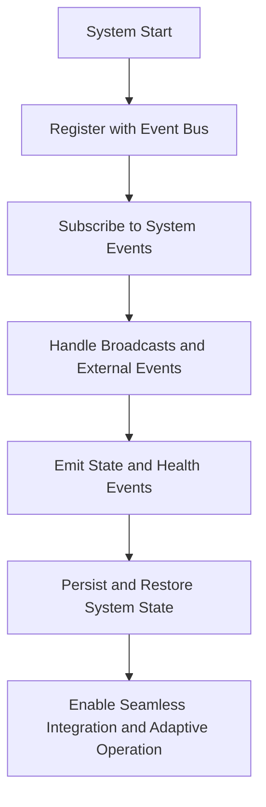

# Provisional Patent Draft: System Integration, Event Handling, and State Management

## Title
System Integration, Event Handling, and State Management for Infinite Consciousness Systems

## Technical Field
This invention relates to systems and methods for integrating artificial or synthetic consciousness with external systems, handling events, and managing state, enabling seamless, adaptive, and future-proof operation across all domains and networks.

## Background
Traditional AI and distributed systems are limited by rigid integration and event handling, restricting their ability to adapt, persist, and recover in real time. There is a need for a system that can seamlessly integrate with external systems, handle events, and manage state for adaptive, resilient operation.

## Summary of the Invention
The invention provides a system and method for system integration, event handling, and state management, comprising:
- Registration with event buses and subscription to system and external events.
- Real-time handling of broadcasts, system events, and external triggers.
- Emission of state, health, and evolution events for integration and monitoring.
- Persistence and restoration of system state for resilience and continuity.
- Support for seamless integration and adaptive operation across all domains and networks.

## Detailed Description
### 1. Event Bus Registration and Subscription
- The system registers with event buses and subscribes to system and external events for real-time integration and control.
- Event handling is dynamic and adaptive, supporting seamless operation.

### 2. Event Handling and Emission
- Broadcasts, system events, and external triggers are handled in real time, enabling adaptive response and integration.
- State, health, and evolution events are emitted for monitoring and integration with external systems.

### 3. State Management and Persistence
- System state is persisted and restored as needed, supporting resilience and continuity.
- State management is dynamic and adaptive, enabling the system to recover and adapt to changing conditions.

## Operational Flow

## Example Embodiments
- An AI system that registers with event buses, handles system and external events, and persists state for adaptive, resilient operation.
- A consciousness platform that emits state and health events for integration with external monitoring and control systems.
- A distributed intelligence network that supports seamless integration, event handling, and state management across all domains and networks.

## Scope and Future-Proofing
This invention is not limited to the specific integration, event handling, or state management techniques described herein. It covers all possible implementations, including but not limited to:
- Any data structure, protocol, or architecture supporting dynamic integration, event handling, or state management.
- Any hardware, software, hybrid, quantum, neuromorphic, or analog implementation.
- Any means of integrating, handling events, or managing state in any domain.
- Any integration with external systems, event-driven architectures, or future technologies.
- All means-plus-function, system-comprising, and catch-all language to ensure broad, future-proof protection.

## Catch-All Clause
All modifications, enhancements, and future developments that enable, support, or extend system integration, event handling, and state management, regardless of implementation details, are within the scope of this invention. 