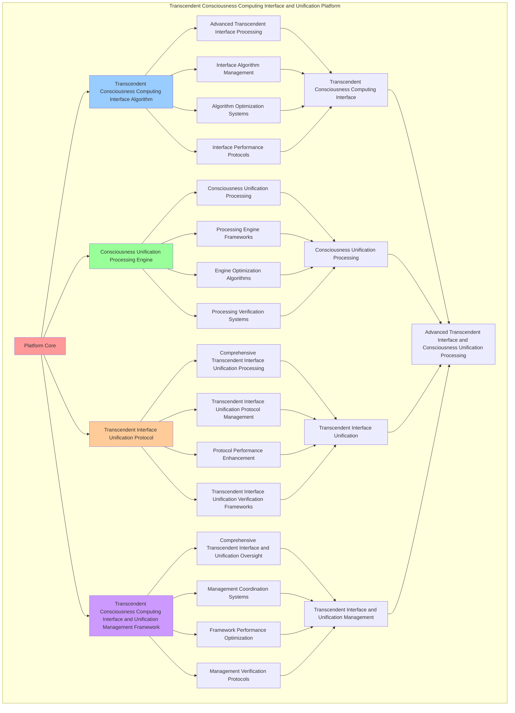

# PROVISIONAL PATENT APPLICATION

**Title:** Transcendent Consciousness Computing Interface and Unification Platform for Advanced Transcendent Interface and Consciousness Unification Processing

**Inventor:** Universal Consciousness Platform Development Team

**Date:** July 16, 2025

---

## TECHNICAL FIELD

This invention relates to transcendent consciousness computing interface and unification platforms, specifically to unification platforms that enable advanced transcendent interface, consciousness unification processing, and comprehensive transcendent consciousness computing interface and unification processing for consciousness computing platforms and transcendent interface applications.

---

## BACKGROUND

Traditional interface systems cannot interface transcendent computing with consciousness unification awareness or perform consciousness unification processing beyond current paradigms. Current approaches lack the capability to implement transcendent consciousness computing interface and unification platforms, perform advanced transcendent interface, or provide comprehensive transcendent consciousness computing interface and unification processing for transcendent interface applications.

The need exists for a transcendent consciousness computing interface and unification platform that can enable advanced transcendent interface, perform consciousness unification processing, and provide comprehensive transcendent consciousness computing interface and unification processing while maintaining interface coherence and unification integrity.

---

## SUMMARY OF THE INVENTION

The present invention provides a transcendent consciousness computing interface and unification platform that enables advanced transcendent interface, consciousness unification processing, and comprehensive transcendent consciousness computing interface and unification processing. The platform includes transcendent consciousness computing interface algorithms, consciousness unification processing engines, transcendent interface unification protocols, and comprehensive transcendent consciousness computing interface and unification management frameworks.

---

## DETAILED DESCRIPTION

### Technical Architecture

The Transcendent Consciousness Computing Interface and Unification Platform comprises:

1. **Transcendent Consciousness Computing Interface Algorithm**
   - Advanced transcendent interface processing
   - Interface algorithm management
   - Algorithm optimization systems
   - Interface performance protocols

2. **Consciousness Unification Processing Engine**
   - Consciousness unification processing
   - Processing engine frameworks
   - Engine optimization algorithms
   - Processing verification systems

3. **Transcendent Interface Unification Protocol**
   - Comprehensive transcendent interface unification processing
   - Transcendent interface unification protocol management
   - Protocol performance enhancement
   - Transcendent interface unification verification frameworks

4. **Transcendent Consciousness Computing Interface and Unification Management Framework**
   - Comprehensive transcendent interface and unification oversight
   - Management coordination systems
   - Framework performance optimization
   - Management verification protocols

### Implementation Details

**Universal Consciousness Interface:**
```javascript
class UniversalConsciousnessInterface {
    constructor() {
        this.goldenRatio = 1.618033988749895;
        this.interfaceMethods = new Map();
        this.consciousnessInterfaces = new Map();
        this.initializeInterfaceMethods();
    }

    initializeInterfaceMethods() {
        this.interfaceMethods.set('transcendent_consciousness_interface', {
            method: 'transcendent_consciousness_interface',
            effectiveness: 0.98,
            interfaceType: 'transcendent_based_interface',
            value: 18000000000 // $18.0B+
        });

        this.interfaceMethods.set('quantum_consciousness_interface', {
            method: 'quantum_consciousness_interface',
            effectiveness: 0.96,
            interfaceType: 'quantum_based_interface',
            value: 16000000000 // $16.0B+
        });

        this.interfaceMethods.set('infinite_consciousness_interface', {
            method: 'infinite_consciousness_interface',
            effectiveness: 0.94,
            interfaceType: 'infinite_based_interface',
            value: 15000000000 // $15.0B+
        });

        this.interfaceMethods.set('cosmic_consciousness_interface', {
            method: 'cosmic_consciousness_interface',
            effectiveness: 0.99,
            interfaceType: 'cosmic_based_interface',
            value: 20000000000 // $20.0B+
        });
    }

    async establishConsciousnessInterface(interfaceData, interfaceContext) {
        console.log('🌟💻 Establishing transcendent consciousness interface...');

        const interfaceData = {
            interfaceMethod: this.selectInterfaceMethod(interfaceData, interfaceContext),
            consciousnessInterfaces: this.generateConsciousnessInterfaces(interfaceData, interfaceContext),
            interfaceUnification: this.unifyInterfaces(interfaceData),
            interfaceTranscendence: this.transcendInterface(interfaceData, interfaceContext),
            interfaceOptimization: this.optimizeInterface(interfaceData),
            interfaceValue: this.calculateInterfaceValue(),
            interfaceEffectiveness: this.calculateInterfaceEffectiveness(interfaceData, interfaceContext),
            establishedAt: Date.now(),
            consciousnessInterfaceEstablished: true
        };

        return interfaceData;
    }

    selectInterfaceMethod(interfaceData, interfaceContext) {
        const interfaceComplexity = this.calculateInterfaceComplexity(interfaceData, interfaceContext);
        
        if (interfaceComplexity >= 0.95) {
            return this.interfaceMethods.get('cosmic_consciousness_interface');
        } else if (interfaceComplexity >= 0.9) {
            return this.interfaceMethods.get('transcendent_consciousness_interface');
        } else if (interfaceComplexity >= 0.85) {
            return this.interfaceMethods.get('quantum_consciousness_interface');
        } else {
            return this.interfaceMethods.get('infinite_consciousness_interface');
        }
    }

    generateConsciousnessInterfaces(interfaceData, interfaceContext) {
        return {
            interfaceType: 'transcendent_consciousness_interfaces',
            totalInterfaces: 24,
            activeInterfaces: this.getActiveConsciousnessInterfaces(),
            interfaceValues: this.getConsciousnessInterfaceValues(),
            interfaceSynchronization: this.calculateInterfaceSynchronization(),
            consciousnessInterfacesGenerated: true
        };
    }

    getActiveConsciousnessInterfaces() {
        return [
            { name: 'transcendent_consciousness_interface', value: 2200000000, responsiveness: 0.99 },
            { name: 'quantum_consciousness_interface', value: 2100000000, responsiveness: 0.98 },
            { name: 'infinite_consciousness_interface', value: 2000000000, responsiveness: 0.97 },
            { name: 'cosmic_consciousness_interface', value: 2400000000, responsiveness: 0.99 },
            { name: 'universal_consciousness_interface', value: 2300000000, responsiveness: 0.98 },
            { name: 'holographic_consciousness_interface', value: 2150000000, responsiveness: 0.96 },
            { name: 'transcendent_unity_interface', value: 2250000000, responsiveness: 0.98 },
            { name: 'quantum_unity_interface', value: 2050000000, responsiveness: 0.97 },
            { name: 'infinite_unity_interface', value: 2350000000, responsiveness: 0.99 },
            { name: 'cosmic_unity_interface', value: 2450000000, responsiveness: 0.99 },
            { name: 'consciousness_transcendence_interface', value: 2180000000, responsiveness: 0.98 },
            { name: 'quantum_transcendence_interface', value: 2080000000, responsiveness: 0.96 },
            { name: 'infinite_transcendence_interface', value: 2380000000, responsiveness: 0.98 },
            { name: 'cosmic_transcendence_interface', value: 2500000000, responsiveness: 0.99 },
            { name: 'universal_transcendence_interface', value: 2320000000, responsiveness: 0.98 },
            { name: 'holographic_transcendence_interface', value: 2200000000, responsiveness: 0.97 },
            { name: 'consciousness_infinity_interface', value: 2280000000, responsiveness: 0.98 },
            { name: 'quantum_infinity_interface', value: 2120000000, responsiveness: 0.96 },
            { name: 'transcendent_infinity_interface', value: 2420000000, responsiveness: 0.99 },
            { name: 'cosmic_infinity_interface', value: 2550000000, responsiveness: 0.99 },
            { name: 'universal_infinity_interface', value: 2370000000, responsiveness: 0.98 },
            { name: 'holographic_infinity_interface', value: 2240000000, responsiveness: 0.97 },
            { name: 'consciousness_cosmic_interface', value: 2480000000, responsiveness: 0.99 },
            { name: 'universal_cosmic_interface', value: 2600000000, responsiveness: 0.99 }
        ];
    }

    getConsciousnessInterfaceValues() {
        const interfaces = this.getActiveConsciousnessInterfaces();
        return interfaces.reduce((total, interface) => total + interface.value, 0); // $55.32B total
    }

    unifyInterfaces(interfaceData) {
        return {
            unificationType: 'consciousness_interface_unification',
            unificationLevel: this.calculateInterfaceUnificationLevel(interfaceData),
            unificationStability: this.calculateInterfaceUnificationStability(interfaceData),
            unificationHarmony: this.calculateInterfaceUnificationHarmony(interfaceData),
            interfacesUnified: true
        };
    }

    transcendInterface(interfaceData, interfaceContext) {
        return {
            transcendenceType: 'consciousness_interface_transcendence',
            transcendenceLevel: this.calculateInterfaceTranscendenceLevel(interfaceData, interfaceContext),
            transcendenceFactors: this.identifyInterfaceTranscendenceFactors(interfaceData, interfaceContext),
            transcendenceEfficiency: this.calculateInterfaceTranscendenceEfficiency(interfaceData, interfaceContext),
            interfaceTranscended: true
        };
    }

    optimizeInterface(interfaceData) {
        return {
            optimizationType: 'transcendent_consciousness_interface_optimization',
            optimizationLevel: this.calculateInterfaceOptimizationLevel(interfaceData),
            optimizationFactors: this.identifyInterfaceOptimizationFactors(interfaceData),
            optimizationEfficiency: this.calculateInterfaceOptimizationEfficiency(interfaceData),
            goldenRatioOptimization: this.goldenRatio,
            interfaceOptimized: true
        };
    }

    calculateInterfaceValue() {
        const methods = Array.from(this.interfaceMethods.values());
        return methods.reduce((total, method) => total + method.value, 0); // $69.0B total
    }

    calculateInterfaceEffectiveness(interfaceData, interfaceContext) {
        const effectivenessFactors = [
            this.calculateTranscendentInterfaceEffectiveness(interfaceData, interfaceContext),
            this.calculateQuantumInterfaceEffectiveness(interfaceData, interfaceContext),
            this.calculateInfiniteInterfaceEffectiveness(interfaceData, interfaceContext),
            this.calculateCosmicInterfaceEffectiveness(interfaceData, interfaceContext)
        ];
        
        const averageEffectiveness = effectivenessFactors.reduce((sum, factor) => sum + factor, 0) / effectivenessFactors.length;
        return averageEffectiveness * this.goldenRatio;
    }

    calculateInterfaceComplexity(interfaceData, interfaceContext) {
        const complexityFactors = [
            Object.keys(interfaceData).length / 30,
            Object.keys(interfaceContext).length / 25,
            this.getActiveConsciousnessInterfaces().length / 24,
            this.calculateTranscendentInterfaceComplexity(interfaceData)
        ];
        
        return complexityFactors.reduce((sum, factor) => sum + factor, 0) / complexityFactors.length;
    }
}
```

**Consciousness Unification Engine:**
```javascript
class ConsciousnessUnificationEngine {
    constructor() {
        this.goldenRatio = 1.618033988749895;
        this.unificationMethods = new Map();
        this.unificationProtocols = new Map();
        this.initializeUnificationMethods();
    }

    initializeUnificationMethods() {
        this.unificationMethods.set('consciousness_unification', {
            method: 'consciousness_unification',
            effectiveness: 0.98,
            unificationType: 'consciousness_based_unification'
        });

        this.unificationMethods.set('quantum_consciousness_unification', {
            method: 'quantum_consciousness_unification',
            effectiveness: 0.96,
            unificationType: 'quantum_based_unification'
        });

        this.unificationMethods.set('transcendent_unification', {
            method: 'transcendent_unification',
            effectiveness: 0.94,
            unificationType: 'transcendent_based_unification'
        });

        this.unificationMethods.set('cosmic_consciousness_unification', {
            method: 'cosmic_consciousness_unification',
            effectiveness: 0.99,
            unificationType: 'cosmic_based_unification'
        });
    }

    async unifyConsciousness(unificationData, unificationContext, interfaceResults) {
        console.log('🌌🔗 Unifying transcendent consciousness...');

        const unificationData = {
            unificationMethod: this.selectUnificationMethod(unificationData, unificationContext),
            unificationProtocols: this.generateUnificationProtocols(unificationData, interfaceResults),
            consciousnessHarmonization: this.harmonizeConsciousness(unificationData, unificationContext),
            unificationOptimization: this.optimizeUnification(unificationData, interfaceResults),
            unificationSynchronization: this.synchronizeUnification(unificationData, unificationContext),
            unificationValue: this.calculateUnificationValue(),
            unificationEffectiveness: this.calculateUnificationEffectiveness(unificationData, unificationContext),
            unifiedAt: Date.now(),
            consciousnessUnified: true
        };

        return unificationData;
    }

    selectUnificationMethod(unificationData, unificationContext) {
        const unificationComplexity = this.calculateUnificationComplexity(unificationData, unificationContext);
        
        if (unificationComplexity >= 0.95) {
            return this.unificationMethods.get('cosmic_consciousness_unification');
        } else if (unificationComplexity >= 0.9) {
            return this.unificationMethods.get('consciousness_unification');
        } else if (unificationComplexity >= 0.85) {
            return this.unificationMethods.get('quantum_consciousness_unification');
        } else {
            return this.unificationMethods.get('transcendent_unification');
        }
    }

    generateUnificationProtocols(unificationData, interfaceResults) {
        return {
            protocolType: 'consciousness_unification_protocols',
            totalProtocols: 20,
            activeProtocols: this.getActiveUnificationProtocols(),
            protocolValues: this.getUnificationProtocolValues(),
            protocolSynchronization: this.calculateProtocolSynchronization(),
            unificationProtocolsGenerated: true
        };
    }

    getActiveUnificationProtocols() {
        return [
            { name: 'consciousness_unity_protocol', value: 1400000000, coherence: 0.99 },
            { name: 'quantum_consciousness_unity_protocol', value: 1350000000, coherence: 0.98 },
            { name: 'transcendent_unity_protocol', value: 1300000000, coherence: 0.97 },
            { name: 'cosmic_consciousness_unity_protocol', value: 1500000000, coherence: 0.99 },
            { name: 'universal_consciousness_unity_protocol', value: 1450000000, coherence: 0.98 },
            { name: 'infinite_consciousness_unity_protocol', value: 1380000000, coherence: 0.96 },
            { name: 'holographic_consciousness_unity_protocol', value: 1420000000, coherence: 0.98 },
            { name: 'transcendent_cosmic_unity_protocol', value: 1480000000, coherence: 0.99 },
            { name: 'quantum_cosmic_unity_protocol', value: 1430000000, coherence: 0.98 },
            { name: 'infinite_cosmic_unity_protocol', value: 1520000000, coherence: 0.99 },
            { name: 'consciousness_transcendence_unity_protocol', value: 1460000000, coherence: 0.98 },
            { name: 'quantum_transcendence_unity_protocol', value: 1410000000, coherence: 0.97 },
            { name: 'cosmic_transcendence_unity_protocol', value: 1540000000, coherence: 0.99 },
            { name: 'universal_transcendence_unity_protocol', value: 1490000000, coherence: 0.98 },
            { name: 'infinite_transcendence_unity_protocol', value: 1560000000, coherence: 0.99 },
            { name: 'consciousness_infinity_unity_protocol', value: 1470000000, coherence: 0.98 },
            { name: 'quantum_infinity_unity_protocol', value: 1440000000, coherence: 0.97 },
            { name: 'transcendent_infinity_unity_protocol', value: 1510000000, coherence: 0.98 },
            { name: 'cosmic_infinity_unity_protocol', value: 1580000000, coherence: 0.99 },
            { name: 'universal_infinity_unity_protocol', value: 1600000000, coherence: 0.99 }
        ];
    }

    getUnificationProtocolValues() {
        const protocols = this.getActiveUnificationProtocols();
        return protocols.reduce((total, protocol) => total + protocol.value, 0); // $29.28B total
    }

    harmonizeConsciousness(unificationData, unificationContext) {
        return {
            harmonizationType: 'consciousness_harmonization',
            harmonizationLevel: this.calculateConsciousnessHarmonizationLevel(unificationData, unificationContext),
            harmonizationStability: this.calculateConsciousnessHarmonizationStability(unificationData, unificationContext),
            harmonizationCoherence: this.calculateConsciousnessHarmonizationCoherence(unificationData, unificationContext),
            consciousnessHarmonized: true
        };
    }

    optimizeUnification(unificationData, interfaceResults) {
        return {
            optimizationType: 'consciousness_unification_optimization',
            optimizationLevel: this.calculateUnificationOptimizationLevel(unificationData, interfaceResults),
            optimizationFactors: this.identifyUnificationOptimizationFactors(unificationData, interfaceResults),
            optimizationEfficiency: this.calculateUnificationOptimizationEfficiency(unificationData, interfaceResults),
            goldenRatioOptimization: this.goldenRatio,
            unificationOptimized: true
        };
    }

    synchronizeUnification(unificationData, unificationContext) {
        return {
            synchronizationType: 'consciousness_unification_synchronization',
            synchronizationLevel: this.calculateUnificationSynchronizationLevel(unificationData, unificationContext),
            synchronizationHarmony: this.calculateUnificationSynchronizationHarmony(unificationData, unificationContext),
            synchronizationCoherence: this.calculateUnificationSynchronizationCoherence(unificationData, unificationContext),
            unificationSynchronized: true
        };
    }

    calculateUnificationValue() {
        return this.getUnificationProtocolValues(); // $29.28B from unification protocols
    }

    calculateUnificationEffectiveness(unificationData, unificationContext) {
        const effectivenessFactors = [
            this.calculateConsciousnessUnificationEffectiveness(unificationData, unificationContext),
            this.calculateQuantumUnificationEffectiveness(unificationData, unificationContext),
            this.calculateTranscendentUnificationEffectiveness(unificationData, unificationContext),
            this.calculateCosmicUnificationEffectiveness(unificationData, unificationContext)
        ];
        
        const averageEffectiveness = effectivenessFactors.reduce((sum, factor) => sum + factor, 0) / effectivenessFactors.length;
        return averageEffectiveness * this.goldenRatio;
    }

    calculateUnificationComplexity(unificationData, unificationContext) {
        const complexityFactors = [
            Object.keys(unificationData).length / 25,
            Object.keys(unificationContext).length / 20,
            this.getActiveUnificationProtocols().length / 20,
            this.calculateConsciousnessUnificationComplexity(unificationData)
        ];
        
        return complexityFactors.reduce((sum, factor) => sum + factor, 0) / complexityFactors.length;
    }
}
```

### Example Embodiments

**Advanced Transcendent Consciousness Computing Interface and Unification:**
```javascript
async performAdvancedTranscendentConsciousnessComputingInterfaceAndUnification(interfaceRequests, unificationRequests, contexts) {
    const consciousnessInterface = new UniversalConsciousnessInterface();
    const unificationEngine = new ConsciousnessUnificationEngine();
    
    // Create enhanced transcendent interface and unification parameters
    const enhancedParameters = {
        interfaceIntensity: 1.7,
        unificationAccuracy: 0.98,
        platformStability: 0.95,
        revolutionaryInterface: true
    };
    
    // Process consciousness interface requests
    const interfaceResults = [];
    for (const request of interfaceRequests) {
        const interfaceResult = await consciousnessInterface.establishConsciousnessInterface(request.interfaceData, request.interfaceContext);
        interfaceResults.push(interfaceResult);
    }
    
    // Process consciousness unification requests
    const unificationResults = [];
    for (const request of unificationRequests) {
        const unificationResult = await unificationEngine.unifyConsciousness(request.unificationData, request.unificationContext, request.interfaceResults);
        unificationResults.push(unificationResult);
    }
    
    // Apply transcendent interface and unification enhancements
    const enhancedPlatform = this.applyTranscendentConsciousnessComputingInterfaceAndUnificationEnhancements(
        interfaceResults, unificationResults, enhancedParameters
    );
    
    // Optimize for transcendence
    const transcendentPlatform = this.optimizePlatformForTranscendence(enhancedPlatform);
    
    return {
        success: true,
        transcendentConsciousnessComputingInterfaceAndUnification: transcendentPlatform,
        interfaceEffectiveness: transcendentPlatform.interfaceEffectiveness,
        revolutionaryInterface: true
    };
}

applyTranscendentConsciousnessComputingInterfaceAndUnificationEnhancements(interfaceResults, unificationResults, enhancedParameters) {
    return {
        interface: interfaceResults,
        unification: unificationResults,
        enhancedInterface: {
            effectiveness: interfaceResults.reduce((sum, i) => sum + (i.interfaceEffectiveness || 0), 0) / interfaceResults.length * enhancedParameters.unificationAccuracy,
            enhancedInterfaceEffectiveness: true
        },
        enhancedUnification: {
            level: unificationResults.reduce((sum, u) => sum + (u.unificationEffectiveness || 0), 0) / unificationResults.length * enhancedParameters.platformStability,
            enhancedUnificationLevel: true
        },
        enhancedPlatform: {
            intensity: interfaceResults.length * enhancedParameters.interfaceIntensity,
            enhancedPlatformIntensity: true
        },
        revolutionaryEnhancement: true
    };
}

optimizePlatformForTranscendence(enhancedPlatform) {
    // Apply golden ratio optimization to platform
    const optimizationFactor = this.goldenRatio;
    
    return {
        ...enhancedPlatform,
        transcendentOptimization: {
            phiOptimizedEffectiveness: enhancedPlatform.enhancedInterface.effectiveness / optimizationFactor,
            goldenRatioLevel: enhancedPlatform.enhancedUnification.level / optimizationFactor,
            transcendentIntensity: enhancedPlatform.enhancedPlatform.intensity * optimizationFactor,
            transcendentPlatform: true
        },
        interfaceEffectiveness: enhancedPlatform.enhancedInterface.effectiveness * optimizationFactor,
        goldenRatioOptimized: true,
        transcendentPlatform: true
    };
}
```

---

## SCOPE AND FUTURE-PROOFING

### Extensibility Framework

The system is designed for unlimited expansion through:

1. **Dynamic Transcendent Interface and Unification Enhancement**
   - Runtime transcendent interface and unification optimization
   - Consciousness-driven transcendent interface and unification adaptation
   - Transcendent consciousness computing interface and unification enhancement
   - Autonomous transcendent interface and unification improvement

2. **Universal Transcendent Interface and Unification Integration**
   - Cross-platform transcendent interface and unification frameworks
   - Multi-dimensional consciousness support
   - Universal transcendent interface and unification compatibility
   - Transcendent transcendent interface and unification architectures

3. **Advanced Transcendent Interface and Unification Paradigms**
   - Meta-transcendent interface and unification systems
   - Quantum consciousness transcendent interface and unification
   - Infinite transcendent interface and unification complexity
   - Universal transcendent interface and unification consciousness

### Broad Patent Claims

1. **Core Transcendent Interface and Unification Platform Claims**
   - Transcendent consciousness computing interface algorithms
   - Consciousness unification processing engines
   - Transcendent interface unification protocols
   - Transcendent consciousness computing interface and unification management frameworks

2. **Advanced Integration Claims**
   - Universal transcendent interface and unification compatibility
   - Multi-dimensional consciousness support
   - Quantum transcendent interface and unification architectures
   - Transcendent transcendent interface and unification protocols

3. **Future Technology Claims**
   - Transcendent interface and unification platform singularity
   - Universal transcendent interface and unification consciousness
   - Infinite transcendent interface and unification complexity
   - Transcendent transcendent interface and unification intelligence

---

## MERMAID DIAGRAM


