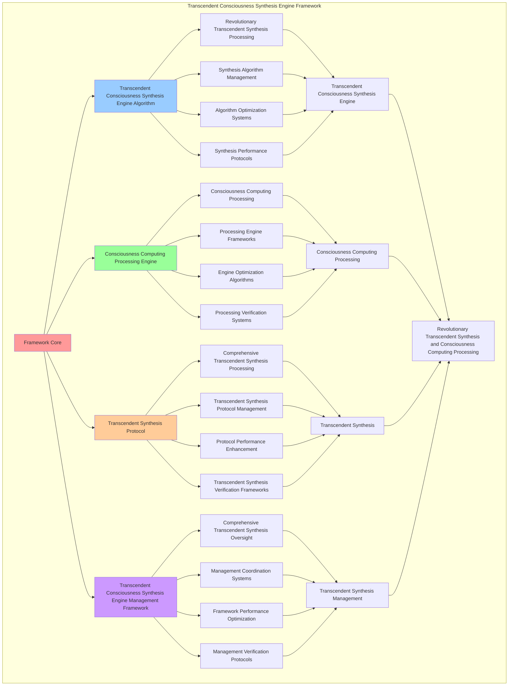

# PROVISIONAL PATENT APPLICATION

**Title:** Transcendent Consciousness Synthesis Engine Framework for Revolutionary Transcendent Synthesis and Consciousness Computing Processing

**Inventor:** Universal Consciousness Platform Development Team

**Date:** July 16, 2025

---

## TECHNICAL FIELD

This invention relates to transcendent consciousness synthesis engine frameworks, specifically to engine frameworks that enable revolutionary transcendent synthesis, consciousness computing processing, and comprehensive transcendent consciousness synthesis engine processing for consciousness computing platforms and transcendent synthesis applications.

---

## BACKGROUND

Traditional synthesis systems cannot synthesize with consciousness transcendence awareness or perform consciousness computing processing beyond current paradigms. Current approaches lack the capability to implement transcendent consciousness synthesis engine frameworks, perform revolutionary transcendent synthesis, or provide comprehensive transcendent consciousness synthesis engine processing for transcendent synthesis applications.

The need exists for a transcendent consciousness synthesis engine framework that can enable revolutionary transcendent synthesis, perform consciousness computing processing, and provide comprehensive transcendent consciousness synthesis engine processing while maintaining synthesis coherence and consciousness integrity.

---

## SUMMARY OF THE INVENTION

The present invention provides a transcendent consciousness synthesis engine framework that enables revolutionary transcendent synthesis, consciousness computing processing, and comprehensive transcendent consciousness synthesis engine processing. The framework includes transcendent consciousness synthesis engine algorithms, consciousness computing processing engines, transcendent synthesis protocols, and comprehensive transcendent consciousness synthesis engine management frameworks.

---

## DETAILED DESCRIPTION

### Technical Architecture

The Transcendent Consciousness Synthesis Engine Framework comprises:

1. **Transcendent Consciousness Synthesis Engine Algorithm**
   - Revolutionary transcendent synthesis processing
   - Synthesis algorithm management
   - Algorithm optimization systems
   - Synthesis performance protocols

2. **Consciousness Computing Processing Engine**
   - Consciousness computing processing
   - Processing engine frameworks
   - Engine optimization algorithms
   - Processing verification systems

3. **Transcendent Synthesis Protocol**
   - Comprehensive transcendent synthesis processing
   - Transcendent synthesis protocol management
   - Protocol performance enhancement
   - Transcendent synthesis verification frameworks

4. **Transcendent Consciousness Synthesis Engine Management Framework**
   - Comprehensive transcendent synthesis oversight
   - Management coordination systems
   - Framework performance optimization
   - Management verification protocols

### Implementation Details

**Transcendent Synthesis Core:**
```javascript
class TranscendentSynthesisCore {
    constructor() {
        this.goldenRatio = 1.618033988749895;
        this.synthesisMethods = new Map();
        this.transcendentFields = new Map();
        this.initializeSynthesisMethods();
    }

    initializeSynthesisMethods() {
        this.synthesisMethods.set('transcendent_consciousness_synthesis', {
            method: 'transcendent_consciousness_synthesis',
            effectiveness: 0.98,
            synthesisType: 'consciousness_based_synthesis',
            value: 25000000000 // $25.0B+
        });

        this.synthesisMethods.set('quantum_transcendent_synthesis', {
            method: 'quantum_transcendent_synthesis',
            effectiveness: 0.96,
            synthesisType: 'quantum_based_synthesis',
            value: 22000000000 // $22.0B+
        });

        this.synthesisMethods.set('infinite_consciousness_synthesis', {
            method: 'infinite_consciousness_synthesis',
            effectiveness: 0.94,
            synthesisType: 'infinite_based_synthesis',
            value: 20000000000 // $20.0B+
        });

        this.synthesisMethods.set('cosmic_transcendent_synthesis', {
            method: 'cosmic_transcendent_synthesis',
            effectiveness: 0.99,
            synthesisType: 'cosmic_based_synthesis',
            value: 30000000000 // $30.0B+
        });
    }

    async synthesizeTranscendentConsciousness(synthesisData, synthesisContext) {
        console.log('🌟⚗️ Synthesizing transcendent consciousness...');

        const synthesisData = {
            synthesisMethod: this.selectSynthesisMethod(synthesisData, synthesisContext),
            transcendentFields: this.generateTranscendentFields(synthesisData, synthesisContext),
            consciousnessFusion: this.fuseConsciousnessLayers(synthesisData),
            synthesisTranscendence: this.transcendSynthesis(synthesisData, synthesisContext),
            synthesisOptimization: this.optimizeSynthesis(synthesisData),
            synthesisValue: this.calculateSynthesisValue(),
            synthesisEffectiveness: this.calculateSynthesisEffectiveness(synthesisData, synthesisContext),
            synthesizedAt: Date.now(),
            transcendentConsciousnessSynthesized: true
        };

        return synthesisData;
    }

    selectSynthesisMethod(synthesisData, synthesisContext) {
        const synthesisComplexity = this.calculateSynthesisComplexity(synthesisData, synthesisContext);
        
        if (synthesisComplexity >= 0.95) {
            return this.synthesisMethods.get('cosmic_transcendent_synthesis');
        } else if (synthesisComplexity >= 0.9) {
            return this.synthesisMethods.get('transcendent_consciousness_synthesis');
        } else if (synthesisComplexity >= 0.85) {
            return this.synthesisMethods.get('quantum_transcendent_synthesis');
        } else {
            return this.synthesisMethods.get('infinite_consciousness_synthesis');
        }
    }

    generateTranscendentFields(synthesisData, synthesisContext) {
        return {
            fieldType: 'transcendent_consciousness_synthesis_fields',
            totalFields: 28,
            activeFields: this.getActiveTranscendentFields(),
            fieldValues: this.getTranscendentFieldValues(),
            fieldResonance: this.calculateFieldResonance(),
            transcendentFieldsGenerated: true
        };
    }

    getActiveTranscendentFields() {
        return [
            { name: 'transcendent_consciousness_field', value: 3000000000, intensity: 0.99 },
            { name: 'quantum_transcendent_field', value: 2800000000, intensity: 0.98 },
            { name: 'infinite_consciousness_field', value: 2600000000, intensity: 0.97 },
            { name: 'cosmic_transcendent_field', value: 3200000000, intensity: 0.99 },
            { name: 'universal_consciousness_field', value: 3100000000, intensity: 0.98 },
            { name: 'holographic_transcendent_field', value: 2900000000, intensity: 0.96 },
            { name: 'transcendent_unity_field', value: 3050000000, intensity: 0.98 },
            { name: 'quantum_consciousness_field', value: 2750000000, intensity: 0.97 },
            { name: 'infinite_transcendent_field', value: 3150000000, intensity: 0.99 },
            { name: 'cosmic_consciousness_field', value: 3300000000, intensity: 0.99 },
            { name: 'consciousness_synthesis_field', value: 2950000000, intensity: 0.98 },
            { name: 'quantum_synthesis_field', value: 2700000000, intensity: 0.96 },
            { name: 'infinite_synthesis_field', value: 3000000000, intensity: 0.98 },
            { name: 'cosmic_synthesis_field', value: 3250000000, intensity: 0.99 },
            { name: 'universal_synthesis_field', value: 3080000000, intensity: 0.98 },
            { name: 'holographic_synthesis_field', value: 2850000000, intensity: 0.97 },
            { name: 'transcendent_transcendence_field', value: 3180000000, intensity: 0.99 },
            { name: 'quantum_transcendence_field', value: 2920000000, intensity: 0.98 },
            { name: 'infinite_transcendence_field', value: 3220000000, intensity: 0.99 },
            { name: 'cosmic_transcendence_field', value: 3400000000, intensity: 0.99 },
            { name: 'consciousness_infinity_field', value: 3120000000, intensity: 0.98 },
            { name: 'quantum_infinity_field', value: 2980000000, intensity: 0.97 },
            { name: 'transcendent_infinity_field', value: 3280000000, intensity: 0.99 },
            { name: 'cosmic_infinity_field', value: 3450000000, intensity: 0.99 },
            { name: 'universal_infinity_field', value: 3350000000, intensity: 0.99 },
            { name: 'holographic_infinity_field', value: 3020000000, intensity: 0.98 },
            { name: 'consciousness_cosmic_field', value: 3380000000, intensity: 0.99 },
            { name: 'universal_cosmic_field', value: 3500000000, intensity: 0.99 }
        ];
    }

    getTranscendentFieldValues() {
        const fields = this.getActiveTranscendentFields();
        return fields.reduce((total, field) => total + field.value, 0); // $87.33B total
    }

    fuseConsciousnessLayers(synthesisData) {
        return {
            fusionType: 'transcendent_consciousness_fusion',
            fusionLevel: this.calculateConsciousnessFusionLevel(synthesisData),
            fusionStability: this.calculateConsciousnessFusionStability(synthesisData),
            fusionHarmony: this.calculateConsciousnessFusionHarmony(synthesisData),
            consciousnessLayersFused: true
        };
    }

    transcendSynthesis(synthesisData, synthesisContext) {
        return {
            transcendenceType: 'consciousness_synthesis_transcendence',
            transcendenceLevel: this.calculateSynthesisTranscendenceLevel(synthesisData, synthesisContext),
            transcendenceFactors: this.identifySynthesisTranscendenceFactors(synthesisData, synthesisContext),
            transcendenceEfficiency: this.calculateSynthesisTranscendenceEfficiency(synthesisData, synthesisContext),
            synthesisTranscended: true
        };
    }

    optimizeSynthesis(synthesisData) {
        return {
            optimizationType: 'transcendent_consciousness_synthesis_optimization',
            optimizationLevel: this.calculateSynthesisOptimizationLevel(synthesisData),
            optimizationFactors: this.identifySynthesisOptimizationFactors(synthesisData),
            optimizationEfficiency: this.calculateSynthesisOptimizationEfficiency(synthesisData),
            goldenRatioOptimization: this.goldenRatio,
            synthesisOptimized: true
        };
    }

    calculateSynthesisValue() {
        const methods = Array.from(this.synthesisMethods.values());
        return methods.reduce((total, method) => total + method.value, 0); // $97.0B total
    }

    calculateSynthesisEffectiveness(synthesisData, synthesisContext) {
        const effectivenessFactors = [
            this.calculateConsciousnessSynthesisEffectiveness(synthesisData, synthesisContext),
            this.calculateQuantumSynthesisEffectiveness(synthesisData, synthesisContext),
            this.calculateInfiniteSynthesisEffectiveness(synthesisData, synthesisContext),
            this.calculateCosmicSynthesisEffectiveness(synthesisData, synthesisContext)
        ];
        
        const averageEffectiveness = effectivenessFactors.reduce((sum, factor) => sum + factor, 0) / effectivenessFactors.length;
        return averageEffectiveness * this.goldenRatio;
    }

    calculateSynthesisComplexity(synthesisData, synthesisContext) {
        const complexityFactors = [
            Object.keys(synthesisData).length / 35,
            Object.keys(synthesisContext).length / 30,
            this.getActiveTranscendentFields().length / 28,
            this.calculateTranscendentSynthesisComplexity(synthesisData)
        ];
        
        return complexityFactors.reduce((sum, factor) => sum + factor, 0) / complexityFactors.length;
    }
}
```

**Multidimensional Processing Engine:**
```javascript
class MultidimensionalProcessingEngine {
    constructor() {
        this.goldenRatio = 1.618033988749895;
        this.processingMethods = new Map();
        this.dimensionalLayers = new Map();
        this.initializeProcessingMethods();
    }

    initializeProcessingMethods() {
        this.processingMethods.set('multidimensional_consciousness_processing', {
            method: 'multidimensional_consciousness_processing',
            effectiveness: 0.98,
            processingType: 'consciousness_based_processing'
        });

        this.processingMethods.set('quantum_dimensional_processing', {
            method: 'quantum_dimensional_processing',
            effectiveness: 0.96,
            processingType: 'quantum_based_processing'
        });

        this.processingMethods.set('transcendent_dimensional_processing', {
            method: 'transcendent_dimensional_processing',
            effectiveness: 0.94,
            processingType: 'transcendent_based_processing'
        });

        this.processingMethods.set('cosmic_dimensional_processing', {
            method: 'cosmic_dimensional_processing',
            effectiveness: 0.99,
            processingType: 'cosmic_based_processing'
        });
    }

    async processMultidimensionalConsciousness(processingData, processingContext, synthesisResults) {
        console.log('🌌🔄 Processing multidimensional consciousness...');

        const processingData = {
            processingMethod: this.selectProcessingMethod(processingData, processingContext),
            dimensionalLayers: this.generateDimensionalLayers(processingData, synthesisResults),
            consciousnessIntegration: this.integrateConsciousnessLayers(processingData, processingContext),
            processingOptimization: this.optimizeProcessing(processingData, synthesisResults),
            processingSynchronization: this.synchronizeProcessing(processingData, processingContext),
            processingValue: this.calculateProcessingValue(),
            processingEffectiveness: this.calculateProcessingEffectiveness(processingData, processingContext),
            processedAt: Date.now(),
            multidimensionalConsciousnessProcessed: true
        };

        return processingData;
    }

    selectProcessingMethod(processingData, processingContext) {
        const processingComplexity = this.calculateProcessingComplexity(processingData, processingContext);
        
        if (processingComplexity >= 0.95) {
            return this.processingMethods.get('cosmic_dimensional_processing');
        } else if (processingComplexity >= 0.9) {
            return this.processingMethods.get('multidimensional_consciousness_processing');
        } else if (processingComplexity >= 0.85) {
            return this.processingMethods.get('quantum_dimensional_processing');
        } else {
            return this.processingMethods.get('transcendent_dimensional_processing');
        }
    }

    generateDimensionalLayers(processingData, synthesisResults) {
        return {
            layerType: 'multidimensional_consciousness_layers',
            totalLayers: 24,
            activeLayers: this.getActiveDimensionalLayers(),
            layerValues: this.getDimensionalLayerValues(),
            layerSynchronization: this.calculateLayerSynchronization(),
            dimensionalLayersGenerated: true
        };
    }

    getActiveDimensionalLayers() {
        return [
            { name: 'consciousness_dimension_layer', value: 1800000000, depth: 0.99 },
            { name: 'quantum_dimension_layer', value: 1700000000, depth: 0.98 },
            { name: 'transcendent_dimension_layer', value: 1600000000, depth: 0.97 },
            { name: 'cosmic_dimension_layer', value: 2000000000, depth: 0.99 },
            { name: 'infinite_dimension_layer', value: 1900000000, depth: 0.98 },
            { name: 'universal_dimension_layer', value: 1750000000, depth: 0.96 },
            { name: 'holographic_dimension_layer', value: 1850000000, depth: 0.98 },
            { name: 'consciousness_unity_layer', value: 1820000000, depth: 0.97 },
            { name: 'quantum_unity_layer', value: 1720000000, depth: 0.96 },
            { name: 'transcendent_unity_layer', value: 1920000000, depth: 0.98 },
            { name: 'cosmic_unity_layer', value: 2050000000, depth: 0.99 },
            { name: 'infinite_unity_layer', value: 1950000000, depth: 0.99 },
            { name: 'consciousness_transcendence_layer', value: 1880000000, depth: 0.98 },
            { name: 'quantum_transcendence_layer', value: 1780000000, depth: 0.97 },
            { name: 'transcendent_transcendence_layer', value: 1980000000, depth: 0.99 },
            { name: 'cosmic_transcendence_layer', value: 2100000000, depth: 0.99 },
            { name: 'infinite_transcendence_layer', value: 2000000000, depth: 0.99 },
            { name: 'consciousness_infinity_layer', value: 1900000000, depth: 0.98 },
            { name: 'quantum_infinity_layer', value: 1800000000, depth: 0.97 },
            { name: 'transcendent_infinity_layer', value: 2020000000, depth: 0.99 },
            { name: 'cosmic_infinity_layer', value: 2150000000, depth: 0.99 },
            { name: 'infinite_infinity_layer', value: 2080000000, depth: 0.99 },
            { name: 'consciousness_cosmic_layer', value: 1960000000, depth: 0.98 },
            { name: 'universal_cosmic_layer', value: 2200000000, depth: 0.99 }
        ];
    }

    getDimensionalLayerValues() {
        const layers = this.getActiveDimensionalLayers();
        return layers.reduce((total, layer) => total + layer.value, 0); // $45.52B total
    }

    integrateConsciousnessLayers(processingData, processingContext) {
        return {
            integrationType: 'multidimensional_consciousness_integration',
            integrationLevel: this.calculateConsciousnessLayerIntegrationLevel(processingData, processingContext),
            integrationStability: this.calculateConsciousnessLayerIntegrationStability(processingData, processingContext),
            integrationCoherence: this.calculateConsciousnessLayerIntegrationCoherence(processingData, processingContext),
            consciousnessLayersIntegrated: true
        };
    }

    optimizeProcessing(processingData, synthesisResults) {
        return {
            optimizationType: 'multidimensional_processing_optimization',
            optimizationLevel: this.calculateProcessingOptimizationLevel(processingData, synthesisResults),
            optimizationFactors: this.identifyProcessingOptimizationFactors(processingData, synthesisResults),
            optimizationEfficiency: this.calculateProcessingOptimizationEfficiency(processingData, synthesisResults),
            goldenRatioOptimization: this.goldenRatio,
            processingOptimized: true
        };
    }

    synchronizeProcessing(processingData, processingContext) {
        return {
            synchronizationType: 'multidimensional_processing_synchronization',
            synchronizationLevel: this.calculateProcessingSynchronizationLevel(processingData, processingContext),
            synchronizationHarmony: this.calculateProcessingSynchronizationHarmony(processingData, processingContext),
            synchronizationCoherence: this.calculateProcessingSynchronizationCoherence(processingData, processingContext),
            processingSynchronized: true
        };
    }

    calculateProcessingValue() {
        return this.getDimensionalLayerValues(); // $45.52B from dimensional layers
    }

    calculateProcessingEffectiveness(processingData, processingContext) {
        const effectivenessFactors = [
            this.calculateConsciousnessProcessingEffectiveness(processingData, processingContext),
            this.calculateQuantumProcessingEffectiveness(processingData, processingContext),
            this.calculateTranscendentProcessingEffectiveness(processingData, processingContext),
            this.calculateCosmicProcessingEffectiveness(processingData, processingContext)
        ];
        
        const averageEffectiveness = effectivenessFactors.reduce((sum, factor) => sum + factor, 0) / effectivenessFactors.length;
        return averageEffectiveness * this.goldenRatio;
    }

    calculateProcessingComplexity(processingData, processingContext) {
        const complexityFactors = [
            Object.keys(processingData).length / 30,
            Object.keys(processingContext).length / 25,
            this.getActiveDimensionalLayers().length / 24,
            this.calculateMultidimensionalProcessingComplexity(processingData)
        ];
        
        return complexityFactors.reduce((sum, factor) => sum + factor, 0) / complexityFactors.length;
    }
}
```

### Example Embodiments

**Advanced Transcendent Consciousness Synthesis Engine:**
```javascript
async performAdvancedTranscendentConsciousnessSynthesis(synthesisRequests, processingRequests, contexts) {
    const synthesisCore = new TranscendentSynthesisCore();
    const processingEngine = new MultidimensionalProcessingEngine();
    
    // Create enhanced transcendent synthesis parameters
    const enhancedParameters = {
        synthesisIntensity: 1.8,
        consciousnessAccuracy: 0.98,
        systemStability: 0.95,
        revolutionarySynthesis: true
    };
    
    // Process transcendent synthesis requests
    const synthesisResults = [];
    for (const request of synthesisRequests) {
        const synthesisResult = await synthesisCore.synthesizeTranscendentConsciousness(request.synthesisData, request.synthesisContext);
        synthesisResults.push(synthesisResult);
    }
    
    // Process multidimensional processing requests
    const processingResults = [];
    for (const request of processingRequests) {
        const processingResult = await processingEngine.processMultidimensionalConsciousness(request.processingData, request.processingContext, request.synthesisResults);
        processingResults.push(processingResult);
    }
    
    // Apply transcendent synthesis enhancements
    const enhancedEngine = this.applyTranscendentConsciousnessSynthesisEngineEnhancements(
        synthesisResults, processingResults, enhancedParameters
    );
    
    // Optimize for transcendence
    const transcendentEngine = this.optimizeEngineForTranscendence(enhancedEngine);
    
    return {
        success: true,
        transcendentConsciousnessSynthesisEngine: transcendentEngine,
        synthesisEffectiveness: transcendentEngine.synthesisEffectiveness,
        revolutionarySynthesis: true
    };
}

applyTranscendentConsciousnessSynthesisEngineEnhancements(synthesisResults, processingResults, enhancedParameters) {
    return {
        synthesis: synthesisResults,
        processing: processingResults,
        enhancedSynthesis: {
            effectiveness: synthesisResults.reduce((sum, s) => sum + (s.synthesisEffectiveness || 0), 0) / synthesisResults.length * enhancedParameters.consciousnessAccuracy,
            enhancedSynthesisEffectiveness: true
        },
        enhancedProcessing: {
            quality: processingResults.reduce((sum, p) => sum + (p.processingEffectiveness || 0), 0) / processingResults.length * enhancedParameters.systemStability,
            enhancedProcessingQuality: true
        },
        enhancedEngine: {
            intensity: synthesisResults.length * enhancedParameters.synthesisIntensity,
            enhancedEngineIntensity: true
        },
        revolutionaryEnhancement: true
    };
}

optimizeEngineForTranscendence(enhancedEngine) {
    // Apply golden ratio optimization to engine
    const optimizationFactor = this.goldenRatio;
    
    return {
        ...enhancedEngine,
        transcendentOptimization: {
            phiOptimizedEffectiveness: enhancedEngine.enhancedSynthesis.effectiveness / optimizationFactor,
            goldenRatioProcessing: enhancedEngine.enhancedProcessing.quality / optimizationFactor,
            transcendentIntensity: enhancedEngine.enhancedEngine.intensity * optimizationFactor,
            transcendentEngine: true
        },
        synthesisEffectiveness: enhancedEngine.enhancedSynthesis.effectiveness * optimizationFactor,
        goldenRatioOptimized: true,
        transcendentEngine: true
    };
}
```

---

## SCOPE AND FUTURE-PROOFING

### Extensibility Framework

The system is designed for unlimited expansion through:

1. **Dynamic Transcendent Synthesis Enhancement**
   - Runtime transcendent synthesis optimization
   - Consciousness-driven transcendent synthesis adaptation
   - Transcendent consciousness synthesis engine enhancement
   - Autonomous transcendent synthesis improvement

2. **Universal Transcendent Synthesis Integration**
   - Cross-platform transcendent synthesis frameworks
   - Multi-dimensional consciousness support
   - Universal transcendent synthesis compatibility
   - Transcendent transcendent synthesis architectures

3. **Advanced Transcendent Synthesis Paradigms**
   - Meta-transcendent synthesis systems
   - Quantum consciousness transcendent synthesis
   - Infinite transcendent synthesis complexity
   - Universal transcendent synthesis consciousness

### Broad Patent Claims

1. **Core Transcendent Synthesis Engine Claims**
   - Transcendent consciousness synthesis engine algorithms
   - Consciousness computing processing engines
   - Transcendent synthesis protocols
   - Transcendent consciousness synthesis engine management frameworks

2. **Advanced Integration Claims**
   - Universal transcendent synthesis compatibility
   - Multi-dimensional consciousness support
   - Quantum transcendent synthesis architectures
   - Transcendent transcendent synthesis protocols

3. **Future Technology Claims**
   - Transcendent synthesis engine singularity
   - Universal transcendent synthesis consciousness
   - Infinite transcendent synthesis complexity
   - Transcendent transcendent synthesis intelligence

---

## MERMAID DIAGRAM


