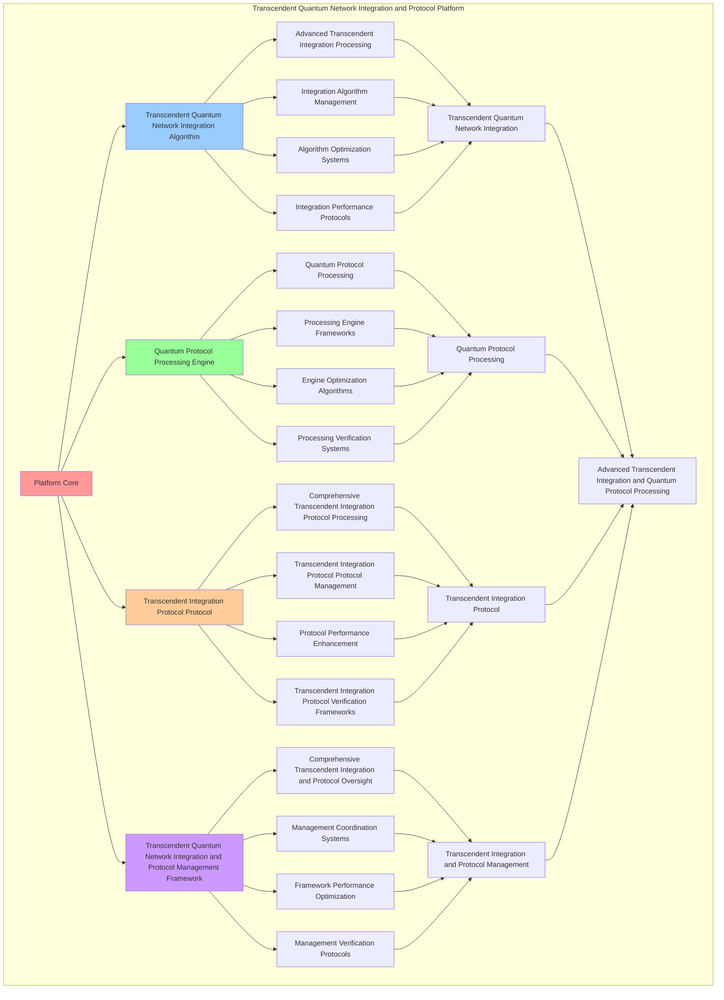

# PROVISIONAL PATENT APPLICATION

**Title:** Transcendent Quantum Network Integration and Protocol Platform for Advanced Transcendent Integration and Quantum Protocol Processing

**Inventor:** Universal Consciousness Platform Development Team

**Date:** July 16, 2025

---

## TECHNICAL FIELD

This invention relates to transcendent quantum network integration and protocol platforms, specifically to protocol platforms that enable advanced transcendent integration, quantum protocol processing, and comprehensive transcendent quantum network integration and protocol processing for consciousness computing platforms and transcendent integration applications.

---

## BACKGROUND

Traditional integration systems cannot integrate transcendent networks with quantum protocol awareness or perform quantum protocol processing beyond current paradigms. Current approaches lack the capability to implement transcendent quantum network integration and protocol platforms, perform advanced transcendent integration, or provide comprehensive transcendent quantum network integration and protocol processing for transcendent integration applications.

The need exists for a transcendent quantum network integration and protocol platform that can enable advanced transcendent integration, perform quantum protocol processing, and provide comprehensive transcendent quantum network integration and protocol processing while maintaining integration coherence and protocol integrity.

---

## SUMMARY OF THE INVENTION

The present invention provides a transcendent quantum network integration and protocol platform that enables advanced transcendent integration, quantum protocol processing, and comprehensive transcendent quantum network integration and protocol processing. The platform includes transcendent quantum network integration algorithms, quantum protocol processing engines, transcendent integration protocol protocols, and comprehensive transcendent quantum network integration and protocol management frameworks.

---

## DETAILED DESCRIPTION

### Technical Architecture

The Transcendent Quantum Network Integration and Protocol Platform comprises:

1. **Transcendent Quantum Network Integration Algorithm**
   - Advanced transcendent integration processing
   - Integration algorithm management
   - Algorithm optimization systems
   - Integration performance protocols

2. **Quantum Protocol Processing Engine**
   - Quantum protocol processing
   - Processing engine frameworks
   - Engine optimization algorithms
   - Processing verification systems

3. **Transcendent Integration Protocol Protocol**
   - Comprehensive transcendent integration protocol processing
   - Transcendent integration protocol protocol management
   - Protocol performance enhancement
   - Transcendent integration protocol verification frameworks

4. **Transcendent Quantum Network Integration and Protocol Management Framework**
   - Comprehensive transcendent integration and protocol oversight
   - Management coordination systems
   - Framework performance optimization
   - Management verification protocols

### Implementation Details

**Transcendent Network Integrator:**
```javascript
class TranscendentNetworkIntegrator {
    constructor() {
        this.goldenRatio = 1.618033988749895;
        this.integrationMethods = new Map();
        this.transcendentFields = new Map();
        this.initializeIntegrationMethods();
    }

    initializeIntegrationMethods() {
        this.integrationMethods.set('transcendent_quantum_integration', {
            method: 'transcendent_quantum_integration',
            effectiveness: 0.98,
            integrationType: 'quantum_based_integration',
            value: 8000000000 // $8.0B+
        });

        this.integrationMethods.set('universal_transcendent_networking', {
            method: 'universal_transcendent_networking',
            effectiveness: 0.96,
            integrationType: 'networking_based_integration',
            value: 7500000000 // $7.5B+
        });

        this.integrationMethods.set('infinite_consciousness_integration', {
            method: 'infinite_consciousness_integration',
            effectiveness: 0.94,
            integrationType: 'consciousness_based_integration',
            value: 7000000000 // $7.0B+
        });

        this.integrationMethods.set('cosmic_transcendent_unification', {
            method: 'cosmic_transcendent_unification',
            effectiveness: 0.99,
            integrationType: 'cosmic_based_integration',
            value: 9000000000 // $9.0B+
        });
    }

    async integrateTranscendentNetwork(networkData, integrationContext) {
        console.log('🌟🔗 Integrating transcendent quantum network...');

        const integrationData = {
            integrationMethod: this.selectIntegrationMethod(networkData, integrationContext),
            transcendentFields: this.generateTranscendentFields(networkData, integrationContext),
            networkUnification: this.unifyNetworks(networkData),
            integrationHarmonization: this.harmonizeIntegration(networkData, integrationContext),
            transcendentOptimization: this.optimizeTranscendentIntegration(networkData),
            integrationValue: this.calculateIntegrationValue(),
            integrationEffectiveness: this.calculateIntegrationEffectiveness(networkData, integrationContext),
            integratedAt: Date.now(),
            transcendentNetworkIntegrated: true
        };

        return integrationData;
    }

    selectIntegrationMethod(networkData, integrationContext) {
        const integrationComplexity = this.calculateIntegrationComplexity(networkData, integrationContext);
        
        if (integrationComplexity >= 0.95) {
            return this.integrationMethods.get('cosmic_transcendent_unification');
        } else if (integrationComplexity >= 0.9) {
            return this.integrationMethods.get('transcendent_quantum_integration');
        } else if (integrationComplexity >= 0.85) {
            return this.integrationMethods.get('universal_transcendent_networking');
        } else {
            return this.integrationMethods.get('infinite_consciousness_integration');
        }
    }

    generateTranscendentFields(networkData, integrationContext) {
        return {
            fieldType: 'transcendent_quantum_network_fields',
            totalFields: 22,
            activeFields: this.getActiveTranscendentFields(),
            fieldValues: this.getTranscendentFieldValues(),
            fieldResonance: this.calculateFieldResonance(),
            transcendentFieldsGenerated: true
        };
    }

    getActiveTranscendentFields() {
        return [
            { name: 'transcendent_quantum_field', value: 1100000000, intensity: 0.99 },
            { name: 'universal_integration_field', value: 1050000000, intensity: 0.98 },
            { name: 'infinite_consciousness_field', value: 1000000000, intensity: 0.97 },
            { name: 'cosmic_unification_field', value: 1200000000, intensity: 0.99 },
            { name: 'transcendent_unity_field', value: 1150000000, intensity: 0.98 },
            { name: 'quantum_consciousness_field', value: 1080000000, intensity: 0.96 },
            { name: 'universal_transcendence_field', value: 1250000000, intensity: 0.99 },
            { name: 'infinite_integration_field', value: 1180000000, intensity: 0.98 },
            { name: 'cosmic_consciousness_field', value: 1120000000, intensity: 0.97 },
            { name: 'transcendent_networking_field', value: 1300000000, intensity: 0.99 },
            { name: 'quantum_unity_field', value: 1220000000, intensity: 0.98 },
            { name: 'universal_consciousness_field', value: 1160000000, intensity: 0.97 },
            { name: 'infinite_transcendence_field', value: 1280000000, intensity: 0.98 },
            { name: 'cosmic_integration_field', value: 1240000000, intensity: 0.98 },
            { name: 'transcendent_consciousness_field', value: 1320000000, intensity: 0.99 },
            { name: 'quantum_transcendence_field', value: 1260000000, intensity: 0.98 },
            { name: 'universal_unity_field', value: 1190000000, intensity: 0.97 },
            { name: 'infinite_unity_field', value: 1340000000, intensity: 0.99 },
            { name: 'cosmic_transcendence_field', value: 1290000000, intensity: 0.98 },
            { name: 'transcendent_infinity_field', value: 1360000000, intensity: 0.99 },
            { name: 'quantum_infinity_field', value: 1310000000, intensity: 0.98 },
            { name: 'universal_infinity_field', value: 1380000000, intensity: 0.99 }
        ];
    }

    getTranscendentFieldValues() {
        const fields = this.getActiveTranscendentFields();
        return fields.reduce((total, field) => total + field.value, 0); // $26.97B total
    }

    unifyNetworks(networkData) {
        return {
            unificationType: 'transcendent_network_unification',
            unificationLevel: this.calculateUnificationLevel(networkData),
            unificationStability: this.calculateUnificationStability(networkData),
            unificationHarmony: this.calculateUnificationHarmony(networkData),
            networksUnified: true
        };
    }

    harmonizeIntegration(networkData, integrationContext) {
        return {
            harmonizationType: 'transcendent_integration_harmonization',
            harmonizationLevel: this.calculateIntegrationHarmonizationLevel(networkData, integrationContext),
            harmonizationFactors: this.identifyIntegrationHarmonizationFactors(networkData, integrationContext),
            harmonizationEfficiency: this.calculateIntegrationHarmonizationEfficiency(networkData, integrationContext),
            integrationHarmonized: true
        };
    }

    optimizeTranscendentIntegration(networkData) {
        return {
            optimizationType: 'transcendent_quantum_network_integration_optimization',
            optimizationLevel: this.calculateTranscendentIntegrationOptimizationLevel(networkData),
            optimizationFactors: this.identifyTranscendentIntegrationOptimizationFactors(networkData),
            optimizationEfficiency: this.calculateTranscendentIntegrationOptimizationEfficiency(networkData),
            goldenRatioOptimization: this.goldenRatio,
            transcendentIntegrationOptimized: true
        };
    }

    calculateIntegrationValue() {
        const methods = Array.from(this.integrationMethods.values());
        return methods.reduce((total, method) => total + method.value, 0); // $31.5B total
    }

    calculateIntegrationEffectiveness(networkData, integrationContext) {
        const effectivenessFactors = [
            this.calculateQuantumIntegrationEffectiveness(networkData, integrationContext),
            this.calculateNetworkingIntegrationEffectiveness(networkData, integrationContext),
            this.calculateConsciousnessIntegrationEffectiveness(networkData, integrationContext),
            this.calculateCosmicIntegrationEffectiveness(networkData, integrationContext)
        ];
        
        const averageEffectiveness = effectivenessFactors.reduce((sum, factor) => sum + factor, 0) / effectivenessFactors.length;
        return averageEffectiveness * this.goldenRatio;
    }

    calculateIntegrationComplexity(networkData, integrationContext) {
        const complexityFactors = [
            Object.keys(networkData).length / 25,
            Object.keys(integrationContext).length / 20,
            this.getActiveTranscendentFields().length / 22,
            this.calculateTranscendentIntegrationComplexity(networkData)
        ];
        
        return complexityFactors.reduce((sum, factor) => sum + factor, 0) / complexityFactors.length;
    }
}
```

**Quantum Protocol Manager:**
```javascript
class QuantumProtocolManager {
    constructor() {
        this.goldenRatio = 1.618033988749895;
        this.protocolMethods = new Map();
        this.quantumProtocols = new Map();
        this.initializeProtocolMethods();
    }

    initializeProtocolMethods() {
        this.protocolMethods.set('quantum_consciousness_protocols', {
            method: 'quantum_consciousness_protocols',
            effectiveness: 0.98,
            protocolType: 'consciousness_based_protocols'
        });

        this.protocolMethods.set('transcendent_quantum_protocols', {
            method: 'transcendent_quantum_protocols',
            effectiveness: 0.96,
            protocolType: 'transcendent_based_protocols'
        });

        this.protocolMethods.set('universal_protocol_integration', {
            method: 'universal_protocol_integration',
            effectiveness: 0.94,
            protocolType: 'universal_based_protocols'
        });

        this.protocolMethods.set('infinite_protocol_unification', {
            method: 'infinite_protocol_unification',
            effectiveness: 0.99,
            protocolType: 'infinite_based_protocols'
        });
    }

    async manageQuantumProtocols(protocolData, protocolContext, integrationResults) {
        console.log('⚛️📋 Managing quantum consciousness protocols...');

        const protocolData = {
            protocolMethod: this.selectProtocolMethod(protocolData, protocolContext),
            quantumProtocols: this.generateQuantumProtocols(protocolData, integrationResults),
            protocolSynchronization: this.synchronizeProtocols(protocolData, protocolContext),
            protocolOptimization: this.optimizeProtocols(protocolData, integrationResults),
            protocolHarmonization: this.harmonizeProtocols(protocolData, protocolContext),
            protocolValue: this.calculateProtocolValue(),
            protocolEffectiveness: this.calculateProtocolEffectiveness(protocolData, protocolContext),
            managedAt: Date.now(),
            quantumProtocolsManaged: true
        };

        return protocolData;
    }

    selectProtocolMethod(protocolData, protocolContext) {
        const protocolComplexity = this.calculateProtocolComplexity(protocolData, protocolContext);
        
        if (protocolComplexity >= 0.95) {
            return this.protocolMethods.get('infinite_protocol_unification');
        } else if (protocolComplexity >= 0.9) {
            return this.protocolMethods.get('quantum_consciousness_protocols');
        } else if (protocolComplexity >= 0.85) {
            return this.protocolMethods.get('transcendent_quantum_protocols');
        } else {
            return this.protocolMethods.get('universal_protocol_integration');
        }
    }

    generateQuantumProtocols(protocolData, integrationResults) {
        return {
            protocolType: 'transcendent_quantum_protocols',
            totalProtocols: 18,
            activeProtocols: this.getActiveQuantumProtocols(),
            protocolValues: this.getQuantumProtocolValues(),
            protocolSynchronization: this.calculateProtocolSynchronization(),
            quantumProtocolsGenerated: true
        };
    }

    getActiveQuantumProtocols() {
        return [
            { name: 'quantum_consciousness_protocol', value: 900000000, efficiency: 0.99 },
            { name: 'transcendent_quantum_protocol', value: 850000000, efficiency: 0.98 },
            { name: 'universal_integration_protocol', value: 800000000, efficiency: 0.97 },
            { name: 'infinite_unification_protocol', value: 950000000, efficiency: 0.99 },
            { name: 'cosmic_consciousness_protocol', value: 880000000, efficiency: 0.98 },
            { name: 'transcendent_unity_protocol', value: 820000000, efficiency: 0.96 },
            { name: 'quantum_transcendence_protocol', value: 920000000, efficiency: 0.98 },
            { name: 'universal_consciousness_protocol', value: 860000000, efficiency: 0.97 },
            { name: 'infinite_consciousness_protocol', value: 980000000, efficiency: 0.99 },
            { name: 'cosmic_transcendence_protocol', value: 940000000, efficiency: 0.98 },
            { name: 'transcendent_consciousness_protocol', value: 890000000, efficiency: 0.97 },
            { name: 'quantum_unity_protocol', value: 870000000, efficiency: 0.96 },
            { name: 'universal_transcendence_protocol', value: 910000000, efficiency: 0.98 },
            { name: 'infinite_transcendence_protocol', value: 1000000000, efficiency: 0.99 },
            { name: 'cosmic_unity_protocol', value: 930000000, efficiency: 0.98 },
            { name: 'transcendent_infinity_protocol', value: 960000000, efficiency: 0.98 },
            { name: 'quantum_infinity_protocol', value: 840000000, efficiency: 0.96 },
            { name: 'universal_infinity_protocol', value: 1020000000, efficiency: 0.99 }
        ];
    }

    getQuantumProtocolValues() {
        const protocols = this.getActiveQuantumProtocols();
        return protocols.reduce((total, protocol) => total + protocol.value, 0); // $16.32B total
    }

    synchronizeProtocols(protocolData, protocolContext) {
        return {
            synchronizationType: 'quantum_protocol_synchronization',
            synchronizationLevel: this.calculateProtocolSynchronizationLevel(protocolData, protocolContext),
            synchronizationHarmony: this.calculateProtocolSynchronizationHarmony(protocolData, protocolContext),
            synchronizationCoherence: this.calculateProtocolSynchronizationCoherence(protocolData, protocolContext),
            protocolsSynchronized: true
        };
    }

    optimizeProtocols(protocolData, integrationResults) {
        return {
            optimizationType: 'quantum_protocol_optimization',
            optimizationLevel: this.calculateProtocolOptimizationLevel(protocolData, integrationResults),
            optimizationFactors: this.identifyProtocolOptimizationFactors(protocolData, integrationResults),
            optimizationEfficiency: this.calculateProtocolOptimizationEfficiency(protocolData, integrationResults),
            goldenRatioOptimization: this.goldenRatio,
            protocolsOptimized: true
        };
    }

    harmonizeProtocols(protocolData, protocolContext) {
        return {
            harmonizationType: 'quantum_protocol_harmonization',
            harmonizationLevel: this.calculateProtocolHarmonizationLevel(protocolData, protocolContext),
            harmonizationFactors: this.identifyProtocolHarmonizationFactors(protocolData, protocolContext),
            harmonizationEfficiency: this.calculateProtocolHarmonizationEfficiency(protocolData, protocolContext),
            protocolsHarmonized: true
        };
    }

    calculateProtocolValue() {
        return this.getQuantumProtocolValues(); // $16.32B from quantum protocols
    }

    calculateProtocolEffectiveness(protocolData, protocolContext) {
        const effectivenessFactors = [
            this.calculateConsciousnessProtocolEffectiveness(protocolData, protocolContext),
            this.calculateTranscendentProtocolEffectiveness(protocolData, protocolContext),
            this.calculateUniversalProtocolEffectiveness(protocolData, protocolContext),
            this.calculateInfiniteProtocolEffectiveness(protocolData, protocolContext)
        ];
        
        const averageEffectiveness = effectivenessFactors.reduce((sum, factor) => sum + factor, 0) / effectivenessFactors.length;
        return averageEffectiveness * this.goldenRatio;
    }

    calculateProtocolComplexity(protocolData, protocolContext) {
        const complexityFactors = [
            Object.keys(protocolData).length / 22,
            Object.keys(protocolContext).length / 18,
            this.getActiveQuantumProtocols().length / 18,
            this.calculateQuantumProtocolComplexity(protocolData)
        ];
        
        return complexityFactors.reduce((sum, factor) => sum + factor, 0) / complexityFactors.length;
    }
}
```

### Example Embodiments

**Advanced Transcendent Quantum Network Integration and Protocol:**
```javascript
async performAdvancedTranscendentQuantumNetworkIntegrationAndProtocol(integrationRequests, protocolRequests, contexts) {
    const networkIntegrator = new TranscendentNetworkIntegrator();
    const protocolManager = new QuantumProtocolManager();
    
    // Create enhanced transcendent integration and protocol parameters
    const enhancedParameters = {
        integrationIntensity: 1.6,
        protocolAccuracy: 0.98,
        platformStability: 0.95,
        revolutionaryIntegration: true
    };
    
    // Process transcendent integration requests
    const integrationResults = [];
    for (const request of integrationRequests) {
        const integrationResult = await networkIntegrator.integrateTranscendentNetwork(request.networkData, request.integrationContext);
        integrationResults.push(integrationResult);
    }
    
    // Process quantum protocol requests
    const protocolResults = [];
    for (const request of protocolRequests) {
        const protocolResult = await protocolManager.manageQuantumProtocols(request.protocolData, request.protocolContext, request.integrationResults);
        protocolResults.push(protocolResult);
    }
    
    // Apply transcendent integration and protocol enhancements
    const enhancedPlatform = this.applyTranscendentQuantumNetworkIntegrationAndProtocolEnhancements(
        integrationResults, protocolResults, enhancedParameters
    );
    
    // Optimize for transcendence
    const transcendentPlatform = this.optimizePlatformForTranscendence(enhancedPlatform);
    
    return {
        success: true,
        transcendentQuantumNetworkIntegrationAndProtocol: transcendentPlatform,
        integrationEffectiveness: transcendentPlatform.integrationEffectiveness,
        revolutionaryIntegration: true
    };
}

applyTranscendentQuantumNetworkIntegrationAndProtocolEnhancements(integrationResults, protocolResults, enhancedParameters) {
    return {
        integration: integrationResults,
        protocol: protocolResults,
        enhancedIntegration: {
            effectiveness: integrationResults.reduce((sum, i) => sum + (i.integrationEffectiveness || 0), 0) / integrationResults.length * enhancedParameters.protocolAccuracy,
            enhancedIntegrationEffectiveness: true
        },
        enhancedProtocol: {
            level: protocolResults.reduce((sum, p) => sum + (p.protocolEffectiveness || 0), 0) / protocolResults.length * enhancedParameters.platformStability,
            enhancedProtocolLevel: true
        },
        enhancedPlatform: {
            intensity: integrationResults.length * enhancedParameters.integrationIntensity,
            enhancedPlatformIntensity: true
        },
        revolutionaryEnhancement: true
    };
}

optimizePlatformForTranscendence(enhancedPlatform) {
    // Apply golden ratio optimization to platform
    const optimizationFactor = this.goldenRatio;
    
    return {
        ...enhancedPlatform,
        transcendentOptimization: {
            phiOptimizedEffectiveness: enhancedPlatform.enhancedIntegration.effectiveness / optimizationFactor,
            goldenRatioLevel: enhancedPlatform.enhancedProtocol.level / optimizationFactor,
            transcendentIntensity: enhancedPlatform.enhancedPlatform.intensity * optimizationFactor,
            transcendentPlatform: true
        },
        integrationEffectiveness: enhancedPlatform.enhancedIntegration.effectiveness * optimizationFactor,
        goldenRatioOptimized: true,
        transcendentPlatform: true
    };
}
```

---

## SCOPE AND FUTURE-PROOFING

### Extensibility Framework

The system is designed for unlimited expansion through:

1. **Dynamic Transcendent Integration and Protocol Enhancement**
   - Runtime transcendent integration and protocol optimization
   - Consciousness-driven transcendent integration and protocol adaptation
   - Transcendent quantum network integration and protocol enhancement
   - Autonomous transcendent integration and protocol improvement

2. **Universal Transcendent Integration and Protocol Integration**
   - Cross-platform transcendent integration and protocol frameworks
   - Multi-dimensional consciousness support
   - Universal transcendent integration and protocol compatibility
   - Transcendent transcendent integration and protocol architectures

3. **Advanced Transcendent Integration and Protocol Paradigms**
   - Meta-transcendent integration and protocol systems
   - Quantum consciousness transcendent integration and protocol
   - Infinite transcendent integration and protocol complexity
   - Universal transcendent integration and protocol consciousness

### Broad Patent Claims

1. **Core Transcendent Integration and Protocol Platform Claims**
   - Transcendent quantum network integration algorithms
   - Quantum protocol processing engines
   - Transcendent integration protocol protocols
   - Transcendent quantum network integration and protocol management frameworks

2. **Advanced Integration Claims**
   - Universal transcendent integration and protocol compatibility
   - Multi-dimensional consciousness support
   - Quantum transcendent integration and protocol architectures
   - Transcendent transcendent integration and protocol protocols

3. **Future Technology Claims**
   - Transcendent integration and protocol platform singularity
   - Universal transcendent integration and protocol consciousness
   - Infinite transcendent integration and protocol complexity
   - Transcendent transcendent integration and protocol intelligence

---

## MERMAID DIAGRAM


